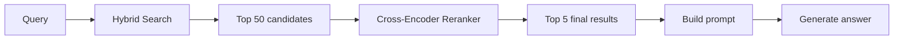
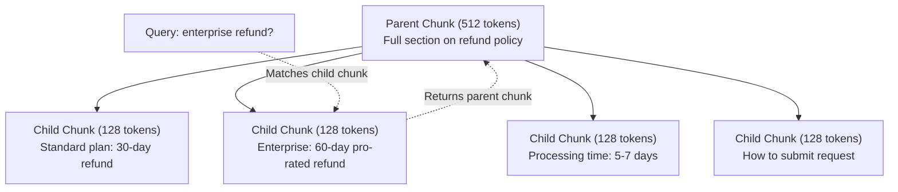
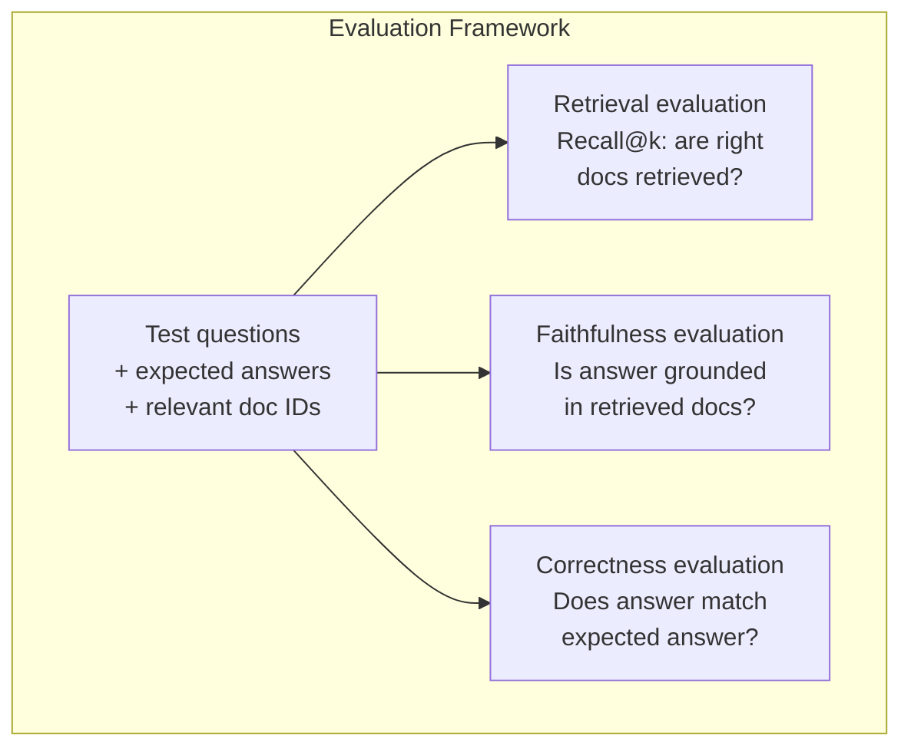

# RAG tiên tiến (Chunking, Ranger, Hybrid Search)

> RAG cơ bản lấy các phần tương tự nhất trên k. Điều đó hoạt động cho các câu hỏi đơn giản. Nó bị phá vỡ cho lý luận đa hop, các truy vấn mơ hồ và các cơ quan lớn. RAG nâng cao là sự khác biệt giữa một bản demo hoạt động trên 10 tài liệu và một hệ thống hoạt động trên 10 triệu.

**Type:** Build
**Languages:** Python
**Prerequisites:** Phase 11, Lesson 06 (RAG)
**Time:** ~90 minutes
**Related:**Giai đoạn 5 · 23 (Chunking Strategies for RAG) bao gồm tất cả sáu thuật toán chunking  tái phát, ngữ nghĩa, câu, tài liệu cha mẹ, chunking muộn, lấy lại ngữ cảnh  với các tiêu chuẩn Vectara / Anthropic. Bài học này xây dựng trên đỉnh: tìm kiếm lai, xếp hạng lại, chuyển đổi truy vấn.

## Mục tiêu học tập

- Thực hiện các chiến lược phân chia tiên tiến (tanthau nghĩa, thu hồi, cha mẹ-child) để bảo vệ cấu trúc và bối cảnh tài liệu
- Xây dựng một đường ống tìm kiếm lai kết hợp từ khóa BM25 phù hợp với tìm kiếm vector ngữ nghĩa và một trình xếp hạng lại mã hóa chéo
- Sử dụng kỹ thuật chuyển đổi truy vấn (HyDE, nhiều truy vấn, bước trở lại) để cải thiện việc truy cập vào các câu hỏi mơ hồ hoặc phức tạp
- Chẩn đoán và khắc phục các lỗi RAG phổ biến: lấy lại phần sai, trả lời không trong ngữ cảnh, phân tích lý luận đa hop

## Vấn đề

Bạn đã xây dựng một đường ống dẫn RAG cơ bản trong bài học 06 nó hoạt động cho các câu hỏi đơn giản trên một tập hợp nhỏ.

**Ambiguous query**"Thiết kế doanh thu quý trước là gì?" Tìm kiếm ngữ nghĩa trả về các phần về chiến lược doanh thu, dự báo doanh thu và suy nghĩ của CFO về tăng trưởng doanh thu. Tất cả đều tương tự như từ " doanh thu". Không có một phần nào chứa số thực tế. Phần chính xác nói "$47.2M in Q3 2025" but uses the word "earnings" instead of "revenue." The embedding model thinks "revenue strategy" is closer to the query than "Q3 earnings were $47,2M".

**Multi-hop question**"Đội nào có điểm số hài lòng khách hàng tốt nhất?" Điều này đòi hỏi phải tìm kiếm điểm số hài lòng cho mỗi nhóm, so sánh chúng và xác định tối đa.

**Large corpus problem**Bạn có 2 triệu khối. Câu trả lời chính xác là trong phần #1,847,293. Tìm kiếm top-5 của bạn kéo các khối # 14, #89,201, #1,200,000, #44, và #901,333. đóng trong không gian nhúng, nhưng không có chứa câu trả lời. Ở quy mô này, tìm kiếm hàng xóm gần nhất đưa ra lỗi đủ để kết quả liên quan được đẩy ra khỏi top-k.

RAG cơ bản thất bại vì sự tương đồng vector không giống nhau với sự liên quan. Một phần có thể tương tự như một câu hỏi mà không hữu ích để trả lời nó. Advanced RAG giải quyết vấn đề này bằng bốn kỹ thuật: tìm kiếm lai (số kết hợp từ khóa), xếp hạng lại (số ứng viên cẩn thận hơn), chuyển đổi truy vấn (làm chính xác truy vấn trước khi tìm kiếm) và phân tích tốt hơn (tại lại với độ phân tích đúng).

## Khái niệm

### Tìm kiếm lai: ngữ nghĩa + từ khóa

Tìm kiếm ngữ nghĩa (sự tương tự vector) là tốt để hiểu ý nghĩa. "Tôi hủy đăng ký của tôi như thế nào?" phù hợp với "Các bước để chấm dứt kế hoạch của bạn" mặc dù họ không chia sẻ các từ. Nhưng nó không có sự phù hợp chính xác. "Công mã lỗi E-4021" có thể không phù hợp với một phần chứa "E-4021" nếu mô hình nhúng xử lý nó như tiếng ồn.

Tìm kiếm từ khóa (BM25) là ngược lại. Nó xuất sắc khi phù hợp chính xác. "E-4021" phù hợp hoàn hảo. Nhưng "hoái đăng ký của tôi" trả lại kết quả không nếu tài liệu nói "hoái kế hoạch của bạn".

Tìm kiếm lai chạy cả hai, sau đó kết hợp kết quả.

#### BM25 Thâm sâu

**BM25**(Best Matching 25) là thuật toán tìm kiếm từ khóa tiêu chuẩn. Nó đã là xương sống của các công cụ tìm kiếm (như Elasticsearch và Lucene) kể từ những năm 1990.

Nếu bạn muốn hiểu nhanh về cách thức BM25 hoạt động, bạn có thể tập trung vào các**three core pillars**(không bị mắc kẹt bởi các công thức toán học):

1. **Term Rarity (IDF: The rarer the term, the higher its weight)**- Có thể là:
   - Ý tưởng cốt lõi là "những điều hiếm gặp tương đương với sự liên quan". Trong một truy vấn, các thuật ngữ phổ biến như "the", "how", "to" xuất hiện trong hầu hết các tài liệu và không giúp xác định tài liệu chính xác. Mặt khác, các thuật ngữ hiếm gặp như "E-4021" (một mã lỗi cụ thể) hoặc "hạt ảo giác" (một chủ đề cụ thể) là rất chọn lọc. BM25 tự động gán trọng lượng cao cho các thuật ngữ và giảm giá hiếm gặp hoặc bỏ qua các thuật ngữ phổ biến.
2. **Term Frequency Saturation (TF Saturation: Repeated hits have diminishing returns, with a ceiling)**- Có thể là:
   - Ý tưởng cốt lõi là ngăn chặn "lập đầy từ khóa". Việc đề cập đến một thuật ngữ một lần là hữu ích, 2 lần là hữu ích hơn một chút, nhưng đề cập đến nó 100 lần không làm cho một tài liệu có liên quan hơn 100 lần. BM25 đặt một giới hạn về phần đóng góp tần số thuật ngữ (được kiểm soát bởi tham số $k_1$(c) Khi một thuật ngữ xuất hiện nhiều lần trong một tài liệu, đóng góp điểm số tăng lên của nó nhanh chóng bão hòa và cao nguyên.
3. **Document Length Normalization (L-Norm: Matching in short documents is more significant)**- Có thể là:
   - Ý tưởng cốt lõi là trừng phạt các tài liệu bị phồng lên, "được hạ nước". Nếu một tiêu đề ngắn 10 từ phù hợp với một từ khóa, và một giấy trắng toàn diện 10.000 từ phù hợp với cùng một từ khóa một lần, tiêu đề ngắn có nhiều khả năng sẽ hoàn toàn dành riêng cho từ khóa đó. BM25 trừng phạt tài liệu dựa trên chiều dài tương đối của chúng (được kiểm soát bởi tham số $b$), tăng cường các tài liệu ngắn hơn và giảm điểm cho các tài liệu dài cực kỳ.

> [!Lưu ý]
> Đối với các công thức toán học chi tiết, dẫn xuất IDF trơn tru, kiểm soát tham số và ví dụ số tính bằng tay từng bước, hãy xem trang chuyên dụng: [BM25 Mathematical Details & Code Alignment](bm25_math_en.md)- Tôi không biết.


### Phối hợp cấp độ tương đối (RRF)

Trong các kiến trúc RAG hoặc Hybrid Search quy mô lớn,**RRF (Reciprocal Rank Fusion)**là thuật toán được áp dụng rộng rãi nhất và thanh lịch nhất để kết hợp danh sách xếp hạng.

Nói đơn giản, logic cốt lõi của RRF là: **disregard raw scores, focus only on ranks**- Tôi không biết.

#### 1. Tại sao chúng ta cần RRF?
Khi xây dựng một hệ thống thu hồi lai, chúng tôi thường sử dụng:
- **Semantic Retrieval (Vector Search)**: Điểm số thường là tương đồng cosine hoặc điểm sản phẩm, thường dao động trong $[-1, 1]$hoặc $[0, 1]$- Tôi không biết.
- **Keyword Retrieval (BM25)**: Điểm là số điểm lơ lửng tích cực không giới hạn (tùy thuộc vào tần suất thuật ngữ và chiều dài tài liệu).

Kết hợp trực tiếp hai điểm số này là không chính xác về mặt toán học vì các quy mô, phân phối và ý nghĩa vật lý của chúng hoàn toàn khác nhau. RRF bỏ qua vấn đề sắp xếp này bằng cách chỉ tập trung vào "nơi tương đối của một tài liệu trong mỗi danh sách", chuẩn hóa các sản xuất của các hệ thống tìm kiếm khác nhau vào một chiều duy nhất.

#### 2. Thâm sâu vào công thức

Đối với một tài liệu ứng cử viên $d$, điểm RRF của nó được tính theo cách sau:

$$RRF\_score(d) = \sum_{R \in Rankings} \frac{1}{k + rank_R(d)}$$

- **$rank_R(d)$**: The rank of document $d$ in the $R$-th retrieval system (1st place is $1$, 10th place is $10$). If the document is absent from a retrieval list, the term is treated as $0$.
- **$k$ (smoothing factor, usually defaults to $60$)**: Prevents top-ranked results from dominating the final score, ensuring ranking robustness.
  - **Without $k$**: The 1st rank gets a weight of $\frac{1}{1} = 1$, while the 2nd rank drops to $\frac{1}{2} = 0.5$. This massive gap allows a "single-list winner" to dominate the combined list.
  - **With $k$**: The 1st rank gets $\frac{1}{60 + 1} \approx 0.0164$, and the 2nd rank gets $\frac{1}{60 + 2} \approx 0.0161$. The gap between top ranks is smoothed, making the fusion of multiple retrieval paths more balanced and robust.

> [!NOTE]
> **RRF Fusion Calculation & Ranking Example:**
> - **Document A**: Ranked 3rd in vector search and 2nd in BM25. Its score is:
>   $$Score(A) = \frac{1}{60 + 3} + \frac{1}{60 + 2} \approx 0.0159 + 0.0161 = 0.0320$$
> - **Document B**: Ranked 1st in vector search but not retrieved by BM25. Its score is:
>   $$Score(B) = \frac{1}{60 + 1} + 0 \approx 0.0164$$
>
> Final ranking: **Document A ($0.0320$) > Document B ($0.0164$)**.

#### 3. Core Philosophy of RRF: Consensus as Truth
RRF aligns perfectly with our retrieval intuition:
- **"Mutual Agreement" beats "Single-Index Winner"**: As shown above, Document A, which ranks highly in both systems, outperforms Document B, which won 1st place in one list but was completely missing in the other.
- **Mitigating Outliers (Noise)**: RRF suppresses false positives from individual retrieval algorithms. If a document ranks 1st in BM25 purely due to a keyword coincidence but is irrelevant to the semantic context (ranking extremely low or absent in vector search), RRF ensures it ranks below documents with solid agreement across both indices.

#### 4. Real-world Engineering Application: Multimodal Video ETL Pipelines
In modern LLM and multimodal systems, RRF is highly effective for processing heterogeneous multi-path data. For example, in a **multimodal video understanding and ETL (Extract, Transform, Load) pipeline**:
- We can leverage models like **Gemini 3.5 Flash** to extract multimodal features from videos and build three independent search indices:
  1. **ASR (Speech-to-Text) Index**: For matching spoken keywords (best suited for BM25 keyword search).
  2. **Visual Scene Semantic Index**: For retrieving visual concepts or specific frames (best suited for multimodal vector search).
  3. **Video Metadata Index**: Containing structured fields like timestamps, categories, or tags (best suited for structured metadata filtering).
- RRF combines ASR retrieval, visual vector search, and metadata query ranks with minimal computational overhead—completely bypassing the need to train or tune expensive Cross-Encoder models—delivering high-recall, high-precision video clip localization.

### Reranking

Retrieval (whether vector, keyword, or hybrid) is fast but imprecise. It uses bi-encoders: the query and each document are embedded independently, then compared. The embeddings are computed once and cached. This scales to millions of documents.

Reranking uses cross-encoders: the query and a candidate document are fed together into a model that outputs a relevance score. The model sees both texts simultaneously and can capture fine-grained interactions between them. A cross-encoder can understand that "What were Q3 earnings?" is highly relevant to a chunk containing "$47.2M in Q3" even if a bi-encoder missed the connection.

The trade-off: cross-encoders are 100-1000x slower than bi-encoders because they process the query-document pair jointly. You cannot pre-compute cross-encoder scores for a million documents. The solution: retrieve a larger candidate set (top-50 from hybrid search), then rerank with a cross-encoder to get the final top-5.



Common reranking models (2026 lineup):
- Cohere Rerank 3.5: managed API, multilingual, best recall gain on mixed corpora
- Voyage rerank-2.5: managed API, lowest latency of the hosted options
- Jina-Reranker-v2 Multilingual: open-weight, 100+ languages
- bge-reranker-v2-m3: open-weight, strong baseline
- cross-encoder/ms-marco-MiniLM-L-6-v2: open-weight, runs on CPU for prototyping
- ColBERTv2 / Jina-ColBERT-v2: late-interaction multi-vector rerankers — O(tokens) not O(docs) at scoring time

### Query Transformation

Sometimes the failure in a RAG system is not due to the retrieval algorithm, but the quality of the user's query itself. A query like `"What was that thing about the new policy change?"` contains no specific entities or keywords, making its embedding representation in the semantic space extremely vague and difficult for any retrieval system to match accurately.

Query transformation leverages an LLM to reformulate, enrich, or rewrite the raw query before initiating the search. The two primary strategies for query transformation are:

#### 1. Query Rewriting: Intent Standardization
Query rewriting focuses on removing colloquial noise from the user's input or resolving context gaps in multi-turn dialogues to sharpen the search intent.

- **The Core Pain Point**: Conversational queries often contain conversational clutter (e.g., "Please tell me," "Can you check," "I want to know about..."). These words dilute the attention weights of key concepts when converted into embeddings, degrading retrieval quality.
- **LLM Solution**: By using a few-shot prompt, the LLM can strip out conversational filler and extract the raw search concepts.
- **Coreference Resolution in Multi-turn Dialogue**: In conversational RAG, users frequently use pronouns or fragments. For example, after asking: "*What is the refund policy for Acme Enterprise?*", a user might ask: "*And what about its processing time?*". Searching with the latter fragment directly would fail. An LLM rewrite resolves this coreference, combining context to output: "*The processing time for Acme Enterprise refund policy*".

```
Colloquial query: "What was that thing about the new policy change?"
LLM Rewrite: "Recent policy changes and updates"
```

#### 2. HyDE (Hypothetical Document Embeddings): Bridging the Asymmetric Gap
HyDE is a highly innovative retrieval paradigm that completely rethinks semantic search.

- **The Core Pain Point (Asymmetric Retrieval)**: In embedding spaces, **questions and answers are linguistically asymmetric**. Questions are short, interrogative, and filled with question words; answers are longer, declarative, and rich in domain-specific terminology. Consequently, a question embedding and an answer embedding can live far apart. For instance, searching for *"What is a distributed lock?"* might retrieve other question chunks containing "What is..." rather than the actual implementation details of distributed locks.
- **LLM Solution (HyDE)**:
  1. **Generate Hypothesis**: Before retrieval, call the LLM to generate a hypothetical answer to the query without any external context (even if this draft contains hallucinations or incorrect metrics, it is perfectly fine).
  2. **Embed the Hypothesis**: Convert this "fake answer" into an embedding vector.
  3. **Search Real Documents**: Use the hypothesis vector to query the database for the most similar "real documents".
- **Why it Works**: The generated "fake answer" and the "real document" share the same declarative style, vocabulary, sentence structures, and domain jargon. In the embedding space, the distance between **"Answer - Answer" is much smaller than the distance between "Question - Answer"**.

```
Query: "What is the refund policy for enterprise?"
Hypothetical Answer (Hallucinated draft): "Enterprise customers are eligible for a full refund within 60 days of purchase. Refunds are pro-rated based on the remaining subscription period and processed within 5-7 business days."
(The system embeds this hypothesis to retrieve similar real docs)
```

- **The Latency Trade-off**: HyDE introduces an extra LLM call prior to retrieval, adding 500ms to 2000ms of latency depending on the model. In production, it is typically reserved for queries that are highly abstract, short, or suffer from extreme asymmetry.

### Parent-Child Chunking

In production environments, traditional "fixed-size chunking" (e.g., splitting texts uniformly into 300 tokens) often hits a **dilemma where you cannot optimize for both retrieval and synthesis**. Parent-child chunking elegantly resolves this by **decoupling the retrieval granularity from the synthesis (inference) granularity**.

#### 1. The Dilemma of Traditional Chunking
When building indices for long documents or metadata, you must choose between:
- **Small chunks (e.g., 100 tokens)**: The vector representations are highly precise and excel at matching specific user queries (e.g., specific part numbers or contract clauses). However, because they lack surrounding context, the LLM receives isolated text fragments, often leading to out-of-context reasoning or hallucinations.
- **Large chunks (e.g., 1000 tokens)**: The context is rich enough for synthesis, but the core features are diluted by surrounding conversational noise. This dilution makes it significantly harder for vector databases to rank the correct document highly, dropping search recall.

#### 2. The Solution: Separating "Search" from "Read"
The philosophy of parent-child chunking is: **"Search with a needle, read with a net."**

In the database design, data is structured into two hierarchical layers:
1. **Child Chunks (fine-grained)**: e.g., 128 tokens. These are embedded and stored in the vector index. Because they are short and semantically pure, they act as sensitive sensors that respond to specific details in user queries.
2. **Parent Chunks (coarse-grained)**: e.g., 512 or 1024 tokens (which contain the child chunks). These do not participate in vector similarity search. Instead, they are stored in a raw text format within a document store (e.g., a Key-Value database or relational database) and mapped to child chunks via a `Parent_ID` field.



#### 3. Execution Workflow
- **Step 1 (Search)**: The user issues a query. The vector database matches and retrieves the relevant **child chunk**.
- **Step 2 (Fetch)**: The backend uses the `Parent_ID` of the matched child chunk to retrieve the corresponding full **parent chunk** from the document store.
- **Step 3 (Read)**: The full text of the parent chunk is injected into the LLM prompt as context, allowing the LLM to generate precise, grounded answers in a complete context with full reasoning capability.

### Metadata Filtering

Before running vector search, filter the corpus by metadata: date, source, category, author, language. This reduces the search space and prevents irrelevant results.

"What changed in the security policy last month?" should only search documents from the last 30 days in the security category. Without metadata filtering, you search the entire corpus and might retrieve a 2-year-old security document that happens to be semantically similar.

Production RAG systems store metadata alongside each chunk: source document, creation date, category, author, version. Vector databases support pre-filtering by metadata before similarity search, which is critical for performance at scale.

### Evaluation

You built a RAG system. How do you know if it works? Three metrics:

**Retrieval relevance (Recall@k)**: for a set of test questions with known relevant documents, what percentage of relevant documents appear in the top-k results? If the answer to a question is in chunk #47, does chunk #47 appear in the top-5?

**Faithfulness**: is the generated answer grounded in the retrieved documents? If the retrieved chunks say "60-day refund window" and the model says "90-day refund window," that is a faithfulness failure. The model hallucinated despite having the correct context.

**Answer correctness**: does the generated answer match the expected answer? This is the end-to-end metric. It combines retrieval quality and generation quality.

A simple faithfulness check: take each claim in the generated answer and verify it appears (in substance) in the retrieved chunks. If the answer contains a fact not in any retrieved chunk, it is likely hallucinated.



```figure
agentic-rag-loop
```

## Build It

### Step 1: BM25 Implementation

```python
import math
from collections import Counter

class BM25:
    def __init__(self, k1=1.2, b=0.75):
        self.k1 = k1
        self.b = b
        self.docs = []
        self.doc_lengths = []
        self.avg_dl = 0
        self.doc_freqs = {}
        self.n_docs = 0

    def index(self, documents):
        self.docs = documents
        self.n_docs = len(documents)
        self.doc_lengths = []
        self.doc_freqs = {}

        for doc in documents:
            words = doc.lower().split()
            self.doc_lengths.append(len(words))
            unique_words = set(words)
            for word in unique_words:
                self.doc_freqs[word] = self.doc_freqs.get(word, 0) + 1

        self.avg_dl = sum(self.doc_lengths) / self.n_docs if self.n_docs else 1

    def score(self, query, doc_idx):
        query_words = query.lower().split()
        doc_words = self.docs[doc_idx].lower().split()
        doc_len = self.doc_lengths[doc_idx]
        word_counts = Counter(doc_words)
        score = 0.0

        for term in query_words:
            if term not in word_counts:
                continue
            tf = word_counts[term]
            df = self.doc_freqs.get(term, 0)
            idf = math.log((self.n_docs - df + 0.5) / (df + 0.5) + 1)
            numerator = tf * (self.k1 + 1)
            denominator = tf + self.k1 * (1 - self.b + self.b * doc_len / self.avg_dl)
            score += idf * numerator / denominator

        return score

    def search(self, query, top_k=10):
        scores = [(i, self.score(query, i)) for i in range(self.n_docs)]
        scores.sort(key=lambda x: x[1], reverse=True)
        return scores[:top_k]
```

### Step 2: Reciprocal Rank Fusion

```python
def reciprocal_rank_fusion(ranked_lists, k=60):
    scores = {}
    for ranked_list in ranked_lists:
        for rank, (doc_id, _) in enumerate(ranked_list):
            if doc_id not in scores:
                scores[doc_id] = 0.0
            scores[doc_id] += 1.0 / (k + rank + 1)
    fused = sorted(scores.items(), key=lambda x: x[1], reverse=True)
    return fused
```

### Step 3: Hybrid Search Pipeline

```python
def hybrid_search(query, chunks, vector_embeddings, vocab, idf, bm25_index, top_k=5, fusion_k=60):
    query_emb = tfidf_embed(query, vocab, idf)
    vector_results = search(query_emb, vector_embeddings, top_k=top_k * 3)
    bm25_results = bm25_index.search(query, top_k=top_k * 3)
    fused = reciprocal_rank_fusion([vector_results, bm25_results], k=fusion_k)
    return fused[:top_k]
```

### Step 4: Simple Reranker

In production, you would use a cross-encoder model. Here we build a reranker that scores query-document relevance using word overlap, term importance, and phrase matching.

```python
def rerank(query, candidates, chunks):
    query_words = set(query.lower().split())
    stop_words = {"the", "a", "an", "is", "are", "was", "were", "what", "how",
                  "why", "when", "where", "do", "does", "for", "of", "in", "to",
                  "and", "or", "on", "at", "by", "it", "its", "this", "that",
                  "with", "from", "be", "has", "have", "had", "not", "but"}
    query_terms = query_words - stop_words

    scored = []
    for doc_id, initial_score in candidates:
        chunk = chunks[doc_id].lower()
        chunk_words = set(chunk.split())

        term_overlap = len(query_terms & chunk_words)

        query_bigrams = set()
        q_list = [w for w in query.lower().split() if w not in stop_words]
        for i in range(len(q_list) - 1):
            query_bigrams.add(q_list[i] + " " + q_list[i + 1])
        bigram_matches = sum(1 for bg in query_bigrams if bg in chunk)

        position_boost = 0
        for term in query_terms:
            pos = chunk.find(term)
            if pos != -1 and pos < len(chunk) // 3:
                position_boost += 0.5

        rerank_score = (
            term_overlap * 1.0
            + bigram_matches * 2.0
            + position_boost
            + initial_score * 5.0
        )
        scored.append((doc_id, rerank_score))

    scored.sort(key=lambda x: x[1], reverse=True)
    return scored
```

### Step 5: HyDE (Hypothetical Document Embeddings)

```python
def hyde_generate_hypothesis(query):
    templates = {
        "what": "The answer to '{query}' is as follows: Based on our documentation, {topic} involves specific policies and procedures that define how the process works.",
        "how": "To address '{query}': The process involves several steps. First, you need to initiate the request. Then, the system processes it according to the defined rules.",
        "default": "Regarding '{query}': Our records indicate specific details and policies related to this topic that provide a comprehensive answer."
    }
    query_lower = query.lower()
    if query_lower.startswith("what"):
        template = templates["what"]
    elif query_lower.startswith("how"):
        template = templates["how"]
    else:
        template = templates["default"]

    topic_words = [w for w in query.lower().split()
                   if w not in {"what", "is", "the", "how", "do", "does", "a", "an",
                                "for", "of", "to", "in", "on", "at", "by", "and", "or"}]
    topic = " ".join(topic_words) if topic_words else "this topic"

    return template.format(query=query, topic=topic)


def hyde_search(query, chunks, vector_embeddings, vocab, idf, top_k=5):
    hypothesis = hyde_generate_hypothesis(query)
    hypothesis_emb = tfidf_embed(hypothesis, vocab, idf)
    results = search(hypothesis_emb, vector_embeddings, top_k)
    return results, hypothesis
```

### Step 6: Parent-Child Chunking

```python
def create_parent_child_chunks(text, parent_size=200, child_size=50):
    words = text.split()
    parents = []
    children = []
    child_to_parent = {}

    parent_idx = 0
    start = 0
    while start < len(words):
        parent_end = min(start + parent_size, len(words))
        parent_text = " ".join(words[start:parent_end])
        parents.append(parent_text)

        child_start = start
        while child_start < parent_end:
            child_end = min(child_start + child_size, parent_end)
            child_text = " ".join(words[child_start:child_end])
            child_idx = len(children)
            children.append(child_text)
            child_to_parent[child_idx] = parent_idx
            child_start += child_size

        parent_idx += 1
        start += parent_size

    return parents, children, child_to_parent
```

### Step 7: Faithfulness Evaluation

```python
def evaluate_faithfulness(answer, retrieved_chunks):
    answer_sentences = [s.strip() for s in answer.split(".") if len(s.strip()) > 10]
    if not answer_sentences:
        return 1.0, []

    grounded = 0
    ungrounded = []
    context = " ".join(retrieved_chunks).lower()

    for sentence in answer_sentences:
        words = set(sentence.lower().split())
        stop_words = {"the", "a", "an", "is", "are", "was", "were", "and", "or",
                      "to", "of", "in", "for", "on", "at", "by", "it", "this", "that"}
        content_words = words - stop_words
        if not content_words:
            grounded += 1
            continue

        matched = sum(1 for w in content_words if w in context)
        ratio = matched / len(content_words) if content_words else 0

        if ratio >= 0.5:
            grounded += 1
        else:
            ungrounded.append(sentence)

    score = grounded / len(answer_sentences) if answer_sentences else 1.0
    return score, ungrounded


def evaluate_retrieval_recall(queries_with_relevant, retrieval_fn, k=5):
    total_recall = 0.0
    results = []

    for query, relevant_indices in queries_with_relevant:
        retrieved = retrieval_fn(query, k)
        retrieved_indices = set(idx for idx, _ in retrieved)
        relevant_set = set(relevant_indices)
        hits = len(retrieved_indices & relevant_set)
        recall = hits / len(relevant_set) if relevant_set else 1.0
        total_recall += recall
        results.append({
            "query": query,
            "recall": recall,
            "hits": hits,
            "total_relevant": len(relevant_set)
        })

    avg_recall = total_recall / len(queries_with_relevant) if queries_with_relevant else 0
    return avg_recall, results
```

## Use It

With a real cross-encoder for reranking:

```python
from sentence_transformers import CrossEncoder

reranker = CrossEncoder("cross-encoder/ms-marco-MiniLM-L-6-v2")

def rerank_with_cross_encoder(query, candidates, chunks, top_k=5):
    pairs = [(query, chunks[doc_id]) for doc_id, _ in candidates]
    scores = reranker.predict(pairs)
    scored = list(zip([doc_id for doc_id, _ in candidates], scores))
    scored.sort(key=lambda x: x[1], reverse=True)
    return scored[:top_k]
```

With Cohere's managed reranker:

```python
import cohere

co = cohere.Client()

def rerank_with_cohere(query, candidates, chunks, top_k=5):
    docs = [chunks[doc_id] for doc_id, _ in candidates]
    response = co.rerank(
        model="rerank-english-v3.0",
        query=query,
        documents=docs,
        top_n=top_k
    )
    return [(candidates[r.index][0], r.relevance_score) for r in response.results]
```

For HyDE with a real LLM:

```python
import anthropic

client = anthropic.Anthropic()

def hyde_with_llm(query):
    response = client.messages.create(
        model="claude-sonnet-5",
        max_tokens=256,
        messages=[{
            "role": "user",
            "content": f"Write a short paragraph that would be a good answer to this question. Do not say you don't know. Just write what the answer would look like.\n\nQuestion: {query}"
        }]
    )
    return response.content[0].text
```

For production hybrid search with Weaviate:

```python
import weaviate

client = weaviate.connect_to_local()

collection = client.collections.get("Documents")
response = collection.query.hybrid(
    query="enterprise refund policy",
    alpha=0.5,
    limit=10
)
```

The alpha parameter controls the balance: 0.0 = pure keyword (BM25), 1.0 = pure vector, 0.5 = equal weight. Most production systems use alpha between 0.3 and 0.7.

## Ship It

This lesson produces:
- `outputs/prompt-advanced-rag-debugger.md` -- a prompt for diagnosing and fixing RAG quality issues
- `outputs/skill-advanced-rag.md` -- a skill for building production-grade RAG with hybrid search and reranking

## Exercises

1. Compare BM25 vs vector search vs hybrid search on the sample documents. For each of the 5 test queries, record which approach returns the most relevant chunk in position #1. Hybrid search should win on at least 3 out of 5.

2. Implement a metadata filter. Add a "category" field to each document (security, billing, api, product). Before running vector search, filter chunks to only the relevant category. Test with "What encryption is used?" and verify it only searches security-category chunks.

3. Build a full HyDE pipeline using the simple generate function from Lesson 06. Compare retrieval quality (top-3 relevance) between direct query search and HyDE search on all 5 test queries. HyDE should improve results for vague queries.

4. Implement the parent-child chunking strategy on the sample documents. Use child_size=30 and parent_size=100. Search with child chunks but return parent chunks in the prompt. Compare the generated answers to standard chunking with chunk_size=50.

5. Create an evaluation dataset: 10 questions with known answer chunks. Measure Recall@3, Recall@5, and Recall@10 for (a) vector search only, (b) BM25 only, (c) hybrid search, (d) hybrid + reranking. Plot the results and identify where reranking helps most.

## Key Terms

| Term | What people say | What it actually means |
|------|----------------|----------------------|
| BM25 | "Keyword search" | A probabilistic ranking algorithm that scores documents by term frequency, inverse document frequency, and document length normalization |
| Hybrid search | "Best of both worlds" | Running semantic (vector) and keyword (BM25) search in parallel, then merging results with rank fusion |
| Reciprocal Rank Fusion | "Merge ranked lists" | Combining multiple ranked lists by summing 1/(k + rank) for each document across all lists |
| Reranking | "Second pass scoring" | Using a more expensive cross-encoder model to re-score a candidate set from initial retrieval |
| Cross-encoder | "Joint query-document model" | A model that takes a query and document as a single input, producing a relevance score; more accurate than bi-encoders but too slow for full corpus search |
| Bi-encoder | "Independent embedding model" | A model that embeds queries and documents independently; fast because embeddings are precomputed, but less accurate than cross-encoders |
| HyDE | "Search with a fake answer" | Generate a hypothetical answer to the query, embed it, and search for real documents similar to it |
| Parent-child chunking | "Small search, big context" | Index small chunks for precise retrieval but return the larger parent chunk to provide sufficient context |
| Metadata filtering | "Narrow before searching" | Filtering documents by attributes (date, source, category) before running vector search to reduce the search space |
| Faithfulness | "Did it stay grounded" | Whether the generated answer is supported by the retrieved documents, as opposed to hallucinated from the model's training data |

## Further Reading

- Robertson & Zaragoza, "The Probabilistic Relevance Framework: BM25 and Beyond" (2009) -- the definitive reference for BM25, explaining the probabilistic foundations behind the formula
- Cormack et al., "Reciprocal Rank Fusion Outperforms Condorcet and Individual Rank Learning Methods" (2009) -- the original RRF paper showing it beats more complex fusion methods
- Gao et al., "Precise Zero-Shot Dense Retrieval without Relevance Labels" (2022) -- the HyDE paper demonstrating that hypothetical document embeddings improve retrieval without any training data
- Nogueira & Cho, "Passage Re-ranking with BERT" (2019) -- showed cross-encoder reranking on top of BM25 significantly improves retrieval quality
- [Khattab et al., "DSPy: Compiling Declarative Language Model Calls into Self-Improving Pipelines" (2023)](https://arxiv.org/abs/2310.03714) -- treats prompt construction and weight selection as an optimization problem over retrieval pipelines; read this for "program LLMs" instead of "prompt LLMs."
- [Edge et al., "From Local to Global: A Graph RAG Approach to Query-Focused Summarization" (Microsoft Research 2024)](https://arxiv.org/abs/2404.16130) -- GraphRAG paper: entity-relation extraction + Leiden community detection for query-focused summarization; the global vs local retrieval distinction.
- [Asai et al., "Self-RAG: Learning to Retrieve, Generate, and Critique through Self-Reflection" (ICLR 2024)](https://arxiv.org/abs/2310.11511) -- self-evaluating RAG with reflection tokens; the agentic frontier past static retrieve-then-generate.
- [LangChain Query Construction blog](https://blog.langchain.dev/query-construction/) -- how to translate natural-language queries into structured database queries (Text-to-SQL, Cypher) as a pre-retrieval step.
