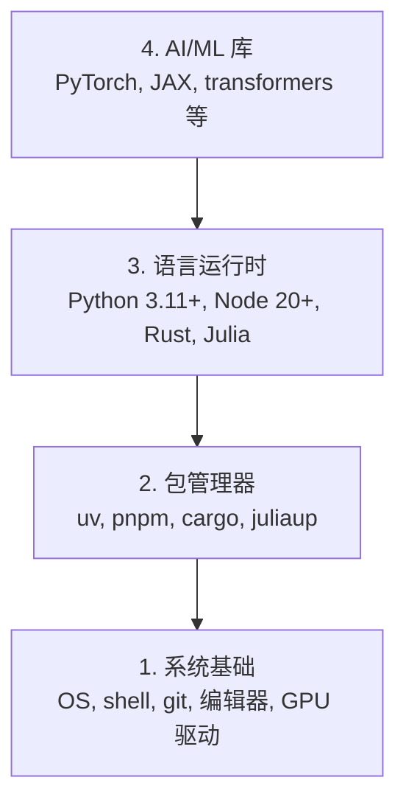

# 开发环境

> 你的工具会影响你的思路。只需设置一次，务必设置正确。

**Type:** 构建  
**Languages:** Python, Node.js, Rust  
**Prerequisites:** 无  
**Time:** ~45 分钟

## 学习目标

- 从头设置 Python 3.11+、Node.js 20+ 和 Rust 工具链  
- 为可重复构建配置虚拟环境和包管理器  
- 验证 CUDA/MPS 下的 GPU 访问并运行测试张量操作  
- 了解由四层构成的堆栈：系统、包管理器、运行时、AI 库

## 问题

你将使用 Python、TypeScript、Rust 和 Julia 学习 200+ 节课的 AI 工程。如果你的开发环境有问题，每一节课都会变成与工具链的斗争，而不是学习。

大多数人会跳过环境设置，随后花数小时调试导入错误、版本冲突和缺失的 CUDA 驱动。我们这次要把它做好，一劳永逸。

## 概念

一个 AI 工程环境由四层构成：



我们自下而上安装。每一层都依赖于其下方的那一层。

## 构建流程

### 步骤 1：系统基础

检查你的系统并安装基础组件。

```bash
# macOS（macOS 系统）
xcode-select --install
brew install git curl wget

# Ubuntu/Debian（Linux）
sudo apt update && sudo apt install -y build-essential git curl wget

# Windows（使用 WSL2）
wsl --install -d Ubuntu-24.04
```

### 步骤 2：使用 uv 安装 Python

我们使用 `uv` — 它比 pip 快 10-100 倍，并且自动处理虚拟环境。

```bash
curl -LsSf https://astral.sh/uv/install.sh | sh

uv python install 3.12

uv venv
source .venv/bin/activate  # 或在 Windows 上使用 .venv\Scripts\activate

uv pip install numpy matplotlib jupyter
```

验证：

```python
import sys
print(f"Python {sys.version}")

import numpy as np
print(f"NumPy {np.__version__}")
a = np.array([1, 2, 3])
print(f"Vector: {a}, dot product with itself: {np.dot(a, a)}")
```

### 步骤 3：使用 pnpm 安装 Node.js

用于 TypeScript 课程（agents、MCP 服务器、Web 应用）。

```bash
curl -fsSL https://fnm.vercel.app/install | bash
fnm install 22
fnm use 22

npm install -g pnpm

node -e "console.log('Node', process.version)"
```

### 步骤 4：Rust

用于性能关键的课程（推理、系统）。

```bash
curl --proto '=https' --tlsv1.2 -sSf https://sh.rustup.rs | sh

rustc --version
cargo --version
```

### 步骤 5：Julia（可选）

用于数学密集型课程，Julia 表现出色。

```bash
curl -fsSL https://install.julialang.org | sh

julia -e 'println("Julia ", VERSION)'
```

### 步骤 6：GPU 设置（如果你有 GPU）

```bash
# NVIDIA（检查英伟达 GPU）
nvidia-smi

# 使用 CUDA 安装 PyTorch
uv pip install torch torchvision torchaudio --index-url https://download.pytorch.org/whl/cu124
```

```python
import torch
print(f"CUDA available: {torch.cuda.is_available()}")
if torch.cuda.is_available():
    print(f"GPU: {torch.cuda.get_device_name(0)}")
```

没有 GPU？没关系。大多数课程在 CPU 上也能运行。对于训练密集型课程，请使用 Google Colab 或云端 GPU。

### 步骤 7：验证所有内容

运行验证脚本：

```bash
python phases/00-setup-and-tooling/01-dev-environment/code/verify.py
```

## 使用指南

你的环境现在已为本课程的每一节课做好准备。以下是你将在各处使用的语言和包管理器：

| 语言 | 使用于 | 包管理器 |
|------|--------|----------|
| Python | 阶段 1-12（机器学习、深度学习、自然语言处理、视觉、音频、大型语言模型） | uv |
| TypeScript | 阶段 13-17（工具、agents、群体、基础设施） | pnpm |
| Rust | 阶段 12、15-17（性能关键系统） | cargo |
| Julia | 阶段 1（数学基础） | Pkg |

## 交付

本课会产出一个验证脚本，任何人都可以运行该脚本来检查他们的设置。

参见 `outputs/prompt-env-check.md`，其中包含一个可以帮助 AI 助手诊断环境问题的提示词。

## 练习

1. 运行验证脚本并修复任何失败项  
2. 为本课程创建一个 Python 虚拟环境并安装 PyTorch  
3. 用这四种语言分别写一个 "hello world" 并运行每一个