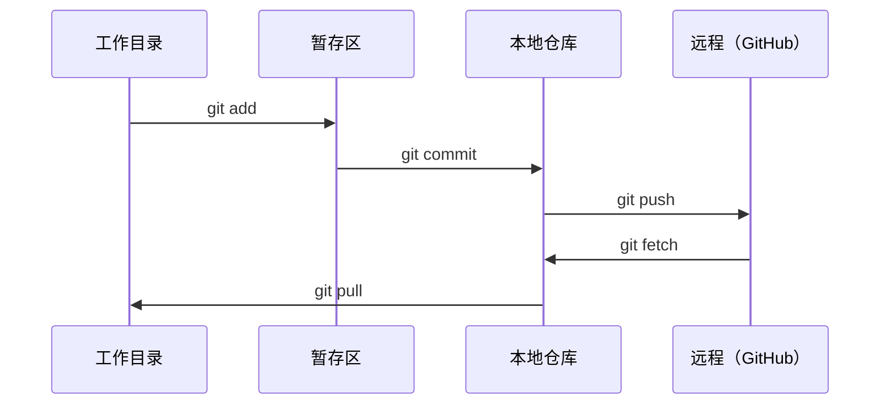

# Git 与 协作

> 版本控制不是可选的。每一次实验、每一个模型、你在这里构建的每一课都会被追踪。

**Type:** 学习  
**Languages:** --  
**Prerequisites:** Phase 0, Lesson 01  
**Time:** ~30 分钟

## 学习目标

- 配置 git 身份并使用日常工作流：add、commit、push
- 为独立实验创建并合并分支，不破坏 main 分支
- 编写一个 `.gitignore`，以排除模型检查点和大型二进制文件
- 使用 `git log` 浏览提交历史以理解项目演进

## 问题背景

你将要在 20 个阶段中编写数百个代码文件。没有版本控制，你会丢失工作、引入无法撤销的问题，并且无法与他人协作。

Git 是工具。GitHub 是代码托管的地方。本课覆盖本课程所需的内容，不多也不少。

## 概念



三点要记住：
1. 经常保存 (`git commit`)
2. 推送到远程 (`git push`)
3. 为实验创建分支 (`git checkout -b experiment`)

## 实操

### 第 1 步：配置 git

```bash
git config --global user.name "Your Name"
git config --global user.email "you@example.com"
```

### 第 2 步：日常工作流

```bash
git status
git add file.py
git commit -m "Add perceptron implementation"
git push origin main
```

### 第 3 步：为实验创建分支

```bash
git checkout -b experiment/new-optimizer

# ... 进行更改并提交 ...

git checkout main
git merge experiment/new-optimizer
```

### 第 4 步：在本课程仓库中工作

```bash
git clone https://github.com/rohitg00/ai-engineering-from-scratch.git
cd ai-engineering-from-scratch

git checkout -b my-progress
# 按课程进行学习并提交你的代码
git push origin my-progress
```

## 使用指南

对于本课程，你只需要下面这些命令：

| Command | When |
|---------|------|
| `git clone` | 获取课程仓库 |
| `git add` + `git commit` | 保存你的工作 |
| `git push` | 备份到 GitHub |
| `git checkout -b` | 在不破坏 main 的情况下尝试新东西 |
| `git log --oneline` | 查看你的操作记录 |

就是这些。本课程不需要 rebase、cherry-pick 或子模块。

## 练习

1. 克隆此仓库，创建一个名为 `my-progress` 的分支，创建一个文件，提交它并推送  
2. 创建一个 `.gitignore`，排除模型检查点文件（`.pt`、`.pth`、`.safetensors`）  
3. 使用 `git log --oneline` 查看该仓库的提交历史，阅读课程是如何被添加的

## 关键词

| 术语 | 常见说法 | 实际含义 |
|------|--------|--------|
| 提交 (Commit) | “保存” | 在某一时刻对整个项目的快照 |
| 分支 (Branch) | “一个副本” | 指向某个提交的指针，随着你的工作向前移动 |
| 合并 (Merge) | “合并代码” | 将一个分支的更改应用到另一个分支 |
| 远程 (Remote) | “云端” | 托管在其他地方的仓库副本（GitHub、GitLab） |