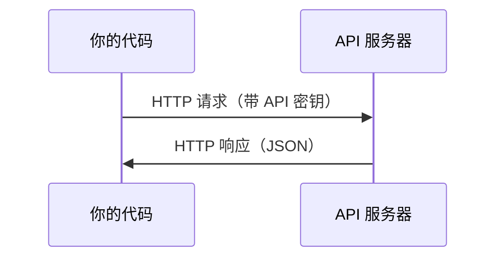

# APIs & Keys

> Every AI API works the same way: send a request, get a response. The details change, the pattern doesn't.

**Type:** 构建  
**Languages:** Python, TypeScript  
**Prerequisites:** Phase 0, Lesson 01  
**Time:** ~30 分钟

## Learning Objectives

- 使用环境变量和 `.env` 文件安全存储 API 密钥
- 使用 Anthropic Python SDK 和 原始 HTTP 两种方式调用 LLM（大型语言模型）API
- 比较基于 SDK 与原始 HTTP 的请求/响应 格式以便调试
- 识别并处理常见 API 错误（包括认证和速率限制）

## The Problem

从 Phase 11 开始，你会调用 LLM API（Anthropic、OpenAI、Google）。在 Phase 13-16 中你将构建在循环中使用这些 API 的智能体（agents）。你需要了解 API 密钥如何工作、如何安全存储它们，以及如何发出第一个 API 请求。

## The Concept



每次 API 调用都有：
1. 一个端点（URL）
2. 一个 API 密钥（认证）
3. 一个请求体（你要的内容）
4. 一个响应体（返回给你的内容）

## Build It

### Step 1: Store API keys safely

绝不要把 API 密钥写入代码。使用环境变量。

```bash
export ANTHROPIC_API_KEY="sk-ant-..."
export OPENAI_API_KEY="sk-..."
```

或者使用 `.env` 文件（将其添加到 `.gitignore`）：

```
ANTHROPIC_API_KEY=sk-ant-...
OPENAI_API_KEY=sk-...
```

### Step 2: First API call (Python)

```python
import anthropic

client = anthropic.Anthropic()

response = client.messages.create(
    model="claude-sonnet-4-20250514",
    max_tokens=256,
    messages=[{"role": "user", "content": "What is a neural network in one sentence?"}]
)

print(response.content[0].text)
```

### Step 3: First API call (TypeScript)

```typescript
import Anthropic from "@anthropic-ai/sdk";

const client = new Anthropic();

const response = await client.messages.create({
  model: "claude-sonnet-4-20250514",
  max_tokens: 256,
  messages: [{ role: "user", content: "What is a neural network in one sentence?" }],
});

console.log(response.content[0].text);
```

### Step 4: Raw HTTP (no SDK)

```python
import os
import urllib.request
import json

url = "https://api.anthropic.com/v1/messages"
headers = {
    "Content-Type": "application/json",
    "x-api-key": os.environ["ANTHROPIC_API_KEY"],
    "anthropic-version": "2023-06-01",
}
body = json.dumps({
    "model": "claude-sonnet-4-20250514",
    "max_tokens": 256,
    "messages": [{"role": "user", "content": "What is a neural network in one sentence?"}],
}).encode()

req = urllib.request.Request(url, data=body, headers=headers, method="POST")
with urllib.request.urlopen(req) as resp:
    result = json.loads(resp.read())
    print(result["content"][0]["text"])
```

这就是 SDK 在底层所做的工作。理解原始 HTTP 调用在调试时非常有帮助。

## Use It

For this course:

| API | When you need it | Free tier |
|-----|-----------------|-----------|
| Anthropic (Claude) | Phases 11-16（智能体 agents、工具） | 注册时赠送 $5 学分 |
| OpenAI | Phase 11（对比） | 注册时赠送 $5 学分 |
| Hugging Face | Phases 4-10（模型、数据集） | 免费 |

你现在不需要全部设置。按课程需要在相应课时进行配置。

## Ship It

This lesson produces:
- `outputs/prompt-api-troubleshooter.md` - 诊断常见 API 错误

## Exercises

1. 获取一个 Anthropic API 密钥并发出你的第一个 API 调用  
2. 尝试原始 HTTP 版本，并将响应格式与 SDK 版本进行比较  
3. 故意使用错误的 API 密钥并阅读错误信息

## Key Terms

| Term | What people say | What it actually means |
|------|----------------|----------------------|
| API key | "Password for the API" | 唯一字符串，标识你的账户并授权请求 |
| Rate limit | "They're throttling me" | 每分钟/每小时的最大请求数，用于防止滥用并保证公平使用 |
| Token | "A word" (in API context) | 计费单位：输入和输出的 token 分别计数并收费 |
| Streaming | "Real-time responses" | 流式传输：逐词/逐片段接收响应，而不是等待完整响应返回