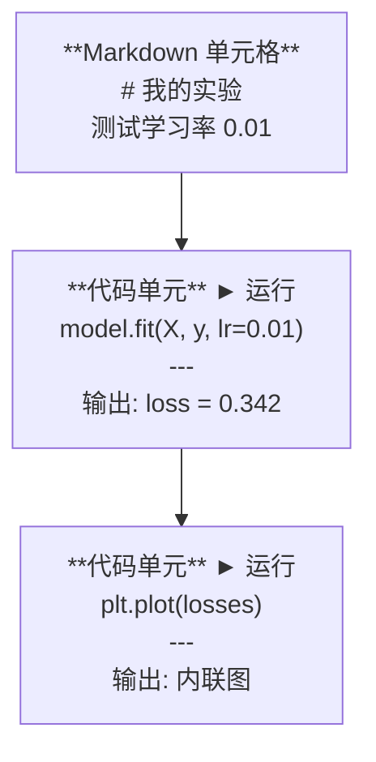
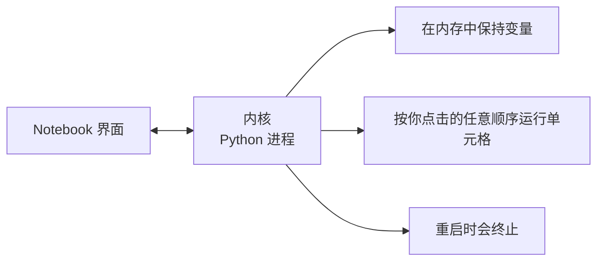

# Jupyter 笔记本

> 笔记本是 AI 工程的实验台。你在这里进行原型验证，然后将可行的部分迁移到生产环境。

**Type:** 构建  
**Languages:** Python  
**Prerequisites:** Phase 0, Lesson 01  
**Time:** ~30 分钟

## 学习目标

- 安装并启动 JupyterLab、Jupyter Notebook，或在 VS Code 中使用 Jupyter 扩展
- 使用魔法命令（`%timeit`, `%%time`, `%matplotlib inline`）进行基准测试并在内联中可视化
- 区分何时使用笔记本与脚本，并应用“在笔记本中探索，在脚本中交付”的工作流
- 识别并避免常见的笔记本陷阱：无序执行、隐藏状态和内存泄漏

## 问题陈述

每篇 AI 论文、教程和 Kaggle 竞赛都会使用 Jupyter 笔记本。它们允许你分块运行代码、在内联查看输出、将代码与说明混合，并快速迭代。如果你尝试在没有笔记本的情况下学习 AI，那就像做数学作业却没有草稿纸。

但笔记本也有真正的陷阱。人们把它们用于一切场景，包括那些本不该用笔记本做的事情。知道什么时候用笔记本、什么时候用脚本，会在以后帮你避免很多调试噩梦。

## 概念

笔记本由一系列单元格组成。每个单元格要么是代码，要么是文本。



内核是后台运行的 Python 进程。当你运行一个单元格时，单元格中的代码会发送到内核，内核执行并返回结果。所有单元格共享同一个内核，因此变量会在单元格之间持续存在。



那句“按你点击的任意顺序运行单元格”既是超强功能，也是自伤之处。

## 实操

### 第 1 步：选择你的界面

三种选项，同一种格式：

| Interface | Install | Best for |
|-----------|---------|----------|
| JupyterLab | `pip install jupyterlab` then `jupyter lab` | 完整的 IDE 体验，多标签、文件浏览器、终端 |
| Jupyter Notebook | `pip install notebook` then `jupyter notebook` | 简单、轻量、一次一个笔记本 |
| VS Code | Install "Jupyter" extension | 集成在你现有编辑器中，git 集成，调试支持 |

三者都读取和写入相同的 `.ipynb` 文件。选你喜欢的。JupyterLab 在 AI 工作中最常见。

```bash
pip install jupyterlab
jupyter lab
```

### 第 2 步：重要的键盘快捷键

你在两种模式间切换。按 `Escape` 进入命令模式（左侧蓝条），按 `Enter` 进入编辑模式（绿色条）。

**命令模式（最常用）：**

| Key | Action |
|-----|--------|
| `Shift+Enter` | 运行单元格，移动到下一个 |
| `A` | 在上方插入单元格 |
| `B` | 在下方插入单元格 |
| `DD` | 删除单元格 |
| `M` | 转为 Markdown |
| `Y` | 转为代码 |
| `Z` | 撤销单元格操作 |
| `Ctrl+Shift+H` | 显示所有快捷键 |

**编辑模式：**

| Key | Action |
|-----|--------|
| `Tab` | 自动补全 |
| `Shift+Tab` | 显示函数签名 |
| `Ctrl+/` | 切换注释 |

`Shift+Enter` 是你每天会用上千次的操作。先学会它。

### 第 3 步：单元格类型

**代码单元**运行 Python 并显示输出：

```python
import numpy as np
data = np.random.randn(1000)
data.mean(), data.std()
```

输出: `(0.0032, 0.9987)`

**Markdown 单元**渲染格式化文本。用它来记录你在做什么以及为什么这么做。支持标题、加粗、斜体、LaTeX 数学（`$E = mc^2$`）、表格和图片。

### 第 4 步：魔法命令

这些不是 Python。它们是以 `%`（行魔法）或 `%%`（单元格魔法）开头的 Jupyter 特定命令。

**计时你的代码：**

```python
%timeit np.random.randn(10000)
```

输出: `45.2 us +/- 1.3 us per loop`

```python
%%time
model.fit(X_train, y_train, epochs=10)
```

输出: `Wall time: 2.34 s`

`%timeit` 会多次运行代码并取平均。`%%time` 只运行一次。对于微基准测试用 `%timeit`，对于训练类运行用 `%%time`。

**启用内联绘图：**

```python
%matplotlib inline
```

每个 `plt.plot()` 或 `plt.show()` 现在会直接在笔记本中渲染。

**在笔记本中安装包而不离开：**

```python
!pip install scikit-learn
```

`!` 前缀运行任意 shell 命令。

**检查环境变量：**

```python
%env CUDA_VISIBLE_DEVICES
```

### 第 5 步：在内联显示丰富输出

笔记本会自动显示单元格中的最后一个表达式。但你可以控制显示内容：

```python
import pandas as pd

df = pd.DataFrame({
    "model": ["Linear", "Random Forest", "Neural Net"],
    "accuracy": [0.72, 0.89, 0.94],
    "training_time": [0.1, 2.3, 45.6]
})
df
```

这会渲染为格式化的 HTML 表格，而不是文本转储。绘图也是一样：

```python
import matplotlib.pyplot as plt

plt.figure(figsize=(8, 4))
plt.plot([1, 2, 3, 4], [1, 4, 2, 3])
plt.title("Inline Plot")
plt.show()
```

图会出现在单元格下方。这就是为什么笔记本在 AI 工作中如此占优：你可以同时看到数据、图表和代码。

对于图片：

```python
from IPython.display import Image, display
display(Image(filename="architecture.png"))
```

### 第 6 步：Google Colab

Colab 是云端的免费 Jupyter 笔记本。它提供 GPU、预装库和 Google Drive 集成。无需本地设置。

1. 打开 [colab.research.google.com](https://colab.research.google.com)
2. 上传本课程中的任意 `.ipynb` 文件
3. Runtime > Change runtime type > T4 GPU（免费）

Colab 与本地 Jupyter 的差异：
- 文件不会在会话间持久保存（请保存到 Drive 或下载）
- 预装：numpy、pandas、matplotlib、torch、tensorflow、sklearn
- 使用 `from google.colab import files` 上传/下载文件
- 使用 `from google.colab import drive; drive.mount('/content/drive')` 来挂载持久存储
- 会话在 90 分钟不活动后会超时（免费层）

## 使用建议

### 笔记本 vs 脚本：何时使用哪种

| Use notebooks for | Use scripts for |
|-------------------|-----------------|
| Exploring a dataset | Training pipelines |
| Prototyping a model | Reusable utilities |
| Visualizing results | Anything with `if __name__` |
| Explaining your work | Code that runs on a schedule |
| Quick experiments | Production code |
| Course exercises | Packages and libraries |

原则：**在笔记本中探索，在脚本中交付**。

一个常见的 AI 工作流：
1. 在笔记本中探索数据
2. 在笔记本中原型化模型
3. 一旦可行，将代码迁移到 `.py` 文件
4. 在笔记本中导入那些 `.py` 文件以便进一步实验

### 常见陷阱

**无序执行。** 你先运行第 5 个单元格，然后第 2 个，接着第 7 个。笔记本在你的机器上能工作，但当别人从头到尾运行时会失败。解决办法：分享前执行 内核 > 重启并全部运行（Kernel > Restart & Run All）。

**隐藏状态。** 你删除了一个单元格，但该单元格创建的变量仍然驻留在内存中。笔记本看起来干净，但依赖于一个“幽灵”单元格。解决办法：定期重启内核。

**内存泄漏。** 加载了 4GB 的数据集，训练了模型，又加载了另一个数据集，而未释放内存。解决办法：使用 `del variable_name` 和 `gc.collect()`，或重启内核。

## 交付内容

本课将产生：
- `outputs/prompt-notebook-helper.md` 用于调试笔记本问题

## 练习

1. 打开 JupyterLab，创建一个笔记本，使用 `%timeit` 对比列表推导与 numpy 在生成 100,000 个随机数数组时的性能
2. 创建一个包含 Markdown 和代码单元的笔记本，加载一个 CSV，显示 DataFrame，并绘制一个图表。然后执行 内核 > 重启并全部运行（Kernel > Restart & Run All），以验证从头到尾能正常运行
3. 将 `code/notebook_tips.py` 中的代码复制到 Colab 笔记本，并在免费的 GPU 上运行

## 关键术语

| Term | What people say | What it actually means |
|------|----------------|----------------------|
| Kernel | "The thing running my code" | 一个独立的 Python 进程，用于执行单元格并在内存中保持变量 |
| Cell | "A code block" | 笔记本中的可独立运行单元，类型为代码或 Markdown |
| Magic command | "Jupyter tricks" | 以 `%` 或 `%%` 前缀的特殊命令，用于控制笔记本环境 |
| `.ipynb` | "Notebook file" | 包含单元格、输出和元数据的 JSON 文件。代表 IPython Notebook |

## 相关阅读

- [JupyterLab Docs](https://jupyterlab.readthedocs.io/) 获取完整功能集说明
- [Google Colab FAQ](https://research.google.com/colaboratory/faq.html) 了解 Colab 的特定限制和功能
- [28 Jupyter Notebook Tips](https://www.dataquest.io/blog/jupyter-notebook-tips-tricks-shortcuts/) 获取高级用户快捷键技巧