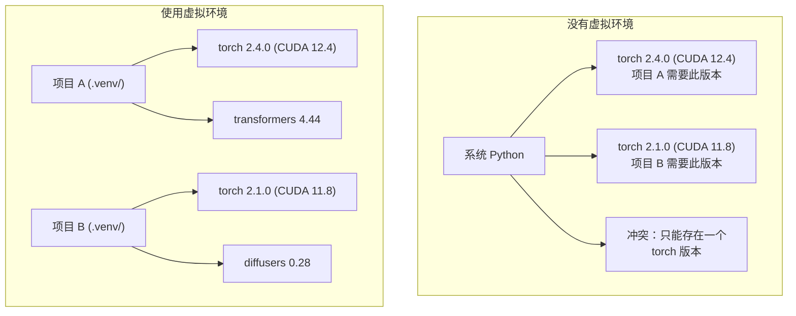

# Python Environments

> 依赖地狱是真实存在的。虚拟环境是解药。

**Type:** 构建
**Languages:** Shell
**Prerequisites:** Phase 0, Lesson 01
**Time:** ~30 分钟

## Learning Objectives

- 使用 `uv`、`venv` 或 `conda` 创建隔离的虚拟环境
- 编写包含可选依赖组的 `pyproject.toml` 并生成锁文件以保证可重现性
- 诊断并修复常见问题：全局安装、pip/conda 混用、CUDA 版本不匹配
- 为在依赖冲突的项目中实现按阶段的环境策略

## The Problem

你为微调项目安装了 PyTorch 2.4。下周另一个项目需要 PyTorch 2.1，因为它的 CUDA 构建被固定。你在全局升级，结果第一个项目崩溃。你降级，第二个项目又崩溃。

这就是依赖地狱。在 AI/ML 工作中经常发生，因为：

- PyTorch、JAX 和 TensorFlow 各自绑定了不同的 CUDA
- 模型库会固定特定的框架版本
- 全局的 `pip install` 会覆盖之前安装的内容
- CUDA 11.8 的构建不能与 CUDA 12.x 驱动（反之亦然）兼容

解决办法：每个项目都应该有自己的隔离环境和包。

## The Concept



## Build It

### Option 1: uv venv (Recommended)

`uv` 是最快的 Python 包管理器（比 pip 快 10-100 倍）。它在一个工具中处理虚拟环境、Python 版本和依赖解析。

```bash
curl -LsSf https://astral.sh/uv/install.sh | sh

uv python install 3.12

cd your-project
uv venv
source .venv/bin/activate
```

安装包：

```bash
uv pip install torch numpy
```

用 `pyproject.toml` 一步创建项目：

```bash
uv init my-ai-project
cd my-ai-project
uv add torch numpy matplotlib
```

### Option 2: venv (Built-in)

如果你不能安装 `uv`，Python 自带 `venv`：

```bash
python3 -m venv .venv
source .venv/bin/activate  # Linux/macOS
.venv\Scripts\activate     # Windows

pip install torch numpy
```

比 `uv` 慢，但在任何安装了 Python 的地方都可用。

### Option 3: conda (When You Need It)

Conda 管理像 CUDA 工具包、cuDNN 和 C 库这类非 Python 依赖。以下情况使用 conda：

- 需要特定的 CUDA 工具包版本而不想在系统范围内安装
- 在共享集群上无法安装系统包
- 某个库的安装说明写着“使用 conda”

```bash
# 安装 miniconda（不是完整的 Anaconda）
curl -LsSf https://repo.anaconda.com/miniconda/Miniconda3-latest-Linux-x86_64.sh -o miniconda.sh
bash miniconda.sh -b

conda create -n myproject python=3.12
conda activate myproject

conda install pytorch torchvision torchaudio pytorch-cuda=12.4 -c pytorch -c nvidia
```

一条规则：如果你用 conda 创建了环境，就用 conda 管理该环境中的所有包。在 conda 环境里混用 `pip install` 会导致难以调试的依赖冲突。

### For This Course: Per-Phase Strategy

你可以为整个课程创建一个环境。但别这样做。不同阶段需要不同（有时互相冲突的）依赖。

策略：

```
ai-engineering-from-scratch/
├── .venv/                    <-- 轻量共享环境，用于阶段 0-3
├── phases/
│   ├── 04-neural-networks/
│   │   └── .venv/            <-- PyTorch 环境
│   ├── 05-cnns/
│   │   └── .venv/            <-- 相同的 PyTorch 环境（符号链接或共享）
│   ├── 08-transformers/
│   │   └── .venv/            <-- 可能需要不同的 transformer 版本
│   └── 11-llm-apis/
│       └── .venv/            <-- API SDK，无需 torch
```

`code/env_setup.sh` 中的脚本会为本课程创建基础环境。

## pyproject.toml Basics

每个 Python 项目都应该有一个 `pyproject.toml`。它取代了 `setup.py`、`setup.cfg` 和 `requirements.txt`。

```toml
[project]
name = "ai-engineering-from-scratch"
version = "0.1.0"
requires-python = ">=3.11"
dependencies = [
    "numpy>=1.26",
    "matplotlib>=3.8",
    "jupyter>=1.0",
    "scikit-learn>=1.4",
]

[project.optional-dependencies]
torch = ["torch>=2.3", "torchvision>=0.18"]
llm = ["anthropic>=0.39", "openai>=1.50"]
```

然后安装：

```bash
uv pip install -e ".[torch]"    # 基础 + PyTorch
uv pip install -e ".[llm]"     # 基础 + LLM SDKs
uv pip install -e ".[torch,llm]" # 全部
```

## Lockfiles

锁文件将每个依赖（包括传递依赖）固定到精确版本。这保证了可重现性：任何从锁文件安装的人都会得到完全相同的包版本。

```bash
# 使用 uv add 时 uv 会自动生成 uv.lock
uv add numpy

# pip-tools 方法
uv pip compile pyproject.toml -o requirements.lock
uv pip install -r requirements.lock
```

将锁文件提交到 git。当有人克隆仓库时，他们从锁文件安装，就会得到相同的版本。

## Common Mistakes

### 1. Installing globally

```bash
pip install torch  # 错误：安装到系统 Python

source .venv/bin/activate
pip install torch  # 正确：安装到虚拟环境
```

检查包安装位置：

```bash
which python       # 应该显示 .venv/bin/python，而不是 /usr/bin/python
which pip          # 应该显示 .venv/bin/pip
```

### 2. Mixing pip and conda

```bash
conda create -n myenv python=3.12
conda activate myenv
conda install pytorch -c pytorch
pip install some-other-package   # 错误：可能会破坏 conda 的依赖追踪
conda install some-other-package # 正确：让 conda 管理所有包
```

如果必须在 conda 内使用 pip（某些包只有 pip），请先安装所有 conda 包，然后再最后安装 pip 包。

### 3. Forgetting to activate

```bash
python train.py           # 使用系统 Python，找不到包
source .venv/bin/activate
python train.py           # 使用项目 Python，能找到包
```

你的 shell 提示符应显示环境名称：

```
(.venv) $ python train.py
```

### 4. Committing .venv to git

```bash
echo ".venv/" >> .gitignore
```

虚拟环境通常占用 200MB–2GB。它们是本地的，且不可在机器间移植。提交 `pyproject.toml` 和锁文件即可。

### 5. CUDA version mismatch

```bash
nvidia-smi                # 显示驱动的 CUDA 版本（例如：12.4）
python -c "import torch; print(torch.version.cuda)"  # 显示 PyTorch 的 CUDA 版本

# 这些必须兼容。
# PyTorch 的 CUDA 版本必须 <= 驱动的 CUDA 版本。
```

## Use It

运行设置脚本以创建课程环境：

```bash
bash phases/00-setup-and-tooling/06-python-environments/code/env_setup.sh
```

这会在仓库根目录创建一个带有核心依赖并经过验证的 `.venv`。

## Exercises

1. 运行 `env_setup.sh` 并验证所有检查通过
2. 创建第二个虚拟环境，在其中安装不同版本的 numpy，并确认两个环境相互隔离
3. 为需要同时使用 PyTorch 和 Anthropic SDK 的项目编写 `pyproject.toml`
4. 有意在未激活 venv 的情况下全局安装一个包，观察它安装到哪里，然后卸载它

## Key Terms

| Term | What people say | What it actually means |
|------|----------------|----------------------|
| Virtual environment | "A venv" | 一个隔离的目录，包含一个 Python 解释器和包，与系统 Python 相互独立 |
| Lockfile | "Pinned dependencies" | 列出每个包及其精确版本的文件，保证在不同机器上得到相同的安装结果 |
| pyproject.toml | "The new setup.py" | 标准的 Python 项目配置文件，取代了 setup.py/setup.cfg/requirements.txt |
| Transitive dependency | "A dependency of a dependency" | 包 B 依赖于 C；如果你安装了依赖 B 的 A，那么 C 就是 A 的传递依赖 |
| CUDA mismatch | "My GPU isn't working" | PyTorch 是为与之不兼容的 CUDA 版本编译的，与你的 GPU 驱动不匹配 |