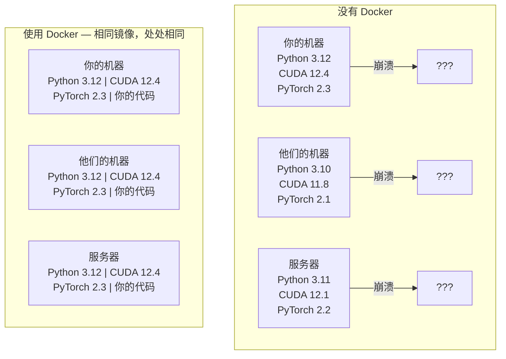

# Docker for AI

> 容器让“在我的机器上能运行”不再是问题。

**Type:** 构建
**Languages:** Docker
**Prerequisites:** Phase 0, Lessons 01 and 03
**Time:** ~60 分钟

## Learning Objectives

- 从 Dockerfile 构建一个支持 GPU 的 Docker 镜像，包含 CUDA、PyTorch 和 AI 库
- 将主机目录挂载为卷，以在容器重建之间持久化模型、数据集和代码
- 配置 NVIDIA Container Toolkit，使容器内部能够访问 GPU
- 使用 Docker Compose 协调多服务 AI 应用（推理服务 + 向量数据库）

## The Problem

你在笔记本上用 PyTorch 2.3、CUDA 12.4 和 Python 3.12 训练了一个模型。你的同事使用的是 PyTorch 2.1、CUDA 11.8 和 Python 3.10。模型在他们机器上崩溃了。而你的 Dockerfile 在两台机器上都能工作。

AI 项目是依赖的噩梦。典型栈包括 Python、PyTorch、CUDA 驱动、cuDNN、系统级 C 库，以及像 flash-attn 这样需要精确编译器版本的专用包。Docker 将这些全部打包到一个镜像中，使其在任何地方以相同方式运行。

## The Concept

Docker 将你的代码、运行时、库和系统工具封装为一个隔离单元，称为容器。把它想象成一个轻量级的虚拟机，但它共享主机的操作系统内核，而不是运行自己的内核，因此可以在几秒钟内启动，而不是几分钟。



### 为什么 AI 项目比大多数项目更需要 Docker

1. **GPU 驱动脆弱。** CUDA 12.4 的代码不能在 CUDA 11.8 上运行。Docker 将 CUDA 工具包隔离在容器内，同时通过 NVIDIA Container Toolkit 共享主机 GPU 驱动。

2. **模型权重很大。** 一个 7B 参数模型在 fp16 下约为 14 GB。你不想在每次重建时都重新下载它。Docker 卷允许你从主机挂载一个 models 目录。

3. **多服务架构很常见。** 一个真实的 AI 应用不仅仅是一个 Python 脚本。它通常包含推理服务、用于 RAG 的向量数据库、可能还有一个 Web 前端。Docker Compose 用一个命令就能协调这些服务。

### 关键词表

| Term | What it means |
|------|---------------|
| 镜像 (Image) | 只读模板。你的配方。从 Dockerfile 构建。 |
| 容器 (Container) | 镜像的运行实例。你的厨房。 |
| Dockerfile | 构建镜像的指令。逐层构建。 |
| 卷 (Volume) | 持久化存储，容器重启后仍然存在的数据。 |
| docker-compose | 一个用 YAML 定义多容器应用的工具。 |

### AI 中常见的容器模式

```
开发容器 (Dev Container)
  完整工具链。编辑器支持。Jupyter。调试工具。
  在开发和实验阶段使用。

训练容器 (Training Container)
  精简。仅包含训练脚本和依赖。
  在 GPU 集群上运行。没有编辑器，没有 Jupyter。

推理容器 (Inference Container)
  针对服务进行优化。镜像小，冷启动快。
  在生产中通常运行在负载均衡器后面。
```

## Build It

### Step 1: Install Docker

```bash
# macOS
brew install --cask docker
open /Applications/Docker.app

# Ubuntu
curl -fsSL https://get.docker.com | sh
sudo usermod -aG docker $USER
# 注销并重新登录以使用户组更改生效
```

验证：

```bash
docker --version
docker run hello-world
```

### Step 2: Install NVIDIA Container Toolkit (Linux with NVIDIA GPU)

这能让 Docker 容器访问你的 GPU。macOS 和 Windows (WSL2) 用户可跳过此步骤；Docker Desktop 在这些平台上以不同方式处理 GPU 直通。

```bash
distribution=$(. /etc/os-release;echo $ID$VERSION_ID)
curl -fsSL https://nvidia.github.io/libnvidia-container/gpgkey | sudo gpg --dearmor -o /usr/share/keyrings/nvidia-container-toolkit-keyring.gpg
curl -s -L https://nvidia.github.io/libnvidia-container/$distribution/libnvidia-container.list | \
    sed 's#deb https://#deb [signed-by=/usr/share/keyrings/nvidia-container-toolkit-keyring.gpg] https://#g' | \
    sudo tee /etc/apt/sources.list.d/nvidia-container-toolkit.list

sudo apt-get update
sudo apt-get install -y nvidia-container-toolkit
sudo nvidia-ctk runtime configure --runtime=docker
sudo systemctl restart docker
```

在容器内测试 GPU 访问：

```bash
docker run --rm --gpus all nvidia/cuda:12.4.1-base-ubuntu22.04 nvidia-smi
```

如果你能看到 GPU 信息，说明 toolkit 工作正常。

### Step 3: Understand base images

选择合适的基础镜像能节省大量调试时间。

```
nvidia/cuda:12.4.1-devel-ubuntu22.04
  完整的 CUDA 工具包。包含编译器。
  适用场景：构建需要 nvcc 的包（如 flash-attn、bitsandbytes）
  大小：~4 GB

nvidia/cuda:12.4.1-runtime-ubuntu22.04
  仅 CUDA 运行时。没有编译器。
  适用场景：运行预构建代码
  大小：~1.5 GB

pytorch/pytorch:2.3.1-cuda12.4-cudnn9-runtime
  已预装 PyTorch 的 CUDA 镜像。
  适用场景：跳过 PyTorch 安装步骤
  大小：~6 GB

python:3.12-slim
  无 CUDA，仅 CPU。
  适用场景：CPU 推理、轻量工具
  大小：~150 MB
```

### Step 4: Write a Dockerfile for AI development

这里是 `code/Dockerfile` 中的 Dockerfile。逐行查看：

```dockerfile
FROM nvidia/cuda:12.4.1-devel-ubuntu22.04

ENV DEBIAN_FRONTEND=noninteractive
ENV PYTHONUNBUFFERED=1

RUN apt-get update && apt-get install -y --no-install-recommends \
    python3.12 \
    python3.12-venv \
    python3.12-dev \
    python3-pip \
    git \
    curl \
    build-essential \
    && rm -rf /var/lib/apt/lists/*

RUN update-alternatives --install /usr/bin/python python /usr/bin/python3.12 1

RUN python -m pip install --no-cache-dir --upgrade pip setuptools wheel

RUN python -m pip install --no-cache-dir \
    torch==2.3.1 \
    torchvision==0.18.1 \
    torchaudio==2.3.1 \
    --index-url https://download.pytorch.org/whl/cu124

RUN python -m pip install --no-cache-dir \
    numpy \
    pandas \
    scikit-learn \
    matplotlib \
    jupyter \
    transformers \
    datasets \
    accelerate \
    safetensors

WORKDIR /workspace

VOLUME ["/workspace", "/models"]

EXPOSE 8888

CMD ["python"]
```

构建镜像：

```bash
docker build -t ai-dev -f phases/00-setup-and-tooling/07-docker-for-ai/code/Dockerfile .
```

第一次构建需要一些时间（下载 CUDA 基础镜像 + PyTorch）。后续构建会使用缓存层。

运行它：

```bash
docker run --rm -it --gpus all \
    -v $(pwd):/workspace \
    -v ~/models:/models \
    ai-dev python -c "import torch; print(f'PyTorch {torch.__version__}, CUDA: {torch.cuda.is_available()}')"
```

在容器内运行 Jupyter：

```bash
docker run --rm -it --gpus all \
    -v $(pwd):/workspace \
    -v ~/models:/models \
    -p 8888:8888 \
    ai-dev jupyter notebook --ip=0.0.0.0 --port=8888 --no-browser --allow-root
```

### Step 5: Volume mounts for data and models

卷挂载对 AI 工作至关重要。没有它们，你的 14 GB 模型在容器停止后会消失。

```bash
# 挂载你的代码
-v $(pwd):/workspace

# 挂载共享模型目录
-v ~/models:/models

# 挂载数据集
-v ~/datasets:/data
```

在你的训练脚本中，从挂载路径加载模型：

```python
from transformers import AutoModel

model = AutoModel.from_pretrained("/models/llama-7b")
```

模型保存在主机文件系统上。你可以随意重建容器，而无需重新下载模型。

### Step 6: Docker Compose for multi-service AI apps

一个真实的 RAG 应用需要推理服务器和向量数据库。Docker Compose 能用一个命令运行两者。

查看 `code/docker-compose.yml`：

```yaml
services:
  ai-dev:
    build:
      context: .
      dockerfile: Dockerfile
    deploy:
      resources:
        reservations:
          devices:
            - driver: nvidia
              count: all
              capabilities: [gpu]
    volumes:
      - ../../../:/workspace
      - ~/models:/models
      - ~/datasets:/data
    ports:
      - "8888:8888"
    stdin_open: true
    tty: true
    command: jupyter notebook --ip=0.0.0.0 --port=8888 --no-browser --allow-root

  qdrant:
    image: qdrant/qdrant:v1.12.5
    ports:
      - "6333:6333"
      - "6334:6334"
    volumes:
      - qdrant_data:/qdrant/storage

volumes:
  qdrant_data:
```

启动所有服务：

```bash
cd phases/00-setup-and-tooling/07-docker-for-ai/code
docker compose up -d
```

现在你的 AI 开发容器可以通过服务名在内部访问向量数据库：`http://qdrant:6333`。Docker Compose 会自动创建一个共享网络。

从 AI 容器内部测试连接：

```python
from qdrant_client import QdrantClient

client = QdrantClient(host="qdrant", port=6333)
print(client.get_collections())
```

停止所有服务：

```bash
docker compose down
```

添加 `-v` 还可以删除 qdrant 的数据卷：

```bash
docker compose down -v
```

### Step 7: Useful Docker commands for AI work

```bash
# 列出运行中的容器
docker ps

# 列出所有镜像及其大小
docker images

# 删除未使用的镜像（回收磁盘空间）
docker system prune -a

# 在运行容器内检查 GPU 使用情况
docker exec -it <container_id> nvidia-smi

# 从容器复制文件到主机
docker cp <container_id>:/workspace/results.csv ./results.csv

# 查看容器日志
docker logs -f <container_id>
```

## Use It

你现在有了一个可复现的 AI 开发环境。在本课程的其余部分：

- 使用 `docker compose up` 同时启动你的开发环境和向量数据库
- 将你的代码、模型和数据挂载为卷，这样重建时不会丢失任何东西
- 当某个 lesson 需要新的 Python 包时，将其添加到 Dockerfile 并重新构建
- 与团队分享你的 Dockerfile，他们将获得完全相同的环境

### 没有 GPU？

移除 `--gpus all` 标志和 NVIDIA deploy 部分。容器仍可用于基于 CPU 的课程。PyTorch 会检测到没有 CUDA 并自动回退到 CPU。

## Exercises

1. 构建 Dockerfile 并在容器内运行 `python -c "import torch; print(torch.__version__)"`  
2. 启动 docker-compose 堆栈，并验证 Qdrant 在 AI 容器内能通过 `http://qdrant:6333/collections` 访问  
3. 在 Dockerfile 中添加 `flask`，重建镜像，并在端口 5000 上运行一个简单的 API 服务器。用 `-p 5000:5000` 映射端口  
4. 使用 `docker images` 测量镜像大小。试着把基础镜像从 `devel` 切换到 `runtime`，比较大小差异

## Key Terms

| 术语 | 人们怎么说 | 实际含义 |
|------|----------------|----------------------|
| 容器 | “轻量级虚拟机” | 使用主机内核的隔离进程，拥有自己的文件系统和网络 |
| 镜像层 (Image layer) | “缓存的步骤” | 每个 Dockerfile 指令都会创建一个层。未改变的层会被缓存，因此重建速度很快。 |
| NVIDIA Container Toolkit | “Docker 中的 GPU” | 一个运行时钩子，通过 `--gpus` 标志将主机 GPU 暴露给容器 |
| 卷挂载 (Volume mount) | “共享文件夹” | 主机上的目录映射到容器内。更改在容器停止后仍会保留。 |
| 基础镜像 (Base image) | “起点” | 你的 Dockerfile 所基于的 `FROM` 镜像，决定了预安装的内容。 |