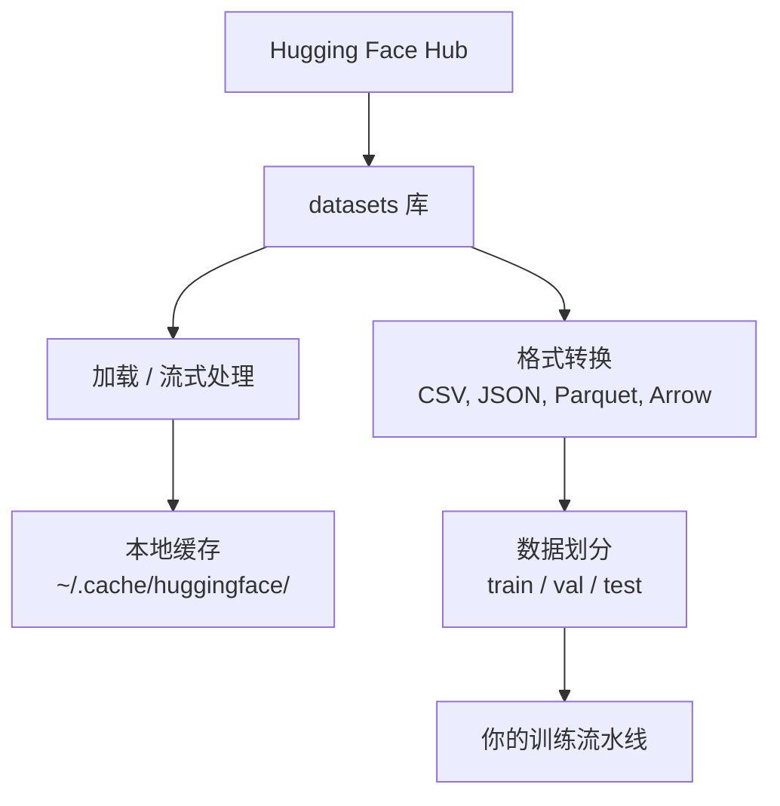

# 数据管理

> 数据是燃料。你如何管理它决定了你的速度。

**Type:** 构建
**Language:** Python
**Prerequisites:** Phase 0, Lesson 01
**Time:** ~45 分钟

## 学习目标

- 使用 Hugging Face `datasets` 库加载、流式处理并缓存数据集
- 在 CSV、JSON、Parquet 和 Arrow 格式之间转换并解释它们的权衡
- 使用固定随机种子创建可复现的训练/验证/测试划分
- 使用 `.gitignore`、Git LFS 或 DVC 管理大型模型和数据集文件

## 问题描述

每个 AI 项目都从数据开始。你需要查找数据集、下载、在格式间转换、为训练和评估进行划分，并对它们进行版本管理以使实验可复现。每次手动完成这些操作既耗时又容易出错。你需要一个可复用的工作流程。

## 概念



Hugging Face 的 `datasets` 库是 AI 工作中加载数据的标准方式。它开箱即用地处理下载、缓存、格式转换和流式处理。

## 实践构建

### 第 1 步：安装 datasets 库

```bash
pip install datasets huggingface_hub
```

### 第 2 步：加载数据集

```python
from datasets import load_dataset

dataset = load_dataset("imdb")
print(dataset)
print(dataset["train"][0])
```

这会下载 IMDB 电影评论数据集。首次下载后，会从 `~/.cache/huggingface/datasets/` 的缓存加载。

### 第 3 步：流式处理大型数据集

有些数据集太大而无法完整下载到磁盘。流式处理按行加载，而不需要下载完整数据集。

```python
dataset = load_dataset("wikimedia/wikipedia", "20220301.en", split="train", streaming=True)

for i, example in enumerate(dataset):
    print(example["title"])
    if i >= 4:
        break
```

流式处理会给你一个 `IterableDataset`。你可以在数据到达时逐行处理。无论数据集多大，内存使用保持恒定。

### 第 4 步：数据集格式

`datasets` 库在底层使用 Apache Arrow。你可以根据流水线需求转换为其他格式。

```python
dataset = load_dataset("imdb", split="train")

dataset.to_csv("imdb_train.csv")
dataset.to_json("imdb_train.json")
dataset.to_parquet("imdb_train.parquet")
```

格式比较：

| Format | Size | Read Speed | Best For |
|--------|------|-----------|----------|
| CSV | Large | Slow | 可读性强、适合表格工具 |
| JSON | Large | Slow | API、嵌套数据 |
| Parquet | Small | Fast | 分析、列式查询 |
| Arrow | Small | Fastest | 内存处理（`datasets` 内部使用） |

对于 AI 工作，Parquet 是最优的存储格式。Arrow 用于内存处理。CSV 和 JSON 用于数据交换。

### 第 5 步：数据划分

每个 ML 项目需要三类划分：

- **Train（训练）**：模型从这里学习（通常占 80%）
- **Validation（验证）**：在训练期间检查模型进展（通常占 10%）
- **Test（测试）**：训练完成后的最终评估（通常占 10%）

有些数据集已预先划分好。如果没有，请自行划分：

```python
dataset = load_dataset("imdb", split="train")

split = dataset.train_test_split(test_size=0.2, seed=42)
train_val = split["train"].train_test_split(test_size=0.125, seed=42)

train_ds = train_val["train"]
val_ds = train_val["test"]
test_ds = split["test"]

print(f"Train: {len(train_ds)}, Val: {len(val_ds)}, Test: {len(test_ds)}")
```

务必设置种子以保证可复现性。相同的种子每次都会产生相同的划分。

### 第 6 步：下载并缓存模型

模型是大型文件。`huggingface_hub` 库处理下载和缓存。

```python
from huggingface_hub import hf_hub_download, snapshot_download

model_path = hf_hub_download(
    repo_id="sentence-transformers/all-MiniLM-L6-v2",
    filename="config.json"
)
print(f"Cached at: {model_path}")

model_dir = snapshot_download("sentence-transformers/all-MiniLM-L6-v2")
print(f"Full model at: {model_dir}")
```

模型会缓存到 `~/.cache/huggingface/hub/`。下载后，后续运行会立即加载。

### 第 7 步：处理大文件

模型权重和大型数据集不应放入 git。有三种选择：

**选项 A：.gitignore（最简单）**

```
*.bin
*.safetensors
*.pt
*.onnx
data/*.parquet
data/*.csv
models/
```

**选项 B：Git LFS（在 git 中跟踪大文件）**

```bash
git lfs install
git lfs track "*.bin"
git lfs track "*.safetensors"
git add .gitattributes
```

Git LFS 在你的仓库中存储指针，实际文件存储在单独的服务器上。GitHub 提供 1 GB 免费空间。

**选项 C：DVC（数据版本控制）**

```bash
pip install dvc
dvc init
dvc add data/training_set.parquet
git add data/training_set.parquet.dvc data/.gitignore
git commit -m "Track training data with DVC"
```

DVC 会创建指向数据的小型 `.dvc` 文件。数据本身存放在 S3、GCS 或其他远程存储后端。

| Approach | Complexity | Best For |
|----------|-----------|----------|
| .gitignore | Low | 个人项目，可重新下载的数据 |
| Git LFS | Medium | 团队通过 git 共享模型权重 |
| DVC | High | 可复现实验、大型数据集、团队协作 |

对于本课程，`.gitignore` 就足够了。当需要在多台机器上复现实验时再使用 DVC。

### 第 8 步：存储策略

**本地存储** 适用于小于 ~10 GB 的数据集。HF 缓存会自动管理这些文件。

**云存储** 适用于更大或需要跨机器共享的数据：

```python
import os

local_path = os.path.expanduser("~/.cache/huggingface/datasets/")

# s3_path = "s3://my-bucket/datasets/"
# gcs_path = "gs://my-bucket/datasets/"
```

DVC 可以直接与 S3 和 GCS 集成：

```bash
dvc remote add -d myremote s3://my-bucket/dvc-store
dvc push
```

对于本课程，本地存储已足够。只有在你在远程 GPU 实例上微调模型时，云存储才变得相关。

## 本课程使用的数据集

| Dataset | Lessons | Size | What It Teaches |
|---------|---------|------|----------------|
| IMDB | Tokenization, classification | 84 MB | 文本分类基础 |
| WikiText | Language modeling | 181 MB | 下一个 token 预测 |
| SQuAD | QA systems | 35 MB | 问答系统、跨度预测 |
| Common Crawl (subset) | Embeddings | Varies | 大规模文本处理 |
| MNIST | Vision basics | 21 MB | 图像分类基础 |
| COCO (subset) | Multimodal | Varies | 图像-文本对 |

你无需现阶段下载所有这些数据集。每节课会说明所需数据。

## 使用方法

运行工具脚本以验证一切正常：

```bash
python code/data_utils.py
```

该脚本会下载一个小型数据集，进行格式转换、划分并打印摘要。

## 交付项

本课会产出：
- `code/data_utils.py` - 可重用的数据加载和缓存工具
- `outputs/prompt-data-helper.md` - 用于为任务查找合适数据集的提示词

## 练习

1. 使用 `mrpc` 配置加载 `glue` 数据集并查看前 5 个示例
2. 流式处理 `c4` 数据集并统计在 10 秒内能处理多少示例
3. 将数据集转换为 Parquet 并比较与 CSV 的文件大小
4. 使用固定种子创建 70/15/15 的 train/val/test 划分并验证大小

## 术语要点

| Term | What people say | What it actually means |
|------|----------------|----------------------|
| Dataset split | "Training data" | 一个命名的子集（train/val/test），在 ML 生命周期的不同阶段使用 |
| Streaming | "Load it lazily" | 从远程源按行处理数据，而不下载完整数据集 |
| Parquet | "Compressed CSV" | 一种为分析查询和存储效率优化的列式文件格式 |
| Arrow | "Fast dataframe" | `datasets` 库内部使用的内存中列式格式，支持零拷贝读取 |
| Git LFS | "Git for big files" | 一个扩展，将大文件存储在 git 仓库之外，同时在版本控制中保留指针 |
| DVC | "Git for data" | 一个用于数据集和模型的版本控制系统，可与云存储集成 |
| Cache | "Already downloaded" | 先前获取数据的本地副本，默认存放在 ~/.cache/huggingface/ |