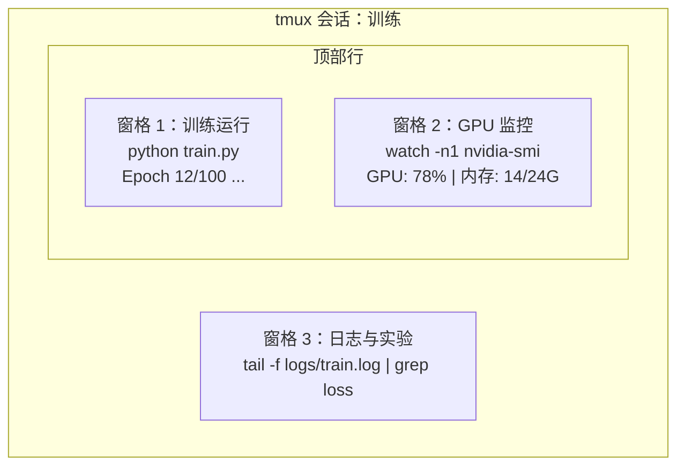

# Terminal & Shell

> 终端是 AI 工程师的主场。习惯在这里工作。

**Type:** 学习
**Languages:** --
**Prerequisites:** 阶段 0，课程 01
**Time:** ~35 分钟

## Learning Objectives

- 使用管道（piping）、重定向（redirects）和 `grep` 从命令行过滤与处理训练日志
- 使用持久化的 tmux 会话并创建多个窗格以并行进行训练与 GPU 监控
- 使用 `htop`、`nvtop` 和 `nvidia-smi` 监控系统与 GPU 资源
- 使用 SSH、`scp` 和 `rsync` 在本地与远程机器之间传输文件

## The Problem

你会在终端花费比在任何编辑器中都多的时间。训练运行、GPU 监控、查看日志尾部、远程 SSH 会话、环境管理。每个 AI 工作流都离不开 shell。如果你在这里慢了，其他地方也会慢。

本课涵盖对 AI 工作重要的终端技能。不需要 Unix 历史背景。也不做 Bash 脚本深潜。只教你必需的内容。

## The Concept



三个任务同时运行。一个终端。你可以分离（detach），回家，SSH 再连回来并重新附加。训练仍然在运行。

## Build It

### Step 1: Know your shell

检查你正在运行哪个 shell：

```bash
echo $SHELL
```

大多数系统使用 `bash` 或 `zsh`。两者都可以正常工作。本课程中的命令在任一环境下都适用。

需要掌握的要点：

```bash
# 切换目录
cd ~/projects/ai-engineering-from-scratch
pwd
ls -la

# 历史命令搜索（你会学到的最有用的快捷键）
# 按 Ctrl+R，然后输入之前命令的一部分
# 再按 Ctrl+R 可以循环匹配历史命令

# 清除终端
clear   # 或按 Ctrl+L

# 取消正在运行的命令
# Ctrl+C

# 挂起正在运行的命令（用 fg 恢复）
# Ctrl+Z
```

### Step 2: Piping and redirects

管道把命令连接在一起。这是你处理日志、过滤输出和链式使用工具的方式。你会经常用到它。

```bash
# 统计日志中出现 "loss" 的次数
cat train.log | grep "loss" | wc -l

# 从训练输出中提取出 loss 值
grep "loss:" train.log | awk '{print $NF}' > losses.txt

# 实时查看日志更新，并过滤出错误信息
tail -f train.log | grep --line-buffered "ERROR"

# 按最终准确率对实验进行排序
grep "final_accuracy" results/*.log | sort -t= -k2 -n -r

# 将 stdout 和 stderr 重定向到不同的文件
python train.py > output.log 2> errors.log

# 将两者都重定向到同一文件
python train.py > train_full.log 2>&1
```

下面是常用的重定向符号及其含义：

| Symbol | What it does |
|--------|-------------|
| `>` | 将 stdout 写入文件（覆盖） |
| `>>` | 将 stdout 追加写入文件 |
| `2>` | 将 stderr 写入文件 |
| `2>&1` | 将 stderr 发送到与 stdout 相同的位置 |
| `\|` | 将一个命令的 stdout 作为下一个命令的 stdin 传递 |

### Step 3: Background processes

训练运行通常需要数小时。你不希望一直保持终端打开。

```bash
# 在后台运行（输出仍会打印到当前终端）
python train.py &

# 在后台运行，并免受 hangup（关闭终端不会终止进程）
nohup python train.py > train.log 2>&1 &

# 查看后台运行的任务
jobs
ps aux | grep train.py

# 将后台任务带回前台
fg %1

# 终止后台进程
kill %1
# 或者根据 PID 查找并杀掉
kill $(pgrep -f "train.py")
```

`&`、`nohup`、以及 `screen`/`tmux` 的区别：

| Method | Survives terminal close? | Can reattach? |
|--------|-------------------------|---------------|
| `command &` | 否 | 否 |
| `nohup command &` | 是 | 否（查看日志文件） |
| `screen` / `tmux` | 是 | 是 |

对于超过几分钟的任务，使用 tmux。

### Step 4: tmux

tmux 允许你创建具有多个窗格的持久化终端会话。这是管理训练运行的最有用工具之一。

```bash
# 安装
# macOS
brew install tmux
# Ubuntu
sudo apt install tmux

# 启动一个具名会话
tmux new -s training

# 水平分割窗格
# Ctrl+B 然后 按 "

# 垂直分割窗格
# Ctrl+B 然后 按 %

# 在窗格之间切换
# Ctrl+B 然后 使用 方向键

# 分离会话（会话继续运行）
# Ctrl+B 然后 按 d

# 重新附加
tmux attach -t training

# 列出会话
tmux ls

# 结束会话
tmux kill-session -t training
```

一个典型的 AI 工作流会话示例：

```bash
tmux new -s train

# 窗格 1：开始训练
python train.py --epochs 100 --lr 1e-4

# Ctrl+B，按 " 分割窗格，然后运行 GPU 监控
watch -n1 nvidia-smi

# Ctrl+B，按 % 垂直分割，再 tail 日志
tail -f logs/experiment.log

# 现在用 Ctrl+B, d 分离会话
# SSH 登出，去喝杯咖啡，回来再连
# tmux attach -t train
```

### Step 5: Monitoring with htop and nvtop

```bash
# 系统进程监控（比 top 更好用）
htop

# GPU 进程监控（如果你有 NVIDIA GPU）
# 安装：sudo apt install nvtop（Ubuntu）或 brew install nvtop（macOS）
nvtop

# 不使用 nvtop 时的快速 GPU 检查
nvidia-smi

# 每秒更新一次地监控 GPU 使用情况
watch -n1 nvidia-smi

# 查看哪些进程在使用 GPU
nvidia-smi --query-compute-apps=pid,name,used_memory --format=csv
```

`htop` 常用快捷键：
- `F6` 或 `>` 按列排序（按内存排序以查找内存泄漏）
- `F5` 切换树状视图（查看子进程）
- `F9` 终止进程
- `/` 搜索进程名

### Step 6: SSH for remote GPU boxes

当你租用云 GPU（Lambda、RunPod、Vast.ai）时，通常通过 SSH 连接。

```bash
# 基本连接
ssh user@gpu-box-ip

# 使用特定密钥连接
ssh -i ~/.ssh/my_gpu_key user@gpu-box-ip

# 将文件拷贝到远程
scp model.pt user@gpu-box-ip:~/models/

# 从远程拷贝文件到本地
scp user@gpu-box-ip:~/results/metrics.json ./

# 同步整个目录（大量文件时更快）
rsync -avz ./data/ user@gpu-box-ip:~/data/

# 端口转发（本地访问远程的 Jupyter/TensorBoard）
ssh -L 8888:localhost:8888 user@gpu-box-ip
# 然后在浏览器中打开 localhost:8888

# 便捷的 SSH 配置
# 将以下添加到 ~/.ssh/config:
# Host gpu
#     HostName 192.168.1.100
#     User ubuntu
#     IdentityFile ~/.ssh/gpu_key
#
# 之后只需运行：
# ssh gpu
```

### Step 7: Useful aliases for AI work

将下面的内容添加到你的 `~/.bashrc` 或 `~/.zshrc` 中：

```bash
source phases/00-setup-and-tooling/10-terminal-and-shell/code/shell_aliases.sh
```

或者复制你想要的别名。常用别名示例如下：

```bash
# 一眼查看 GPU 状态
alias gpu='nvidia-smi --query-gpu=index,name,utilization.gpu,memory.used,memory.total,temperature.gpu --format=csv,noheader'

# 终止所有 Python 训练进程
alias killtraining='pkill -f "python.*train"'

# 快速激活虚拟环境
alias ae='source .venv/bin/activate'

# 监视训练 loss
alias watchloss='tail -f logs/*.log | grep --line-buffered "loss"'
```

完整别名见 `code/shell_aliases.sh`。

### Step 8: Common AI terminal patterns

这些模式在实践中会反复出现：

```bash
# 运行训练，记录所有输出，完成后通知
python train.py 2>&1 | tee train.log; echo "DONE" | mail -s "Training complete" you@email.com

# 并排比较两个实验日志
diff <(grep "accuracy" exp1.log) <(grep "accuracy" exp2.log)

# 找出最大的模型文件（清理磁盘空间）
find . -name "*.pt" -o -name "*.safetensors" | xargs du -h | sort -rh | head -20

# 从 Hugging Face 下载模型
wget https://huggingface.co/model/resolve/main/model.safetensors

# 解压数据集
tar xzf dataset.tar.gz -C ./data/

# 统计所有 Python 文件的行数（查看项目规模）
find . -name "*.py" | xargs wc -l | tail -1

# 检查磁盘空间（训练数据会迅速占满磁盘）
df -h
du -sh ./data/*

# 在训练前检查环境变量
env | grep -i cuda
env | grep -i torch
```

## Use It

以下列出在本课程中各工具的使用场景：

| Tool | When you use it |
|------|----------------|
| tmux | 每次训练运行（阶段 3 及以后） |
| `tail -f` + `grep` | 实时监控训练日志 |
| `nohup` / `&` | 快速的后台任务 |
| `htop` / `nvtop` | 调试训练变慢、OOM（内存不足）错误 |
| SSH + `rsync` | 在云 GPU 上工作时 |
| Piping + redirects | 处理实验结果 |
| Aliases | 节省重复命令时间 |

## Exercises

1. 安装 tmux，创建一个包含三个窗格的会话，在一个窗格运行 `htop`，另一个窗格运行 `watch -n1 date`，第三个窗格运行一个 Python 脚本。分离并重新附加会话。
2. 将 `code/shell_aliases.sh` 中的别名添加到你的 shell 配置文件中，并用 `source ~/.zshrc`（或 `~/.bashrc`）重新加载。
3. 用下面的命令创建一个假的训练日志：
   `for i in $(seq 1 100); do echo "epoch $i loss: $(echo "scale=4; 1/$i" | bc)"; sleep 0.1; done > fake_train.log`
   然后使用 `grep`、`tail` 和 `awk` 提取出纯 loss 值。
4. 为你有权限访问的服务器（或者使用 `localhost` 练习语法）设置一个 SSH 配置条目。

## Key Terms

| Term | What people say | What it actually means |
|------|----------------|----------------------|
| Shell | "The terminal" | 解释并执行你命令的程序（例如 `bash`、`zsh`、`fish`） |
| tmux | "Terminal multiplexer" | 一个允许你在一个窗口内运行多个终端会话并支持分离/重连的程序 |
| Pipe | "The bar thing" | `\|` 操作符，将一个命令的输出作为另一个命令的输入 |
| PID | "Process ID" | 分配给每个运行中进程的唯一编号，用于监控或终止该进程 |
| nohup | "No hangup" | 让命令免受挂起信号影响，关闭终端不会终止该命令 |
| SSH | "Connecting to the server" | Secure Shell，一种用于在远程机器上加密执行命令的协议 |