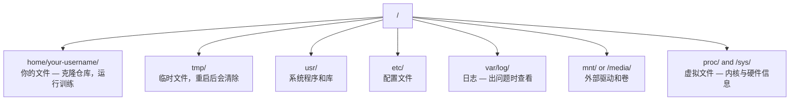

# Linux for AI

> Most AI runs on Linux. You need to know enough to not be stuck.

**Type:** 学习
**Languages:** --
**Prerequisites:** Phase 0, Lesson 01
**Time:** ~30 分钟

## Learning Objectives

- Navigate the Linux file system and perform essential file operations from the command line
- Manage file permissions with `chmod` and `chown` to resolve "Permission denied" errors
- Install system packages with `apt` and set up a fresh GPU box for AI work
- Identify macOS-to-Linux differences that commonly trip up developers working on remote machines

## The Problem

You develop on macOS or Windows. But the moment you SSH into a cloud GPU box, rent a Lambda instance, or spin up an EC2 machine, you land in Ubuntu. The terminal is your only interface. There is no Finder, no Explorer, no GUI. If you can't navigate the file system, install packages, and manage processes from the command line, you're stuck paying for idle GPU hours while googling "how to unzip a file in Linux."

This is a survival guide. It covers exactly what you need to operate on a remote Linux machine for AI work. Nothing more.

## File System Layout

Linux organizes everything under a single root `/`. There is no `C:\` or `/Volumes`. The directories you'll actually touch:



Your home directory is `~` or `/home/your-username`. Almost everything you do happens here.

## Essential Commands

These are the 15 commands that cover 95% of what you'll do on a remote GPU box.

### Moving Around

```bash
pwd                         # 我在哪儿？
ls                          # 这里有什么？
ls -la                      # 这里有什么（含隐藏文件和详细信息）？
cd /path/to/dir             # 进入指定目录
cd ~                        # 回到家目录
cd ..                       # 返回上一级
```

### Files and Directories

```bash
mkdir my-project            # 创建目录
mkdir -p a/b/c              # 一次创建嵌套目录

cp file.txt backup.txt      # 复制文件
cp -r src/ src-backup/      # 递归复制目录

mv old.txt new.txt          # 重命名文件
mv file.txt /tmp/           # 移动文件

rm file.txt                 # 删除文件（没有回收站，永久删除）
rm -rf my-dir/              # 删除目录及其内容（递归且强制）
```

`rm -rf` is permanent. There is no undo. Double-check the path before hitting enter.

### Reading Files

```bash
cat file.txt                # 打印整个文件内容
head -20 file.txt           # 前 20 行
tail -20 file.txt           # 后 20 行
tail -f log.txt             # 实时跟踪日志文件（Ctrl+C 停止）
less file.txt               # 翻阅文件（按 q 退出）
```

### Searching

```bash
grep "error" training.log           # 查找包含 "error" 的行
grep -r "learning_rate" .           # 在当前目录及子目录中搜索
grep -i "cuda" config.yaml          # 不区分大小写搜索

find . -name "*.py"                 # 查找当前目录下的所有 Python 文件
find . -name "*.ckpt" -size +1G     # 查找大于 1GB 的 checkpoint 文件
```

## Permissions

Every file in Linux has an owner and permission bits. You'll run into this when scripts won't execute or you can't write to a directory.

```bash
ls -l train.py
# -rwxr-xr-- 1 user group 2048 Mar 19 10:00 train.py
#  ^^^             所有者权限：读、写、执行
#     ^^^          组权限：读、执行
#        ^^        其他人的权限：仅读
```

Common fixes:

```bash
chmod +x train.sh           # 使脚本可执行
chmod 755 deploy.sh         # 所有者：全部权限，其他人：读+执行
chmod 644 config.yaml       # 所有者：读+写，其他人：仅读

chown user:group file.txt   # 更改文件所有者（需要 sudo）
```

When something says "Permission denied," it's almost always a permissions issue. `chmod +x` or `sudo` will fix most cases.

## Package Management (apt)

Ubuntu uses `apt`. This is how you install system-level software.

```bash
sudo apt update             # 刷新软件包列表（始终先做这一步）
sudo apt install -y htop    # 安装软件包（-y 跳过确认）
sudo apt install -y build-essential  # C 编译器、make 等。许多 Python 包需要它
sudo apt install -y tmux    # 终端复用器（断开后保持会话运行）

apt list --installed        # 已安装了什么？
sudo apt remove htop        # 卸载
```

Common packages you'll install on a fresh GPU box:

```bash
sudo apt update && sudo apt install -y \
    build-essential \
    git \
    curl \
    wget \
    tmux \
    htop \
    unzip \
    python3-venv
```

## Users and sudo

You're usually logged in as a regular user. Some operations need root (admin) access.

```bash
whoami                      # 当前用户是谁？
sudo command                # 以 root 身份运行单个命令
sudo su                     # 切换为 root（退出返回，谨慎使用）
```

On cloud GPU instances, you're typically the only user and already have sudo access. Don't run everything as root. Use sudo only when needed.

## Processes and systemd

When your training hangs, or you need to check what's running:

```bash
htop                        # 交互式进程查看器（按 q 退出）
ps aux | grep python        # 查找正在运行的 Python 进程
kill 12345                  # 优雅终止 PID 为 12345 的进程
kill -9 12345               # 强制终止（优雅终止无效时使用）
nvidia-smi                  # GPU 进程和显存使用情况
```

systemd manages services (background daemons). You'll use it if you run inference servers:

```bash
sudo systemctl start nginx          # 启动服务
sudo systemctl stop nginx           # 停止服务
sudo systemctl restart nginx        # 重启服务
sudo systemctl status nginx         # 检查是否在运行
sudo systemctl enable nginx         # 开机自动启动
```

## Disk Space

GPU boxes often have limited disk space. Models and datasets fill it fast.

```bash
df -h                       # 所有已挂载磁盘的使用情况
df -h /home                 # /home 的磁盘使用情况

du -sh *                    # 当前目录下每个项目的大小
du -sh ~/.cache             # 缓存大小（pip、Hugging Face 模型等通常存放在这里）
du -sh /data/checkpoints/   # 检查 checkpoints 的大小

# 查找占用空间最大的项目
du -h --max-depth=1 / 2>/dev/null | sort -hr | head -20
```

Common space savers:

```bash
# 清理 pip 缓存
pip cache purge

# 清理 apt 缓存
sudo apt clean

# 删除不需要的旧 checkpoints
rm -rf checkpoints/epoch_01/ checkpoints/epoch_02/
```

## Networking

You'll download models, transfer files, and hit APIs from the command line.

```bash
# 下载文件
wget https://example.com/model.bin                   # Download a file
curl -O https://example.com/data.tar.gz              # Same thing with curl
curl -s https://api.example.com/health | python3 -m json.tool  # 请求 API，并美化打印 JSON

# 在机器之间传输文件
scp model.bin user@remote:/data/                     # 将文件复制到远程机器
scp user@remote:/data/results.csv .                  # 从远程复制文件到本地
scp -r user@remote:/data/checkpoints/ ./local-dir/   # 复制目录

# 同步目录（对于大文件比 scp 更快，可断点续传）
rsync -avz --progress ./data/ user@remote:/data/
rsync -avz --progress user@remote:/results/ ./results/
```

Use `rsync` over `scp` for anything large. It only transfers changed bytes and handles interrupted connections.

## tmux: Keep Sessions Alive

When you SSH into a remote box, closing your laptop kills your training run. tmux prevents this.

```bash
tmux new -s train           # 创建名为 "train" 的新会话
# ... 启动训练后：
# Ctrl+B, then D            # 分离会话（训练继续运行）

tmux ls                     # 列出会话
tmux attach -t train        # 重新附加到会话

# 在 tmux 内：
# Ctrl+B, then %            # 垂直分割窗格
# Ctrl+B, then "            # 水平分割窗格
# Ctrl+B, then arrow keys   # 切换窗格
```

Always run long training jobs inside tmux. Always.

## WSL2 for Windows Users

If you're on Windows, WSL2 gives you a real Linux environment without dual-booting.

```bash
# In PowerShell (admin)
wsl --install -d Ubuntu-24.04

# After restart, open Ubuntu from Start menu
sudo apt update && sudo apt upgrade -y
```

WSL2 runs a real Linux kernel. Everything in this lesson works inside it. Your Windows files are at `/mnt/c/Users/YourName/` from inside WSL.

GPU passthrough works with NVIDIA drivers installed on the Windows side. Install the Windows NVIDIA driver (not the Linux one), and CUDA will be available inside WSL2.

## Gotchas: macOS to Linux

Things that will trip you up if you're coming from macOS:

| macOS | Linux | Notes |
|-------|-------|-------|
| `brew install` | `sudo apt install` | 有时软件包名称不同。`brew install htop` vs `sudo apt install htop` 是等价的，但 `brew install readline` 与 `sudo apt install libreadline-dev` 并不相同。 |
| `open file.txt` | `xdg-open file.txt` | 但远程机器通常没有 GUI。使用 `cat` 或 `less`。 |
| `pbcopy` / `pbpaste` | Not available | 通过 SSH 无法访问剪贴板的管道。 |
| `~/.zshrc` | `~/.bashrc` | macOS 默认使用 zsh。多数 Linux 服务器使用 bash。 |
| `/opt/homebrew/` | `/usr/bin/`, `/usr/local/bin/` | 可执行文件位置不同。 |
| `sed -i '' 's/a/b/' file` | `sed -i 's/a/b/' file` | macOS 的 sed 在 `-i` 后需要空字符串，Linux 则不需要。 |
| Case-insensitive filesystem | Case-sensitive filesystem | Linux 上大小写敏感，`Model.py` 与 `model.py` 是不同的文件。 |
| Line endings `\n` | Line endings `\n` | 相同。但 Windows 使用 `\r\n`，可能破坏 bash 脚本。使用 `dos2unix` 修复。 |

## Quick Reference Card

```
Navigation:     pwd, ls, cd, find
Files:          cp, mv, rm, mkdir, cat, head, tail, less
Search:         grep, find
Permissions:    chmod, chown, sudo
Packages:       apt update, apt install
Processes:      htop, ps, kill, nvidia-smi
Services:       systemctl start/stop/restart/status
Disk:           df -h, du -sh
Network:        curl, wget, scp, rsync
Sessions:       tmux new/attach/detach
```

## Exercises

1. SSH into any Linux machine (or open WSL2) and navigate to your home directory. Create a project folder, create three empty files inside it with `touch`, then list them with `ls -la`.
2. Install `htop` with apt, run it, and identify which process is using the most memory.
3. Start a tmux session, run `sleep 300` inside it, detach, list sessions, and reattach.
4. Use `df -h` to check available disk space, then use `du -sh ~/.cache/*` to find what's taking up space in your cache.
5. Transfer a file from your local machine to a remote one using `scp`, then do the same transfer with `rsync` and compare the experience.