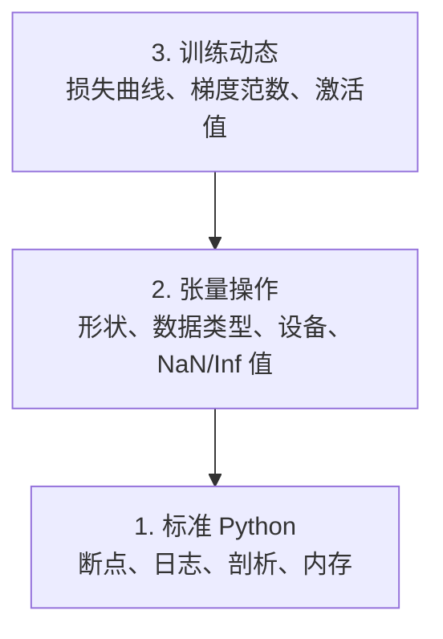

# Debugging and Profiling

> 最糟糕的 AI 错误不会崩溃。它们在垃圾数据上悄悄训练，然后报告一条漂亮的损失曲线。

**Type:** 构建  
**Language:** Python  
**Prerequisites:** Lesson 1 (开发环境), 熟悉 PyTorch 基础  
**Time:** ~60 分钟

## 学习目标

- 使用条件 `breakpoint()` 和 `debug_print` 在训练中检查张量的形状、dtype 和 NaN 值
- 使用 `cProfile`、`line_profiler` 和 `tracemalloc` 对训练循环进行性能剖析以查找瓶颈
- 检测常见的 AI 错误：形状不匹配、NaN 损失、数据泄露和错误设备上的张量
- 设置 TensorBoard 来可视化损失曲线、权重直方图和梯度分布

## 问题

AI 代码失败的方式不同于常规代码。一个 web 应用会带着堆栈跟踪崩溃；但一个配置错误的训练循环可能运行 8 小时，烧掉 200 美元的 GPU 时间，最后产生一个对所有输入都预测均值的模型。代码没有报错。错误可能是张量在错误设备上、忘记了 `.detach()`，或标签泄露到特征中。

你需要在这些静默失败耗费你的时间和算力之前，使用能捕捉到它们的调试工具。

## 概念

AI 调试在三个层面上进行：



大多数人直接跳到第 3 层（盯着 TensorBoard）。但 80% 的 AI 错误发生在第 1 层和第 2 层。

## 实施

### 第 1 部分：打印调试（是的，它有用）

打印调试常被轻视，但不该被忽视。对于张量代码，有针对性的打印语句往往比逐步调试更有效，因为你需要同时看到形状、dtype 和数值范围。

```python
def debug_print(name, tensor):
    print(f"{name}: shape={tensor.shape}, dtype={tensor.dtype}, "
          f"device={tensor.device}, "
          f"min={tensor.min().item():.4f}, max={tensor.max().item():.4f}, "
          f"mean={tensor.mean().item():.4f}, "
          f"has_nan={tensor.isnan().any().item()}")
```

在每个可疑操作后调用它。找到 bug 后，移除这些打印。简单有效。

### 第 2 部分：Python 调试器（pdb 和 breakpoint）

内置调试器在 AI 工作中常被低估。在训练循环中放入 `breakpoint()`，并交互式检查张量。

```python
def training_step(model, batch, criterion, optimizer):
    inputs, labels = batch
    outputs = model(inputs)
    loss = criterion(outputs, labels)

    if loss.item() > 100 or torch.isnan(loss):
        breakpoint()

    loss.backward()
    optimizer.step()
```

调试器中有用的命令：

- `p outputs.shape` 检查形状
- `p loss.item()` 查看损失值
- `p torch.isnan(outputs).sum()` 统计 NaN
- `p model.fc1.weight.grad` 检查梯度
- `c` 继续，`q` 退出

这是条件调试。只有在出现异常情况时才会停下。对于 10,000 步的训练，这很重要。

### 第 3 部分：Python 日志

当调试超出快速检查时，用日志替换打印语句。

```python
import logging

logging.basicConfig(
    level=logging.INFO,
    format="%(asctime)s [%(levelname)s] %(message)s",
    handlers=[
        logging.FileHandler("training.log"),
        logging.StreamHandler()
    ]
)
logger = logging.getLogger(__name__)

logger.info("Starting training: lr=%.4f, batch_size=%d", lr, batch_size)
logger.warning("Loss spike detected: %.4f at step %d", loss.item(), step)
logger.error("NaN loss at step %d, stopping", step)
```

日志给你时间戳、严重级别和文件输出。当训练在凌晨 3 点失败时，你需要的是日志文件，而不是已经滚出屏幕的终端输出。

### 第 4 部分：计时代码片段

知道时间都花在哪里是优化的第一步。

```python
import time

class Timer:
    def __init__(self, name=""):
        self.name = name

    def __enter__(self):
        self.start = time.perf_counter()
        return self

    def __exit__(self, *args):
        elapsed = time.perf_counter() - self.start
        print(f"[{self.name}] {elapsed:.4f}s")

with Timer("data loading"):
    batch = next(dataloader_iter)

with Timer("forward pass"):
    outputs = model(batch)

with Timer("backward pass"):
    loss.backward()
```

常见发现：数据加载占用 60% 的训练时间。解决方法通常不是更快的 GPU，而是 DataLoader 中使用 `num_workers > 0`。

### 第 5 部分：cProfile 和 line_profiler

当你需要比手动计时更多的信息时：

```bash
python -m cProfile -s cumtime train.py
```

这会显示按累计时间排序的每个函数调用。要做逐行剖析：

```bash
pip install line_profiler
```

```python
@profile
def train_step(model, data, target):
    output = model(data)
    loss = F.cross_entropy(output, target)
    loss.backward()
    return loss

# Run with: kernprof -l -v train.py
```

### 第 6 部分：内存剖析

#### 使用 tracemalloc 检查 CPU 内存

```python
import tracemalloc

tracemalloc.start()

# your code here
model = build_model()
data = load_dataset()

snapshot = tracemalloc.take_snapshot()
top_stats = snapshot.statistics("lineno")
for stat in top_stats[:10]:
    print(stat)
```

#### 使用 memory_profiler 检查 CPU 内存

```bash
pip install memory_profiler
```

```python
from memory_profiler import profile

@profile
def load_data():
    raw = read_csv("data.csv")       # 在这里注意内存的跳增
    processed = preprocess(raw)     # 在这里再观察内存变化
    return processed
```

使用 `python -m memory_profiler your_script.py` 运行以查看逐行内存使用情况。

#### 使用 PyTorch 检查 GPU 内存

```python
import torch

if torch.cuda.is_available():
    print(torch.cuda.memory_summary())

    print(f"Allocated: {torch.cuda.memory_allocated() / 1e9:.2f} GB")
    print(f"Cached: {torch.cuda.memory_reserved() / 1e9:.2f} GB")
```

当出现 OOM（内存不足）时：

1. 减小 batch size（总是首先尝试）
2. 使用 `torch.cuda.empty_cache()` 来释放缓存内存
3. 对于大型中间变量，使用 `del tensor` 然后 `torch.cuda.empty_cache()`
4. 使用混合精度（`torch.cuda.amp`）来将内存使用减半
5. 对于非常深的模型，使用梯度检查点（gradient checkpointing）

### 第 7 部分：常见 AI 错误及其检测方法

#### 形状不匹配

最常见的错误。一个张量是 `[batch, features]`，而模型期望 `[batch, channels, height, width]`。

```python
def check_shapes(model, sample_input):
    print(f"Input: {sample_input.shape}")
    hooks = []

    def make_hook(name):
        def hook(module, inp, out):
            in_shape = inp[0].shape if isinstance(inp, tuple) else inp.shape
            out_shape = out.shape if hasattr(out, "shape") else type(out)
            print(f"  {name}: {in_shape} -> {out_shape}")
        return hook

    for name, module in model.named_modules():
        hooks.append(module.register_forward_hook(make_hook(name)))

    with torch.no_grad():
        model(sample_input)

    for h in hooks:
        h.remove()
```

用一个样本批次运行一次。它会映射模型中每一步的形状变化。

#### NaN 损失

NaN 损失意味着某处数值爆炸。常见原因：

- 学习率过高
- 自定义损失中的除零
- 对零或负数取对数
- RNN 中的梯度爆炸

```python
def detect_nan(model, loss, step):
    if torch.isnan(loss):
        print(f"NaN loss at step {step}")
        for name, param in model.named_parameters():
            if param.grad is not None:
                if torch.isnan(param.grad).any():
                    print(f"  NaN gradient in {name}")
                if torch.isinf(param.grad).any():
                    print(f"  Inf gradient in {name}")
        return True
    return False
```

#### 数据泄露

模型在测试集上达到 99% 的准确率。听起来很棒，但这通常是错误。

```python
def check_data_leakage(train_set, test_set, id_column="id"):
    train_ids = set(train_set[id_column].tolist())
    test_ids = set(test_set[id_column].tolist())
    overlap = train_ids & test_ids
    if overlap:
        print(f"DATA LEAKAGE: {len(overlap)} samples in both train and test")
        return True
    return False
```

还要检查时间上的泄露：在划分前按时间戳排序，避免用未来数据预测过去。

#### 错误设备

张量位于不同设备（CPU 与 GPU）会导致运行时错误。但有时一个张量悄悄留在 CPU 上，而其他都在 GPU 上，训练会只是变慢而非报错。

```python
def check_devices(model, *tensors):
    model_device = next(model.parameters()).device
    print(f"Model device: {model_device}")
    for i, t in enumerate(tensors):
        if t.device != model_device:
            print(f"  WARNING: tensor {i} on {t.device}, model on {model_device}")
```

### 第 8 部分：TensorBoard 基础

TensorBoard 可以展示训练过程中发生的事情。

```bash
pip install tensorboard
```

```python
from torch.utils.tensorboard import SummaryWriter

writer = SummaryWriter("runs/experiment_1")

for step in range(num_steps):
    loss = train_step(model, batch)

    writer.add_scalar("loss/train", loss.item(), step)
    writer.add_scalar("lr", optimizer.param_groups[0]["lr"], step)

    if step % 100 == 0:
        for name, param in model.named_parameters():
            writer.add_histogram(f"weights/{name}", param, step)
            if param.grad is not None:
                writer.add_histogram(f"grads/{name}", param.grad, step)

writer.close()
```

启动命令：

```bash
tensorboard --logdir=runs
```

观察要点：

- Loss 未下降：学习率过低或模型架构有问题
- Loss 大幅振荡：学习率过高
- Loss 变为 NaN：数值不稳定（见上文 NaN 部分）
- 训练损失下降而验证损失上升：过拟合
- 权重直方图塌缩到零：梯度消失
- 梯度直方图爆炸：需要梯度裁剪

### 第 9 部分：VS Code 调试器

对于交互式调试，在 VS Code 中配置 `launch.json`：

```json
{
    "version": "0.2.0",
    "configurations": [
        {
            "name": "Debug Training",
            "type": "debugpy",
            "request": "launch",
            "program": "${file}",
            "console": "integratedTerminal",
            "justMyCode": false
        }
    ]
}
```

通过点击行号设置断点。使用 Variables 窗格检查张量属性。Debug Console 允许在执行中运行任意 Python 表达式。

对数据预处理管道逐步调试特别有用，可以看到每一步的转换结果。

## 使用流程

这是能捕捉大多数 AI 错误的调试工作流：

1. 在训练前：使用 `check_shapes` 用样本批次运行一次。验证输入和输出维度是否匹配预期。
2. 前 10 步：对损失、输出和梯度使用 `debug_print`。确认没有 NaN，且数值在合理范围内。
3. 训练期间：记录损失、学习率和梯度范数。使用 TensorBoard 可视化。
4. 出现问题时：在故障点放入 `breakpoint()`。交互式检查张量。
5. 性能方面：计时数据加载、前向与反向传递。接近 OOM 时剖析内存。

## 上线

运行调试工具包脚本：

```bash
python phases/00-setup-and-tooling/12-debugging-and-profiling/code/debug_tools.py
```

查看 `outputs/prompt-debug-ai-code.md`，其中有一个帮助诊断 AI 特有错误的提示词。

## 练习

1. 运行 `debug_tools.py` 并阅读每个部分的输出。修改示例模型以引入一个 NaN（提示：在前向传递中除以零），观察检测器如何捕获它。
2. 使用 `cProfile` 剖析训练循环，并找出最慢的函数。
3. 使用 `tracemalloc` 查找数据加载管道中哪一行分配了最多内存。
4. 为一个简单的训练运行设置 TensorBoard，判断模型是否在过拟合。
5. 在训练循环中使用 `breakpoint()`。练习在调试器提示符下检查张量形状、设备和梯度值。