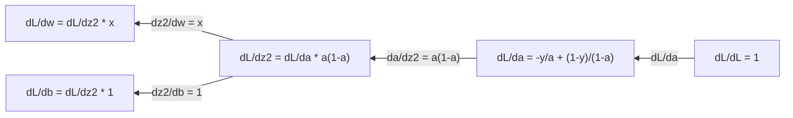
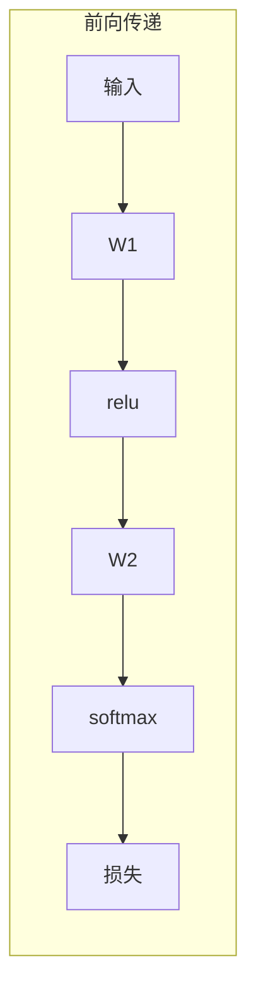
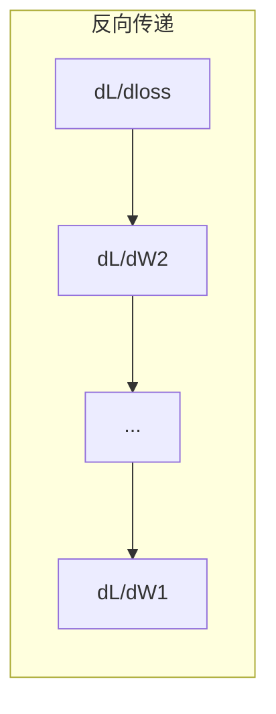

# Calculus for Machine Learning

> Derivatives tell you which way is downhill. That is all a neural network needs to learn.

**Type:** 学习  
**Language:** Python  
**Prerequisites:** 第1阶段，课程 01-03  
**Time:** ~60 分钟

## Learning Objectives

- 计算常见机器学习函数（x^2、sigmoid、交叉熵）的数值与解析导数
- 从零实现梯度下降以在 1D 与 2D 上最小化损失函数
- 推导线性回归模型的梯度并通过手动权重更新训练它
- 解释 Hessian 矩阵、泰勒级数近似及其与优化方法的联系

## The Problem

你有一个神经网络，包含数百万个权重。每个权重都是一个旋钮。你需要确定如何转动每一个旋钮才能让模型的错误稍微变小。微积分告诉你那个方向。

没有微积分，训练神经网络就意味着尝试随机变化并抱有希望。通过导数，你可以确切知道每个权重如何影响误差。你每次都能把每个旋钮向正确的方向转动。

## The Concept

### What is a derivative?

导数衡量变化率。对于函数 y = f(x)，导数 f'(x) 告诉你：如果你把 x 微微移动一点，y 会变化多少？

在几何上，导数是某点处切线的斜率。

**f(x) = x^2:**

| x | f(x) | f'(x) (slope) |
|---|------|---------------|
| 0 | 0    | 0（平坦，位于最低点） |
| 1 | 1    | 2 |
| 2 | 4    | 4（此点处切线斜率） |
| 3 | 9    | 6 |

在 x=2 时，斜率是 4。如果你把 x 向右微微移动一点，y 会大约增加该移动量的 4 倍。在 x=0 时，斜率为 0。你处在碗底。

形式定义：

```
f'(x) = lim   f(x + h) - f(x)
        h->0  -----------------
                     h
```

在代码中，你跳过极限，使用一个非常小的 h。这就是数值导数。

### Partial derivatives: one variable at a time

真实的函数有很多输入。神经网络的损失取决于成千上万个权重。偏导数在只保持其他变量不变的情况下，对某一个变量求导。

```
f(x, y) = x^2 + 3xy + y^2

df/dx = 2x + 3y     (将 y 视为常数)
df/dy = 3x + 2y     (将 x 视为常数)
```

每个偏导数回答：如果我只微调这个权重，损失会如何变化？

### The gradient: vector of all partial derivatives

梯度将所有偏导数组合成一个向量。对于函数 f(x, y, z)，梯度是：

```
grad f = [ df/dx, df/dy, df/dz ]
```

梯度指向最陡上升的方向。要最小化函数，就朝相反方向前进。

**f(x,y) = x^2 + y^2 的等高线图：**

函数形成一个碗状，等高线是同心圆。最小值位于 (0, 0)。

| Point | grad f | -grad f (descent direction) |
|-------|--------|----------------------------|
| (1, 1) | [2, 2]（指向上坡，远离最小值） | [-2, -2]（指向下坡，朝向最小值） |
| (0, 0) | [0, 0]（平坦，处于最小值） | [0, 0] |

这就是梯度下降的图示。计算梯度、取反、再迈出一步。

### The connection to optimization

训练神经网络就是一个优化问题。你有一个损失函数 L(w1, w2, ..., wn)，衡量模型的错误程度。你的目标是最小化它。

```
Gradient descent update rule:

  w_new = w_old - learning_rate * dL/dw

For every weight:
  1. Compute the partial derivative of loss with respect to that weight
  2. Subtract a small multiple of it from the weight
  3. Repeat
```

学习率控制步长。太大会过冲，太小则爬行。

**Loss landscape (1D slice):**

随着权重 w 的变化，损失函数 L(w) 形成了带有峰和谷的曲线。

| Feature | Description |
|---------|-------------|
| Global minimum | 整个曲线上的最低点 —— 最优解 |
| Local minimum | 相对于邻域更低的谷，但不是全局最低 |
| Slope | 梯度下降从任意起点沿斜率向下走 |

梯度下降沿斜率下行。它可能陷入局部最小，但在高维空间（数百万个权重）中这通常不是实际问题。

### Numerical vs analytical derivatives

计算导数有两种方法。

解析（Analytical）：通过手工应用微积分规则。对于 f(x) = x^2，导数是 f'(x) = 2x。精确且快速。

数值（Numerical）：使用定义进行近似。计算 f(x+h) 和 f(x-h) 对于极小的 h，然后做差分。

```
Numerical (central difference):

f'(x) ~= f(x + h) - f(x - h)
          -----------------------
                  2h

h = 0.0001 works well in practice
```

数值导数较慢但适用于任何函数。解析导数快速但需要你推导公式。神经网络框架使用第三种方法：自动微分（automatic differentiation），它以机械化方式计算精确导数。你将在第3阶段看到它。

### Derivatives by hand for simple functions

这些是你在 ML 中会反复见到的导数。

```
Function        Derivative       Used in
--------        ----------       -------
f(x) = x^2     f'(x) = 2x      Loss functions (MSE)
f(x) = wx + b  f'(w) = x        Linear layer (gradient w.r.t. weight)
                f'(b) = 1        Linear layer (gradient w.r.t. bias)
                f'(x) = w        Linear layer (gradient w.r.t. input)
f(x) = e^x     f'(x) = e^x     Softmax, attention
f(x) = ln(x)   f'(x) = 1/x     Cross-entropy loss
f(x) = 1/(1+e^-x)  f'(x) = f(x)(1-f(x))   Sigmoid activation
```

对于 f(x) = x^2：

```
f(x) = x^2    f'(x) = 2x

  x    f(x)   f'(x)   meaning
  -2    4      -4      斜率向左倾（递减）
  -1    1      -2      斜率向左倾（递减）
   0    0       0      平坦（最小点！）
   1    1       2      斜率向右倾（递增）
   2    4       4      斜率向右倾（递增）
```

对于 f(w) = wx + b 且 x=3, b=1：

```
f(w) = 3w + 1    f'(w) = 3

对 w 的导数就是 x。
如果 x 很大，则对 w 做微小改变会导致输出发生较大变化。
```

### The chain rule

当函数被复合时，链式法则告诉你如何求导。

```
If y = f(g(x)), then dy/dx = f'(g(x)) * g'(x)

Example: y = (3x + 1)^2
  outer: f(u) = u^2       f'(u) = 2u
  inner: g(x) = 3x + 1    g'(x) = 3
  dy/dx = 2(3x + 1) * 3 = 6(3x + 1)
```

神经网络是函数的链：输入 -> 线性层 -> 激活 -> 线性层 -> 激活 -> 损失。反向传播就是把链式法则从输出应用到输入。这就是整个算法。

### The Hessian Matrix

梯度告诉你斜率。Hessian 告诉你曲率。

Hessian 是二阶偏导数矩阵。对于函数 f(x1, x2, ..., xn)，第 (i, j) 项是：

```
H[i][j] = d^2f / (dx_i * dx_j)
```

对于二元函数 f(x, y)：

```
H = | d^2f/dx^2    d^2f/dxdy |
    | d^2f/dydx    d^2f/dy^2 |
```

**在临界点（梯度 = 0）处 Hessian 告诉你的内容：**

| Hessian property | Meaning | Example surface |
|-----------------|---------|-----------------|
| Positive definite (all eigenvalues > 0) | 局部最小 | 向上开口的碗 |
| Negative definite (all eigenvalues < 0) | 局部最大 | 向下开口的碗 |
| Indefinite (mixed eigenvalues) | 鞍点 | 马鞍形状 |

**示例:** f(x, y) = x^2 - y^2（鞍函数）

```
df/dx = 2x       df/dy = -2y
d^2f/dx^2 = 2    d^2f/dy^2 = -2    d^2f/dxdy = 0

H = | 2   0 |
    | 0  -2 |

特征值：2 和 -2（一个正，一个负）
--> 在 (0, 0) 处为鞍点
```

与 f(x, y) = x^2 + y^2（碗）比较：

```
H = | 2  0 |
    | 0  2 |

特征值：2 和 2（都为正）
--> 在 (0, 0) 处为局部最小
```

**为什么 Hessian 在 ML 中很重要：**

牛顿法使用 Hessian 来比梯度下降采取更好的优化步长。不只是沿斜率走，它还考虑了曲率：

```
Newton's update:    w_new = w_old - H^(-1) * gradient
Gradient descent:   w_new = w_old - lr * gradient
```

牛顿法收敛更快，因为 Hessian 会“重标度”梯度 —— 在陡峭方向上步长变小，在平坦方向上步长变大。

问题是：对于拥有 N 个参数的神经网络，Hessian 是 N x N 的。一个有 100 万参数的模型需要一个万亿项的矩阵。这就是我们使用近似的原因。

| Method | What it uses | Cost | Convergence |
|--------|-------------|------|-------------|
| Gradient descent | 仅使用一阶导数 | 每步 O(N) | 慢（线性） |
| Newton's method | 完整 Hessian | 每步 O(N^3) | 快（二次） |
| L-BFGS | 从梯度历史近似 Hessian | 每步 O(N) | 中等（超线性） |
| Adam | 每参数自适应学习率（对角 Hessian 近似） | 每步 O(N) | 中等 |
| Natural gradient | Fisher 信息矩阵（统计学上的 Hessian） | 每步 O(N^2) | 快 |

在实践中，Adam 是深度学习的默认优化器。它通过跟踪每个参数的梯度的移动平均与方差，廉价地近似了二阶信息。

### Taylor Series Approximation

任何光滑函数都可以在局部用多项式近似：

```
f(x + h) = f(x) + f'(x)*h + (1/2)*f''(x)*h^2 + (1/6)*f'''(x)*h^3 + ...
```

你包含的项越多，近似越好 —— 但仅在 x 附近有效。

**泰勒级数为何对 ML 很重要：**

- **一阶泰勒 = 梯度下降。** 当你使用 f(x + h) ~ f(x) + f'(x)*h 时，你做了线性近似。梯度下降就是最小化这个线性模型，从而选择 h = -lr * f'(x)。
- **二阶泰勒 = 牛顿法。** 使用 f(x + h) ~ f(x) + f'(x)*h + (1/2)*f''(x)*h^2，你得到二次模型。最小化它得到 h = -f'(x)/f''(x) —— 牛顿步长。
- **损失函数设计。** MSE 和交叉熵是平滑的，这使得它们的泰勒展开良好。这并非偶然。平滑的损失使得优化更可预测。

```
Approximation order    What it captures    Optimization method
-------------------    -----------------   -------------------
0th order (constant)   Just the value      Random search
1st order (linear)     Slope               Gradient descent
2nd order (quadratic)  Curvature           Newton's method
Higher orders          Finer structure     Rarely used in ML
```

关键洞见：所有基于梯度的优化实际上都是在局部近似损失函数并走向该近似的最小点。

### Integrals in ML

导数告诉你变化率。积分计算累积 —— 曲线下面积。

在 ML 中，你很少手动计算积分，但这个概念无处不在：

**概率。** 对于连续随机变量具有密度 p(x)：
```
P(a < X < b) = integral from a to b of p(x) dx
```
概率密度曲线在区间 [a, b] 下的面积是落在该范围内的概率。

**期望值。** 以概率为权重的平均结果：
```
E[f(X)] = integral of f(x) * p(x) dx
```
对数据分布的期望损失是一个积分。训练最小化其经验近似。

**KL 散度。** 衡量两个分布的差异：
```
KL(p || q) = integral of p(x) * log(p(x) / q(x)) dx
```
用于 VAE、知识蒸馏和贝叶斯推断。

**归一化常数。** 在贝叶斯推断中：
```
p(w | data) = p(data | w) * p(w) / integral of p(data | w) * p(w) dw
```
分母是对所有可能参数值的积分。它通常是不可解的，这就是我们使用 MCMC 与变分推断等近似方法的原因。

| Integral concept | Where it appears in ML |
|-----------------|----------------------|
| Area under curve | 概率密度函数的概率计算 |
| Expected value | 损失函数、风险最小化 |
| KL divergence | VAE、策略优化、蒸馏 |
| Normalization | 贝叶斯后验、softmax 的分母 |
| Marginal likelihood | 模型比较、证据下界（ELBO） |

### Multivariable Chain Rule in a Computation Graph

链式法则不仅适用于按顺序组合的标量函数。在神经网络中，变量会分叉和合并。以下展示简单前向传播中导数如何流动：


反向传播从右到左计算梯度：



每条箭头都乘以局部导数。任一参数的梯度是从损失到该参数路径上所有局部导数的乘积。当路径分叉与合并时，你对贡献求和（多元链式法则）。

这就是反向传播：在计算图上系统地从输出到输入应用链式法则。

### The Jacobian matrix

当函数将向量映射到向量（例如神经网络层）时，它的导数是一个矩阵。雅可比矩阵包含每个输出相对于每个输入的偏导数。

对于 f: R^n -> R^m，Jacobian J 是一个 m x n 矩阵：

| | x1 | x2 | ... | xn |
|---|---|---|---|---|
| f1 | df1/dx1 | df1/dx2 | ... | df1/dxn |
| f2 | df2/dx1 | df2/dx2 | ... | df2/dxn |
| ... | ... | ... | ... | ... |
| fm | dfm/dx1 | dfm/dx2 | ... | dfm/dxn |

你不会手动为神经网络计算雅可比矩阵。PyTorch 会处理它。但知道它的存在有助于理解反向传播中的形状：如果一个层将 R^n 映射到 R^m，那么其雅可比是 m x n。梯度在反向传播时通过该矩阵的转置流动。

### Why this matters for neural networks

神经网络中的每个权重都会获得一个梯度。梯度告诉你如何调整该权重以减小损失。





每次权重更新：
- `W1 = W1 - lr * dL/dW1`
- `W2 = W2 - lr * dL/dW2`

前向传递计算预测与损失。反向传递计算损失相对于每个权重的梯度。然后每个权重沿下坡小步前进。对数百万步重复。这就是深度学习。

```figure
derivative-tangent
```

## Build It

### Step 1: Numerical derivative from scratch

```python
def numerical_derivative(f, x, h=1e-7):
    return (f(x + h) - f(x - h)) / (2 * h)

def f(x):
    return x ** 2

for x in [-2, -1, 0, 1, 2]:
    numerical = numerical_derivative(f, x)
    analytical = 2 * x
    print(f"x={x:2d}  f'(x) numerical={numerical:.6f}  analytical={analytical:.1f}")
```

数值导数与解析导数在许多小数位上匹配。

### Step 2: Partial derivatives and gradients

```python
def numerical_gradient(f, point, h=1e-7):
    gradient = []
    for i in range(len(point)):
        point_plus = list(point)
        point_minus = list(point)
        point_plus[i] += h
        point_minus[i] -= h
        partial = (f(point_plus) - f(point_minus)) / (2 * h)
        gradient.append(partial)
    return gradient

def f_multi(point):
    x, y = point
    return x**2 + 3*x*y + y**2

grad = numerical_gradient(f_multi, [1.0, 2.0])
print(f"Numerical gradient at (1,2): {[f'{g:.4f}' for g in grad]}")
print(f"Analytical gradient at (1,2): [2*1+3*2, 3*1+2*2] = [{2*1+3*2}, {3*1+2*2}]")
```

### Step 3: Gradient descent to find the minimum of f(x) = x^2

```python
x = 5.0
lr = 0.1
for step in range(20):
    grad = 2 * x
    x = x - lr * grad
    print(f"step {step:2d}  x={x:8.4f}  f(x)={x**2:10.6f}")
```

从 x=5 开始，每一步都向 x=0（最小点）靠近。

### Step 4: Gradient descent on a 2D function

```python
def f_2d(point):
    x, y = point
    return x**2 + y**2

point = [4.0, 3.0]
lr = 0.1
for step in range(30):
    grad = numerical_gradient(f_2d, point)
    point = [p - lr * g for p, g in zip(point, grad)]
    loss = f_2d(point)
    if step % 5 == 0 or step == 29:
        print(f"step {step:2d}  point=({point[0]:7.4f}, {point[1]:7.4f})  f={loss:.6f}")
```

### Step 5: Comparing numerical and analytical derivatives

```python
import math

test_functions = [
    ("x^2",      lambda x: x**2,          lambda x: 2*x),
    ("x^3",      lambda x: x**3,          lambda x: 3*x**2),
    ("sin(x)",   lambda x: math.sin(x),   lambda x: math.cos(x)),
    ("e^x",      lambda x: math.exp(x),   lambda x: math.exp(x)),
    ("1/x",      lambda x: 1/x,           lambda x: -1/x**2),
]

x = 2.0
print(f"{'Function':<12} {'Numerical':>12} {'Analytical':>12} {'Error':>12}")
print("-" * 50)
for name, f, df in test_functions:
    num = numerical_derivative(f, x)
    ana = df(x)
    err = abs(num - ana)
    print(f"{name:<12} {num:12.6f} {ana:12.6f} {err:12.2e}")
```

### Step 6: Computing the Hessian numerically

```python
def hessian_2d(f, x, y, h=1e-5):
    fxx = (f(x + h, y) - 2 * f(x, y) + f(x - h, y)) / (h ** 2)
    fyy = (f(x, y + h) - 2 * f(x, y) + f(x, y - h)) / (h ** 2)
    fxy = (f(x + h, y + h) - f(x + h, y - h) - f(x - h, y + h) + f(x - h, y - h)) / (4 * h ** 2)
    return [[fxx, fxy], [fxy, fyy]]

def saddle(x, y):
    return x ** 2 - y ** 2

def bowl(x, y):
    return x ** 2 + y ** 2

H_saddle = hessian_2d(saddle, 0.0, 0.0)
H_bowl = hessian_2d(bowl, 0.0, 0.0)
print(f"Saddle Hessian: {H_saddle}")  # [[2, 0], [0, -2]] -- 符号混合
print(f"Bowl Hessian:   {H_bowl}")    # [[2, 0], [0, 2]]  -- 都为正
```

鞍函数的 Hessian 有特征值 2 和 -2（符号混合，确认鞍点）。碗函数的特征值为 2 和 2（都为正，确认最小点）。

### Step 7: Taylor approximation in action

```python
import math

def taylor_approx(f, f_prime, f_double_prime, x0, h, order=2):
    result = f(x0)
    if order >= 1:
        result += f_prime(x0) * h
    if order >= 2:
        result += 0.5 * f_double_prime(x0) * h ** 2
    return result

x0 = 0.0
for h in [0.1, 0.5, 1.0, 2.0]:
    true_val = math.sin(h)
    t1 = taylor_approx(math.sin, math.cos, lambda x: -math.sin(x), x0, h, order=1)
    t2 = taylor_approx(math.sin, math.cos, lambda x: -math.sin(x), x0, h, order=2)
    print(f"h={h:.1f}  sin(h)={true_val:.4f}  order1={t1:.4f}  order2={t2:.4f}")
```

在 x0=0 附近，sin(x) ~ x（一阶泰勒）。对小的 h 来说近似非常好，但对大的 h 会失效。这就是为什么梯度下降在小学习率下效果最好 —— 每一步都假定线性近似是准确的。

### Step 8: Why this matters for a neural network

```python
import random

random.seed(42)

w = random.gauss(0, 1)
b = random.gauss(0, 1)
lr = 0.01

xs = [1.0, 2.0, 3.0, 4.0, 5.0]
ys = [3.0, 5.0, 7.0, 9.0, 11.0]

for epoch in range(200):
    total_loss = 0
    dw = 0
    db = 0
    for x, y in zip(xs, ys):
        pred = w * x + b
        error = pred - y
        total_loss += error ** 2
        dw += 2 * error * x
        db += 2 * error
    dw /= len(xs)
    db /= len(xs)
    total_loss /= len(xs)
    w -= lr * dw
    b -= lr * db
    if epoch % 40 == 0 or epoch == 199:
        print(f"epoch {epoch:3d}  w={w:.4f}  b={b:.4f}  loss={total_loss:.6f}")

print(f"\nLearned: y = {w:.2f}x + {b:.2f}")
print(f"Actual:  y = 2x + 1")
```

每个基于梯度的训练循环都遵循这个模式：预测、计算损失、计算梯度、更新权重。

## Use It

使用 NumPy 可以让相同操作更快且更简洁：

```python
import numpy as np

x = np.array([1, 2, 3, 4, 5], dtype=float)
y = np.array([3, 5, 7, 9, 11], dtype=float)

w, b = np.random.randn(), np.random.randn()
lr = 0.01

for epoch in range(200):
    pred = w * x + b
    error = pred - y
    loss = np.mean(error ** 2)
    dw = np.mean(2 * error * x)
    db = np.mean(2 * error)
    w -= lr * dw
    b -= lr * db

print(f"Learned: y = {w:.2f}x + {b:.2f}")
```

你刚刚从零实现了梯度下降。PyTorch 会自动计算梯度，但更新循环是相同的。

## Exercises

1. 实现 `numerical_second_derivative(f, x)`，使用 `numerical_derivative` 调用两次。验证 x^3 在 x=2 处的二阶导数为 12。
2. 使用梯度下降找到 f(x, y) = (x - 3)^2 + (y + 1)^2 的最小值。从 (0, 0) 开始。答案应收敛到 (3, -1)。
3. 在梯度下降循环中加入动量：维护一个累积过去梯度的速度向量。比较在 f(x) = x^4 - 3x^2 上有无动量的收敛速度差异。

## Key Terms

| Term | What people say | What it actually means |
|------|----------------|----------------------|
| Derivative | "The slope" | 在某点处函数的变化率。告诉你输出随输入单位变化的变化量。 |
| Partial derivative | "Derivative of one variable" | 在其它变量保持不变时，对某个变量求导。 |
| Gradient | "Direction of steepest ascent" | 所有偏导数组成的向量。指向函数增长最快的方向。 |
| Gradient descent | "Go downhill" | 从参数中减去梯度（乘以学习率）以减小损失。神经网络训练的核心。 |
| Learning rate | "Step size" | 控制每一步梯度下降步长的标量。过大会发散，过小会收敛缓慢。 |
| Chain rule | "Multiply the derivatives" | 对复合函数求导的规则：df/dx = df/dg * dg/dx。反向传播的数学基础。 |
| Jacobian | "Matrix of derivatives" | 当函数将向量映射到向量时，雅可比矩阵是输出对输入的所有偏导数组成的矩阵。 |
| Numerical derivative | "Finite differences" | 通过在两个相近点处求函数值并计算斜率来近似导数。 |
| Backpropagation | "Reverse-mode autodiff" | 使用链式法则从输出到输入一层一层地计算梯度。神经网络学习的方式。 |
| Hessian | "Matrix of second derivatives" | 所有二阶偏导数组成的矩阵。描述函数的曲率。在临界点 Hessian 为正定表示局部最小。 |
| Taylor series | "Polynomial approximation" | 使用导数在某点附近近似函数：f(x+h) ~ f(x) + f'(x)h + (1/2)f''(x)h^2 + ...。理解梯度下降与牛顿法的基础。 |
| Integral | "Area under the curve" | 在区间内累积某个量。在 ML 中，积分定义概率、期望与 KL 散度。 |

## Further Reading

- [3Blue1Brown: Essence of Calculus](https://www.3blue1brown.com/topics/calculus) - 对导数、积分与链式法则的直观可视化  
- [Stanford CS231n: Backpropagation](https://cs231n.github.io/optimization-2/) - 梯度如何在神经网络层间流动