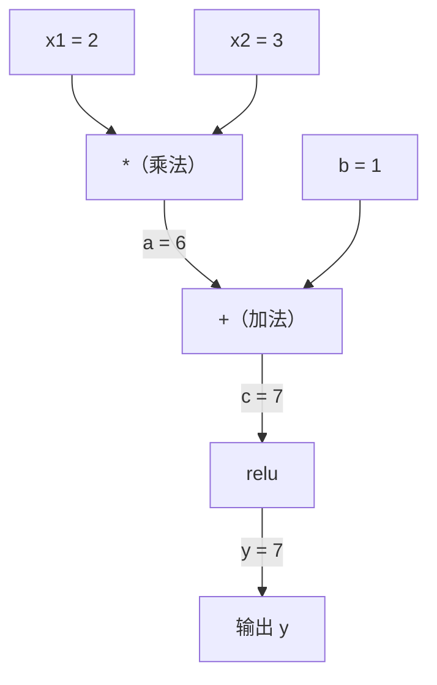
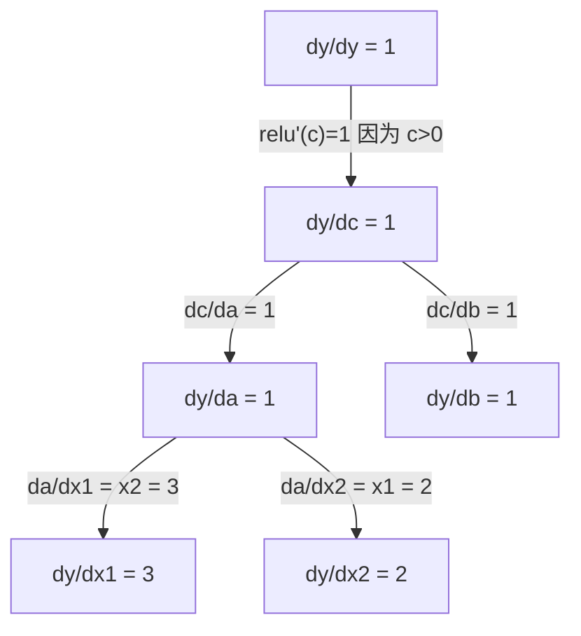

# Chain Rule & Automatic Differentiation

> 链式法则是每个能学习的神经网络背后的引擎。

**Type:** 构建
**Language:** Python
**Prerequisites:** Phase 1，Lesson 04（导数与梯度）
**Time:** ~90 分钟

## Learning Objectives

- 构建一个最小化的自动微分引擎（Value 类），记录运算并通过反向模式自动微分计算梯度
- 使用拓扑排序实现计算图的前向和反向传递
- 使用自制的 autograd 引擎构建并训练一个用于 XOR 的多层感知机（MLP）
- 使用数值有限差分进行梯度检查以验证自动微分的正确性

## The Problem

你可以计算简单函数的导数。但神经网络不是一个简单函数。它是数百个函数的复合：矩阵乘法，加偏置，应用激活函数，再次矩阵乘法，softmax，交叉熵损失。输出是函数的函数的函数。

为了训练网络，你需要损失对每个权重的梯度。手工计算对于百万级参数是不可能的。用数值方法（有限差分）太慢。

链式法则给出数学公式。自动微分给出算法。两者结合可以在与一次前向传递成正比的时间内，通过任意函数复合计算精确梯度。

这就是 PyTorch、TensorFlow 和 JAX 的工作原理。你将从头构建一个微型版本。

## The Concept

### The Chain Rule

如果 `y = f(g(x))`，则 y 对 x 的导数为：

```
dy/dx = dy/dg * dg/dx = f'(g(x)) * g'(x)
```

沿链相乘导数。每个环节贡献它的局部导数。

示例：`y = sin(x^2)`

```
g(x) = x^2       g'(x) = 2x
f(g) = sin(g)     f'(g) = cos(g)

dy/dx = cos(x^2) * 2x
```

对于更深的复合，链进一步延伸：

```
y = f(g(h(x)))

dy/dx = f'(g(h(x))) * g'(h(x)) * h'(x)
```

神经网络中的每一层就是链中的一环。

### Computational Graphs

计算图将链式法则可视化。每个操作成为一个节点。数据在图中向前流动。梯度向后流动。

**前向传递（计算值）：**



**反向传递（计算梯度）：**



反向传递在每个节点应用链式法则，从输出向输入传播梯度。

### Forward Mode vs Reverse Mode

在图上应用链式法则有两种方式。

**前向模式（Forward mode）** 从输入开始并将导数向前推动。它计算 `dx/dx = 1` 并通过每个操作传播。适合输入少、输出多的情况。

```
Forward mode: seed dx/dx = 1, propagate forward

  x = 2       (dx/dx = 1)
  a = x^2     (da/dx = 2x = 4)
  y = sin(a)  (dy/dx = cos(a) * da/dx = cos(4) * 4 = -2.615)
```

**反向模式（Reverse mode）** 从输出开始并将梯度向后拉。它计算 `dy/dy = 1` 并以相反顺序通过每个操作传播。适合输入多、输出少的情况。

```
Reverse mode: seed dy/dy = 1, propagate backward

  y = sin(a)  (dy/dy = 1)
  a = x^2     (dy/da = cos(a) = cos(4) = -0.654)
  x = 2       (dy/dx = dy/da * da/dx = -0.654 * 4 = -2.615)
```

神经网络有数以百万计的输入（权重）和一个输出（损失）。反向模式在一次反向传递中计算所有梯度。这就是反向传播使用反向模式的原因。

| Mode | Seed | Direction | Best when |
|------|------|-----------|-----------|
| Forward | `dx_i/dx_i = 1` | Input to output | 输入少，输出多 |
| Reverse | `dy/dy = 1` | Output to input | 输入多，输出少（神经网络） |

### Dual Numbers for Forward Mode

前向模式可以用对偶数（dual numbers）优雅地实现。对偶数的形式是 `a + b*epsilon`，其中 `epsilon^2 = 0`。

```
Dual number: (value, derivative)

(2, 1) means: value is 2, derivative w.r.t. x is 1

Arithmetic rules:
  (a, a') + (b, b') = (a+b, a'+b')
  (a, a') * (b, b') = (a*b, a'*b + a*b')
  sin(a, a')         = (sin(a), cos(a)*a')
```

用导数 1 来初始化输入变量。导数会自动通过每个操作传播。

### Building an Autograd Engine

一个 autograd 引擎需要三样东西：

1. Value 包装。将每个数字包装到一个对象中，存储它的值和梯度。
2. 图记录。每个操作记录它的输入和局部梯度函数。
3. 反向传递。对图进行拓扑排序，然后反向遍历，对每个节点应用链式法则。

这正是 PyTorch 的 `autograd` 所做的。`torch.Tensor` 类包装值，当 `requires_grad=True` 时记录操作，并在你调用 `.backward()` 时计算梯度。

### How PyTorch Autograd Works Under the Hood

当你写 PyTorch 代码时：

```python
x = torch.tensor(2.0, requires_grad=True)
y = x ** 2 + 3 * x + 1
y.backward()
print(x.grad)  # 7.0 = 2*x + 3 = 2*2 + 3
```

PyTorch 内部：

1. 为 `x` 创建一个 `Tensor` 节点并设置 `requires_grad=True`
2. 每个操作（`**`、`*`、`+`）创建一个新节点并记录后向函数
3. `y.backward()` 触发对记录图的反向模式自动微分
4. 每个节点的 `grad_fn` 计算局部梯度并传递给父节点
5. 梯度通过累加（加法而非替换）保存在 `.grad` 属性中

图是动态的（define-by-run）。每次前向传递都会构建一个新图。这就是 PyTorch 支持模型内控制流（if/else、循环）的原因。

```figure
chain-rule
```

## Build It

### Step 1: The Value class

```python
class Value:
    def __init__(self, data, children=(), op=''):
        self.data = data
        self.grad = 0.0
        self._backward = lambda: None
        self._prev = set(children)
        self._op = op

    def __repr__(self):
        return f"Value(data={self.data:.4f}, grad={self.grad:.4f})"
```

每个 `Value` 存储它的数值数据、梯度（初始为 0）、一个后向函数，以及产生它的子节点指针。

### Step 2: Arithmetic operations with gradient tracking

```python
    def __add__(self, other):
        other = other if isinstance(other, Value) else Value(other)
        out = Value(self.data + other.data, (self, other), '+')
        def _backward():
            self.grad += out.grad
            other.grad += out.grad
        out._backward = _backward
        return out

    def __mul__(self, other):
        other = other if isinstance(other, Value) else Value(other)
        out = Value(self.data * other.data, (self, other), '*')
        def _backward():
            self.grad += other.data * out.grad
            other.grad += self.data * out.grad
        out._backward = _backward
        return out

    def relu(self):
        out = Value(max(0, self.data), (self,), 'relu')
        def _backward():
            self.grad += (1.0 if out.data > 0 else 0.0) * out.grad
        out._backward = _backward
        return out
```

每个操作创建一个闭包，知道如何计算局部梯度并乘以上游梯度（`out.grad`）。使用 `+=` 处理一个值被多个操作使用的情况。

### Step 3: The backward pass

```python
    def backward(self):
        topo = []
        visited = set()
        def build_topo(v):
            if v not in visited:
                visited.add(v)
                for child in v._prev:
                    build_topo(child)
                topo.append(v)
        build_topo(self)

        self.grad = 1.0
        for v in reversed(topo):
            v._backward()
```

拓扑排序确保每个节点的梯度在传播到它的子节点之前被完全计算。种子梯度为 1.0（dy/dy = 1）。

### Step 4: More operations for a complete engine

基础的 Value 类支持加法、乘法和 relu。一个真正的 autograd 引擎需要更多操作。下面是构建神经网络所需的操作：

```python
    def __neg__(self):
        return self * -1

    def __sub__(self, other):
        return self + (-other)

    def __radd__(self, other):
        return self + other

    def __rmul__(self, other):
        return self * other

    def __rsub__(self, other):
        return other + (-self)

    def __pow__(self, n):
        out = Value(self.data ** n, (self,), f'**{n}')
        def _backward():
            self.grad += n * (self.data ** (n - 1)) * out.grad
        out._backward = _backward
        return out

    def __truediv__(self, other):
        return self * (other ** -1) if isinstance(other, Value) else self * (Value(other) ** -1)

    def exp(self):
        import math
        e = math.exp(self.data)
        out = Value(e, (self,), 'exp')
        def _backward():
            self.grad += e * out.grad
        out._backward = _backward
        return out

    def log(self):
        import math
        out = Value(math.log(self.data), (self,), 'log')
        def _backward():
            self.grad += (1.0 / self.data) * out.grad
        out._backward = _backward
        return out

    def tanh(self):
        import math
        t = math.tanh(self.data)
        out = Value(t, (self,), 'tanh')
        def _backward():
            self.grad += (1 - t ** 2) * out.grad
        out._backward = _backward
        return out
```

每个操作的作用：

| Operation | Backward rule | Used in |
|-----------|--------------|---------|
| `__sub__` | 复用加法和取负 | 损失计算（pred - target） |
| `__pow__` | n * x^(n-1) | 多项式激活，均方误差（error^2） |
| `__truediv__` | 复用乘法 + pow(-1) | 归一化，学习率缩放 |
| `exp` | exp(x) * 上游梯度 | Softmax，似然的对数 |
| `log` | (1/x) * 上游梯度 | 交叉熵损失，对数概率 |
| `tanh` | (1 - tanh^2) * 上游梯度 | 经典激活函数 |

巧妙之处在于：`__sub__` 和 `__truediv__` 是通过已有操作定义的。它们自动获得正确的梯度，因为链式法则会通过底层的 add/mul/pow 操作复合。

### Step 5: Mini MLP from scratch

有了完整的 Value 类，你就可以构建神经网络。无需 PyTorch、无需 NumPy。只有 Values 和链式法则。

```python
import random

class Neuron:
    def __init__(self, n_inputs):
        self.w = [Value(random.uniform(-1, 1)) for _ in range(n_inputs)]
        self.b = Value(0.0)

    def __call__(self, x):
        act = sum((wi * xi for wi, xi in zip(self.w, x)), self.b)
        return act.tanh()

    def parameters(self):
        return self.w + [self.b]

class Layer:
    def __init__(self, n_inputs, n_outputs):
        self.neurons = [Neuron(n_inputs) for _ in range(n_outputs)]

    def __call__(self, x):
        return [n(x) for n in self.neurons]

    def parameters(self):
        return [p for n in self.neurons for p in n.parameters()]

class MLP:
    def __init__(self, sizes):
        self.layers = [Layer(sizes[i], sizes[i+1]) for i in range(len(sizes)-1)]

    def __call__(self, x):
        for layer in self.layers:
            x = layer(x)
        return x[0] if len(x) == 1 else x

    def parameters(self):
        return [p for layer in self.layers for p in layer.parameters()]
```

一个 `Neuron` 计算 `tanh(w1*x1 + w2*x2 + ... + b)`。一个 `Layer` 是若干神经元的列表。一个 `MLP` 将层堆叠起来。每个权重都是一个 `Value`，因此调用 `loss.backward()` 会将梯度传播到每个参数。

**Training on XOR:**

```python
random.seed(42)
model = MLP([2, 4, 1])  # 2 inputs, 4 hidden neurons, 1 output

xs = [[0, 0], [0, 1], [1, 0], [1, 1]]
ys = [-1, 1, 1, -1]  # XOR pattern (using -1/1 for tanh)

for step in range(100):
    preds = [model(x) for x in xs]
    loss = sum((p - y) ** 2 for p, y in zip(preds, ys))

    for p in model.parameters():
        p.grad = 0.0
    loss.backward()

    lr = 0.05
    for p in model.parameters():
        p.data -= lr * p.grad

    if step % 20 == 0:
        print(f"step {step:3d}  loss = {loss.data:.4f}")

print("\nPredictions after training:")
for x, y in zip(xs, ys):
    print(f"  input={x}  target={y:2d}  pred={model(x).data:6.3f}")
```

这就是 micrograd。在纯 Python 中使用自动微分实现的完整神经网络训练循环。每个商业深度学习框架本质上都在大规模上做同样的事情。

### Step 6: Gradient checking

你如何知道你的自动微分是正确的？将其与数值导数比较。这就是梯度检查。

```python
def gradient_check(build_expr, x_val, h=1e-7):
    x = Value(x_val)
    y = build_expr(x)
    y.backward()
    autodiff_grad = x.grad

    y_plus = build_expr(Value(x_val + h)).data
    y_minus = build_expr(Value(x_val - h)).data
    numerical_grad = (y_plus - y_minus) / (2 * h)

    diff = abs(autodiff_grad - numerical_grad)
    return autodiff_grad, numerical_grad, diff
```

在一个复杂表达式上测试它：

```python
def expr(x):
    return (x ** 3 + x * 2 + 1).tanh()

ad, num, diff = gradient_check(expr, 0.5)
print(f"Autodiff:  {ad:.8f}")
print(f"Numerical: {num:.8f}")
print(f"Difference: {diff:.2e}")
# Difference should be < 1e-5
```

梯度检查在实现新操作时至关重要。如果你的后向传递有 bug，数值检查会捕捉到它。每个严肃的深度学习实现都会在开发阶段运行梯度检查。

**When to use gradient checking:**

| Situation | Do gradient check? |
|-----------|-------------------|
| 向你的 autograd 添加新操作 | 是，总是要做 |
| 调试训练循环无法收敛 | 是，先检查梯度 |
| 生产训练 | 否，太慢（每个参数需要两次前向传递） |
| autograd 代码的单元测试 | 是，将其自动化 |

### Step 7: Verify against manual calculation

```python
x1 = Value(2.0)
x2 = Value(3.0)
a = x1 * x2          # a = 6.0
b = a + Value(1.0)    # b = 7.0
y = b.relu()          # y = 7.0

y.backward()

print(f"y = {y.data}")          # 7.0
print(f"dy/dx1 = {x1.grad}")   # 3.0 (= x2)
print(f"dy/dx2 = {x2.grad}")   # 2.0 (= x1)
```

手动校验：`y = relu(x1*x2 + 1)`。因为 `x1*x2 + 1 = 7 > 0`，relu 为恒等函数。
`dy/dx1 = x2 = 3`。`dy/dx2 = x1 = 2`。引擎匹配该结果。

## Use It

### Verify against PyTorch

```python
import torch

x1 = torch.tensor(2.0, requires_grad=True)
x2 = torch.tensor(3.0, requires_grad=True)
a = x1 * x2
b = a + 1.0
y = torch.relu(b)
y.backward()

print(f"PyTorch dy/dx1 = {x1.grad.item()}")  # 3.0
print(f"PyTorch dy/dx2 = {x2.grad.item()}")  # 2.0
```

梯度相同。你的引擎计算出与 PyTorch 相同的结果，因为数学相同：通过链式法则的反向模式自动微分。

### A more complex expression

```python
a = Value(2.0)
b = Value(-3.0)
c = Value(10.0)
f = (a * b + c).relu()  # relu(2*(-3) + 10) = relu(4) = 4

f.backward()
print(f"df/da = {a.grad}")  # -3.0 (= b)
print(f"df/db = {b.grad}")  #  2.0 (= a)
print(f"df/dc = {c.grad}")  #  1.0
```

## Ship It

本课将产出：
- `outputs/skill-autodiff.md` -- 一个用于构建和调试 autograd 系统的技能文档
- `code/autodiff.py` -- 一个你可以扩展的最小 autograd 引擎

这里构建的 Value 类是 Phase 3 中神经网络训练循环的基础。

## Exercises

1. 为 Value 类添加 `__pow__`，以便你可以计算 `x ** n`。验证在 `x=2` 时 `d/dx(x^3)` 等于 `12.0`。

2. 添加 `tanh` 作为激活函数。验证 `tanh'(0) = 1` 和 `tanh'(2) = 0.0707`（近似）。

3. 为单个神经元构建计算图：`y = relu(w1*x1 + w2*x2 + b)`。计算所有五个梯度并与 PyTorch 验证。

4. 使用对偶数实现前向模式自动微分。创建一个 `Dual` 类并验证它给出的导数与反向模式引擎相同。

## Key Terms

| Term | What people say | What it actually means |
|------|----------------|----------------------|
| Chain rule | "Multiply the derivatives" | 复合函数的导数等于各个函数的局部导数的乘积（在正确的点上求值） |
| Computational graph | "The network diagram" | 有向无环图，节点为操作，边传递值（前向）或梯度（后向） |
| Forward mode | "Push derivatives forward" | 从输入到输出传播导数的自动微分。一次传递对应一个输入变量。 |
| Reverse mode | "Backpropagation" | 从输出到输入传播梯度的自动微分。一条传递对应一个输出变量。 |
| Autograd | "Automatic gradients" | 记录值上的操作、构建图并通过链式法则计算精确梯度的系统 |
| Dual numbers | "Value plus derivative" | 形如 a + b*epsilon（epsilon^2 = 0）的数，用于携带导数信息通过算术运算 |
| Topological sort | "Dependency order" | 对图节点排序，使得每个节点都在其所有依赖之后。正确传播梯度所必需。 |
| Gradient accumulation | "Add, don't replace" | 当一个值被用于多个操作时，它的梯度是所有进入梯度贡献的和 |
| Dynamic graph | "Define by run" | 每次前向传递重建的计算图，允许模型中使用 Python 控制流（PyTorch 风格） |
| Gradient checking | "Numerical verification" | 将自动微分梯度与数值有限差分梯度比较以验证正确性。调试时必不可少。 |
| MLP | "Multi-layer perceptron" | 具有一个或多个隐藏层的神经网络。每个神经元计算加权和加偏置，然后应用激活函数。 |
| Neuron | "Weighted sum + activation" | 基本单元：output = activation(w1*x1 + w2*x2 + ... + b)。权重和偏置是可学习参数。 |

## Further Reading

- [3Blue1Brown: Backpropagation calculus](https://www.youtube.com/watch?v=tIeHLnjs5U8) -- 关于链式法则在神经网络中可视化解释
- [PyTorch Autograd mechanics](https://pytorch.org/docs/stable/notes/autograd.html) -- 真正系统的工作原理
- [Baydin et al., Automatic Differentiation in Machine Learning: a Survey](https://arxiv.org/abs/1502.05767) -- 全面参考