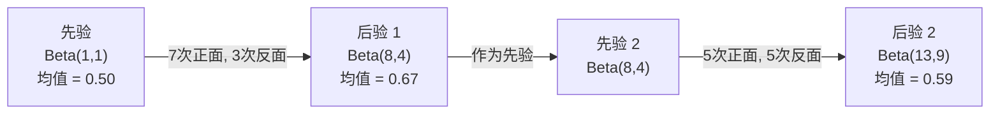

# 贝叶斯定理

> 概率是关于你期望什么。贝叶斯定理是关于你学到了什么。

**Type:** 构建  
**Language:** Python  
**Prerequisites:** 第1阶段，第06课（概率基础）  
**Time:** ~75 分钟

## 学习目标

- 应用贝叶斯定理从先验、似然和证据中计算后验概率  
- 从头构建带有拉普拉斯平滑和对数空间计算的朴素贝叶斯文本分类器  
- 比较 MLE 和 MAP 估计，并解释 MAP 如何对应于 L2 正则化  
- 使用 Beta-Binomial 共轭先验为 A/B 测试实现顺序贝叶斯更新

## 问题背景

一个医学检测的准确率是 99%。你检测呈阳性。你实际患病的几率是多少？

大多数人会说 99%。真实答案取决于疾病的罕见程度。如果每 10,000 人只有 1 人患病，那么检测阳性时你实际上大约只有 1% 的概率是生病的。其余 99% 的阳性结果来自健康人的误报。

这不是一个脑筋急转弯。这就是贝叶斯定理。每一个垃圾邮件过滤器、每一个医学诊断、每一个量化不确定性的机器学习模型都使用完全相同的推理：你从一个信念开始，观察证据，然后更新信念。

如果在构建 ML 系统时不理解这一点，你会误解模型输出、设置不良阈值，并发布过于自信的预测。

## 概念

### 从联合概率到贝叶斯定理

你在第06课已经知道条件概率是：

```
P(A|B) = P(A and B) / P(B)
```

对称地：

```
P(B|A) = P(A and B) / P(A)
```

两个表达式有相同的分子：P(A and B)。将它们设为相等并重排：

```
P(A and B) = P(A|B) * P(B) = P(B|A) * P(A)

因此：

P(A|B) = P(B|A) * P(A) / P(B)
```

这就是贝叶斯定理。四个量，一个等式。

### 四个部分

| Part | Name | What it means |
|------|------|---------------|
| P(A\|B) | Posterior | 在观察到证据 B 之后你对 A 的更新信念 |
| P(B\|A) | Likelihood | 如果 A 为真，证据 B 出现的概率有多大 |
| P(A) | Prior | 在看到任何证据之前你对 A 的信念 |
| P(B) | Evidence | 在各种可能下看到 B 的总体概率 |

证据项 P(B) 起到归一化作用。你可以用全概率公式展开它：

```
P(B) = P(B|A) * P(A) + P(B|not A) * P(not A)
```

### 医学检测示例

一种疾病影响每 10,000 人中的 1 人。检测准确率为 99%（检测到 99% 的病人，误报率为 1%）。

```
P(sick)          = 0.0001     (先验：疾病罕见)
P(positive|sick) = 0.99       (似然：检测能检测到疾病)
P(positive|healthy) = 0.01    (假阳性率)

P(positive) = P(positive|sick) * P(sick) + P(positive|healthy) * P(healthy)
            = 0.99 * 0.0001 + 0.01 * 0.9999
            = 0.000099 + 0.009999
            = 0.010098

P(sick|positive) = P(positive|sick) * P(sick) / P(positive)
                 = 0.99 * 0.0001 / 0.010098
                 = 0.0098
                 = 0.98%
```

不到 1%。先验占主导。当某个状况很罕见时，即使检测很准确，阳性结果也大多是误报。这就是医生会安排确认检测的原因。

### 垃圾邮件过滤示例

你收到一封包含单词 "lottery" 的邮件。它是垃圾邮件吗？

```
P(spam)                = 0.3      (30% 的邮件是垃圾邮件)
P("lottery"|spam)      = 0.05     (5% 的垃圾邮件包含 "lottery")
P("lottery"|not spam)  = 0.001    (0.1% 的正常邮件包含 "lottery")

P("lottery") = 0.05 * 0.3 + 0.001 * 0.7
             = 0.015 + 0.0007
             = 0.0157

P(spam|"lottery") = 0.05 * 0.3 / 0.0157
                  = 0.955
                  = 95.5%
```

一个词就把概率从 30% 推高到 95.5%。真正的垃圾邮件过滤器会把贝叶斯定理应用到数百个词上。

### 朴素贝叶斯：独立性假设

朴素贝叶斯通过假设在给定类别的条件下所有特征相互独立，将其扩展到多个特征：

```
P(class | feature_1, feature_2, ..., feature_n)
  = P(class) * P(feature_1|class) * P(feature_2|class) * ... * P(feature_n|class)
    / P(feature_1, feature_2, ..., feature_n)
```

“朴素”之处在于独立性假设。在文本中，词的出现不是独立的（例如 "New" 和 "York" 是相关的）。但是这个假设在实践中效果出乎意料地好，因为分类器只需要对类进行排序，而不是产生校准过的概率。

由于分母对所有类别都相同，你可以跳过它，只比较分子：

```
score(class) = P(class) * product of P(feature_i | class)
```

选择得分最高的类别。

### 最大似然估计（MLE）

如何从训练数据中得到 P(feature|class)？计数。

```
P("free"|spam) = (number of spam emails containing "free") / (total spam emails)
```

这就是 MLE：选择使观测数据最有可能的参数值。对于离散计数，最大化似然函数等价于相对频率。

问题：如果一个词在训练期间从未出现在垃圾邮件中，MLE 会给它概率零。一个未见过的词会使整个乘积为零。用拉普拉斯平滑修复这个问题：

```
P(word|class) = (count(word, class) + 1) / (total_words_in_class + vocabulary_size)
```

对每个计数加 1 可以确保没有概率为零。 （拉普拉斯平滑，也称为加一平滑）

### 最大后验估计（MAP）

MLE 问：哪些参数最大化 P(data|parameters)？

MAP 问：哪些参数最大化 P(parameters|data)？

通过贝叶斯定理：

```
P(parameters|data) proportional to P(data|parameters) * P(parameters)
```

MAP 在参数上添加了先验。如果你相信参数应该较小，可以将其编码为惩罚大值的先验。这与 ML 中的 L2 正则化是相同的。岭回归中的“ridge”惩罚实际上是对权重的高斯先验。

| Estimation | Optimizes | ML equivalent |
|------------|-----------|---------------|
| MLE | P(data\|params) | 无正则化训练 |
| MAP | P(data\|params) * P(params) | L2 / L1 正则化 |

### 贝叶斯与频率学派：实际差别

频率学派将参数视为固定的未知量。他们问：“如果我重复这个实验很多次，会发生什么？”

贝叶斯派将参数视为分布。他们问：“鉴于我观察到的内容，我对参数有什么信念？”

对于构建 ML 系统，实际差别在于：

| Aspect | Frequentist | Bayesian |
|--------|-------------|----------|
| Output | 点估计 | 参数的分布 |
| Uncertainty | 置信区间（关于过程） | 可信区间（关于参数） |
| Small data | 可能过拟合 | 先验起到正则化作用 |
| Computation | 通常更快 | 常需采样（MCMC） |

大多数生产 ML 是频率主义的（SGD，点估计）。当你需要校准的不确定性（医学决策、安全关键系统）或当数据稀缺（少样本学习、冷启动）时，贝叶斯方法更有优势。

### 为什么贝叶斯思维对 ML 很重要

连接比比喻更深刻：

- 先验就是正则化。权重上的高斯先验就是 L2 正则化；拉普拉斯先验就是 L1。每次你添加正则化项，都是在对参数值做出贝叶斯性的陈述。  
- 后验就是不确定性。单一的预测概率无法告诉你模型对该估计有多自信。贝叶斯方法给出一个分布：“我认为 P(spam) 在 0.8 到 0.95 之间。”  
- 贝叶斯更新就是在线学习。今天的后验成为明天的先验。当模型看到新数据时，它是增量更新信念，而不是从头重新训练。  
- 模型比较是贝叶斯的。贝叶斯信息准则（BIC）、边缘似然和贝叶斯因子都使用贝叶斯推理在不发生过拟合的情况下在模型间进行选择。

```figure
bayes-update
```

## 动手实现

### 步骤 1：贝叶斯定理函数

```python
def bayes(prior, likelihood, false_positive_rate):
    evidence = likelihood * prior + false_positive_rate * (1 - prior)
    posterior = likelihood * prior / evidence
    return posterior

result = bayes(prior=0.0001, likelihood=0.99, false_positive_rate=0.01)
print(f"P(sick|positive) = {result:.4f}")
```

### 步骤 2：朴素贝叶斯分类器

```python
import math
from collections import defaultdict

class NaiveBayes:
    def __init__(self, smoothing=1.0):
        self.smoothing = smoothing
        self.class_counts = defaultdict(int)
        self.word_counts = defaultdict(lambda: defaultdict(int))
        self.class_word_totals = defaultdict(int)
        self.vocab = set()

    def train(self, documents, labels):
        for doc, label in zip(documents, labels):
            self.class_counts[label] += 1
            words = doc.lower().split()
            for word in words:
                self.word_counts[label][word] += 1
                self.class_word_totals[label] += 1
                self.vocab.add(word)

    def predict(self, document):
        words = document.lower().split()
        total_docs = sum(self.class_counts.values())
        vocab_size = len(self.vocab)
        best_class = None
        best_score = float("-inf")
        for cls in self.class_counts:
            score = math.log(self.class_counts[cls] / total_docs)
            for word in words:
                count = self.word_counts[cls].get(word, 0)
                total = self.class_word_totals[cls]
                score += math.log((count + self.smoothing) / (total + self.smoothing * vocab_size))
            if score > best_score:
                best_score = score
                best_class = cls
        return best_class
```

对数概率可以防止下溢。将许多很小的概率相乘会产生过小的数值而导致浮点问题。对概率取对数后相加在数值上更稳定，并且在数学上等价。

### 步骤 3：在垃圾邮件数据上训练

```python
train_docs = [
    "win free money now",
    "free lottery ticket winner",
    "claim your prize today free",
    "urgent offer free cash",
    "congratulations you won free",
    "meeting tomorrow at noon",
    "project update attached",
    "can we schedule a call",
    "quarterly report review",
    "lunch on thursday sounds good",
    "team standup notes attached",
    "please review the pull request",
]

train_labels = [
    "spam", "spam", "spam", "spam", "spam",
    "ham", "ham", "ham", "ham", "ham", "ham", "ham",
]

classifier = NaiveBayes()
classifier.train(train_docs, train_labels)

test_messages = [
    "free money waiting for you",
    "meeting rescheduled to friday",
    "you won a free prize",
    "please review the attached report",
]

for msg in test_messages:
    print(f"  '{msg}' -> {classifier.predict(msg)}")
```

### 步骤 4：检查学到的概率

```python
def show_top_words(classifier, cls, n=5):
    vocab_size = len(classifier.vocab)
    total = classifier.class_word_totals[cls]
    probs = {}
    for word in classifier.vocab:
        count = classifier.word_counts[cls].get(word, 0)
        probs[word] = (count + classifier.smoothing) / (total + classifier.smoothing * vocab_size)
    sorted_words = sorted(probs.items(), key=lambda x: x[1], reverse=True)
    for word, prob in sorted_words[:n]:
        print(f"    {word}: {prob:.4f}")

print("\nTop spam words:")
show_top_words(classifier, "spam")
print("\nTop ham words:")
show_top_words(classifier, "ham")
```

## 使用现成工具

Scikit-learn 提供了生产就绪的朴素贝叶斯实现：

```python
from sklearn.feature_extraction.text import CountVectorizer
from sklearn.naive_bayes import MultinomialNB
from sklearn.metrics import classification_report

vectorizer = CountVectorizer()
X_train = vectorizer.fit_transform(train_docs)
clf = MultinomialNB()
clf.fit(X_train, train_labels)

X_test = vectorizer.transform(test_messages)
predictions = clf.predict(X_test)
for msg, pred in zip(test_messages, predictions):
    print(f"  '{msg}' -> {pred}")
```

算法相同。CountVectorizer 负责分词和词表构建。MultinomialNB 在内部处理平滑和对数概率。你的 40 行从零实现做的和它一样的事。

## 部署建议

这里构建的 NaiveBayes 类演示了完整流水线：分词、用拉普拉斯平滑估计概率、对数空间预测。文件 `code/bayes.py` 中的代码在没有 Python 之外依赖的情况下可以端到端运行。

### 共轭先验

当先验和后验属于同一种分布族时，该先验称为“共轭先验”。这使得贝叶斯更新在代数上非常简洁——你可以得到闭式的后验，而不需要数值积分。

| Likelihood | Conjugate Prior | Posterior | Example |
|-----------|----------------|-----------|---------|
| Bernoulli | Beta(a, b) | Beta(a + successes, b + failures) | 硬币偏向估计 |
| Normal (known variance) | Normal(mu_0, sigma_0) | Normal(weighted mean, smaller variance) | 传感器校准 |
| Poisson | Gamma(a, b) | Gamma(a + sum of counts, b + n) | 到达率建模 |
| Multinomial | Dirichlet(alpha) | Dirichlet(alpha + counts) | 主题建模、语言模型 |

为什么这很重要：没有共轭先验时，你需要蒙特卡洛采样或变分推断来近似后验。有了共轭先验，你只需更新几个数字。

Beta 分布是实践中最常见的共轭先验。Beta(a, b) 表示你对某个概率参数的信念。其均值为 a/(a+b)。a+b 越大，分布越集中（即越有置信度）。

Beta 先验的特殊情况：
- Beta(1, 1) = 均匀分布。你对该参数没有偏好。
- Beta(10, 10) = 在 0.5 处峰值。你强烈相信参数接近 0.5。
- Beta(1, 10) = 偏向 0。你相信参数较小。

更新规则非常简单：

```
Prior:     Beta(a, b)
Data:      s successes, f failures
Posterior: Beta(a + s, b + f)
```

没有积分。没有采样。只是加法。

### 顺序贝叶斯更新

贝叶斯推断天然是顺序的。今天的后验成为明天的先验。这就是实际系统在不重新处理所有历史数据的情况下增量学习的方法。

具体例子：估计硬币是否公平。

**第 1 天：尚无数据。**  
以 Beta(1, 1) 开始 —— 均匀先验。你没有偏见。  
- 先验均值：0.5  
- 先验在 [0,1] 上是平的

**第 2 天：观察到 7 次正面，3 次反面。**  
后验 = Beta(1 + 7, 1 + 3) = Beta(8, 4)  
- 后验均值：8/12 = 0.667  
- 证据表明硬币偏向正面

**第 3 天：再观察到 5 次正面，5 次反面。**  
使用昨天的后验作为今天的先验。  
后验 = Beta(8 + 5, 4 + 5) = Beta(13, 9)  
- 后验均值：13/22 = 0.591  
- 新的数据更平衡，使估计向 0.5 回落



观察顺序并不影响结果。用 Beta(1,1) 同时更新所有 12 次正面和 8 次反面的结果也是 Beta(13, 9)。顺序更新和批量更新在数学上等价。但顺序更新让你可以在每一步做出决策，而不需要保存原始数据。

这是生产 ML 系统中在线学习的基础。Thompson 采样用于抢占算法、增量推荐系统和流式异常检测都使用这一模式。

### 与 A/B 测试的联系

A/B 测试本质上就是贝叶斯推断的另一种表述。

设置：你在测试两个按钮颜色。A 变体（蓝色）和 B 变体（绿色）。你想知道哪个能获得更多点击。

贝叶斯 A/B 测试流程：

1. 先验。对两个变体都以 Beta(1, 1) 开始。没有偏好。  
2. 数据。A：1000 次展示中 50 次点击。B：1000 次展示中 65 次点击。  
3. 后验。  
   - A: Beta(1 + 50, 1 + 950) = Beta(51, 951)。均值 = 0.051  
   - B: Beta(1 + 65, 1 + 935) = Beta(66, 936)。均值 = 0.066  
4. 决策。计算 P(B > A) —— B 的真实转化率大于 A 的概率。

解析计算 P(B > A) 很难，但蒙特卡洛让它变得简单：

```
1. 从 Beta(51, 951) 抽取 100,000 个样本 -> samples_A
2. 从 Beta(66, 936) 抽取 100,000 个样本 -> samples_B
3. P(B > A) = samples_B > samples_A 的比例
```

如果 P(B > A) > 0.95，就上线变体 B。如果在 0.05 到 0.95 之间，就继续收集数据。如果 P(B > A) < 0.05，就上线变体 A。

相对于频率学派 A/B 测试的优势：
- 你得到直接的概率陈述：“B 更好的概率是 97%”  
- 没有 p 值混淆。没有“未能拒绝原假设”的含糊其辞。  
- 你可以随时检查结果而不会提高假阳性率（不存在“窥探问题”，前提是先验和模型指定得当）。  
- 你可以纳入先验知识（例如以前的测试通常表明转化率在 3%-8%）。

| Aspect | Frequentist A/B | Bayesian A/B |
|--------|----------------|--------------|
| Output | p-value | P(B > A) |
| Interpretation | “如果 A=B，这个数据有多惊讶？” | “B 比 A 更好的可能性有多大？” |
| Early stopping | 会提高假阳性率 | 在任何时间点均安全（前提：先验选择恰当且模型正确） |
| Prior knowledge | 不使用 | 以 Beta 先验编码 |
| Decision rule | p < 0.05 | P(B > A) > 阈值 |

## 练习

1. 多次检测。病人进行两次独立检测（两个检测都为 99% 准确，疾病患病率为每 10,000 人 1 人）。在两次检测后 P(sick) 是多少？使用第一次检测的后验作为第二次检测的先验。

2. 平滑影响。用平滑值 0.01、0.1、1.0 和 10.0 运行垃圾邮件分类器。顶级词的概率如何变化？当 smoothing=0 且某词仅出现在 ham 时会发生什么？

3. 添加特征。扩展 NaiveBayes 类，使其除了词计数外还使用消息长度（短/长）作为特征。从训练数据估计 P(short|spam) 和 P(short|ham)，并将其并入预测得分中。

4. 手动求 MAP。给定观察数据（10 次投掷中出现 7 次正面），使用 Beta(2,2) 先验计算偏差的 MAP 估计。与 MLE 估计（7/10）比较。

## 关键词

| Term | What people say | What it actually means |
|------|----------------|----------------------|
| Prior | "My initial guess" | 在观察证据之前的 P(假设)。在 ML 中：正则化项。 |
| Likelihood | "How well the data fits" | P(证据\|假设)。在特定假设下观测数据出现的概率。 |
| Posterior | "My updated belief" | P(假设\|证据)。先验乘以似然，然后归一化。 |
| Evidence | "The normalizing constant" | 在所有假设下的 P(数据)。确保后验和为 1。 |
| Naive Bayes | "That simple text classifier" | 假设在给定类别的条件下特征相互独立的分类器。尽管假设不真实，但效果很好。 |
| Laplace smoothing | "Add-one smoothing" | 对每个特征加一个小计数以防止未见数据出现零概率。 |
| MLE | "Just use the frequencies" | 选择最大化 P(数据\|参数) 的参数。没有先验。小数据时可能过拟合。 |
| MAP | "MLE with a prior" | 选择最大化 P(数据\|参数) * P(参数) 的参数。等价于正则化的 MLE。 |
| Log-probability | "Work in log space" | 使用 log(P) 而不是 P，以避免在相乘许多小数时出现浮点下溢。 |
| False positive | "A wrong alarm" | 检测显示阳性，但真实状态为阴性。这推动基率谬误。 |

## 延伸阅读

- [3Blue1Brown: Bayes' theorem](https://www.youtube.com/watch?v=HZGCoVF3YvM) - 使用医学检测示例的可视化解释  
- [Stanford CS229: Generative Learning Algorithms](https://cs229.stanford.edu/notes2022fall/cs229-notes2.pdf) - 讲解朴素贝叶斯及其与判别模型的联系  
- [Think Bayes](https://greenteapress.com/wp/think-bayes/) - 免费书籍，包含带 Python 代码的贝叶斯统计  
- [scikit-learn Naive Bayes](https://scikit-learn.org/stable/modules/naive_bayes.html) - 生产实现及各变体的适用场景