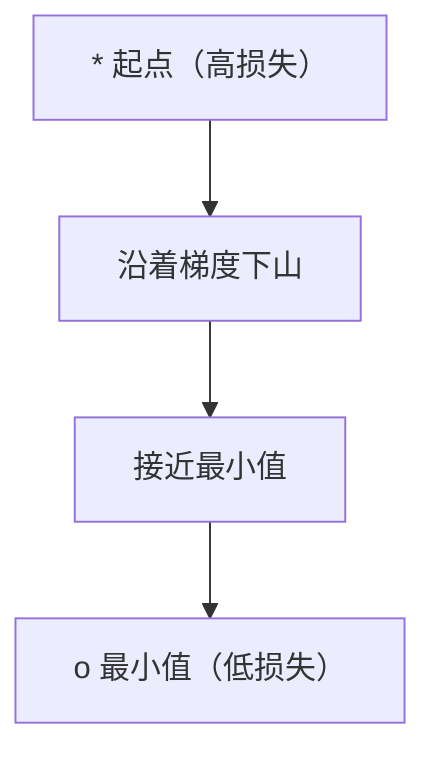
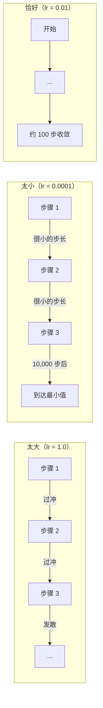
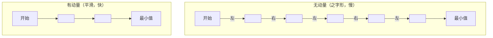
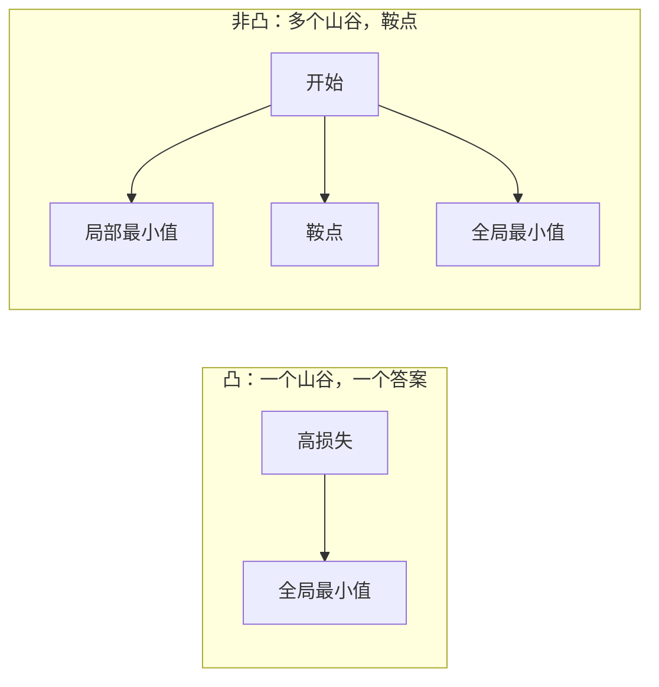
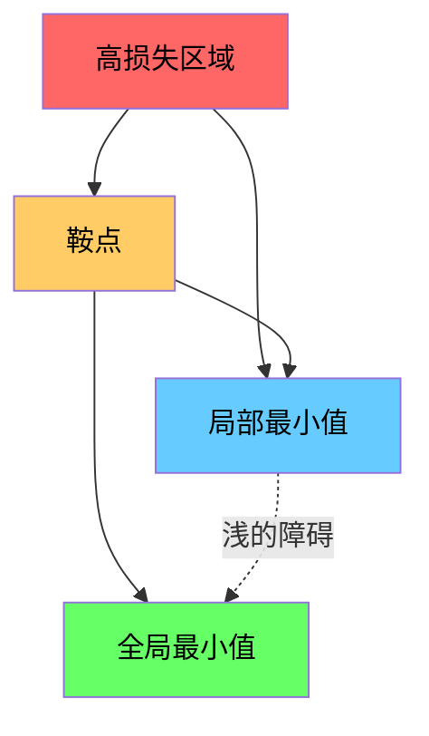

# 优化

> 训练神经网络不过是找到山谷底部的过程。

**Type:** 构建
**Language:** Python
**Prerequisites:** Phase 1，Lessons 04-05（导数，梯度）
**Time:** ~75 分钟

## 学习目标

- 从零实现标准梯度下降、带动量的 SGD 和 Adam
- 在 Rosenbrock 函数上比较优化器的收敛性，并解释为什么 Adam 会为每个权重自适应学习率
- 区分凸与非凸损失景观，并解释高维中鞍点的作用
- 配置学习率调度（阶梯衰减、余弦退火、warmup）以提高训练稳定性

## 问题简介

你有一个损失函数。它告诉你模型有多糟。你有梯度。它告诉你哪个方向会让损失变大（因此你应当反向前进）。现在你需要一个下山的策略。

最朴素的方法很简单：沿梯度的反方向移动。用一个叫做学习率的数来缩放步长。重复。这就是梯度下降，它可行。但“可行”有前提。学习率太大会直接越过山谷，在两壁间震荡。太小则会在数千个不必要的步骤中缓慢爬行。遇到鞍点时，你会停止移动，即使还没找到极小值。

深度学习中的每个优化器都是对同一个问题的不同回答：如何更快、更可靠地到达山谷底部？

## 概念

### 什么是优化

优化就是找到使函数最小化（或最大化）的输入值。在机器学习中，函数是损失，输入是模型的权重。训练就是优化。

```
minimize L(w) where:
  L = loss function
  w = model weights (could be millions of parameters)
```

### 梯度下降（标准）

最简单的优化器。对每个权重计算损失的梯度。沿梯度的反方向移动每个权重。用学习率缩放步长。

```
w = w - lr * gradient
```

这就是整个算法。一行代码。



### 学习率：最重要的超参数

学习率控制步长。它决定了收敛的一切属性。



没有确定的公式来决定正确的学习率。需要通过实验寻找。常见起点：Adam 使用 0.001，带动量的 SGD 使用 0.01。

### SGD、批量和小批量

标准梯度下降在更新前计算整个数据集上的梯度，称为批量梯度下降。它稳定但慢。

随机梯度下降（SGD）在单个随机样本上计算梯度并立即更新。它有噪声但速度快。

小批量梯度下降取两者折中。在一个小批量（32、64、128、256 样本）上计算梯度然后更新。这是实际中大家使用的方式。

| 变体 | 批量大小 | 梯度质量 | 每步速度 | 噪声 |
|---------|-----------|-----------------|---------------|-------|
| Batch GD | 整个数据集 | 精确 | 慢 | 无 |
| SGD | 1 个样本 | 非常嘈杂 | 快 | 高 |
| Mini-batch | 32-256 | 良好估计 | 平衡 | 中等 |

SGD 和小批量的噪声不是缺陷。它有助于逃离浅的局部最小值和鞍点。

### 动量：下山滚动的球

标准梯度下降只看当前梯度。如果梯度来回摆动（在狭窄的谷中很常见），进展会很慢。动量通过将过去的梯度累积为速度项来修复这一点。

```
v = beta * v + gradient
w = w - lr * v
```

类比：一个在山坡上滚动的球。它不会在每个小凸起处停下再起步。它在一致方向上积累速度并抑制振荡。



`beta`（通常为 0.9）控制保留历史的程度。较高的 beta 意味着更大的动量、更平滑的路径，但对方向变化的响应更慢。

### Adam：自适应学习率

不同的权重需要不同的学习率。很少收到大梯度的权重在突然收到梯度时应该采取更大的步幅。持续收到巨大梯度的权重应该采取更小的步幅。

Adam（Adaptive Moment Estimation）为每个权重跟踪两件事：

1. 一阶矩（m）：梯度的移动平均（类似动量）
2. 二阶矩（v）：梯度平方的移动平均（梯度幅度）

```
m = beta1 * m + (1 - beta1) * gradient
v = beta2 * v + (1 - beta2) * gradient^2

m_hat = m / (1 - beta1^t)    偏差修正
v_hat = v / (1 - beta2^t)    偏差修正

w = w - lr * m_hat / (sqrt(v_hat) + epsilon)
```

除以 `sqrt(v_hat)` 是关键洞见。具有大梯度的权重被一个大数除（有效步长变小）。具有小梯度的权重被一个小数除（有效步长变大）。每个权重都有自己的自适应学习率。

默认超参数：`lr=0.001, beta1=0.9, beta2=0.999, epsilon=1e-8`。这些默认值对大多数问题表现良好。

### 学习率调度

固定学习率是一种折中。训练初期希望大步长以快速推进；训练后期希望小步长以在最小值附近微调。

常见调度：

| 调度 | 公式 | 使用场景 |
|----------|---------|----------|
| 阶梯衰减 | lr = lr * factor 每 N 个 epoch | 简单、手动控制 |
| 指数衰减 | lr = lr_0 * decay^t | 平滑衰减 |
| 余弦退火 | lr = lr_min + 0.5 * (lr_max - lr_min) * (1 + cos(pi * t / T)) | Transformer、现代训练 |
| Warmup + 衰减 | 线性升温，然后衰减 | 大模型，防止训练早期不稳定 |

### 凸与非凸

凸函数只有一个极小值。梯度下降总能找到它。像 `f(x) = x^2` 这样的二次函数是凸的。

神经网络的损失函数是非凸的。它们有许多局部极小值、鞍点和平坦区域。



在实践中，高维神经网络中的局部极小值很少成为问题。大多数局部极小值的损失值接近全局极小值。真正的障碍是鞍点（某些方向是平的，某些方向是曲率）。动量和小批量噪声有助于逃离它们。

### 损失景观可视化

损失是所有权重的函数。对于有 100 万个权重的模型，损失景观存在于 1,000,001 维空间中。我们通过在权重空间中选择两个随机方向并绘制沿这些方向的损失来可视化它，产生一个二维表面。



尖锐的极小值泛化性能差。平坦的极小值泛化性能好。这也是为什么带动量的 SGD 在最终测试精度上常常优于 Adam 的原因之一：它的噪声防止模型陷入尖锐极小值。

```figure
gradient-descent
```

## 实现

### 第 1 步：定义测试函数

Rosenbrock 函数是一个经典的优化基准。它的最小值在 (1, 1)，位于一个狭窄弯曲的谷中，容易找到但难以沿谷底跟踪。

```
f(x, y) = (1 - x)^2 + 100 * (y - x^2)^2
```

```python
def rosenbrock(params):
    x, y = params
    return (1 - x) ** 2 + 100 * (y - x ** 2) ** 2

def rosenbrock_gradient(params):
    x, y = params
    df_dx = -2 * (1 - x) + 200 * (y - x ** 2) * (-2 * x)
    df_dy = 200 * (y - x ** 2)
    return [df_dx, df_dy]
```

### 第 2 步：标准梯度下降

```python
class GradientDescent:
    def __init__(self, lr=0.001):
        self.lr = lr

    def step(self, params, grads):
        return [p - self.lr * g for p, g in zip(params, grads)]
```

### 第 3 步：带动量的 SGD

```python
class SGDMomentum:
    def __init__(self, lr=0.001, momentum=0.9):
        self.lr = lr
        self.momentum = momentum
        self.velocity = None

    def step(self, params, grads):
        if self.velocity is None:
            self.velocity = [0.0] * len(params)
        self.velocity = [
            self.momentum * v + g
            for v, g in zip(self.velocity, grads)
        ]
        return [p - self.lr * v for p, v in zip(params, self.velocity)]
```

### 第 4 步：Adam

```python
class Adam:
    def __init__(self, lr=0.001, beta1=0.9, beta2=0.999, epsilon=1e-8):
        self.lr = lr
        self.beta1 = beta1
        self.beta2 = beta2
        self.epsilon = epsilon
        self.m = None
        self.v = None
        self.t = 0

    def step(self, params, grads):
        if self.m is None:
            self.m = [0.0] * len(params)
            self.v = [0.0] * len(params)

        self.t += 1

        self.m = [
            self.beta1 * m + (1 - self.beta1) * g
            for m, g in zip(self.m, grads)
        ]
        self.v = [
            self.beta2 * v + (1 - self.beta2) * g ** 2
            for v, g in zip(self.v, grads)
        ]

        m_hat = [m / (1 - self.beta1 ** self.t) for m in self.m]
        v_hat = [v / (1 - self.beta2 ** self.t) for v in self.v]

        return [
            p - self.lr * mh / (vh ** 0.5 + self.epsilon)
            for p, mh, vh in zip(params, m_hat, v_hat)
        ]
```

### 第 5 步：运行并比较

```python
def optimize(optimizer, func, grad_func, start, steps=5000):
    params = list(start)
    history = [params[:]]
    for _ in range(steps):
        grads = grad_func(params)
        params = optimizer.step(params, grads)
        history.append(params[:])
    return history

start = [-1.0, 1.0]

gd_history = optimize(GradientDescent(lr=0.0005), rosenbrock, rosenbrock_gradient, start)
sgd_history = optimize(SGDMomentum(lr=0.0001, momentum=0.9), rosenbrock, rosenbrock_gradient, start)
adam_history = optimize(Adam(lr=0.01), rosenbrock, rosenbrock_gradient, start)

for name, history in [("GD", gd_history), ("SGD+M", sgd_history), ("Adam", adam_history)]:
    final = history[-1]
    loss = rosenbrock(final)
    print(f"{name:6s} -> x={final[0]:.6f}, y={final[1]:.6f}, loss={loss:.8f}")
```

预期输出：Adam 收敛最快。带动量的 SGD 路径更平滑。标准 GD 在狭窄的谷底上进展缓慢。

## 实战建议

在实践中，使用 PyTorch 或 JAX 的优化器。它们处理参数组、权重衰减、梯度裁剪和 GPU 加速。

```python
import torch

model = torch.nn.Linear(784, 10)

sgd = torch.optim.SGD(model.parameters(), lr=0.01, momentum=0.9)
adam = torch.optim.Adam(model.parameters(), lr=0.001)
adamw = torch.optim.AdamW(model.parameters(), lr=0.001, weight_decay=0.01)

scheduler = torch.optim.lr_scheduler.CosineAnnealingLR(adam, T_max=100)
```

经验法则：

- 从 Adam（lr=0.001）开始。它在大多数问题上不需要太多调参就能工作。
- 当需要最佳的最终精度并且可以投入更多调参时，切换到带动量的 SGD（lr=0.01，momentum=0.9）。
- 对于 Transformer，使用 AdamW（带解耦权重衰减的 Adam）。
- 对于训练超过几个 epoch 的任务，始终使用学习率调度。
- 如果训练不稳定，降低学习率。如果训练太慢，增大学习率。

## 部署提示

本课将生成一个用于选择合适优化器的提示（prompt）：见 `outputs/prompt-optimizer-guide.md`。

此处实现的优化器类将在第 3 阶段中再次出现，当我们从头训练一个神经网络时会用到它们。

## 练习

1. **学习率扫描。** 在 Rosenbrock 函数上用学习率 [0.0001, 0.0005, 0.001, 0.005, 0.01] 运行标准梯度下降。绘图或打印每个学习率在 5000 步后的最终损失。找出仍然收敛的最大学习率。

2. **动量比较。** 在 Rosenbrock 函数上用动量值 [0.0, 0.5, 0.9, 0.99] 运行带动量的 SGD。记录每一步的损失。哪个动量值收敛最快？哪个会过冲？

3. **鞍点逃逸。** 定义函数 `f(x, y) = x^2 - y^2`（原点是一个鞍点）。从 (0.01, 0.01) 开始。比较标准 GD、带动量的 SGD 和 Adam 的行为。哪个能逃离鞍点？

4. **实现学习率衰减。** 在 GradientDescent 类中添加指数衰减调度：`lr = lr_0 * 0.999^step`。比较在 Rosenbrock 函数上有无衰减时的收敛性差异。

## 关键词

| 术语 | 常见说法 | 实际含义 |
|------|----------------|----------------------|
| Gradient descent | "下山" | 通过减去学习率缩放后的梯度来更新权重。最基本的优化器。 |
| Learning rate | "步长" | 控制每次更新权重移动多少的标量。太大会导致发散，太小则浪费计算。 |
| Momentum | "保持滚动" | 将过去的梯度累积为速度向量。抑制振荡并在一致方向上加速移动。 |
| SGD | "随机采样" | 随机梯度下降。在全量数据之外随机子集上计算梯度。实际中几乎总指小批量 SGD。 |
| Mini-batch | "一块数据" | 用于估计梯度的一小部分训练数据（32-256 样本）。平衡速度与梯度精度。 |
| Adam | "默认优化器" | Adaptive Moment Estimation。跟踪每个权重的梯度和梯度平方的移动平均，从而赋予每个权重自己的学习率。 |
| Bias correction | "修正冷启动偏差" | Adam 的一阶和二阶矩初始化为零。偏差修正通过除以 (1 - beta^t) 来补偿早期的偏差。 |
| Learning rate schedule | "随时间调整 lr" | 在训练过程中调整学习率的函数。早期大步长，后期小步长。 |
| Convex function | "一个山谷" | 任意局部最小值都是全局最小值的函数。梯度下降总能找到它。神经网络损失不是凸的。 |
| Saddle point | "平坦但不是最小值" | 梯度为零但在某些方向是极小值、在另一些方向是极大值的点。高维中常见。 |
| Loss landscape | "地形" | 在权重空间上绘制的损失函数。通过沿两个随机方向切片来可视化。 |
| Convergence | "到达目标" | 优化器已到达一个进一步步骤不会显著降低损失的点。 |

## 拓展阅读

- [Sebastian Ruder: An overview of gradient descent optimization algorithms](https://ruder.io/optimizing-gradient-descent/) - 对主要优化器的全面综述
- [Why Momentum Really Works (Distill)](https://distill.pub/2017/momentum/) - 动量动力学的交互式可视化
- [Adam: A Method for Stochastic Optimization (Kingma & Ba, 2014)](https://arxiv.org/abs/1412.6980) - Adam 原始论文，简短且易读
- [Visualizing the Loss Landscape of Neural Nets (Li et al., 2018)](https://arxiv.org/abs/1712.09913) - 展示尖锐与平坦极小值的论文