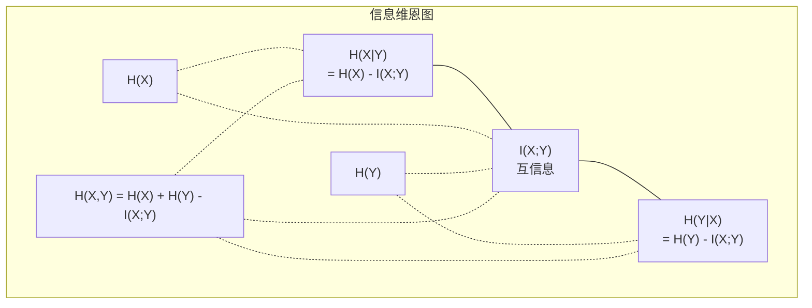

# 信息论

> 信息论衡量惊讶（surprise）。损失函数建立在它之上。

**Type:** 学习  
**Language:** Python  
**Prerequisites:** 第1阶段，第06课（概率）  
**Time:** ~60 分钟

## 学习目标

- 从头计算熵、交叉熵和 KL 散度并解释它们之间的关系  
- 推导为什么最小化交叉熵损失等价于最大化对数似然  
- 计算特征与目标之间的互信息以对特征重要性进行排序  
- 解释困惑度（perplexity）作为语言模型在选择词表时的有效候选数

## 问题背景

你在每个分类模型中都会调用 `CrossEntropyLoss()`。你在几乎所有语言模型论文中都会看到“perplexity”。你在 VAE、蒸馏和 RLHF 中读到 KL 散度。这些并非互不相干的概念。它们都是同一思想在不同场景下的表现形式。

信息论为你提供了描述不确定性、压缩与预测的语言。Claude Shannon 在 1948 年为解决通信问题发明了信息论。事实证明，训练神经网络本质上也是一个通信问题：模型试图通过学习到的权重这个嘈杂信道传递正确的标签。

本课从头推导每个公式，让你看到它们的来龙去脉以及为何有效。

## 概念

### 信息含量（惊讶）

当一个不太可能的事件发生时，它携带更多信息。硬币正面朝上？不惊讶。中彩票？非常惊讶。

一个概率为 p 的事件的信息含量定义为：

```
I(x) = -log(p(x))
```

使用以 2 为底的对数得到比特（bits）。使用自然对数得到纳特（nats）。其含义相同，仅单位不同。

```
事件               概率           惊讶（比特）
公平硬币正面       0.5            1.0
掷出 6 的点数      0.167          2.58
千分之一事件       0.001          9.97
确定事件           1.0            0.0
```

确定事件携带零信息量——你已经知道它会发生。

### 熵（平均惊讶）

熵是对分布中所有可能结果的期望惊讶值。

```
H(P) = -sum( p(x) * log(p(x)) )  对所有 x 求和
```

对于二元变量，公平硬币具有最大熵：1 比特。偏向的硬币（99% 正面）熵很低：0.08 比特。你几乎已经知道结果，因此每次抛掷几乎不会告诉你任何新信息。

```
公平硬币:    H = -(0.5 * log2(0.5) + 0.5 * log2(0.5)) = 1.0 比特
偏置硬币:    H = -(0.99 * log2(0.99) + 0.01 * log2(0.01)) = 0.08 比特
```

熵衡量分布中不可约的不确定性。你无法把数据压缩到低于熵的程度。

### 交叉熵（你每天使用的损失函数）

交叉熵衡量当你使用分布 Q 对实际上来自分布 P 的事件进行编码时的平均惊讶。

```
H(P, Q) = -sum( p(x) * log(q(x)) )  对所有 x 求和
```

P 是真实分布（标签）。Q 是模型的预测。如果 Q 完全匹配 P，交叉熵等于熵。任意不匹配都会使其增大。

在分类问题中，P 是 one-hot 向量（真实类别概率为 1，其余为 0）。这将交叉熵简化为：

```
H(P, Q) = -log(q(true_class))
```

这就是分类交叉熵损失的全部公式。最大化对正确类别的预测概率。

### KL 散度（分布间的“距离”）

KL 散度衡量使用 Q 替代 P 带来的额外惊讶量。

```
D_KL(P || Q) = sum( p(x) * log(p(x) / q(x)) )  对所有 x 求和
             = H(P, Q) - H(P)
```

交叉熵等于熵加上 KL 散度。由于真实分布的熵在训练过程中是常数，最小化交叉熵等价于最小化 KL 散度。你正在将模型的分布推向真实分布。

KL 散度并不对称：D_KL(P || Q) != D_KL(Q || P)。它不是一个真正的距离度量。

### 互信息

互信息衡量知道一个变量能减少关于另一个变量多少不确定性。

```
I(X; Y) = H(X) - H(X|Y)
        = H(X) + H(Y) - H(X, Y)
```

若 X 和 Y 相互独立，则互信息为 0。知道一个变量不会告诉你另一个变量的任何信息。若它们完全相关，互信息等于任一变量的熵。

在特征选择中，特征与目标之间高互信息意味着该特征有用；低互信息意味着它只是噪声。

### 条件熵

H(Y|X) 衡量在观测到 X 之后 Y 剩余多少不确定性。

```
H(Y|X) = H(X,Y) - H(X)
```

两个极端情况：
- 若 X 完全决定 Y，则 H(Y|X) = 0。知道 X 消除了对 Y 的所有不确定性。例如：X = 摄氏温度，Y = 华氏温度。
- 若 X 对 Y 毫无信息，则 H(Y|X) = H(Y)。知道 X 并不能减少你对 Y 的不确定性。例如：X = 一次抛硬币，Y = 明天的天气。

条件熵总是非负且不超过 H(Y)：

```
0 <= H(Y|X) <= H(Y)
```

在机器学习中，条件熵出现在决策树中。在每次划分时，算法选择能最小化 H(Y|X) 的特征 X——即能最大程度减少标签 Y 不确定性的特征。

### 联合熵

H(X,Y) 是 X 与 Y 联合分布的熵。

```
H(X,Y) = -sum sum p(x,y) * log(p(x,y))   对所有 x, y 求和
```

关键性质：

```
H(X,Y) <= H(X) + H(Y)
```

当 X 和 Y 独立时取等号。如果它们共享信息，联合熵小于各自熵之和。这个“缺失”的熵正好等于互信息。



这些关系：
- H(X,Y) = H(X) + H(Y|X) = H(Y) + H(X|Y)
- I(X;Y) = H(X) - H(X|Y) = H(Y) - H(Y|X)
- H(X,Y) = H(X) + H(Y) - I(X;Y)

### 互信息（深入）

互信息 I(X;Y) 量化知道一个变量能够减少另一个变量多少不确定性。

```
I(X;Y) = H(X) - H(X|Y)
       = H(Y) - H(Y|X)
       = H(X) + H(Y) - H(X,Y)
       = sum sum p(x,y) * log(p(x,y) / (p(x) * p(y)))
```

性质：
- I(X;Y) >= 0，总是非负。观测不会使你失去信息。
- I(X;Y) = 0 当且仅当 X 与 Y 独立。
- I(X;Y) = I(Y;X)。它是对称的，这一点与 KL 散度不同。
- I(X;X) = H(X)。变量与自身共享全部信息。

互信息用于特征选择。机器学习中，你希望选择对目标信息量大的特征。互信息为你提供了一个原则化的方法来对特征排序：

1. 对每个特征 X_i，计算 I(X_i; Y)，其中 Y 为目标变量。  
2. 按 MI 分数对特征排序。  
3. 保留前 k 个特征。  

该方法适用于任意特征与目标之间的关系——线性、非线性、单调或非单调。相关性只能捕捉线性关系，而互信息能捕捉所有统计依赖关系。

| 方法 | 检测什么 | 计算成本 | 支持分类变量？ |
|------|----------|----------|----------------|
| Pearson 相关系数 | 线性关系 | O(n) | 否 |
| Spearman 相关系数 | 单调关系 | O(n log n) | 否 |
| 互信息 | 任意统计依赖 | 使用分箱时为 O(n log n) | 是 |

### 标签平滑与交叉熵

标准分类使用硬目标：[0, 0, 1, 0]。真实类别概率为 1，其他为 0。标签平滑将其替换为软目标：

```
soft_target = (1 - epsilon) * hard_target + epsilon / num_classes
```

当 epsilon = 0.1、类别数为 4：
- 硬目标:  [0, 0, 1, 0]
- 软目标:  [0.025, 0.025, 0.925, 0.025]

从信息论角度看，标签平滑增加了目标分布的熵。硬的 one-hot 目标熵为 0——没有不确定性。软目标具有正熵。

为何有帮助：
- 防止模型把 logits 推到极端值（要完美匹配 one-hot 目标，交叉熵下需要无穷大的 logits）
- 起到正则化作用：模型不能 100% 自信
- 改善校准：预测概率更好地反映真实不确定性
- 缩小训练与推理行为之间的差距

带标签平滑的交叉熵损失可写为：

```
L = (1 - epsilon) * CE(hard_target, prediction) + epsilon * H_uniform(prediction)
```

第二项惩罚与均匀分布相差较大的预测——直接对置信度进行正则化。

### 为什么交叉熵是分类问题的首选损失

三种视角，同一结论。

信息论视角。交叉熵衡量使用模型分布而非真实分布时浪费了多少比特。最小化它使模型成为对现实的最高效编码器。

最大似然视角。对于 N 个训练样本，真实类别为 y_i：

```
Likelihood     = product( q(y_i) )
Log-likelihood = sum( log(q(y_i)) )
Negative log-likelihood = -sum( log(q(y_i)) )
```

最后一行就是交叉熵损失。最小化交叉熵 = 最大化训练数据在模型下的似然。

梯度视角。交叉熵对 logits 的梯度为 (predicted - true)。计算简单、稳定且快速。这就是它与 softmax 完美配合的原因。

### 比特 vs 纳特

区别仅在对数的底数。

```
以2为底的对数 -> 比特（bits） （信息论传统）
以 e 为底的对数 -> 纳特（nats） （机器学习惯例）
以10为底的对数 -> hartleys （很少用）
```

1 纳特 = 1/ln(2) 比特 = 1.4427 比特。PyTorch 和 TensorFlow 默认使用自然对数（纳特）。

### 困惑度（Perplexity）

困惑度是交叉熵的指数。它告诉你模型在候选集合中平均相当于在几个同等可能的选择间犹豫不决。

```
Perplexity = 2^H(P,Q)   （若使用比特）
Perplexity = e^H(P,Q)   （若使用纳特）
```

一个困惑度为 50 的语言模型，平均而言就像在 50 个可能的下一个词中均匀选择。越低越好。

GPT-2 在常见基准上取得了约 30 的困惑度。现代模型在数据充分代表的领域内已降到个位数。

```figure
entropy-kl
```

## 从零实现

### 第 1 步：信息含量与熵

```python
import math

def information_content(p, base=2):
    if p <= 0 or p > 1:
        return float('inf') if p <= 0 else 0.0
    return -math.log(p) / math.log(base)

def entropy(probs, base=2):
    return sum(
        p * information_content(p, base)
        for p in probs if p > 0
    )

fair_coin = [0.5, 0.5]
biased_coin = [0.99, 0.01]
fair_die = [1/6] * 6

print(f"Fair coin entropy:   {entropy(fair_coin):.4f} bits")
print(f"Biased coin entropy: {entropy(biased_coin):.4f} bits")
print(f"Fair die entropy:    {entropy(fair_die):.4f} bits")
```

### 第 2 步：交叉熵与 KL 散度

```python
def cross_entropy(p, q, base=2):
    total = 0.0
    for pi, qi in zip(p, q):
        if pi > 0:
            if qi <= 0:
                return float('inf')
            total += pi * (-math.log(qi) / math.log(base))
    return total

def kl_divergence(p, q, base=2):
    return cross_entropy(p, q, base) - entropy(p, base)

true_dist = [0.7, 0.2, 0.1]
good_model = [0.6, 0.25, 0.15]
bad_model = [0.1, 0.1, 0.8]

print(f"Entropy of true dist:     {entropy(true_dist):.4f} bits")
print(f"CE (good model):          {cross_entropy(true_dist, good_model):.4f} bits")
print(f"CE (bad model):           {cross_entropy(true_dist, bad_model):.4f} bits")
print(f"KL divergence (good):     {kl_divergence(true_dist, good_model):.4f} bits")
print(f"KL divergence (bad):      {kl_divergence(true_dist, bad_model):.4f} bits")
```

### 第 3 步：交叉熵作为分类损失

```python
def softmax(logits):
    max_logit = max(logits)
    exps = [math.exp(z - max_logit) for z in logits]
    total = sum(exps)
    return [e / total for e in exps]

def cross_entropy_loss(true_class, logits):
    probs = softmax(logits)
    return -math.log(probs[true_class])

logits = [2.0, 1.0, 0.1]
true_class = 0

probs = softmax(logits)
loss = cross_entropy_loss(true_class, logits)

print(f"Logits:      {logits}")
print(f"Softmax:     {[f'{p:.4f}' for p in probs]}")
print(f"True class:  {true_class}")
print(f"Loss:        {loss:.4f} nats")
print(f"Perplexity:  {math.exp(loss):.2f}")
```

### 第 4 步：交叉熵等于负对数似然

```python
import random

random.seed(42)

n_samples = 1000
n_classes = 3
true_labels = [random.randint(0, n_classes - 1) for _ in range(n_samples)]
model_logits = [[random.gauss(0, 1) for _ in range(n_classes)] for _ in range(n_samples)]

ce_loss = sum(
    cross_entropy_loss(label, logits)
    for label, logits in zip(true_labels, model_logits)
) / n_samples

nll = -sum(
    math.log(softmax(logits)[label])
    for label, logits in zip(true_labels, model_logits)
) / n_samples

print(f"Cross-entropy loss:      {ce_loss:.6f}")
print(f"Negative log-likelihood: {nll:.6f}")
print(f"Difference:              {abs(ce_loss - nll):.2e}")
```

### 第 5 步：互信息

```python
def mutual_information(joint_probs, base=2):
    rows = len(joint_probs)
    cols = len(joint_probs[0])

    margin_x = [sum(joint_probs[i][j] for j in range(cols)) for i in range(rows)]
    margin_y = [sum(joint_probs[i][j] for i in range(rows)) for j in range(cols)]

    mi = 0.0
    for i in range(rows):
        for j in range(cols):
            pxy = joint_probs[i][j]
            if pxy > 0:
                mi += pxy * math.log(pxy / (margin_x[i] * margin_y[j])) / math.log(base)
    return mi

independent = [[0.25, 0.25], [0.25, 0.25]]
dependent = [[0.45, 0.05], [0.05, 0.45]]

print(f"MI (independent): {mutual_information(independent):.4f} bits")
print(f"MI (dependent):   {mutual_information(dependent):.4f} bits")
```

## 实践使用

在实际中使用 NumPy 的同样概念：

```python
import numpy as np

def np_entropy(p):
    p = np.asarray(p, dtype=float)
    mask = p > 0
    result = np.zeros_like(p)
    result[mask] = p[mask] * np.log(p[mask])
    return -result.sum()

def np_cross_entropy(p, q):
    p, q = np.asarray(p, dtype=float), np.asarray(q, dtype=float)
    mask = p > 0
    return -(p[mask] * np.log(q[mask])).sum()

def np_kl_divergence(p, q):
    return np_cross_entropy(p, q) - np_entropy(p)

true = np.array([0.7, 0.2, 0.1])
pred = np.array([0.6, 0.25, 0.15])
print(f"Entropy:    {np_entropy(true):.4f} nats")
print(f"Cross-ent:  {np_cross_entropy(true, pred):.4f} nats")
print(f"KL div:     {np_kl_divergence(true, pred):.4f} nats")
```

你已经从头实现了 `torch.nn.CrossEntropyLoss()` 的内部逻辑。现在你知道为什么训练过程中损失会下降：模型预测的分布在测量上（以纳特衡量的浪费信息）正越来越接近真实分布。

## 练习

1. 假设英语字母表均匀分布（26 个字母），计算其熵。然后使用实际字母频率估算熵。哪个更高，为什么？  
2. 对于一个样本，模型输出 logits [5.0, 2.0, 0.5]，真实类别为 1。手工计算交叉熵损失，然后用你的 `cross_entropy_loss` 函数验证。哪些 logits 会给出零损失？  
3. 证明 KL 散度不对称。选取两个分布 P 和 Q，计算 D_KL(P || Q) 与 D_KL(Q || P)。解释为何二者不同。  
4. 构建一个函数来计算一段 token 预测序列的困惑度。给定一个 (true_token_index, predicted_logits) 对的列表，返回该序列的困惑度。

## 关键词

| 术语 | 常见说法 | 实际含义 |
|------|---------|--------|
| 信息含量 | “惊讶” | 编码一个事件所需的比特（或纳特）：-log(p) |
| 熵 | “随机性” | 分布中所有结果的平均惊讶。衡量不可约的不确定性。 |
| 交叉熵 | “损失函数” | 使用模型分布 Q 对来自真实分布 P 的事件进行编码时的平均惊讶。 |
| KL 散度 | “分布之间的距离” | 使用 Q 代替 P 时浪费的额外比特。等于交叉熵减去熵。非对称。 |
| 互信息 | “X 和 Y 有多相关” | 知道 Y 后关于 X 的不确定性减少量。为 0 表示独立。 |
| Softmax | “把 logits 变成概率” | 指数化并归一化。把任意实数向量映射为有效的概率分布。 |
| 困惑度 | “模型有多困惑” | 交叉熵的指数。模型在每一步所从中选择的有效词表大小。 |
| 比特 | “Shannon 的单位” | 使用以 2 为底的对数测量信息。一个比特能消除一次公平硬币抛掷的不确定性。 |
| 纳特 | “机器学习的单位” | 使用自然对数测量信息。PyTorch 与 TensorFlow 默认使用纳特。 |
| 负对数似然 | “NLL 损失” | 对于 one-hot 标签，等同于交叉熵损失。最小化它等价于最大化正确预测的概率。 |

## 进一步阅读

- [Shannon 1948: A Mathematical Theory of Communication](https://people.math.harvard.edu/~ctm/home/text/others/shannon/entropy/entropy.pdf) - 原始论文，仍然可读  
- [Visual Information Theory (Chris Olah)](https://colah.github.io/posts/2015-09-Visual-Information/) - 解释熵与 KL 散度的最佳可视化文章  
- [PyTorch CrossEntropyLoss docs](https://pytorch.org/docs/stable/generated/torch.nn.CrossEntropyLoss.html) - 框架如何实现你刚刚构建的内容