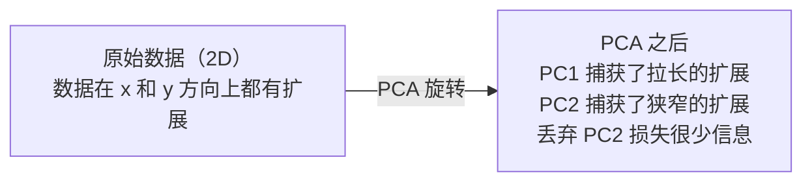

# 降维

> 高维数据有结构。用正确的角度观察，你就能找到它。

**Type:** 构建
**Language:** Python
**Prerequisites:** 阶段 1，课程 01（线性代数直观）、02（向量、矩阵与运算）、03（特征值与特征向量）、06（概率与分布）
**Time:** ~90 分钟

## 学习目标

- 从头实现 PCA：对数据中心化、计算协方差矩阵、特征分解并进行投影
- 使用解释方差比率和肘部法则选择主成分的数量
- 将 PCA、t-SNE 和 UMAP 在 MNIST 手写数字上进行 2D 可视化比较，并解释它们的权衡
- 使用 RBF 核的核 PCA 处理标准 PCA 无法分离的非线性数据结构

## 问题描述

你的数据集每个样本有 784 个特征。也许它是手写数字的像素值；也许是基因表达量；也许是用户行为信号。你无法可视化 784 维。你无法绘制它们，甚至无法直观思考它们。

但大多数这 784 个特征是冗余的。实际的信息分布在一个更小的流形上。手写的“7”不需要 784 个独立数值来描述；它只需要几个：笔画的角度、横杠的长度、倾斜程度。其余的是噪声。

降维就是找到那个更小的流形。它把你的 784 维数据压缩到 2、10 或 50 维，同时保留重要的结构。

## 概念

### 维度灾难

高维空间很不直观。随着维度增加，有三件事会出问题。

距离变得毫无意义。在高维中，任意两点之间的距离趋于相同。如果每个点与其他点的距离大致相同，最近邻搜索就失效了。

```
Dimension    Avg distance ratio (max/min between random points)
2            ~5.0
10           ~1.8
100          ~1.2
1000         ~1.02
```

体积集中在角落。d 维单位超立方体有 2^d 个角。在 100 维中，几乎所有体积都在角落，远离中心。数据点扩散到边缘，模型在内部区域缺乏数据。

你需要指数级更多的数据。为了在空间中保持相同的样本密度，从 2D 到 20D 需要 10^18 倍的数据。你永远不可能拥有足够的数据。降低维度能把数据密度恢复到可操作的范围。

### PCA：找到重要的方向

主成分分析（Principal Component Analysis，PCA）找到数据变化最多的轴。它旋转坐标系，使得第一个轴捕获最多的方差，第二个轴捕获次多，依此类推。

算法步骤：

```
1. Center the data        (subtract the mean from each feature)
2. Compute covariance     (how features move together)
3. Eigendecomposition     (find the principal directions)
4. Sort by eigenvalue     (biggest variance first)
5. Project               (keep top k eigenvectors, drop the rest)
```

为什么使用特征分解？协方差矩阵是对称且半正定的。它的特征向量是在特征空间中的正交方向。特征值告诉你每个方向捕获了多少方差。对应最大特征值的特征向量指向最大方差方向。



- 在 PCA 之前：数据云沿对角线方向在 x 和 y 轴上扩展
- 在 PCA 之后：坐标系被旋转，使 PC1 对齐到最大方差方向（拉长的扩展），PC2 对齐到最小方差方向（狭窄的扩展）
- 降维：丢弃 PC2 将数据投影到 PC1 上，丢失的信息很少

### 解释方差比率

每个主成分捕获总体方差的一部分。解释方差比率告诉你占比是多少。

```
Component    Eigenvalue    Explained ratio    Cumulative
PC1          4.73          0.473              0.473
PC2          2.51          0.251              0.724
PC3          1.12          0.112              0.836
PC4          0.89          0.089              0.925
...
```

当累积解释方差达到 0.95 时，说明这些主成分捕获了 95% 的信息。之后的部分主要是噪声。

### 选择主成分数量

三种策略：

1. 阈值法：保留足够多的主成分以解释 90%–95% 的方差。
2. 肘部法：绘制每个主成分的解释方差。寻找明显的拐点（陡降）。
3. 下游性能：将 PCA 作为预处理。扫过不同的 k 并测量模型准确率。在准确率平稳处选择 k。

### t-SNE：保留邻域关系

t-分布随机近邻嵌入（t-SNE）用于可视化。它把高维数据映射到 2D（或 3D），同时尽可能保留点之间的邻近关系。

直觉：在原始空间中，基于距离为点对计算概率分布。邻近点获得较高概率，远离点概率较低。然后寻找一个 2D 布局，使得相同的概率分布在低维中成立。原来在 784 维中是邻居的点在 2D 中仍然是邻居。

t-SNE 的关键属性：
- 非线性。它可以展开 PCA 无法处理的复杂流形。
- 随机性。不同运行可能产生不同的布局。
- Perplexity（困惑度）参数控制考虑多少邻居（典型范围：5–50）。
- 输出中簇之间的距离没有明确含义。只有簇本身是有意义的。
- 对大数据集较慢。默认复杂度为 O(n^2)。

### UMAP：更快、更能保留全局结构

统一流形近似与投影（UMAP）与 t-SNE 思路相似，但有两个优势：
- 更快。它使用近似最近邻图，而不是计算所有成对距离。
- 更好的全局结构。输出中簇的相对位置往往比 t-SNE 更有意义。

UMAP 在高维空间中构建加权图（“模糊拓扑表示”），然后寻找一个低维布局尽量保留这个图。

关键参数：
- `n_neighbors`：定义局部结构的邻居数量（类似于 perplexity）。值越高保留越多全局结构。
- `min_dist`：控制输出中点如何紧密地聚集。值越低簇越致密。

### 何时使用哪种方法

| Method | Use case | Preserves | Speed |
|--------|----------|-----------|-------|
| PCA | 训练前的预处理 | 全局方差 | 快（精确），可处理数百万样本 |
| PCA | 快速探索性可视化 | 线性结构 | 快 |
| t-SNE | 用于发表级的 2D 图 | 局部邻域 | 慢（理想样本数 < 10k） |
| UMAP | 大规模的 2D 可视化 | 局部 + 一部分全局结构 | 中等（可处理数百万） |
| PCA | 用于模型的特征降维 | 按方差排序的特征 | 快 |
| t-SNE / UMAP | 理解簇结构 | 簇的分离 | 中到慢 |

经验法则：把 PCA 用作预处理和数据压缩。当需要 2D 可视化结构时，使用 t-SNE 或 UMAP。

### 核 PCA

标准 PCA 找到的是线性子空间。它旋转坐标并丢弃轴。但如果数据位于非线性流形上怎么办？二维平面上的圆无法用一条直线分开，标准 PCA 无能为力。

核 PCA 在由核函数诱导的高维特征空间中应用 PCA，而不显式计算该空间的坐标。这就是核技巧——与 SVM 相同的思想。

算法：
1. 计算核矩阵 K，K_ij = k(x_i, x_j)
2. 在特征空间中中心化核矩阵
3. 对中心化后的核矩阵做特征分解
4. 顶部特征向量（按 1/sqrt(eigenvalue) 缩放）为投影方向

常见核函数：

| Kernel | Formula | Good for |
|--------|---------|----------|
| RBF (Gaussian) | exp(-gamma * \|\|x - y\|\|^2) | 大多数非线性数据，平滑流形 |
| Polynomial | (x . y + c)^d | 多项式关系 |
| Sigmoid | tanh(alpha * x . y + c) | 类神经网络映射 |

何时使用核 PCA 与标准 PCA：

| Criterion | Standard PCA | Kernel PCA |
|-----------|-------------|------------|
| Data structure | 线性子空间 | 非线性流形 |
| Speed | O(min(n^2 d, d^2 n)) | O(n^2 d + n^3) |
| Interpretability | 分量是特征的线性组合 | 分量缺乏直接的特征可解释性 |
| Scalability | 可在数百万样本上工作 | 核矩阵为 n x n，受内存限制 |
| Reconstruction | 直接的逆变换 | 需要前像估计（pre-image approximation） |

经典示例：二维同心圆。两个环形点集，内环与外环。标准 PCA 会把两环投影到同一条线上——对分类毫无帮助。使用 RBF 核的核 PCA 会把内外环映射到不同区域，使它们在线性上可分。

### 重建误差

你的降维效果有多好？你把 784 维压缩到 50 维，损失了什么？

测量重建误差：
1. 将数据投影到 k 维：X_reduced = X @ W_k
2. 重建：X_hat = X_reduced @ W_k^T
3. 计算 MSE：mean((X - X_hat)^2)

对于 PCA，重建误差与解释方差之间有清晰关系：

```
Reconstruction error = sum of eigenvalues NOT included
Total variance = sum of ALL eigenvalues
Fraction lost = (sum of dropped eigenvalues) / (sum of all eigenvalues)
```

每个分量的解释方差比率为：

```
explained_ratio_k = eigenvalue_k / sum(all eigenvalues)
```

绘制累计解释方差随主成分数量的曲线可以得到“肘部”图。合适的主成分数量通常满足：
- 曲线趋于平缓（边际收益递减）
- 累积方差越过你的阈值（通常为 0.90 或 0.95）
- 下游任务性能趋于平稳

重建误差的用途不仅限于选择 k。你也可以用于异常检测：具有高重建误差的样本是不能很好拟合到所学子空间的异常点。这是基于 PCA 的异常检测在生产系统中的常见应用。

```figure
pca-axes
```

## 实现

### 第 1 步：从头实现 PCA

```python
import numpy as np

class PCA:
    def __init__(self, n_components):
        self.n_components = n_components
        self.components = None
        self.mean = None
        self.eigenvalues = None
        self.explained_variance_ratio_ = None

    def fit(self, X):
        self.mean = np.mean(X, axis=0)
        X_centered = X - self.mean

        cov_matrix = np.cov(X_centered, rowvar=False)

        eigenvalues, eigenvectors = np.linalg.eigh(cov_matrix)

        sorted_idx = np.argsort(eigenvalues)[::-1]
        eigenvalues = eigenvalues[sorted_idx]
        eigenvectors = eigenvectors[:, sorted_idx]

        self.components = eigenvectors[:, :self.n_components].T
        self.eigenvalues = eigenvalues[:self.n_components]
        total_var = np.sum(eigenvalues)
        self.explained_variance_ratio_ = self.eigenvalues / total_var

        return self

    def transform(self, X):
        X_centered = X - self.mean
        return X_centered @ self.components.T

    def fit_transform(self, X):
        self.fit(X)
        return self.transform(X)
```

### 第 2 步：在合成数据上测试

```python
np.random.seed(42)
n_samples = 500

t = np.random.uniform(0, 2 * np.pi, n_samples)
x1 = 3 * np.cos(t) + np.random.normal(0, 0.2, n_samples)
x2 = 3 * np.sin(t) + np.random.normal(0, 0.2, n_samples)
x3 = 0.5 * x1 + 0.3 * x2 + np.random.normal(0, 0.1, n_samples)

X_synthetic = np.column_stack([x1, x2, x3])

pca = PCA(n_components=2)
X_reduced = pca.fit_transform(X_synthetic)

print(f"Original shape: {X_synthetic.shape}")
print(f"Reduced shape:  {X_reduced.shape}")
print(f"Explained variance ratios: {pca.explained_variance_ratio_}")
print(f"Total variance captured: {sum(pca.explained_variance_ratio_):.4f}")
```

### 第 3 步：在 MNIST 数字上降到 2D

```python
from sklearn.datasets import fetch_openml

mnist = fetch_openml("mnist_784", version=1, as_frame=False, parser="auto")
X_mnist = mnist.data[:5000].astype(float)
y_mnist = mnist.target[:5000].astype(int)

pca_mnist = PCA(n_components=50)
X_pca50 = pca_mnist.fit_transform(X_mnist)
print(f"50 components capture {sum(pca_mnist.explained_variance_ratio_):.2%} of variance")

pca_2d = PCA(n_components=2)
X_pca2d = pca_2d.fit_transform(X_mnist)
print(f"2 components capture {sum(pca_2d.explained_variance_ratio_):.2%} of variance")
```

### 第 4 步：与 sklearn 对比

```python
from sklearn.decomposition import PCA as SklearnPCA
from sklearn.manifold import TSNE

sklearn_pca = SklearnPCA(n_components=2)
X_sklearn_pca = sklearn_pca.fit_transform(X_mnist)

print(f"\nOur PCA explained variance:     {pca_2d.explained_variance_ratio_}")
print(f"Sklearn PCA explained variance: {sklearn_pca.explained_variance_ratio_}")

diff = np.abs(np.abs(X_pca2d) - np.abs(X_sklearn_pca))
print(f"Max absolute difference: {diff.max():.10f}")

tsne = TSNE(n_components=2, perplexity=30, random_state=42)
X_tsne = tsne.fit_transform(X_mnist)
print(f"\nt-SNE output shape: {X_tsne.shape}")
```

### 第 5 步：UMAP 对比

```python
try:
    from umap import UMAP

    reducer = UMAP(n_components=2, n_neighbors=15, min_dist=0.1, random_state=42)
    X_umap = reducer.fit_transform(X_mnist)
    print(f"UMAP output shape: {X_umap.shape}")
except ImportError:
    print("Install umap-learn: pip install umap-learn")
```

## 使用方法

将 PCA 作为分类器前的预处理：

```python
from sklearn.decomposition import PCA as SklearnPCA
from sklearn.linear_model import LogisticRegression
from sklearn.model_selection import train_test_split
from sklearn.metrics import accuracy_score

X_train, X_test, y_train, y_test = train_test_split(
    X_mnist, y_mnist, test_size=0.2, random_state=42
)

results = {}
for k in [10, 30, 50, 100, 200]:
    pca_k = SklearnPCA(n_components=k)
    X_tr = pca_k.fit_transform(X_train)
    X_te = pca_k.transform(X_test)

    clf = LogisticRegression(max_iter=1000, random_state=42)
    clf.fit(X_tr, y_train)
    acc = accuracy_score(y_test, clf.predict(X_te))
    var_captured = sum(pca_k.explained_variance_ratio_)
    results[k] = (acc, var_captured)
    print(f"k={k:>3d}  accuracy={acc:.4f}  variance={var_captured:.4f}")
```

性能在远低于 784 维时就会趋于平稳。那个平稳点就是你的工作点。

## 部署产出

本课产出：
- `outputs/skill-dimensionality-reduction.md` - 一个用于为给定任务选择合适降维技术的技能文档

## 练习

1. 修改 PCA 类以支持 `inverse_transform`。分别用 10、50、200 个主成分重构 MNIST 数字。打印每种情况下的重建误差（与原始图像的均方差差异）。
2. 在相同的 MNIST 子集上以 perplexity 为 5、30、100 运行 t-SNE。描述输出如何变化。为什么 perplexity 会影响簇的紧密程度？
3. 生成一个有 50 个特征但只有 5 个有信息量的数据集（使用 `sklearn.datasets.make_classification`）。应用 PCA 并检查解释方差曲线是否正确识别出数据有效维度为 5。

## 关键词

| Term | What people say | What it actually means |
|------|----------------|----------------------|
| Curse of dimensionality | "Too many features" | 随着维度增长，距离、体积和数据密度的行为都变得反直觉。模型需要指数级更多的数据来补偿。 |
| PCA | "Reduce dimensions" | 旋转坐标系，使轴与最大方差方向对齐，然后丢弃低方差轴。 |
| Principal component | "An important direction" | 协方差矩阵的特征向量。数据在该方向上变化最多。 |
| Explained variance ratio | "How much info this component has" | 单个主成分捕获的总方差的分数。将前 k 个比率相加可得 k 个分量保留的信息量。 |
| Covariance matrix | "How features correlate" | 一个对称矩阵，条目 (i,j) 测量特征 i 与特征 j 的共同变化。对角线是各特征的方差。 |
| t-SNE | "That cluster plot" | 一种非线性方法，通过保留成对邻域概率将高维数据映射到 2D，适合可视化，不适合用于预处理。 |
| UMAP | "Faster t-SNE" | 基于拓扑数据分析的非线性方法。保留局部和部分全局结构，扩展性优于 t-SNE。 |
| Perplexity | "A t-SNE knob" | 控制 t-SNE 每个点考虑的有效邻居数。低 perplexity 强调非常局部的结构， 高 perplexity 捕捉更广的模式。 |
| Manifold | "The surface the data lives on" | 嵌入在高维空间中的低维表面。把一张纸揉成球形仍是一个二维流形。 |

## 延伸阅读

- [A Tutorial on Principal Component Analysis](https://arxiv.org/abs/1404.1100) (Shlens) - 从头推导 PCA 的清晰教程
- [How to Use t-SNE Effectively](https://distill.pub/2016/misread-tsne/) (Wattenberg et al.) - 关于 t-SNE 陷阱和参数选择的交互式指南
- [UMAP documentation](https://umap-learn.readthedocs.io/) - UMAP 作者提供的理论与实用指南