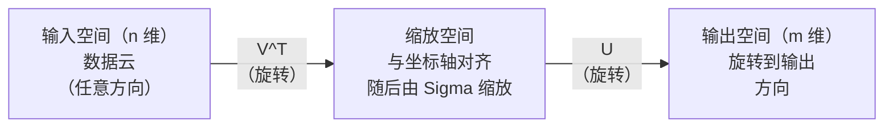
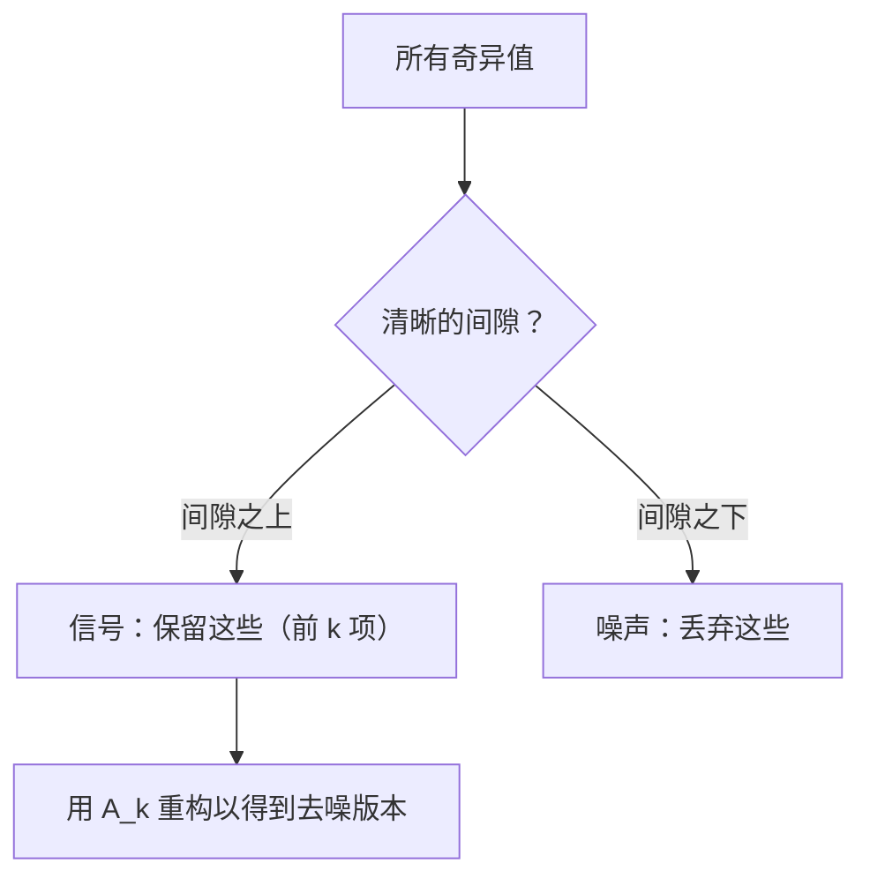

# 奇异值分解

> SVD 是线性代数的瑞士军刀。每个矩阵都有一个。每个数据科学家都需要掌握它。

**Type:** 构建
**Languages:** Python, Julia
**Prerequisites:** Phase 1, Lessons 01 (线性代数直觉), 02 (向量与矩阵运算), 03 (矩阵变换)
**Time:** ~120 分钟

## 学习目标

- 使用幂迭代实现 SVD，并解释 U、Sigma 和 V^T 的几何含义
- 将截断 SVD 应用于图像压缩，并衡量压缩率与重构误差的权衡
- 通过 SVD 计算 Moore-Penrose 伪逆以求解超定的最小二乘问题
- 将 SVD 与 PCA、推荐系统（潜在因子）和 NLP 中的潜在语义分析联系起来

## 问题背景

你有一个 1000x2000 的矩阵。也许它是用户-电影评分矩阵。也许是文档-词频表。也许是图像的像素值。你需要对它进行压缩、去噪、发现隐藏结构，或用它求解最小二乘系统。特征值分解仅适用于方阵；即便如此，它还要求矩阵有一组线性独立的特征向量。

SVD 对任何矩阵都适用。任意形状、任意秩、没有额外条件。它将矩阵分解成三个因子，揭示矩阵对空间所做操作的几何本质。它是整个线性代数中最通用、最有用的分解方法。

## 概念

### SVD 在几何上的含义

每个矩阵，不论形状如何，按顺序执行三步操作：旋转、缩放、再旋转。SVD 将这三步显式地分解出来。

```
A = U * Sigma * V^T

      m x n     m x m    m x n    n x n
     (任意)    (旋转)    (缩放)   (旋转)
```

给定任意矩阵 A，SVD 将其分解为：
- V^T 在输入空间（n 维）中旋转向量
- Sigma 沿每个轴进行缩放（拉伸或压缩）
- U 将结果旋转到输出空间（m 维）



可以这样理解：你给 SVD 一个矩阵。它会告诉你：“这个矩阵把一个输入球体，先用 V^T 旋转，然后用 Sigma 拉成一个椭球体，最后用 U 旋转这个椭球体。”奇异值就是椭球各轴的长度。

### 完整分解

对于形状为 m x n 的矩阵 A：

```
A = U * Sigma * V^T

where:
  U     is m x m, orthogonal (U^T U = I)
  Sigma is m x n, diagonal (singular values on the diagonal)
  V     is n x n, orthogonal (V^T V = I)

The singular values sigma_1 >= sigma_2 >= ... >= sigma_r > 0
where r = rank(A)
```

U 的列称为左奇异向量；V 的列称为右奇异向量；Sigma 的对角元称为奇异值。它们总是非负的，通常按递减顺序排序。

### 左奇异向量、奇异值、右奇异向量

SVD 的每个分量都有不同的几何意义。

右奇异向量（V 的列）：它们构成输入空间（R^n）的正交基。它们是在输入空间中那些被矩阵映射到输出空间中正交方向的方向。可以把它们看作定义域的自然坐标系。

奇异值（Sigma 的对角）：这些是缩放因子。第 i 个奇异值告诉你矩阵沿第 i 个右奇异向量拉伸的程度。奇异值为零意味着矩阵在该方向上被完全压扁。

左奇异向量（U 的列）：它们构成输出空间（R^m）的正交基。第 i 个左奇异向量是第 i 个右奇异向量经过缩放后落入的输出空间方向。

它们之间的关系：

```
A * v_i = sigma_i * u_i

矩阵 A 将第 i 个右奇异向量 v_i，
沿其方向缩放 sigma_i，然后映射到第 i 个左奇异向量 u_i。
```

这为你提供了矩阵按坐标逐项作用的直观图景。

### 外积形式

SVD 也可以写成一系列秩-1 矩阵的和：

```
A = sigma_1 * u_1 * v_1^T + sigma_2 * u_2 * v_2^T + ... + sigma_r * u_r * v_r^T

每一项 sigma_i * u_i * v_i^T 都是一个秩-1 矩阵（外积）。
完整矩阵是 r 个此类矩阵之和，其中 r 为秩。
```

这种形式是低秩近似的基础。每一项都添加了一层结构。第一项捕捉最重要的模式，第二项捕捉次重要的，以此类推。截断这个和式会给出在指定秩下最优的近似。

```
Rank-1 approx:    A_1 = sigma_1 * u_1 * v_1^T
                  (捕捉主导模式)

Rank-2 approx:    A_2 = sigma_1 * u_1 * v_1^T + sigma_2 * u_2 * v_2^T
                  (捕捉两个最重要的模式)

Rank-k approx:    A_k = sum of top k terms
                  (由 Eckart-Young 定理证明为最优)
```

### 与特征值分解的关系

SVD 与特征值分解紧密相连。A 的奇异值与奇异向量直接来源于 A^T A 和 A A^T 的特征值与特征向量。

```
A^T A = V * Sigma^T * U^T * U * Sigma * V^T
      = V * Sigma^T * Sigma * V^T
      = V * D * V^T

where D = Sigma^T * Sigma is a diagonal matrix with sigma_i^2 on the diagonal.

So:
- The right singular vectors (V) are eigenvectors of A^T A
- The singular values squared (sigma_i^2) are eigenvalues of A^T A

Similarly:
A A^T = U * Sigma * V^T * V * Sigma^T * U^T
      = U * Sigma * Sigma^T * U^T

So:
- The left singular vectors (U) are eigenvectors of A A^T
- The eigenvalues of A A^T are also sigma_i^2
```

这一关系告诉你三件事：
1. 奇异值总是实数且非负（它们是正半定矩阵特征值的平方根）。
2. 可以通过对 A^T A 做特征分解来计算 SVD，但这会平方条件数并损失数值精度。专门的 SVD 算法会避免这样做。
3. 当 A 是方阵且对称正半定时，SVD 与特征值分解是一致的。

### 截断 SVD：低秩近似

Eckart-Young-Mirsky 定理指出：对 A 的最佳秩-k 近似（无论是 Frobenius 范数还是谱范数）通过只保留前 k 个奇异值及其对应向量得到：

```
A_k = U_k * Sigma_k * V_k^T

where:
  U_k     is m x k  (first k columns of U)
  Sigma_k is k x k  (top-left k x k block of Sigma)
  V_k     is n x k  (first k columns of V)

Approximation error = sigma_{k+1}  (in spectral norm)
                    = sqrt(sigma_{k+1}^2 + ... + sigma_r^2)  (in Frobenius norm)
```

这不仅仅是“一个不错的”近似。它在数学上保证是给定秩 k 下最好的近似。没有其他秩-k 矩阵比它更接近 A。

| 组件 | 相对大小 | 在秩-3 近似中保留？ |
|------|---------|---------------------|
| sigma_1 | 最大 | 是 |
| sigma_2 | 较大 | 是 |
| sigma_3 | 中等偏大 | 是 |
| sigma_4 | 中等 | 否（造成误差） |
| sigma_5 | 中等偏小 | 否（造成误差） |
| sigma_6 | 小 | 否（造成误差） |
| sigma_7 | 很小 | 否（造成误差） |
| sigma_8 | 极小 | 否（造成误差） |

保留前 3 项：A_3 捕获前三个最大奇异值。误差由剩余值（sigma_4 到 sigma_8）决定。

如果奇异值快速衰减，一个很小的 k 就能捕获矩阵的大部分信息；如果衰减慢，则矩阵没有明显的低秩结构。

### 用 SVD 做图像压缩

灰度图像可以看作像素强度的矩阵。一个 800x600 的图像有 480,000 个数值。SVD 允许你用远少于该数目的参数来近似它。

```
Original image: 800 x 600 = 480,000 values

SVD with rank k:
  U_k:      800 x k values
  Sigma_k:  k values
  V_k:      600 x k values
  Total:    k * (800 + 600 + 1) = k * 1401 values

  k=10:   14,010 values   (2.9% of original)
  k=50:   70,050 values  (14.6% of original)
  k=100: 140,100 values  (29.2% of original)

  The compression ratio improves as k gets smaller,
  but visual quality degrades.
```

关键洞见：自然图像的奇异值通常衰减很快。前几项奇异值捕捉到图像的宏观结构（形状、梯度），后面的奇异值承担细节和噪声。把秩截断到 50 常常能在使用大约 85% 更少存储的情况下得到视觉上几乎不可区分的重构图像。

### 推荐系统中的 SVD

Netflix 奖项让这思想很出名。你有一个用户-电影评分矩阵，其中多数条目是缺失的。

```
             Movie1  Movie2  Movie3  Movie4  Movie5
  User1      [  5      ?       3       ?       1  ]
  User2      [  ?      4       ?       2       ?  ]
  User3      [  3      ?       5       ?       ?  ]
  User4      [  ?      ?       ?       4       3  ]

  ? = unknown rating
```

思想是：这个评分矩阵是低秩的。用户口味不是完全独立的。存在少数潜在因子（动作 vs 戏剧、新旧、理性 vs 感性）能解释大多数偏好。

对（填充后的）评分矩阵做 SVD 分解得到：
- U：用户在潜在因子空间中的表示
- Sigma：各潜在因子的相对重要性
- V^T：电影在潜在因子空间中的表示

用户对某电影的预测评分是其用户向量与电影向量的点积（按奇异值加权）。低秩近似用于填补缺失条目。

在实际中，你会用像 Simon Funk 的增量 SVD 或 ALS（交替最小二乘）等变体来直接处理缺失数据。但核心思想相同：通过 SVD 做潜在因子分解。

### NLP 中的 SVD：潜在语义分析

潜在语义分析（LSA，也叫潜在语义索引 LSI）将 SVD 应用到词项-文档矩阵上。

```
             Doc1   Doc2   Doc3   Doc4
  "cat"      [  3      0      1      0  ]
  "dog"      [  2      0      0      1  ]
  "fish"     [  0      4      1      0  ]
  "pet"      [  1      1      1      1  ]
  "ocean"    [  0      3      0      0  ]

After SVD with rank k=2:

  Each document becomes a point in 2D "concept space."
  Each term becomes a point in the same 2D space.
  Documents about similar topics cluster together.
  Terms with similar meanings cluster together.

  "cat" and "dog" end up near each other (land pets).
  "fish" and "ocean" end up near each other (water concepts).
  Doc1 and Doc3 cluster if they share similar topics.
```

LSA 是从原始文本中捕捉语义相似性的最早成功方法之一。它有效的原因在于：同义词往往在相似的文档中出现，因此 SVD 会把它们聚集到相同的潜在维度中。现代词嵌入（Word2Vec、GloVe）可以被视为该思想的延伸或变体。

### 用 SVD 做去噪

有噪声的数据其信号通常集中在前几个奇异值中，而噪声会分布到所有奇异值上。截断可以去掉噪声底部。

清洁信号的奇异值示意：

| 组件 | 大小 | 类型 |
|------|------|------|
| sigma_1 | 很大 | 信号 |
| sigma_2 | 大 | 信号 |
| sigma_3 | 中等 | 信号 |
| sigma_4 | 接近零 | 可忽略 |
| sigma_5 | 接近零 | 可忽略 |

有噪声的信号（噪声向所有奇异值添加能量）的奇异值示意：

| 组件 | 大小 | 类型 |
|------|------|------|
| sigma_1 | 很大 | 信号 |
| sigma_2 | 大 | 信号 |
| sigma_3 | 中等 | 信号 |
| sigma_4 | 小 | 噪声 |
| sigma_5 | 小 | 噪声 |
| sigma_6 | 小 | 噪声 |
| sigma_7 | 小 | 噪声 |



这在信号处理、科学测量和数据清洗中广泛应用。任何被加性噪声破坏的矩阵，都可以用截断 SVD 原理性地分离信号与噪声。

### 通过 SVD 计算伪逆

Moore-Penrose 伪逆 A+ 将矩阵逆扩展到非方阵和奇异矩阵。SVD 让计算伪逆变得简单。

```
If A = U * Sigma * V^T, then:

A+ = V * Sigma+ * U^T

where Sigma+ is formed by:
  1. Transpose Sigma (swap rows and columns)
  2. Replace each non-zero diagonal entry sigma_i with 1/sigma_i
  3. Leave zeros as zeros

For A (m x n):      A+ is (n x m)
For Sigma (m x n):  Sigma+ is (n x m)
```

伪逆可用于解最小二乘问题。如果 Ax = b 无精确解（超定系统），则 x = A+ b 是最小二乘解（最小化 ||Ax - b||）。

```
Overdetermined system (more equations than unknowns):

  [1  1]         [3]
  [2  1] x   =   [5]       No exact solution exists.
  [3  1]         [6]

  x_ls = A+ b = V * Sigma+ * U^T * b

  This gives the x that minimizes the sum of squared residuals.
  Same result as the normal equations (A^T A)^(-1) A^T b,
  but numerically more stable.
```

### 数值稳定性的优势

对 A^T A 进行特征值分解会把奇异值平方（因为 A^T A 的特征值是 sigma_i^2）。这会平方条件数，从而放大数值误差。

```
Example:
  A has singular values [1000, 1, 0.001]
  Condition number of A: 1000 / 0.001 = 10^6

  A^T A has eigenvalues [10^6, 1, 10^{-6}]
  Condition number of A^T A: 10^6 / 10^{-6} = 10^{12}

  Computing SVD directly: works with condition number 10^6
  Computing via A^T A:     works with condition number 10^{12}
                           (6 extra digits of precision lost)
```

现代 SVD 算法（例如 Golub-Kahan 双对角化）直接在 A 上工作，从不显式构造 A^T A。这就是为什么你应当总是优先使用 `np.linalg.svd(A)` 而不是 `np.linalg.eig(A.T @ A)`。

### 与 PCA 的联系

PCA 就是对中心化数据做 SVD。这不是类比，而是字面上的相同计算。

```
Given data matrix X (n_samples x n_features), centered (mean subtracted):

Covariance matrix: C = (1/(n-1)) * X^T X

PCA finds eigenvectors of C. But:

  X = U * Sigma * V^T    (SVD of X)

  X^T X = V * Sigma^2 * V^T

  C = (1/(n-1)) * V * Sigma^2 * V^T

So the principal components are exactly the right singular vectors V.
The explained variance for each component is sigma_i^2 / (n-1).

In sklearn, PCA is implemented using SVD, not eigendecomposition.
It is faster and more numerically stable.
```

这意味着你在第 10 课学到的所有降维知识在底层都是 SVD。PCA 是机器学习中 SVD 最常见的应用之一。

```figure
svd-rank-reconstruction
```

## 实现

### 第 1 步：用幂迭代从零实现 SVD

思路是：要找到最大的奇异值及其向量，可以对 A^T A（或 A A^T）做幂迭代。然后对矩阵消元（deflation），重复寻找下一个奇异值。

```python
import numpy as np

def power_iteration(M, num_iters=100):
    n = M.shape[1]
    v = np.random.randn(n)
    v = v / np.linalg.norm(v)

    for _ in range(num_iters):
        Mv = M @ v
        v = Mv / np.linalg.norm(Mv)

    eigenvalue = v @ M @ v
    return eigenvalue, v

def svd_from_scratch(A, k=None):
    m, n = A.shape
    if k is None:
        k = min(m, n)

    sigmas = []
    us = []
    vs = []

    A_residual = A.copy().astype(float)

    for _ in range(k):
        AtA = A_residual.T @ A_residual
        eigenvalue, v = power_iteration(AtA, num_iters=200)

        if eigenvalue < 1e-10:
            break

        sigma = np.sqrt(eigenvalue)
        u = A_residual @ v / sigma

        sigmas.append(sigma)
        us.append(u)
        vs.append(v)

        A_residual = A_residual - sigma * np.outer(u, v)

    U = np.column_stack(us) if us else np.empty((m, 0))
    S = np.array(sigmas)
    V = np.column_stack(vs) if vs else np.empty((n, 0))

    return U, S, V
```

### 第 2 步：测试并与 NumPy 比较

```python
np.random.seed(42)
A = np.random.randn(5, 4)

U_ours, S_ours, V_ours = svd_from_scratch(A)
U_np, S_np, Vt_np = np.linalg.svd(A, full_matrices=False)

print("Our singular values:", np.round(S_ours, 4))
print("NumPy singular values:", np.round(S_np, 4))

A_reconstructed = U_ours @ np.diag(S_ours) @ V_ours.T
print(f"Reconstruction error: {np.linalg.norm(A - A_reconstructed):.8f}")
```

### 第 3 步：图像压缩演示

```python
def compress_image_svd(image_matrix, k):
    U, S, Vt = np.linalg.svd(image_matrix, full_matrices=False)
    compressed = U[:, :k] @ np.diag(S[:k]) @ Vt[:k, :]
    return compressed

image = np.random.seed(42)
rows, cols = 200, 300
image = np.random.randn(rows, cols)

for k in [1, 5, 10, 20, 50]:
    compressed = compress_image_svd(image, k)
    error = np.linalg.norm(image - compressed) / np.linalg.norm(image)
    original_size = rows * cols
    compressed_size = k * (rows + cols + 1)
    ratio = compressed_size / original_size
    print(f"k={k:>3d}  error={error:.4f}  storage={ratio:.1%}")
```

### 第 4 步：去噪

```python
np.random.seed(42)
clean = np.outer(np.sin(np.linspace(0, 4*np.pi, 100)),
                 np.cos(np.linspace(0, 2*np.pi, 80)))
noise = 0.3 * np.random.randn(100, 80)
noisy = clean + noise

U, S, Vt = np.linalg.svd(noisy, full_matrices=False)
denoised = U[:, :5] @ np.diag(S[:5]) @ Vt[:5, :]

print(f"Noisy error:    {np.linalg.norm(noisy - clean):.4f}")
print(f"Denoised error: {np.linalg.norm(denoised - clean):.4f}")
print(f"Improvement:    {(1 - np.linalg.norm(denoised - clean) / np.linalg.norm(noisy - clean)):.1%}")
```

### 第 5 步：伪逆

```python
A = np.array([[1, 1], [2, 1], [3, 1]], dtype=float)
b = np.array([3, 5, 6], dtype=float)

U, S, Vt = np.linalg.svd(A, full_matrices=False)
S_inv = np.diag(1.0 / S)
A_pinv = Vt.T @ S_inv @ U.T

x_svd = A_pinv @ b
x_lstsq = np.linalg.lstsq(A, b, rcond=None)[0]
x_pinv = np.linalg.pinv(A) @ b

print(f"SVD pseudoinverse solution:  {x_svd}")
print(f"np.linalg.lstsq solution:   {x_lstsq}")
print(f"np.linalg.pinv solution:    {x_pinv}")
```

## 使用方法

完整的可运行演示在 `code/svd.py` 中。运行它可以看到 SVD 在图像压缩、推荐系统、潜在语义分析和去噪中的应用示例。

```bash
python svd.py
```

Julia 版本在 `code/svd.jl`，使用 Julia 原生的 `svd()` 函数和 `LinearAlgebra` 包演示相同的概念。

```bash
julia svd.jl
```

## 交付物

本课产生：
- `outputs/skill-svd.md` - 一个关于在实际项目中何时以及如何应用 SVD 的技能文档

## 练习

1. 不使用幂迭代，实现完整的 SVD。改用对 A^T A 做特征值分解以得到 V 和奇异值，然后计算 U = A V Sigma^{-1}。比较数值精度与幂迭代版本以及 NumPy 的结果。

2. 载入一张真实的灰度图像（或将一张图像转换为灰度）。在秩 1、5、10、25、50、100 下压缩。对每个秩计算压缩比和相对误差。找出图像在视觉上可接受的最低秩。

3. 构建一个微型推荐系统。创建一个 10x8 的用户-电影评分矩阵并填入部分已知条目。用行均值填充缺失值。计算 SVD 并重构秩-3 近似。用重构矩阵预测缺失评分，验证预测是否合理。

4. 创建一个 100x50 的文档-词项矩阵，包含 3 个合成主题。每个主题有 5 个相关词。加入噪声。应用 SVD 并验证前三个奇异值明显大于其余奇异值。将文档投影到 3 维潜在空间并检查同一主题的文档是否聚类在一起。

5. 生成一个干净的低秩矩阵（秩 3，大小 50x40），并在不同噪声级别下（sigma = 0.1, 0.5, 1.0, 2.0）加入高斯噪声。对每个噪声级别，通过扫描 k 从 1 到 40 并测量与干净矩阵的重构误差，找到最佳截断秩。绘制最佳 k 随噪声级别变化的图。

## 关键词

| 术语 | 常见说法 | 实际含义 |
|------|--------|--------|
| SVD | "对任意矩阵分解" | 将 A 分解为 U Sigma V^T，其中 U 和 V 正交，Sigma 为对角且非负。适用于任意形状的矩阵。 |
| Singular value | "这个成分有多重要" | Sigma 的第 i 个对角元。衡量矩阵沿第 i 个主方向的缩放程度。总为非负并按降序排列。 |
| Left singular vector | "输出方向" | U 的一列。第 i 个左奇异向量是第 i 个右奇异向量经 sigma_i 缩放后映射到的输出方向。 |
| Right singular vector | "输入方向" | V 的一列。输入空间中被矩阵映射到第 i 个左奇异向量（经过缩放）的方向。 |
| Truncated SVD | "低秩近似" | 只保留前 k 个奇异值及对应向量。根据 Eckart-Young 定理，这产生了原矩阵的最优秩-k 近似。 |
| Rank | "真实维度" | 非零奇异值的个数。表示矩阵实际使用的独立方向数量。 |
| Pseudoinverse | "广义逆" | V Sigma+ U^T。对非零奇异值取倒数，零保持为零。用于为非方阵或奇异矩阵求解最小二乘问题。 |
| Condition number | "对误差的敏感度" | sigma_max / sigma_min。条件数大说明小的输入变化会导致大的输出变化。SVD 可直接揭示条件数。 |
| Latent factor | "隐藏变量" | SVD 发现的低秩空间中的一个维度。在推荐系统中，潜在因子可能对应于流派偏好；在 NLP 中，可能对应于主题。 |
| Frobenius norm | "矩阵的总体大小" | 所有元素平方和的平方根。等于奇异值平方和的平方根。用于衡量近似误差。 |
| Eckart-Young theorem | "SVD 给出最佳压缩" | 对于任意目标秩 k，截断 SVD 在所有秩-k 矩阵中使近似误差最小。 |
| Power iteration | "寻找最大特征向量" | 不断将随机向量乘以矩阵并归一化。收敛到最大特征值对应的特征向量。是许多 SVD 算法的构件。 |

## 延伸阅读

- [Gilbert Strang: Linear Algebra and Its Applications, Chapter 7](https://math.mit.edu/~gs/linearalgebra/) - 对 SVD 及其应用的详尽论述
- [3Blue1Brown: But what is the SVD?](https://www.youtube.com/watch?v=vSczTbgc8Rc) - 关于 SVD 的几何直觉的视频讲解
- [We Recommend a Singular Value Decomposition](https://www.ams.org/publicoutreach/feature-column/fcarc-svd) - 美国数学学会的通俗概述
- [Netflix Prize and Matrix Factorization](https://sifter.org/~simon/journal/20061211.html) - Simon Funk 关于推荐系统中使用 SVD 的原创博客文章
- [Latent Semantic Analysis](https://en.wikipedia.org/wiki/Latent_semantic_analysis) - SVD 在 NLP 中的原始应用
- [Numerical Linear Algebra by Trefethen and Bau](https://people.maths.ox.ac.uk/trefethen/text.html) - 理解 SVD 算法及其数值特性的权威教材