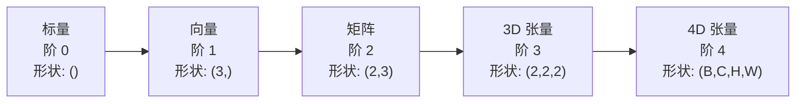
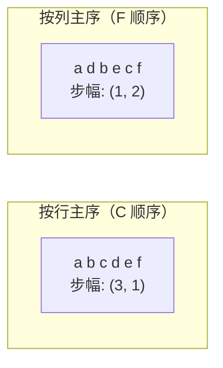
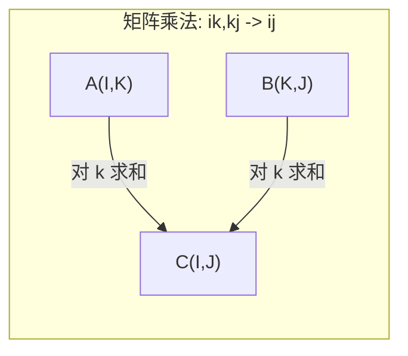

# 张量运算

> 张量是数据与深度学习之间的共通语言。每一张图像、每一个句子、每一个梯度都通过它们流动。

**Type:** 构建  
**Language:** Python  
**Prerequisites:** 阶段 1，课程 01（线性代数直觉），02（向量、矩阵与运算）  
**Time:** ~90 分钟

## 学习目标

- 从零实现一个具有 shape、strides、reshape、transpose 与逐元素运算的张量类  
- 应用广播规则在不同形状的张量之间进行运算而不复制数据  
- 用 einsum 表达点积、矩阵乘法、外积与批量运算  
- 在多头注意力的每一步精确追踪张量形状

## 问题背景

你在构建一个 transformer。前向传播代码看起来很干净。运行时得到：`RuntimeError: mat1 and mat2 shapes cannot be multiplied (32x768 and 512x768)`。你盯着这些形状，尝试了一个 transpose。现在又报：`Expected 4D input (got 3D input)`。你加了一个 unsqueeze，又别的地方出错了。

形状错误是深度学习代码中最常见的 bug。概念上并不难——每个操作都有形状契约——但它们会快速放大。一个 transformer 有数十个 reshape、transpose 和 broadcast 串在一起。一个轴用错，错误就会级联。更糟的是，部分形状错误不会抛出异常：它们会在错误的维度上进行广播或在错误的轴上求和，从而悄然产生垃圾输出。

矩阵处理两组事物之间的成对关系。真实数据不止两维。一个 batch 为 32 的 RGB 图像（224x224）是 4D 张量：`(32, 3, 224, 224)`。带 12 个头的自注意力也是 4D：`(batch, heads, seq_len, head_dim)`。你需要一种能推广到任意维数、并且操作可以在所有维度上干净组合的数据结构。那就是张量。掌握它的操作后，形状错误将变得易于调试。

## 概念讲解

### 张量是什么

张量是具有统一数据类型的多维数值数组。维数的数量称为该张量的阶（或秩）。每个维度称为一个轴。形状（shape）是一个元组，列出了每个轴上的大小。



元素总数等于所有维度大小的乘积。形状 `(2, 3, 4)` 包含 `2 * 3 * 4 = 24` 个元素。

### 深度学习中的张量形状约定

不同类型的数据按照约定映射为特定的张量形状。

```mermaid
graph TD
    subgraph 视觉
        V1["(B, C, H, W)<br/>32, 3, 224, 224"]
    end
    subgraph 自然语言处理（NLP）
        N1["(B, T, D)<br/>16, 128, 768"]
    end
    subgraph 注意力
        A1["(B, H, T, D)<br/>16, 12, 128, 64"]
    end
    subgraph 权重
        W1["Linear（线性层）: (out, in)<br/>Conv2D（卷积2D）: (out_c, in_c, kH, kW)<br/>Embedding（嵌入）: (vocab, dim)"]
    end
```

PyTorch 使用 NCHW（channels-first）。TensorFlow 默认使用 NHWC（channels-last）。布局不匹配会导致性能悄然下降或报错。

### 内存布局如何工作

一个 2D 数组在内存中是一维字节序列。步幅（strides）告诉你沿每个轴迈一步需要跳过多少个元素。



transpose 不会移动数据。它交换步幅，使得张量变得非连续（non-contiguous）——一行的元素不再在内存中相邻。

### 广播规则

广播允许你在不同形状的张量之间进行运算而不复制数据。从右侧对齐形状。两个维度兼容当且仅当它们相等或其中一个为 1。较少的维度在左侧补 1。

```
Tensor A:     (8, 1, 6, 1)
Tensor B:        (7, 1, 5)
Padded B:     (1, 7, 1, 5)
Result:       (8, 7, 6, 5)
```

### Einsum：通用的张量运算

爱因斯坦求和（einsum）为每个轴贴上字母标签。出现在输入中但不出现在输出中的轴会被求和。出现在输入和输出中的轴会被保留。



常见模式：`i,i->`（点积）、`i,j->ij`（外积）、`ii->`（迹）、`ij->ji`（转置）、`bij,bjk->bik`（批量矩阵乘）、`bhtd,bhsd->bhts`（注意力分数）。

```figure
tensor-broadcast
```

## 实现它

代码位于 `code/tensors.py`。每个步骤都引用该实现。

### 步骤 1：张量存储与步幅

一个张量存储一个扁平的数值列表和形状元数据。步幅决定了如何将多维索引映射到扁平位置。

```python
class Tensor:
    def __init__(self, data, shape=None):
        if isinstance(data, (list, tuple)):
            self._data, self._shape = self._flatten_nested(data)
        elif isinstance(data, np.ndarray):
            self._data = data.flatten().tolist()
            self._shape = tuple(data.shape)
        else:
            self._data = [data]
            self._shape = ()

        if shape is not None:
            total = reduce(lambda a, b: a * b, shape, 1)
            if total != len(self._data):
                raise ValueError(
                    f"Cannot reshape {len(self._data)} elements into shape {shape}"
                )
            self._shape = tuple(shape)

        self._strides = self._compute_strides(self._shape)

    @staticmethod
    def _compute_strides(shape):
        if len(shape) == 0:
            return ()
        strides = [1] * len(shape)
        for i in range(len(shape) - 2, -1, -1):
            strides[i] = strides[i + 1] * shape[i + 1]
        return tuple(strides)
```

对于形状 `(3, 4)`，步幅为 `(4, 1)`——前进一行需要跳过 4 个元素，前进一列需要跳过 1 个元素。

### 步骤 2：reshape、squeeze、unsqueeze

reshape 改变形状但不改变元素顺序。元素总数必须保持不变。使用 `-1` 可以让某一个维度的大小自动推断。

```python
t = Tensor(list(range(12)), shape=(2, 6))
r = t.reshape((3, 4))
r = t.reshape((-1, 3))
```

squeeze 去除大小为 1 的轴。unsqueeze 插入一个大小为 1 的轴。unsqueeze 对广播非常关键——将偏置向量 `(D,)` 加到批次 `(B, T, D)` 时需要把偏置扩展为 `(1, 1, D)`。

```python
t = Tensor(list(range(6)), shape=(1, 3, 1, 2))
s = t.squeeze()
v = Tensor([1, 2, 3])
u = v.unsqueeze(0)
```

### 步骤 3：transpose 与 permute

transpose 交换两个轴。permute 重新排列所有轴。这是 NCHW 与 NHWC 互转的方式。

```python
mat = Tensor(list(range(6)), shape=(2, 3))
tr = mat.transpose(0, 1)

t4d = Tensor(list(range(24)), shape=(1, 2, 3, 4))
perm = t4d.permute((0, 2, 3, 1))
```

在 transpose 或 permute 之后，张量在内存中通常变为非连续。在 PyTorch 中，`view` 在非连续张量上会失败——应使用 `reshape` 或先调用 `.contiguous()`。

### 步骤 4：逐元素运算与归约

逐元素运算（加、乘、减）对每个元素独立应用并保持形状。归约（sum、mean、max）会压缩一个或多个轴。

```python
a = Tensor([[1, 2], [3, 4]])
b = Tensor([[10, 20], [30, 40]])
c = a + b
d = a * 2
s = a.sum(axis=0)
```

CNN 中的全局平均池化：`(B, C, H, W).mean(axis=[2, 3])` 产生 `(B, C)`。NLP 中的序列均值池化：`(B, T, D).mean(axis=1)` 产生 `(B, D)`。

### 步骤 5：使用 NumPy 演示广播

`tensors.py` 中的 `demo_broadcasting_numpy()` 函数展示了核心模式。

```python
activations = np.random.randn(4, 3)
bias = np.array([0.1, 0.2, 0.3])
result = activations + bias

images = np.random.randn(2, 3, 4, 4)
scale = np.array([0.5, 1.0, 1.5]).reshape(1, 3, 1, 1)
result = images * scale

a = np.array([1, 2, 3]).reshape(-1, 1)
b = np.array([10, 20, 30, 40]).reshape(1, -1)
outer = a * b
```

通过广播实现成对距离计算：将 `(M, 2)` 变为 `(M, 1, 2)`，将 `(N, 2)` 变为 `(1, N, 2)`，相减、平方、沿最后一个轴求和、再开根号。结果形状为 `(M, N)`。

### 步骤 6：Einsum 运算

`demo_einsum()` 与 `demo_einsum_gallery()` 函数遍历了所有常见模式。

```python
a = np.array([1.0, 2.0, 3.0])
b = np.array([4.0, 5.0, 6.0])
dot = np.einsum("i,i->", a, b)

A = np.array([[1, 2], [3, 4], [5, 6]], dtype=float)
B = np.array([[7, 8, 9], [10, 11, 12]], dtype=float)
matmul = np.einsum("ik,kj->ij", A, B)

batch_A = np.random.randn(4, 3, 5)
batch_B = np.random.randn(4, 5, 2)
batch_mm = np.einsum("bij,bjk->bik", batch_A, batch_B)
```

一次收缩的计算量等于所有索引尺寸（被保留和被求和的）的乘积。对于 `bij,bjk->bik`，若 B=32, I=128, J=64, K=128：计算量为 `32 * 128 * 64 * 128 = 33,554,432` 次乘加。

### 步骤 7：用 einsum 实现注意力机制

`demo_attention_einsum()` 函数端到端实现了多头注意力。

```python
B, H, T, D = 2, 4, 8, 16
E = H * D

X = np.random.randn(B, T, E)
W_q = np.random.randn(E, E) * 0.02

Q = np.einsum("bte,ek->btk", X, W_q)
Q = Q.reshape(B, T, H, D).transpose(0, 2, 1, 3)

scores = np.einsum("bhtd,bhsd->bhts", Q, K) / np.sqrt(D)
weights = softmax(scores, axis=-1)
attn_output = np.einsum("bhts,bhsd->bhtd", weights, V)

concat = attn_output.transpose(0, 2, 1, 3).reshape(B, T, E)
output = np.einsum("bte,ek->btk", concat, W_o)
```

每一步都是张量操作：线性投影（通过 einsum 做矩阵乘）、头拆分（reshape + transpose）、注意力分数（通过 einsum 批量矩阵乘）、加权和（通过 einsum 批量矩阵乘）、头合并（transpose + reshape）、输出投影（通过 einsum）。

## 使用指南

### Scratch（自实现）与 NumPy 的对比

| Operation | Scratch (Tensor class) | NumPy |
|---|---:|---|
| Create | `Tensor([[1,2],[3,4]])` | `np.array([[1,2],[3,4]])` |
| Reshape | `t.reshape((3,4))` | `a.reshape(3,4)` |
| Transpose | `t.transpose(0,1)` | `a.T` or `a.transpose(0,1)` |
| Squeeze | `t.squeeze(0)` | `np.squeeze(a, 0)` |
| Sum | `t.sum(axis=0)` | `a.sum(axis=0)` |
| Einsum | N/A | `np.einsum("ij,jk->ik", a, b)` |

### Scratch 与 PyTorch 的对比

```python
import torch

t = torch.tensor([[1, 2, 3], [4, 5, 6]], dtype=torch.float32)
t.shape
t.stride()
t.is_contiguous()

t.reshape(3, 2)
t.unsqueeze(0)
t.transpose(0, 1)
t.transpose(0, 1).contiguous()

torch.einsum("ik,kj->ij", A, B)
```

PyTorch 提供自动求导、GPU 支持和优化的 BLAS 内核。形状语义是相同的。如果你理解了自实现版本，PyTorch 的形状错误就变得可读了。

### 每个神经网络层都可以看作张量运算

| Operation | Tensor 形式 | Einsum |
|---|---:|---|
| Linear layer | `Y = X @ W.T + b` | `"bd,od->bo"` + bias |
| Attention QKV | `Q = X @ W_q` | `"btd,dh->bth"` |
| Attention scores | `Q @ K.T / sqrt(d)` | `"bhtd,bhsd->bhts"` |
| Attention output | `softmax(scores) @ V` | `"bhts,bhsd->bhtd"` |
| Batch norm | `(X - mu) / sigma * gamma` | 逐元素 + 广播 |
| Softmax | `exp(x) / sum(exp(x))` | 逐元素 + 归约 |

## 发布产物

本课会产出两个可复用的提示（prompts）：

1. **`outputs/prompt-tensor-shapes.md`** -- 一个系统化的用于调试张量形状不匹配的提示模板。包含每个常见操作（matmul、broadcast、cat、Linear、Conv2d、BatchNorm、softmax）的决策表和修复查找表。  
2. **`outputs/prompt-tensor-debugger.md`** -- 一个逐步调试提示，你可以把它粘贴到任何 AI 助手中，当形状错误阻塞你时，输入错误信息和张量形状，就能得到精确的修复建议。

## 练习

1. 简单 —— 重塑回环。取一个形状为 `(2, 3, 4)` 的张量。重塑为 `(6, 4)`，再为 `(24,)`，然后回到 `(2, 3, 4)`。在每一步打印扁平数据，验证元素顺序是否保持不变。  
2. 中等 —— 实现广播。为 `Tensor` 类扩展一个 `broadcast_to(shape)` 方法，将大小为 1 的维度扩展到目标形状。然后修改 `_elementwise_op` 在运算前自动广播。用形状 `(3, 1)` 与 `(1, 4)` 测试应产生 `(3, 4)`。  
3. 困难 —— 从零实现 einsum。实现一个基本的 `einsum(subscripts, *tensors)` 函数，至少支持：点积（`i,i->`）、矩阵乘（`ij,jk->ik`）、外积（`i,j->ij`）与转置（`ij->ji`）。解析子脚本字符串，识别被收缩的索引，遍历所有索引组合。将结果与 `np.einsum` 对比。  
4. 困难 —— 注意力形状追踪。编写一个函数，接收 `batch_size`、`seq_len`、`embed_dim` 和 `num_heads`，并打印多头注意力每一步的精确形状：输入、Q/K/V 投影、头拆分、注意力分数、softmax 权重、加权和、头合并、输出投影。与 `demo_attention_einsum()` 的输出核对。

## 术语表

| 术语 | 常说的说法 | 实际含义 |
|---|---|---|
| Tensor | "比矩阵多几个维度" | 一个具有统一类型与已定义 shape、strides 和操作的多维数组 |
| Rank | "维度的数量" | 轴的数量。一个矩阵的阶是 2，而不是指矩阵的线性代数秩 |
| Shape | "张量的大小" | 一个元组，列出每个轴上的大小。`(2, 3)` 表示 2 行 3 列 |
| Stride | "内存如何布局" | 沿每个轴前进一步需要跳过的元素数量 |
| Broadcasting | "形状不同时它会自动工作" | 一套严格的规则：从右对齐，维度必须相等或其中一个为 1 |
| Contiguous | "张量是正常的" | 元素在内存中按逻辑布局顺序存储，没有间隙或重排 |
| Einsum | "一种写 matmul 的花哨方式" | 一种通用记法，可以在一行中表示任意张量收缩、外积、迹或转置 |
| View | "和 reshape 一样" | 共享同一内存缓冲区但具有不同 shape/stride 元数据的张量。在非连续数据上会失败 |
| Contraction | "对某个索引求和" | 一般操作：在张量间对共享索引进行乘并求和，产生更低阶的结果 |
| NCHW / NHWC | "PyTorch vs TensorFlow 格式" | 图像张量的内存布局约定。NCHW 将通道放在空间维度之前，NHWC 将通道放在之后 |

## 延伸阅读

- [NumPy Broadcasting](https://numpy.org/doc/stable/user/basics.broadcasting.html) -- 官方广播规则与可视化示例  
- [PyTorch Tensor Views](https://pytorch.org/docs/stable/tensor_view.html) -- 什么时候 view 可用，什么时候会拷贝  
- [einops](https://github.com/arogozhnikov/einops) -- 一个使张量重塑更具可读性和安全性的库  
- [The Illustrated Transformer](https://jalammar.github.io/illustrated-transformer/) -- 可视化注意力中张量形状的流动  
- [Einstein Summation in NumPy](https://numpy.org/doc/stable/reference/generated/numpy.einsum.html) -- einsum 的完整文档与示例