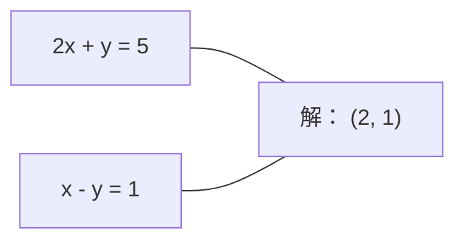
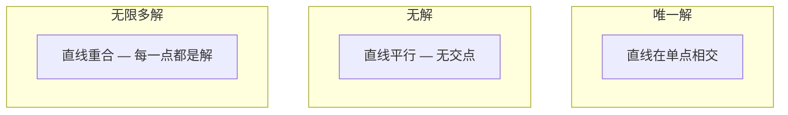

# 线性系统

> 求解 Ax = b 是数学中最古老的问题之一，它仍然支撑着你的神经网络运行。

**Type:** 构建  
**Language:** Python  
**Prerequisites:** 第1阶段，课程 01（线性代数直觉）、02（向量与矩阵）、03（矩阵变换）  
**Time:** ~120 分钟

## 学习目标

- 使用带部分选主元的高斯消元法以及回代求解 Ax = b  
- 对矩阵进行 LU、QR 和 Cholesky 分解，并解释每种方法适用的场景  
- 推导最小二乘问题的法方程，并将其与线性回归和岭回归联系起来  
- 使用条件数诊断病态系统，并通过正则化来稳定解

## 问题陈述

每次你训练线性回归，都在求解一个线性系统。每次你计算最小二乘拟合，都在求解一个线性系统。每次神经网络层计算 `y = Wx + b`，它就在评估线性系统的一侧。当你加入正则化时，你就在修改系统。当你使用高斯过程时，你在分解矩阵。当你为了马氏距离而求逆协方差矩阵时，你也在求解线性系统。

方程 Ax = b 无处不在。A 是已知系数矩阵。b 是已知的输出向量。x 是你要找的未知向量。在线性回归中，A 是你的数据矩阵，b 是目标向量，x 是权重向量。整个模型归结为：找到 x，使得 Ax 尽可能接近 b。

本课从头构建求解该方程的每一种主要方法。你将理解为什么某些方法快而不稳定、某些方法稳定但昂贵、为什么有些方法只适用于方阵而有些可以处理超定系统，以及为什么矩阵的条件数决定了你的答案是否有意义。

## 概念

### Ax = b 的几何含义

线性方程组有几何解释。每个方程定义一个超平面。解是所有超平面的交点（或交集）。

```
2x + y = 5          在二维中是两条直线。
x - y  = 1          它们在 x=2, y=1 相交。
```



可能出现三种情况：



用矩阵形式表示，“唯一解”意味着 A 可逆。“无解”意味着系统不相容。“无限多解”意味着 A 有非零零空间。大多数机器学习问题属于“没有精确解”的情况，因为方程（数据点）比未知数（参数）多。这正是最小二乘法的用武之地。

### 列视角 vs 行视角

有两种方式来理解 Ax = b。

行视角。A 的每一行定义一个方程。每个方程是一个超平面。解是它们全都相交的地方。

列视角。A 的每一列是一个向量。问题变成：哪些列向量的线性组合可以生成 b？

```
A = | 2  1 |    b = | 5 |
    | 1 -1 |        | 1 |

行视角：同时求解 2x + y = 5 和 x - y = 1。

列视角：找 x1, x2 使得：
  x1 * [2, 1] + x2 * [1, -1] = [5, 1]
  2 * [2, 1] + 1 * [1, -1] = [4+1, 2-1] = [5, 1]   检验通过。
```

列视角更为基础。如果 b 位于 A 的列空间中，系统有解。如果不在，你需要找到列空间中最接近 b 的点。这个最接近的点就是最小二乘解。

### 高斯消元

高斯消元将 Ax = b 变换为上三角系统 Ux = c，然后用回代求解。这是最直接的方法。

算法：

```
1. 对于每个列 k（主元列）：
   a. 在第 k 行及以下找出第 k 列的最大条目（部分选主元）。
   b. 将该行与第 k 行交换。
   c. 对于第 k 行下面的每一行 i：
      - 计算乘子 m = A[i][k] / A[k][k]
      - 从第 i 行减去 m 倍的第 k 行。
2. 回代：从最后一行向上求解。
```

示例：

```
原始：
| 2  1  1 | 8 |       R2 = R2 - (2)R1     | 2  1   1 |  8 |
| 4  3  3 |20 |  -->  R3 = R3 - (1)R1 --> | 0  1   1 |  4 |
| 2  3  1 |12 |                            | 0  2   0 |  4 |

                       R3 = R3 - (2)R2     | 2  1   1 |  8 |
                                       --> | 0  1   1 |  4 |
                                           | 0  0  -2 | -4 |

回代：
  -2 * x3 = -4    -->  x3 = 2
  x2 + 2  = 4     -->  x2 = 2
  2*x1 + 2 + 2 = 8 --> x1 = 2
```

高斯消元的运算复杂度为 O(n^3)。对于 1000x1000 的系统，这大约是十亿次浮点运算。很快，但如果需要用同一个 A 求解多个系统，还有更高效的方法。

### 部分选主元：为什么重要

不带选主元的高斯消元会失败或产生错误结果。如果主元为零，会出现除以零。如果主元很小，会放大舍入误差。

```
不好的主元：                    使用部分选主元：
| 0.001  1 | 1.001 |            先交换行：
| 1      1 | 2     |            | 1      1 | 2     |
                                 | 0.001  1 | 1.001 |
m = 1/0.001 = 1000              m = 0.001/1 = 0.001
R2 = R2 - 1000*R1               R2 = R2 - 0.001*R1
| 0.001  1     | 1.001   |      | 1      1     | 2     |
| 0     -999   | -999.0  |      | 0      0.999 | 0.999 |

x2 = 1.000 (正确)            x2 = 1.000 (正确)
x1 = (1.001 - 1)/0.001        x1 = (2 - 1)/1 = 1.000 (正确)
   = 0.001/0.001 = 1.000      由于乘子很小更稳定。
```

在精度有限的浮点算术中，不带选主元的版本会丢失大量有效数字。部分选主元总是选择当前可用的最大主元，以最小化误差放大。

### LU 分解

LU 分解将 A 分解为下三角矩阵 L 和上三角矩阵 U：A = LU。L 保存了高斯消元中的乘子，U 是消元后的矩阵。

```
A = L @ U

| 2  1  1 |   | 1  0  0 |   | 2  1   1 |
| 4  3  3 | = | 2  1  0 | @ | 0  1   1 |
| 2  3  1 |   | 1  2  1 |   | 0  0  -2 |
```

为什么要分解而不是直接消元？因为一旦你得到了 L 和 U，对于任意新的 b 求解 Ax = b 只需 O(n^2)：

```
Ax = b
LUx = b
令 y = Ux：
  Ly = b    （前向替代，O(n^2)）
  Ux = y    （回代，O(n^2)）
```

O(n^3) 的成本在分解时一次性付出。之后每次求解都是 O(n^2)。如果你需要用相同的 A 求解 1000 个不同的 b，LU 可以节省大量计算量。

使用部分选主元时，通常写成 PA = LU，其中 P 是记录行交换的置换矩阵。

### QR 分解

QR 分解将 A 分解为正交矩阵 Q 和上三角矩阵 R：A = QR。

正交矩阵满足 Q^T Q = I。它的列向量是正交归一的。乘以 Q 不改变向量的长度和角度。

```
A = Q @ R

Q 的列正交归一：Q^T Q = I
R 是上三角矩阵

求解 Ax = b：
  QRx = b
  Rx = Q^T b    （只需乘以 Q^T，无需求逆）
  回代得到 x。
```

对于最小二乘问题，QR 比 LU 数值更稳定。Gram‑Schmidt（格拉姆—施密特）过程按列构建 Q：

```
给定 A 的列 a1, a2, ...:

q1 = a1 / ||a1||

q2 = a2 - (a2 . q1) * q1        （减去在 q1 上的投影）
q2 = q2 / ||q2||                （归一化）

q3 = a3 - (a3 . q1) * q1 - (a3 . q2) * q2
q3 = q3 / ||q3||

R[i][j] = qi . aj    对于 i <= j
```

每一步都移除与之前 q 向量重合的分量，留下新的正交方向。

### Cholesky 分解

当 A 是对称矩阵（A = A^T）且正定（所有特征值都为正）时，可以把它分解为 A = L L^T，其中 L 为下三角矩阵。这就是 Cholesky 分解。

```
A = L @ L^T

| 4  2 |   | 2  0 |   | 2  1 |
| 2  5 | = | 1  2 | @ | 0  2 |

L[i][i] = sqrt(A[i][i] - sum(L[i][k]^2 for k < i))
L[i][j] = (A[i][j] - sum(L[i][k]*L[j][k] for k < j)) / L[j][j]    for i > j
```

Cholesky 的速度约为 LU 的一半，存储也少一半。它仅适用于对称正定矩阵，但这些矩阵在实践中非常常见：

- 协方差矩阵是对称半正定的（加正则化后为正定）。  
- 高斯过程中的核矩阵是对称正定的。  
- 凸函数在极小值处的 Hessian 是对称正定的。  
- A^T A 总是对称半正定的。

在高斯过程中，你对核矩阵 K 进行 Cholesky 分解，然后求解 K alpha = y 来得到预测均值。Cholesky 因子还可用于计算边际似然的对数行列式：log det(K) = 2 * sum(log(diag(L)))。

### 最小二乘：当 Ax = b 无精确解时

如果 A 是 m x n，且 m > n（方程数比未知数多），系统是超定的。通常不存在精确解。此时你要最小化平方误差：

```
minimize ||Ax - b||^2

这是残差平方和：
  sum((A[i,:] @ x - b[i])^2 for i in range(m))
```

最小化的解满足法方程：

```
A^T A x = A^T b
```

推导：展开 ||Ax - b||^2 = (Ax - b)^T (Ax - b) = x^T A^T A x - 2 x^T A^T b + b^T b。对 x 求梯度并设为零得到 2 A^T A x - 2 A^T b = 0。

```
原始系统（超定，4 个方程，2 个未知数）：
| 1  1 |         | 3 |
| 1  2 | x     = | 5 |       没有 x 能同时满足全部 4 个方程。
| 1  3 |         | 6 |
| 1  4 |         | 8 |

法方程：
A^T A = | 4  10 |    A^T b = | 22 |
        | 10 30 |            | 63 |

求解：x = [1.5, 1.7]

这就是线性回归。x[0] 是截距，x[1] 是斜率。
```

### 法方程 = 线性回归

二者是完全等价的。在线性回归中，数据矩阵 X 每一行是一个样本，每一列是一个特征。目标向量 y 每个分量对应一个样本。权重向量 w 满足：

```
X^T X w = X^T y
w = (X^T X)^(-1) X^T y
```

这是线性回归的闭式解。每次调用 `sklearn.linear_model.LinearRegression.fit()` 都会计算这个解（或通过 QR / SVD 得到等价结果）。

在矩阵上加上正则化项 lambda * I 就得到岭回归：

```
(X^T X + lambda * I) w = X^T y
w = (X^T X + lambda * I)^(-1) X^T y
```

正则化使矩阵更易于求逆（条件更好），并通过收缩权重来防止过拟合。当 lambda > 0 时，X^T X + lambda * I 总是对称正定的，因此可以使用 Cholesky 求解。

### 伪逆（Moore-Penrose）

伪逆 A+ 将矩阵求逆推广到非方阵和奇异矩阵。对于任意矩阵 A：

```
x = A+ b

其中 A+ = V Sigma+ U^T    （通过 SVD 计算）
```

Sigma+ 通过对每个非零奇异值取倒数并转置得到。如果 A = U Sigma V^T，则 A+ = V Sigma+ U^T。

```
A = U Sigma V^T        （SVD）

Sigma = | 5  0 |       Sigma+ = | 1/5  0  0 |
        | 0  2 |                | 0  1/2  0 |
        | 0  0 |

A+ = V Sigma+ U^T
```

伪逆给出最小范数的最小二乘解。如果系统有：
- 唯一解：A+ b 给出该解。  
- 无解：A+ b 给出最小二乘解。  
- 无限多解：A+ b 给出范数最小的那一个解。

NumPy 的 `np.linalg.lstsq` 和 `np.linalg.pinv` 都会在内部使用 SVD。

### 条件数

条件数度量解对输入微小变化的敏感性。对于矩阵 A，条件数定义为：

```
kappa(A) = ||A|| * ||A^(-1)|| = sigma_max / sigma_min
```

其中 sigma_max 和 sigma_min 分别是最大的和最小的奇异值。

```
良定（kappa ~ 1）：            病态（kappa ~ 10^15）：
b 的微小变化 -->                b 的微小变化 -->
x 的微小变化                     x 的巨大变化

| 2  0 |   kappa = 2/1 = 2      | 1   1          |   kappa ~ 10^15
| 0  1 |   可安全求解            | 1   1+10^(-15) |   解是不可靠的
```

经验法则：
- kappa < 100：安全，解通常准确。  
- kappa ~ 10^k：你将在浮点运算中损失约 k 位有效数字。  
- kappa ~ 10^16（对 float64）：解没有意义，矩阵在数值上等同于奇异。

在机器学习中，当特征近似共线时会出现病态。正则化（加上 lambda * I）会把条件数从 sigma_max / sigma_min 改善为 (sigma_max + lambda) / (sigma_min + lambda)。

### 迭代方法：共轭梯度

对于非常大的稀疏系统（百万级未知数），直接方法如 LU 或 Cholesky 成本太高。迭代方法通过逐步改进猜测近似解。

共轭梯度（CG）在 A 为对称正定时求解 Ax = b。它在精确算术下最多 n 步找到精确解，但在实际中如果 A 的特征值聚集，通常收敛更快。

```
算法概要：
  x0 = 初始猜测（通常为零）
  r0 = b - A x0           （残差）
  p0 = r0                 （搜索方向）

  对 k = 0, 1, 2, ...:
    alpha = (rk . rk) / (pk . A pk)
    x_{k+1} = xk + alpha * pk
    r_{k+1} = rk - alpha * A pk
    beta = (r_{k+1} . r_{k+1}) / (rk . rk)
    p_{k+1} = r_{k+1} + beta * pk
    如果 ||r_{k+1}|| < 容差：停止
```

CG 被用于：
- 大规模优化（Newton‑CG 方法）  
- 求解 PDE 的离散化系统  
- 不能显式分解的核方法  
- 为其他迭代解算器提供预条件（preconditioning）

收敛速度依赖于条件数。条件更好的系统收敛更快，这也是正则化有用的另一个原因。

### 全景：何时使用哪种方法

| Method | Requirements | Cost | Use case |
|--------|-------------|------|----------|
| Gaussian elimination | 方阵，非奇异 A | O(n^3) | 对方阵的一次性求解 |
| LU decomposition | 方阵，非奇异 A | O(n^3) 分解 + O(n^2) 求解 | 多次用同一 A 求解不同 b |
| QR decomposition | 任意 A（m >= n） | O(m n^2) | 最小二乘，数值稳定 |
| Cholesky | 对称正定 A | O(n^3/3) | 协方差矩阵，高斯过程，岭回归 |
| Normal equations | 超定（m > n） | O(m n^2 + n^3) | 线性回归（小 n） |
| SVD / pseudoinverse | 任意 A | O(m n^2) | 秩缺陷系统，最小范数解 |
| Conjugate gradient | 对称正定，稀疏 A | O(n * k * nnz) | 大型稀疏系统，k = 迭代次数 |

### 与机器学习的联系

本课中出现的每种方法都在生产环境的机器学习中被广泛使用：

**线性回归。** 闭式解求解法方程 X^T X w = X^T y。实现上可用 Cholesky（当 n 小时）、QR（数值稳定性重要时）或 SVD（矩阵可能秩退化时）。

**岭回归。** 在 X^T X 上加上 lambda * I。正则化后的系统 (X^T X + lambda * I) w = X^T y 对 lambda > 0 总是可以用 Cholesky 求解。

**高斯过程。** 预测均值需要求解 K alpha = y（K 为核矩阵）。对 K 做 Cholesky 分解是标准方法。对数边际似然用到 log det(K) = 2 ∑ log(diag(L))。

**神经网络初始化。** 正交初始化使用 QR 分解来生成列正交的权重矩阵，防止深层网络信号塌缩。

**预条件。** 大规模优化器使用不完全 Cholesky 或不完全 LU 作为共轭梯度等迭代解算器的预条件子。

**特征工程。** X^T X 的条件数告诉你特征是否接近共线。如果 kappa 很大，删除特征或加入正则化。

```figure
linear-system-conditioning
```

## 实现

### 第 1 步：带部分选主元的高斯消元

```python
import numpy as np

def gaussian_elimination(A, b):
    n = len(b)
    Ab = np.hstack([A.astype(float), b.reshape(-1, 1).astype(float)])

    for k in range(n):
        max_row = k + np.argmax(np.abs(Ab[k:, k]))
        Ab[[k, max_row]] = Ab[[max_row, k]]

        if abs(Ab[k, k]) < 1e-12:
            raise ValueError(f"Matrix is singular or nearly singular at pivot {k}")

        for i in range(k + 1, n):
            m = Ab[i, k] / Ab[k, k]
            Ab[i, k:] -= m * Ab[k, k:]

    x = np.zeros(n)
    for i in range(n - 1, -1, -1):
        x[i] = (Ab[i, -1] - Ab[i, i+1:n] @ x[i+1:n]) / Ab[i, i]

    return x
```

### 第 2 步：LU 分解

```python
def lu_decompose(A):
    n = A.shape[0]
    L = np.eye(n)
    U = A.astype(float).copy()
    P = np.eye(n)

    for k in range(n):
        max_row = k + np.argmax(np.abs(U[k:, k]))
        if max_row != k:
            U[[k, max_row]] = U[[max_row, k]]
            P[[k, max_row]] = P[[max_row, k]]
            if k > 0:
                L[[k, max_row], :k] = L[[max_row, k], :k]

        for i in range(k + 1, n):
            L[i, k] = U[i, k] / U[k, k]
            U[i, k:] -= L[i, k] * U[k, k:]

    return P, L, U

def lu_solve(P, L, U, b):
    n = len(b)
    Pb = P @ b.astype(float)

    y = np.zeros(n)
    for i in range(n):
        y[i] = Pb[i] - L[i, :i] @ y[:i]

    x = np.zeros(n)
    for i in range(n - 1, -1, -1):
        x[i] = (y[i] - U[i, i+1:] @ x[i+1:]) / U[i, i]

    return x
```

### 第 3 步：Cholesky 分解

```python
def cholesky(A):
    n = A.shape[0]
    L = np.zeros_like(A, dtype=float)

    for i in range(n):
        for j in range(i + 1):
            s = A[i, j] - L[i, :j] @ L[j, :j]
            if i == j:
                if s <= 0:
                    raise ValueError("Matrix is not positive definite")
                L[i, j] = np.sqrt(s)
            else:
                L[i, j] = s / L[j, j]

    return L
```

### 第 4 步：通过法方程求最小二乘

```python
def least_squares_normal(A, b):
    AtA = A.T @ A
    Atb = A.T @ b
    return gaussian_elimination(AtA, Atb)

def ridge_regression(A, b, lam):
    n = A.shape[1]
    AtA = A.T @ A + lam * np.eye(n)
    Atb = A.T @ b
    L = cholesky(AtA)
    y = np.zeros(n)
    for i in range(n):
        y[i] = (Atb[i] - L[i, :i] @ y[:i]) / L[i, i]
    x = np.zeros(n)
    for i in range(n - 1, -1, -1):
        x[i] = (y[i] - L.T[i, i+1:] @ x[i+1:]) / L.T[i, i]
    return x
```

### 第 5 步：条件数

```python
def condition_number(A):
    U, S, Vt = np.linalg.svd(A)
    return S[0] / S[-1]
```

## 使用示例

将各部分组合起来，在真实数据上做线性回归和岭回归：

```python
np.random.seed(42)
X_raw = np.random.randn(100, 3)
w_true = np.array([2.0, -1.0, 0.5])
y = X_raw @ w_true + np.random.randn(100) * 0.1

X = np.column_stack([np.ones(100), X_raw])

w_ols = least_squares_normal(X, y)
print(f"OLS weights (ours):    {w_ols}")

w_np = np.linalg.lstsq(X, y, rcond=None)[0]
print(f"OLS weights (numpy):   {w_np}")
print(f"Max difference: {np.max(np.abs(w_ols - w_np)):.2e}")

w_ridge = ridge_regression(X, y, lam=1.0)
print(f"Ridge weights (ours):  {w_ridge}")

from sklearn.linear_model import Ridge
ridge_sk = Ridge(alpha=1.0, fit_intercept=False)
ridge_sk.fit(X, y)
print(f"Ridge weights (sklearn): {ridge_sk.coef_}")
```

## 发布成果

本课将产出：
- `code/linear_systems.py`，包含从头实现的高斯消元、LU 分解、Cholesky 分解、最小二乘和岭回归代码  
- 一个演示示例，证明法方程得到的权重与 sklearn 的 LinearRegression 给出的权重一致

## 练习

1. 使用你的高斯消元、LU 解算器和 `np.linalg.solve` 求解系统 `[[1,2,3],[4,5,6],[7,8,10]] x = [6, 15, 27]`。验证三者在浮点容差范围内给出相同的答案。

2. 生成一个 50x5 的随机矩阵 X 和目标 y = X @ w_true + 噪声。分别用法方程、QR（通过 `np.linalg.qr`）、SVD（通过 `np.linalg.svd`）和 `np.linalg.lstsq` 求解 w。比较这四种解。测量 X^T X 的条件数，并解释它如何影响你信任哪种方法。

3. 通过使两列几乎相同（例如第 2 列 = 第 1 列 + 1e-10 * 噪声）来构造一个近奇异矩阵。计算其条件数。对比有无正则化（加 0.01 * I）时的解与残差。解释为什么正则化有帮助。

4. 为一个 100x100 的随机对称正定矩阵实现共轭梯度算法。统计收敛到容差 1e-8 需要多少次迭代。与理论最大迭代次数 n 作比较。

5. 对大小为 10、50、200、500 的对称正定矩阵，计时比较你的 Cholesky 解算器、你的 LU 解算器与 `np.linalg.solve` 的性能并绘图。验证 Cholesky 大约比 LU 快 2 倍。

## 术语表

| 术语 | 常见说法 | 实际含义 |
|------|----------------|----------------------|
| 线性系统 | "求解 x" | 一组线性方程 Ax = b。求 x 即是在变换 A 下找到产生输出 b 的输入。 |
| 高斯消元 | "行简化" | 通过行操作有系统地把对角线下方清零，得到可用回代求解的上三角系统。复杂度 O(n^3)。 |
| 部分选主元 | "为稳定性交换行" | 在对第 k 列消元前，把该列中绝对值最大的行交换到主元位置。防止除以很小的数。 |
| LU 分解 | "分解为两个三角矩阵" | 写成 A = LU，L 为下三角（保存乘子），U 为上三角（消元结果）。把 O(n^3) 的代价摊到多次求解上。 |
| QR 分解 | "正交分解" | 写成 A = QR，Q 的列正交归一，R 为上三角。比 LU 更稳定地处理最小二乘问题。 |
| Cholesky 分解 | "矩阵的平方根" | 对于对称正定 A，写成 A = LL^T。成本约为 LU 的一半。用于协方差矩阵、核矩阵和岭回归。 |
| 最小二乘 | "无法精确时的最佳拟合" | 当系统是超定（方程多于未知数）时，最小化残差平方和 ||Ax - b||^2。 |
| 法方程 | "求导的捷径" | A^T A x = A^T b。对 ||Ax - b||^2 求梯度并设为零，得到线性回归的闭式解。 |
| 伪逆 | "非方阵的逆" | A+ = V Sigma+ U^T（通过 SVD）。对任意矩阵给出最小范数的最小二乘解。 |
| 条件数 | "答案有多可靠" | kappa = sigma_max / sigma_min。度量对输入扰动的敏感性。会损失约 log10(kappa) 位精度。 |
| 岭回归 | "带正则化的最小二乘" | 求解 (X^T X + lambda I) w = X^T y。加 lambda I 改善条件数并把权重收缩到零附近，防止过拟合。 |
| 共轭梯度 | "用于大矩阵的迭代 Ax=b" | 适用于对称正定系统的迭代解算器。最多 n 步收敛。适合因分解代价过高而需要迭代的方法。 |
| 超定系统 | "数据多于参数" | 在 m-by-n 系统中 m > n。通常不存在精确解，最小二乘给出最佳近似。这是所有回归问题的常见情形。 |
| 回代 | "从下往上求解" | 给定上三角系统，先解最后一个方程，然后向上代入。复杂度 O(n^2)。 |
| 前向替代 | "从上往下求解" | 给定下三角系统，先解第一个方程，然后向下代入。复杂度 O(n^2)。用于 LU 解算中的 L 步。 |

## 延伸阅读

- [MIT 18.06: Linear Algebra](https://ocw.mit.edu/courses/18-06-linear-algebra-spring-2010/) (Gilbert Strang) -- 关于线性系统和矩阵分解的权威课程  
- [Numerical Linear Algebra](https://people.maths.ox.ac.uk/trefethen/text.html) (Trefethen & Bau) -- 理解数值稳定性、条件性以及算法为何失败的标准参考书  
- [Matrix Computations](https://www.cs.cornell.edu/cv/GolubVanLoan4/golubandvanloan.htm) (Golub & Van Loan) -- 涵盖每种矩阵算法的详尽参考  
- [3Blue1Brown: Inverse Matrices](https://www.3blue1brown.com/lessons/inverse-matrices) -- 关于求解 Ax = b 的几何直观解释