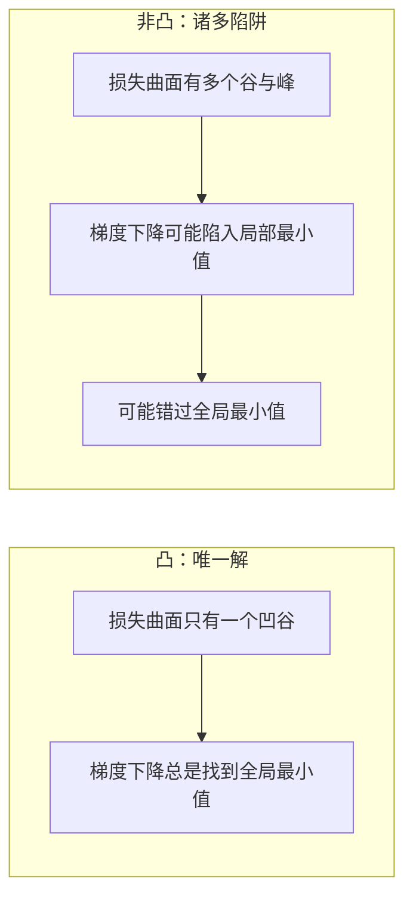
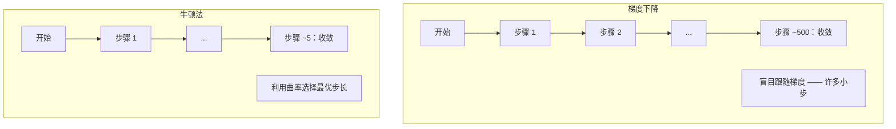
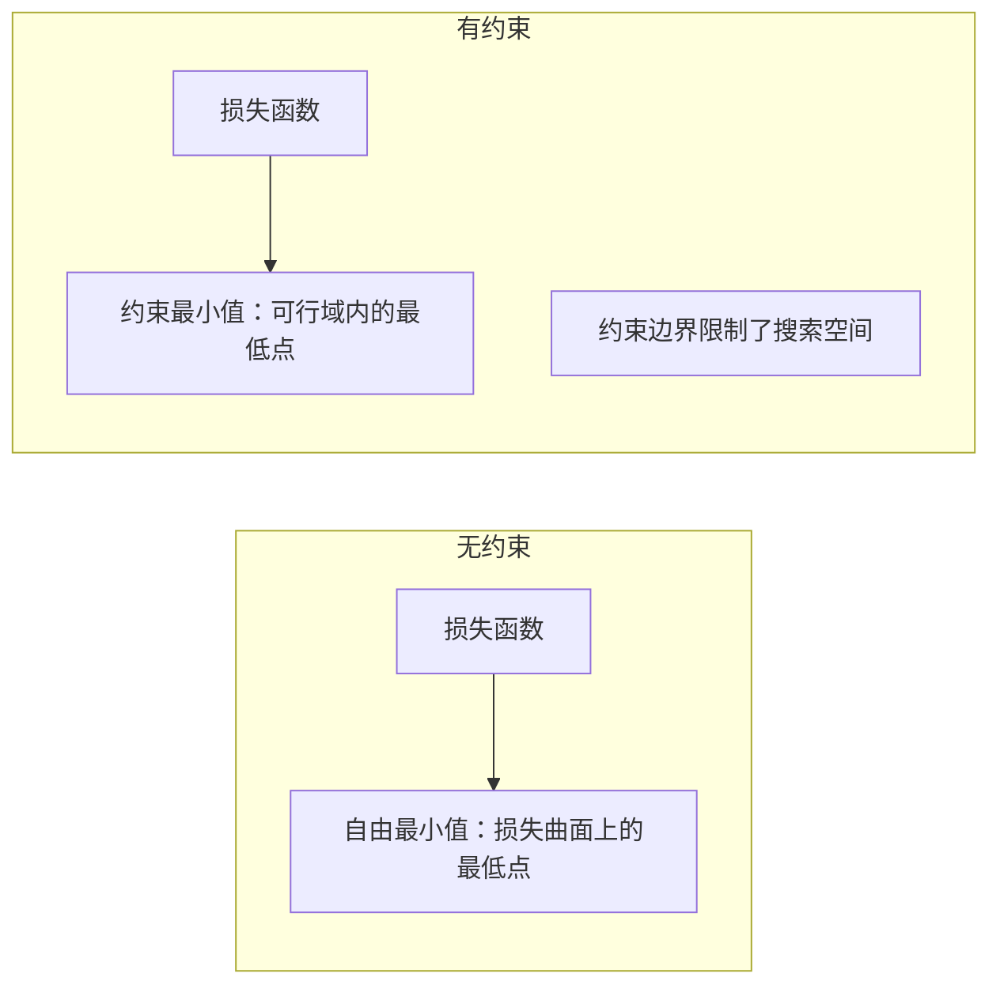
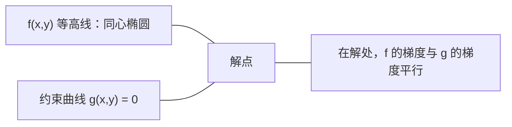

# 凸优化

> 凸问题只有一个谷底。神经网络有数以百万计的谷底。知道两者的区别很重要。

**Type:** 构建  
**Language:** Python  
**Prerequisites:** 第 1 阶段，课程 04（机器学习微积分），08（优化）  
**Time:** ~90 分钟

## 学习目标

- 使用定义、二阶导数与 Hessian 判据测试函数是否为凸函数
- 实现牛顿法并将其二次收敛性与梯度下降进行比较
- 使用拉格朗日乘子法求解带约束的优化问题并解释 KKT 条件
- 解释为何神经网络的损失景观是非凸的但 SGD 仍能找到良好解

## 问题描述

第 08 课教过你梯度下降、动量和 Adam。这些优化器会在任何表面上向下行走，但并不保证结果。对非凸地形做梯度下降可能落入糟糕的局部最小值、卡在鞍点，或永远振荡。你之所以仍然使用它们，是因为神经网络是非凸的，且没有可行的替代方法。

但机器学习中有许多问题是凸的。线性回归、逻辑回归、SVM、LASSO、岭回归等。对于这些问题，存在带数学保证的优化方法。凸问题只有一个谷底。任何向下行走的算法都会到达全局最小值。无需重启。无需复杂的学习率调度。无需祈祷。

理解凸性有三大作用。第一，它告诉你问题是容易（凸）还是困难（非凸）。第二，它为凸问题提供更快的工具，如牛顿法。第三，它解释了贯穿 ML 的一些概念：把正则化看作约束、SVM 中的对偶性，以及为何深度学习在违背凸性所有良好性质的情况下仍能奏效。

## 概念

### 凸集

集合 S 是凸的，当且仅当对 S 中任意两点，连接它们的线段也完全位于 S 中。

| 凸集 | 非凸 |
|---|---|
| **矩形**：任意两点之间的线段仍在集合内部 | **星形/新月形**：某些内部点间的连线会穿出集合外 |
| **三角形**：对所有内部点该性质成立 | **甜甜圈/环形**：孔洞会导致某些线段离开集合 |
| 任意两点之间的线段都在集合内 | 某些点对之间的线段会离开集合 |

形式化检验：对任意 x, y ∈ S 和任意 t ∈ [0, 1]，点 tx + (1-t)y 也属于 S。

凸集示例：
- 一条直线、一个平面、整个 R^n
- 球体（圆、球、高维球）
- 半空间：{x : a^T x <= b}
- 任意多个凸集的交集

非凸集示例：
- 甜甜圈（环形）
- 两个不相交圆的并集
- 具有“凹陷”或“孔洞”的任意集合

### 凸函数

函数 f 是凸的，当且仅当它的定义域是凸集，并且对定义域内任意两点 x, y 和任意 t ∈ [0, 1]：

```
f(tx + (1-t)y) <= t*f(x) + (1-t)*f(y)
```

几何意义：任意两点处图形之间的线段位于函数图形的上方或与之重合。

| 性质 | 凸函数 | 非凸函数 |
|---|---|---|
| **线段检验** | 图形上任意两点之间的线段位于或高于曲线 | 某些点之间的线段低于曲线 |
| **形状** | 单一碗形/向上凹 | 多个峰与谷，曲率混杂 |
| **局部最小值** | 每个局部最小值都是全局最小值 | 可能存在多个不同高度的局部最小值 |

常见凸函数：
- f(x) = x^2（抛物线）
- f(x) = |x|（绝对值）
- f(x) = e^x（指数）
- f(x) = max(0, x)（ReLU，分段线性）
- f(x) = -log(x) 当 x > 0 时（负对数）
- 任意线性函数 f(x) = a^T x + b（既凸又凹）

### 凸性的检验方法

三种实用检验方法，从最简单到最严格。

测试 1：二阶导数检验（1 维）。如果 f''(x) >= 0 对所有 x 成立，则 f 为凸函数。

- f(x) = x^2: f''(x) = 2 >= 0。凸。
- f(x) = x^3: f''(x) = 6x。x < 0 时为负。非凸。
- f(x) = e^x: f''(x) = e^x > 0。凸。

测试 2：Hessian 检验（多维）。如果 Hessian 矩阵 H(x) 在所有 x 上都是正半定的，则 f 是凸的。Hessian 是二阶偏导矩阵。

测试 3：定义检验。直接检查不等式 f(tx + (1-t)y) <= t*f(x) + (1-t)*f(y)。适用于导数难以计算的函数。

### 为何凸性重要

凸优化的中心定理：

对于凸函数，任意局部最小值即为全局最小值。

这意味着梯度下降不会被困住。任何向下的路径都会到达相同的答案。算法被保证收敛到最优解。



后果：
- 无需随机重启
- 无需复杂的学习率调度
- 可以给出收敛证明（速率取决于函数属性）
- 解是唯一的（平坦区域除外）

### 机器学习中的凸与非凸

| 问题 | 是否凸？ | 理由 |
|---------|---------|-----|
| 线性回归（MSE） | 是 | 损失关于权重为二次函数 |
| 逻辑回归 | 是 | 对数损失关于权重是凸的 |
| SVM（hinge 损失） | 是 | 是线性函数的最大值 |
| LASSO（L1 回归） | 是 | 凸函数之和仍为凸 |
| 岭回归（L2） | 是 | 二次 + 二次 = 凸 |
| 神经网络（任意损失） | 否 | 非线性激活破坏凸性 |
| k-means 聚类 | 否 | 离散的分配步骤 |
| 矩阵分解 | 否 | 未知量之间的乘积 |

线性模型配合凸损失是凸的。一旦加入带非线性的隐藏层，凸性便消失。

### Hessian 矩阵

对于 f: R^n -> R，Hessian H 是由所有二阶偏导构成的 n x n 矩阵。

```
H[i][j] = d^2 f / (dx_i dx_j)
```

例如对于 f(x, y) = x^2 + 3xy + y^2：

```
df/dx = 2x + 3y       d^2f/dx^2 = 2      d^2f/dxdy = 3
df/dy = 3x + 2y       d^2f/dydx = 3      d^2f/dy^2 = 2

H = [ 2  3 ]
    [ 3  2 ]
```

Hessian 描述曲率：
- 所有特征值均为正：函数在该点沿所有方向向上弯曲（该点为凸状）
- 所有特征值均为负：沿所有方向向下弯曲（凹，局部最大）
- 符号混合：鞍点（部分方向向上，部分方向向下）
- 零特征值：该方向平坦（退化）

要证明函数凸，Hessian 必须在所有点上正半定，而不仅仅是一点。

### 牛顿法

梯度下降使用一阶信息（梯度）。牛顿法使用二阶信息（Hessian）。它在当前点拟合一个二次近似，并直接跳到该二次近似的极小点。

```
更新规则：
  x_new = x - H^(-1) * gradient

对比梯度下降：
  x_new = x - lr * gradient
```

牛顿法用逆 Hessian 替代了标量学习率。这会根据局部曲率自动调整步长和方向。



优点：
- 在极小点附近实现二次收敛（误差成平方级下降）
- 无需调节学习率
- 与参数化方式无关（尺度不变）

缺点：
- 计算 Hessian 需要 O(n^2) 的内存，求逆需要 O(n^3) 的计算
- 对于含 1 百万参数的神经网络，这意味着 10^12 条目和 ~10^18 次运算
- 对深度学习不切实际

### 约束优化

无约束优化：在所有 x 上最小化 f(x)。  
有约束优化：在约束条件下最小化 f(x)。

真实问题通常带约束。你想最小化成本但预算有限；想最小化误差但模型复杂度受限。



### 拉格朗日乘子

拉格朗日乘子法将带等式约束的问题转换为无约束问题。

问题：在 g(x) = 0 的约束下最小化 f(x)。

方法：引入新变量（拉格朗日乘子 lambda）并求解无约束问题：

```
L(x, lambda) = f(x) + lambda * g(x)
```

在解处，L 的梯度为零：

```
dL/dx = df/dx + lambda * dg/dx = 0
dL/dlambda = g(x) = 0
```

几何直观：在约束最小点处，f 的梯度必须与约束 g 的梯度平行。如果不平行，你可以沿着约束曲面移动并进一步减小 f。



例子：在 x + y = 1 的约束下最小化 f(x,y) = x^2 + y^2。

```
L = x^2 + y^2 + lambda(x + y - 1)

dL/dx = 2x + lambda = 0  =>  x = -lambda/2
dL/dy = 2y + lambda = 0  =>  y = -lambda/2
dL/dlambda = x + y - 1 = 0

由前两式：x = y
代入：2x = 1, 得 x = y = 0.5, lambda = -1
```

原点到直线 x + y = 1 最近的点是 (0.5, 0.5)。

### KKT 条件

Karush-Kuhn-Tucker（KKT）条件将拉格朗日乘子法推广到不等式约束。

问题：在 g_i(x) <= 0（i = 1,...,m）的约束下最小化 f(x)。

KKT 条件（最优性的必要条件）：

```
1. Stationarity:    df/dx + sum(lambda_i * dg_i/dx) = 0
2. Primal feasibility:  g_i(x) <= 0  for all i
3. Dual feasibility:    lambda_i >= 0  for all i
4. Complementary slackness:  lambda_i * g_i(x) = 0  for all i
```

互补松弛性（complementary slackness）是关键洞见：要么约束是激活的（g_i = 0，解位于边界上），要么乘子为零（约束不起作用）。对解没有影响的约束对应 lambda = 0。

KKT 条件在 SVM 中尤为重要。支持向量是那些使约束激活（lambda > 0）的样本点。其他样本的 lambda = 0，不影响决策边界。

### 将正则化视为约束优化

L1 和 L2 正则化并非任意技巧。它们本质上是约束优化问题的另一种表述。

L2 正则化（Ridge）：

```
minimize  Loss(w)  subject to  ||w||^2 <= t

等价的无约束形式：
minimize  Loss(w) + lambda * ||w||^2
```

约束 ||w||^2 <= t 定义了一个球（二维是圆，三维是球体）。解是损失等高线首次接触该球的位置。

L1 正则化（LASSO）：

```
minimize  Loss(w)  subject to  ||w||_1 <= t

等价的无约束形式：
minimize  Loss(w) + lambda * ||w||_1
```

约束 ||w||_1 <= t 定义了一个菱形（二维为旋转的正方形）。

| 性质 | L2 约束（圆形） | L1 约束（菱形） |
|---|---:|---|
| **约束形状** | 圆（高维中为球） | 菱形（二维中为旋转正方形） |
| **损失等高线接触的位置** | 平滑边界 —— 任意圆上的点 | 角点 —— 与坐标轴对齐 |
| **解的行为** | 权重变小但通常非零 | 某些权重恰为零（稀疏） |
| **结果** | 权重收缩 | 特征选择 |

这解释了为何 L1 会产生稀疏模型（特征选择），而 L2 只是收缩权重。菱形的角更容易被损失等高线触及，从而把某些权重置为零。

### 对偶性

每个带约束的优化问题（原问题 primal）都有一个伴随问题（对偶 dual）。对于凸问题，原问题与对偶问题具有相同的最优值，这称为强对偶性。

拉格朗日对偶函数：

```
Primal: minimize f(x) subject to g(x) <= 0
Lagrangian: L(x, lambda) = f(x) + lambda * g(x)
Dual function: d(lambda) = min_x L(x, lambda)
Dual problem: maximize d(lambda) subject to lambda >= 0
```

对偶性重要的原因：
- 对偶问题有时比原问题更易解
- SVM 在对偶形式中求解，问题仅依赖于数据点之间的点积（从而支持核技巧）
- 对偶给出原问题最优值的下界，可用于检验解的质量

对 SVM 的具体形式：

```
Primal: find w, b that maximize the margin 2/||w|| subject to
        y_i(w^T x_i + b) >= 1 for all i

Dual:   maximize sum(alpha_i) - 0.5 * sum_ij(alpha_i * alpha_j * y_i * y_j * x_i^T x_j)
        subject to alpha_i >= 0 and sum(alpha_i * y_i) = 0

对偶只包含点积 x_i^T x_j。
用 K(x_i, x_j) 替换 x_i^T x_j 即得核技巧。
```

### 虽然非凸但深度学习为何仍可行

神经网络损失函数高度非凸。按传统判断，优化应当失败。然而随机梯度下降却能可靠地找到良好解。若干因素解释了这一现象。

大多数局部最小值已经足够好。在高维空间中，随机临界点（梯度为零）压倒性地是鞍点而非局部极小点。存在的少数局部最小值的损失值倾向接近全局最小值。在参数空间有百万维时陷入糟糕局部最小值的概率极低。

真正的障碍是鞍点而非局部最小点。在有 n 个参数的函数中，鞍点在某些方向上具有正曲率、在另一些方向上具有负曲率。对于高维的随机临界点，所有 n 个特征值均为正（即局部最小）的概率约为 2^{-n}。几乎所有临界点都是鞍点。SGD 的噪声帮助其逃离鞍点。

过参数化会平滑景观。参数多于训练样本的网络具有更平滑、更连通的损失曲面。更宽的网络具有更少的糟糕局部最小值。这看似反直觉，但在经验上成立。

损失景观结构：

| 性质 | 低维空间 | 高维空间 |
|---|---|---|
| **地形** | 孤立的峰与谷众多 | 谷地更平滑且相互连通 |
| **最小值** | 孤立的局部最小值多 | 糟糕局部最小值少；大多数接近最优 |
| **导航** | 难以找到全局最小值 | 有许多路径通向良好解 |
| **临界点** | 局部最小值与鞍点混合 | 压倒性是鞍点，而非局部最小值 |

随机噪声作为隐式正则化。小批量 SGD 增加噪声，阻止模型陷入尖锐最小处。尖锐最小值容易过拟合，而平坦最小值则有更好泛化性。噪声使优化偏向平坦区域。

### 实际中的二阶方法

纯牛顿法对大模型并不实用。若干近似方法使得二阶信息可用。

L-BFGS（有限内存 BFGS）：使用最近 m 次梯度差分近似逆 Hessian。需要 O(mn) 内存而非 O(n^2)。对参数量到 ~10,000 的问题效果良好，常用于经典 ML（逻辑回归、CRF），但不常用于深度学习。

自然梯度：使用 Fisher 信息矩阵（对数似然的期望 Hessian）代替标准 Hessian，考虑了概率分布的几何结构。K-FAC（Kronecker-Factored Approximate Curvature）将 Fisher 矩阵近似为 Kronecker 积，使其在神经网络中具有可行性。

Hessian-free 优化：使用共轭梯度法求解 Hx = g，而无需显式构造 H。只需 Hessian-向量乘积，通过自动微分可在 O(n) 时间内计算。

对角近似：Adam 的二阶动量是对 Hessian 对角项的对角近似。AdaHessian 通过 Hutchinson 估计器利用实际的 Hessian 对角来扩展这一点。

| 方法 | 内存 | 每步代价 | 何时使用 |
|--------|--------|--------------|-------------|
| 梯度下降 | O(n) | O(n) | 基线，大模型 |
| 牛顿法 | O(n^2) | O(n^3) | 小型凸问题 |
| L-BFGS | O(mn) | O(mn) | 中等规模凸问题 |
| Adam | O(n) | O(n) | 深度学习默认 |
| K-FAC | O(n) | 每层 O(n) | 研究用途，大批量训练 |

```figure
convex-vs-nonconvex
```

## 实践构建

### 步骤 1：凸性检测器

构建一个通过采样判断凸性的函数，依据定义进行检验。

```python
import random
import math

def check_convexity(f, dim, bounds=(-5, 5), samples=1000):
    violations = 0
    for _ in range(samples):
        x = [random.uniform(*bounds) for _ in range(dim)]
        y = [random.uniform(*bounds) for _ in range(dim)]
        t = random.uniform(0, 1)
        mid = [t * xi + (1 - t) * yi for xi, yi in zip(x, y)]
        lhs = f(mid)
        rhs = t * f(x) + (1 - t) * f(y)
        if lhs > rhs + 1e-10:
            violations += 1
    return violations == 0, violations
```

### 步骤 2：在 2D 上实现牛顿法

使用显式 Hessian 实现牛顿法，并与梯度下降比较收敛速度。

```python
def newtons_method(f, grad_f, hessian_f, x0, steps=50, tol=1e-12):
    x = list(x0)
    history = [x[:]]
    for _ in range(steps):
        g = grad_f(x)
        H = hessian_f(x)
        det = H[0][0] * H[1][1] - H[0][1] * H[1][0]
        if abs(det) < 1e-15:
            break
        H_inv = [
            [H[1][1] / det, -H[0][1] / det],
            [-H[1][0] / det, H[0][0] / det],
        ]
        dx = [
            H_inv[0][0] * g[0] + H_inv[0][1] * g[1],
            H_inv[1][0] * g[0] + H_inv[1][1] * g[1],
        ]
        x = [x[0] - dx[0], x[1] - dx[1]]
        history.append(x[:])
        if sum(gi ** 2 for gi in g) < tol:
            break
    return history
```

### 步骤 3：拉格朗日乘子求解器

通过对拉格朗日函数做梯度下降来求解带约束的优化问题。

```python
def lagrange_solve(f_grad, g_val, g_grad, x0, lr=0.01,
                   lr_lambda=0.01, steps=5000):
    x = list(x0)
    lam = 0.0
    history = []
    for _ in range(steps):
        fg = f_grad(x)
        gv = g_val(x)
        gg = g_grad(x)
        x = [
            xi - lr * (fgi + lam * ggi)
            for xi, fgi, ggi in zip(x, fg, gg)
        ]
        lam = lam + lr_lambda * gv
        history.append((x[:], lam, gv))
    return history
```

### 步骤 4：一阶 vs 二阶 比较

在相同的二次函数上运行梯度下降和牛顿法，比较收敛步数。

```python
def quadratic(x):
    return 5 * x[0] ** 2 + x[1] ** 2

def quadratic_grad(x):
    return [10 * x[0], 2 * x[1]]

def quadratic_hessian(x):
    return [[10, 0], [0, 2]]
```

牛顿法在二次函数上是精确的，通常一步即可收敛。梯度下降则可能需要数百步，因为 Hessian 的特征值相差 5 倍，形成拉长的谷地。

## 使用建议

凸性分析在选择 ML 模型和求解器时直接适用。

对于凸问题（逻辑回归、SVM、LASSO）：
- 使用专用求解器（liblinear、CVXPY、scipy.optimize.minimize(method='L-BFGS-B')）
- 期望得到唯一的全局解
- 二阶方法实用且快速

对于非凸问题（神经网络）：
- 使用一阶方法（随机梯度下降 SGD、Adam）
- 接受解依赖于初始化与随机性
- 使用过参数化、噪声和学习率调度作为隐式正则化
- 不必费力寻找全局最小值，一个良好的局部最小值已足够

```python
from scipy.optimize import minimize

result = minimize(
    fun=lambda w: sum((y - X @ w) ** 2) + 0.1 * sum(w ** 2),
    x0=np.zeros(d),
    method='L-BFGS-B',
    jac=lambda w: -2 * X.T @ (y - X @ w) + 0.2 * w,
)
```

对于 SVM，对偶形式允许使用核技巧：

```python
from sklearn.svm import SVC

svm = SVC(kernel='rbf', C=1.0)
svm.fit(X_train, y_train)
print(f"Support vectors: {svm.n_support_}")
```

## 练习

1. 凸性画廊。使用检测器测试以下函数是否凸：f(x) = x^4、f(x) = sin(x)、f(x,y) = x^2 + y^2、f(x,y) = x*y、f(x) = max(x, 0)。解释每个结果为何合理。

2. 牛顿法与梯度下降竞赛。在 f(x,y) = 50*x^2 + y^2 上从起点 (10, 10) 同时运行两种方法。每种方法到达 loss < 1e-10 需要多少步？当条件数（Hessian 最大特征值与最小特征值之比）增加时，梯度下降会发生什么？

3. 拉格朗日乘子的几何意义。最小化 f(x,y) = (x-3)^2 + (y-3)^2，约束为 x + 2y = 4。验证解处 f 的梯度与 g 的梯度平行。

4. 正则化约束。实现 L1 约束优化：在 |x| + |y| <= 1 的约束下最小化 (x-3)^2 + (y-2)^2。证明解具有一个坐标等于零（菱形约束导致的稀疏性）。

5. Rosenbrock 函数的 Hessian 特征值分析。计算 Rosenbrock 函数在 (1,1) 和 (-1,1) 处的 Hessian，并求特征值。特征值告诉你在极小点与远处的曲率有何不同？

## 关键词

| 术语 | 含义 |
|------|---------------|
| 凸集 (Convex set) | 对任意两点，连接它们的线段仍在集合内的集合 |
| 凸函数 (Convex function) | 函数图形上任意两点之间的线段位于或高于图形。等价地，Hessian 在所有点上正半定 |
| 局部最小值 (Local minimum) | 在邻域内比周围点更小的点。对于凸函数，任意局部最小值即为全局最小值 |
| 全局最小值 (Global minimum) | 在整个定义域上最低的点 |
| Hessian 矩阵 | 所有二阶偏导组成的矩阵。编码曲率信息 |
| 正半定 (Positive semidefinite) | 特征值均非负的矩阵。是“一维上二阶导 >= 0”的多维对应 |
| 条件数 (Condition number) | Hessian 最大特征值与最小特征值之比。条件数高意味着拉长的谷地，会导致梯度下降缓慢 |
| 牛顿法 (Newton's method) | 使用逆 Hessian 决定步长和方向的二阶优化方法。极小点附近具有二次收敛 |
| 拉格朗日乘子 (Lagrange multiplier) | 为将带约束问题转化为无约束问题而引入的变量 |
| KKT 条件 | 含不等式约束时的最优性必要条件。是拉格朗日乘子方法的推广 |
| 互补松弛性 (Complementary slackness) | 在解处，要么约束处于激活状态（g_i = 0），要么其乘子为零。二者不会同时非零 |
| 对偶性 (Duality) | 每个带约束的问题都有对偶问题。对于凸问题，对偶与原问题具有相同的最优值 |
| 强对偶性 (Strong duality) | 原问题与对偶问题的最优值相等。满足 Slater 条件的凸问题通常具备强对偶性 |
| L-BFGS | 一种近似二阶方法，存储最近 m 次梯度差而不是完整 Hessian |
| 鞍点 (Saddle point) | 梯度为零但在某些方向是极小而在其他方向是极大的点 |
| 过参数化 (Overparameterization) | 参数比训练样本更多。会平滑损失景观并减少糟糕局部最小值 |

## 延伸阅读

- [Boyd & Vandenberghe: Convex Optimization](https://web.stanford.edu/~boyd/cvxbook/) - 标准教材，可在线免费获取  
- [Bottou, Curtis, Nocedal: Optimization Methods for Large-Scale Machine Learning (2018)](https://arxiv.org/abs/1606.04838) - 连接凸优化理论与深度学习实践的综述  
- [Choromanska et al.: The Loss Surfaces of Multilayer Networks (2015)](https://arxiv.org/abs/1412.0233) - 关于为何多层网络的非凸景观并非那么糟糕的分析  
- [Nocedal & Wright: Numerical Optimization](https://link.springer.com/book/10.1007/978-0-387-40065-5) - 关于牛顿法、L-BFGS 和约束优化的全面参考书