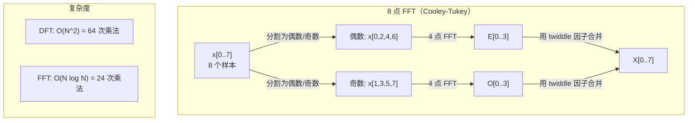
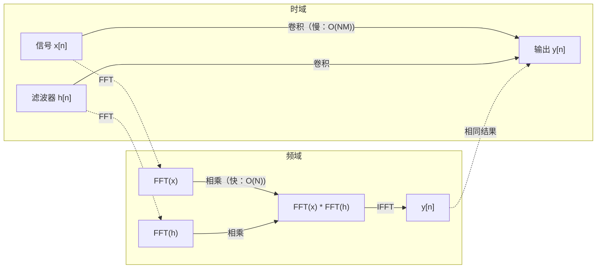

# 傅里叶变换

> 每个信号都是若干正弦波的叠加。傅里叶变换告诉你包含了哪些波。

**Type:** 构建
**Language:** Python
**Prerequisites:** 第1阶段，课程 01-04、19（复数）
**Time:** ~90 分钟

## 学习目标

- 从头实现 DFT 并与 O(N log N) 的 Cooley-Tukey FFT 验证一致性
- 解释频率系数：从信号中提取振幅、相位和功率谱
- 应用卷积定理，通过 FFT 乘法实现卷积
- 将傅里叶频率分解与 transformer 的位置编码和 CNN 卷积层联系起来

## 问题背景

音频录音是一系列随时间变化的压力测量值。股票价格是一系列按天排列的数值。图像是按空间排列的像素强度网格。所有这些都是时域（或空间域）数据：你看到某个索引上数值的变化。

但许多模式在时域中不可见。这个音频信号是纯音还是和弦？这只股票价格是否有每周循环？这张图像是否有重复纹理？这些问题关乎频率内容，而时域会把这些信息隐藏起来。

傅里叶变换将数据从时域转换到频域。它把信号分解为不同频率的正弦波。每个正弦波有一个振幅（强度）和一个相位（起始位置）。傅里叶变换同时告诉你两者。

这对机器学习很重要，因为频域思维无处不在。卷积神经网络执行的是卷积，在频域上对应乘法。Transformer 的位置编码使用频率分解表示位置。音频模型（语音识别、音乐生成）在频谱图上操作——这是声音的频率表示。时间序列模型寻找周期性模式。理解傅里叶变换为处理这些问题提供了必要的词汇。

## 概念

### DFT 定义

给定 N 个样本 x[0], x[1], ..., x[N-1]，离散傅里叶变换会产生 N 个频率系数 X[0], X[1], ..., X[N-1]：

```
X[k] = sum_{n=0}^{N-1} x[n] * e^(-2*pi*i*k*n/N)

for k = 0, 1, ..., N-1
```

每个 X[k] 是一个复数。它的幅值 |X[k]| 告诉你频率 k 的振幅。它的相位 angle(X[k]) 告诉你该频率的相位偏移。

关键洞见：`e^(-2*pi*i*k*n/N)` 是频率为 k 的旋转相量（phasor）。DFT 计算信号与 N 个等间隔频率之间的相关性。如果信号在频率 k 上有能量，相关性就会很大；否则接近零。

### 每个系数的含义

**X[0]：直流成分（DC）。** 这是所有样本的和——与均值成正比。它表示信号的常数（零频率）偏置。

```
X[0] = sum_{n=0}^{N-1} x[n] * e^0 = sum of all samples
```

**X[k]（1 <= k <= N/2）：正频率。** X[k] 表示每 N 个样本中 k 个周期。k 越大频率越高（振荡越快）。

**X[N/2]：奈奎斯特频率。** 用 N 个样本能表示的最高频率。高于它会产生混叠（aliasing）——高频会伪装成低频。

**X[k]（N/2 < k < N）：负频率。** 对于实值信号，X[N-k] = conj(X[k])。负频率是正频率的镜像。这就是为什么有用信息通常集中在前 N/2 + 1 个系数中。

### 逆 DFT

逆 DFT 从频率系数重建原始信号：

```
x[n] = (1/N) * sum_{k=0}^{N-1} X[k] * e^(2*pi*i*k*n/N)

for n = 0, 1, ..., N-1
```

与前向 DFT 唯一的区别是指数符号为正（不是负），并且有一个 1/N 的归一化因子。

逆 DFT 是完美重建。不丢失信息。你可以在时域和频域之间无误差地来回转换。DFT 实质上是基底变换——它用不同的坐标系重新表达相同信息。

### FFT：让它更快

如上定义的 DFT 是 O(N^2) 的：对于每个 N 个输出系数，需要对 N 个输入样本求和。对于 N = 100 万，这是 10^12 次运算。

快速傅里叶变换（FFT）以 O(N log N) 计算相同结果。对于 N = 100 万，这是大约 2000 万次运算，而不是一万亿次。正是这点使得频谱分析可行。

Cooley-Tukey 算法（最常见的 FFT）通过分治实现：

1. 将信号分成偶数索引和奇数索引的样本。
2. 递归地对每一半计算 DFT。
3. 使用“twiddle 因子” e^(-2*pi*i*k/N) 将两个半大小的 DFT 合并。

```
X[k] = E[k] + e^(-2*pi*i*k/N) * O[k]          for k = 0, ..., N/2 - 1
X[k + N/2] = E[k] - e^(-2*pi*i*k/N) * O[k]    for k = 0, ..., N/2 - 1

where E = DFT of even-indexed samples
      O = DFT of odd-indexed samples
```

对称性意味着每一层递归工作量为 O(N)，递归层数为 log2(N)。总复杂度：O(N log N)。



FFT 需要信号长度为 2 的幂。在实践中，信号通常被零填充（zero-pad）到下一个 2 的幂长度。

### 频谱分析

**功率谱（power spectrum）** 是 |X[k]|^2 —— 每个频率系数幅值的平方。它显示了每个频率上的能量有多少。

**相位谱（phase spectrum）** 是 angle(X[k]) —— 每个频率的相位偏移。对于大多数分析任务，你关心的是功率谱，常常忽略相位。

```
Power at frequency k:  P[k] = |X[k]|^2 = X[k].real^2 + X[k].imag^2
Phase at frequency k:  phi[k] = atan2(X[k].imag, X[k].real)
```

### 频率分辨率

DFT 的频率分辨率取决于样本数 N 和采样率 fs。

```
Frequency of bin k:      f_k = k * fs / N
Frequency resolution:    delta_f = fs / N
Maximum frequency:       f_max = fs / 2  (Nyquist)
```

要分辨两个彼此接近的频率，需要更多样本。要捕捉高频，需要更高的采样率。

### 卷积定理

这是信号处理中的最重要结果之一，与 CNN 直接相关。

**时域的卷积等价于频域的逐点乘法。**

```
x * h = IFFT(FFT(x) . FFT(h))

where * is convolution and . is element-wise multiplication
```

意义在于：

- 对两个长度分别为 N 和 M 的信号直接做卷积需要 O(N*M) 次运算。
- 基于 FFT 的卷积需要 O(N log N)：将两者变换、逐点相乘、再变换回来。
- 对于大核，FFT 卷积显著更快。
- 这正是大感受野或全局卷积情况下的常见做法，在某些架构中能提升性能。

注意：DFT 计算的是循环卷积（信号环绕）。要得到线性卷积（无环绕），在计算前将两个信号都零填充到长度 N + M - 1。



### 窗函数（Windowing）

DFT 假定信号是周期性的——它把 N 个样本视为无限重复信号的一个周期。如果信号的起始和结束值不相同，会在边界生成不连续性，表现为伪造的高频成分。这称为谱泄露（spectral leakage）。

窗函数通过在 DFT 前将信号两端衰减到零来减少泄露。

常见窗函数：

| Window | 形状 | 主瓣宽度 | 旁瓣电平 | 使用场景 |
|--------|-------|----------------|-----------------|----------|
| Rectangular | 平坦（无窗） | 最窄 | 最高（-13 dB） | 当信号在 N 个样本内恰好周期性时 |
| Hann | 提升余弦 | 中等 | 低（-31 dB） | 通用频谱分析 |
| Hamming | 修正余弦 | 中等 | 更低（-42 dB） | 音频处理、语音分析 |
| Blackman | 三余弦 | 较宽 | 非常低（-58 dB） | 当需要强旁瓣抑制时 |

```
Hann window:    w[n] = 0.5 * (1 - cos(2*pi*n / (N-1)))
Hamming window: w[n] = 0.54 - 0.46 * cos(2*pi*n / (N-1))
```

在 DFT 前通过逐元素相乘应用窗函数：`X = DFT(x * w)`。

### DFT 的性质

| Property | Time Domain | Frequency Domain |
|----------|-------------|-----------------|
| 线性性 (Linearity) | a*x + b*y | a*X + b*Y |
| 时移 (Time shift) | x[n - k] | X[f] * e^(-2*pi*i*f*k/N) |
| 频移 (Frequency shift) | x[n] * e^(2*pi*i*f0*n/N) | X[f - f0] |
| 卷积 (Convolution) | x * h | X * H（逐点乘） |
| 逐点乘 (Multiplication) | x * h（逐点） | X * H（循环卷积，缩放因子 1/N） |
| Parseval 定理 | sum \|x[n]\|^2 | (1/N) * sum \|X[k]\|^2 |
| 共轭对称（实输入） | x[n] 为实数 | X[k] = conj(X[N-k]) |

Parseval 定理说明总能量在两个域中相同。变换不改变能量。

### 与位置编码的联系

原始 Transformer 使用正弦/余弦位置编码：

```
PE(pos, 2i)   = sin(pos / 10000^(2i/d_model))
PE(pos, 2i+1) = cos(pos / 10000^(2i/d_model))
```

每一对维度 (2i, 2i+1) 在不同频率上做振荡。频率按几何序列从高（初始维度）到低（末尾维度）分布。这使得每个位置在所有频段上都有唯一的模式——类似于傅里叶系数如何唯一标识信号。

此设计提供的关键属性：

- 唯一性：没有两个位置有相同的编码。
- 有界值：sin 和 cos 始终在 [-1, 1] 之间。
- 相对位置：位置 p+k 的编码可以表示为位置 p 编码的线性函数。模型可以学习关注相对位置。

### 与 CNN 的联系

卷积层通过滑动学得的滤波器（kernel）作用于输入，数学上是卷积操作。

根据卷积定理，这等价于：
1. 对输入做 FFT
2. 对核做 FFT
3. 在频域相乘
4. 做 IFFT 得到结果

标准 CNN 实现使用直接卷积（对小型 3x3 核更快）。但对于大核或全局卷积，基于 FFT 的方法显著更快。有些架构（如 FNet）完全用 FFT 替代注意力，实现了用 O(N log N) 复杂度替代 O(N^2) 的注意力，同时获得了具有竞争力的精度。

### 频谱图和短时傅里叶变换（STFT）

单次 FFT 给出的是整个信号的频率内容，但对这些频率何时出现并没有信息。啁啾信号（频率随时间增加）和和弦（所有频率同时存在）可能有相同的幅值谱。

短时傅里叶变换（STFT）通过对信号的重叠窗口计算 FFT 来解决这个问题。结果是频谱图（spectrogram）：一个二维表示，横轴或纵轴是时间，另一个轴是频率。每个点的强度表示该时间段该频率上的能量。

```
STFT 步骤：
1. 选择窗长（例如 1024 个样本）
2. 选择滑移步长（例如 256 个样本 —— 75% 重叠）
3. 对每个窗口位置：
   a. 提取窗口片段
   b. 应用 Hann/Hamming 窗
   c. 计算 FFT
   d. 将幅值谱存为频谱图的一列
```

频谱图是音频 ML 模型的标准输入表示。语音识别模型（Whisper、DeepSpeech）使用 mel 频谱图——将频率映射到 mel 标度，更符合人类的音高感知。

### 混叠（Aliasing）

如果信号包含高于 fs/2（奈奎斯特频率）的成分，以采样率 fs 采样会产生混叠。90 Hz 的信号以 100 Hz 采样看起来与 10 Hz 信号相同。从样本本身无法区分。

```
示例：
  真实信号：90 Hz 正弦波
  采样率：100 Hz
  表观频率：100 - 90 = 10 Hz

  在 100 Hz 采样下，来自 90 Hz 信号的采样点
  与来自 10 Hz 信号的采样点完全相同。
  无论怎样的数学处理都无法恢复原始的 90 Hz。
```

因此模数转换器在采样前包含抗混叠滤波器，去除高于奈奎斯特的频率。在 ML 中，当对特征图下采样而没有适当的低通滤波时会出现混叠——一些架构通过抗混叠池化层来解决这个问题。

### 零填充不会提高分辨率

一个常见误解：在 FFT 前对信号做零填充可以改善频率分辨率。实际上不会。零填充只是插值现有频率箱之间的点，使频谱看起来更平滑。但它不能揭示原始样本中不存在的频率细节。

真正的频率分辨率仅取决于观察时间 T = N / fs。要分辨相距 delta_f 的两个频率，需要至少 T = 1 / delta_f 秒的数据。任何零填充都无法改变这一基本极限。

```figure
fourier-synthesis
```

## 动手实现

### 第 1 步：从头实现 DFT

O(N^2) 的 DFT 直接来自定义议。

```python
import math

class Complex:
    ...

def dft(x):
    N = len(x)
    result = []
    for k in range(N):
        total = Complex(0, 0)
        for n in range(N):
            angle = -2 * math.pi * k * n / N
            w = Complex(math.cos(angle), math.sin(angle))
            xn = x[n] if isinstance(x[n], Complex) else Complex(x[n])
            total = total + xn * w
        result.append(total)
    return result
```

### 第 2 步：逆 DFT

结构相同，指数符号为正，并除以 N。

```python
def idft(X):
    N = len(X)
    result = []
    for n in range(N):
        total = Complex(0, 0)
        for k in range(N):
            angle = 2 * math.pi * k * n / N
            w = Complex(math.cos(angle), math.sin(angle))
            total = total + X[k] * w
        result.append(Complex(total.real / N, total.imag / N))
    return result
```

### 第 3 步：FFT（Cooley-Tukey）

递归 FFT 需要长度为 2 的幂。将偶数和奇数分开，递归，然后用 twiddle 因子合并。

```python
def fft(x):
    N = len(x)
    if N <= 1:
        return [x[0] if isinstance(x[0], Complex) else Complex(x[0])]
    if N % 2 != 0:
        return dft(x)

    even = fft([x[i] for i in range(0, N, 2)])
    odd = fft([x[i] for i in range(1, N, 2)])

    result = [Complex(0)] * N
    for k in range(N // 2):
        angle = -2 * math.pi * k / N
        twiddle = Complex(math.cos(angle), math.sin(angle))
        t = twiddle * odd[k]
        result[k] = even[k] + t
        result[k + N // 2] = even[k] - t
    return result
```

### 第 4 步：频谱分析辅助函数

```python
def power_spectrum(X):
    return [xk.real ** 2 + xk.imag ** 2 for xk in X]

def convolve_fft(x, h):
    N = len(x) + len(h) - 1
    padded_N = 1
    while padded_N < N:
        padded_N *= 2

    x_padded = x + [0.0] * (padded_N - len(x))
    h_padded = h + [0.0] * (padded_N - len(h))

    X = fft(x_padded)
    H = fft(h_padded)

    Y = [xk * hk for xk, hk in zip(X, H)]

    y = idft(Y)
    return [y[n].real for n in range(N)]
```

## 使用指南

用于实际工作时，请使用 numpy 的 FFT，它由高度优化的 C 库支持。

```python
import numpy as np

signal = np.sin(2 * np.pi * 5 * np.arange(256) / 256)
spectrum = np.fft.fft(signal)
freqs = np.fft.fftfreq(256, d=1/256)

power = np.abs(spectrum) ** 2

positive_freqs = freqs[:len(freqs)//2]
positive_power = power[:len(power)//2]
```

用于窗函数和更高级的频谱分析：

```python
from scipy.signal import windows, stft

window = windows.hann(256)
windowed = signal * window
spectrum = np.fft.fft(windowed)
```

用于卷积：

```python
from scipy.signal import fftconvolve

result = fftconvolve(signal, kernel, mode='full')
```

用于频谱图：

```python
from scipy.signal import stft

frequencies, times, Zxx = stft(signal, fs=sample_rate, nperseg=256)
spectrogram = np.abs(Zxx) ** 2
```

频谱图矩阵的形状为 (n_frequencies, n_time_frames)。每一列是一个时间窗口的功率谱。这就是音频 ML 模型消耗的输入。

## 上线部署

运行 `code/fourier.py` 来生成 `outputs/prompt-spectral-analyzer.md`。

## 练习

1. **纯音识别。** 生成一个在未知频率（1 到 50 Hz 之间）的单一正弦波信号，以 128 Hz 采样 1 秒。使用你的 DFT 识别频率。验证答案是否匹配。现在加入标准差为 0.5 的高斯噪声并重复。噪声如何影响频谱？

2. **FFT 与 DFT 的验证。** 生成长度为 64 的随机信号。分别计算 DFT（O(N^2)）和 FFT。验证所有系数在 1e-10 精度内相等。在长度为 256、512、1024、2048 的信号上计时两个函数。绘制 DFT 时间与 FFT 时间的比值。

3. **通过示例验证卷积定理。** 创建信号 x = [1, 2, 3, 4, 0, 0, 0, 0] 和滤波器 h = [1, 1, 1, 0, 0, 0, 0, 0]。直接（嵌套循环）计算它们的循环卷积。然后通过 FFT（变换、相乘、逆变换）计算。验证结果一致。然后通过适当零填充实现线性卷积。

4. **窗函数效果。** 创建包含 10 Hz 和 12 Hz 两个非常接近的正弦波的信号。以 128 Hz 采样 1 秒。分别使用无窗、Hann 窗和 Hamming 窗计算功率谱。哪个窗更容易区分这两个峰？为什么？

5. **位置编码分析。** 生成 d_model = 128、max_pos = 512 的正弦位置编码。对于每一对位置 (p1, p2)，计算它们编码的点积。证明点积只依赖于 |p1 - p2|，而不是绝对位置。随着距离增加，点积如何变化？

## 关键词

| 术语 | 含义 |
|------|------|
| DFT (Discrete Fourier Transform) | 将 N 个时域样本转换为 N 个频域系数。每个系数都是与对应复数正弦的相关值 |
| FFT (Fast Fourier Transform) | 计算 DFT 的 O(N log N) 算法。Cooley-Tukey 算法递归地分割偶/奇索引 |
| Inverse DFT | 从频域系数重建时域信号。公式与 DFT 相同，但指数符号相反并乘以 1/N |
| Frequency bin | DFT 输出中的每个索引 k 表示频率 k*fs/N Hz。该“箱”是离散的频率槽 |
| DC component | X[0]，零频率系数。与信号的均值成比例 |
| Nyquist frequency | fs/2，在采样率 fs 下可表示的最大频率。高于此会混叠 |
| Power spectrum | \|X[k]\|^2，每个频率系数幅值的平方，显示能量在频率上的分布 |
| Phase spectrum | angle(X[k])，每个频率成分的相位偏移。分析中常忽略相位 |
| Spectral leakage | 将非周期信号当作周期信号处理时导致的伪频率成分。可通过窗函数减少 |
| Window function | DFT 前应用的衰减函数（Hann、Hamming、Blackman），用于减少谱泄露 |
| Twiddle factor | 在 FFT 蝶形合并计算中使用的复指数 e^(-2*pi*i*k/N) |
| Convolution theorem | 时域卷积等价于频域逐点乘法。对信号处理和 CNN 至关重要 |
| Circular convolution | 信号发生环绕的卷积。这是 DFT 自然计算的卷积类型 |
| Linear convolution | 无环绕的标准卷积。通过在 DFT 前做零填充来实现 |
| Parseval's theorem | 傅里叶变换保持总能量。sum \|x[n]\|^2 = (1/N) sum \|X[k]\|^2 |
| Aliasing | 当采样率不足导致高频被误映射为低频的现象 |

## 延伸阅读

- [Cooley & Tukey: An Algorithm for the Machine Calculation of Complex Fourier Series (1965)](https://www.ams.org/journals/mcom/1965-19-090/S0025-5718-1965-0178586-1/) - 改变计算史的原始 FFT 论文
- [3Blue1Brown: But what is the Fourier Transform?](https://www.youtube.com/watch?v=spUNpyF58BY) - 对傅里叶变换最好的可视化介绍
- [Lee-Thorp et al.: FNet: Mixing Tokens with Fourier Transforms (2021)](https://arxiv.org/abs/2105.03824) - 在 transformer 中用 FFT 替代自注意力
- [Smith: The Scientist and Engineer's Guide to Digital Signal Processing](http://www.dspguide.com/) - 免费在线教材，深入覆盖 FFT、窗函数和频谱分析
- [Vaswani et al.: Attention Is All You Need (2017)](https://arxiv.org/abs/1706.03762) - 从傅里叶频率分解推导出的正弦位置编码
- [Radford et al.: Whisper (2022)](https://arxiv.org/abs/2212.04356) - 使用 mel 频谱图作为输入表示的语音识别模型