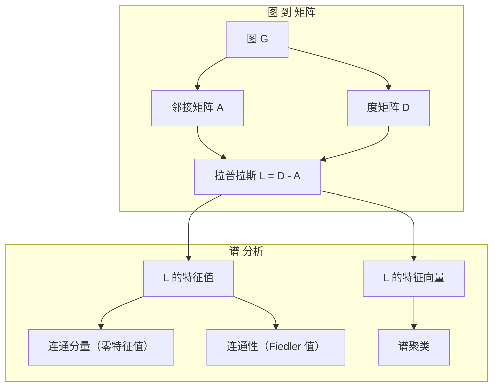
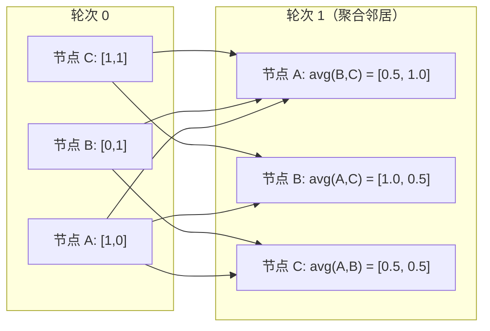

# 面向机器学习的图论

> 图是表示关系的数据结构。如果你的数据包含连接性，你就需要图论。

**Type:** 构建
**Language:** Python
**Prerequisites:** 第 1 阶段，第 01-03 课（线性代数、矩阵）
**Time:** ~90 分钟

## 学习目标

- 构建一个图类，支持邻接矩阵/邻接表表示并实现 BFS 和 DFS 遍历
- 计算图的拉普拉斯矩阵，并利用其特征值检测连通分量并对节点进行聚类
- 将一次 GNN 风格的消息传递实现为归一化邻接矩阵乘法
- 使用 Fiedler 向量应用谱聚类对图进行划分

## 问题背景

社交网络、分子、知识库、引文网络、道路地图——这些都是图。传统机器学习把数据当作平表处理。每一行都是独立的，每一列是一个特征。但当连接结构很重要时，表格会失效。

考虑社交网络。你想预测用户会买什么产品。用户的购买历史很重要，但他们朋友的购买历史更重要。连接携带信号。

再比如分子。你想预测它是否能与蛋白质结合。原子很重要，但真正重要的是原子之间如何相连。结构就是数据。

图神经网络（GNNs）是深度学习增长最快的领域之一。它们推动了药物发现、社交推荐、欺诈检测和知识图推理。每个 GNN 都基于同样的基础：基础图论。

你需要四样东西：
1. 将图表示为矩阵的方法（以便进行乘法）
2. 用于探索图结构的遍历算法
3. 拉普拉斯矩阵 —— 谱图论中最重要的矩阵
4. 消息传递 —— 让 GNNs 起作用的操作

## 概念

### 图：节点与边

一个图 G = (V, E) 由顶点（节点）V 和边 E 组成。每条边连接两个节点。

有向图与无向图。对于无向图，边 (u, v) 表示 u 与 v 相互连接。对于有向图（有向图），边 (u, v) 表示 u 指向 v，但不一定反向成立。

有权图与无权图。在无权图中，边要么存在要么不存在。在有权图中，每条边有一个数值权重 —— 距离、代价或强度。

| 图类型 | 示例 |
|--------|------|
| 无向、无权 | Facebook 朋友网络 |
| 有向、无权 | Twitter 关注网络 |
| 无向、有权 | 道路地图（距离） |
| 有向、有权 | 网页链接（PageRank 分数） |

### 邻接矩阵

邻接矩阵 A 是核心表示。对于 n 个节点的图：

```
A[i][j] = 1    如果存在从节点 i 到节点 j 的边
A[i][j] = 0    否则
```

对于无向图，A 是对称的：A[i][j] = A[j][i]。对于有权图，A[i][j] = 边 (i, j) 的权重。

示例 —— 一个三角形：

```
节点: 0, 1, 2
边: (0,1), (1,2), (0,2)

A = [[0, 1, 1],
     [1, 0, 1],
     [1, 1, 0]]
```

邻接矩阵是每个 GNN 的输入。对 A 的矩阵运算对应于对图的操作。

### 度

节点的度是与其相连的边的数量。对于有向图，有入度（进入的边）和出度（出去的边）。

度矩阵 D 是对角矩阵：

```
D[i][i] = 节点 i 的度
D[i][j] = 0    当 i != j
```

对于三角形示例：D = diag(2, 2, 2)，因为每个节点与两个其他节点相连。

度反映节点的重要性。高度 = 中心节点。网络的度分布揭示其结构。社交网络遵循幂律（少数枢纽，多数叶节点）。随机图的度呈泊松分布。

### BFS 与 DFS

两种基本的图遍历算法。你需要两者。

广度优先搜索（BFS）：先探索所有邻居，然后再探索邻居的邻居。使用队列（FIFO）。

```
从节点 0 的 BFS：
  访问 0
  队列: [1, 2]        （0 的邻居）
  访问 1
  队列: [2, 3]        （加入 1 的邻居）
  访问 2
  队列: [3]           （2 的邻居已被访问）
  访问 3
  队列: []            （完成）
```

BFS 在无权图中找到最短路径。起点到任一节点的距离等于该节点首次发现的 BFS 层级。这就是为什么 BFS 用于社交网络的跳数距离。

深度优先搜索（DFS）：尽可能深入然后回溯。使用栈（LIFO）或递归。

```
从节点 0 的 DFS：
  访问 0
  栈: [1, 2]        （0 的邻居）
  访问 2           （从栈中弹出）
  栈: [1, 3]        （加入 2 的邻居）
  访问 3           （从栈中弹出）
  栈: [1]
  访问 1           （从栈中弹出）
  栈: []            （完成）
```

DFS 有以下用途：
- 找到连通分量（对未访问节点运行 DFS）
- 检测环（DFS 树中的回边）
- 拓扑排序（按 DFS 完成时间的逆序）

| 算法 | 数据结构 | 找到 | 使用场景 |
|------|---------|------|----------|
| BFS | 队列 | 最短路径 | 社交网络距离、知识图遍历 |
| DFS | 栈 | 连通分量、环 | 连通性、拓扑排序 |

### 图的拉普拉斯矩阵

L = D - A。谱图论中最重要的矩阵。

对于三角形：

```
D = [[2, 0, 0],    A = [[0, 1, 1],    L = [[2, -1, -1],
     [0, 2, 0],         [1, 0, 1],         [-1, 2, -1],
     [0, 0, 2]]         [1, 1, 0]]         [-1, -1,  2]]
```

拉普拉斯具有显著性质：

1. L 是半正定的。所有特征值 >= 0。

2. 零特征值的数量等于连通分量的数量。连通图恰好有一个零特征值。具有 3 个不相连分量的图有三个零特征值。

3. 最小的非零特征值（Fiedler 值）度量连通性。较大的 Fiedler 值表示图连接良好。较小的 Fiedler 值表示图存在薄弱点 —— 瓶颈。

4. Fiedler 值对应的特征向量（Fiedler 向量）揭示最佳划分。取正值的节点为一组，取负值的节点为另一组。这就是谱聚类。



### 谱性质

邻接矩阵和拉普拉斯的特征值揭示结构属性，无需任何遍历。

谱聚类的工作流程：
1. 计算拉普拉斯 L
2. 找到 L 的 k 个最小特征向量（跳过第一个，对于连通图第一个特征向量是全 1 向量）
3. 将这些特征向量作为每个节点的新坐标
4. 在这些坐标上运行 k-means

为什么有效？L 的特征向量编码了图上“最平滑”的函数。连接良好的节点在特征向量上取相似值。被瓶颈分隔的节点取不同值。特征向量自然地分离出簇。

随机游走的关联。归一化拉普拉斯与图上的随机游走有关。随机游走的平稳分布与节点度成正比。混合时间（游走收敛的速度）取决于谱间隙。

### 消息传递

图神经网络的核心操作。每个节点从邻居处收集消息，对其进行聚合，然后更新自身状态。

```
h_v^(k+1) = UPDATE(h_v^(k), AGGREGATE({h_u^(k) : u in neighbors(v)}))
```

最简单的形式中，AGGREGATE = mean，UPDATE = 线性变换 + 激活：

```
h_v^(k+1) = sigma(W * mean({h_u^(k) : u in neighbors(v)}))
```

这在形式上就是矩阵乘法。如果 H 是所有节点特征的矩阵，A 是邻接矩阵：

```
H^(k+1) = sigma(A_norm * H^(k) * W)
```

其中 A_norm 是归一化邻接矩阵（每一行和为 1）。

一次消息传递使每个节点“看到”其直接邻居。两次让它看到邻居的邻居。K 次则获得来自 K 跳邻域的信息。



### 概念与 ML 应用

| 概念 | ML 应用 |
|------|--------|
| 邻接矩阵 | GNN 的输入表示 |
| 图拉普拉斯 | 谱聚类、社区检测 |
| BFS/DFS | 知识图遍历、路径寻找 |
| 度分布 | 节点重要性、特征工程 |
| 消息传递 | GNN 层（GCN、GAT、GraphSAGE） |
| L 的特征值 | 社区检测、图划分 |
| 谱聚类 | 无监督的节点分组 |
| PageRank | 节点重要性、网页搜索 |

```figure
graph-degree-distribution
```

## 实现

### 第 1 步：从零实现 Graph 类

```python
class Graph:
    def __init__(self, n_nodes, directed=False):
        self.n = n_nodes
        self.directed = directed
        self.adj = {i: {} for i in range(n_nodes)}

    def add_edge(self, u, v, weight=1.0):
        self.adj[u][v] = weight
        if not self.directed:
            self.adj[v][u] = weight

    def neighbors(self, node):
        return list(self.adj[node].keys())

    def degree(self, node):
        return len(self.adj[node])

    def adjacency_matrix(self):
        import numpy as np
        A = np.zeros((self.n, self.n))
        for u in range(self.n):
            for v, w in self.adj[u].items():
                A[u][v] = w
        return A

    def degree_matrix(self):
        import numpy as np
        D = np.zeros((self.n, self.n))
        for i in range(self.n):
            D[i][i] = self.degree(i)
        return D

    def laplacian(self):
        return self.degree_matrix() - self.adjacency_matrix()
```

邻接表（`self.adj`）高效地存储邻居信息。转换为邻接矩阵时使用 numpy，因为所有谱操作都需要它。

### 第 2 步：BFS 与 DFS

```python
from collections import deque

def bfs(graph, start):
    visited = set()
    order = []
    distances = {}
    queue = deque([(start, 0)])
    visited.add(start)
    while queue:
        node, dist = queue.popleft()
        order.append(node)
        distances[node] = dist
        for neighbor in graph.neighbors(node):
            if neighbor not in visited:
                visited.add(neighbor)
                queue.append((neighbor, dist + 1))
    return order, distances


def dfs(graph, start):
    visited = set()
    order = []
    stack = [start]
    while stack:
        node = stack.pop()
        if node in visited:
            continue
        visited.add(node)
        order.append(node)
        for neighbor in reversed(graph.neighbors(node)):
            if neighbor not in visited:
                stack.append(neighbor)
    return order
```

BFS 使用 deque（双端队列）以实现 O(1) 的 popleft。DFS 使用列表作为栈。两者恰好访问每个节点一次 —— 时间复杂度 O(V + E)。

### 第 3 步：连通分量与拉普拉斯特征值

```python
def connected_components(graph):
    visited = set()
    components = []
    for node in range(graph.n):
        if node not in visited:
            order, _ = bfs(graph, node)
            visited.update(order)
            components.append(order)
    return components


def laplacian_eigenvalues(graph):
    import numpy as np
    L = graph.laplacian()
    eigenvalues = np.linalg.eigvalsh(L)
    return eigenvalues
```

`eigvalsh` 用于对称矩阵 —— 对于无向图，拉普拉斯总是对称的。它以升序返回特征值。统计接近零的特征值个数即可得到连通分量数量。

### 第 4 步：谱聚类

```python
def spectral_clustering(graph, k=2):
    import numpy as np
    L = graph.laplacian()
    eigenvalues, eigenvectors = np.linalg.eigh(L)
    features = eigenvectors[:, 1:k+1]

    labels = np.zeros(graph.n, dtype=int)
    for i in range(graph.n):
        if features[i, 0] >= 0:
            labels[i] = 0
        else:
            labels[i] = 1
    return labels
```

对于 k=2，Fiedler 向量的符号将图划分为两类。对于 k>2，你应对前 k 个特征向量（排除平凡的全 1 向量）运行 k-means。

### 第 5 步：消息传递

```python
def message_passing(graph, features, weight_matrix):
    import numpy as np
    A = graph.adjacency_matrix()
    row_sums = A.sum(axis=1, keepdims=True)
    row_sums[row_sums == 0] = 1
    A_norm = A / row_sums
    aggregated = A_norm @ features
    output = aggregated @ weight_matrix
    return output
```

这是一轮 GNN 消息传递。每个节点的新特征是其邻居特征的加权平均，再经过权重矩阵变换。堆叠多轮以传播更远的信息。

## 使用示例

使用 networkx 和 numpy，相同的操作可以一行搞定：

```python
import networkx as nx
import numpy as np

G = nx.karate_club_graph()

A = nx.adjacency_matrix(G).toarray()
L = nx.laplacian_matrix(G).toarray()

eigenvalues = np.linalg.eigvalsh(L.astype(float))
print(f"Smallest eigenvalues: {eigenvalues[:5]}")
print(f"Connected components: {nx.number_connected_components(G)}")

communities = nx.community.greedy_modularity_communities(G)
print(f"Communities found: {len(communities)}")

pr = nx.pagerank(G)
top_nodes = sorted(pr.items(), key=lambda x: x[1], reverse=True)[:5]
print(f"Top 5 PageRank nodes: {top_nodes}")
```

networkx 使用了优化的 C 后端，能处理任意规模的图。将其用于生产环境。在零实现中实现一遍，有助于理解其内部工作。

### numpy 谱分析示例

```python
import numpy as np

A = np.array([
    [0, 1, 1, 0, 0],
    [1, 0, 1, 0, 0],
    [1, 1, 0, 1, 0],
    [0, 0, 1, 0, 1],
    [0, 0, 0, 1, 0]
])

D = np.diag(A.sum(axis=1))
L = D - A

eigenvalues, eigenvectors = np.linalg.eigh(L)
print(f"Eigenvalues: {np.round(eigenvalues, 4)}")
print(f"Fiedler value: {eigenvalues[1]:.4f}")
print(f"Fiedler vector: {np.round(eigenvectors[:, 1], 4)}")

fiedler = eigenvectors[:, 1]
group_a = np.where(fiedler >= 0)[0]
group_b = np.where(fiedler < 0)[0]
print(f"Cluster A: {group_a}")
print(f"Cluster B: {group_b}")
```

Fiedler 向量完成大部分工作。正值对应一簇，负值对应另一簇。不需要迭代优化 —— 只需一次特征分解。

## 部署产出

本课产出：
- `outputs/skill-graph-analysis.md` —— 面向图结构数据分析的技能参考

## 关联

| 概念 | 出现位置 |
|------|---------|
| 邻接矩阵 | GCN、GAT、GraphSAGE 的输入 |
| 拉普拉斯 | 谱聚类、ChebNet 滤波器 |
| BFS | 知识图遍历、最短路径查询 |
| 消息传递 | 每个 GNN 层，神经消息传递 |
| 谱间隙 | 图连通性、随机游走的混合时间 |
| 度分布 | 幂律网络、节点特征工程 |
| 连通分量 | 预处理、处理不连通图 |
| PageRank | 节点重要性排序、注意力初始化 |

值得特别提到 GNN。GCN（Kipf & Welling, 2017）中的图卷积操作使用加入自环的邻接矩阵，A_hat = A + I：

```text
H^(l+1) = sigma(D_hat^(-1/2) * A_hat * D_hat^(-1/2) * H^(l) * W^(l))
```

其中 A_hat = A + I（邻接加自环），D_hat 是 A_hat 的度矩阵。自环确保每个节点在聚合时包含自身特征。这正是具有对称归一化的消息传递。D_hat^(-1/2) * A_hat * D_hat^(-1/2) 即归一化邻接矩阵。拉普拉斯出现是因为该归一化与 L_sym = I - D^(-1/2) * A * D^(-1/2) 有关联。理解拉普拉斯即理解 GCN 为什么有效。

## 练习

1. 实现从零开始的 PageRank。以均匀分数开始。每一步：score(v) = (1-d)/n + d * sum(score(u)/out_degree(u))（对所有指向 v 的 u）。使用 d=0.85。运行直到收敛（变化 < 1e-6）。在一个小型网页图上测试。

2. 使用谱聚类寻找社区。构造一个有明显两簇的图（例如两个完全子图由一条边连接）。运行谱聚类并验证它找到正确划分。随着跨簇边的增加，会发生什么变化？

3. 实现 Dijkstra 算法用于带权图的最短路径。在权重均一的图上将结果与 BFS 比较。

4. 构建一个两层的消息传递网络。使用不同的权重矩阵重复两次消息传递。展示在两轮之后每个节点都获得了其 2 跳邻域的信息。

5. 分析一个真实世界的图。使用 Karate Club 图（34 个节点，78 条边）。计算度分布、拉普拉斯特征值和谱聚类。将谱聚类结果与已知的真实划分做比较。

## 关键词

| 术语 | 人们如何说 | 实际含义 |
|------|-----------|---------|
| 图 | “节点和边” | 数学结构 G=(V,E)，编码成对关系 |
| 邻接矩阵 | “连接表” | 一个 n x n 矩阵，A[i][j]=1 表示节点 i 与 j 相连 |
| 度 | “节点有多连接” | 与节点相连的边数 |
| 拉普拉斯 | “D 减去 A” | L = D - A，其特征值揭示图结构 |
| Fiedler 值 | “代数连通性” | L 的最小非零特征值，度量图的连通程度 |
| BFS | “逐层搜索” | 先访问所有邻居再深入，找到最短路径 |
| DFS | “先深后回” | 先沿一条路径深入直到尽头再回溯 |
| 消息传递 | “节点与邻居交互” | 每个节点从邻居聚合信息，GNN 的核心 |
| 谱聚类 | “按特征向量聚类” | 使用拉普拉斯的特征向量对图进行划分 |
| 连通分量 | “独立的片段” | 最大子图，其中任意两个节点可互达 |

## 拓展阅读

- Kipf & Welling (2017) -- "Semi-Supervised Classification with Graph Convolutional Networks." 启动现代 GNN 的论文。展示了谱图卷积如何简化为消息传递。
- Spielman (2012) -- "Spectral Graph Theory" 讲义。对拉普拉斯、谱间隙和图划分的权威性介绍。
- Hamilton (2020) -- "Graph Representation Learning." 从基础到应用覆盖 GNN 的书籍。
- Bronstein et al. (2021) -- "Geometric Deep Learning: Grids, Groups, Graphs, Geodesics, and Gauges." 统一框架论文。
- Veličković et al. (2018) -- "Graph Attention Networks." 用注意力机制扩展消息传递。