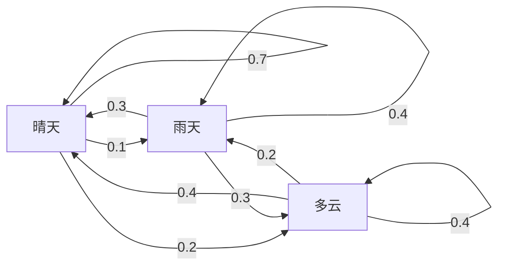
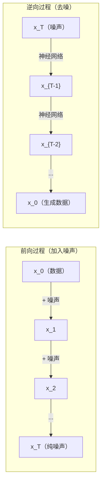

# Stochastic Processes

> Randomness with structure. The math behind random walks, Markov chains, and diffusion models.

**Type:** 学习
**Language:** Python
**Prerequisites:** 第 1 阶段，课程 06-07（概率，贝叶斯）
**Time:** ~75 分钟

## Learning Objectives

- 模拟 1D 和 2D 随机游走并验证位移的 sqrt(n) 标度关系
- 构建马尔可夫链模拟器并通过特征分解计算其平稳分布
- 实现 Metropolis-Hastings MCMC 和 Langevin 动力学以从目标分布采样
- 将前向扩散过程与布朗运动联系起来，并解释逆过程如何生成数据

## The Problem

许多 AI 系统涉及随时间演化的随机性。不是静态的随机性——而是有结构的、序列化的随机性，每一步依赖于之前发生的事。

语言模型一次生成一个 token。每个 token 依赖于之前的上下文。模型输出一个概率分布，从中采样并继续。这就是一个随机过程。

扩散模型逐步向图像加入噪声直到变成纯噪声（static）。然后它们逆转该过程，逐步去噪直到生成新图像。前向过程是一个马尔可夫链。逆过程是一个学习到的、反向运行的马尔可夫链。

强化学习的智能体在环境中采取动作。每个动作以一定概率导致新的状态。智能体在随机世界中遵循随机策略。整个系统是一个马尔可夫决策过程。

MCMC 采样——贝叶斯推断的基石——构造一个其平稳分布为你想要采样的后验的马尔可夫链。

所有这些都基于四个基础思想：
1. 随机游走——最简单的随机过程
2. 马尔可夫链——具有转移矩阵的结构化随机性
3. Langevin 动力学——带噪声的梯度下降
4. Metropolis-Hastings——从任意分布采样

## The Concept

### Random Walks

从位置 0 开始。每一步抛一枚公平硬币。正面：向右移动（+1）。反面：向左移动（-1）。

经过 n 步后，你的位置是 n 个随机 +/-1 值的和。期望位置为 0（游走无偏）。但距离原点的期望值随着 sqrt(n) 增长。

这有些违反直觉。游走是公平的——既无向左也无向右的漂移。但随着时间推移，它越走越远。n 步后的标准差为 sqrt(n)。

```
Step 0:  Position = 0
Step 1:  Position = +1 or -1
Step 2:  Position = +2, 0, or -2
...
Step 100: Expected distance from origin ~ 10 (sqrt(100))
Step 10000: Expected distance from origin ~ 100 (sqrt(10000))
```

在 2D 中，游走以相等概率向上、向下、向左或向右移动。距离原点的扩展同样遵循 sqrt(n) 标度。路径描绘出类似分形的图案。

为什么是 sqrt(n)？每一步是 +/-1 且概率相等。经过 n 步，位置 S_n = X_1 + X_2 + ... + X_n，其中每个 X_i 为 +/-1。每一步的方差为 1，且步之间独立，所以 Var(S_n) = n。标准差 = sqrt(n)。根据中心极限定理，S_n / sqrt(n) 收敛到标准正态分布。

这个 sqrt(n) 的标度在机器学习中随处可见。SGD 噪声随 1/sqrt(batch_size) 缩放。嵌入维度常常按 sqrt(d) 缩放。平方根是独立随机相加的标志。

与布朗运动的联系。取步长为 1/sqrt(n) 且每单位时间有 n 步的随机游走。当 n → ∞ 时，游走收敛到布朗运动 B(t)——一个连续时间过程，其中 B(t) 服从均值 0、方差 t 的正态分布。

布朗运动是扩散的数学基础。它模拟流体中粒子的随机抖动、股票价格的波动，以及——关键——扩散模型中的噪声过程。

赌博者破产问题。随机游走从位置 k 开始，在 0 和 N 两端有吸收边界。首次到达 N 而不是 0 的概率是多少？对于公平游走：P(到达 N) = k/N。这出人意料地简单而优雅。它与鞅论相连——公平随机游走是一个鞅（期望未来值 = 当前值）。

### Markov Chains

马尔可夫链是根据固定概率在状态之间转移的系统。关键性质：下一状态仅依赖于当前状态，而不依赖于历史。

```
P(X_{t+1} = j | X_t = i, X_{t-1} = ...) = P(X_{t+1} = j | X_t = i)
```

这就是马尔可夫性质。它意味着你可以用转移矩阵 P 来描述整个动力学：

```
P[i][j] = probability of going from state i to state j
```

P 的每一行之和为 1（你必须去某个地方）。

**示例——天气：**

```
States: Sunny (0), Rainy (1), Cloudy (2)

P = [[0.7, 0.1, 0.2],    (if sunny: 70% sunny, 10% rainy, 20% cloudy)
     [0.3, 0.4, 0.3],    (if rainy: 30% sunny, 40% rainy, 30% cloudy)
     [0.4, 0.2, 0.4]]    (if cloudy: 40% sunny, 20% rainy, 40% cloudy)
```

从任意状态开始。经过许多次转移后，状态分布收敛到平稳分布 pi，使得 pi * P = pi。这是 P 的左特征向量，对应特征值 1。

对于天气链，平稳分布可能是 [0.53, 0.18, 0.29]——长期来看无论起始状态如何晴天大约占 53%。



计算平稳分布有两种方法：

1. 幂法（Power method）：将任意初始分布重复与 P 相乘。经过足够迭代后收敛。
2. 特征值方法：求 P 的左特征向量对应特征值 1。这等价于求 P^T 的特征向量对应特征值 1。

两种方法都要求链满足收敛条件。

收敛条件。若马尔可夫链满足以下条件，则会收敛到唯一的平稳分布：
- 不可约（Irreducible）：每个状态都能从其他状态到达
- 非周期性（Aperiodic）：链不会以固定周期循环

大多数在机器学习中遇到的链都满足这两个条件。

吸收态。若一旦进入某状态就永远不会离开（P[i][i] = 1），该状态为吸收态。吸收马尔可夫链用于建模具有终止状态的过程——游戏结束、客户流失、token 序列遇到结束符等。

混合时间（Mixing time）。到链“接近”平稳分布需要多少步？形式上，是总变差距离降到某阈值以下所需的步数。快速混合意味着所需步数少。P 的谱隙（1 减去第二大特征值）控制混合时间。谱隙越大，混合越快。

### Connection to Language Models

在语言模型中，token 的生成近似为马尔可夫过程。给定当前上下文，模型输出下一个 token 的分布。温度（Temperature）控制分布的锋利程度：

```
P(token_i) = exp(logit_i / temperature) / sum(exp(logit_j / temperature))
```

- Temperature = 1.0：标准分布
- Temperature < 1.0：更尖锐（更确定）
- Temperature > 1.0：更平坦（更随机）
- Temperature -> 0：argmax（贪心）

Top-k 采样截断到前 k 个概率最高的 token。Top-p（核采样）截断到累计概率超过 p 的最小 token 集合。两者都修改了马尔可夫转移概率。

### Brownian Motion

随机游走的连续时间极限。位置 B(t) 满足三条性质：
1. B(0) = 0
2. 对于 t > s，B(t) - B(s) 服从均值 0、方差 t - s 的正态分布
3. 不重叠区间上的增量相互独立

布朗运动是连续的但处处不可微——在每个尺度上都在抖动。其在平面上的路径具有分形维数 2。

在离散模拟中，你可以近似布朗运动为：

```
B(t + dt) = B(t) + sqrt(dt) * z,    where z ~ N(0, 1)
```

sqrt(dt) 的标度很重要。它来自将中心极限定理应用于随机游走。

### Langevin Dynamics

梯度下降寻找函数的最小值。Langevin 动力学生成与 exp(-U(x)/T) 成比例的概率分布，其中 U 是能量函数，T 是温度。

```
x_{t+1} = x_t - dt * gradient(U(x_t)) + sqrt(2 * T * dt) * z_t
```

两个力作用于粒子：
1. 梯度力（-dt * gradient(U)）：推动到低能量区（类似梯度下降）
2. 随机力（sqrt(2*T*dt) * z）：推动随机探索

当 T = 0 时，这是纯梯度下降。高温下近似随机游走。在合适的温度下，粒子在能量景观中探索并更多地停留在低能量区域。

与扩散模型的联系。扩散模型的前向过程为：

```
x_t = sqrt(alpha_t) * x_{t-1} + sqrt(1 - alpha_t) * noise
```

这是一个逐步将数据与噪声混合的马尔可夫链。经过足够多步骤后，x_T 接近纯高斯噪声。

逆过程——从噪声回到数据——也是一个马尔可夫链，但其转移概率由神经网络学习参数化。网络学习预测每步被加入的噪声，然后将其减去。



### MCMC: Markov Chain Monte Carlo

有时你需要从一个你能评估（到常数因子）的分布 p(x) 中采样，但无法直接采样。贝叶斯后验是经典例子——你知道似然乘以先验，但归一化常数不可解。

**Metropolis-Hastings** 构造一个其平稳分布为 p(x) 的马尔可夫链：

1. 从某个位置 x 开始
2. 从提议分布 Q(x'|x) 提出新位置 x'
3. 计算接受比率：a = p(x') * Q(x|x') / (p(x) * Q(x'|x))
4. 以概率 min(1, a) 接受 x'；否则保持在 x
5. 重复

如果 Q 对称（例如 Q(x'|x) = Q(x|x') = N(x, sigma^2)），比率简化为 a = p(x') / p(x)。你只需要概率比值——归一化常数会相互消掉。

在温和条件下，链保证收敛到 p(x)。但如果提议方差太小（随机游走式）或太大（大量拒绝），收敛会很慢。调参是 MCMC 的艺术。

为什么可行。接受比率保证了详细平衡：处于 x 并转到 x' 的概率等于处于 x' 并转到 x 的概率。详细平衡意味着 p(x) 是链的平稳分布。因此经过足够步数后，样本来自 p(x)。

实用注意事项：
- Burn-in：丢弃前 N 个样本。链需要时间从起始点达到平稳分布。
- Thinning：每隔 k 步保留一个样本以降低自相关。
- 多链：从不同起点运行多个链。如果它们收敛到相同分布，则有收敛证据。
- 接受率：对于 d 维的高斯提议，最优接受率约为 23%（Roberts & Rosenthal, 2001）。过高说明链几乎不动。过低说明大部分被拒绝。

### Stochastic Processes in AI

| Process | AI Application |
|---------|---------------|
| Random walk | 强化学习中的探索，Node2Vec 嵌入 |
| Markov chain | 文本生成，MCMC 采样 |
| Brownian motion | 扩散模型（前向过程） |
| Langevin dynamics | 基于分数的生成模型，SGLD |
| Markov decision process | 强化学习 |
| Metropolis-Hastings | 贝叶斯推断，后验采样 |

```figure
random-walk-diffusion
```

## Build It

### Step 1: Random walk simulator

```python
import numpy as np

def random_walk_1d(n_steps, seed=None):
    rng = np.random.RandomState(seed)
    steps = rng.choice([-1, 1], size=n_steps)
    positions = np.concatenate([[0], np.cumsum(steps)])
    return positions


def random_walk_2d(n_steps, seed=None):
    rng = np.random.RandomState(seed)
    directions = rng.choice(4, size=n_steps)
    dx = np.zeros(n_steps)
    dy = np.zeros(n_steps)
    dx[directions == 0] = 1   # 右
    dx[directions == 1] = -1  # 左
    dy[directions == 2] = 1   # 上
    dy[directions == 3] = -1  # 下
    x = np.concatenate([[0], np.cumsum(dx)])
    y = np.concatenate([[0], np.cumsum(dy)])
    return x, y
```

1D 游走存储累加和。每一步为 +1 或 -1。经过 n 步位置为和。方差随 n 线性增长，因此标准差随 sqrt(n) 增长。

### Step 2: Markov chain

```python
class MarkovChain:
    def __init__(self, transition_matrix, state_names=None):
        self.P = np.array(transition_matrix, dtype=float)
        self.n_states = len(self.P)
        self.state_names = state_names or [str(i) for i in range(self.n_states)]

    def step(self, current_state, rng=None):
        if rng is None:
            rng = np.random.RandomState()
        probs = self.P[current_state]
        return rng.choice(self.n_states, p=probs)

    def simulate(self, start_state, n_steps, seed=None):
        rng = np.random.RandomState(seed)
        states = [start_state]
        current = start_state
        for _ in range(n_steps):
            current = self.step(current, rng)
            states.append(current)
        return states

    def stationary_distribution(self):
        eigenvalues, eigenvectors = np.linalg.eig(self.P.T)
        idx = np.argmin(np.abs(eigenvalues - 1.0))
        stationary = np.real(eigenvectors[:, idx])
        stationary = stationary / stationary.sum()
        return np.abs(stationary)
```

平稳分布是 P 的左特征向量，对应特征值 1。我们通过计算 P^T 的特征向量来找到它（转置会把左特征向量变为右特征向量）。

### Step 3: Langevin dynamics

```python
def langevin_dynamics(grad_U, x0, dt, temperature, n_steps, seed=None):
    rng = np.random.RandomState(seed)
    x = np.array(x0, dtype=float)
    trajectory = [x.copy()]
    for _ in range(n_steps):
        noise = rng.randn(*x.shape)
        x = x - dt * grad_U(x) + np.sqrt(2 * temperature * dt) * noise
        trajectory.append(x.copy())
    return np.array(trajectory)
```

梯度推动 x 朝低能量方向。噪声防止陷入局部极小。平衡时，样本分布与 exp(-U(x)/temperature) 成比例。

### Step 4: Metropolis-Hastings

```python
def metropolis_hastings(target_log_prob, proposal_std, x0, n_samples, seed=None):
    rng = np.random.RandomState(seed)
    x = np.array(x0, dtype=float)
    samples = [x.copy()]
    accepted = 0
    for _ in range(n_samples - 1):
        x_proposed = x + rng.randn(*x.shape) * proposal_std
        log_ratio = target_log_prob(x_proposed) - target_log_prob(x)
        if np.log(rng.rand()) < log_ratio:
            x = x_proposed
            accepted += 1
        samples.append(x.copy())
    acceptance_rate = accepted / (n_samples - 1)
    return np.array(samples), acceptance_rate
```

该算法提出新点，检查其是否拥有更高概率（或按概率接受），然后重复。良好混合时接受率应在约 23%-50% 区间。

## Use It

在实践中，你会使用成熟库来实现这些算法。但理解其机制对调试和调参很重要。

```python
import numpy as np

rng = np.random.RandomState(42)
walk = np.cumsum(rng.choice([-1, 1], size=10000))
print(f"Final position: {walk[-1]}")
print(f"Expected distance: {np.sqrt(10000):.1f}")
print(f"Actual distance: {abs(walk[-1])}")
```

### numpy for transition matrices

```python
import numpy as np

P = np.array([[0.7, 0.1, 0.2],
              [0.3, 0.4, 0.3],
              [0.4, 0.2, 0.4]])

distribution = np.array([1.0, 0.0, 0.0])
for _ in range(100):
    distribution = distribution @ P

print(f"Stationary distribution: {np.round(distribution, 4)}")
```

将初始分布反复与 P 相乘。经过足够迭代后，无论从何处开始都会收敛到平稳分布。这就是寻找主左特征向量的幂法。

### Connections to real frameworks

- **PyTorch diffusion:** Hugging Face `diffusers` 中的 `DDPMScheduler` 实现了前向和逆向的马尔可夫链
- **NumPyro / PyMC:** 使用 MCMC（NUTS 采样器，它改进了 Metropolis-Hastings）进行贝叶斯推断
- **Gymnasium (RL):** 环境的 step 函数定义了一个马尔可夫决策过程

### Verifying Markov chain convergence

```python
import numpy as np

P = np.array([[0.9, 0.1], [0.3, 0.7]])

eigenvalues = np.linalg.eigvals(P)
spectral_gap = 1 - sorted(np.abs(eigenvalues))[-2]
print(f"Eigenvalues: {eigenvalues}")
print(f"Spectral gap: {spectral_gap:.4f}")
print(f"Approximate mixing time: {1/spectral_gap:.1f} steps")
```

谱隙告诉你链忘记初始状态的速度。谱隙为 0.2 大约意味着 5 步混合；谱隙为 0.01 大约意味着 100 步。运行长时间模拟前务必检查这一点——缓慢混合的链会浪费计算资源。

## Ship It

本课产出：
- `outputs/prompt-stochastic-process-advisor.md` -- 一个用于识别给定问题适用哪种随机过程框架的提示词

## Connections

| Concept | Where it shows up |
|---------|------------------|
| Random walk | Node2Vec 图嵌入，强化学习中的探索 |
| Markov chain | LLM 中的 token 生成，MCMC 采样 |
| Brownian motion | DDPM 中的前向扩散过程，基于 SDE 的模型 |
| Langevin dynamics | 基于分数的生成模型，随机梯度 Langevin 动力学（SGLD） |
| Stationary distribution | MCMC 收敛目标，PageRank |
| Metropolis-Hastings | 贝叶斯后验采样，模拟退火 |
| Temperature | LLM 采样，强化学习中的玻尔兹曼探索，模拟退火 |
| Mixing time | MCMC 收敛速度，谱隙分析 |
| Absorbing state | 序列结束 token，强化学习中的终止状态 |
| Detailed balance | MCMC 采样器的正确性保证 |

扩散模型值得特别关注。DDPM（Ho et al., 2020）定义了一个前向马尔可夫链：

```
q(x_t | x_{t-1}) = N(x_t; sqrt(1-beta_t) * x_{t-1}, beta_t * I)
```

其中 beta_t 是噪声调度。经过 T 步后，x_T 近似为 N(0, I)。逆过程由预测噪声的神经网络参数化：

```
p_theta(x_{t-1} | x_t) = N(x_{t-1}; mu_theta(x_t, t), sigma_t^2 * I)
```

生成的每一步都是一个学习到的马尔可夫链的一步。理解马尔可夫链就意味着理解扩散模型如何以及为何生成数据。

SGLD（随机梯度 Langevin 动力学）将小批量梯度下降与 Langevin 噪声结合。你使用随机估计代替完整梯度并加入校准的噪声。随着学习率衰减，SGLD 从优化过渡到采样——你可以免费得到近似贝叶斯后验样本。这是从神经网络中获取不确定性估计的最简单方式之一。

这些联系的关键见解：随机过程不仅仅是理论工具。它们是现代 AI 系统内部的计算机制。当你调节 LLM 的温度时，你在调整一个马尔可夫链。当你训练扩散模型时，你在学习如何逆转一个类似布朗运动的过程。当你运行贝叶斯推断时，你在构造一个收敛到后验的链。

## Exercises

1. **模拟 1000 次 10000 步的随机游走。** 绘制最终位置的分布。验证其近似为均值 0、标准差 sqrt(10000) = 100 的高斯分布。

2. **用马尔可夫链构建一个文本生成器。** 在小语料上训练：对于每个词，统计到下一个词的转移。构建转移矩阵。通过从链中采样生成新句子。

3. **实现模拟退火（simulated annealing）** 使用 Metropolis-Hastings。以高温开始（几乎接受所有提议），逐渐降温（仅接受改进）。用它在具有许多局部极小值的函数上寻找全局最小值。

4. **比较不同温度下的 Langevin 动力学。** 对双稳势势能 U(x) = (x^2 - 1)^2 进行采样。在低温下，样本聚集在某一势阱。在高温下，样本在两个势阱间扩散。找到链在两阱间混合的临界温度。

5. **实现前向扩散过程。** 从一维信号（例如正弦波）开始。在 100 步内按线性噪声调度逐步加入噪声。展示信号如何退化为纯噪声。然后实现一个简单的去噪器来逆转该过程（即使是一个朴素的估计噪声并减去的去噪器也行）。

## Key Terms

| Term | What people say | What it actually means |
|------|----------------|----------------------|
| Random walk | "Coin-flip movement" | 在每一步位置按随机增量变化的过程 |
| Markov property | "Memoryless" | 未来仅依赖当前状态，而不依赖历史 |
| Transition matrix | "The probability table" | P[i][j] = 从状态 i 到状态 j 的转移概率 |
| Stationary distribution | "The long-run average" | 满足 pi*P = pi 的分布——链的平衡分布 |
| Brownian motion | "Random jiggling" | 随机游走的连续时间极限，B(t) ~ N(0, t) |
| Langevin dynamics | "Gradient descent with noise" | 将确定性梯度更新和随机扰动结合的更新规则 |
| MCMC | "Walking toward the target" | 构造一个其平稳分布为目标分布的马尔可夫链 |
| Metropolis-Hastings | "Propose and accept/reject" | 使用接受比率保证收敛的 MCMC 算法 |
| Temperature | "The randomness knob" | 控制探索与利用权衡的参数 |
| Diffusion process | "Noise in, noise out" | 前向：逐步加入噪声。逆向：逐步去噪。用于生成数据。 |

## Further Reading

- **Ho, Jain, Abbeel (2020)** -- "Denoising Diffusion Probabilistic Models." 引发扩散模型浪潮的 DDPM 论文。清晰地推导了前向和逆向马尔可夫链。
- **Song & Ermon (2019)** -- "Generative Modeling by Estimating Gradients of the Data Distribution." 基于分数的方法，使用 Langevin 动力学进行采样。
- **Roberts & Rosenthal (2004)** -- "General state space Markov chains and MCMC algorithms." 论述了何时以及为何 MCMC 有效的理论基础。
- **Norris (1997)** -- "Markov Chains." 标准教科书，涵盖收敛、平稳分布和到达时间等内容。
- **Welling & Teh (2011)** -- "Bayesian Learning via Stochastic Gradient Langevin Dynamics." 将 SGD 与 Langevin 动力学结合以实现可扩展的贝叶斯学习。