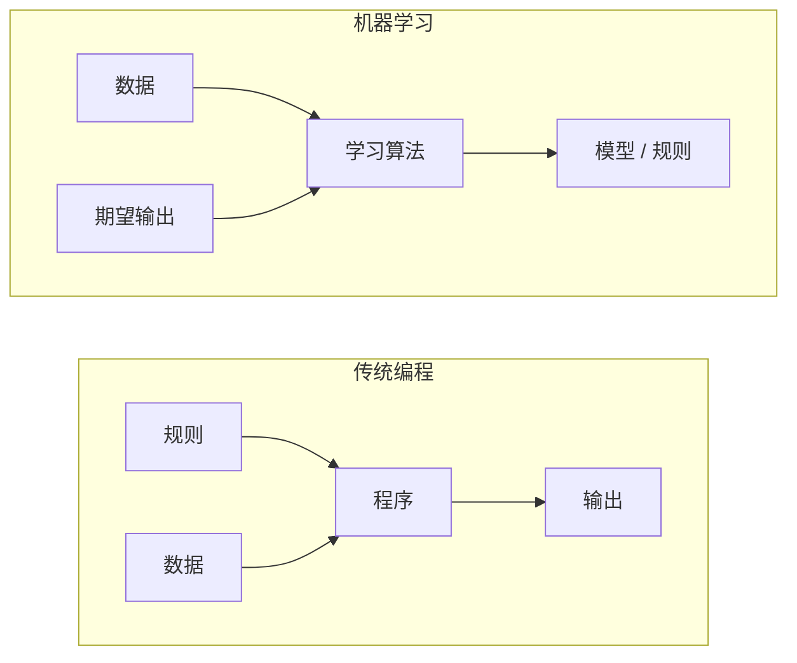
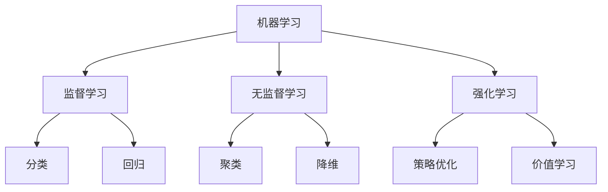
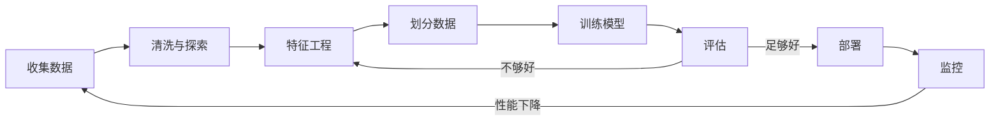
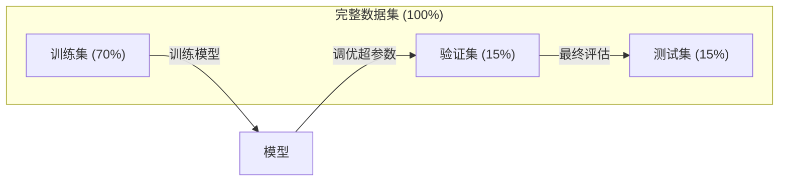
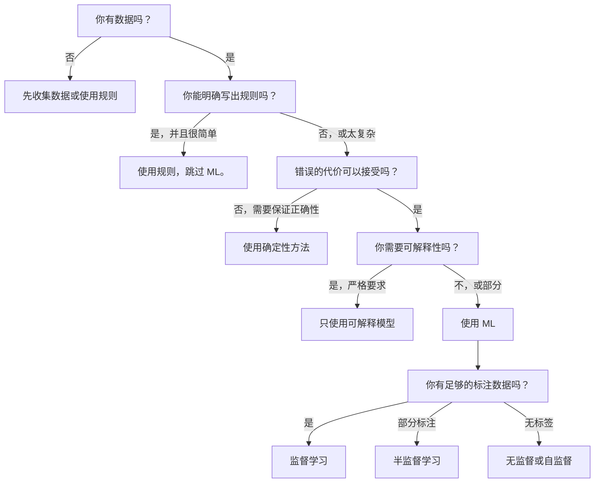

# What Is Machine Learning

> 机器学习是教计算机从数据中发现模式，而不是手工编写规则。

**Type:** 学习  
**Languages:** Python  
**Prerequisites:** Phase 1（数学基础）  
**Time:** ~45 分钟

## Learning Objectives

- 解释监督学习、无监督学习和强化学习之间的区别，并判定给定问题属于哪一类
- 从零实现一个最近质心分类器，并将其与随机基线进行评估
- 区分分类与回归任务，并为每种任务选择合适的损失函数
- 评估给定的业务问题是否适合用 ML 解决，还是更适合用确定性规则

## The Problem

你想要构建一个垃圾邮件过滤器。传统方法：坐下来写数百条规则。“如果邮件包含 'FREE MONEY'，标记为垃圾邮件。如果有超过 3 个感叹号，标记为垃圾邮件。”你花费数周时间写规则。然后垃圾邮件发送者改变措辞。你的规则失效。你写更多规则。循环永无止境。

机器学习则是颠倒这种做法。不再手写规则，而是给计算机成千上万封带标签的邮件（“垃圾”或“非垃圾”），让它自己去找规则。计算机会发现你可能想不到的模式。当垃圾邮件发送者改变策略时，你在新数据上重新训练模型，而不是重写代码。

从“编写规则”到“从数据中学习”是机器学习的核心。每个推荐引擎、语音助手、自动驾驶汽车和语言模型都是以这种方式工作的。

## The Concept

### 从数据学习，而不是写规则

传统编程和机器学习的解决方向相反。



传统编程：你编写规则。程序把规则应用到数据上以产生输出。

机器学习：你提供数据和期望输出。算法发现规则。

训练得到的“模型”就是规则，以数字（权重、参数）的形式编码。模型从已见示例中泛化，以对从未见过的数据进行预测。

### 机器学习的三大类



**监督学习**：你有输入-输出对。模型学习将输入映射到输出。  
- “这里有 10,000 张标注为猫或狗的照片。学习区分它们。”  
- “这里有房屋特征和价格。学习预测价格。”

**无监督学习**：你只有输入，没有标签。模型自行发现结构。  
- “这里有 10,000 条客户购买历史。找到自然分组。”  
- “这里有 1,000 个高维数据点。降到 2 维，同时保持结构。”

**强化学习**：一个智能体在环境中采取动作并获得奖励或惩罚。它学习一种策略（policy）以最大化总体回报。  
- “玩这个游戏。赢得 +1，输掉 -1。找出策略。”  
- “控制该机器人手臂。拿起物体 +1，每浪费一秒 -0.01。”

实践中大多数构建使用的是监督学习。无监督学习常用于预处理和探索。强化学习驱动游戏 AI、机器人以及语言模型的 RLHF。

### 超出三大类

上述三类是清晰的分类，但真实世界中的 ML 常常模糊这些界限。

**半监督学习** 使用少量带标签的数据和大量未标注的数据。你可能有 100 张带标签的医学影像和 100,000 张未标注影像。技术包括：

- **标签传播（Label propagation）**：构建连接相似数据点的图。标签从有标签节点通过图传播到无标签邻居。  
- **伪标签（Pseudo-labeling）**：在带标签数据上训练模型，用它来预测未标注数据的标签，然后在全部数据上重新训练。模型引导自己的训练集。  
- **一致性正则化（Consistency regularization）**：模型对输入及其轻微扰动应给出相同的预测。即使没有标签，这也能发挥作用。

**自监督学习** 从数据自身创建监督信号。完全不需要人工标签，模型从数据结构中构造预测任务。

- **Masked language modeling（BERT）**：遮蔽句子中 15% 的词，训练模型预测被遮蔽的词。“标签”来自原始文本。  
- **对比学习（SimCLR）**：对一张图像生成两个增强版本。训练模型识别它们来自同一图像，并与其他图像的增强版本区分开。  
- **下一个 token 预测（GPT）**：给定之前的所有词预测下一个词。每个文档都成为训练样本。

这些方法不是与三大类相互独立的类别，而是结合了监督和无监督思想的策略。从技术上讲，自监督是监督的，因为模型在预测某些东西，但标签是自动生成的，而非人工标注。

### 分类 vs 回归

这是两类主要的监督学习任务。

| 方面 | 分类 | 回归 |
|------|------|------|
| 输出 | 离散类别 | 连续数值 |
| 示例 | “这封邮件是垃圾邮件吗？” | “这套房子的价格是多少？” |
| 输出空间 | {cat, dog, bird} | 任意实数 |
| 损失函数 | 交叉熵、准确率 | 均方误差、MAE |
| 决策 | 类别间的边界 | 拟合数据的曲线 |

分类回答“属于哪个类别？”，回归回答“数值是多少？”

有些问题可以两种方式表述。预测股票涨跌是分类，预测精确价格是回归。

### ML 工作流

每个机器学习项目遵循相同的流程，无论算法如何。



**收集数据**：收集原始数据。更多数据通常更好，但质量比数量更重要。

**清洗与探索**：处理缺失值、删除重复项、可视化分布、发现异常。此步骤通常占项目时间的 60–80%。

**特征工程**：将原始数据转换为模型可用的特征。把日期转换为星期几。归一化数值列。编码类别变量。好的特征比高级算法更重要。

**划分数据**：分为训练、验证和测试集。模型在训练集上训练，在验证集上调超参数，并在测试集上报告最终性能。

**训练模型**：将训练数据输入算法。算法调整内部参数以最小化损失函数。

**评估**：在验证/测试数据上衡量性能。如果性能不可接受，回到特征工程、换算法或调整超参数。

**部署**：将模型放入生产环境，对新数据进行预测。

**监控**：跟踪性能随时间的变化。数据分布可能会改变（数据漂移），模型性能会下降。当性能下降时重新训练。

### 训练、验证和测试划分

这是初学者最常搞错的概念。你必须在模型从未见过的数据上评估模型。否则你测量的是记忆，而不是学习。



| 划分 | 目的 | 何时使用 | 典型比例 |
|------|------|---------|---------|
| 训练集 | 模型从中学习 | 训练期间 | 60–80% |
| 验证集 | 调超参数、比较模型 | 每次训练后 | 10–20% |
| 测试集 | 最终无偏性能估计 | 最后一次，仅一次 | 10–20% |

测试集是神圣的。你只在测试集上看一次结果。如果你根据测试集表现不断调整模型，实际上就是在训练测试集，那么报告的数字毫无意义。

对于小数据集，使用 k 折交叉验证：将数据分为 k 份，训练时用 k-1 份，验证用剩下一份，旋转并平均结果。

### 过拟合 vs 欠拟合


**欠拟合**：模型过于简单，无法捕捉数据中的模式。用直线去拟合曲线关系。训练误差高，测试误差高。

**过拟合**：模型过于复杂，记住了训练数据（包括噪声）。曲线在每个训练点处摆动，但对新数据表现差。训练误差低，测试误差高。

**良好拟合**：模型捕捉到真实模式而不记住噪声。训练误差和测试误差都较低。

过拟合的迹象：
- 训练准确率远高于验证准确率
- 模型在训练数据上表现好，但在新数据上表现差
- 增加训练数据能提升性能（说明模型在记忆而非学习）

缓解过拟合的方法：
- 获取更多训练数据
- 降低模型复杂度（更少参数、更简单结构）
- 正则化（对大权重添加惩罚）
- Dropout（训练时随机置零部分神经元）
- 提前停止（当验证误差开始上升时停止训练）

缓解欠拟合的方法：
- 使用更复杂的模型
- 增加特征
- 减少正则化
- 更长时间训练

### 偏差-方差权衡

这是过拟合与欠拟合背后的数学框架。

**偏差（Bias）**：来自模型错误假设的误差。线性模型在真实关系非线性时偏差高。高偏差导致欠拟合。

**方差（Variance）**：来自训练数据微小波动的敏感性。高方差模型在不同子集上训练会给出截然不同的预测。高方差导致过拟合。

| 模型复杂度 | 偏差 | 方差 | 结果 |
|------------|------|------|------|
| 太低（对曲线数据用线性模型） | 高 | 低 | 欠拟合 |
| 刚好合适 | 中等 | 中等 | 良好泛化 |
| 太高（对 10 个点用 20 次多项式） | 低 | 高 | 过拟合 |

总误差 = 偏差^2 + 方差 + 不可约噪声

不可约噪声（数据本身的随机性）无法降低。目标是找到偏差^2 + 方差最小的折中点。

### 无免费午餐定理

不存在对所有问题都最优的算法。在一类问题上表现好的算法，在另一类问题上会表现差。这就是数据科学家尝试多种算法并比较结果的原因。

实际选择取决于：
- 你有多少数据
- 有多少特征
- 关系是线性还是非线性
- 是否需要可解释性
- 你的计算资源有多少

### 何时不该使用机器学习

ML 很强大，但并非总是合适。在动手建模之前，先判断是否真的需要模型。

不应使用 ML 的情况：

- 规则简单且定义明确。税费计算、排序算法、单位换算。如果可以用几条 if 语句写出逻辑，模型只会增加复杂度而无益。
- 没有数据或数据太少。ML 需要示例来学习。只有 10 条数据无法训练出有意义的模型。先收集数据。
- 错误代价是灾难性的且需要保证正确性。药物剂量计算、核反应堆控制、密码学验证。ML 模型是概率性的，偶尔会出错。如果“偶尔出错”无法接受，请使用确定性方法。
- 查表或启发式可以解决问题。如果简单阈值或查表覆盖 99% 情况，加入 ML 会增加维护成本而无明显改进。
- 无法解释决策且可解释性是必需的。受监管行业（借贷、保险、刑事司法）有时要求每个决策都能完全解释。部分 ML 模型可解释（线性回归、小决策树），大多数不可解释。
- 问题变化比你能重新训练的速度快。如果规则每天都在变，而重训练需要一周，模型永远是过时的。

使用此决策流程：



## Build It

文件 `code/ml_intro.py` 中的代码实现了一个最近质心分类器（最近质心分类器是最简单的 ML 算法之一）。它演示了核心思想：从数据中学习，然后对新数据进行预测。

### 第 1 步：从零实现最近质心分类器

最近质心分类器计算训练数据中每类的中心（均值）。预测时，将每个新点分配给与其最近的类中心。

```python
class NearestCentroid:
    def fit(self, X, y):
        self.classes = np.unique(y)
        self.centroids = np.array([
            X[y == c].mean(axis=0) for c in self.classes
        ])

    def predict(self, X):
        distances = np.array([
            np.sqrt(((X - c) ** 2).sum(axis=1))
            for c in self.centroids
        ])
        return self.classes[distances.argmin(axis=0)]
```

这就是整个算法。fit 计算每个类的均值。predict 计算距离。没有梯度下降、没有迭代、没有超参数。

### 第 2 步：在合成数据上训练

我们生成一个二维分类数据集，两个类别略有重叠。质心分类器在类别中心之间画出线性决策边界。

```python
rng = np.random.RandomState(42)
X_class0 = rng.randn(100, 2) + np.array([1.0, 1.0])
X_class1 = rng.randn(100, 2) + np.array([-1.0, -1.0])
X = np.vstack([X_class0, X_class1])
y = np.array([0] * 100 + [1] * 100)
```

### 第 3 步：与基线比较

每个 ML 模型都应与一个简单基线比较。这里基线预测随机类别。如果你的 ML 模型没有超过随机猜测，那就说明有问题。

```python
baseline_preds = rng.choice([0, 1], size=len(y_test))
baseline_acc = np.mean(baseline_preds == y_test)
```

在这个干净的数据集上，质心分类器应该能达到约 90% 以上的准确率。随机基线约为 50%。

### 这为何重要

最近质心分类器极其简单。它没有超参数、没有迭代、没有梯度下降。然而它捕捉了 ML 的基本模式：

1. 从训练数据中“学习”表示（质心）  
2. 使用该表示对新数据“预测”（最近距离）  
3. 与基线（随机猜测）进行“评估”

从逻辑回归到 Transformer，所有 ML 算法都遵循这三步模式。表示变得更复杂，但工作流保持不变。

### 第 4 步：质心分类器的局限

最近质心分类器假设每个类别是单一簇。它画出线性决策边界。当出现以下情况时失效：

- 类别有多个簇（例如数字“1”可能有多种写法）  
- 决策边界是非线性的（例如一个类别包围另一个类别）  
- 特征尺度差异很大（距离被最大尺度特征主导）

这些限制促使你学习其他算法。K 最近邻可以处理多个簇。决策树处理非线性边界。特征缩放解决尺度问题。每一课都是对前一课限制的扩展。

## Use It

sklearn 提供了 `NearestCentroid` 和合成数据生成器：

```python
from sklearn.neighbors import NearestCentroid
from sklearn.datasets import make_classification
from sklearn.model_selection import train_test_split

X, y = make_classification(
    n_samples=500, n_features=2, n_redundant=0,
    n_clusters_per_class=1, random_state=42
)
X_train, X_test, y_train, y_test = train_test_split(X, y, test_size=0.3)

clf = NearestCentroid()
clf.fit(X_train, y_train)
print(f"Accuracy: {clf.score(X_test, y_test):.3f}")
```

## Ship It

本课会产出 `outputs/prompt-ml-problem-framer.md` —— 一个将模糊的业务问题转化为具体 ML 任务的提示模板。把问题描述（“我们想降低流失率”或“预测下季度需求”）交给它，它会识别学习类型、定义预测目标、列出候选特征、选择成功度量、建立基线，并指出像数据泄漏或类别不平衡之类的潜在陷阱。在任何 ML 项目的开始阶段使用它，可以避免做错事情。

## Key Terms

| 术语 | 常见说法 | 实际含义 |
|------|---------|---------|
| 模型 | “AI” | 一个具有可学习参数的数学函数，将输入映射到输出 |
| 训练 | “教会 AI” | 运行优化算法以调整模型参数，使预测匹配已知输出 |
| 特征 | “输入列” | 模型用于预测的可度量数据属性 |
| 标签 | “答案” | 训练样本的已知输出，用于计算误差信号 |
| 超参数 | “你调的设置” | 在训练前设定的参数，控制学习过程（学习率、层数等） |
| 损失函数 | “模型有多错” | 衡量预测与真实输出差距的函数，训练时试图最小化它 |
| 过拟合 | “它记住了测试集” | 模型学到了训练特定的噪声而非通用模式，导致对新数据失效 |
| 欠拟合 | “它什么都没学到” | 模型过于简单，无法捕捉真实数据模式 |
| 泛化 | “在新数据上也有用” | 模型在未见过的数据上做出准确预测的能力 |
| 交叉验证 | “在不同块上测试” | 多次将数据分为训练/验证折并平均结果，提供更稳健的性能估计 |
| 正则化 | “让权重小一点” | 在损失函数中加入惩罚项，防止模型过于复杂 |
| 数据漂移 | “世界变了” | 输入数据的统计分布随时间发生偏移，导致模型性能下降 |

## Exercises

1. 选择任意数据集（例如 Iris、Titanic）。将其按 70/15/15 划分为训练/验证/测试。解释为何不能在测试集上调超参数。  
2. 列举三个现实世界问题。对于每个问题，判断它是分类、回归还是聚类，以及是监督还是无监督。  
3. 一个模型在训练集上准确率 99%，但在测试集上只有 60%。诊断问题并列出三种你会尝试的修复方法。

## Further Reading

- [An Introduction to Statistical Learning](https://www.statlearning.com/) - 免费教科书，涵盖所有经典 ML 方法及实用示例  
- [Google's Machine Learning Crash Course](https://developers.google.com/machine-learning/crash-course) - 简洁的可视化 ML 入门课程  
- [Scikit-learn User Guide](https://scikit-learn.org/stable/user_guide.html) - 在 Python 中实现 ML 的实用参考