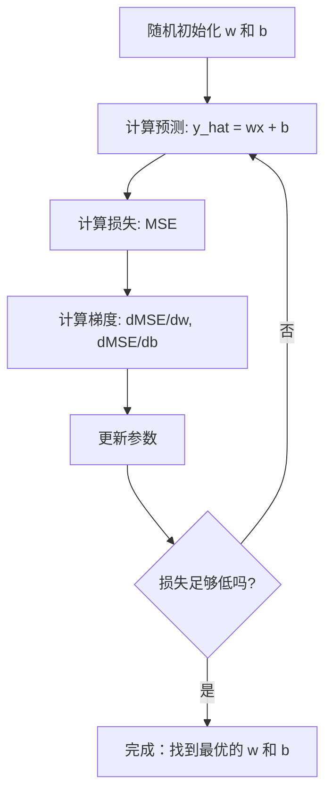

# 线性回归

> 线性回归在你的数据中画出最优的直线。它是机器学习的“Hello World”。

**Type:** 构建
**Languages:** Python
**Prerequisites:** 第1阶段（线性代数、微积分、优化）、第2阶段 第1课
**Time:** ~90 分钟

## 学习目标

- 推导均方误差的梯度下降更新规则，并从头实现线性回归
- 比较梯度下降和正规方程在计算复杂度上的差异以及各自的适用场景
- 构建带有特征标准化的多元线性回归模型并解释学习到的权重
- 解释岭回归（L2 正则化）如何通过惩罚大权重来防止过拟合

## 问题描述

你有数据：房屋面积以及它们的成交价格。你想根据面积预测新房的价格。你可以在散点图上目测，但你需要一个公式。你需要一条最能拟合数据的直线，这样就可以代入任意面积并得到价格预测。

线性回归给出了这条直线。更重要的是，它引入了整个机器学习训练循环：定义模型、定义代价函数、优化参数。每个机器学习算法都遵循相同的模式。在这里掌握最简单的案例，你将在其他地方都能识别出这个模式。

这不仅适用于简单问题。线性回归在生产系统中用于需求预测、A/B 测试分析、金融建模，并且作为所有回归任务的基线方法。

## 概念

### 模型

线性回归假设输入 (x) 与输出 (y) 之间存在线性关系：

```
y = wx + b
```

- `w`（权重/斜率）：当 x 增加 1 时 y 的变化量
- `b`（偏置/截距）：当 x = 0 时 y 的值

对于多个输入（特征），扩展为：

```
y = w1*x1 + w2*x2 + ... + wn*xn + b
```

或向量形式：`y = w^T * x + b`

目标：找到使预测 y 在所有训练样本上尽可能接近真实 y 的 w 和 b 的值。

### 代价函数（均方误差）

如何衡量“尽可能接近”？你需要一个单一的数值来反映预测有多错误。最常用的选择是均方误差（MSE）：

```
MSE = (1/n) * sum((y_predicted - y_actual)^2)
```

为什么要平方？有两个原因。首先，它对大误差的惩罚比对小误差更大（误差为 10 时的惩罚是 100，而不是 10）。其次，平方函数在所有点上光滑且可导，这使得优化变得直接。

代价函数形成了一个曲面。对于单个权重 w 和偏置 b，MSE 曲面看起来像一个碗（一个凸的抛物面）。碗底就是 MSE 最小的位置。训练就是找到那个碗底。

### 梯度下降

梯度下降通过向下走来找到碗底。



梯度告诉你两件事：每个参数应朝哪个方向移动，以及移动多少。

对于 y_hat = wx + b 的 MSE：

```
dMSE/dw = (2/n) * sum((y_hat - y) * x)
dMSE/db = (2/n) * sum(y_hat - y)
```

更新规则：

```
w = w - learning_rate * dMSE/dw
b = b - learning_rate * dMSE/db
```

学习率控制步长。过大：你会越过最小值并发散。过小：训练会非常慢。典型的起始值：0.01、0.001 或 0.0001。

### 正规方程（闭式解）

对于线性回归，有一个直接的公式可以在不迭代的情况下给出最优权重：

```
w = (X^T * X)^(-1) * X^T * y
```

这个方法通过矩阵求逆一步求解 w。它适用于小数据集。对于大数据集（数百万行或数千个特征），更倾向于使用梯度下降，因为矩阵求逆在特征数量上是 O(n^3) 的复杂度。

### 多元线性回归

有多个特征时，模型变为：

```
y = w1*x1 + w2*x2 + ... + wn*xn + b
```

一切仍然相同：MSE 为代价函数，梯度下降同时更新所有权重。唯一的区别是你拟合的是一个超平面而不是一条直线。

特征缩放在这里很重要。如果一个特征范围是 0 到 1，而另一个是 0 到 1,000,000，梯度下降会很困难，因为代价曲面会变得非常拉长。训练前对特征进行标准化（减均值、除以标准差）。

### 多项式回归

如果关系不是线性的怎么办？你仍然可以通过构造多项式特征来使用线性回归：

```
y = w1*x + w2*x^2 + w3*x^3 + b
```

这仍然是“线性”回归，因为模型相对于权重（w1、w2、w3）是线性的。你只是使用了 x 的非线性特征。

高阶多项式能拟合更复杂的曲线，但会有过拟合风险。一个 10 次多项式会通过 10 个点，但在新数据上的预测可能很差。

### R 平方分数

MSE 告诉你有多错，但数值取决于 y 的量级。R 平方（R^2）给出一个与尺度无关的衡量：

```
R^2 = 1 - (sum of squared residuals) / (sum of squared deviations from mean)
    = 1 - SS_res / SS_tot
```

- R^2 = 1.0：完美预测
- R^2 = 0.0：模型不比始终预测均值好
- R^2 < 0.0：模型比始终预测均值还差

### 正则化预览（岭回归）

当你有很多特征时，模型可能通过赋予很大权重来过拟合。岭回归（L2 正则化）加入了惩罚项：

```
Cost = MSE + lambda * sum(w_i^2)
```

惩罚项会抑制权重变大。超参数 lambda 控制权衡：lambda 越大，权重越小，正则化越强。后面课程会详细讲解。现在只需知道它存在以及它的作用。

```figure
linear-regression-fit
```

## 实现

### 步骤 1：生成示例数据

```python
import random
import math

random.seed(42)

TRUE_W = 3.0
TRUE_B = 7.0
N_SAMPLES = 100

X = [random.uniform(0, 10) for _ in range(N_SAMPLES)]
y = [TRUE_W * x + TRUE_B + random.gauss(0, 2.0) for x in X]

print(f"Generated {N_SAMPLES} samples")
print(f"True relationship: y = {TRUE_W}x + {TRUE_B} (+ noise)")
print(f"First 5 points: {[(round(X[i], 2), round(y[i], 2)) for i in range(5)]}")
```

### 步骤 2：用梯度下降从头实现线性回归

```python
class LinearRegression:
    def __init__(self, learning_rate=0.01):
        self.w = 0.0
        self.b = 0.0
        self.lr = learning_rate
        self.cost_history = []

    def predict(self, X):
        return [self.w * x + self.b for x in X]

    def compute_cost(self, X, y):
        predictions = self.predict(X)
        n = len(y)
        cost = sum((pred - actual) ** 2 for pred, actual in zip(predictions, y)) / n
        return cost

    def compute_gradients(self, X, y):
        predictions = self.predict(X)
        n = len(y)
        dw = (2 / n) * sum((pred - actual) * x for pred, actual, x in zip(predictions, y, X))
        db = (2 / n) * sum(pred - actual for pred, actual in zip(predictions, y))
        return dw, db

    def fit(self, X, y, epochs=1000, print_every=200):
        for epoch in range(epochs):
            dw, db = self.compute_gradients(X, y)
            self.w -= self.lr * dw
            self.b -= self.lr * db
            cost = self.compute_cost(X, y)
            self.cost_history.append(cost)
            if epoch % print_every == 0:
                print(f"  Epoch {epoch:4d} | Cost: {cost:.4f} | w: {self.w:.4f} | b: {self.b:.4f}")
        return self

    def r_squared(self, X, y):
        predictions = self.predict(X)
        y_mean = sum(y) / len(y)
        ss_res = sum((actual - pred) ** 2 for actual, pred in zip(y, predictions))
        ss_tot = sum((actual - y_mean) ** 2 for actual in y)
        return 1 - (ss_res / ss_tot)


print("=== Training Linear Regression (Gradient Descent) ===")
model = LinearRegression(learning_rate=0.005)
model.fit(X, y, epochs=1000, print_every=200)
print(f"\nLearned: y = {model.w:.4f}x + {model.b:.4f}")
print(f"True:    y = {TRUE_W}x + {TRUE_B}")
print(f"R-squared: {model.r_squared(X, y):.4f}")
```

### 步骤 3：正规方程（闭式解）

```python
class LinearRegressionNormal:
    def __init__(self):
        self.w = 0.0
        self.b = 0.0

    def fit(self, X, y):
        n = len(X)
        x_mean = sum(X) / n
        y_mean = sum(y) / n
        numerator = sum((X[i] - x_mean) * (y[i] - y_mean) for i in range(n))
        denominator = sum((X[i] - x_mean) ** 2 for i in range(n))
        self.w = numerator / denominator
        self.b = y_mean - self.w * x_mean
        return self

    def predict(self, X):
        return [self.w * x + self.b for x in X]

    def r_squared(self, X, y):
        predictions = self.predict(X)
        y_mean = sum(y) / len(y)
        ss_res = sum((actual - pred) ** 2 for actual, pred in zip(y, predictions))
        ss_tot = sum((actual - y_mean) ** 2 for actual in y)
        return 1 - (ss_res / ss_tot)


print("\n=== Normal Equation (Closed-Form) ===")
model_normal = LinearRegressionNormal()
model_normal.fit(X, y)
print(f"Learned: y = {model_normal.w:.4f}x + {model_normal.b:.4f}")
print(f"R-squared: {model_normal.r_squared(X, y):.4f}")
```

### 步骤 4：多元线性回归

```python
class MultipleLinearRegression:
    def __init__(self, n_features, learning_rate=0.01):
        self.weights = [0.0] * n_features
        self.bias = 0.0
        self.lr = learning_rate
        self.cost_history = []

    def predict_single(self, x):
        return sum(w * xi for w, xi in zip(self.weights, x)) + self.bias

    def predict(self, X):
        return [self.predict_single(x) for x in X]

    def compute_cost(self, X, y):
        predictions = self.predict(X)
        n = len(y)
        return sum((pred - actual) ** 2 for pred, actual in zip(predictions, y)) / n

    def fit(self, X, y, epochs=1000, print_every=200):
        n = len(y)
        n_features = len(X[0])
        for epoch in range(epochs):
            predictions = self.predict(X)
            errors = [pred - actual for pred, actual in zip(predictions, y)]
            for j in range(n_features):
                grad = (2 / n) * sum(errors[i] * X[i][j] for i in range(n))
                self.weights[j] -= self.lr * grad
            grad_b = (2 / n) * sum(errors)
            self.bias -= self.lr * grad_b
            cost = self.compute_cost(X, y)
            self.cost_history.append(cost)
            if epoch % print_every == 0:
                print(f"  Epoch {epoch:4d} | Cost: {cost:.4f}")
        return self

    def r_squared(self, X, y):
        predictions = self.predict(X)
        y_mean = sum(y) / len(y)
        ss_res = sum((actual - pred) ** 2 for actual, pred in zip(y, predictions))
        ss_tot = sum((actual - y_mean) ** 2 for actual in y)
        return 1 - (ss_res / ss_tot)


random.seed(42)
N = 100
X_multi = []
y_multi = []
for _ in range(N):
    size = random.uniform(500, 3000)
    bedrooms = random.randint(1, 5)
    age = random.uniform(0, 50)
    price = 50 * size + 10000 * bedrooms - 1000 * age + 50000 + random.gauss(0, 20000)
    X_multi.append([size, bedrooms, age])
    y_multi.append(price)


def standardize(X):
    n_features = len(X[0])
    means = [sum(X[i][j] for i in range(len(X))) / len(X) for j in range(n_features)]
    stds = []
    for j in range(n_features):
        variance = sum((X[i][j] - means[j]) ** 2 for i in range(len(X))) / len(X)
        stds.append(variance ** 0.5)
    X_scaled = []
    for i in range(len(X)):
        row = [(X[i][j] - means[j]) / stds[j] if stds[j] > 0 else 0 for j in range(n_features)]
        X_scaled.append(row)
    return X_scaled, means, stds


y_mean_val = sum(y_multi) / len(y_multi)
y_std_val = (sum((yi - y_mean_val) ** 2 for yi in y_multi) / len(y_multi)) ** 0.5
y_scaled = [(yi - y_mean_val) / y_std_val for yi in y_multi]

X_scaled, x_means, x_stds = standardize(X_multi)

print("\n=== Multiple Linear Regression (3 features) ===")
print("Features: house size, bedrooms, age")
multi_model = MultipleLinearRegression(n_features=3, learning_rate=0.01)
multi_model.fit(X_scaled, y_scaled, epochs=1000, print_every=200)

print(f"\nWeights (standardized): {[round(w, 4) for w in multi_model.weights]}")
print(f"Bias (standardized): {multi_model.bias:.4f}")
print(f"R-squared: {multi_model.r_squared(X_scaled, y_scaled):.4f}")
```

### 步骤 5：多项式回归

```python
class PolynomialRegression:
    def __init__(self, degree, learning_rate=0.01):
        self.degree = degree
        self.weights = [0.0] * degree
        self.bias = 0.0
        self.lr = learning_rate

    def make_features(self, X):
        return [[x ** (d + 1) for d in range(self.degree)] for x in X]

    def predict(self, X):
        features = self.make_features(X)
        return [sum(w * f for w, f in zip(self.weights, row)) + self.bias for row in features]

    def fit(self, X, y, epochs=1000, print_every=200):
        features = self.make_features(X)
        n = len(y)
        for epoch in range(epochs):
            predictions = [sum(w * f for w, f in zip(self.weights, row)) + self.bias for row in features]
            errors = [pred - actual for pred, actual in zip(predictions, y)]
            for j in range(self.degree):
                grad = (2 / n) * sum(errors[i] * features[i][j] for i in range(n))
                self.weights[j] -= self.lr * grad
            grad_b = (2 / n) * sum(errors)
            self.bias -= self.lr * grad_b
            if epoch % print_every == 0:
                cost = sum(e ** 2 for e in errors) / n
                print(f"  Epoch {epoch:4d} | Cost: {cost:.6f}")
        return self

    def r_squared(self, X, y):
        predictions = self.predict(X)
        y_mean = sum(y) / len(y)
        ss_res = sum((actual - pred) ** 2 for actual, pred in zip(y, predictions))
        ss_tot = sum((actual - y_mean) ** 2 for actual in y)
        return 1 - (ss_res / ss_tot)


random.seed(42)
X_poly = [x / 10.0 for x in range(0, 50)]
y_poly = [0.5 * x ** 2 - 2 * x + 3 + random.gauss(0, 1.0) for x in X_poly]

x_max = max(abs(x) for x in X_poly)
X_poly_norm = [x / x_max for x in X_poly]
y_poly_mean = sum(y_poly) / len(y_poly)
y_poly_std = (sum((yi - y_poly_mean) ** 2 for yi in y_poly) / len(y_poly)) ** 0.5
y_poly_norm = [(yi - y_poly_mean) / y_poly_std for yi in y_poly]

print("\n=== Polynomial Regression (degree 2 vs degree 5) ===")
print("True relationship: y = 0.5x^2 - 2x + 3")

print("\nDegree 2:")
poly2 = PolynomialRegression(degree=2, learning_rate=0.1)
poly2.fit(X_poly_norm, y_poly_norm, epochs=2000, print_every=500)
print(f"  R-squared: {poly2.r_squared(X_poly_norm, y_poly_norm):.4f}")

print("\nDegree 5:")
poly5 = PolynomialRegression(degree=5, learning_rate=0.1)
poly5.fit(X_poly_norm, y_poly_norm, epochs=2000, print_every=500)
print(f"  R-squared: {poly5.r_squared(X_poly_norm, y_poly_norm):.4f}")

print("\nDegree 2 fits the true curve well. Degree 5 fits training data slightly better")
print("but risks overfitting on new data.")
```

### 步骤 6：岭回归（L2 正则化）

```python
class RidgeRegression:
    def __init__(self, n_features, learning_rate=0.01, alpha=1.0):
        self.weights = [0.0] * n_features
        self.bias = 0.0
        self.lr = learning_rate
        self.alpha = alpha

    def predict_single(self, x):
        return sum(w * xi for w, xi in zip(self.weights, x)) + self.bias

    def predict(self, X):
        return [self.predict_single(x) for x in X]

    def fit(self, X, y, epochs=1000, print_every=200):
        n = len(y)
        n_features = len(X[0])
        for epoch in range(epochs):
            predictions = self.predict(X)
            errors = [pred - actual for pred, actual in zip(predictions, y)]
            mse = sum(e ** 2 for e in errors) / n
            reg_term = self.alpha * sum(w ** 2 for w in self.weights)
            cost = mse + reg_term
            for j in range(n_features):
                grad = (2 / n) * sum(errors[i] * X[i][j] for i in range(n))
                grad += 2 * self.alpha * self.weights[j]
                self.weights[j] -= self.lr * grad
            grad_b = (2 / n) * sum(errors)
            self.bias -= self.lr * grad_b
            if epoch % print_every == 0:
                print(f"  Epoch {epoch:4d} | Cost: {cost:.4f} | L2 penalty: {reg_term:.4f}")
        return self


print("\n=== Ridge Regression (L2 Regularization) ===")
print("Same data as multiple regression, with alpha=0.1")
ridge = RidgeRegression(n_features=3, learning_rate=0.01, alpha=0.1)
ridge.fit(X_scaled, y_scaled, epochs=1000, print_every=200)
print(f"\nRidge weights: {[round(w, 4) for w in ridge.weights]}")
print(f"Plain weights: {[round(w, 4) for w in multi_model.weights]}")
print("Ridge weights are smaller (shrunk toward zero) due to the L2 penalty.")
```

## 使用

现在用 scikit-learn 做同样的事情，这也是你在生产中实际会使用的工具。

```python
from sklearn.linear_model import LinearRegression as SklearnLR
from sklearn.linear_model import Ridge
from sklearn.preprocessing import PolynomialFeatures, StandardScaler
from sklearn.model_selection import train_test_split
from sklearn.metrics import mean_squared_error, r2_score
import numpy as np

np.random.seed(42)
X_sk = np.random.uniform(0, 10, (100, 1))
y_sk = 3.0 * X_sk.squeeze() + 7.0 + np.random.normal(0, 2.0, 100)

X_train, X_test, y_train, y_test = train_test_split(X_sk, y_sk, test_size=0.2, random_state=42)

lr = SklearnLR()
lr.fit(X_train, y_train)
y_pred = lr.predict(X_test)

print("=== Scikit-learn Linear Regression ===")
print(f"Coefficient (w): {lr.coef_[0]:.4f}")
print(f"Intercept (b): {lr.intercept_:.4f}")
print(f"R-squared (test): {r2_score(y_test, y_pred):.4f}")
print(f"MSE (test): {mean_squared_error(y_test, y_pred):.4f}")

poly = PolynomialFeatures(degree=2, include_bias=False)
X_poly_sk = poly.fit_transform(X_train)
X_poly_test = poly.transform(X_test)

lr_poly = SklearnLR()
lr_poly.fit(X_poly_sk, y_train)
print(f"\nPolynomial degree 2 R-squared: {r2_score(y_test, lr_poly.predict(X_poly_test)):.4f}")

scaler = StandardScaler()
X_train_scaled = scaler.fit_transform(X_train)
X_test_scaled = scaler.transform(X_test)

ridge = Ridge(alpha=1.0)
ridge.fit(X_train_scaled, y_train)
print(f"Ridge R-squared: {r2_score(y_test, ridge.predict(X_test_scaled)):.4f}")
print(f"Ridge coefficient: {ridge.coef_[0]:.4f}")
```

你从头实现的版本和 scikit-learn 的结果是一致的。区别在于：scikit-learn 处理了边界情况、数值稳定性和性能优化。在生产中使用库；从头实现用于理解内部发生了什么。

## 发布

本课产生：
- `outputs/skill-regression.md` - 一个用于根据问题选择合适回归方法的技能文档

## 练习

1. 实现批量梯度下降、随机梯度下降（SGD）和小批量梯度下降。比较在相同数据集上的收敛速度。哪种收敛最快？哪种的代价曲线最平滑？
2. 从三次函数生成数据（y = ax^3 + bx^2 + cx + d + 噪声）。拟合 1、3、10 次多项式。比较训练集和测试集的 R^2。在哪个次数上过拟合变得明显？
3. 实现 Lasso 回归（L1 正则化：惩罚项 = alpha * sum(|w_i|)）。在多特征房价数据上训练。比较哪些权重被压缩为零与岭回归的差异。为什么 L1 会产生稀疏解而 L2 不会？

## 关键词

| 术语 | 大家怎么说 | 实际含义 |
|------|----------------|----------------------|
| Linear regression | "Draw a line through data" | 寻找权重 w 和偏置 b，使得 wx + b 与真实 y 值之间的平方差之和最小 |
| Cost function | "How bad the model is" | 一个将模型参数映射到衡量预测误差的单一数值的函数，优化过程要最小化它 |
| Mean squared error | "Average of squared errors" | (1/n) * (predicted - actual)^2 的和，对较大误差给予更大的惩罚 |
| Gradient descent | "Walk downhill" | 迭代地按能减小代价函数的方向调整参数，使用偏导数 |
| Learning rate | "Step size" | 控制每次梯度下降步骤参数变化量的标量 |
| Normal equation | "Solve it directly" | 闭式解 w = (X^T X)^-1 X^T y，可在不迭代的情况下给出最优权重 |
| R-squared | "How good the fit is" | 模型解释的 y 的方差比例，范围从负无穷到 1.0 |
| Feature scaling | "Make features comparable" | 将特征变换到相似范围（例如零均值、单位方差），以便梯度下降更快收敛 |
| Regularization | "Penalize complexity" | 在代价函数中加入一项以缩小权重，防止过拟合 |
| Ridge regression | "L2 regularization" | 在线性回归的 MSE 上加入 lambda * sum(w_i^2) 的惩罚项（岭回归） |
| Polynomial regression | "Fitting curves with linear math" | 在多项式特征（x, x^2, x^3, ...）上进行线性回归，模型相对于权重仍是线性的 |
| Overfitting | "Memorizing training data" | 模型过于复杂以至于拟合了训练数据中的噪声，在新数据上表现差 |

## 拓展阅读

- [An Introduction to Statistical Learning (ISLR)](https://www.statlearning.com/) -- 免费 PDF，第 3 章和第 6 章涵盖线性回归和正则化，并包含 R 语言的实用示例
- [The Elements of Statistical Learning (ESL)](https://hastie.su.domains/ElemStatLearn/) -- 免费 PDF，是 ISLR 的更数学化伴随读物，深入讨论了岭回归和套索回归（Lasso）
- [Stanford CS229 Lecture Notes on Linear Regression](https://cs229.stanford.edu/main_notes.pdf) -- Andrew Ng 的讲义，从第一性原理推导正规方程和梯度下降
- [scikit-learn LinearRegression documentation](https://scikit-learn.org/stable/modules/linear_model.html) -- LinearRegression、Ridge、Lasso 和 ElasticNet 的实用参考与代码示例