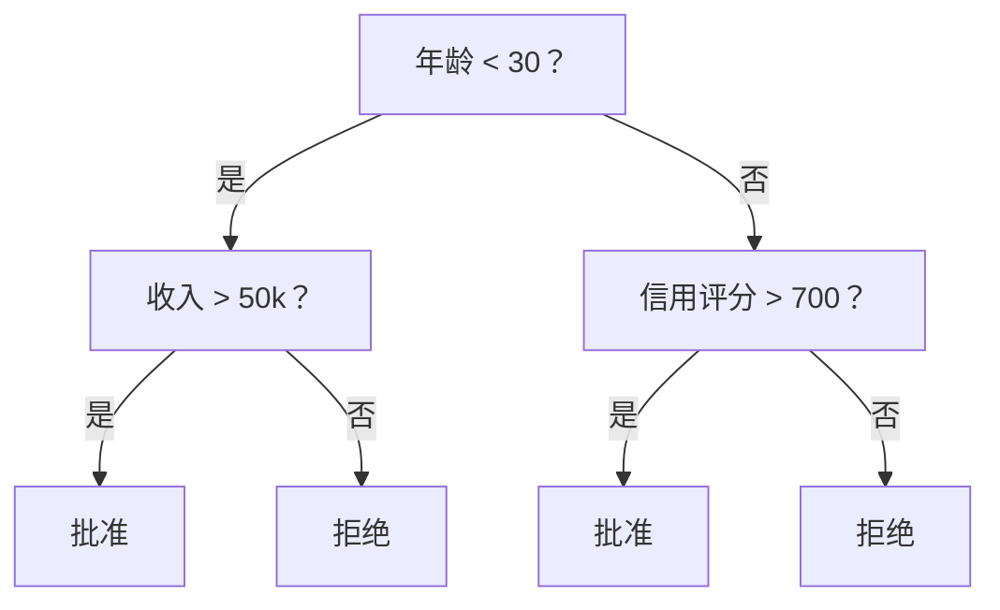
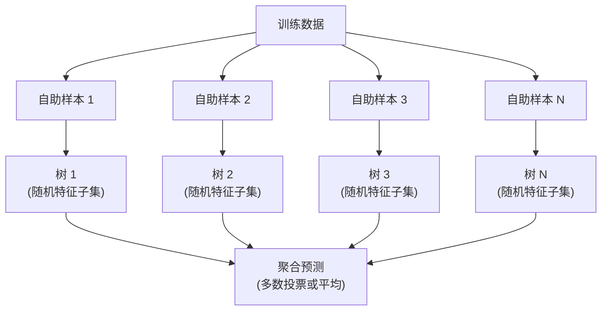

# 决策树与随机森林

> 决策树只是一个流程图。但成片的树（森林）是机器学习中最强大的工具之一。

**Type:** 构建  
**Language:** Python  
**Prerequisites:** Phase 1（课程 09 信息论，06 概率）  
**Time:** ~90 分钟

## 学习目标

- 实现基尼不纯度（Gini）、熵（Entropy）和信息增益的计算，以寻找最优决策树划分  
- 从头构建一个具有预剪枝控制（最大深度、最小样本数）的决策树分类器  
- 使用自助采样（bootstrap）和特征随机化构建随机森林，并解释其为何能降低方差  
- 比较 MDI 特征重要性与置换重要性，并识别 MDI 在何种情况下存在偏差

## 问题背景

你有表格数据。行是样本，列是特征，还有一个你想预测的目标列。你当然可以用神经网络去处理。但对于表格数据，基于树的模型（决策树、随机森林、梯度提升树）通常比深度学习更有优势。在结构化数据的 Kaggle 竞赛中，主导地位属于 XGBoost 和 LightGBM，而不是 transformer。

为什么？树可以原生处理混合特征类型（数值与类别），无需复杂预处理。它们可以在无需手工构造特征的情况下处理非线性关系。它们可解释：你可以查看树并准确知道某次预测的原因。随机森林通过对多棵树求平均，对中等规模数据集具有很强的抗过拟合能力。

本课将从头实现基于递归划分的决策树，然后在其基础上构建随机森林。你将实现划分准则的数学（基尼不纯度、熵、信息增益），并理解为什么由许多弱学习器组成的集成能成为强学习器。

## 概念

### 决策树做什么

决策树通过一系列是/否问题，将特征空间划分为矩形区域。



每个内部节点对某个特征与阈值进行测试。每个叶子节点给出预测。对一个新样本进行分类时，从根结点开始，沿着分支走到叶子节点即可。

树是自顶向下构建的：在每个节点选择能最好分离数据的特征和阈值。“最好”由划分准则定义。

### 划分准则：测量不纯度

在每个节点，我们有一组样本。我们希望将它们划分，使得子节点尽可能“纯”，即每个子节点主要包含同一类别的样本。

**基尼不纯度（Gini impurity）**衡量如果按照该节点的类别分布随机标记样本，被错误分类的概率。

```
Gini(S) = 1 - sum(p_k^2)

其中 p_k 是集合 S 中类别 k 的比例。
```

对于纯节点（全部为同一类别），Gini = 0。对于二分类且 50/50 的情况，Gini = 0.5。越低越好。

```
例子：6 只猫，4 只狗

Gini = 1 - (0.6^2 + 0.4^2) = 1 - (0.36 + 0.16) = 0.48
```

**熵（Entropy）**衡量节点的信息含量（混乱度）。在 Phase 1 第 09 课中有详细介绍。

```
Entropy(S) = -sum(p_k * log2(p_k))
```

对于纯节点，熵 = 0。对于二分类且 50/50 的情况，熵 = 1.0。越低越好。

```
例子：6 只猫，4 只狗

Entropy = -(0.6 * log2(0.6) + 0.4 * log2(0.4))
        = -(0.6 * -0.737 + 0.4 * -1.322)
        = 0.442 + 0.529
        = 0.971 bits
```

**信息增益（Information gain）**是划分前后不纯度（熵或基尼）减少量。

```
IG(S, feature, threshold) = Impurity(S) - weighted_avg(Impurity(S_left), Impurity(S_right))

其中权重是各子集的样本比例。
```

在每个节点上使用贪心算法：尝试每个特征和每个可能的阈值，选择使信息增益最大的（特征，阈值）对。

### 划分如何工作

对于当前节点有 n 个特征和 m 个样本的数据集：

1. 对于每个特征 j（j = 1 到 n）：
   - 按特征 j 对样本排序
   - 尝试每对不同相邻值的中点作为阈值
   - 计算每个阈值的信息增益
2. 选择信息增益最大的特征和阈值
3. 将数据分为左子集（feature <= threshold）和右子集（feature > threshold）
4. 对每个子节点递归执行

这种贪心方法不能保证得到全局最优树。寻找最优树是 NP-hard。但是贪心划分在实践中效果很好。

### 停止条件

如果没有停止条件，树会长到每个叶子都很纯（每叶一个样本）。这会完全记忆训练数据，泛化性很差。

**预剪枝（Pre-pruning）**在树完全生长之前停止：
- 最大深度：当树达到设定深度时停止划分
- 叶节点最小样本数：当节点样本数少于 k 时停止
- 最小信息增益：当最佳划分带来的不纯度改善小于阈值时停止
- 最大叶子节点数：限制叶子总数

**后剪枝（Post-pruning）**先生长整棵树，再进行修剪：
- 代价-复杂度剪枝（scikit-learn 使用的方法）：加入与叶子数成比例的惩罚项。增加惩罚会得到更小的树
- 减少误差剪枝：如果移除某子树不增加验证误差，则移除它

预剪枝更简单也更快。后剪枝通常能得到更好的树，因为它不会过早停止那些可能带来有用进一步划分的分支。

### 回归的决策树

对于回归，叶子的预测值是该叶子目标值的均值。划分准则也不同：

**方差减少（Variance reduction）**替代信息增益：

```
VR(S, feature, threshold) = Var(S) - weighted_avg(Var(S_left), Var(S_right))
```

选择能最大减少方差的划分。树将输入空间划分为若干区域，每个区域预测一个常数（均值）。

### 随机森林：集成的威力

单棵决策树方差很高。数据的微小变动可能导致完全不同的树。随机森林通过对多棵树取平均来解决这个问题。



两种随机性来源使树变得多样化：

**Bagging（bootstrap aggregating，自助聚合）：** 每棵树在一个自助样本上训练，即从训练数据中有放回随机抽样。大约 63% 的原始样本会出现在每个自助样本中（其余为袋外样本，可用于验证）。

**特征随机化（Feature randomization）：** 在每次划分时只考虑一个随机特征子集。对于分类问题，默认是 sqrt(n_features)。对于回归，是 n_features/3。这可以防止所有树都在相同的主导特征上划分。

关键洞见：对许多去相关的树取平均可以在不增加偏差的情况下减少方差。单个树可能很一般，集合却很强。

### 特征重要性

随机森林自然提供特征重要性评分。最常见的方法：

**平均不纯度下降（Mean Decrease in Impurity，MDI）：** 对于每个特征，累加该特征在所有树、所有使用该特征的节点上带来的不纯度减少。那些在较早划分就带来更大不纯度减少的特征被认为更重要。

```
importance(feature_j) = sum over all nodes where feature_j is used:
    (n_samples_at_node / n_total_samples) * impurity_decrease
```

这种方法速度快（在训练期间计算）但会偏向高基数特征和具有许多可能划分点的特征。

**置换重要性（Permutation importance）**是替代方法：打乱某一特征的值，测量模型准确率下降多少。更可靠但更慢。

### 什么时候树胜过神经网络

在表格数据上，树和森林常常优于神经网络。原因有几项：

| 因素 | 树 | 神经网络 |
|------|----|----------|
| 混合类型（数值 + 类别） | 原生支持 | 需要编码 |
| 小数据集（< 10k 行） | 表现良好 | 易过拟合 |
| 特征交互 | 通过划分自动发现 | 需要架构设计 |
| 可解释性 | 完全透明 | 黑盒 |
| 训练时间 | 分钟级别 | 小时级别 |
| 超参数敏感性 | 低 | 高 |

当数据具有空间或序列结构（图像、文本、音频）时，神经网络占优。但对于扁平特征表，树是默认选择。

```figure
decision-tree-depth
```

## 动手实现

### 步骤 1：基尼不纯度与熵

从头实现两种划分准则，并验证它们在判断好划分上是否一致。

```python
import math

def gini_impurity(labels):
    n = len(labels)
    if n == 0:
        return 0.0
    counts = {}
    for label in labels:
        counts[label] = counts.get(label, 0) + 1
    return 1.0 - sum((c / n) ** 2 for c in counts.values())

def entropy(labels):
    n = len(labels)
    if n == 0:
        return 0.0
    counts = {}
    for label in labels:
        counts[label] = counts.get(label, 0) + 1
    return -sum(
        (c / n) * math.log2(c / n) for c in counts.values() if c > 0
    )
```

### 步骤 2：寻找最优划分

尝试每个特征和每个阈值。返回信息增益最大的划分。

```python
def information_gain(parent_labels, left_labels, right_labels, criterion="gini"):
    measure = gini_impurity if criterion == "gini" else entropy
    n = len(parent_labels)
    n_left = len(left_labels)
    n_right = len(right_labels)
    if n_left == 0 or n_right == 0:
        return 0.0
    parent_impurity = measure(parent_labels)
    child_impurity = (
        (n_left / n) * measure(left_labels) +
        (n_right / n) * measure(right_labels)
    )
    return parent_impurity - child_impurity
```

### 步骤 3：构建 DecisionTree 类

实现递归划分、预测和特征重要性跟踪。

```python
class DecisionTree:
    def __init__(self, max_depth=None, min_samples_split=2,
                 min_samples_leaf=1, criterion="gini",
                 max_features=None):
        self.max_depth = max_depth
        self.min_samples_split = min_samples_split
        self.min_samples_leaf = min_samples_leaf
        self.criterion = criterion
        self.max_features = max_features
        self.tree = None
        self.feature_importances_ = None

    def fit(self, X, y):
        self.n_features = len(X[0])
        self.feature_importances_ = [0.0] * self.n_features
        self.n_samples = len(X)
        self.tree = self._build(X, y, depth=0)
        total = sum(self.feature_importances_)
        if total > 0:
            self.feature_importances_ = [
                fi / total for fi in self.feature_importances_
            ]

    def predict(self, X):
        return [self._predict_one(x, self.tree) for x in X]
```

### 步骤 4：构建 RandomForest 类

实现自助采样、特征随机化与多数投票。

```python
class RandomForest:
    def __init__(self, n_trees=100, max_depth=None,
                 min_samples_split=2, max_features="sqrt",
                 criterion="gini"):
        self.n_trees = n_trees
        self.max_depth = max_depth
        self.min_samples_split = min_samples_split
        self.max_features = max_features
        self.criterion = criterion
        self.trees = []

    def fit(self, X, y):
        n = len(X)
        for _ in range(self.n_trees):
            indices = [random.randint(0, n - 1) for _ in range(n)]
            X_boot = [X[i] for i in indices]
            y_boot = [y[i] for i in indices]
            tree = DecisionTree(
                max_depth=self.max_depth,
                min_samples_split=self.min_samples_split,
                max_features=self.max_features,
                criterion=self.criterion,
            )
            tree.fit(X_boot, y_boot)
            self.trees.append(tree)

    def predict(self, X):
        all_preds = [tree.predict(X) for tree in self.trees]
        predictions = []
        for i in range(len(X)):
            votes = {}
            for preds in all_preds:
                v = preds[i]
                votes[v] = votes.get(v, 0) + 1
            predictions.append(max(votes, key=votes.get))
        return predictions
```

完整实现和所有辅助方法见 `code/trees.py`。

## 使用方法

使用 scikit-learn，训练一个随机森林只需三行：

```python
from sklearn.ensemble import RandomForestClassifier
from sklearn.datasets import load_iris
from sklearn.model_selection import train_test_split

X, y = load_iris(return_X_y=True)
X_train, X_test, y_train, y_test = train_test_split(X, y, random_state=42)

rf = RandomForestClassifier(n_estimators=100, random_state=42)
rf.fit(X_train, y_train)
print(f"Accuracy: {rf.score(X_test, y_test):.4f}")
print(f"Feature importances: {rf.feature_importances_}")
```

在实际应用中，梯度提升树（XGBoost、LightGBM、CatBoost）通常比随机森林更强，因为它们按序列构建树，每棵树都修正前一棵树的错误。但随机森林更不容易被误配置，并且几乎不需要调参。

## 交付成果

本课产出 `outputs/prompt-tree-interpreter.md` —— 一个用于向业务相关人员解释决策树划分的提示（prompt）。向其提供训练好树的结构（深度、特征、划分阈值、准确率），它会把模型翻译成通俗规则，排名特征重要性，标记过拟合或数据泄露，并给出后续建议。在你需要向不看代码的人解释树模型时使用它。

## 练习

1. 在一个二维、三个类别的数据集上训练一棵单树。手动追踪划分并绘制矩形决策边界。比较 max_depth=2 与 max_depth=10 时的边界差异。

2. 为回归树实现方差减少划分。生成 y = sin(x) + 噪声（200 个点），拟合你的回归树。将树的分段常数预测与真实曲线绘制在一张图上。

3. 构建一个包含 1、5、10、50、200 棵树的随机森林。绘制训练准确率与测试准确率随树数变化的曲线。观察测试准确率会趋于平稳但不会下降（森林对过拟合有抗性）。

4. 在 5 个不同数据集上比较基尼不纯度与熵作为划分准则的效果。测量准确率和树深度。在大多数情况下，它们会产生几乎相同的结果。解释原因。

5. 实现置换重要性。对一个某特征为随机噪声但具有高基数的数据集，比较置换重要性与 MDI 重要性。MDI 会把噪声特征排在较高位置，而置换重要性不会。

## 关键术语

| 术语 | 常见说法 | 实际含义 |
|------|---------|---------|
| 决策树 | "用于预测的流程图" | 通过学习一系列 if/else 划分，将特征空间划分为矩形区域的模型 |
| 基尼不纯度 (Gini impurity) | "节点有多混合" | 在节点上随机抽取样本按节点类别分布标注时被误分类的概率。0 = 纯，二分类时 0.5 = 最不纯 |
| 熵 (Entropy) | "节点的混乱度" | 节点的信息含量。0 = 纯，二分类时 1.0 = 最大不确定性。来自信息论 |
| 信息增益 | "划分有多好" | 划分后不纯度的减少。用于贪心选择划分 |
| 预剪枝 (Pre-pruning) | "提前停止树生长" | 通过设置最大深度、最小样本数或最小增益阈值来提前终止生长 |
| 后剪枝 (Post-pruning) | "先长再修剪" | 先完全生长树，然后移除在验证集上不起作用的子树 |
| Bagging | "在随机子集上训练" | 装袋法（bootstrap aggregating）。在不同的有放回随机样本上训练每个模型 |
| 随机森林 (Random forest) | "一堆树" | 决策树的集成，每棵树在自助样本上训练，并在每次划分时随机选择特征子集 |
| 特征重要性 (MDI) | "哪些特征重要" | 每个特征在所有树与节点上贡献的不纯度减少总和 |
| 置换重要性 (Permutation importance) | "打乱然后看效果" | 随机打乱某特征的值，测量模型性能下降量。对于含噪特征比 MDI 更可靠 |
| 方差减少 (Variance reduction) | "回归版的信息增益" | 回归树中用于选择划分的准则。选择能最大减少目标方差的划分 |
| 自助样本 (Bootstrap sample) | "有重复的随机样本" | 从原始数据中有放回抽样得到的随机样本。样本数量与原始相同，但包含重复项 |

## 延伸阅读

- [Breiman: Random Forests (2001)](https://link.springer.com/article/10.1023/A:1010933404324) - 随机森林的原始论文  
- [Grinsztajn et al.: Why do tree-based models still outperform deep learning on tabular data? (2022)](https://arxiv.org/abs/2207.08815) - 关于为什么基于树的模型在表格任务上仍优于深度学习的严格比较  
- [scikit-learn Decision Trees documentation](https://scikit-learn.org/stable/modules/tree.html) - 带可视化工具的实用指南  
- [XGBoost: A Scalable Tree Boosting System (Chen & Guestrin, 2016)](https://arxiv.org/abs/1603.02754) - 在 Kaggle 上占主导地位的梯度提升树论文