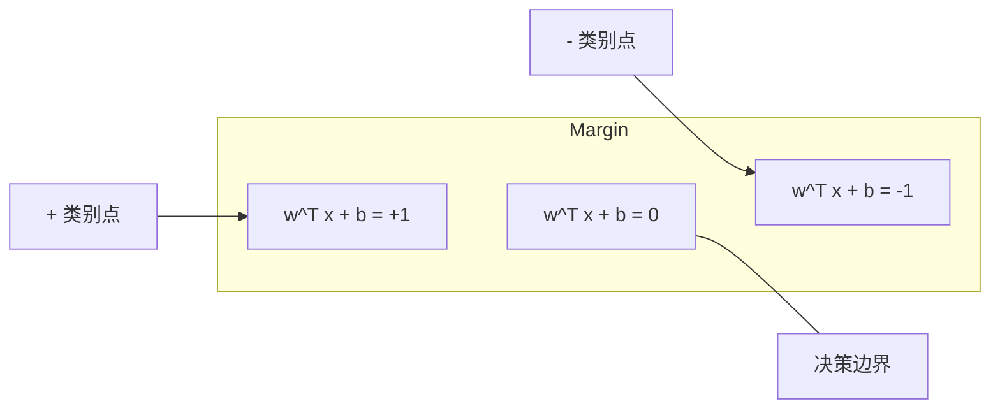
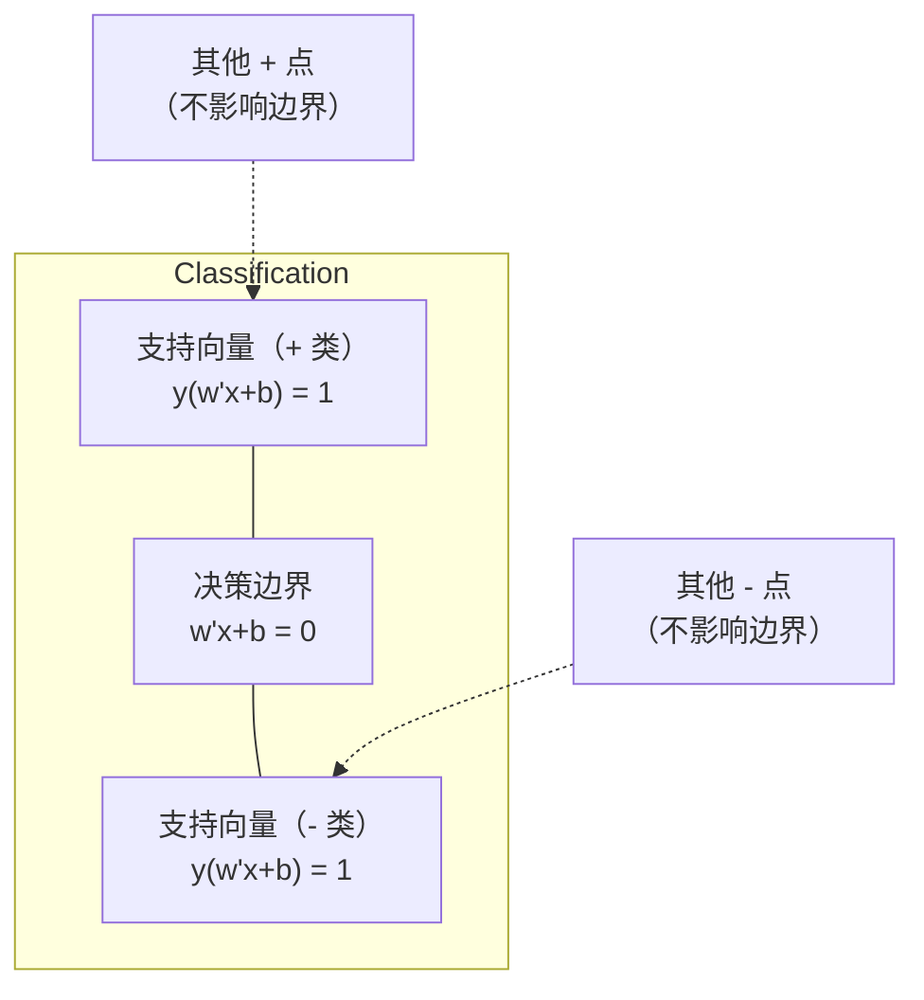
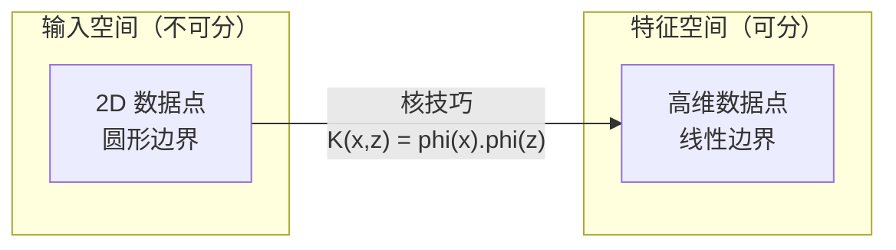

# Support Vector Machines

> 找出将两类分开的最宽街道。这就是整个思想。

**Type:** 构建  
**Language:** Python  
**Prerequisites:** Phase 1 (Lessons 08 Optimization, 14 Norms and Distances, 18 Convex Optimization)  
**Time:** ~90 分钟

## 学习目标

- 从零实现一个线性 SVM，使用铰链损失和在原始形式上的梯度下降
- 解释最大间隔原理并在训练好的模型中识别支持向量
- 比较线性、多项式和 RBF 核，解释核技巧如何避免显式的高维映射
- 评估参数 C 控制的间隔宽度与分类错误之间的权衡

## 问题描述

你有两类数据点，需要画一条线（或超平面）将它们分开。可能有无数条线可以做到。你该选择哪一条？

选择间隔最大的那一条。间隔是决策边界到两侧最近数据点的距离。更宽的间隔意味着分类器更有信心，对未见数据的泛化能力更好。

这个直觉催生了支持向量机（SVM），它是机器学习中数学上最优雅的算法之一。在深度学习普及之前，SVM 是主导的分类方法，对于小数据集、高维数据以及需要有理论保证的场景仍然是最佳选择。

SVM 与 Phase 1 紧密相关：优化是凸的（Lesson 18），间隔用范数衡量（Lesson 14），核技巧利用点积来处理非线性边界而无需在高维空间中显式计算。

## 概念

### 最大间隔分类器

给定线性可分的数据，标签 y_i 属于 {-1, +1}，特征向量为 x_i，我们想找到一个超平面 w^T x + b = 0 将类别分开。

点 x_i 到超平面的距离为：

```
distance = |w^T x_i + b| / ||w||
```

对于正确分类的点：y_i * (w^T x_i + b) > 0。间隔是从超平面到两侧最近点的距离的两倍。



优化问题：

```
maximize    2 / ||w||     (间隔宽度)
subject to  y_i * (w^T x_i + b) >= 1  for all i
```

等价地（最小化 ||w||^2 更易优化）：

```
minimize    (1/2) ||w||^2
subject to  y_i * (w^T x_i + b) >= 1  for all i
```

这是一个凸的二次规划问题，具有唯一的全局解。恰好落在间隔边界上的数据点（满足 y_i * (w^T x_i + b) = 1）就是支持向量。它们是唯一决定决策边界的点。移动或删除任何非支持向量点，边界不会改变。

### 支持向量：关键的少数



大多数训练点是无关的。只有支持向量才重要。这就是为什么 SVM 在预测时内存效率高：你只需要存储支持向量，而不是整个训练集。

支持向量的数量也能给出泛化误差的界。相对于数据集规模，支持向量越少通常意味着泛化越好。

### 软间隔：用 C 参数处理噪声

真实数据很少是完全可分的。有些点可能在错误的一侧，或落在间隔内。软间隔通过引入松弛变量允许违规。

```
minimize    (1/2) ||w||^2 + C * sum(xi_i)
subject to  y_i * (w^T x_i + b) >= 1 - xi_i
            xi_i >= 0  for all i
```

松弛变量 xi_i 衡量点 i 违反间隔的程度。C 控制权衡：

| C value | 行为 |
|---------|------|
| Large C | 重罚违规。间隔窄，误分类少。容易过拟合 |
| Small C | 允许更多违规。间隔宽，误分类多。容易欠拟合 |

C 是正则化强度的倒数。大 C = 更少正则化。小 C = 更强正则化。

### 铰链损失：SVM 的损失函数

软间隔 SVM 可以重写为无约束优化：

```
minimize    (1/2) ||w||^2 + C * sum(max(0, 1 - y_i * (w^T x_i + b)))
```

项 max(0, 1 - y_i * f(x_i)) 即为铰链损失。当点被正确分类且位于间隔之外时，该损失为零。若点落在间隔内或被误分类，损失为线性增长。

```
单点的铰链损失：

loss
  |
  | \
  |  \
  |   \
  |    \
  |     \_______________
  |
  +-----|-----|-------->  y * f(x)
       0     1

当 y*f(x) >= 1 时损失为零（正确分类且在间隔之外）。
当 y*f(x) < 1 时有线性惩罚。
```

与逻辑损失（逻辑回归）比较：

```
Hinge:     max(0, 1 - y*f(x))          在间隔处有硬截断
Logistic:  log(1 + exp(-y*f(x)))        平滑，永远不为零
```

铰链损失产生稀疏解（只有支持向量有非零贡献）。逻辑损失使用所有数据点。这使得 SVM 在预测时更节省内存。

### 使用梯度下降训练线性 SVM

你可以对铰链损失加上 L2 正则化使用梯度下降训练线性 SVM，而无需求解受约束的 QP：

```
L(w, b) = (lambda/2) * ||w||^2 + (1/n) * sum(max(0, 1 - y_i * (w^T x_i + b)))

关于 w 的梯度：
  如果 y_i * (w^T x_i + b) >= 1:  dL/dw = lambda * w
  如果 y_i * (w^T x_i + b) < 1:   dL/dw = lambda * w - y_i * x_i

关于 b 的梯度：
  如果 y_i * (w^T x_i + b) >= 1:  dL/db = 0
  如果 y_i * (w^T x_i + b) < 1:   dL/db = -y_i
```

这称为原始形式（primal formulation）。每个 epoch 的时间复杂度为 O(n * d)，其中 n 是样本数，d 是特征数。对于大规模、稀疏、高维的数据（如文本分类）这是很快的。

### 对偶形式与核技巧

SVM 问题的拉格朗日对偶（参见 Phase 1 Lesson 18，KKT 条件）为：

```
maximize    sum(alpha_i) - (1/2) * sum_ij(alpha_i * alpha_j * y_i * y_j * (x_i . x_j))
subject to  0 <= alpha_i <= C
            sum(alpha_i * y_i) = 0
```

对偶只涉及数据点之间的点积 x_i . x_j。这是关键所在。用核函数 K(x_i, x_j) 替代每个点积，SVM 可以学习非线性边界而无需显式地进行高维变换。

```
Linear kernel:      K(x, z) = x . z
Polynomial kernel:  K(x, z) = (x . z + c)^d
RBF (Gaussian):     K(x, z) = exp(-gamma * ||x - z||^2)
```

RBF 核将数据映射到一个无限维空间。输入空间中距离接近的点有接近 1 的核值，距离远的点核值接近 0。RBF 能学习任意平滑的决策边界。



核技巧在高维特征空间中计算点积而无需显式映射。对于维度为 D 的输入，在次数为 d 的多项式核的显式特征空间会有 O(D^d) 个维度，但 K(x, z) 仍然可以在 O(D) 时间内计算。

### 支持向量回归（SVR）

支持向量回归拟合一个宽度为 epsilon 的管道（tube）包围数据。管道内的点损失为零，管道外的点按线性惩罚。

```
minimize    (1/2) ||w||^2 + C * sum(xi_i + xi_i*)
subject to  y_i - (w^T x_i + b) <= epsilon + xi_i
            (w^T x_i + b) - y_i <= epsilon + xi_i*
            xi_i, xi_i* >= 0
```

参数 epsilon 控制管道宽度。管道越宽 = 支持向量越少 = 拟合越平滑。管道越窄 = 支持向量越多 = 拟合越紧密。

### 为什么 SVM 输给了深度学习（以及何时仍然更优）

SVM 在 1990s 后期到 2010s 早期主导机器学习。深度学习超越它有几个原因：

| 因素 | SVMs | 深度学习 |
|------|------|---------|
| 特征工程 | 需要 | 自动学习特征 |
| 可扩展性 | 对于核方法为 O(n^2) 到 O(n^3) | 使用 SGD 每个 epoch 为 O(n) |
| 图像/文本/音频 | 需要手工特征 | 从原始数据学习 |
| 大数据集（>100k） | 慢 | 良好扩展 |
| GPU 加速 | 收益有限 | 大幅加速 |

SVM 在这些场景仍有优势：
- 小数据集（几十到几千样本）
- 高维稀疏数据（文本的 TF-IDF 特征）
- 需要数学保证（间隔界）
- 训练时间必须最小（线性 SVM 非常快）
- 明确间隔结构的二分类问题
- 异常检测（one-class SVM）

```figure
svm-margin
```

## 实现

### 第 1 步：铰链损失与梯度

基础部分。计算一个批次的铰链损失及其梯度。

```python
def hinge_loss(X, y, w, b):
    n = len(X)
    total_loss = 0.0
    for i in range(n):
        margin = y[i] * (dot(w, X[i]) + b)
        total_loss += max(0.0, 1.0 - margin)
    return total_loss / n
```

### 第 2 步：通过梯度下降实现线性 SVM

通过最小化正则化的铰链损失进行训练。无需 QP 求解器。

```python
class LinearSVM:
    def __init__(self, lr=0.001, lambda_param=0.01, n_epochs=1000):
        self.lr = lr
        self.lambda_param = lambda_param
        self.n_epochs = n_epochs
        self.w = None
        self.b = 0.0

    def fit(self, X, y):
        n_features = len(X[0])
        self.w = [0.0] * n_features
        self.b = 0.0

        for epoch in range(self.n_epochs):
            for i in range(len(X)):
                margin = y[i] * (dot(self.w, X[i]) + self.b)
                if margin >= 1:
                    self.w = [wj - self.lr * self.lambda_param * wj
                              for wj in self.w]
                else:
                    self.w = [wj - self.lr * (self.lambda_param * wj - y[i] * X[i][j])
                              for j, wj in enumerate(self.w)]
                    self.b -= self.lr * (-y[i])

    def predict(self, X):
        return [1 if dot(self.w, x) + self.b >= 0 else -1 for x in X]
```

### 第 3 步：核函数

实现线性、多项式和 RBF 核。

```python
def linear_kernel(x, z):
    return dot(x, z)

def polynomial_kernel(x, z, degree=3, c=1.0):
    return (dot(x, z) + c) ** degree

def rbf_kernel(x, z, gamma=0.5):
    diff = [xi - zi for xi, zi in zip(x, z)]
    return math.exp(-gamma * dot(diff, diff))
```

### 第 4 步：间隔与支持向量识别

训练完成后，识别哪些点是支持向量并计算间隔宽度。

```python
def find_support_vectors(X, y, w, b, tol=1e-3):
    support_vectors = []
    for i in range(len(X)):
        margin = y[i] * (dot(w, X[i]) + b)
        if abs(margin - 1.0) < tol:
            support_vectors.append(i)
    return support_vectors
```

完整实现与所有演示见 `code/svm.py`。

## 使用方法

使用 scikit-learn：

```python
from sklearn.svm import SVC, LinearSVC, SVR
from sklearn.preprocessing import StandardScaler
from sklearn.pipeline import Pipeline

clf = Pipeline([
    ("scaler", StandardScaler()),
    ("svm", SVC(kernel="rbf", C=1.0, gamma="scale")),
])
clf.fit(X_train, y_train)
print(f"Accuracy: {clf.score(X_test, y_test):.4f}")
print(f"Support vectors: {clf['svm'].n_support_}")
```

重要：在训练 SVM 之前务必对特征进行缩放。SVM 对特征尺度非常敏感，因为间隔依赖于 ||w||，未缩放的特征会扭曲几何结构。

对于大数据集，请使用 `LinearSVC`（原始形式，每个 epoch O(n)）而不是 `SVC`（对偶形式，O(n^2) 到 O(n^3)）：

```python
from sklearn.svm import LinearSVC

clf = Pipeline([
    ("scaler", StandardScaler()),
    ("svm", LinearSVC(C=1.0, max_iter=10000)),
])
```

## 练习

1. 生成一个 2D 线性可分的数据集。训练你的 LinearSVM 并识别支持向量。验证这些支持向量是否是离决策边界最近的点。

2. 在一个有噪声的数据集上将 C 从 0.001 变化到 1000。绘制每个 C 值对应的决策边界。观察从宽间隔（欠拟合）到窄间隔（过拟合）的转变。

3. 创建一个类别边界为圆形（非线性）的数据集。证明线性 SVM 失效。计算 RBF 核矩阵并展示在核诱导的特征空间中类别变得可分。

4. 比较铰链损失与逻辑损失在相同数据集上的表现。训练线性 SVM 和逻辑回归。统计每个模型的决策边界由多少训练点贡献（支持向量 vs 所有点）。

5. 实现 SVR（epsilon-不敏感损失）。拟合 y = sin(x) + 噪声。绘制预测值周围的 epsilon 管道并标出支持向量（管道外的点）。

## 关键词

| 术语 | 实际含义 |
|------|---------|
| Support vectors | 离决策边界最近的训练点。唯一决定超平面的点 |
| Margin | 决策边界与最近支持向量之间的距离。SVM 最大化该间隔 |
| Hinge loss | max(0, 1 - y*f(x))。当正确分类且在间隔之外时为零，否则为线性惩罚 |
| C parameter | 控制间隔宽度与分类错误之间的权衡。大 C = 间隔窄， 小 C = 间隔宽 |
| Soft margin | 允许通过松弛变量违反间隔的 SVM 形式，能处理不可分数据 |
| Kernel trick | 在高维特征空间中计算点积而无需显式映射到该空间 |
| Linear kernel | K(x, z) = x . z。等价于标准点积。用于线性可分的数据 |
| RBF kernel | K(x, z) = exp(-gamma * \|\|x-z\|\|^2)。映射到无限维。能学习任意平滑边界 |
| Polynomial kernel | K(x, z) = (x . z + c)^d。映射到多项式组合的特征空间 |
| Dual formulation | 仅依赖数据点之间点积的 SVM 重写形式。使核方法成为可能 |
| SVR | 支持向量回归。拟合一个 epsilon 管道，管道内点损失为零 |
| Slack variables | xi_i：衡量点违反间隔的程度。对在间隔之外且正确分类的点为零 |
| Maximum margin | 选择使到各类最近点距离最大的超平面原则 |

## 延伸阅读

- [Vapnik: The Nature of Statistical Learning Theory (1995)](https://link.springer.com/book/10.1007/978-1-4757-3264-1) - SVM 与统计学习理论的奠基著作  
- [Cortes & Vapnik: Support-vector networks (1995)](https://link.springer.com/article/10.1007/BF00994018) - 原始 SVM 论文  
- [Platt: Sequential Minimal Optimization (1998)](https://www.microsoft.com/en-us/research/publication/sequential-minimal-optimization-a-fast-algorithm-for-training-support-vector-machines/) - 使 SVM 训练切实可行的 SMO 算法  
- [scikit-learn SVM documentation](https://scikit-learn.org/stable/modules/svm.html) - 实践指南与实现细节  
- [LIBSVM: A Library for Support Vector Machines](https://www.csie.ntu.edu.tw/~cjlin/libsvm/) - 大多数 SVM 实现背后的 C++ 库