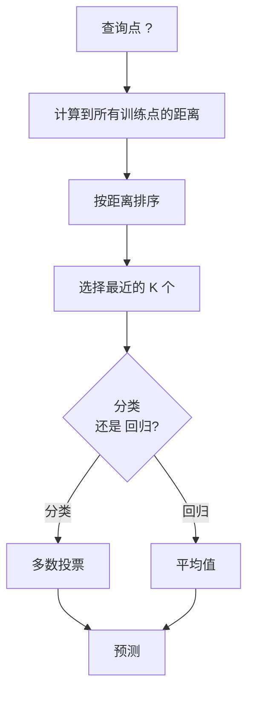
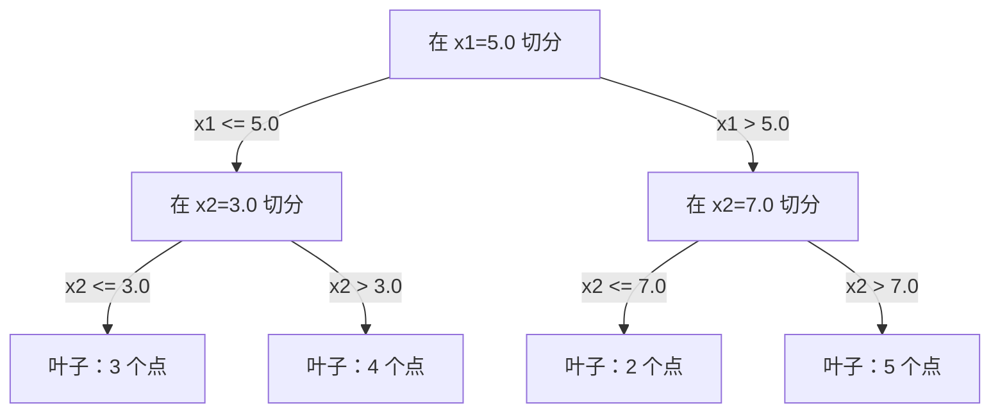

# K-Nearest Neighbors and Distances

> 存储一切。通过查看邻居来预测。最简单但有效的算法。

**Type:** 构建  
**Language:** Python  
**Prerequisites:** 第一阶段（第14课：范数与距离）  
**Time:** ~90 分钟

## 学习目标

- 从头实现 KNN 分类和回归，支持可配置的 K 和基于距离的加权投票  
- 比较 L1、L2、余弦和 Minkowski 距离度量，并为给定数据类型选择合适的度量  
- 解释维度灾难并演示为何 KNN 在高维空间中退化  
- 构建 KD-tree 以实现高效的近邻搜索，并分析何时它优于暴力搜索

## 问题描述

你有一个数据集。一个新的数据点到达。你需要对其进行分类或预测其数值。不像线性回归或 SVM 那样从数据中学习参数，你只需找到与新点最近的 K 个训练点并让它们投票。

这就是 K-近邻（KNN）。没有训练阶段。没有需要学习的参数。没有要最小化的损失函数。你存储整个训练集，并在预测时计算距离。

听起来太简单而不能奏效。但 KNN 在许多问题上出人意料地具有竞争力，尤其是对于小到中等规模的数据集。深入理解它会揭示基本概念：距离度量的选择（与第一阶段第14课相关）、维度灾难以及惰性学习与急切学习的差别。

KNN 在现代 AI 中无处不在，只是名称不同。向量数据库对嵌入进行 KNN 搜索。检索增强生成（RAG）找到 K 个最邻近的文档块。推荐系统找到相似的用户或物品。算法相同，规模和数据结构不同。

## 概念

### KNN 如何工作

给定一个带标签的数据点集合和一个新查询点：

1. 计算查询点到数据集中每个点的距离  
2. 按距离排序  
3. 取最近的 K 个点  
4. 对于分类：在 K 个邻居中多数投票  
5. 对于回归：对 K 个邻居的目标值取平均（或加权平均）



这就是整个算法。无拟合。无梯度下降。无轮次。

### 选择 K

K 是唯一的超参数。它控制偏差-方差权衡：

| K | 行为 |
|---|------|
| K = 1 | 决策边界跟随每个点。训练误差为零。方差高，过拟合 |
| 小 K (3-5) | 对局部结构敏感。可以捕捉复杂边界 |
| 大 K | 边界更平滑。对噪声更鲁棒。可能欠拟合 |
| K = N | 对每个点都预测多数类。最大偏差 |

一个常见的起点是对 N 个点的数据集使用 K = sqrt(N)。对于二分类问题使用奇数 K 以避免平局。


### 距离度量

距离函数定义了“近”的含义。不同的度量会产生不同的邻居，从而导致不同的预测。

**L2（欧氏距离）** 是默认。直线距离。

```
d(a, b) = sqrt(sum((a_i - b_i)^2))
```

对特征尺度敏感。在用 L2 与 KNN 配合使用前总是要对特征进行标准化。

**L1（曼哈顿距离）** 求绝对差之和。比 L2 对异常值更稳健，因为它不对差值进行平方。

```
d(a, b) = sum(|a_i - b_i|)
```

**余弦距离** 测量向量之间的夹角，忽略幅度。对文本和嵌入数据至关重要。

```
d(a, b) = 1 - (a . b) / (||a|| * ||b||)
```

**Minkowski** 用参数 p 泛化了 L1 和 L2。

```
d(a, b) = (sum(|a_i - b_i|^p))^(1/p)

p=1: Manhattan
p=2: Euclidean
p->inf: Chebyshev (最大绝对差)
```

使用哪种度量取决于数据：

| 数据类型 | 最佳度量 | 原因 |
|---------|---------|------|
| 数值特征，尺度相似 | L2 (Euclidean) | 默认，适用于空间数据 |
| 数值特征，有异常值 | L1 (Manhattan) | 稳健，不放大大差异 |
| 文本嵌入 | Cosine | 幅度是噪声，方向表示语义 |
| 高维稀疏 | Cosine 或 L1 | L2 在高维下受维度灾难影响 |
| 混合类型 | 自定义距离 | 对每类特征组合不同度量 |

### 加权 KNN

标准 KNN 对所有 K 个邻居赋予相等权重。但距离为 0.1 的邻居应该比距离为 5.0 的邻居更重要。

**基于距离的加权 KNN** 以距离的倒数为权重：

```
weight_i = 1 / (distance_i + epsilon)

分类：加权投票
回归：加权平均 = sum(w_i * y_i) / sum(w_i)
```

epsilon 防止当查询点与训练点完全匹配时出现除以零。

加权 KNN 对 K 的选择不那么敏感，因为远处的邻居对预测的贡献很小。

### 维度灾难

KNN 在高维下性能下降。这不是模糊的担忧，而是数学事实。

问题 1：距离趋同。随着维度增加，最大距离与最小距离的比值趋近于 1。所有点对于查询变得“同样远”。

```
在 d 维，对于均匀随机点：

d=2:    max_dist / min_dist = 变化很大
d=100:  max_dist / min_dist ~ 1.01
d=1000: max_dist / min_dist ~ 1.001

当所有距离近似相等时，“最近”就失去了意义。
```

问题 2：体积爆炸。要在固定的数据比例内捕获 K 个邻居，你需要将搜索半径扩展到覆盖更大比例的特征空间。在高维中，“邻域”包含了空间的大部分。

问题 3：角落占主导。在 d 维单位超立方体中，大部分体积集中在角落而非中心。随着 d 增长，内切球包含的体积比例趋近于零。

实际后果：KNN 在大约 20-50 个特征以内表现良好。超出后，你需要先做降维（PCA、UMAP、t-SNE），或利用能利用数据内在低维结构的树状搜索结构。

### KD-tree：快速近邻搜索

暴力 KNN 在每次查询时计算查询点到每个训练点的距离。那是每次查询 O(n * d)。对于大型数据集，这太慢。

KD-tree 沿特征轴递归划分空间。每层在一个维度上按中位数切分。



要找到最近邻，先遍历树到包含查询点的叶子，然后回溯并仅在其他分区可能包含更近点时检查它们。

平均查询时间：在低维时为 O(log n)。但当维度高（d > 20）时 KD-tree 退化到 O(n)，因为回溯时无法剪掉很多分支。

### Ball tree：在中等维度下更优

Ball tree 用嵌套的超球体而不是轴对齐的盒子来划分数据。每个节点定义一个球（中心 + 半径），包含该子树中的所有点。

相对于 KD-tree 的优点：
- 在中等维度（约 50 维以内）表现更好  
- 处理非轴对齐结构  
- 更紧凑的包围体在搜索时能剪掉更多分支

KD-tree 和 Ball tree 都是精确算法。对于真正的大规模搜索（数百万点、数百维），会使用近似近邻方法（HNSW、IVF、乘积量化）。这些方法在第一阶段第14课中有所介绍。

### 惰性学习 vs 急切学习

KNN 是惰性学习器：训练时几乎不做工作，所有工作在预测时完成。其他大多数算法（线性回归、SVM、神经网络）是急切学习器：训练时做大量计算以构建紧凑模型，随后预测很快。

| 方面 | 惰性（KNN） | 急切（SVM、神经网络） |
|------|-------------|------------------------|
| 训练时间 | O(1) 仅存储数据 | O(n * epochs) |
| 预测时间 | 每次查询 O(n * d) | O(d) 或 O(参数数目) |
| 预测时内存 | 存储整个训练集 | 仅存储模型参数 |
| 适应新数据 | 可即时添加点 | 需重训练模型 |
| 决策边界 | 隐式，在线计算 | 显式，训练后固定 |

惰性学习适合当：
- 数据集频繁变化（添加/删除点而不想重训练）  
- 只需要很少的查询  
- 需要零训练时间  
- 数据集足够小，以至于暴力搜索足够快

### KNN 回归

不是多数投票，而是对 K 个邻居的目标值取平均。

```
prediction = (1/K) * sum(y_i for i in K nearest neighbors)

或带距离加权：
prediction = sum(w_i * y_i) / sum(w_i)
其中 w_i = 1 / distance_i
```

KNN 回归产生分段常数（或在加权时为分段平滑）预测。它不能对训练数据范围以外进行外推。如果训练目标都在 0 到 100 之间，KNN 永远无法预测 200。

```figure
knn-smoothness
```

## 构建实现

### 第 1 步：距离函数

实现 L1、L2、余弦和 Minkowski 距离。这直接关联到第一阶段第14课内容。

```python
import math

def l2_distance(a, b):
    return math.sqrt(sum((ai - bi) ** 2 for ai, bi in zip(a, b)))

def l1_distance(a, b):
    return sum(abs(ai - bi) for ai, bi in zip(a, b))

def cosine_distance(a, b):
    dot_val = sum(ai * bi for ai, bi in zip(a, b))
    norm_a = math.sqrt(sum(ai ** 2 for ai in a))
    norm_b = math.sqrt(sum(bi ** 2 for bi in b))
    if norm_a == 0 or norm_b == 0:
        return 1.0
    return 1.0 - dot_val / (norm_a * norm_b)

def minkowski_distance(a, b, p=2):
    if p == float('inf'):
        return max(abs(ai - bi) for ai, bi in zip(a, b))
    return sum(abs(ai - bi) ** p for ai, bi in zip(a, b)) ** (1 / p)
```

### 第 2 步：KNN 分类器与回归器

构建完整的 KNN，支持可配置的 K、距离函数和可选的距离加权。

```python
class KNN:
    def __init__(self, k=5, distance_fn=l2_distance, weighted=False,
                 task="classification"):
        self.k = k
        self.distance_fn = distance_fn
        self.weighted = weighted
        self.task = task
        self.X_train = None
        self.y_train = None

    def fit(self, X, y):
        self.X_train = X
        self.y_train = y

    def predict(self, X):
        return [self._predict_one(x) for x in X]
```

### 第 3 步：KD-tree 以提高搜索效率

从头构建一个 KD-tree，按每个维度的中位数递归切分。

```python
class KDTree:
    def __init__(self, X, indices=None, depth=0):
        # 递归地划分数据
        self.axis = depth % len(X[0])
        # 在当前轴的中位数处切分
        ...

    def query(self, point, k=1):
        # 遍历到叶子节点，然后回溯
        ...
```

完整实现与所有辅助方法和演示见 `code/knn.py`。

### 第 4 步：特征缩放

KNN 需要特征缩放，因为距离对特征幅度敏感。范围在 0 到 1000 的特征会主导范围在 0 到 1 的特征。

```python
def standardize(X):
    n = len(X)
    d = len(X[0])
    means = [sum(X[i][j] for i in range(n)) / n for j in range(d)]
    stds = [
        max(1e-10, (sum((X[i][j] - means[j]) ** 2 for i in range(n)) / n) ** 0.5)
        for j in range(d)
    ]
    return [[((X[i][j] - means[j]) / stds[j]) for j in range(d)] for i in range(n)], means, stds
```

## 使用示例

使用 scikit-learn：

```python
from sklearn.neighbors import KNeighborsClassifier
from sklearn.preprocessing import StandardScaler
from sklearn.pipeline import Pipeline

clf = Pipeline([
    ("scaler", StandardScaler()),
    ("knn", KNeighborsClassifier(n_neighbors=5, metric="euclidean")),
])
clf.fit(X_train, y_train)
print(f"Accuracy: {clf.score(X_test, y_test):.4f}")
```

Scikit-learn 会在数据集足够大且维度足够低时自动使用 KD-tree 或 Ball tree。对于高维数据，它会回退到暴力搜索。你可以通过 `algorithm` 参数进行控制。

对于大规模近邻搜索（数百万向量），请使用 FAISS、Annoy 或向量数据库：

```python
import faiss

index = faiss.IndexFlatL2(dimension)
index.add(embeddings)
distances, indices = index.search(query_vectors, k=5)
```

## 练习

1. 在一个 2D 数据集上实现 KNN 分类（3 类）。绘制 K=1、K=5、K=15、K=N 的决策边界。观察从过拟合到欠拟合的转变。  
2. 在 2、5、10、50、100、500 维空间中各生成 1000 个随机点。对于每个维度，计算最大成对距离与最小成对距离的比值。绘制比值随维度变化的曲线以可视化维度灾难。  
3. 在文本分类问题（使用 TF-IDF 向量）上比较 L1、L2 与余弦距离的 KNN。哪种度量的准确率最高？为什么余弦通常在文本上胜出？  
4. 实现一个 KD-tree，并在 2D、10D、50D 的 1k、10k、100k 点数据集上测量查询时间与暴力搜索的对比。KD-tree 在哪个维度开始不再比暴力搜索快？  
5. 构建一个用于 y = sin(x) + 噪声 的加权 KNN 回归器。比较 K=3、10、30 时加权与不加权 KNN 的效果。展示在较大 K 下加权如何产生更平滑的预测。

## 关键词

| 术语 | 实际含义 |
|------|---------|
| K-nearest neighbors | 非参数算法，预测通过找到查询点最近的 K 个训练点 |
| Lazy learning | 惰性学习：训练时不做计算，所有工作在预测时发生。KNN 是典型例子 |
| Eager learning | 急切学习：训练时进行大量计算来构建紧凑模型。大多数 ML 算法属于此类 |
| Curse of dimensionality | 维度灾难：高维下距离趋同且邻域扩展涵盖大部分空间，使 KNN 无效 |
| KD-tree | 二叉树，沿特征轴递归划分空间。低维时查询为 O(log n) |
| Ball tree | 嵌套超球体的树。在中等维度（约 50 维以内）通常比 KD-tree 更好 |
| Weighted KNN | 邻居按距离倒数加权。更近的邻居对预测影响更大 |
| Feature scaling | 特征缩放：将特征归一到可比的范围。距离方法（如 KNN）必需 |
| Majority vote | 多数投票：在 K 个邻居中计数最常见类别进行分类 |
| Brute force search | 暴力搜索：对每个训练点计算距离。每次查询 O(n * d)。精确但对大 n 很慢 |
| Approximate nearest neighbor | 近似近邻算法（HNSW、LSH、IVF），以远快于精确搜索的速度找到近似最近点 |
| Voronoi diagram | 沃罗诺伊图：空间划分，每个区域包含比其他训练点更接近某一训练点的所有点。K=1 的 KNN 产生沃罗诺伊边界 |

## 延伸阅读

- [Cover & Hart: Nearest Neighbor Pattern Classification (1967)](https://ieeexplore.ieee.org/document/1053964) - 基础 KNN 论文，证明其误差率至多为 Bayes 最优的两倍  
- [Friedman, Bentley, Finkel: An Algorithm for Finding Best Matches in Logarithmic Expected Time (1977)](https://dl.acm.org/doi/10.1145/355744.355745) - 原始 KD-tree 论文  
- [Beyer et al.: When Is "Nearest Neighbor" Meaningful? (1999)](https://link.springer.com/chapter/10.1007/3-540-49257-7_15) - 关于最近邻问题维度灾难的形式化分析  
- [scikit-learn Nearest Neighbors documentation](https://scikit-learn.org/stable/modules/neighbors.html) - 实用指南与算法选择  
- [FAISS: A Library for Efficient Similarity Search](https://github.com/facebookresearch/faiss) - Meta 的用于十亿级近似最近邻搜索的库