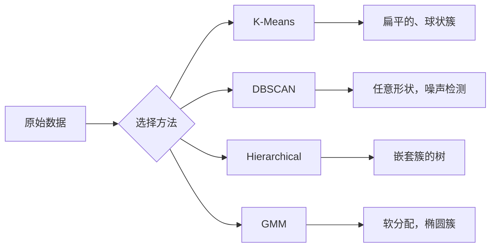

# 无监督学习

> 没有标签，没有老师。算法自行发现结构。

**Type:** 构建
**Languages:** Python
**Prerequisites:** 第 1 阶段（范数与距离、概率与分布），第 2 阶段 第1-6课
**Time:** ~90 分钟

## 学习目标

- 从头实现 K-Means、DBSCAN 和 Gaussian Mixture Models，并比较它们的聚类行为
- 使用轮廓系数（silhouette score）和肘部法则（elbow method）评估簇质量并选择最优的 K
- 解释何时 DBSCAN 优于 K-Means，并识别哪个算法能处理非球状簇和异常值
- 使用聚类方法构建异常检测流水线，标记偏离正常模式的点

## 问题背景

到目前为止，每节机器学习课程都假定有标签数据：“这是输入，这是正确输出”。在现实世界中，标签是昂贵的。医院有数百万条病人记录，但没有人为每条记录标注疾病类别。电商网站有数百万次用户会话，但没有人为客户分群打标签。安全团队有大量网络日志，但没有人标注每一个异常。

无监督学习在没有告诉它要寻找什么的情况下发现模式。它将相似的数据点分组，发现隐藏结构，并揭示异常。如果监督学习是带有答案的教科书学习，那么无监督学习就是盯着原始数据，直到模式显现为止。

问题在于：没有标签时，你无法直接衡量“对”或“错”。需要不同的工具来评估算法发现的结构是否有意义。

## 概念

### 聚类：将相似的事物归到一起

聚类将每个数据点分配到某个组（簇），使得同一簇内的点相互之间比与其他簇的点更相似。关键问题总是：什么是“相似”？



### K-Means：常用方法

K-Means 将数据划分为恰好 K 个簇。每个簇有一个质心（质心为其质心位置），每个点被分配到最近的质心。

Lloyd 算法：

1. 随机选择 K 个点作为初始质心
2. 将每个数据点分配给最近的质心
3. 将每个簇的质心重新计算为分配到该簇的点的均值
4. 重复步骤 2-3，直到分配不再变化

目标函数（惯性）衡量每个点到其分配质心的总平方距离。K-Means 最小化该值，但只能找到局部最小值。不同的初始化可能得到不同结果。

### 选择 K

两种常用方法：

肘部法则（Elbow method）：对 K = 1, 2, 3, ..., n 运行 K-Means。绘制 inertia 相对于 K 的曲线。寻找“肘部”位置，即增加簇数不再显著降低 inertia 的点。

轮廓系数（Silhouette score）：对于每个点，衡量它与自己簇内点的相似度 a 与与最近其他簇的相似度 b。轮廓系数为 (b - a) / max(a, b)，范围从 -1（错误分簇）到 +1（良好分簇）。对所有点取平均得到全局分数。

### DBSCAN：基于密度的聚类

K-Means 假设簇是球状的，并且需要预先选择 K。DBSCAN 不做这些假设。它将簇定义为被稀疏区域分隔的密集区域。

两个参数：
- eps：邻域半径
- min_samples：形成密集区域所需的最少点数

三种点：
- Core point（核心点）：在 eps 距离内至少有 min_samples 个点
- Border point（边界点）：在某个核心点的 eps 邻域内，但自身不是核心点
- Noise point（噪声点）：既不是核心点也不是边界点，这类为异常点

DBSCAN 将相互在 eps 内的核心点连接为同一簇。边界点加入临近核心点所在簇。噪声点不属于任何簇。

优点：能发现任意形状的簇、自动确定簇数、识别异常。缺点：对不同密度的簇表现较差。

### 层次聚类（Hierarchical Clustering）

构建一个嵌套簇的树（树状图）。

凝聚式（自底向上）：
1. 每个点开始作为一个簇
2. 合并最近的两个簇
3. 重复直到只剩一个簇
4. 在所需层级切割树状图以得到 K 个簇

簇间“接近度”可以按以下方式衡量：
- 单连接（Single linkage）：两个簇中任意两点之间的最小距离
- 完全连接（Complete linkage）：任意两点之间的最大距离
- 平均连接（Average linkage）：所有点对距离的平均值
- Ward 方法：选择合并后导致簇内方差总和最小增加的合并

### 高斯混合模型（GMM）

K-Means 给出硬分配：每个点只属于一个簇。GMM 给出软分配：每个点对每个簇都有属于该簇的概率。

GMM 假设数据来自 K 个高斯分布的混合，每个高斯有自己的均值和协方差。期望最大化（EM）算法交替执行：

- E 步：计算每个点属于每个高斯的概率
- M 步：更新每个高斯的均值、协方差和混合权重以最大化数据的似然

GMM 可以建模椭圆形簇（不像 K-Means 仅为球状），并自然处理重叠簇。

### 何时使用哪个方法

| Method | Best for | Avoid when |
|--------|----------|------------|
| K-Means | 大规模数据集、球状簇、已知 K | 不规则形状、有异常值时 |
| DBSCAN | 未知 K、任意形状、需要异常检测 | 密度变化大的簇、高维度时 |
| Hierarchical | 小数据集、需要树状图、未知 K | 大数据集（O(n^2) 内存） |
| GMM | 簇重叠、需要软分配时 | 数据集非常大、维度太多时 |

### 使用聚类进行异常检测

聚类天然支持异常检测：
- K-Means：距离任一质心很远的点是异常
- DBSCAN：噪声点本身就是异常
- GMM：在所有高斯下概率都很低的点是异常

```figure
kmeans-step
```

## 实现

### 步骤 1：从零开始实现 K-Means

```python
import math
import random


def euclidean_distance(a, b):
    return math.sqrt(sum((ai - bi) ** 2 for ai, bi in zip(a, b)))


def kmeans(data, k, max_iterations=100, seed=42):
    random.seed(seed)
    n_features = len(data[0])

    centroids = random.sample(data, k)

    for iteration in range(max_iterations):
        clusters = [[] for _ in range(k)]
        assignments = []

        for point in data:
            distances = [euclidean_distance(point, c) for c in centroids]
            nearest = distances.index(min(distances))
            clusters[nearest].append(point)
            assignments.append(nearest)

        new_centroids = []
        for cluster in clusters:
            if len(cluster) == 0:
                new_centroids.append(random.choice(data))
                continue
            centroid = [
                sum(point[j] for point in cluster) / len(cluster)
                for j in range(n_features)
            ]
            new_centroids.append(centroid)

        if all(
            euclidean_distance(old, new) < 1e-6
            for old, new in zip(centroids, new_centroids)
        ):
            print(f"  Converged at iteration {iteration + 1}")
            break

        centroids = new_centroids

    return assignments, centroids
```

### 步骤 2：肘部法则和轮廓系数

```python
def compute_inertia(data, assignments, centroids):
    total = 0.0
    for point, cluster_id in zip(data, assignments):
        total += euclidean_distance(point, centroids[cluster_id]) ** 2
    return total


def silhouette_score(data, assignments):
    n = len(data)
    if n < 2:
        return 0.0

    clusters = {}
    for i, c in enumerate(assignments):
        clusters.setdefault(c, []).append(i)

    if len(clusters) < 2:
        return 0.0

    scores = []
    for i in range(n):
        own_cluster = assignments[i]
        own_members = [j for j in clusters[own_cluster] if j != i]

        if len(own_members) == 0:
            scores.append(0.0)
            continue

        a = sum(euclidean_distance(data[i], data[j]) for j in own_members) / len(own_members)

        b = float("inf")
        for cluster_id, members in clusters.items():
            if cluster_id == own_cluster:
                continue
            avg_dist = sum(euclidean_distance(data[i], data[j]) for j in members) / len(members)
            b = min(b, avg_dist)

        if max(a, b) == 0:
            scores.append(0.0)
        else:
            scores.append((b - a) / max(a, b))

    return sum(scores) / len(scores)


def find_best_k(data, max_k=10):
    print("Elbow method:")
    inertias = []
    for k in range(1, max_k + 1):
        assignments, centroids = kmeans(data, k)
        inertia = compute_inertia(data, assignments, centroids)
        inertias.append(inertia)
        print(f"  K={k}: inertia={inertia:.2f}")

    print("\nSilhouette scores:")
    for k in range(2, max_k + 1):
        assignments, centroids = kmeans(data, k)
        score = silhouette_score(data, assignments)
        print(f"  K={k}: silhouette={score:.4f}")

    return inertias
```

### 步骤 3：从零开始实现 DBSCAN

```python
def dbscan(data, eps, min_samples):
    n = len(data)
    labels = [-1] * n
    cluster_id = 0

    def region_query(point_idx):
        neighbors = []
        for i in range(n):
            if euclidean_distance(data[point_idx], data[i]) <= eps:
                neighbors.append(i)
        return neighbors

    visited = [False] * n

    for i in range(n):
        if visited[i]:
            continue
        visited[i] = True

        neighbors = region_query(i)

        if len(neighbors) < min_samples:
            labels[i] = -1
            continue

        labels[i] = cluster_id
        seed_set = list(neighbors)
        seed_set.remove(i)

        j = 0
        while j < len(seed_set):
            q = seed_set[j]

            if not visited[q]:
                visited[q] = True
                q_neighbors = region_query(q)
                if len(q_neighbors) >= min_samples:
                    for nb in q_neighbors:
                        if nb not in seed_set:
                            seed_set.append(nb)

            if labels[q] == -1:
                labels[q] = cluster_id

            j += 1

        cluster_id += 1

    return labels
```

### 步骤 4：高斯混合模型（EM 算法）

```python
def gmm(data, k, max_iterations=100, seed=42):
    random.seed(seed)
    n = len(data)
    d = len(data[0])

    indices = random.sample(range(n), k)
    means = [list(data[i]) for i in indices]
    variances = [1.0] * k
    weights = [1.0 / k] * k

    def gaussian_pdf(x, mean, variance):
        d = len(x)
        coeff = 1.0 / ((2 * math.pi * variance) ** (d / 2))
        exponent = -sum((xi - mi) ** 2 for xi, mi in zip(x, mean)) / (2 * variance)
        return coeff * math.exp(max(exponent, -500))

    for iteration in range(max_iterations):
        responsibilities = []
        for i in range(n):
            probs = []
            for j in range(k):
                probs.append(weights[j] * gaussian_pdf(data[i], means[j], variances[j]))
            total = sum(probs)
            if total == 0:
                total = 1e-300
            responsibilities.append([p / total for p in probs])

        old_means = [list(m) for m in means]

        for j in range(k):
            r_sum = sum(responsibilities[i][j] for i in range(n))
            if r_sum < 1e-10:
                continue

            weights[j] = r_sum / n

            for dim in range(d):
                means[j][dim] = sum(
                    responsibilities[i][j] * data[i][dim] for i in range(n)
                ) / r_sum

            variances[j] = sum(
                responsibilities[i][j]
                * sum((data[i][dim] - means[j][dim]) ** 2 for dim in range(d))
                for i in range(n)
            ) / (r_sum * d)
            variances[j] = max(variances[j], 1e-6)

        shift = sum(
            euclidean_distance(old_means[j], means[j]) for j in range(k)
        )
        if shift < 1e-6:
            print(f"  GMM converged at iteration {iteration + 1}")
            break

    assignments = []
    for i in range(n):
        assignments.append(responsibilities[i].index(max(responsibilities[i])))

    return assignments, means, weights, responsibilities
```

### 步骤 5：生成测试数据并运行所有算法

```python
def make_blobs(centers, n_per_cluster=50, spread=0.5, seed=42):
    random.seed(seed)
    data = []
    true_labels = []
    for label, (cx, cy) in enumerate(centers):
        for _ in range(n_per_cluster):
            x = cx + random.gauss(0, spread)
            y = cy + random.gauss(0, spread)
            data.append([x, y])
            true_labels.append(label)
    return data, true_labels


def make_moons(n_samples=200, noise=0.1, seed=42):
    random.seed(seed)
    data = []
    labels = []
    n_half = n_samples // 2
    for i in range(n_half):
        angle = math.pi * i / n_half
        x = math.cos(angle) + random.gauss(0, noise)
        y = math.sin(angle) + random.gauss(0, noise)
        data.append([x, y])
        labels.append(0)
    for i in range(n_half):
        angle = math.pi * i / n_half
        x = 1 - math.cos(angle) + random.gauss(0, noise)
        y = 1 - math.sin(angle) - 0.5 + random.gauss(0, noise)
        data.append([x, y])
        labels.append(1)
    return data, labels


if __name__ == "__main__":
    centers = [[2, 2], [8, 3], [5, 8]]
    data, true_labels = make_blobs(centers, n_per_cluster=50, spread=0.8)

    print("=== K-Means on 3 blobs ===")
    assignments, centroids = kmeans(data, k=3)
    print(f"  Centroids: {[[round(c, 2) for c in cent] for cent in centroids]}")
    sil = silhouette_score(data, assignments)
    print(f"  Silhouette score: {sil:.4f}")

    print("\n=== Elbow Method ===")
    find_best_k(data, max_k=6)

    print("\n=== DBSCAN on 3 blobs ===")
    db_labels = dbscan(data, eps=1.5, min_samples=5)
    n_clusters = len(set(db_labels) - {-1})
    n_noise = db_labels.count(-1)
    print(f"  Found {n_clusters} clusters, {n_noise} noise points")

    print("\n=== GMM on 3 blobs ===")
    gmm_assignments, gmm_means, gmm_weights, _ = gmm(data, k=3)
    print(f"  Means: {[[round(m, 2) for m in mean] for mean in gmm_means]}")
    print(f"  Weights: {[round(w, 3) for w in gmm_weights]}")
    gmm_sil = silhouette_score(data, gmm_assignments)
    print(f"  Silhouette score: {gmm_sil:.4f}")

    print("\n=== DBSCAN on moons (non-spherical clusters) ===")
    moon_data, moon_labels = make_moons(n_samples=200, noise=0.1)
    moon_db = dbscan(moon_data, eps=0.3, min_samples=5)
    n_moon_clusters = len(set(moon_db) - {-1})
    n_moon_noise = moon_db.count(-1)
    print(f"  Found {n_moon_clusters} clusters, {n_moon_noise} noise points")

    print("\n=== K-Means on moons (will fail to separate) ===")
    moon_km, moon_centroids = kmeans(moon_data, k=2)
    moon_sil = silhouette_score(moon_data, moon_km)
    print(f"  Silhouette score: {moon_sil:.4f}")
    print("  K-Means splits moons poorly because they are not spherical")

    print("\n=== Anomaly detection with DBSCAN ===")
    anomaly_data = list(data)
    anomaly_data.append([20.0, 20.0])
    anomaly_data.append([-5.0, -5.0])
    anomaly_data.append([15.0, 0.0])
    anomaly_labels = dbscan(anomaly_data, eps=1.5, min_samples=5)
    anomalies = [
        anomaly_data[i]
        for i in range(len(anomaly_labels))
        if anomaly_labels[i] == -1
    ]
    print(f"  Detected {len(anomalies)} anomalies")
    for a in anomalies[-3:]:
        print(f"    Point {[round(v, 2) for v in a]}")
```

## 使用方式

使用 scikit-learn，这些算法可以一行调用：

```python
from sklearn.cluster import KMeans, DBSCAN, AgglomerativeClustering
from sklearn.mixture import GaussianMixture
from sklearn.metrics import silhouette_score as sklearn_silhouette

km = KMeans(n_clusters=3, random_state=42).fit(data)
db = DBSCAN(eps=1.5, min_samples=5).fit(data)
agg = AgglomerativeClustering(n_clusters=3).fit(data)
gmm_model = GaussianMixture(n_components=3, random_state=42).fit(data)
```

从零实现的版本展示了这些库在做什么。K-Means 在分配和重计算之间迭代。DBSCAN 从密集种子生长簇。GMM 在期望和最大化之间交替。库版本增加了数值稳定性、更智能的初始化（K-Means++）和 GPU 加速，但核心逻辑相同。

## 交付成果

本课产出可运行的 K-Means、DBSCAN 和 GMM 的实现。从这些聚类代码可以扩展出更高级的无监督方法。

## 练习

1. 实现 K-Means++ 初始化：不随机选择所有质心，而是先随机选一个，之后每次根据与已选择质心的最近距离的平方按概率选择下一个质心。比较与随机初始化的收敛速度。
2. 将层次凝聚聚类加入代码中。实现 Ward 链接并生成树状图（作为嵌套的合并列表）。在不同层级切割并与 K-Means 结果比较。
3. 构建一个简单的异常检测流水线：对同一数据同时运行 DBSCAN 和 GMM，标记两种方法都认为是离群点的点（DBSCAN 的噪声、GMM 的低概率点）。测量重合度并讨论方法产生不一致的情形。

## 术语

| Term | What people say | What it actually means |
|------|----------------|----------------------|
| Clustering | "Grouping similar things" | 将数据划分为子集，使得组内相似度高于组间相似度，使用具体的距离度量 |
| Centroid | "The center of a cluster" | 被分配到某簇的所有点的均值；K-Means 使用其作为簇的代表 |
| Inertia | "How tight the clusters are" | 每个点到其分配质心的平方距离之和；值越低簇越紧凑 |
| Silhouette score | "How well-separated clusters are" | 对每个点，(b - a) / max(a, b)，其中 a 是簇内平均距离，b 是最近其他簇的平均距离 |
| Core point | "A point in a dense region" | 在 DBSCAN 中，eps 距离内有至少 min_samples 个邻居的点 |
| EM algorithm | "Soft K-Means" | 期望最大化：迭代计算成员概率（E 步）并更新分布参数（M 步） |
| Dendrogram | "A tree of clusters" | 树状图，显示层次聚类中簇合并的顺序和距离 |
| Anomaly | "An outlier" | 不符合预期模式的数据点，被 DBSCAN 标为噪声或在 GMM 下具有低概率 |

## 深入阅读

- [Stanford CS229 - Unsupervised Learning](https://cs229.stanford.edu/notes2022fall/main_notes.pdf) - Andrew Ng 关于聚类与 EM 的讲义笔记
- [scikit-learn Clustering Guide](https://scikit-learn.org/stable/modules/clustering.html) - 对所有聚类算法的实用比较与可视化示例
- [DBSCAN original paper (Ester et al., 1996)](https://www.aaai.org/Papers/KDD/1996/KDD96-037.pdf) - 提出基于密度聚类的原始论文