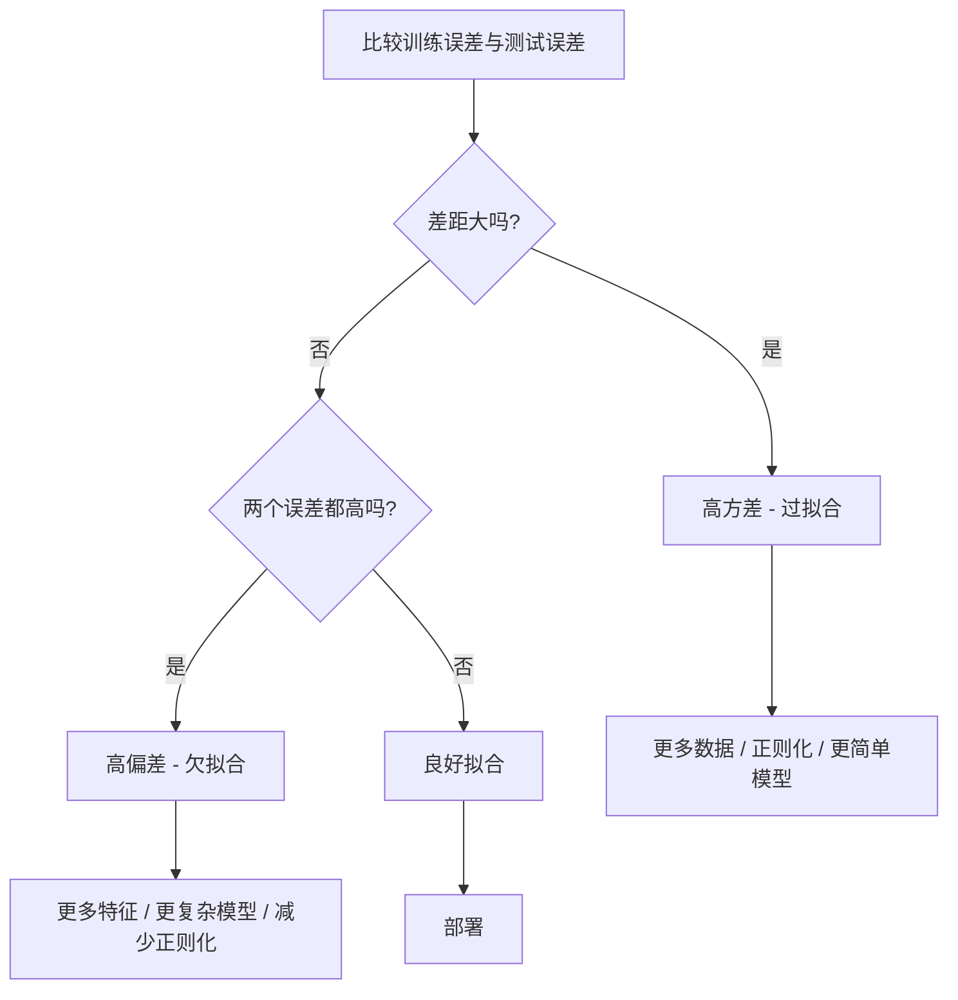
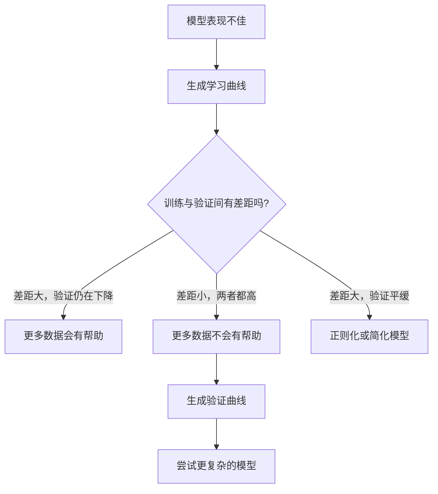

# 偏差-方差权衡

> 每个模型误差都来自三种来源之一：偏差、方差或噪声。你只能控制前两者。

**Type:** 学习  
**Language:** Python  
**Prerequisites:** Phase 2，Lessons 01-09（机器学习基础、回归、分类、评估）  
**Time:** ~75 分钟

## 学习目标

- 推导期望预测误差的偏差-方差分解，并解释不可约噪声的作用  
- 通过训练误差和测试误差的模式判断模型是高偏差还是高方差  
- 解释正则化技术（L1、L2、dropout、早停）如何在偏差与方差之间权衡  
- 实现实验，展示随模型复杂度增加的偏差-方差权衡可视化

## 问题

你训练了一个模型。在测试数据上它有一定的误差。这些误差来自哪里？

如果你的模型太简单（在曲线数据上用线性回归），它会持续地错过真实模式。这就是偏差。如果你的模型太复杂（对15个数据点使用20次多项式），它会把训练数据拟合得完美，但对新数据给出截然不同的预测。这就是方差。

对于固定的模型容量，你不能同时最小化两者。降低偏差会导致方差上升；降低方差会导致偏差上升。理解这种权衡是机器学习中最有用的诊断技能之一。它告诉你应该让模型更复杂还是更简单，应该获取更多数据还是做更好的特征工程，应该增加还是减少正则化。

## 概念

### 偏差：系统性误差

偏差衡量模型的平均预测与真实值之间的偏离程度。如果你在许多不同的训练集上训练相同的模型并对预测取平均，偏差就是该平均值与真实值之间的差距。

高偏差意味着模型过于僵化，无法捕捉真实模式。用直线去拟合抛物线，无论给多少数据都会错过曲线。这就是欠拟合。

```
高偏差（欠拟合）：
  模型总是预测大致相同的错误结果。
  训练误差：高
  测试误差：高
  两者差距：小
```

### 方差：对训练数据的敏感性

方差衡量在不同训练子集上训练时预测值有多大变化。如果训练集的微小变化会导致模型产生很大差异，则方差高。

高方差意味着模型在拟合训练数据中的噪声，而不是底层信号。一个20次多项式会穿过每个训练点，但在点与点之间剧烈振荡。这就是过拟合。

```
高方差（过拟合）：
  模型完美拟合训练数据但在新数据上失败。
  训练误差：低
  测试误差：高
  两者差距：大
```

### 分解

对于任意点 x，在平方损失下的期望预测误差可以精确分解为：

```
期望误差 = 偏差^2 + 方差 + 不可约噪声

其中：
  偏差^2   = (E[f_hat(x)] - f(x))^2
  方差     = E[(f_hat(x) - E[f_hat(x)])^2]
  噪声     = E[(y - f(x))^2]             (sigma^2)
```

- `f(x)` 是真实函数  
- `f_hat(x)` 是模型的预测  
- `E[...]` 是对不同训练集的期望  
- `y` 是观测到的标签（真实函数加噪声）

噪声项是不可约的。在有噪声的数据上，没有任何模型能比 sigma^2 更好。你的任务是找到偏差^2 和方差之间的恰当平衡。

### 模型复杂度与误差


经典的 U 型曲线：

| 复杂度 | 偏差 | 方差 | 总误差 |
|--------|------|------|--------|
| 太低 | 高 | 低 | 高（欠拟合） |
| 刚好 | 中等 | 中等 | 最低 |
| 太高 | 低 | 高 | 高（过拟合） |

### 将正则化视为偏差-方差控制

正则化有意增加偏差以减少方差。它约束模型，使其不能追逐噪声。

- **L2 (Ridge)：** 将所有权重收缩到接近零。保留所有特征但降低它们的影响力。  
- **L1 (Lasso)：** 将一些权重压到恰好为零。执行特征选择。  
- **Dropout：** 在训练期间随机禁用神经元。强制模型学习冗余表示。  
- **早停（Early stopping）：** 在模型完全拟合训练数据之前停止训练。

正则化强度（lambda、dropout 率、训练轮数）直接决定你在偏差-方差曲线上的位置。更强的正则化意味着更高的偏差、更低的方差。

### 双下降：现代视角

经典理论认为：在最佳点之后，增加复杂度总是有害的。但自2019年以来的研究显示了意想不到的现象。如果你在插值阈值（模型有足够参数完美拟合训练数据）之后继续大幅增加模型容量，测试误差可能再次下降。


这种“双下降”现象解释了为什么过参数化的神经网络（参数数量远大于训练样本数量）仍能有良好泛化。经典的偏差-方差权衡并非错误，但在现代范式下不完整。

关于双下降的关键观察：
- 它发生在线性模型、决策树和神经网络中  
- 在插值区，更多数据有时反而会伤害性能（样本级双下降）  
- 更多训练轮次也会导致此现象（轮次级双下降）  
- 正则化会平滑峰值但不会消除它

为什么会发生？在插值阈值处，模型刚好有能力拟合所有训练点，被迫得到一个“穿过每个点”的非常具体的解，数据的小扰动会导致拟合发生巨大变化。这时方差达到峰值。超过阈值后，模型有许多可能的解能完美拟合数据。学习算法（例如带有隐式正则化的梯度下降）倾向于选择这些解中更简单的那一个。这种对简单解的隐式偏好就是过参数化模型仍能泛化的原因。

| 区间 | 参数 vs 样本 | 行为 |
|------|--------------|------|
| 欠参数化 | p << n | 经典权衡适用 |
| 插值阈值 | p ~ n | 方差达到峰值，测试误差激增 |
| 过参数化 | p >> n | 隐式正则化起作用，测试误差下降 |

实用建议：如果你使用神经网络或大型树集成，不要停留在插值阈值附近。要么远低于它（并使用显式正则化），要么远高于它。最糟糕的位置就是恰好处在阈值上。

### 诊断你的模型



| 症状 | 诊断 | 解决方法 |
|------|------|----------|
| 训练误差高、测试误差高 | 偏差 | 增加特征、用更灵活的模型、减少正则化 |
| 训练误差低、测试误差高 | 方差 | 更多数据、正则化、更简单模型、dropout |
| 训练误差低、测试误差低 | 良好拟合 | 部署 |
| 训练误差下降、测试误差上升 | 过拟合进行中 | 早停 |

### 实用策略

当偏差是问题时：
- 添加多项式或交互特征  
- 使用更灵活的模型（例如用树集成代替线性模型）  
- 减少正则化强度  
- 更久地训练（如果尚未收敛）

当方差是问题时：
- 获取更多训练数据  
- 使用 bagging（随机森林）  
- 增加正则化（更大的 lambda、更多 dropout）  
- 特征选择（移除噪声特征）  
- 使用交叉验证及早检测

### 集成方法与方差减少

集成方法是对抗方差的最实用工具。

Bagging（自助聚合）在不同的自助样本上训练多个模型，然后对它们的预测取平均。每个个体模型方差较大，但平均后的方差会显著降低。随机森林就是对决策树应用 bagging。

数学上为什么有效：如果你平均 N 个相互独立的预测，每个方差为 sigma^2，那么平均预测的方差为 sigma^2 / N。模型并非真正独立（它们看到了相似的数据），所以方差降低不完全是 1/N，但仍然显著。

Boosting 通过序列化地构建模型来降低偏差，每个新模型关注当前集成的错误。梯度提升和 AdaBoost 是主要示例。Boosting 如果加入过多基学习器可能会过拟合，因此需要早停或正则化。

| 方法 | 主要效果 | 偏差变化 | 方差变化 |
|------|---------|---------|---------|
| Bagging | 降低方差 | 无显著变化 | 减少 |
| Boosting | 降低偏差 | 减少 | 可能增加 |
| Stacking | 同时降低 | 取决于元学习器 | 取决于基模型 |
| Dropout | 隐式 bagging | 稍微增加 | 减少 |

实用规则：如果基模型方差高（深树、高次多项式），使用 bagging。如果基模型偏差高（浅桩、简单线性模型），使用 boosting。

### 学习曲线

学习曲线绘制训练误差和验证误差随训练集大小的变化。它们是最实用的诊断工具。与单次训练/测试比较不同，学习曲线展示模型的轨迹并告诉你更多数据是否有用。


如何解读：

| 情景 | 训练误差 | 验证误差 | 差距 | 含义 | 应对 |
|------|----------|----------|------|------|------|
| 高偏差 | 高 | 高 | 小 | 模型无法捕捉模式 | 更多特征、更复杂模型、减少正则化 |
| 高方差 | 低 | 高 | 大 | 模型记住训练数据 | 更多数据、正则化、更简单模型 |
| 良好拟合 | 中等 | 中等 | 小 | 模型泛化良好 | 部署 |
| 高方差，正在改善 | 低 | 随数据增多下降 | 收缩中 | 通过更多数据可修复的方差问题 | 收集更多数据 |
| 高偏差，平坦 | 高 | 高且平稳 | 小且平坦 | 更多数据无济于事 | 更改模型架构 |

关键见解：如果两条曲线都已陷入平台且差距很小但误差高，更多数据没用。你需要更好的模型。如果差距很大且仍在缩小，更多数据会有帮助。

### 如何生成学习曲线

有两种方法：

方法1：改变训练集大小、固定模型。保持模型与超参数不变，在逐渐增大的训练子集上训练。记录每个大小下的训练和验证误差。这是标准学习曲线。

方法2：固定数据、改变模型复杂度。保持数据不变，扫描复杂度参数（多项式次数、树深、层数）。记录每个复杂度下的训练和验证误差。这是验证曲线，直接展示偏差-方差权衡。

两种方法互为补充。第一种告诉你更多数据是否有用。第二种告诉你是否需要更改模型。在对下一步决策前，两者都运行一遍。



```figure
bias-variance
```

## 实现

代码在 `code/bias_variance.py` 中运行完整的偏差-方差分解实验。下面逐步说明方法。

### 第一步：从已知函数生成合成数据

我们使用 `f(x) = sin(1.5x) + 0.5x` 并加入高斯噪声。已知真实函数允许我们精确计算偏差和方差。

```python
def true_function(x):
    return np.sin(1.5 * x) + 0.5 * x

def generate_data(n_samples=30, noise_std=0.5, x_range=(-3, 3), seed=None):
    rng = np.random.RandomState(seed)
    x = rng.uniform(x_range[0], x_range[1], n_samples)
    y = true_function(x) + rng.normal(0, noise_std, n_samples)
    return x, y
```

### 第二步：自助采样与多项式拟合

对于每个多项式次数，我们抽取许多自助训练集，拟合多项式，并在一个固定的测试网格上记录预测。这给出每个测试点的预测分布。

```python
def fit_polynomial(x_train, y_train, degree, lam=0.0):
    X = np.column_stack([x_train ** d for d in range(degree + 1)])
    if lam > 0:
        penalty = lam * np.eye(X.shape[1])
        penalty[0, 0] = 0
        w = np.linalg.solve(X.T @ X + penalty, X.T @ y_train)
    else:
        w = np.linalg.lstsq(X, y_train, rcond=None)[0]
    return w
```

我们在 200 个不同的自助样本上拟合。每个自助样本来自相同的底层分布，但包含不同的点。

### 第三步：计算偏差^2、方差分解

在每个测试点上有 200 组预测后，我们可以直接从定义处计算分解：

```python
mean_pred = predictions.mean(axis=0)
bias_sq = np.mean((mean_pred - y_true) ** 2)
variance = np.mean(predictions.var(axis=0))
total_error = np.mean(np.mean((predictions - y_true) ** 2, axis=1))
```

- `mean_pred` 是从自助样本估计的 E[f_hat(x)]  
- `bias_sq` 是平均预测与真实值之间的平方差  
- `variance` 是预测在自助样本间的平均离散度  
- `total_error` 应近似等于 bias^2 + variance + noise

### 第四步：学习曲线

学习曲线在固定模型复杂度下扫描训练集大小。它们展示你的模型是受数据限制还是受容量限制。

```python
def demo_learning_curves():
    sizes = [10, 15, 20, 30, 50, 75, 100, 150, 200, 300]
    degree = 5

    for n in sizes:
        train_errors = []
        test_errors = []
        for seed in range(50):
            x_train, y_train = generate_data(n_samples=n, seed=seed * 100)
            w = fit_polynomial(x_train, y_train, degree)
            train_pred = predict_polynomial(x_train, w)
            train_mse = np.mean((train_pred - y_train) ** 2)
            test_pred = predict_polynomial(x_test, w)
            test_mse = np.mean((test_pred - y_test) ** 2)
            train_errors.append(train_mse)
            test_errors.append(test_mse)
        # 对多次运行取平均得到学习曲线的一个点
```

对于高方差模型（degree=5 且数据量小），你会看到：
- 训练误差起初很低，随着更多数据加入而上升（记忆变难）  
- 测试误差起初很高，随着数据增多而下降（学习到更多信号）  
- 两者差距随着更多数据而缩小

对于高偏差模型（degree=1），两者很快收敛到相同的高值，更多数据无济于事。

### 第五步：正则化扫参

代码还包括 `demo_regularization_sweep()`，它固定高次多项式（degree=15）并对 Ridge 正则化强度在 0.001 到 100 之间进行扫描。这展示了从另一个角度的偏差-方差权衡：不是改变模型复杂度，而是改变约束强度。

```python
def demo_regularization_sweep():
    alphas = [0.001, 0.005, 0.01, 0.05, 0.1, 0.5, 1.0, 5.0, 10.0, 50.0, 100.0]
    for alpha in alphas:
        results = bias_variance_decomposition([15], lam=alpha)
        r = results[15]
        print(f"alpha={alpha:.3f}  bias={r['bias_sq']:.4f}  var={r['variance']:.4f}")
```

在低 alpha 时，15 次多项式几乎不受约束。方差占主导，因为模型在每个自助样本上追逐噪声。在高 alpha 时，惩罚强到模型接近常数函数，偏差占主导。最佳 alpha 位于两者之间。

这与改变多项式次数得到的 U 型曲线相同，但通过连续旋钮来控制。在实践中，正则化更受青睐，因为它允许细粒度控制而无需改变特征集。

## 使用方法

sklearn 提供 `learning_curve` 和 `validation_curve` 来自动化这些诊断，无需自己写自助循环。

### 验证曲线：扫描模型复杂度

```python
from sklearn.model_selection import validation_curve
from sklearn.pipeline import make_pipeline
from sklearn.preprocessing import PolynomialFeatures
from sklearn.linear_model import Ridge

degrees = list(range(1, 16))
train_scores_all = []
val_scores_all = []

for d in degrees:
    pipe = make_pipeline(PolynomialFeatures(d), Ridge(alpha=0.01))
    train_scores, val_scores = validation_curve(
        pipe, X, y, param_name="polynomialfeatures__degree",
        param_range=[d], cv=5, scoring="neg_mean_squared_error"
    )
    train_scores_all.append(-train_scores.mean())
    val_scores_all.append(-val_scores.mean())
```

这会直接给出偏差-方差权衡曲线。验证分数相对于训练分数最差的地方表示方差占主导；两者都很差的地方表示偏差占主导。

### 学习曲线：扫描训练集大小

```python
from sklearn.model_selection import learning_curve

pipe = make_pipeline(PolynomialFeatures(5), Ridge(alpha=0.01))
train_sizes, train_scores, val_scores = learning_curve(
    pipe, X, y, train_sizes=np.linspace(0.1, 1.0, 10),
    cv=5, scoring="neg_mean_squared_error"
)
train_mse = -train_scores.mean(axis=1)
val_mse = -val_scores.mean(axis=1)
```

将 `train_mse` 和 `val_mse` 根据 `train_sizes` 绘图。曲线形状会告诉你关于模型的一切。

### 结合交叉验证与正则化扫参

```python
from sklearn.model_selection import cross_val_score

alphas = [0.001, 0.01, 0.1, 1.0, 10.0, 100.0]
for alpha in alphas:
    pipe = make_pipeline(PolynomialFeatures(10), Ridge(alpha=alpha))
    scores = cross_val_score(pipe, X, y, cv=5, scoring="neg_mean_squared_error")
    print(f"alpha={alpha:>7.3f}  MSE={-scores.mean():.4f} +/- {scores.std():.4f}")
```

这会在固定模型复杂度下扫描正则化强度。你会看到相同的偏差-方差权衡：低 alpha 表示高方差，high alpha 表示高偏差。

### 整合：完整诊断工作流

在实践中，按以下顺序运行这些诊断：

1. 训练模型。计算训练误差和测试误差。  
2. 如果两者都高：说明偏差问题，跳到步骤4。  
3. 如果训练误差低但测试误差高：说明方差问题。生成学习曲线查看更多数据是否有帮助。如果没有，则正则化。  
4. 生成验证曲线，扫描主要复杂度参数。找到最佳点。  
5. 在最佳点处生成学习曲线。如果差距仍然大，则需要更多数据或正则化。  
6. 使用 `cross_val_score` 对不同的 Ridge/Lasso alpha 值做交叉验证。选择交叉验证误差最低的 alpha。

对于大多数表格数据，这个流程大约需要 10-15 分钟的计算时间，却能节省数小时的试错时间。

## 部署成果

本课生成：`outputs/prompt-model-diagnostics.md`

## 练习

1. 在 `noise_std=0`（无噪声）下运行分解。不可约误差项会发生什么？最优复杂度是否改变？  

2. 将训练集大小从 30 增加到 300。这会如何影响方差分量？最优多项式次数是否发生变化？  

3. 在实验中加入 L2 正则化（Ridge）。对于固定的高次多项式（degree=15），扫描 lambda 从 0 到 100。绘制 bias^2 和 variance 随 lambda 的函数图。  

4. 将真实函数从多项式改为 `sin(x)`。偏差-方差分解如何改变？是否仍存在明确的最优次数？  

5. 实现一个简单的自助聚合（bagging）包装器：在自助样本上训练 10 个模型并平均预测。证明这能在不显著增加偏差的情况下减少方差。

## 关键术语

| 术语 | 人们常说 | 实际含义 |
|------|---------|----------|
| 偏差 (Bias) | “模型太简单” | 来自错误假设的系统性误差。平均模型预测与真实值之间的差距。 |
| 方差 (Variance) | “模型在过拟合” | 来自对训练数据敏感性的误差。不同比训练集时预测的变化量。 |
| 不可约误差 | “数据中的噪声” | 由真实数据生成过程的随机性导致的误差。模型无法消除。 |
| 欠拟合 | “学习不足” | 模型具有高偏差。即使在训练数据上也无法捕捉真实模式。 |
| 过拟合 | “记住了数据” | 模型具有高方差。拟合了训练数据中的噪声而无法泛化。 |
| 正则化 | “约束模型” | 添加惩罚以降低模型复杂度，用偏差换取更低的方差。 |
| 双下降 | “更多参数也可能有益” | 当模型容量远超插值阈值时，测试误差再次下降的现象。 |
| 模型复杂度 | “模型有多灵活” | 模型拟合任意模式的能力。由架构、特征或正则化控制。 |

## 拓展阅读

- [Hastie, Tibshirani, Friedman: Elements of Statistical Learning, Ch. 7](https://hastie.su.domains/ElemStatLearn/) -- 偏差-方差分解的权威章节  
- [Belkin et al., Reconciling modern machine learning practice and the bias-variance trade-off (2019)](https://arxiv.org/abs/1812.11118) -- 双下降论文  
- [Nakkiran et al., Deep Double Descent (2019)](https://arxiv.org/abs/1912.02292) -- 轮次级和样本级双下降  
- [Scott Fortmann-Roe: Understanding the Bias-Variance Tradeoff](http://scott.fortmann-roe.com/docs/BiasVariance.html) -- 清晰的可视化解释