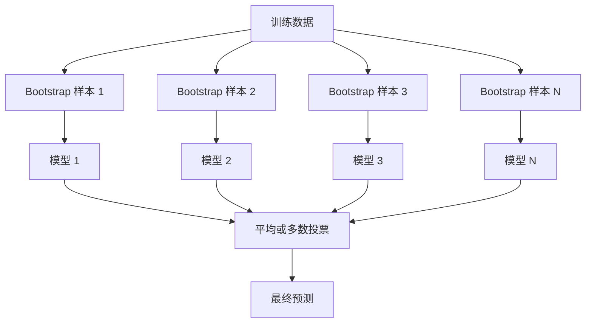
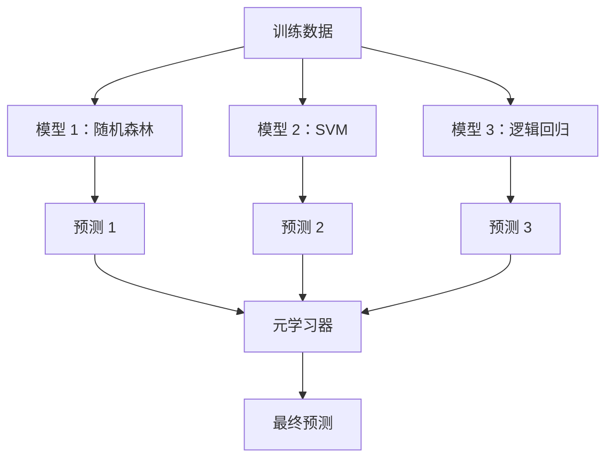

# Ensemble Methods

> A group of weak learners, combined correctly, becomes a strong learner. This is not a metaphor. It is a theorem.

**Type:** 构建  
**Language:** Python  
**Prerequisites:** 第2阶段，第10课（偏差-方差权衡）  
**Time:** ~120 分钟

## Learning Objectives

- 从头实现 AdaBoost 和梯度提升（gradient boosting），并解释提升方法如何通过序列化地减少偏差
- 构建一个 bagging 集成并演示平均化去相关模型如何在不增加偏差的情况下减少方差
- 比较 bagging、boosting 和 stacking 在针对哪种误差成分（偏差或方差）上的不同
- 评估集成的多样性并解释为何在更多独立弱学习器下多数投票的准确率会提升

## The Problem

单棵决策树训练快且易解释，但容易过拟合。单个线性模型在复杂边界上则欠拟合。你可以花好几天时间去工程化完美模型架构，或者把很多不完美的模型组合起来，得到一个比任何单一模型都更好的结果。

集成方法正是这样做的。它们是在表格数据上赢得 Kaggle 竞赛的最可靠技术，驱动着大多数生产环境下的机器学习系统，同时也很好地展示了偏差-方差权衡。Bagging 降低方差，Boosting 降低偏差，Stacking 学习在哪些输入上应信任哪些模型。

## The Concept

### Why Ensembles Work

假设你有 N 个互相独立的分类器，每个的准确率为 p > 0.5。多数投票的准确率为：

```
P(majority correct) = sum over k > N/2 of C(N,k) * p^k * (1-p)^(N-k)
```

对于 21 个每个准确率为 60% 的分类器，多数投票的准确率约为 74%。对于 101 个分类器，上升到 84%。当模型在不同点犯错时，这些错误会相互抵消。

关键要求是**多样性**。如果所有模型犯的是相同的错误，组合就没有任何好处。集成之所以有效，是因为它通过以下方式产生多样化模型：

- 不同的训练子集（bagging）
- 不同的特征子集（随机森林）
- 序列化的错误修正（boosting）
- 不同的模型族（stacking）

### Bagging (Bootstrap Aggregating)

Bagging 通过在不同的自助采样（bootstrap）训练数据上训练每个模型来创建多样性。



自助样本是从原始数据中有放回抽样得到的，样本量与原始数据相同。大约 63.2% 的唯一样本会出现在每个 bootstrap 中。其余约 36.8%（袋外样本，out-of-bag）提供了一个免费的验证集合。

Bagging 在不显著增加偏差的情况下减少方差。每棵树会对它的 bootstrap 样本过拟合，但每棵树的过拟合模式不同，平均化可以抵消这些噪声。

**随机森林（Random Forests）** 是在 bagging 基础上的一个改进：在每次分裂时只考虑随机子集的特征。这进一步强制树之间的多样性。典型的候选特征数为分类问题的 `sqrt(n_features)`，回归问题常用 `n_features / 3`。

### Boosting (Sequential Error Correction)

Boosting 以序列化的方式训练模型。每个新模型关注之前模型做错的样本。


Boosting 减少偏差。每个新模型都在纠正到目前为止集成的系统性错误。最终预测是所有模型的加权和，其中表现更好的模型获得更高权重。

权衡在于：如果运行轮数过多，boosting 可能过拟合，因为它会不断拟合更难的样本，其中一些可能是噪声。

### AdaBoost

AdaBoost（Adaptive Boosting）是第一个实用的提升算法。它可以与任何基学习器一起使用，通常采用决策桩（depth-1 树）。

算法如下：

```
1. Initialize sample weights: w_i = 1/N for all i

2. For t = 1 to T:
   a. Train weak learner h_t on weighted data
   b. Compute weighted error:
      err_t = sum(w_i * I(h_t(x_i) != y_i)) / sum(w_i)
   c. Compute model weight:
      alpha_t = 0.5 * ln((1 - err_t) / err_t)
   d. Update sample weights:
      w_i = w_i * exp(-alpha_t * y_i * h_t(x_i))
   e. Normalize weights to sum to 1

3. Final prediction: H(x) = sign(sum(alpha_t * h_t(x)))
```

错误率更低的模型会得到更高的 alpha。被误分类的样本权重会增大，以便下一个模型重点关注它们。

### Gradient Boosting

梯度提升（Gradient Boosting）将 boosting 推广到任意损失函数。不再是重新加权样本，而是拟合当前集成的残差（损失的负梯度）。

```
1. Initialize: F_0(x) = argmin_c sum(L(y_i, c))

2. For t = 1 to T:
   a. Compute pseudo-residuals:
      r_i = -dL(y_i, F_{t-1}(x_i)) / dF_{t-1}(x_i)
   b. Fit a tree h_t to the residuals r_i
   c. Find optimal step size:
      gamma_t = argmin_gamma sum(L(y_i, F_{t-1}(x_i) + gamma * h_t(x_i)))
   d. Update:
      F_t(x) = F_{t-1}(x) + learning_rate * gamma_t * h_t(x)

3. Final prediction: F_T(x)
```

对于平方误差损失，伪残差就是实际残差：`r_i = y_i - F_{t-1}(x_i)`。每棵树字面上是在拟合前一轮集成的误差。

学习率（shrinkage）控制每棵树的贡献程度。较小的学习率需要更多树，但能更好地泛化。常见取值：0.01 到 0.3。

### XGBoost: Why It Dominates Tabular Data

XGBoost（eXtreme Gradient Boosting）是在梯度提升基础上的工程优化，使其更快、更准确且更抗过拟合：

- **正则化目标：** 对叶子权重施加 L1 和 L2 惩罚，防止单棵树过度自信
- **二阶近似：** 使用损失的一阶和二阶导数，改进分裂决策
- **稀疏感知分裂：** 原生处理缺失值，通过学习在每次分裂时缺失值的最好方向
- **列采样：** 类似随机森林，每次分裂采样特征以增强多样性
- **加权分位数草图：** 在分布式数据上高效查找连续特征的分裂点
- **缓存感知的块结构：** 内存布局针对 CPU 缓存行优化

对于表格数据，XGBoost（及其后继 LightGBM）通常优于神经网络。这在可预见的未来不会改变。如果你的数据以行列表格形式存在，从梯度提升开始。

### Stacking (Meta-Learning)

Stacking 使用多个基模型的预测作为元学习器（meta-learner）的特征。



元学习器学习在什么输入上信任哪个基模型。如果随机森林在某些区域更好，而 SVM 在其他区域更好，元学习器会学会相应地进行路由。

为了避免数据泄漏，基模型的预测必须通过在训练集上的交叉验证生成。你不能在同一数据上训练基模型并生成元特征。

### Voting

最简单的集成。直接组合预测。

- **Hard voting（硬投票）：** 对类别标签进行多数投票。
- **Soft voting（软投票）：** 对预测概率求平均，选择平均概率最高的类别。通常更好，因为它利用了置信度信息。

## Build It

### Step 1: Decision Stump (Base Learner)

`code/ensembles.py` 中的代码从头实现了所有内容。我们从决策桩（decision stump）开始：只有一次分裂的树。

```python
class DecisionStump:
    def __init__(self):
        self.feature_idx = None
        self.threshold = None
        self.polarity = 1
        self.alpha = None

    def fit(self, X, y, weights):
        n_samples, n_features = X.shape
        best_error = float("inf")

        for f in range(n_features):
            thresholds = np.unique(X[:, f])
            for thresh in thresholds:
                for polarity in [1, -1]:
                    pred = np.ones(n_samples)
                    pred[polarity * X[:, f] < polarity * thresh] = -1
                    error = np.sum(weights[pred != y])
                    if error < best_error:
                        best_error = error
                        self.feature_idx = f
                        self.threshold = thresh
                        self.polarity = polarity

    def predict(self, X):
        n = X.shape[0]
        pred = np.ones(n)
        idx = self.polarity * X[:, self.feature_idx] < self.polarity * self.threshold
        pred[idx] = -1
        return pred
```

### Step 2: AdaBoost from Scratch

```python
class AdaBoostScratch:
    def __init__(self, n_estimators=50):
        self.n_estimators = n_estimators
        self.stumps = []
        self.alphas = []

    def fit(self, X, y):
        n = X.shape[0]
        weights = np.full(n, 1 / n)

        for _ in range(self.n_estimators):
            stump = DecisionStump()
            stump.fit(X, y, weights)
            pred = stump.predict(X)

            err = np.sum(weights[pred != y])
            err = np.clip(err, 1e-10, 1 - 1e-10)

            alpha = 0.5 * np.log((1 - err) / err)
            weights *= np.exp(-alpha * y * pred)
            weights /= weights.sum()

            stump.alpha = alpha
            self.stumps.append(stump)
            self.alphas.append(alpha)

    def predict(self, X):
        total = sum(a * s.predict(X) for a, s in zip(self.alphas, self.stumps))
        return np.sign(total)
```

### Step 3: Gradient Boosting from Scratch

```python
class GradientBoostingScratch:
    def __init__(self, n_estimators=100, learning_rate=0.1, max_depth=3):
        self.n_estimators = n_estimators
        self.lr = learning_rate
        self.max_depth = max_depth
        self.trees = []
        self.initial_pred = None

    def fit(self, X, y):
        self.initial_pred = np.mean(y)
        current_pred = np.full(len(y), self.initial_pred)

        for _ in range(self.n_estimators):
            residuals = y - current_pred
            tree = SimpleRegressionTree(max_depth=self.max_depth)
            tree.fit(X, residuals)
            update = tree.predict(X)
            current_pred += self.lr * update
            self.trees.append(tree)

    def predict(self, X):
        pred = np.full(X.shape[0], self.initial_pred)
        for tree in self.trees:
            pred += self.lr * tree.predict(X)
        return pred
```

### Step 4: Compare against sklearn

代码会验证我们从头实现的算法与 sklearn 的 `AdaBoostClassifier` 和 `GradientBoostingClassifier` 在准确率上的相似性，并将所有方法并排比较。

## Use It

### When to Use Each Method

| Method | Reduces | Best for | Watch out for |
|--------|---------|----------|---------------|
| Bagging / Random Forest | 方差 | 噪声数据、多特征 | 对偏差无帮助 |
| AdaBoost | 偏差 | 干净的数据、简单的基学习器 | 对异常值和噪声敏感 |
| Gradient Boosting | 偏差 | 表格数据、竞赛 | 训练慢，若不调参容易过拟合 |
| XGBoost / LightGBM | 两者 | 生产级表格 ML | 超参数众多 |
| Stacking | 两者 | 追求最后的 1-2% 准确率 | 复杂，元学习器容易过拟合 |
| Voting | 方差 | 快速组合多样化模型 | 只有当模型多样时才有帮助 |

### The Production Stack for Tabular Data

对大多数表格预测问题，尝试顺序如下：

1. 使用默认参数的 **LightGBM 或 XGBoost**
2. 调参：n_estimators、learning_rate、max_depth、min_child_weight
3. 如果还需要最后的 0.5%，用 3-5 个多样化模型构建堆叠集成
4. 全程使用交叉验证

在表格数据上，神经网络几乎总是比梯度提升差，尽管持续有研究尝试改进。TabNet、NODE 等架构偶尔能匹配但很少能超越调优良好的 XGBoost。

## Ship It

本课会生成 `outputs/prompt-ensemble-selector.md` —— 一个帮助你为给定数据集选择合适集成方法的提示词。描述你的数据（规模、特征类型、噪声水平、类别平衡）和你要解决的问题。该提示包含决策检查清单、方法推荐、建议的初始超参数，以及该方法常见错误的警告。还会生成 `outputs/skill-ensemble-builder.md`，内含完整的选择指南。

## Exercises

1. 修改 AdaBoost 实现以在每一轮之后跟踪训练准确率。绘制准确率随基学习器数量的曲线。它何时收敛？

2. 通过在回归树中加入随机特征子采样，从头实现随机森林。训练 100 棵树，使用 `max_features=sqrt(n_features)` 并平均预测。将方差降低情况与单棵树进行比较。

3. 在梯度提升实现中加入早停（early stopping）：在每轮后跟踪验证集损失，并在连续 10 轮未提升时停止。实际需要多少棵树？

4. 构建一个堆叠集成，包含三个基模型（逻辑回归、决策树、k 近邻）和一个逻辑回归元学习器。使用 5 折交叉验证生成元特征。与每个基模型单独比较性能。

5. 在相同数据集上运行默认参数的 XGBoost。比较其准确率与你从头实现的梯度提升的结果。计时比较两者。速度差异有多大？

## Key Terms

| Term | What people say | What it actually means |
|------|----------------|----------------------|
| Bagging | "Train on random subsets" | 自助聚合：在 bootstrap 样本上训练模型，平均预测以减少方差 |
| Boosting | "Focus on hard examples" | 序列化训练模型，每个纠正当前集成的错误，以减少偏差 |
| AdaBoost | "Reweight the data" | 通过样本权重更新实现的提升；被误分类的点在下一轮中权重更高 |
| Gradient boosting | "Fit the residuals" | 通过拟合损失函数的负梯度来实现的提升 |
| XGBoost | "The Kaggle weapon" | 带有正则化、二阶优化和系统级加速技巧的梯度提升 |
| Stacking | "Models on top of models" | 使用基模型的预测作为元学习器的输入特征 |
| Random forest | "Many randomized trees" | 在决策树上做装袋，并在每次分裂时随机子采样特征以增强多样性 |
| Ensemble diversity | "Make different mistakes" | 模型在错误上的不相关性使得集成能优于单个模型 |
| Out-of-bag error | "Free validation" | 未被某次 bootstrap 抽中的样本（约 36.8%）可作为无需额外留出集的验证集 |

## Further Reading

- [Schapire & Freund: Boosting: Foundations and Algorithms](https://mitpress.mit.edu/9780262526036/) -- AdaBoost 创始人的著作  
- [Friedman: Greedy Function Approximation: A Gradient Boosting Machine (2001)](https://statweb.stanford.edu/~jhf/ftp/trebst.pdf) -- 梯度提升的原始论文  
- [Chen & Guestrin: XGBoost (2016)](https://arxiv.org/abs/1603.02754) -- XGBoost 论文  
- [Wolpert: Stacked Generalization (1992)](https://www.sciencedirect.com/science/article/abs/pii/S0893608005800231) -- 堆叠学习的原始论文  
- [scikit-learn Ensemble Methods](https://scikit-learn.org/stable/modules/ensemble.html) -- 实用参考