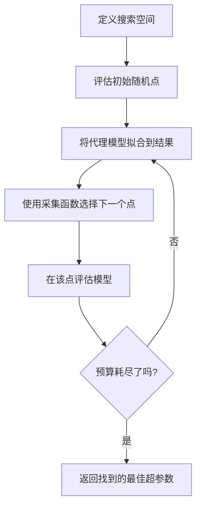
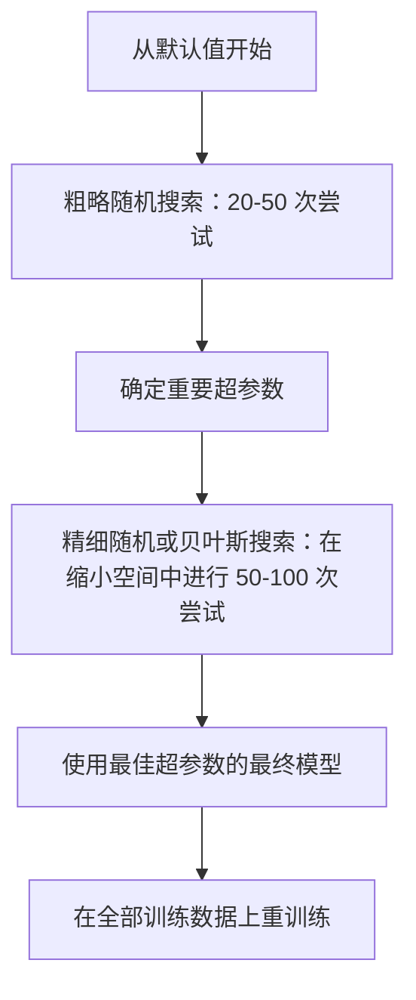
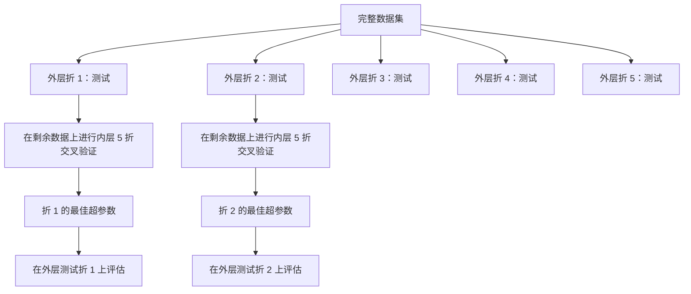

# 超参数调优

> 超参数是在训练开始前调节的旋钮。把它们调好往往决定了模型是平庸还是优秀。

**Type:** 构建  
**Language:** Python  
**Prerequisites:** 阶段 2，第 11 课（集成方法）  
**Time:** ~90 分钟

## 学习目标

- 从头实现网格搜索、随机搜索和贝叶斯优化，并比较它们的样本效率
- 解释当大多数超参数具有低有效维度时，为什么随机搜索优于网格搜索
- 使用代理模型和采集函数构建贝叶斯优化循环以指导搜索
- 设计一种避免在验证集上过拟合的超参数调优策略（通过适当的交叉验证）

## 问题描述

你的梯度提升模型有学习率、树的数量、最大深度、每叶子最少样本数、子采样比率和列采样比率。这就是六个超参数。如果每个超参数有 5 个合理取值，网格有 5^6 = 15,625 种组合。每次训练需要 10 秒。穷尽所有组合需要 43 小时的计算时间。

网格搜索看起来直观，但在大规模时却是最糟糕的选择。随机搜索在更少计算下表现更好。贝叶斯优化通过从过去评估中学习进一步提升效率。知道该使用哪种策略以及哪些超参数真正重要，可以节省数天的 GPU 时间。

## 概念

### 参数与超参数

参数是在训练过程中学习到的（权重、偏置、分裂阈值）。超参数是在训练开始前设置的，控制学习过程如何进行。

| Hyperparameter | 它控制的内容 | 典型范围 |
|---------------|-----------------|---------------|
| Learning rate | 每次更新的步长 | 0.001 到 1.0 |
| Number of trees/epochs | 训练时长 | 10 到 10,000 |
| Max depth | 模型复杂度 | 1 到 30 |
| Regularization (lambda) | 防止过拟合 | 0.0001 到 100 |
| Batch size | 梯度估计噪声 | 16 到 512 |
| Dropout rate | 被丢弃神经元的比例 | 0.0 到 0.5 |

### 网格搜索

网格搜索评估指定值的每一种组合。它是穷尽性的且容易理解，但随超参数数量呈指数级扩展。

```
两个超参数的网格：

  learning_rate: [0.01, 0.1, 1.0]
  max_depth:     [3, 5, 7]

  评估： 3 x 3 = 9 种组合

  (0.01, 3)  (0.01, 5)  (0.01, 7)
  (0.1,  3)  (0.1,  5)  (0.1,  7)
  (1.0,  3)  (1.0,  5)  (1.0,  7)
```

网格搜索有一个根本缺陷：如果一个超参数重要而另一个不重要，大多数评估就被浪费了。你在 9 次评估中只获得了重要参数的 3 个不同取值。

### 随机搜索

随机搜索从分布中采样超参数，而不是在网格上穷尽。使用相同的 9 次评估预算，你可以得到每个超参数 9 个不同的取值。


为什么随机搜索胜过网格搜索（Bergstra & Bengio, 2012）：

- 大多数超参数具有低有效维度。对于给定问题，通常只有 1-2 个超参数真正重要。
- 网格搜索在不重要的维度上浪费评估。
- 在相同预算下，随机搜索对重要维度的覆盖更密集。
- 在 60 次随机试验下，你有 95% 的概率找到一个在搜索空间中距离最优值 5% 以内的点（如果最优点存在）。

### 贝叶斯优化

随机搜索会忽略已有结果。它不会学习到高学习率会发散或深度为 3 始终优于深度为 10。贝叶斯优化使用过去的评估来决定下一步在哪里搜索。



两个关键组件：

**Surrogate model:** 一个廉价可评估的模型（通常是高斯过程），用于近似昂贵的目标函数。它在搜索空间中的任意点给出预测值和不确定性估计。

**Acquisition function:** 通过在利用（在已知良好点附近搜索）和探索（在不确定性高的区域搜索）之间权衡，决定下一步评估的位置。常见选择：

- **Expected Improvement (EI)：** 我们期望在该点超过当前最优值多少？
- **Upper Confidence Bound (UCB)：** 预测值加上不确定性的倍数。UCB 高意味着该点要么很有前景要么未被探索。
- **Probability of Improvement (PI)：** 该点击败当前最优值的概率是多少？

贝叶斯优化通常能以 2-5 倍更少的评估次数找到比随机搜索更好的超参数。拟合代理模型的开销与训练实际模型相比是可以忽略的。

### 早停（Early stopping）

并非每次训练都必须跑完。如果某个配置在 10 个 epoch 后明显很差，就停止它并继续其他配置。这就是在超参数搜索上下文中的早停。

策略：
- **基于耐心（Patience-based）：** 如果验证损失在 N 个连续 epoch 内没有改善则停止
- **中值剪枝（Median pruning）：** 如果试验的中间结果在相同步长下比已完成试验的中位数更差则停止
- **Hyperband：** 对大量配置分配小预算，然后逐步为表现最好的配置增加预算

Hyperband 特别有效。它以 1 个 epoch 开始 81 个配置，保留排名前三分之一的配置，给它们 3 个 epoch，再次保留前三分之一，如此类推。相比对所有配置给予全部预算，这种方法能以 10-50 倍更快的速度找到好配置。

### 学习率调度器

学习率几乎总是最重要的超参数。与其保持固定，不如在训练过程中调整它。

| 调度器 | 公式 | 何时使用 |
|-----------|---------|-------------|
| Step decay | 每 N 个 epoch 乘以 0.1 | 经典的 CNN 训练 |
| Cosine annealing | lr * 0.5 * (1 + cos(pi * t / T)) | 现代默认 |
| Warmup + decay | 线性增加然后余弦衰减 | Transformer 类模型 |
| One-cycle | 在一个周期内先增加后减少 | 快速收敛 |
| Reduce on plateau | 指标停滞时按因子降低 | 安全的默认选择 |

### 超参数重要性

并非所有超参数同等重要。关于随机森林（Probst et al., 2019）和梯度提升的研究显示出一致的模式：

**高重要性：**
- 学习率（总是先调）
- 基学习器数量 / 训练轮数（用早停替代调参）
- 正则化强度

**中等重要性：**
- 最大深度 / 层数
- 每叶最小样本数 / 权重衰减
- 子采样比率

**低重要性：**
- 最大特征数（随机森林）
- 具体的激活函数选择
- 在合理范围内的批大小

先调重要的超参数，其他保持默认。

### 实用策略



具体工作流程：

1. **从库默认值开始。** 这些默认值由有经验的实践者选择，通常已经达到 80% 的效果。
2. **粗略随机搜索。** 广泛的取值范围，20-50 次尝试。使用早停快速终止表现差的试验。
3. **分析结果。** 哪些超参数与性能相关？缩小搜索空间。
4. **精细搜索。** 在缩小后的空间中使用贝叶斯优化或有针对性的随机搜索。50-100 次尝试。
5. **在全部训练数据上用找到的最佳超参数重训练** 最终模型。

### 交叉验证的集成

在单个验证集上调超参数存在风险。最佳超参数可能会对特定验证折过拟合。嵌套交叉验证（nested CV）通过使用两个循环来解决这个问题：

- **外层循环**（评估）：将数据分为训练+验证和测试，报告无偏的性能。
- **内层循环**（调参）：将训练+验证再分为训练和验证，找到最佳超参数。



每个外层折独立地寻找其最佳超参数。外层得分给出了泛化性能的无偏估计。

使用 sklearn：

```python
from sklearn.model_selection import cross_val_score, GridSearchCV
from sklearn.ensemble import GradientBoostingRegressor

inner_cv = GridSearchCV(
    GradientBoostingRegressor(),
    param_grid={
        "learning_rate": [0.01, 0.05, 0.1],
        "max_depth": [2, 3, 5],
        "n_estimators": [50, 100, 200],
    },
    cv=5,
    scoring="neg_mean_squared_error",
)

outer_scores = cross_val_score(
    inner_cv, X, y, cv=5, scoring="neg_mean_squared_error"
)

print(f"Nested CV MSE: {-outer_scores.mean():.4f} +/- {outer_scores.std():.4f}")
```

这很昂贵（5 个外层折 x 5 个内层折 x 27 个网格点 = 675 次模型拟合），但它能给出可信的性能估计。在论文报告结果或决策代价高时使用它。

### 实用小贴士

- **从学习率开始。** 对于基于梯度的方法，学习率总是最重要的超参数。糟糕的学习率会让其他所有超参数变得无关紧要。先固定其它超参数为默认值，仅扫描学习率。
- **对学习率和正则化使用对数均匀分布（log-uniform）。** 0.001 与 0.01 的差异和 0.1 与 1.0 的差异同样重要。线性搜索会在大端浪费预算。
- **使用早停代替调 n_estimators。** 对于 boosting 和神经网络，将 n_estimators 或 epochs 设为较大并让早停决定何时停止。这样可减少一个超参数。
- **预算分配。** 将 60% 的调参预算花在最重要的两个超参数上，剩下 40% 用于其它超参数。前两者通常占据大部分性能差异。
- **尺度很重要。** 不要对批大小用对数尺度搜索（16、32、64 是合适的）。总是对学习率用对数尺度。让搜索分布与超参数对模型的影响方式相匹配。

| Model Type | 主要超参数 | 推荐搜索方式 | 预算 |
|-----------|--------------------|--------------------|--------|
| Random Forest | n_estimators, max_depth, min_samples_leaf | 随机搜索，50 次尝试 | 低（训练快） |
| Gradient Boosting | learning_rate, n_estimators, max_depth | 贝叶斯，100 次尝试 + 早停 | 中等 |
| Neural Network | learning_rate, weight_decay, batch_size | 贝叶斯或随机，100+ 次尝试 | 高（训练慢） |
| SVM | C, gamma (RBF kernel) | 对数尺度网格搜索，25-50 次尝试 | 低（2 个参数） |
| Lasso/Ridge | alpha | 一维对数尺度搜索，20 次尝试 | 很低 |
| XGBoost | learning_rate, max_depth, subsample, colsample | 贝叶斯，100-200 次尝试 + 早停 | 中等 |

**遇到不确定时：** 随机搜索，尝试次数至少为超参数数量的 2 倍（例如，6 个超参数 = 至少 12 次尝试）。你会惊讶于随机搜索用 50 次尝试常常击败精心设计的网格搜索。

```figure
k-fold-cv
```

## 动手实现

### 第 1 步：从头实现网格搜索

`code/tuning.py` 中的代码从头实现了网格搜索、随机搜索和一个简单的贝叶斯优化器。

```python
def grid_search(model_fn, param_grid, X_train, y_train, X_val, y_val):
    keys = list(param_grid.keys())
    values = list(param_grid.values())
    best_score = -float("inf")
    best_params = None
    n_evals = 0

    for combo in itertools.product(*values):
        params = dict(zip(keys, combo))
        model = model_fn(**params)
        model.fit(X_train, y_train)
        score = evaluate(model, X_val, y_val)
        n_evals += 1

        if score > best_score:
            best_score = score
            best_params = params

    return best_params, best_score, n_evals
```

### 第 2 步：从头实现随机搜索

```python
def random_search(model_fn, param_distributions, X_train, y_train,
                  X_val, y_val, n_iter=50, seed=42):
    rng = np.random.RandomState(seed)
    best_score = -float("inf")
    best_params = None

    for _ in range(n_iter):
        params = {k: sample(v, rng) for k, v in param_distributions.items()}
        model = model_fn(**params)
        model.fit(X_train, y_train)
        score = evaluate(model, X_val, y_val)

        if score > best_score:
            best_score = score
            best_params = params

    return best_params, best_score, n_iter
```

### 第 3 步：贝叶斯优化（简化版）

核心思想：对观测到的（超参数，得分）对拟合高斯过程，然后使用采集函数决定下一步查看哪里。

```python
class SimpleBayesianOptimizer:
    def __init__(self, search_space, n_initial=5):
        self.search_space = search_space
        self.n_initial = n_initial
        self.X_observed = []
        self.y_observed = []

    def _kernel(self, x1, x2, length_scale=1.0):
        dists = np.sum((x1[:, None, :] - x2[None, :, :]) ** 2, axis=2)
        return np.exp(-0.5 * dists / length_scale ** 2)

    def _fit_gp(self, X_new):
        X_obs = np.array(self.X_observed)
        y_obs = np.array(self.y_observed)
        y_mean = y_obs.mean()
        y_centered = y_obs - y_mean

        K = self._kernel(X_obs, X_obs) + 1e-4 * np.eye(len(X_obs))
        K_star = self._kernel(X_new, X_obs)

        L = np.linalg.cholesky(K)
        alpha = np.linalg.solve(L.T, np.linalg.solve(L, y_centered))
        mu = K_star @ alpha + y_mean

        v = np.linalg.solve(L, K_star.T)
        var = 1.0 - np.sum(v ** 2, axis=0)
        var = np.maximum(var, 1e-6)

        return mu, var

    def _expected_improvement(self, mu, var, best_y):
        sigma = np.sqrt(var)
        z = (mu - best_y) / (sigma + 1e-10)
        ei = sigma * (z * norm_cdf(z) + norm_pdf(z))
        return ei

    def suggest(self):
        if len(self.X_observed) < self.n_initial:
            return sample_random(self.search_space)

        candidates = [sample_random(self.search_space) for _ in range(500)]
        X_cand = np.array([to_vector(c) for c in candidates])
        mu, var = self._fit_gp(X_cand)
        ei = self._expected_improvement(mu, var, max(self.y_observed))
        return candidates[np.argmax(ei)]

    def observe(self, params, score):
        self.X_observed.append(to_vector(params))
        self.y_observed.append(score)
```

GP 代理在每个候选点给出两样东西：预测得分（mu）和不确定性（var）。期望改进（EI）在这两者之间进行平衡：它倾向于那些模型预测得分高或不确定性大的点。早期大多数点不确定性高，因此优化器会进行探索；后来则聚焦于最有前景的区域。

### 第 4 步：比较所有方法

在相同的合成目标上运行三种方法并比较。此比较使用了一个简化的包装器，直接对目标函数（而非训练模型）调用每个优化器，因此 API 与上述基于模型的实现不同：

```python
def synthetic_objective(params):
    lr = params["learning_rate"]
    depth = params["max_depth"]
    return -(np.log10(lr) + 2) ** 2 - (depth - 4) ** 2 + 10

param_grid = {
    "learning_rate": [0.001, 0.01, 0.1, 1.0],
    "max_depth": [2, 3, 4, 5, 6, 7, 8],
}

grid_best = None
grid_score = -float("inf")
grid_history = []
for combo in itertools.product(*param_grid.values()):
    params = dict(zip(param_grid.keys(), combo))
    score = synthetic_objective(params)
    grid_history.append((params, score))
    if score > grid_score:
        grid_score = score
        grid_best = params

param_dist = {
    "learning_rate": ("log_float", 0.001, 1.0),
    "max_depth": ("int", 2, 8),
}

rand_best = None
rand_score = -float("inf")
rand_history = []
rng = np.random.RandomState(42)
for _ in range(28):
    params = {k: sample(v, rng) for k, v in param_dist.items()}
    score = synthetic_objective(params)
    rand_history.append((params, score))
    if score > rand_score:
        rand_score = score
        rand_best = params

optimizer = SimpleBayesianOptimizer(param_dist, n_initial=5)
bayes_history = []
for _ in range(28):
    params = optimizer.suggest()
    score = synthetic_objective(params)
    optimizer.observe(params, score)
    bayes_history.append((params, score))
bayes_score = max(s for _, s in bayes_history)

print(f"{'Method':<20} {'Best Score':>12} {'Evaluations':>12}")
print("-" * 50)
print(f"{'Grid Search':<20} {grid_score:>12.4f} {len(grid_history):>12}")
print(f"{'Random Search':<20} {rand_score:>12.4f} {len(rand_history):>12}")
print(f"{'Bayesian Opt':<20} {bayes_score:>12.4f} {len(bayes_history):>12}")
```

在相同预算下，贝叶斯优化通常最先找到最优结果，因为它不会在明显糟糕的区域浪费评估。随机搜索比网格搜索覆盖更广。网格搜索只有在超参数非常少且能穷尽时才会获胜。

## 实际使用

### 实践中的 Optuna

Optuna 是用于严肃超参数优化的推荐库。它开箱即支持剪枝、分布式搜索和可视化。

```python
import optuna

def objective(trial):
    lr = trial.suggest_float("learning_rate", 1e-4, 1e-1, log=True)
    n_est = trial.suggest_int("n_estimators", 50, 500)
    max_depth = trial.suggest_int("max_depth", 2, 10)

    model = GradientBoostingRegressor(
        learning_rate=lr,
        n_estimators=n_est,
        max_depth=max_depth,
    )
    model.fit(X_train, y_train)
    return mean_squared_error(y_val, model.predict(X_val))

study = optuna.create_study(direction="minimize")
study.optimize(objective, n_trials=100)

print(f"Best params: {study.best_params}")
print(f"Best MSE: {study.best_value:.4f}")
```

Optuna 的关键特性：
- 对于在对数尺度上搜索更合适的参数（学习率、正则化）使用 `suggest_float(..., log=True)`
- 使用 `suggest_int` 搜索整数参数
- 使用 `suggest_categorical` 搜索离散取值
- 内置的 MedianPruner 用于剪枝不良试验
- `study.trials_dataframe()` 便于分析

### 使用 Optuna 的剪枝

剪枝可以提前停止不良试验，从而节省大量计算。模式如下：

```python
import optuna
from sklearn.model_selection import cross_val_score

def objective(trial):
    params = {
        "learning_rate": trial.suggest_float("lr", 1e-4, 0.5, log=True),
        "max_depth": trial.suggest_int("max_depth", 2, 10),
        "n_estimators": trial.suggest_int("n_estimators", 50, 500),
        "subsample": trial.suggest_float("subsample", 0.5, 1.0),
    }

    model = GradientBoostingRegressor(**params)
    scores = cross_val_score(model, X_train, y_train, cv=3,
                             scoring="neg_mean_squared_error")
    mean_score = -scores.mean()

    trial.report(mean_score, step=0)
    if trial.should_prune():
        raise optuna.TrialPruned()

    return mean_score

pruner = optuna.pruners.MedianPruner(n_startup_trials=10, n_warmup_steps=5)
study = optuna.create_study(direction="minimize", pruner=pruner)
study.optimize(objective, n_trials=200)
```

MedianPruner 会在某试验的中间值比已完成试验在相同步长下的中位数更差时停止该试验。剪枝需要调用 `trial.report()` 报告中间指标，并通过 `trial.should_prune()` 检查是否应停止试验。`n_startup_trials=10` 确保至少 10 次试验完全完成后才开始剪枝。通常这能节省 40-60% 的总计算量。

### sklearn 的内置调参器

对于快速实验，sklearn 提供了 `GridSearchCV`、`RandomizedSearchCV` 和 `HalvingRandomSearchCV`：

```python
from sklearn.model_selection import RandomizedSearchCV
from scipy.stats import loguniform, randint

param_dist = {
    "learning_rate": loguniform(1e-4, 0.5),
    "max_depth": randint(2, 10),
    "n_estimators": randint(50, 500),
}

search = RandomizedSearchCV(
    GradientBoostingRegressor(),
    param_dist,
    n_iter=100,
    cv=5,
    scoring="neg_mean_squared_error",
    random_state=42,
    n_jobs=-1,
)
search.fit(X_train, y_train)
print(f"Best params: {search.best_params_}")
print(f"Best CV MSE: {-search.best_score_:.4f}")
```

对学习率和正则化使用 scipy 的 `loguniform`。对整数超参数使用 `randint`。`n_jobs=-1` 在所有 CPU 核心上并行化搜索。

### 超参数调优中的常见错误

- **通过预处理引入数据泄漏。** 如果在交叉验证之前在全量数据上 fit 一个 scaler，验证折的数据就泄漏到了训练中。始终把预处理放进 `Pipeline`，确保仅在训练折上 fit。
- **在验证集上过拟合。** 运行数千次试验实际上是在对验证集“训练”。对最终性能估计使用嵌套交叉验证，或保留一个在调参期间不触碰的测试集。
- **搜索范围太窄。** 如果最佳值位于搜索空间边界，说明搜索范围不够宽。最优值可能在你设定范围之外。始终检查最优超参数是否位于边界。
- **忽略交互效应。** 在 boosting 中，学习率和估计器数量交互强烈。低学习率需要更多的估计器。单独调节它们通常比联合调节要差。
- **对迭代式模型不使用早停。** 对于梯度提升和神经网络，将 n_estimators 或 epochs 设为较大并启用早停。这严格优于把迭代次数作为超参数来调。

## 练习

1. 在相同的总预算下（例如 50 次评估），运行网格搜索和随机搜索。比较找到的最优分数。用不同的随机种子重复实验 10 次。随机搜索有多少次获胜？
2. 从头实现 Hyperband。以 81 个配置开始，每个训练 1 个 epoch。每轮保留前 1/3，并把预算扩大 3 倍。将总计算量（所有配置的 epoch 总和）与对 81 个配置运行完整预算进行比较。
3. 在第 11 课的梯度提升实现中添加学习率调度器（余弦退火）。相比固定学习率是否有帮助？
4. 使用 Optuna 在真实数据集（例如 sklearn 的乳腺癌数据集）上调参 RandomForestClassifier。使用 `optuna.visualization.plot_param_importances(study)` 查看哪些超参数最重要。结果与本课的超参数重要性排序匹配吗？
5. 实现一个简单的采集函数（期望改进），并演示探索与利用的权衡。绘制代理模型的均值和不确定性，并展示 EI 选择在哪里进行下一步评估。

## 关键词

| 术语 | 大多数人如何描述 | 实际含义 |
|------|----------------|----------------------|
| Hyperparameter | “你选择的一个设置” | 在训练前设定的值，用以控制学习过程，不是从数据中学习到的 |
| Grid search | “尝试所有组合” | 对指定参数网格进行穷尽搜索。开销呈指数增长。 |
| Random search | “随机采样” | 从分布中采样超参数。相比网格搜索对重要维度覆盖更好。 |
| Bayesian optimization | “智能搜索” | 使用目标函数的代理模型来决定下一步评估位置，权衡探索与利用 |
| Surrogate model | “廉价近似” | 用观测到的评估值拟合的模型（通常是高斯过程），用于近似昂贵的目标函数 |
| Acquisition function | “下一步到哪里看” | 通过将期望改进与不确定性结合为候选点打分。EI 和 UCB 是常见选择 |
| Early stopping | “别浪费时间了” | 在验证性能不再改善时提前终止训练 |
| Hyperband | “配置的锦标赛” | 自适应资源分配：从大量配置的小预算开始，保留最优的并增加它们的预算 |
| Learning rate scheduler | “训练中改变 lr” | 在训练过程中调整学习率的函数，以获得更好的收敛 |

## 延伸阅读

- [Bergstra & Bengio: Random Search for Hyper-Parameter Optimization (2012)](https://jmlr.org/papers/v13/bergstra12a.html) -- 证明随机搜索胜过网格搜索的论文
- [Snoek et al., Practical Bayesian Optimization of Machine Learning Algorithms (2012)](https://arxiv.org/abs/1206.2944) -- 面向机器学习的贝叶斯优化
- [Li et al., Hyperband: A Novel Bandit-Based Approach (2018)](https://jmlr.org/papers/v18/16-558.html) -- Hyperband 论文
- [Optuna: A Next-generation Hyperparameter Optimization Framework](https://arxiv.org/abs/1907.10902) -- Optuna 论文
- [Probst et al., Tunability: Importance of Hyperparameters (2019)](https://jmlr.org/papers/v20/18-444.html) -- 哪些超参数重要的研究