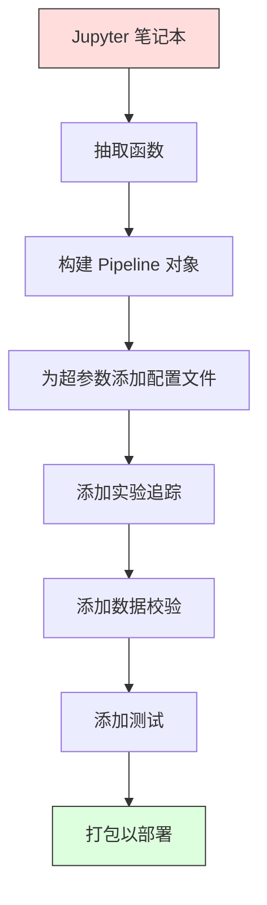

# ML Pipelines

> 模型不是产品。流水线（pipeline）才是。流水线涵盖从原始数据到部署预测的整个过程，每一步都必须可复现。

**Type:** 构建  
**Language:** Python  
**Prerequisites:** 阶段 2，课程 12（超参数调优）  
**Time:** ~120 分钟

## 学习目标

- 从头构建一个 ML 流水线，将插补、缩放、编码和模型训练串成一个可复现的对象  
- 识别数据泄漏场景并解释流水线如何通过仅在训练数据上拟合转换器来防止它们  
- 构建一个 ColumnTransformer，对数值特征和类别特征应用不同的预处理  
- 实现流水线的序列化，并演示同一已拟合流水线在训练和生产中产生相同结果

## 问题背景

你有一个 notebook，加载数据、用中位数填充缺失值、缩放特征、训练模型并打印准确率。一切运行良好。你把它部署了。

一个月后，有人重新训练模型并得到不同的结果。中位数是在包含测试集的完整数据上计算的（数据泄漏）。缩放参数没有被保存，因此推理时使用了不同的统计量。特征工程代码在训练和服务之间被复制粘贴，两个副本逐渐分叉。在生产中某个类别列出现了一个编码器从未见过的新值。

这些都不是假设情形：它们是 ML 系统在生产中失败的最常见原因。流水线通过将每个转换步骤打包为一个有序且可复现的对象来解决所有这些问题。

## 概念

### 什么是流水线

流水线是按顺序的数据转换序列，最后是一个模型。每一步都接受上一部的输出作为输入。整个流水线在训练数据上拟合一次。推理时，同一已拟合流水线转换新数据并产生预测。


流水线保证：
- 转换仅在训练数据上拟合（无泄漏）
- 推理时应用相同的转换
- 整个对象可以序列化并作为一个工件部署
- 交叉验证对每个折叠应用流水线，从而防止细微的泄漏

### 数据泄漏：沉默的杀手

当测试集或未来数据的信息污染训练时，就会发生数据泄漏。流水线可以防止最常见的泄漏形式。

**泄漏（错误示例）：**
```python
X = df.drop("target", axis=1)
y = df["target"]

scaler = StandardScaler()
X_scaled = scaler.fit_transform(X)

X_train, X_test = X_scaled[:800], X_scaled[800:]
y_train, y_test = y[:800], y[800:]
```

这里 scaler 看到了测试数据。均值和标准差包含了测试样本，这会夸大准确率估计。

**正确做法：**
```python
X_train, X_test = X[:800], X[800:]

scaler = StandardScaler()
X_train_scaled = scaler.fit_transform(X_train)
X_test_scaled = scaler.transform(X_test)
```

使用流水线，你不需要手动考虑这些细节。流水线会自动处理。

### sklearn 的 Pipeline

sklearn 的 `Pipeline` 将转换器和估计器串联。它暴露 `.fit()`、`.predict()` 和 `.score()`，按顺序应用所有步骤。

```python
from sklearn.pipeline import Pipeline
from sklearn.preprocessing import StandardScaler
from sklearn.linear_model import LogisticRegression

pipe = Pipeline([
    ("scaler", StandardScaler()),
    ("model", LogisticRegression()),
])

pipe.fit(X_train, y_train)
predictions = pipe.predict(X_test)
```

当你调用 `pipe.fit(X_train, y_train)` 时：
1. Scaler 在 X_train 上调用 `fit_transform`
2. Model 在缩放后的 X_train 上调用 `fit`

当你调用 `pipe.predict(X_test)` 时：
1. Scaler 在 X_test 上调用 `transform`（不是 `fit_transform`）
2. Model 在缩放后的 X_test 上调用 `predict`

Scaler 在拟合时永远不会看到测试数据。这就是关键所在。

### ColumnTransformer：对不同列使用不同流水线

真实数据集包含需要不同预处理的数值列和类别列。`ColumnTransformer` 可以处理这种情况。

```python
from sklearn.compose import ColumnTransformer
from sklearn.preprocessing import StandardScaler, OneHotEncoder
from sklearn.impute import SimpleImputer

numeric_pipe = Pipeline([
    ("impute", SimpleImputer(strategy="median")),
    ("scale", StandardScaler()),
])

categorical_pipe = Pipeline([
    ("impute", SimpleImputer(strategy="most_frequent")),
    ("encode", OneHotEncoder(handle_unknown="ignore")),
])

preprocessor = ColumnTransformer([
    ("num", numeric_pipe, ["age", "income", "score"]),
    ("cat", categorical_pipe, ["city", "gender", "plan"]),
])

full_pipeline = Pipeline([
    ("preprocess", preprocessor),
    ("model", GradientBoostingClassifier()),
])
```

`OneHotEncoder` 中的 `handle_unknown="ignore"` 对生产至关重要。当出现一个新的类别（模型从未见过的城市）时，它会生成零向量而不是崩溃。

### 实验追踪

流水线使训练可复现，但你还需要记录跨实验发生的事情：使用了哪些超参数，数据的哪个版本，指标是多少，运行的代码是什么。

**MLflow** 是最常见的开源解决方案：

```python
import mlflow

with mlflow.start_run():
    mlflow.log_param("max_depth", 5)
    mlflow.log_param("n_estimators", 100)
    mlflow.log_param("learning_rate", 0.1)

    pipe.fit(X_train, y_train)
    accuracy = pipe.score(X_test, y_test)

    mlflow.log_metric("accuracy", accuracy)
    mlflow.sklearn.log_model(pipe, "model")
```

每次运行都会记录参数、指标、工件和完整模型。你可以比较运行、复现实验并部署任何模型版本。

**Weights & Biases (wandb)** 提供类似功能并带有托管仪表盘：

```python
import wandb

wandb.init(project="my-pipeline")
wandb.config.update({"max_depth": 5, "n_estimators": 100})

pipe.fit(X_train, y_train)
accuracy = pipe.score(X_test, y_test)

wandb.log({"accuracy": accuracy})
```

### 模型版本管理

在实验追踪之后，你需要管理模型版本。哪个模型在生产环境？哪个在测试环境（staging）？上周的模型是哪一个？

MLflow 的 Model Registry 提供：
- 版本跟踪：每个保存的模型都有一个版本号
- 阶段转换："Staging"、"Production"、"Archived"
- 审批工作流：模型必须被显式提升到生产
- 回滚：可以即时切换回以前的版本

### 使用 DVC 做数据版本控制

代码用 git 版本管理。数据也应该版本化，但 git 无法处理大文件。DVC（Data Version Control）解决了这个问题。

```
dvc init
dvc add data/training.csv
git add data/training.csv.dvc data/.gitignore
git commit -m "Track training data"
dvc push
```

DVC 将实际数据存储在远程存储（S3、GCS、Azure）中，并在 git 中保留一个小的 `.dvc` 文件来记录哈希。当你检出一个 git 提交时，`dvc checkout` 会恢复用于该提交的精确数据。

这意味着每个 git 提交同时固定了代码和数据，确保完全可复现。

### 可复现的实验

可复现的实验需要四件事：

1. 固定随机种子：为 numpy、random 和框架（如 torch、sklearn）设置种子  
2. 锁定依赖：使用 requirements.txt 或 poetry.lock 指定精确版本  
3. 数据版本化：使用 DVC 或类似工具  
4. 配置文件：所有超参数放在配置中，而不是硬编码

```python
import numpy as np
import random

def set_seed(seed=42):
    random.seed(seed)
    np.random.seed(seed)
    try:
        import torch
        torch.manual_seed(seed)
        torch.cuda.manual_seed_all(seed)
        torch.backends.cudnn.deterministic = True
    except ImportError:
        pass
```

### 从 Notebook 到生产流水线



典型的进展流程：

1. Notebook 探索：快速实验、可视化、特征想法  
2. 抽取函数：将预处理、特征工程、评估抽到模块中  
3. 构建 Pipeline：将转换链入 sklearn `Pipeline` 或自定义类  
4. 配置管理：将所有超参数移到 YAML/JSON 配置中  
5. 实验追踪：添加 MLflow 或 wandb 日志  
6. 数据校验：在训练前检查模式、分布和缺失值模式  
7. 测试：为转换器编写单元测试，为完整流水线编写集成测试  
8. 部署：序列化流水线，封装为 API（FastAPI、Flask），容器化

### 常见的流水线错误

| Mistake | Why it is bad | Fix |
|---------|-------------|-----|
| Fitting on full data before splitting | 数据泄漏 | 使用 Pipeline 与 cross_val_score |
| Feature engineering outside pipeline | 训练与服务时使用不同的转换 | 将所有转换放入 Pipeline |
| Not handling unknown categories | 生产中新值导致崩溃 | OneHotEncoder(handle_unknown="ignore") |
| Hardcoded column names | 架构变化时会破裂 | 从配置中使用列名列表 |
| No data validation | 在错误数据上悄然产生错误预测 | 在预测前添加模式检查 |
| Training/serving skew | Notebook 中有效，但生产中失败 | 在训练和服务中使用同一个 Pipeline 对象 |

## 实现

`code/pipeline.py` 中的代码从头构建了一个完整的 ML 流水线：

### 步骤 1：自定义转换器

```python
class CustomTransformer:
    def __init__(self):
        self.means = None
        self.stds = None

    def fit(self, X):
        self.means = np.mean(X, axis=0)
        self.stds = np.std(X, axis=0)
        self.stds[self.stds == 0] = 1.0
        return self

    def transform(self, X):
        return (X - self.means) / self.stds

    def fit_transform(self, X):
        return self.fit(X).transform(X)
```

### 步骤 2：从头实现 Pipeline

```python
class PipelineFromScratch:
    def __init__(self, steps):
        self.steps = steps

    def fit(self, X, y=None):
        X_current = X.copy()
        for name, step in self.steps[:-1]:
            X_current = step.fit_transform(X_current)
        name, model = self.steps[-1]
        model.fit(X_current, y)
        return self

    def predict(self, X):
        X_current = X.copy()
        for name, step in self.steps[:-1]:
            X_current = step.transform(X_current)
        name, model = self.steps[-1]
        return model.predict(X_current)
```

### 步骤 3：带流水线的交叉验证

代码演示了如何通过在每个折叠的训练数据上单独拟合缩放器来防止数据泄漏。

### 步骤 4：使用 sklearn 构建完整生产流水线

一个完整的流水线包含 `ColumnTransformer`、多条预处理路径以及模型，使用适当的交叉验证和实验追踪进行训练。

## 部署输出

本课会产出：
- `outputs/prompt-ml-pipeline.md` -- 一个关于构建和调试 ML 流水线的技能文档  
- `code/pipeline.py` -- 一个从头实现直到使用 sklearn 的完整流水线

## 练习

1. 构建一个流水线，处理包含 3 个数值列和 2 个类别列的数据集。使用 `ColumnTransformer` 对数值列应用中位数插补 + 缩放，对类别列应用众数插补 + one-hot 编码。使用 5 折交叉验证训练。  
2. 故意引入数据泄漏：在划分之前在整个数据集上拟合缩放器。比较（泄漏）交叉验证得分与（正确）流水线交叉验证得分。差别有多大？  
3. 使用 `joblib.dump` 序列化你的流水线。在一个单独的脚本中加载并运行预测。验证预测结果是否完全相同。  
4. 向流水线添加一个自定义转换器，为两个最重要的数值列创建二次多项式特征（degree=2）。它应该放在流水线的哪个位置？  
5. 为流水线设置 MLflow 追踪。用不同超参数运行 5 次实验。使用 MLflow UI（`mlflow ui`）比较运行并选出最佳模型。

## 关键词

| Term | 人们常说 | 实际含义 |
|------|---------|---------|
| Pipeline | "变换链 + 模型" | 一个有序的拟合转换器序列和一个模型，作为一个整体应用以防止泄漏 |
| Data leakage | "测试信息泄露到训练中" | 使用训练集外的信息来构建模型，导致性能评估被夸大 |
| ColumnTransformer | "对不同列采用不同预处理" | 对不同子集的列应用不同的流水线并组合结果 |
| Experiment tracking | "记录你的运行" | 为每次训练运行记录参数、指标、工件和代码版本 |
| MLflow | "追踪并部署模型" | 一个用于实验追踪、模型注册和部署的开源平台 |
| DVC | "给数据做 git" | 针对大数据文件的版本控制系统，在 git 中保存哈希并将数据存储在远程存储 |
| Model registry | "模型版本目录" | 跟踪模型版本并带有阶段标签（staging、production、archived）的系统 |
| Training/serving skew | "Notebook 中可行" | 训练与推理时数据处理方式的差异，会导致悄然的错误 |
| Reproducibility | "相同代码得到相同结果" | 在相同代码、数据和配置下获取相同结果的能力 |

## 深入阅读

- [scikit-learn Pipeline docs](https://scikit-learn.org/stable/modules/compose.html) -- 官方的流水线参考  
- [MLflow documentation](https://mlflow.org/docs/latest/index.html) -- 实验追踪与模型注册  
- [DVC documentation](https://dvc.org/doc) -- 数据版本控制文档  
- [Sculley et al., Hidden Technical Debt in Machine Learning Systems (2015)](https://papers.nips.cc/paper/2015/hash/86df7dcfd896fcaf2674f757a2463eba-Abstract.html) -- 关于 ML 系统复杂性的奠基论文  
- [Google ML Best Practices: Rules of ML](https://developers.google.com/machine-learning/guides/rules-of-ml) -- Google 的实用生产级 ML 建议