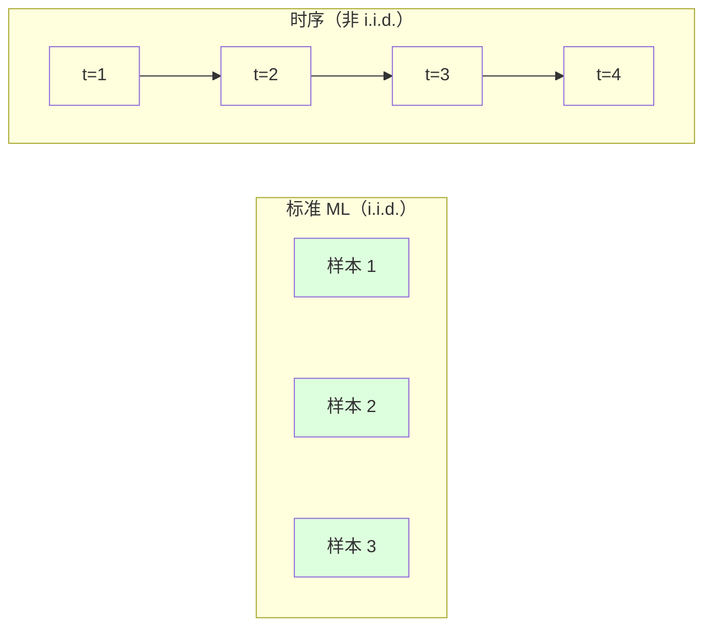
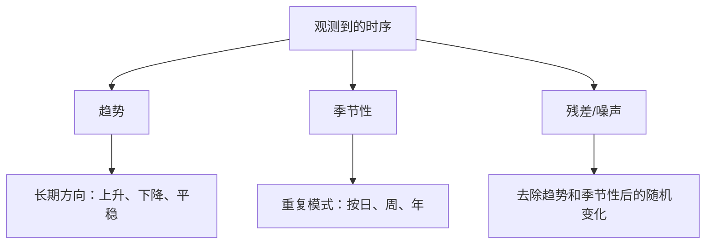
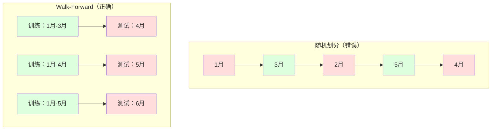

# 时序基础

> 过去的表现确实能预测未来结果 —— 前提是你先检查平稳性。

**Type:** 构建
**Language:** Python
**Prerequisites:** Phase 2, Lessons 01-09
**Time:** ~90 分钟

## 学习目标

- 将时序分解为趋势、季节性和残差组件，并测试平稳性
- 实现滞后特征和滚动统计，将时序转换为监督学习问题
- 构建防止未来数据泄露到训练中的 walk-forward 验证框架
- 解释为什么随机训练/测试划分对时序无效，并展示与正确时间划分的性能差距

## 问题背景

你有按时间排序的数据。每日销售、每小时温度、每分钟的 CPU 使用率、每周股票价格。你想预测下一个值、下一周、下一个季度。

你可能会拿出常规的 ML 工具箱：随机训练/测试划分、交叉验证、特征矩阵输入、预测输出。每一步都可能错。

时序数据违反了标准 ML 的假设。样本不是独立的 —— 今天的温度依赖于昨天的。随机划分会把未来信息泄露到过去。看起来在回测中表现很好的特征，在生产中会失败，因为它们依赖随时间变化的模式。

一个模型在随机交叉验证中得到 95% 的准确率，在正确的时间序列评估下可能只有 55%。差异不是技术细节，而是“纸上工作”和“可部署工作”之间的差别。

本课涵盖基础知识：是什么让时间数据不同、如何诚实评估模型，以及如何把时序变成标准 ML 模型可以消费的特征。

## 概念

### 时序与众不同之处

标准 ML 假设 i.i.d. —— 独立同分布。每个样本都是从相同分布独立抽取的。时序同时违背两点：

- **非独立。** 今天的股价依赖于昨天。本周的销售与上周相关。
- **非同分布。** 分布随时间变化。12 月的销售与 3 月的销售看起来不同。

这些违反并非小事。它们改变了你如何构建特征、如何评估模型以及哪些算法适用。



在标准 ML 中，样本可互换。打乱它们什么都不会改变。在时序中，顺序就是一切。打乱会破坏信号。

### 时序的组成部分

每个时序都是以下内容的组合：



- **趋势**：长期方向。例如年收入增长 10%，全球气温上升。
- **季节性**：在固定间隔重复的模式。例如零售在 12 月激增，空调使用在 7 月达到峰值。
- **残差**：去除趋势和季节性后剩下的部分。如果残差看起来像白噪声，说明分解捕获了信号。

### 平稳性

如果一个时序的统计属性（均值、方差、自相关）随时间不变，则称为平稳。大多数预测方法假设平稳性。

为什么重要：非平稳序列的均值会漂移。在 1 月训练的模型学到的均值与 2 月的实际均值不同，会产生系统性偏差。

如何检查：计算滑动均值和滑动标准差（rolling mean/std）。如果它们漂移，说明序列非平稳。

如何修复：差分（differencing）。不是建模原始值，而是建模相邻值之间的变化：

```
diff[t] = value[t] - value[t-1]
```

如果一次差分不能使序列平稳，就再差分一次（二阶差分）。大多数真实序列最多需要两次差分。

示例：

原始序列: [100, 102, 106, 112, 120]
一次差分:  [2, 4, 6, 8]（仍在上升）
二次差分:  [2, 2, 2]（恒定 —— 平稳）

原始序列有二次趋势。一次差分变为线性趋势。二次差分变为平稳。实际中你很少需要超过两次差分。

正式检验：Augmented Dickey-Fuller (ADF) 测试是平稳性的标准统计检验。原假设是“序列非平稳”。p 值低于 0.05 表明可以拒绝原假设并认为序列平稳。本课不从头实现 ADF（它需要渐近分布表），但我们的滚动统计方法在代码中提供了实用的可视化检查。

### 自相关

自相关衡量时刻 t 的值与时刻 t-k（k 步之前）的值相关程度。自相关函数（ACF）绘制各滞后 k 的相关系数。

ACF 告诉你：
- 序列记忆多久。如果 ACF 在滞后 5 后降为零，超过 5 步之前的值就无关紧要。
- 是否存在季节性。如果 ACF 在滞后 12（按月数据）处有峰值，则存在年度季节性。
- 需要构造多少滞后特征。使用 ACF 在变得可忽略的位置为止的滞后。

PACF（部分自相关函数）移除了间接相关。如果今天与三天前相关仅仅因为它们都与昨天相关，滞后 3 的 PACF 将为零，而 ACF 在滞后 3 处不会为零。

### 滞后特征：将时序变为监督学习

标准 ML 模型需要特征矩阵 X 和目标 y。时序只给出一列值。桥梁是滞后特征。

取序列 [10, 12, 14, 13, 15] 并创建滞后 1 和滞后 2 特征：

| lag_2 | lag_1 | target |
|-------|-------|--------|
| 10    | 12    | 14     |
| 12    | 14    | 13     |
| 14    | 13    | 15     |

现在你有了标准的回归问题。任何 ML 模型（线性回归、随机森林、梯度提升）都可以用滞后预测目标。

你可以设计的附加特征：
- **滚动统计**：过去 k 个值的均值、标准差、最小、最大值
- **日历特征**：周几、月份、是否节假日、是否周末
- **差分值**：与前一步的变化
- **扩展统计**：累积均值、累积和
- **比率特征**：当前值 / 滚动均值（与近期均值的偏离）
- **交互特征**：lag_1 * day_of_week（工作日对动量的影响）

多少滞后？使用自相关函数。如果 ACF 在滞后 10 之前显著，至少使用 10 个滞后。如果存在周季节性，包含滞后 7（可能还有 14）。更多滞后给模型更多历史，但也增加特征数量和过拟合风险。

目标对齐陷阱。创建滞后特征时，目标必须是时间 t 的值，所有特征必须使用时间 t-1 或更早的值。如果不小心在特征中包含了时间 t 的值，你将得到一个完美预测器 —— 也就是毫无用处的模型。这是时序特征工程中最常见的错误。

### Walk-Forward 验证

这是本课最重要的概念。标准的 k 折交叉验证会随机把样本分配到训练和测试。对于时序，这会泄露未来信息。



Walk-forward 验证：
1. 在时间 t 之前的数据上训练
2. 预测时间 t+1（或 t+1 到 t+k 的多步预测）
3. 向前滑动窗口
4. 重复

每个测试折只包含在所有训练数据之后发生的数据。没有未来泄露。这能给你部署时模型性能的诚实估计。

**扩展窗口（Expanding window）** 使用全部历史数据进行训练（窗口增长）。**滑动窗口（Sliding window）** 使用固定大小的训练窗口（窗口滑动）。当你认为较旧数据仍然有用时使用扩展窗口；当世界变化、旧数据有害时使用滑动窗口。

### ARIMA 直觉

ARIMA 是经典的时序模型。它有三个部分：

- **AR（自回归）**：从过去值预测。AR(p) 使用最近 p 个值。
- **I（差分）**：通过差分达到平稳。I(d) 做 d 次差分。
- **MA（移动平均）**：从过去的预测误差中预测。MA(q) 使用最近 q 个误差。

ARIMA(p, d, q) 结合了三者。你可以根据 ACF/PACF 分析或自动搜索（auto-ARIMA）选 p、d、q。

我们不会从头实现 ARIMA —— 它需要数值优化，超出本课范围。关键是理解每个组件的作用，以便解释 ARIMA 结果并知道何时使用它。

### 何时使用何种方法

| 方法 | 最适用场景 | 处理季节性 | 处理外部特征 |
|------|-----------|-----------|--------------|
| 滞后特征 + ML | 带有大量外部特征的表格化问题 | 与日历特征结合可处理 | 是 |
| ARIMA | 单变量短期序列 | SARIMA 变体可处理 | 否（有限支持可用 ARIMAX） |
| 指数平滑 | 简单的趋势 + 季节性 | 是（Holt-Winters） | 否 |
| Prophet | 业务预测、节假日影响 | 是（傅里叶项） | 有限 |
| 神经网络（LSTM、Transformer） | 长序列、大量序列 | 可学习季节性 | 是 |

对于大多数实际问题，滞后特征 + 梯度提升是最强的起点。它自然处理外部特征，不要求平稳性，且易于调试。

### 预测视距与策略

单步预测预测一步之后。多步预测预测多个步长。有三种策略：

递归（Recursive / iterated）：预测一步，用预测作为下一步的输入。简单但误差会累积 —— 每个预测都使用上一步的预测，错误会放大。

直接（Direct）：为每个视距训练单独模型。Model-1 预测 t+1，Model-5 预测 t+5。没有误差累积，但每个模型的训练样本更少，且无法共享信息。

多输出（Multi-output）：训练一个同时输出所有视距的模型。跨视距共享信息，但要求模型支持多输出（或自定义损失函数）。

对于大多数实际问题：短期（1-5 步）先用递归；长期用直接。

### 时序常见错误

| 错误 | 为什么会发生 | 如何修复 |
|------|-------------|----------|
| 随机训练/测试划分 | 来自标准 ML 的习惯 | 使用 walk-forward 或时间划分 |
| 使用未来特征 | 错把时间 t 的特征加入 | 审计每个特征的时间对齐 |
| 过拟合季节性 | 模型记住日历模式 | 在测试集中保留完整的季节周期 |
| 忽视尺度变化 | 收入翻倍但模式不变 | 建模相对变化（百分比）而不是绝对值 |
| 滞后特征过多 | “更多历史更好” | 用 ACF 确定相关滞后 |
| 不做差分 | “模型会学会的” | 树模型能处理趋势；线性模型需要平稳 |

## 实现

`code/time_series.py` 中的代码从零实现了核心构建块。

### 滞后特征生成器

```python
def make_lag_features(series, n_lags):
    n = len(series)
    X = np.full((n, n_lags), np.nan)
    for lag in range(1, n_lags + 1):
        X[lag:, lag - 1] = series[:-lag]
    valid = ~np.isnan(X).any(axis=1)
    return X[valid], series[valid]
```

这会把一维序列转换为特征矩阵，每行包含过去 `n_lags` 个值作为特征，当前值作为目标。

### Walk-Forward 交叉验证

```python
def walk_forward_split(n_samples, n_splits=5, min_train=50):
    assert min_train < n_samples, "min_train must be less than n_samples"
    step = max(1, (n_samples - min_train) // n_splits)
    for i in range(n_splits):
        train_end = min_train + i * step
        test_end = min(train_end + step, n_samples)
        if train_end >= n_samples:
            break
        yield slice(0, train_end), slice(train_end, test_end)
```

每个划分都确保训练数据严格在测试数据之前。训练窗口随着每折增加（扩展窗口示例）。

### 简单双自回归模型（AR）

纯 AR 模型只是对滞后特征做线性回归：

```python
class SimpleAR:
    def __init__(self, n_lags=5):
        self.n_lags = n_lags
        self.weights = None
        self.bias = None

    def fit(self, series):
        X, y = make_lag_features(series, self.n_lags)
        # 通过正规方程求解
        X_b = np.column_stack([np.ones(len(X)), X])
        theta = np.linalg.lstsq(X_b, y, rcond=None)[0]
        self.bias = theta[0]
        self.weights = theta[1:]
        return self
```

这在概念上与第 02 课的线性回归相同，但应用于同一变量的滞后版本。

### 平稳性检查

代码计算滚动统计以可视化和数值化评估平稳性：

```python
def check_stationarity(series, window=50):
    rolling_mean = np.array([
        series[max(0, i - window):i].mean()
        for i in range(1, len(series) + 1)
    ])
    rolling_std = np.array([
        series[max(0, i - window):i].std()
        for i in range(1, len(series) + 1)
    ])
    return rolling_mean, rolling_std
```

如果滚动均值漂移或滚动标准差变化，序列就是非平稳的。对序列做差分并再次检查。

代码还通过比较序列的前半部分和后半部分来检查平稳性。如果均值相差超过半个标准差或方差比超过 2 倍，序列将被标记为非平稳。

### 自相关

```python
def autocorrelation(series, max_lag=20):
    n = len(series)
    mean = series.mean()
    var = series.var()
    acf = np.zeros(max_lag + 1)
    for k in range(max_lag + 1):
        cov = np.mean((series[:n-k] - mean) * (series[k:] - mean))
        acf[k] = cov / var if var > 0 else 0
    return acf
```

## 使用方法

在 sklearn 中，你可以把滞后特征直接和任意回归器一起使用：

```python
from sklearn.linear_model import Ridge
from sklearn.ensemble import GradientBoostingRegressor

X, y = make_lag_features(series, n_lags=10)

for train_idx, test_idx in walk_forward_split(len(X)):
    model = Ridge(alpha=1.0)
    model.fit(X[train_idx], y[train_idx])
    predictions = model.predict(X[test_idx])
```

对于 ARIMA，使用 statsmodels：

```python
from statsmodels.tsa.arima.model import ARIMA

model = ARIMA(train_series, order=(5, 1, 2))
fitted = model.fit()
forecast = fitted.forecast(steps=30)
```

`time_series.py` 中的代码演示了这两种方法，并使用 walk-forward 验证进行比较。

### sklearn 的 TimeSeriesSplit

sklearn 提供了 `TimeSeriesSplit`，实现了 walk-forward 验证：

```python
from sklearn.model_selection import TimeSeriesSplit

tscv = TimeSeriesSplit(n_splits=5)
for train_index, test_index in tscv.split(X):
    X_train, X_test = X[train_index], X[test_index]
    y_train, y_test = y[train_index], y[test_index]
    model.fit(X_train, y_train)
    score = model.score(X_test, y_test)
```

这与我们从零实现的 `walk_forward_split` 等价，但集成在 sklearn 的交叉验证框架中。你可以把它和 `cross_val_score` 一起使用：

```python
from sklearn.model_selection import cross_val_score

scores = cross_val_score(model, X, y, cv=TimeSeriesSplit(n_splits=5))
print(f"Mean score: {scores.mean():.4f} +/- {scores.std():.4f}")
```

### 评估指标

时序预测使用回归指标，但要结合时间敏感性：

- **MAE（平均绝对误差）**：|y_true - y_pred| 的平均值。易于在原始单位下解释。“平均而言，预测误差为 3.2 度”。
- **RMSE（均方根误差）**：均方误差的平方根。比 MAE 对大误差惩罚更重。当大误差比多个小误差更糟时使用。
- **MAPE（平均绝对百分比误差）**：平均的 |误差 / 真实值| * 100。与规模无关，适合不同序列间比较。但当真实值为 0 时无定义。
- **朴素基线比较**：始终与简单基线比较。季节性朴素基线预测来自一个周期之前的值（昨天、上周）。如果模型赢不过朴素基线，说明有问题。

### 滚动特征

代码演示了如何将滚动统计（7 天和 14 天窗口的均值、标准差、最小、最大）加入滞后特征。这些特征为模型提供关于近期趋势与波动的信息，而仅用滞后特征无法捕获这些信息。

例如，如果滚动均值在上升，说明存在上升趋势。如果滚动标准差在增加，说明波动性在增大。这些模式是基于树的模型能学习的，但线性模型通常无法捕获。

## 部署建议

本课产出：
- `outputs/prompt-time-series-advisor.md` -- 用于构建时序问题的提示模板
- `code/time_series.py` -- 滞后特征、walk-forward 验证、AR 模型、平稳性检查

### 你必须超过的基线

在构建任何模型之前，先建立基线：

1. **最后值（持久性基线）。** 预测明天等于今天。对许多序列来说，这个基线很难被超过。
2. **季节性朴素。** 预测今天等于上周同一天（或去年同一天）。如果模型不能打败这个基线，说明它没有学到超越季节性的有用模式。
3. **移动平均。** 预测最近 k 个值的平均。平滑噪声但不能捕捉突变。

如果你的花哨 ML 模型输给了季节性朴素基线，说明有 bug。最常见的原因：特征中有未来泄露、评估方法错误，或序列确实是随机且不可预测的。

### 实用建议

1. **先画图。** 在建模前，绘制原始序列。寻找趋势、季节性、异常值、结构性断点（行为的突然变化）。30 秒的可视化检查往往比一小时的自动分析更有用。
2. **先差分，后建模。** 如果序列有明显趋势，先差分再创建滞后特征。树模型能处理趋势，但线性模型不能；差分不会有害。
3. **至少保留一个完整的季节周期。** 如果有周季节性，测试集至少需要一整周；若是月季节性，至少一个月。否则无法评估模型是否捕获季节模式。
4. **在生产中监控。** 随着世界变化，时序模型会退化。按滑动窗口追踪预测误差。当误差开始增加时，用最近数据重训练模型。
5. **当心制度性变化（regime changes）。** 在疫情前训练的模型无法预测疫情后的行为。将已知的制度性变化指示器作为特征，或使用忘记旧数据的滑动窗口。
6. **对偏斜序列取对数。** 收入、价格、计数通常右偏。取对数能稳定方差并将乘法模式变为加法，使线性模型更易处理。在对数空间预测，再指数反变换回原单位。

## 练习

1. 平稳性实验。生成具有线性趋势的序列。用滚动统计检查平稳性。做一次差分。再次检查。二次趋势需要多少次差分？
2. 滞后选择。在周期为 7 的季节性序列上计算 ACF。哪些滞后具有最高自相关？仅使用那些滞后（而非连续滞后）创建滞后特征。与使用滞后 1 到 7 比较，准确率是否提升？
3. Walk-forward 与随机划分。用滞后特征训练 Ridge 回归。用随机 80/20 划分和 walk-forward 验证进行评估。随机划分高估了多少性能？
4. 特征工程。向滞后特征添加滚动均值（窗口=7）、滚动标准差（窗口=7）和周几特征。使用 walk-forward 验证比较有无这些额外特征的准确率。
5. 多步预测。修改 AR 模型以预测 5 步而不是 1 步。比较两种策略：（a）递归（每次预测一步并把预测作为下一步输入），（b）直接（为每个视距训练独立模型）。哪种更准确？

## 术语表

| 术语 | 人们怎么说 | 实际含义 |
|------|-----------|---------|
| 平稳性（Stationarity） | “统计量随时间不变” | 均值、方差和自相关结构随时间保持稳定的序列 |
| 差分（Differencing） | “相邻值相减” | 计算 y[t] - y[t-1] 以去除趋势并达到平稳 |
| 自相关（ACF） | “序列与自身的相关性” | 时序与其滞后副本之间的相关性，作为滞后函数 |
| 部分自相关（PACF） | “仅直接相关” | 在移除所有更短滞后影响后，滞后 k 的自相关 |
| 滞后特征（Lag features） | “过去值作为输入” | 使用 y[t-1], y[t-2], ..., y[t-k] 作为预测 y[t] 的特征 |
| Walk-forward 验证 | “尊重时间的交叉验证” | 训练数据始终在时间上早于测试数据的评估方式 |
| ARIMA | “经典时序模型” | 自回归-差分-移动平均：结合过去值（AR）、差分（I）和过去误差（MA） |
| 季节性（Seasonality） | “重复的日历模式” | 与日历周期（按日、周、年）相关的可预测周期性 |
| 趋势（Trend） | “长期方向” | 序列水平随时间持续上升或下降 |
| 扩展窗口（Expanding window） | “使用全部历史” | walk-forward 验证中训练集随折数增长的策略 |
| 滑动窗口（Sliding window） | “固定长度历史” | walk-forward 验证中训练集为固定长度并向前滑动的策略 |

## 延伸阅读

- [Hyndman 和 Athanasopoulos，《Forecasting: Principles and Practice（第 3 版）》](https://otexts.com/fpp3/) —— 最好的免费时序预测教科书
- [scikit-learn Time Series Split](https://scikit-learn.org/stable/modules/generated/sklearn.model_selection.TimeSeriesSplit.html) —— sklearn 的 walk-forward 划分器
- [statsmodels ARIMA 文档](https://www.statsmodels.org/stable/generated/statsmodels.tsa.arima.model.ARIMA.html) —— 带诊断的 ARIMA 实现
- [Makridakis et al., The M5 Competition (2022)](https://www.sciencedirect.com/science/article/pii/S0169207021001874) —— 大规模预测竞赛，展示 ML 方法与统计方法的比较