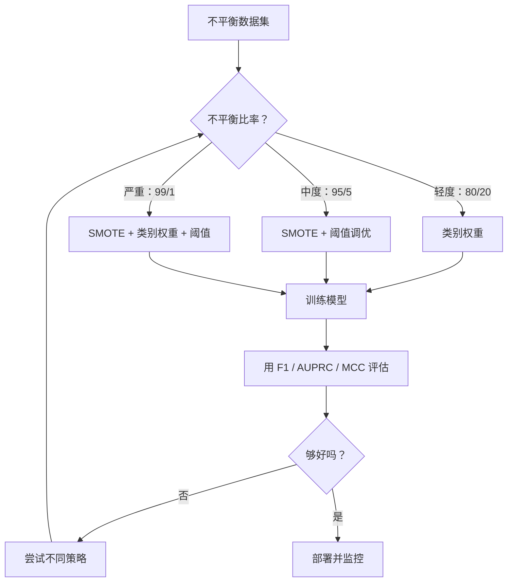
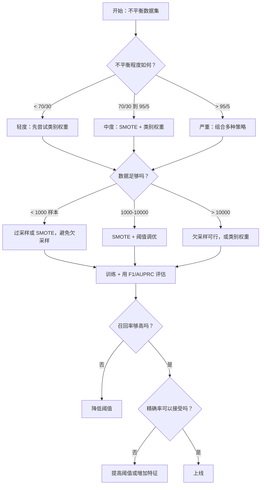

# 处理不平衡数据

> 当 99% 的数据是“正常”的时候，准确率就是个谎言。

**Type:** Build  
**Language:** Python  
**Prerequisites:** 阶段 2，课程 01-09（尤其是评估指标）  
**Time:** ~90 分钟

## 学习目标

- 从头实现 SMOTE 并解释合成过采样与随机复制的不同之处  
- 使用 F1、AUPRC 和 Matthews Correlation Coefficient（而非准确率）评估不平衡分类器  
- 比较类别权重、阈值调优和重采样策略，并为给定不平衡比选择合适的方法  
- 构建一个完整的不平衡数据流水线，结合 SMOTE、类别权重和阈值优化

## 问题描述

你建立了一个欺诈检测模型。它获得了 99.9% 的准确率。你很高兴。然后你意识到它对每一笔交易都预测为“非欺诈”。

这不是一个 bug。当只有 0.1% 的交易是欺诈时，总是猜测多数类在总体上最小化错误是理性的。模型学会了总是猜测多数类来最小化整体错误。这在技术上是正确的，但完全无用。

在所有真正需要分类的场景中都会发生这种情况。疾病诊断：1% 阳性率。网络入侵：0.01% 攻击。制造缺陷：0.5% 次品。垃圾邮件过滤：20% 垃圾邮件。客户流失预测：5% 流失者。少数类越重要，通常越稀少。

准确率会失败，因为它把所有正确预测视为同等重要。把一笔正常交易标记正确和抓到一笔欺诈都各算一分。但抓住欺诈才是模型存在的全部理由。我们需要指标、技术和训练策略来迫使模型关注这些少见但重要的类别。

## 概念

### 为什么准确率会失败

考虑一个包含 1000 个样本的数据集：990 个负样本，10 个正样本。一个总是预测为负的模型：

|  | Predicted Positive | Predicted Negative |
|--|---|---|
| Actually Positive | 0 (TP) | 10 (FN) |
| Actually Negative | 0 (FP) | 990 (TN) |

Accuracy = (0 + 990) / 1000 = 99.0%

模型捕捉不到任何欺诈，零的疾病，零的缺陷。但准确率显示 99%。这就是为什么在不平衡问题上准确率是危险的。

### 更好的指标

Precision = TP / (TP + FP)。在所有被标记为正的样本中，有多少是真正的正样本？高精确率意味着误报少。

Recall = TP / (TP + FN)。在所有实际为正的样本中，我们捕捉到了多少？高召回率意味着漏报少。

F1 Score = 2 * precision * recall / (precision + recall)。调和平均数。比算术平均对精确率和召回率之间的极端不平衡惩罚更重。

F-beta Score = (1 + beta^2) * precision * recall / (beta^2 * precision + recall)。当 beta > 1 时更看重召回；当 beta < 1 时更看重精确率。F2 在欺诈检测中常用（漏掉欺诈比误报更糟）。

AUPRC (Area Under Precision-Recall Curve)。类似于 AUC-ROC，但对不平衡数据更有信息量。随机分类器的 AUPRC 等于正类比率（而不是 ROC 的 0.5）。这使改进更容易观察到。

Matthews Correlation Coefficient = (TP * TN - FP * FN) / sqrt((TP+FP)(TP+FN)(TN+FP)(TN+FN))。范围从 -1 到 +1。只有当模型在两个类别上都表现好时才会给出高分。在类别大小非常不同时仍然保持平衡。

对于上面“总是预测为负”的模型：precision = 0/0（未定义，通常设为 0），recall = 0/10 = 0，F1 = 0，MCC = 0。这些指标正确地识别了该模型的无用性。

### 不平衡数据流水线



### SMOTE：合成少数类过采样技术

随机过采样会复制现有少数类样本。该方法有效但存在过拟合风险，因为模型会多次看到完全相同的点。

SMOTE 创建新的合成少数类样本，这些样本看起来合理但不是拷贝。算法步骤：

1. 对于每个少数类样本 x，找到其他少数类样本中与其最近的 k 个邻居  
2. 随机选择一个邻居  
3. 在 x 与该邻居之间的线段上创建一个新样本

公式：`new_sample = x + random(0, 1) * (neighbor - x)`

这在真实的少数类点之间进行插值，在特征空间的相同区域生成样本，而不是简单地复制现有数据。


### 采样策略比较

Random Oversampling（随机过采样）：复制少数类样本以匹配多数类数量。  
- 优点：简单，不丢失信息  
- 缺点：完全相同的副本会导致过拟合，增加训练时间

Random Undersampling（随机欠采样）：删除多数类样本以匹配少数类数量。  
- 优点：训练快，简单  
- 缺点：丢弃可能有用的多数类数据，方差更高

SMOTE：通过插值创建合成的少数类样本。  
- 优点：生成新的数据点，相比随机过采样减少过拟合  
- 缺点：可能在决策边界附近产生噪声样本，不考虑多数类的分布

| Strategy | Data Changed | Risk | When to Use |
|----------|-------------|------|-------------|
| Oversample | Minority duplicated | Overfitting | Small datasets, moderate imbalance |
| Undersample | Majority removed | Information loss | Large datasets, want fast training |
| SMOTE | Synthetic minority added | Boundary noise | Moderate imbalance, enough minority samples for k-NN |

### 类别权重

与其改变数据，不如改变模型对错误的看法。为少数类的误分类分配更高的权重。

对于一个包含 950 个负样本和 50 个正样本的二分类问题：  
- 负类权重 = n_samples / (2 * n_negative) = 1000 / (2 * 950) = 0.526  
- 正类权重 = n_samples / (2 * n_positive) = 1000 / (2 * 50) = 10.0

正类获得了 19 倍的权重。误分类一个正样本的代价等于误分类 19 个负样本的代价。模型被迫关注少数类。

在逻辑回归中，这会修改损失函数：

```
weighted_loss = -sum(w_i * [y_i * log(p_i) + (1-y_i) * log(1-p_i)])
```

其中 w_i 取决于样本 i 的类别。

类别权重在期望上与过采样在数学上等价，但无需创建新数据点。这使得它们更快，并避免了重复样本导致的过拟合风险。

### 阈值调优

大多数分类器会输出概率。默认阈值是 0.5：如果 P(positive) >= 0.5，则预测为正。但 0.5 是任意的。在类别不平衡时，最优阈值通常远小于 0.5。

流程：  
1. 训练模型  
2. 在验证集上获取预测概率  
3. 在 0.0 到 1.0 之间遍历阈值  
4. 计算每个阈值处的 F1（或你选择的指标）  
5. 选择使指标最大的阈值


一个模型可能对一笔欺诈交易输出 P(fraud) = 0.15。在阈值 0.5 下，这被分类为非欺诈；在阈值 0.10 下，它被正确捕捉到。概率校准不如排序重要——只要欺诈的概率高于非欺诈，就存在一个阈值可以分离它们。

### 成本敏感学习

类别权重的一般化。不是统一成本，而是为不同的误分类分配特定成本：

| | Predict Positive | Predict Negative |
|--|---|---|
| Actually Positive | 0 (正确) | C_FN = 100 |
| Actually Negative | C_FP = 1 | 0 (正确) |

错过一笔欺诈交易（FN）的代价是误报（FP）的 100 倍。模型优化的是总成本，而不是总错误数。

当你能估计现实世界的成本时，这是最有原则的方法。错过癌症诊断的代价与导致额外活检的误报截然不同。明确这些成本可以迫使模型做出正确的权衡。

### 决策流程图



```figure
class-imbalance
```

## 实现

### 第 1 步：生成不平衡数据集

```python
import numpy as np


def make_imbalanced_data(n_majority=950, n_minority=50, seed=42):
    rng = np.random.RandomState(seed)

    X_maj = rng.randn(n_majority, 2) * 1.0 + np.array([0.0, 0.0])
    X_min = rng.randn(n_minority, 2) * 0.8 + np.array([2.5, 2.5])

    X = np.vstack([X_maj, X_min])
    y = np.concatenate([np.zeros(n_majority), np.ones(n_minority)])

    shuffle_idx = rng.permutation(len(y))
    return X[shuffle_idx], y[shuffle_idx]
```

### 第 2 步：从头实现 SMOTE

```python
def euclidean_distance(a, b):
    return np.sqrt(np.sum((a - b) ** 2))


def find_k_neighbors(X, idx, k):
    distances = []
    for i in range(len(X)):
        if i == idx:
            continue
        d = euclidean_distance(X[idx], X[i])
        distances.append((i, d))
    distances.sort(key=lambda x: x[1])
    return [d[0] for d in distances[:k]]


def smote(X_minority, k=5, n_synthetic=100, seed=42):
    rng = np.random.RandomState(seed)
    n_samples = len(X_minority)
    k = min(k, n_samples - 1)
    synthetic = []

    for _ in range(n_synthetic):
        idx = rng.randint(0, n_samples)
        neighbors = find_k_neighbors(X_minority, idx, k)
        neighbor_idx = neighbors[rng.randint(0, len(neighbors))]
        t = rng.random()
        new_point = X_minority[idx] + t * (X_minority[neighbor_idx] - X_minority[idx])
        synthetic.append(new_point)

    return np.array(synthetic)
```

### 第 3 步：随机过采样和欠采样

```python
def random_oversample(X, y, seed=42):
    rng = np.random.RandomState(seed)
    classes, counts = np.unique(y, return_counts=True)
    max_count = counts.max()

    X_resampled = list(X)
    y_resampled = list(y)

    for cls, count in zip(classes, counts):
        if count < max_count:
            cls_indices = np.where(y == cls)[0]
            n_needed = max_count - count
            chosen = rng.choice(cls_indices, size=n_needed, replace=True)
            X_resampled.extend(X[chosen])
            y_resampled.extend(y[chosen])

    X_out = np.array(X_resampled)
    y_out = np.array(y_resampled)
    shuffle = rng.permutation(len(y_out))
    return X_out[shuffle], y_out[shuffle]


def random_undersample(X, y, seed=42):
    rng = np.random.RandomState(seed)
    classes, counts = np.unique(y, return_counts=True)
    min_count = counts.min()

    X_resampled = []
    y_resampled = []

    for cls in classes:
        cls_indices = np.where(y == cls)[0]
        chosen = rng.choice(cls_indices, size=min_count, replace=False)
        X_resampled.extend(X[chosen])
        y_resampled.extend(y[chosen])

    X_out = np.array(X_resampled)
    y_out = np.array(y_resampled)
    shuffle = rng.permutation(len(y_out))
    return X_out[shuffle], y_out[shuffle]
```

### 第 4 步：带类别权重的逻辑回归

```python
def sigmoid(z):
    return 1.0 / (1.0 + np.exp(-np.clip(z, -500, 500)))


def logistic_regression_weighted(X, y, weights, lr=0.01, epochs=200):
    n_samples, n_features = X.shape
    w = np.zeros(n_features)
    b = 0.0

    for _ in range(epochs):
        z = X @ w + b
        pred = sigmoid(z)
        error = pred - y
        weighted_error = error * weights

        gradient_w = (X.T @ weighted_error) / n_samples
        gradient_b = np.mean(weighted_error)

        w -= lr * gradient_w
        b -= lr * gradient_b

    return w, b


def compute_class_weights(y):
    classes, counts = np.unique(y, return_counts=True)
    n_samples = len(y)
    n_classes = len(classes)
    weight_map = {}
    for cls, count in zip(classes, counts):
        weight_map[cls] = n_samples / (n_classes * count)
    return np.array([weight_map[yi] for yi in y])
```

### 第 5 步：阈值调优

```python
def find_optimal_threshold(y_true, y_probs, metric="f1"):
    best_threshold = 0.5
    best_score = -1.0

    for threshold in np.arange(0.05, 0.96, 0.01):
        y_pred = (y_probs >= threshold).astype(int)
        tp = np.sum((y_pred == 1) & (y_true == 1))
        fp = np.sum((y_pred == 1) & (y_true == 0))
        fn = np.sum((y_pred == 0) & (y_true == 1))

        if metric == "f1":
            precision = tp / (tp + fp) if (tp + fp) > 0 else 0.0
            recall = tp / (tp + fn) if (tp + fn) > 0 else 0.0
            score = 2 * precision * recall / (precision + recall) if (precision + recall) > 0 else 0.0
        elif metric == "recall":
            score = tp / (tp + fn) if (tp + fn) > 0 else 0.0
        elif metric == "precision":
            score = tp / (tp + fp) if (tp + fp) > 0 else 0.0

        if score > best_score:
            best_score = score
            best_threshold = threshold

    return best_threshold, best_score
```

### 第 6 步：评估函数

```python
def confusion_matrix_values(y_true, y_pred):
    tp = np.sum((y_pred == 1) & (y_true == 1))
    tn = np.sum((y_pred == 0) & (y_true == 0))
    fp = np.sum((y_pred == 1) & (y_true == 0))
    fn = np.sum((y_pred == 0) & (y_true == 1))
    return tp, tn, fp, fn


def compute_metrics(y_true, y_pred):
    tp, tn, fp, fn = confusion_matrix_values(y_true, y_pred)
    accuracy = (tp + tn) / (tp + tn + fp + fn)
    precision = tp / (tp + fp) if (tp + fp) > 0 else 0.0
    recall = tp / (tp + fn) if (tp + fn) > 0 else 0.0
    f1 = 2 * precision * recall / (precision + recall) if (precision + recall) > 0 else 0.0

    denom = np.sqrt(float((tp + fp) * (tp + fn) * (tn + fp) * (tn + fn)))
    mcc = (tp * tn - fp * fn) / denom if denom > 0 else 0.0

    return {
        "accuracy": accuracy,
        "precision": precision,
        "recall": recall,
        "f1": f1,
        "mcc": mcc,
    }
```

### 第 7 步：比较所有方法

```python
X, y = make_imbalanced_data(950, 50, seed=42)
split = int(0.8 * len(y))
X_train, X_test = X[:split], X[split:]
y_train, y_test = y[:split], y[split:]

# 基线：不做处理
w_base, b_base = logistic_regression_weighted(
    X_train, y_train, np.ones(len(y_train)), lr=0.1, epochs=300
)
probs_base = sigmoid(X_test @ w_base + b_base)
preds_base = (probs_base >= 0.5).astype(int)

# 过采样
X_over, y_over = random_oversample(X_train, y_train)
w_over, b_over = logistic_regression_weighted(
    X_over, y_over, np.ones(len(y_over)), lr=0.1, epochs=300
)
preds_over = (sigmoid(X_test @ w_over + b_over) >= 0.5).astype(int)

# SMOTE
minority_mask = y_train == 1
X_minority = X_train[minority_mask]
synthetic = smote(X_minority, k=5, n_synthetic=len(y_train) - 2 * int(minority_mask.sum()))
X_smote = np.vstack([X_train, synthetic])
y_smote = np.concatenate([y_train, np.ones(len(synthetic))])
w_sm, b_sm = logistic_regression_weighted(
    X_smote, y_smote, np.ones(len(y_smote)), lr=0.1, epochs=300
)
preds_smote = (sigmoid(X_test @ w_sm + b_sm) >= 0.5).astype(int)

# 类别权重
sample_weights = compute_class_weights(y_train)
w_cw, b_cw = logistic_regression_weighted(
    X_train, y_train, sample_weights, lr=0.1, epochs=300
)
probs_cw = sigmoid(X_test @ w_cw + b_cw)
preds_cw = (probs_cw >= 0.5).astype(int)

# 阈值调优（在保留的验证集上调优，而不是在测试集上）
probs_val = sigmoid(X_val @ w_cw + b_cw)
best_thresh, best_f1 = find_optimal_threshold(y_val, probs_val, metric="f1")
preds_thresh = (probs_cw >= best_thresh).astype(int)
```

该脚本将所有方法串联运行并打印结果。

## 使用现成库

使用 scikit-learn 和 imbalanced-learn，这些技术可以一行代码完成：

```python
from sklearn.linear_model import LogisticRegression
from sklearn.metrics import classification_report, f1_score
from sklearn.model_selection import train_test_split
from imblearn.over_sampling import SMOTE
from imblearn.under_sampling import RandomUnderSampler
from imblearn.pipeline import Pipeline

X_train, X_test, y_train, y_test = train_test_split(X, y, stratify=y)

model_weighted = LogisticRegression(class_weight="balanced")
model_weighted.fit(X_train, y_train)
print(classification_report(y_test, model_weighted.predict(X_test)))

smote = SMOTE(random_state=42)
X_resampled, y_resampled = smote.fit_resample(X_train, y_train)
model_smote = LogisticRegression()
model_smote.fit(X_resampled, y_resampled)
print(classification_report(y_test, model_smote.predict(X_test)))

pipeline = Pipeline([
    ("smote", SMOTE()),
    ("model", LogisticRegression(class_weight="balanced")),
])
pipeline.fit(X_train, y_train)
print(classification_report(y_test, pipeline.predict(X_test)))
```

从头实现的版本展示了每种技术的具体做法。SMOTE 只是对少数类做 k-NN 插值。类别权重是对损失函数乘以权重。阈值调优是在截止值上做一个 for 循环。没有魔法。

## 部署

本课产出：
- `outputs/skill-imbalanced-data.md` -- 一个处理不平衡分类问题的决策清单

## 练习

1. Borderline-SMOTE：修改 SMOTE 实现，只对接近决策边界的少数类点生成合成样本（即其 k 个最近邻中包含多数类样本的那些点）。在类别重叠的数据集上与标准 SMOTE 比较效果。  
2. 成本矩阵优化：实现成本敏感学习，其中成本矩阵作为参数。创建一个函数，接收成本矩阵并返回最小化期望成本的最优预测。以不同成本比（1:10、1:100、1:1000）测试并绘制精确率-召回率的变化。  
3. 阈值校准：实现 Platt scaling（对模型的原始输出拟合一个逻辑回归以产生校准概率）。比较校准前后的精确率-召回率曲线。证明校准不会改变排序（AUC 保持不变），但会使概率更有意义。  
4. 平衡自助聚合（balanced bagging）集成：训练多个模型，每个模型在一个平衡的自助样本上训练（所有少数类 + 随机子集多数类）。对它们的预测取平均。将该方法与单模型 + SMOTE 比较。衡量性能和多次运行的方差。  
5. 不平衡比率实验：取一个平衡数据集并逐步增加不平衡比（50/50、70/30、90/10、95/5、99/1）。针对每个比率，分别训练有无 SMOTE 的模型。绘制 F1 随不平衡比变化的曲线，找出 SMOTE 开始产生显著差异的比率。

## 关键词

| Term | What people say | What it actually means |
|------|----------------|----------------------|
| Class imbalance | "One class has way more samples" | 数据集中类别分布严重偏斜，导致模型偏向多数类 |
| SMOTE | "Synthetic oversampling" | 通过在现有少数类样本与其 k 个最近少数类邻居之间插值来创建新的少数类样本 |
| Class weights | "Making errors on rare classes more expensive" | 对损失函数乘以类别特定权重，使模型更重惩罚少数类误分类 |
| Threshold tuning | "Moving the decision boundary" | 将分类的概率阈值从默认 0.5 改为能优化目标指标的值 |
| Precision-recall tradeoff | "You cannot have both" | 降低阈值会捕获更多正样本（召回上升），但也会产生更多误报（精确率下降），反之亦然 |
| AUPRC | "Area under the PR curve" | 将精确率-召回率曲线汇总为一个数值；在类别严重不平衡时比 AUC-ROC 更有信息量 |
| Matthews Correlation Coefficient | "The balanced metric" | 预测与真实标签间的相关性；只有当模型在两个类别上都表现良好时才会有高分 |
| Cost-sensitive learning | "Different mistakes cost different amounts" | 在训练目标中纳入现实世界的误分类成本，使模型优化总成本而非错误计数 |
| Random oversampling | "Duplicate the minority" | 通过重复少数类样本来平衡类别数；简单但可能导致对重复点的过拟合 |

## 延伸阅读

- [SMOTE: Synthetic Minority Over-sampling Technique (Chawla et al., 2002)](https://arxiv.org/abs/1106.1813) -- 原始 SMOTE 论文，仍是关于不平衡学习被引用最多的工作  
- [Learning from Imbalanced Data (He & Garcia, 2009)](https://ieeexplore.ieee.org/document/5128907) -- 覆盖采样、成本敏感和算法方法的综合综述  
- [imbalanced-learn documentation](https://imbalanced-learn.org/stable/) -- 提供 SMOTE 变体、欠采样策略和流水线集成的 Python 库  
- [The Precision-Recall Plot Is More Informative than the ROC Plot (Saito & Rehmsmeier, 2015)](https://journals.plos.org/plosone/article?id=10.1371/journal.pone.0118432) -- 在何种情况下以及为何在不平衡问题上优先考虑 PR 曲线而非 ROC 曲线