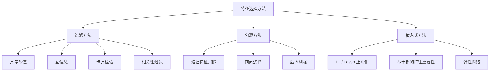
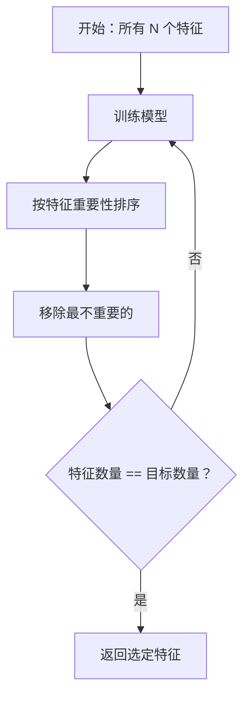
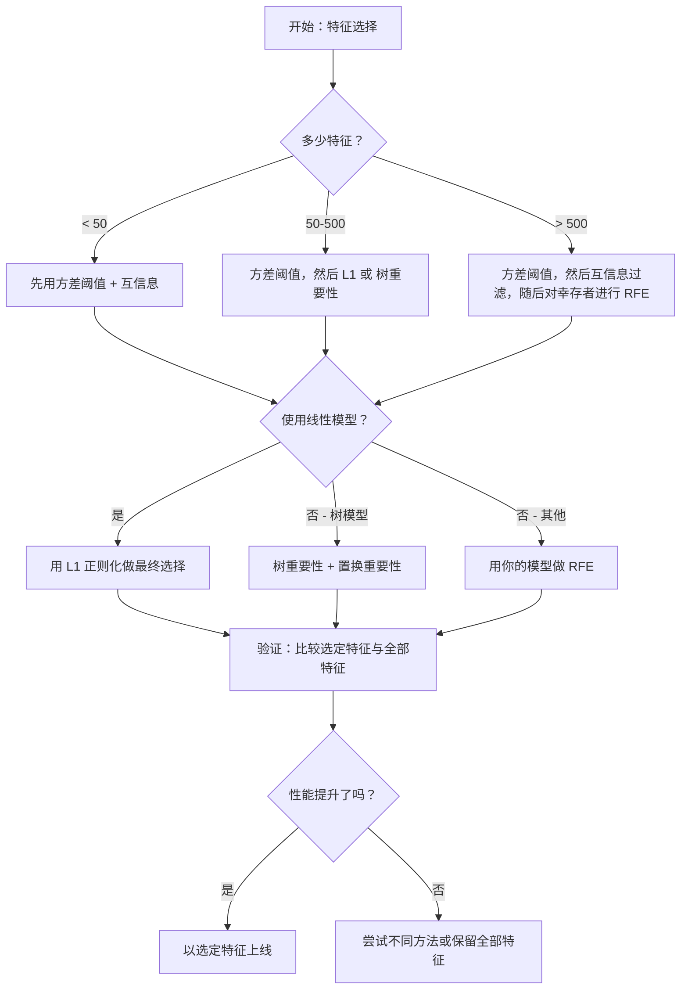

# 特征选择

> 更多特征并不总是更好。正确的特征才是更好。

**Type:** 构建
**Language:** Python
**Prerequisites:** 第2阶段，课程 01-09，08（特征工程）
**Time:** ~75 分钟

## 学习目标

- 从头实现过滤方法（方差阈值、互信息、卡方检验）和包裹方法（RFE、前向选择）
- 解释为什么互信息能捕捉相关性无法发现的非线性特征-目标关系
- 比较 L1 正则化（嵌入式选择）与 RFE（包裹式选择），并评估它们的计算折中
- 构建一个结合多种方法的特征选择流水线，并在留出数据上展示改进的泛化能力

## 问题

你有 500 个特征。模型训练很慢，持续过拟合，没人能解释模型学到了什么。你又添加了更多特征希望提升性能，但结果更差。

这就是维度灾难在起作用。随着特征数量增长，特征空间的体积呈指数级膨胀。数据点变得稀疏，点之间的距离收敛。模型需要指数级更多的数据来发现真实模式。噪声特征掩盖了有信号的特征。过拟合成为常态。

特征选择就是解药。剥离噪声，移除冗余，保留那些与目标真正相关的特征。结果：训练更快，泛化更好，模型更易解释。

目标不是使用所有可用信息，而是使用正确的信息。

## 概念

### 三类特征选择方法

每种特征选择方法都属于以下三类之一：



过滤方法独立地使用统计度量为每个特征打分。它们不使用模型。速度快，但会错过特征之间的交互。

包裹方法训练模型以评估特征子集，使用模型性能作为评分。结果通常更好，但代价高昂，因为需要多次重训模型。

嵌入式方法在模型训练过程中选择特征。L1 正则化会将权重压到零；决策树会在最有用的特征上分裂。选择发生在拟合期间，而不是作为单独步骤。

### 方差阈值

最简单的过滤方法。如果一个特征在样本间几乎不变，那么它几乎不携带信息。

考虑某个特征在 1000 个样本中有 999 个为 0.0。其方差接近零。没有模型能用它来区分类别。把它删除。

```
variance(x) = mean((x - mean(x))^2)
```

设置阈值（例如 0.01）。删除所有低于该阈值的特征。这在不使用目标变量的情况下移除常量或近常量特征。

何时使用：作为其他方法之前的预处理步骤。它以极低的代价捕捉明显无用的特征。

限制：一个特征可能方差很高却仍然是纯噪声。方差阈值是必要但不充分的。

### 互信息

互信息衡量知道特征 X 的取值能在多大程度上降低对目标 Y 的不确定性。

```
I(X; Y) = sum_x sum_y p(x, y) * log(p(x, y) / (p(x) * p(y)))
```

如果 X 和 Y 独立，则 p(x, y) = p(x) * p(y)，对数项为零，I(X; Y) = 0。X 提供的信息越多，互信息越高。

相对于相关性的关键优势：互信息能捕捉非线性关系。某些特征与目标的相关性为零，但互信息很大，因为关系是二次的或周期性的。

对于连续特征，先离散化成若干箱（基于直方图的估计）。箱数会影响估计——箱太少会丢信息，箱太多会增加噪声。常见选择：sqrt(n) 个箱或 Sturges 规则（1 + log2(n)）。


### 递归特征消除（RFE）

RFE 是一种包裹式方法。它使用模型自身的特征重要性进行迭代剪枝：

1. 用所有特征训练模型
2. 按重要性对特征排序（线性模型用系数，树模型用纯度减少量）
3. 移除最不重要的特征（或若干个）
4. 重复直到剩下期望数量的特征



RFE 会考虑特征交互，因为模型在每一步都看到剩余的所有特征。移除一个特征会改变其他特征的重要性，这使得它比过滤方法更彻底。

代价：你需要训练模型 N - target 次。对于 500 个特征、目标 10 个，这是 490 次训练。对于昂贵模型，这很慢。可以通过每步移除多个特征来加速（例如每轮移除底部 10%）。

### L1（Lasso）正则化

L1 正则化将权重的绝对值加入损失函数：

```
loss = prediction_error + alpha * sum(|w_i|)
```

alpha 参数控制特征被裁剪的强度。alpha 越高，越多权重会变为精确的零。

为什么会出现精确的零？L1 惩罚在权重空间里产生菱形约束区域。最优解往往落在菱形的角点上，这时一个或多个权重为零。L2 正则化（ridge）产生圆形约束，权重会缩小但很少精确为零。

这是一种嵌入式特征选择：模型在训练中学会忽略哪些特征。权重为零的特征被视为已移除。

优点：单次训练完成选择，能处理相关特征（选择其中一个并将其他权重置零），大多数线性模型实现中内置支持。

限制：仅对线性模型有效，无法捕捉非线性特征重要性。

### 基于树的特征重要性

决策树及其集成（随机森林、梯度提升）天然能对特征进行排序。每次分裂都会减少纯度（分类用 Gini 或熵，回归用方差）。带来更大纯度减少的特征更重要。

对于包含 T 棵树的随机森林：

```
importance(feature_j) = (1/T) * sum over all trees of
    sum over all nodes splitting on feature_j of
        (n_samples * impurity_decrease)
```

这会给每个特征生成规范化的重要性得分。它可以自动处理非线性关系和特征交互。

注意：基于树的重要性会偏向具有许多唯一值（高基数）的特征。一个随机 ID 列会看起来很重要，因为它能完美地分裂每个样本。用置换重要性作为健全性检查。

### 置换重要性

一种模型无关的方法：

1. 训练模型并记录验证集上的基线性能
2. 对每个特征：随机打乱其取值，测量性能下降
3. 性能下降越大，特征越重要

如果打乱某特征不影响性能，则模型不依赖该特征；若性能崩溃，则该特征至关重要。

置换重要性避免了树基重要性的基数偏差。但它很慢：每个特征都需要一次完整评估，通常还要重复多次以保证稳定性。

### 比较表

| 方法 | 类型 | 速度 | 非线性 | 特征交互 |
|------|------|-------|-----------|---------------------|
| 方差阈值 | 过滤 | 非常快 | 否 | 否 |
| 互信息 | 过滤 | 快 | 是 | 否 |
| 相关性过滤 | 过滤 | 快 | 否 | 否 |
| RFE | 包裹 | 慢 | 取决于模型 | 是 |
| L1 / Lasso | 嵌入式 | 快 | 否（线性） | 否 |
| 树重要性 | 嵌入式 | 中等 | 是 | 是 |
| 置换重要性 | 模型无关 | 慢 | 是 | 是 |

### 决策流程图



## 动手实现

### 第 1 步：生成具有已知特征结构的合成数据

```python
import numpy as np


def make_feature_selection_data(n_samples=500, seed=42):
    rng = np.random.RandomState(seed)

    x1 = rng.randn(n_samples)
    x2 = rng.randn(n_samples)
    x3 = rng.randn(n_samples)
    x4 = x1 + 0.1 * rng.randn(n_samples)
    x5 = x2 + 0.1 * rng.randn(n_samples)

    informative = np.column_stack([x1, x2, x3, x4, x5])

    correlated = np.column_stack([
        x1 * 0.9 + 0.1 * rng.randn(n_samples),
        x2 * 0.8 + 0.2 * rng.randn(n_samples),
        x3 * 0.7 + 0.3 * rng.randn(n_samples),
        x1 * 0.5 + x2 * 0.5 + 0.1 * rng.randn(n_samples),
        x2 * 0.6 + x3 * 0.4 + 0.1 * rng.randn(n_samples),
    ])

    noise = rng.randn(n_samples, 10) * 0.5

    X = np.hstack([informative, correlated, noise])
    y = (2 * x1 - 1.5 * x2 + x3 + 0.5 * rng.randn(n_samples) > 0).astype(int)

    feature_names = (
        [f"info_{i}" for i in range(5)]
        + [f"corr_{i}" for i in range(5)]
        + [f"noise_{i}" for i in range(10)]
    )

    return X, y, feature_names
```

我们知道真实情况：特征 0-4 为信息特征（其中 3 和 4 是 0 和 1 的相关副本），特征 5-9 与信息特征相关，特征 10-19 是纯噪声。一个好的选择方法应把 0-4 排在最前，把 10-19 排在最后。

### 第 2 步：方差阈值

```python
def variance_threshold(X, threshold=0.01):
    variances = np.var(X, axis=0)
    mask = variances > threshold
    return mask, variances
```

### 第 3 步：互信息（离散）

```python
def discretize(x, n_bins=10):
    min_val, max_val = x.min(), x.max()
    if max_val == min_val:
        return np.zeros_like(x, dtype=int)
    bin_edges = np.linspace(min_val, max_val, n_bins + 1)
    binned = np.digitize(x, bin_edges[1:-1])
    return binned


def mutual_information(X, y, n_bins=10):
    n_samples, n_features = X.shape
    mi_scores = np.zeros(n_features)

    y_vals, y_counts = np.unique(y, return_counts=True)
    p_y = y_counts / n_samples

    for f in range(n_features):
        x_binned = discretize(X[:, f], n_bins)
        x_vals, x_counts = np.unique(x_binned, return_counts=True)
        p_x = dict(zip(x_vals, x_counts / n_samples))

        mi = 0.0
        for xv in x_vals:
            for yi, yv in enumerate(y_vals):
                joint_mask = (x_binned == xv) & (y == yv)
                p_xy = np.sum(joint_mask) / n_samples
                if p_xy > 0:
                    mi += p_xy * np.log(p_xy / (p_x[xv] * p_y[yi]))
        mi_scores[f] = mi

    return mi_scores
```

### 第 4 步：递归特征消除

```python
def simple_logistic_importance(X, y, lr=0.1, epochs=100):
    n_samples, n_features = X.shape
    w = np.zeros(n_features)
    b = 0.0

    for _ in range(epochs):
        z = X @ w + b
        pred = 1.0 / (1.0 + np.exp(-np.clip(z, -500, 500)))
        error = pred - y
        w -= lr * (X.T @ error) / n_samples
        b -= lr * np.mean(error)

    return w, b


def rfe(X, y, n_features_to_select=5, lr=0.1, epochs=100):
    n_total = X.shape[1]
    remaining = list(range(n_total))
    rankings = np.ones(n_total, dtype=int)
    rank = n_total

    while len(remaining) > n_features_to_select:
        X_subset = X[:, remaining]
        w, _ = simple_logistic_importance(X_subset, y, lr, epochs)
        importances = np.abs(w)

        least_idx = np.argmin(importances)
        original_idx = remaining[least_idx]
        rankings[original_idx] = rank
        rank -= 1
        remaining.pop(least_idx)

    for idx in remaining:
        rankings[idx] = 1

    selected_mask = rankings == 1
    return selected_mask, rankings
```

### 第 5 步：L1 特征选择

```python
def soft_threshold(w, alpha):
    return np.sign(w) * np.maximum(np.abs(w) - alpha, 0)


def l1_feature_selection(X, y, alpha=0.1, lr=0.01, epochs=500):
    n_samples, n_features = X.shape
    w = np.zeros(n_features)
    b = 0.0

    for _ in range(epochs):
        z = X @ w + b
        pred = 1.0 / (1.0 + np.exp(-np.clip(z, -500, 500)))
        error = pred - y

        gradient_w = (X.T @ error) / n_samples
        gradient_b = np.mean(error)

        w -= lr * gradient_w
        w = soft_threshold(w, lr * alpha)
        b -= lr * gradient_b

    selected_mask = np.abs(w) > 1e-6
    return selected_mask, w
```

### 第 6 步：基于树的重要性（简单决策树）

```python
def gini_impurity(y):
    if len(y) == 0:
        return 0.0
    classes, counts = np.unique(y, return_counts=True)
    probs = counts / len(y)
    return 1.0 - np.sum(probs ** 2)


def best_split(X, y, feature_idx):
    values = np.unique(X[:, feature_idx])
    if len(values) <= 1:
        return None, -1.0

    best_threshold = None
    best_gain = -1.0
    parent_gini = gini_impurity(y)
    n = len(y)

    for i in range(len(values) - 1):
        threshold = (values[i] + values[i + 1]) / 2.0
        left_mask = X[:, feature_idx] <= threshold
        right_mask = ~left_mask

        n_left = np.sum(left_mask)
        n_right = np.sum(right_mask)

        if n_left == 0 or n_right == 0:
            continue

        gain = parent_gini - (n_left / n) * gini_impurity(y[left_mask]) - (n_right / n) * gini_impurity(y[right_mask])

        if gain > best_gain:
            best_gain = gain
            best_threshold = threshold

    return best_threshold, best_gain


def tree_importance(X, y, n_trees=50, max_depth=5, seed=42):
    rng = np.random.RandomState(seed)
    n_samples, n_features = X.shape
    importances = np.zeros(n_features)

    for _ in range(n_trees):
        sample_idx = rng.choice(n_samples, size=n_samples, replace=True)
        feature_subset = rng.choice(n_features, size=max(1, int(np.sqrt(n_features))), replace=False)

        X_boot = X[sample_idx]
        y_boot = y[sample_idx]

        tree_imp = _build_tree_importance(X_boot, y_boot, feature_subset, max_depth)
        importances += tree_imp

    total = importances.sum()
    if total > 0:
        importances /= total

    return importances


def _build_tree_importance(X, y, feature_subset, max_depth, depth=0):
    n_features = X.shape[1]
    importances = np.zeros(n_features)

    if depth >= max_depth or len(np.unique(y)) <= 1 or len(y) < 4:
        return importances

    best_feature = None
    best_threshold = None
    best_gain = -1.0

    for f in feature_subset:
        threshold, gain = best_split(X, y, f)
        if gain > best_gain:
            best_gain = gain
            best_feature = f
            best_threshold = threshold

    if best_feature is None or best_gain <= 0:
        return importances

    importances[best_feature] += best_gain * len(y)

    left_mask = X[:, best_feature] <= best_threshold
    right_mask = ~left_mask

    importances += _build_tree_importance(X[left_mask], y[left_mask], feature_subset, max_depth, depth + 1)
    importances += _build_tree_importance(X[right_mask], y[right_mask], feature_subset, max_depth, depth + 1)

    return importances
```

### 第 7 步：运行所有方法并比较

代码文件会在相同的合成数据集上运行这五种方法，并打印比较表，显示每种方法选择了哪些特征。

## 使用方法

在 scikit-learn 中，特征选择已内置于流水线：

```python
from sklearn.feature_selection import (
    VarianceThreshold,
    mutual_info_classif,
    RFE,
    SelectFromModel,
)
from sklearn.linear_model import Lasso, LogisticRegression
from sklearn.ensemble import RandomForestClassifier

vt = VarianceThreshold(threshold=0.01)
X_filtered = vt.fit_transform(X)

mi_scores = mutual_info_classif(X, y)
top_k = np.argsort(mi_scores)[-10:]

rfe_selector = RFE(LogisticRegression(), n_features_to_select=10)
rfe_selector.fit(X, y)
X_rfe = rfe_selector.transform(X)

lasso_selector = SelectFromModel(Lasso(alpha=0.01))
lasso_selector.fit(X, y)
X_lasso = lasso_selector.transform(X)

rf = RandomForestClassifier(n_estimators=100)
rf.fit(X, y)
importances = rf.feature_importances_
```

从头实现的版本展示了每种方法内部到底发生了什么。方差阈值只是计算 `var(X, axis=0)` 并应用掩码。互信息是统计列联表里的联合与边缘频率。RFE 是一个训练、排序、剪枝的循环。L1 是带软阈值步骤的梯度下降。树重要性是跨分裂累加纯度减少。没有魔法——只有统计与循环。

scikit-learn 版本增加了鲁棒性（例如 mutual_info_classif 使用 k-NN 密度估计而非分箱）、速度（C 实现）和流水线集成。

## 上线交付

本课件产出：
- `outputs/skill-feature-selector.md` -- 一个用于选择合适特征选择方法的快速参考决策树

## 练习

1. 前向选择：实现 RFE 的反向操作。从零特征开始。每一步添加能最大提升模型性能的特征。当添加特征不再有帮助时停止。将选出的特征与 RFE 结果比较。哪个更快？哪个更好？

2. 稳定性选择：运行 L1 特征选择 50 次，每次在随机的 80% 子样本上运行，并使用略微不同的 alpha 值。统计每个特征被选中的频次。被选中超过 80% 次的特征称为“稳定”的。将稳定特征与单次运行的 L1 选择结果比较。哪个更可靠？

3. 多重共线性检测：计算所有特征的相关矩阵。实现一个函数，给定相关阈值（例如 0.9），在每一对高度相关的特征中移除一个（保留与目标互信息更高的那个）。在合成数据集上测试，验证其能移除冗余相关特征。

4. 特征选择流水线：把方差阈值、互信息过滤和 RFE 链接成单个流水线。先移除近零方差特征，然后按互信息保留前 50%，最后对幸存者运行 RFE。将该流水线与在全部特征上直接运行 RFE 比较。流水线更快吗？准确度相当吗？

5. 从头实现置换重要性：实现置换重要性。对于每个特征，打乱其取值 10 次，测量 F1 分数的平均下降。将排名与树基重要性比较。找出 disagree 的情况并解释原因（提示：相关特征）。

## 关键术语

| 术语 | 常说的话 | 实际含义 |
|------|----------------|----------------------|
| 过滤方法 | “独立地给特征打分” | 一种特征选择方法，使用统计度量对特征进行排序，不训练模型，单独评估每个特征 |
| 包裹方法 | “用模型来挑特征” | 一种特征选择方法，通过训练模型评估特征子集，并使用模型性能作为选择标准 |
| 嵌入式方法 | “模型在训练时选择特征” | 在模型拟合过程中进行特征选择，例如 L1 正则化将不重要的权重压为零 |
| 互信息 | “一个变量能告诉你另一个变量多少” | 在知道 X 的情况下，对 Y 不确定性的降低量度，能捕捉线性和非线性依赖 |
| 递归特征消除 | “训练、排序、剪枝、重复” | 一种迭代包裹方法：训练模型、移除最不重要的特征并重复，直到达到目标数量 |
| L1 / Lasso 正则化 | “会把特征干掉的惩罚” | 将权重绝对值之和加入损失函数，从而使不重要的特征权重精确为零 |
| 方差阈值 | “移除常量特征” | 丢弃在样本间方差低于指定阈值的特征，过滤掉不携带信息的特征 |
| 特征重要性 | “哪些特征更重要” | 指示每个特征对模型预测贡献的分数，来自分裂增益（树）或系数大小（线性） |
| 置换重要性 | “打乱并测量损失” | 通过随机打乱每个特征的值并测量模型性能下降来评估特征重要性 |
| 维度灾难 | “特征太多，数据太少” | 随着特征增加，特征空间体积呈指数级增长，数据变得稀疏，距离失去意义 |

## 延伸阅读

- [An Introduction to Variable and Feature Selection (Guyon & Elisseeff, 2003)](https://jmlr.org/papers/v3/guyon03a.html) -- 特征选择方法的奠基综述，仍被广泛引用
- [scikit-learn Feature Selection Guide](https://scikit-learn.org/stable/modules/feature_selection.html) -- 过滤、包裹和嵌入式方法的实用参考与代码示例
- [Stability Selection (Meinshausen & Buhlmann, 2010)](https://arxiv.org/abs/0809.2932) -- 将子抽样与特征选择结合以获得稳健、可复现的结果
- [Beware Default Random Forest Importances (Strobl et al., 2007)](https://bmcbioinformatics.biomedcentral.com/articles/10.1186/1471-2105-8-25) -- 展示了树基重要性的基数偏差并提出条件重要性作为替代方案