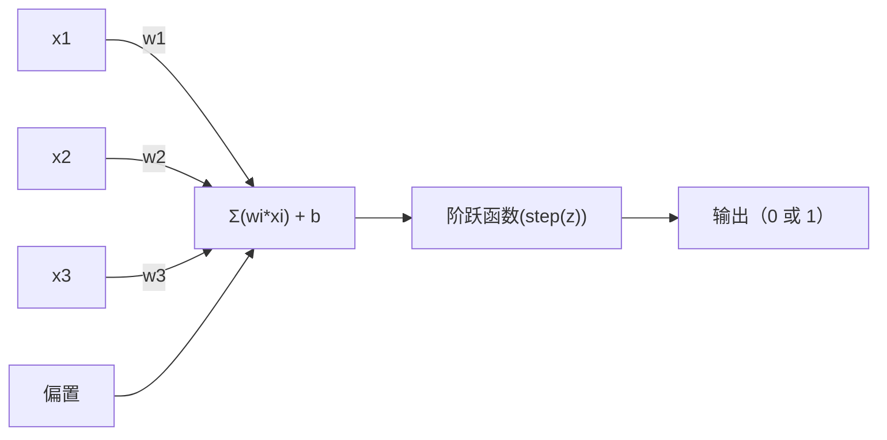
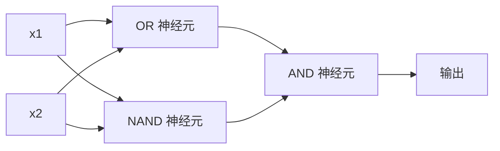

# 感知器

> 感知器是神经网络的基本单元。把它拆开，你会发现权重、偏置和一个决策。

**Type:** 构建  
**Languages:** Python  
**Prerequisites:** 第1阶段（线性代数直觉）  
**Time:** ~60 分钟

## 学习目标

- 用 Python 从零实现一个感知器，包括权重更新规则和阶跃激活函数
- 解释为什么单个感知器只能解决线性可分的问题，并演示 XOR 的失败案例
- 通过组合 OR、NAND 和 AND 门构建多层感知器以解决 XOR
- 用 sigmoid 激活和反向传播训练一个两层网络，使其自动学习 XOR

## 问题

你知道向量和点积。你知道矩阵如何将输入变换为输出。但机器如何“学习”使用哪种变换？

感知器给出了答案。它是最简单的学习机器：取一些输入，乘以权重，加上偏置，然后做二元决策。然后调整。就是如此。迄今为止构建的所有神经网络都是把这个想法层叠起来。

理解感知器意味着在代码中理解“学习”到底意味着什么：不断调整数字，直到输出与现实匹配。

## 概念

### 一个神经元，一个决策

感知器接受 n 个输入，每个输入乘以一个权重，将它们求和，加入偏置，然后将结果传入激活函数。



阶跃函数非常直接：如果加权和加上偏置 >= 0，则输出 1，否则输出 0。

```
step(z) = 1  如果 z >= 0
           0  如果 z < 0
```

这就是一个线性分类器。权重和偏置定义了一条线（在更高维度是超平面），把输入空间划分为两个区域。

### 决策边界

对于两个输入，感知器在二维空间中画出一条线：

```
  x2
  ┤
  │  类别 1        /
  │    (0)          /
  │                /
  │               / w1·x1 + w2·x2 + b = 0
  │              /
  │             /     类别 2
  │            /        (1)
  ┼───────────/──────────── x1
```

线的一侧输出 0，另一侧输出 1。训练会移动这条线，直到正确地分隔各类别。

### 学习规则

感知器学习规则很简单：

```
对于每个训练样本 (x, y_true):
    y_pred = predict(x)
    error = y_true - y_pred

    对于每个权重:
        w_i = w_i + learning_rate * error * x_i
    bias = bias + learning_rate * error
```

如果预测正确，error = 0，什么都不变。如果预测为 0 但应为 1，权重会增加。如果预测为 1 但应为 0，权重会减少。学习率控制每次调整的步幅。

### XOR 问题

问题就出在这里。看这些逻辑门：

```
AND 门:           OR 门:            XOR 门:
x1  x2  输出       x1  x2  输出       x1  x2  输出
0   0   0         0   0   0         0   0   0
0   1   0         0   1   1         0   1   1
1   0   0         1   0   1         1   0   1
1   1   1         1   1   1         1   1   0
```

AND 和 OR 是线性可分的：你可以画一条直线把 0 和 1 分开。XOR 不是。没有一条直线可以把 [0,1] 和 [1,0] 与 [0,0] 和 [1,1] 分开。

```
AND（可分）:        XOR（不可分）:

  x2                      x2
  1 ┤  0     1            1 ┤  1     0
    │     /                 │
  0 ┤  0 / 0              0 ┤  0     1
    ┼──/──────── x1         ┼──────────── x1
       直线可行！            没有单条直线可行！
```

这是一个根本性的限制。单个感知器只能解决线性可分的问题。Minsky 和 Papert 在 1969 年证明了这一点，并一度几乎扼杀了神经网络研究十年。

解决办法：把感知器堆成多层。多层感知器可以通过将两个线性决策组合成一个非线性决策来解决 XOR。

```figure
perceptron-boundary
```

## 实现它

### 第 1 步：Perceptron 类

```python
class Perceptron:
    def __init__(self, n_inputs, learning_rate=0.1):
        self.weights = [0.0] * n_inputs
        self.bias = 0.0
        self.lr = learning_rate

    def predict(self, inputs):
        total = sum(w * x for w, x in zip(self.weights, inputs))
        total += self.bias
        return 1 if total >= 0 else 0

    def train(self, training_data, epochs=100):
        for epoch in range(epochs):
            errors = 0
            for inputs, target in training_data:
                prediction = self.predict(inputs)
                error = target - prediction
                if error != 0:
                    errors += 1
                    for i in range(len(self.weights)):
                        self.weights[i] += self.lr * error * inputs[i]
                    self.bias += self.lr * error
            if errors == 0:
                print(f"Converged at epoch {epoch + 1}")
                return
        print(f"Did not converge after {epochs} epochs")
```

### 第 2 步：在逻辑门上训练

```python
and_data = [
    ([0, 0], 0),
    ([0, 1], 0),
    ([1, 0], 0),
    ([1, 1], 1),
]

or_data = [
    ([0, 0], 0),
    ([0, 1], 1),
    ([1, 0], 1),
    ([1, 1], 1),
]

not_data = [
    ([0], 1),
    ([1], 0),
]

print("=== AND Gate ===")
p_and = Perceptron(2)
p_and.train(and_data)
for inputs, _ in and_data:
    print(f"  {inputs} -> {p_and.predict(inputs)}")

print("\n=== OR Gate ===")
p_or = Perceptron(2)
p_or.train(or_data)
for inputs, _ in or_data:
    print(f"  {inputs} -> {p_or.predict(inputs)}")

print("\n=== NOT Gate ===")
p_not = Perceptron(1)
p_not.train(not_data)
for inputs, _ in not_data:
    print(f"  {inputs} -> {p_not.predict(inputs)}")
```

### 第 3 步：观察 XOR 失败

```python
xor_data = [
    ([0, 0], 0),
    ([0, 1], 1),
    ([1, 0], 1),
    ([1, 1], 0),
]

print("\n=== XOR Gate (single perceptron) ===")
p_xor = Perceptron(2)
p_xor.train(xor_data, epochs=1000)
for inputs, expected in xor_data:
    result = p_xor.predict(inputs)
    status = "OK" if result == expected else "WRONG"
    print(f"  {inputs} -> {result} (expected {expected}) {status}")
```

它永远不会收敛。这是单个感知器无法学习 XOR 的有力证据。

### 第 4 步：用两层解决 XOR

技巧是：XOR = (x1 OR x2) AND NOT (x1 AND x2)。组合三个感知器：



```python
def xor_network(x1, x2):
    or_neuron = Perceptron(2)
    or_neuron.weights = [1.0, 1.0]
    or_neuron.bias = -0.5

    nand_neuron = Perceptron(2)
    nand_neuron.weights = [-1.0, -1.0]
    nand_neuron.bias = 1.5

    and_neuron = Perceptron(2)
    and_neuron.weights = [1.0, 1.0]
    and_neuron.bias = -1.5

    hidden1 = or_neuron.predict([x1, x2])
    hidden2 = nand_neuron.predict([x1, x2])
    output = and_neuron.predict([hidden1, hidden2])
    return output


print("\n=== XOR Gate (multi-layer network) ===")
for inputs, expected in xor_data:
    result = xor_network(inputs[0], inputs[1])
    print(f"  {inputs} -> {result} (expected {expected})")
```

四种输入都正确。把感知器按层堆叠可以产生单个感知器无法生成的决策边界。

### 第 5 步：训练一个两层网络

第 4 步中我们手工设置了权重。对 XOR 有效，但对于不知道正确权重的真实问题行不通。修正方法：把阶跃函数替换为 sigmoid，并通过反向传播自动学习权重。

```python
class TwoLayerNetwork:
    def __init__(self, learning_rate=0.5):
        import random
        random.seed(0)
        self.w_hidden = [[random.uniform(-1, 1), random.uniform(-1, 1)] for _ in range(2)]
        self.b_hidden = [random.uniform(-1, 1), random.uniform(-1, 1)]
        self.w_output = [random.uniform(-1, 1), random.uniform(-1, 1)]
        self.b_output = random.uniform(-1, 1)
        self.lr = learning_rate

    def sigmoid(self, x):
        import math
        x = max(-500, min(500, x))
        return 1.0 / (1.0 + math.exp(-x))

    def forward(self, inputs):
        self.inputs = inputs
        self.hidden_outputs = []
        for i in range(2):
            z = sum(w * x for w, x in zip(self.w_hidden[i], inputs)) + self.b_hidden[i]
            self.hidden_outputs.append(self.sigmoid(z))
        z_out = sum(w * h for w, h in zip(self.w_output, self.hidden_outputs)) + self.b_output
        self.output = self.sigmoid(z_out)
        return self.output

    def train(self, training_data, epochs=10000):
        for epoch in range(epochs):
            total_error = 0
            for inputs, target in training_data:
                output = self.forward(inputs)
                error = target - output
                total_error += error ** 2

                d_output = error * output * (1 - output)

                saved_w_output = self.w_output[:]
                hidden_deltas = []
                for i in range(2):
                    h = self.hidden_outputs[i]
                    hd = d_output * saved_w_output[i] * h * (1 - h)
                    hidden_deltas.append(hd)

                for i in range(2):
                    self.w_output[i] += self.lr * d_output * self.hidden_outputs[i]
                self.b_output += self.lr * d_output

                for i in range(2):
                    for j in range(len(inputs)):
                        self.w_hidden[i][j] += self.lr * hidden_deltas[i] * inputs[j]
                    self.b_hidden[i] += self.lr * hidden_deltas[i]
```

```python
net = TwoLayerNetwork(learning_rate=2.0)
net.train(xor_data, epochs=10000)
for inputs, expected in xor_data:
    result = net.forward(inputs)
    predicted = 1 if result >= 0.5 else 0
    print(f"  {inputs} -> {result:.4f} (rounded: {predicted}, expected {expected})")
```

与第 4 步相比的两个关键差别：首先，sigmoid 取代了阶跃函数——它是平滑的，因此存在梯度；其次，`train` 方法将输出层的误差向后传播到隐藏层，按各自对误差的贡献调整每个权重。这就是 20 行代码内的反向传播。

这也是通向第 03 课的桥梁。`d_output` 和 `hidden_deltas` 背后的数学是对网络计算图应用链式法则。我们将在那里详细推导。

## 使用它

你刚刚从零构建的一切在一个导入中就能实现：

```python
from sklearn.linear_model import Perceptron as SkPerceptron
import numpy as np

X = np.array([[0,0],[0,1],[1,0],[1,1]])
y = np.array([0, 0, 0, 1])

clf = SkPerceptron(max_iter=100, tol=1e-3)
clf.fit(X, y)
print([clf.predict([x])[0] for x in X])
```

五行代码。你那 30 行的 `Perceptron` 类实现了相同的功能。sklearn 的实现增加了收敛检查、多个损失函数和稀疏输入支持——但核心循环是相同的：加权和、阶跃函数、预测错误时更新权重。

真正的差距在于规模化。生产级网络会发生什么变化：

- 阶跃函数被 sigmoid、ReLU 或其他平滑激活取代
- 权重通过反向传播自动学习（第 03 课）
- 层数变得更深：3 层、10 层、100+ 层
- 相同的原理仍然成立：每一层都根据上一层的输出创造新的特征

单个感知器只能画直线。把它们堆起来，你就能画出任意形状。

## 交付

本课产出：
- `outputs/skill-perceptron.md` - 一篇说明何时需要单层与多层架构的技能文档

## 练习

1. 在 NAND 门上训练一个感知器（NAND 是通用门——任何逻辑电路都可以用 NAND 构建）。验证其权重和偏置是否形成有效的决策边界。  
2. 修改 Perceptron 类以在每个 epoch 跟踪决策边界（w1*x1 + w2*x2 + b = 0）。在 AND 门上训练时打印该直线如何随训练变化。  
3. 构建一个 3 输入的感知器，当且仅当至少有 2 个输入为 1 时输出 1（多数投票函数）。这个问题是线性可分的吗？为什么？

## 关键术语

| 术语 | 常见说法 | 实际含义 |
|------|----------------|----------------------|
| Perceptron | “一个伪神经元” | 线性分类器：输入与权重的点积，加上偏置，通过阶跃函数 |
| 权重 | “输入有多重要” | 缩放每个输入对决策贡献的乘子 |
| 偏置 | “阈值” | 一个常数，平移决策边界，使感知器在零输入时也能激活 |
| 激活函数 | “把值压缩的东西” | 在加权和之后应用的函数——感知器使用阶跃函数，现代网络使用 sigmoid/ReLU 等 |
| 线性可分 | “你可以画一条线把它们分开” | 数据集可以被一个超平面完美地分隔成不同类别 |
| XOR 问题 | “感知器做不到的事” | 证明单层网络无法学习非线性可分函数 |
| 决策边界 | “分类器切换的地方” | 将输入空间划分为两类的超平面 w·x + b = 0 |
| 多层感知器 | “真正的神经网络” | 感知器按层堆叠，每一层的输出作为下一层的输入 |

## 延伸阅读

- Frank Rosenblatt, "The Perceptron: A Probabilistic Model for Information Storage and Organization in the Brain" (1958) —— 开创性的原始论文  
- Minsky & Papert, "Perceptrons" (1969) —— 证明单层网络不能解决 XOR 的著作，并一度使感知器研究停滞十年  
- Michael Nielsen, "Neural Networks and Deep Learning", Chapter 1 (http://neuralnetworksanddeeplearning.com/) —— 免费在线资源，对感知器如何组成网络有最佳的可视化解释