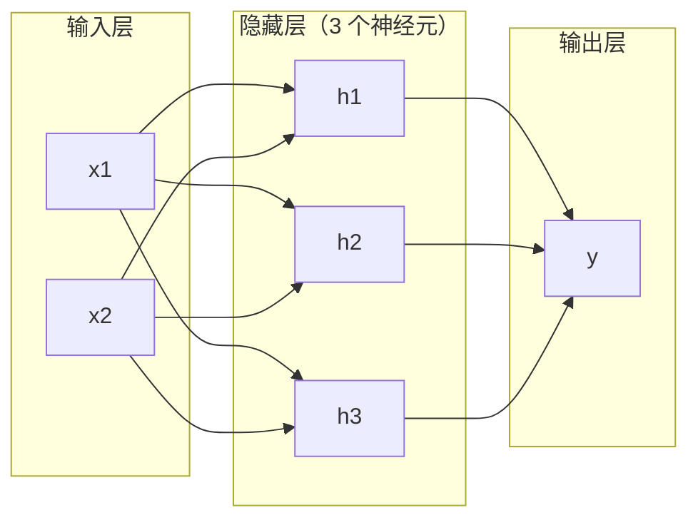
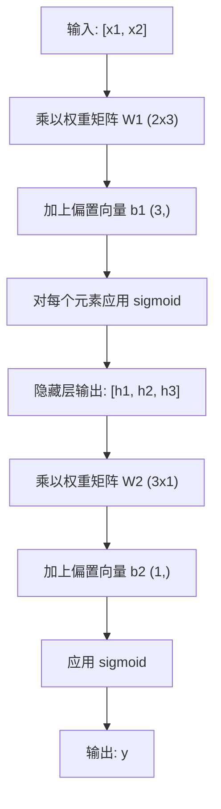

# 多层网络与前向传播

> 一个神经元画一条直线。把它们堆叠起来，你就能画出任意图形。

**Type:** 构建  
**Languages:** Python  
**Prerequisites:** Phase 01（数学基础）, Lesson 03.01（感知器）  
**Time:** ~90 分钟

## 学习目标

- 从头实现带有 Layer 和 Network 类的多层网络，并完成一次完整的前向传播
- 跟踪网络中每一层的矩阵维度并识别形状不匹配的问题
- 解释将非线性激活函数叠加如何使网络学习曲线决策边界
- 使用手工调节的 sigmoid 权重，在 2-2-1 架构下解决 XOR 问题

## 问题概述

单个神经元就是一把画直线的尺子。仅此而已。一条直线穿过你的数据。AI 中的每一个实际问题——图像识别、语言理解、下围棋——都需要曲线。把神经元堆成层，就是得到曲线的方法。

1969 年，Minsky 和 Papert 证明了这种限制是致命的：单层网络不能学习 XOR。不是“难以学习”——数学上不可行。XOR 的真值表把 [0,1] 和 [1,0] 放在一边，把 [0,0] 和 [1,1] 放在另一边。没有一条直线可以将它们分开。

这让神经网络研究资金冷却了十多年。事后看来解决办法很明显：不要只用一层。把神经元堆成多层。让第一层把输入空间划分成新的特征，再让第二层将这些特征组合成单条直线无法做出的决策。

这堆叠起来的结构就是多层网络。它是当今所有深度学习模型的基础。前向传播——数据从输入通过隐藏层流向输出——是在其他任何事情工作之前必须先构建的东西。

## 概念

### 层：输入层、隐藏层、输出层

多层网络包含三种类型的层：

**输入层** —— 严格来说不是一层。它保存原始数据。两个特征就意味着两个输入节点。这里不做计算。

**隐藏层** —— 真正工作的地方。每个神经元接收前一层的所有输出，对应乘以权重并加上偏置，然后将结果通过激活函数。称为“隐藏”，因为这些值不会在训练数据中直接看到。

**输出层** —— 最终答案。二元分类通常用一个带 sigmoid 的神经元；多类分类则为每个类别一个神经元。



这是一个 2-3-1 网络。两个输入，三个隐藏神经元，一个输出。每一条连接都有一个权重。每个神经元（输入除外）都有一个偏置。

每层会产生一个称为隐藏状态的数值向量。对于文本，隐藏状态通常会增高维度——把一个词编码成 768 个数字以捕捉语义；对于图像，它们常常会降低维度——把百万像素压缩为可管理的表示。隐藏状态就是学习所在的位置。

### 神经元与激活函数

每个神经元做三件事：

1. 将每个输入乘以对应权重
2. 将所有乘积求和并加上偏置
3. 将和传入激活函数

此处我们使用 sigmoid 激活：

```
sigmoid(z) = 1 / (1 + e^(-z))
```

Sigmoid 会把任意数压缩到 (0, 1) 区间。大的正输入趋向 1，大的负输入趋向 0，0 映射为 0.5。与感知器的硬步进不同，sigmoid 在每处都有梯度，这个平滑曲线使得学习成为可能。

### 前向传播：数据如何流动

前向传播把输入数据逐层推送通过网络，直到到达输出。前向传播期间没有学习发生。它只是纯粹的计算：乘、加、激活，重复执行。



每一层按顺序发生三步操作：

```
z = W * input + b       (线性变换)
a = sigmoid(z)           (激活)
```

一层的输出成为下一层的输入。这就是完整的前向传播。

### 矩阵维度

跟踪维度是深度学习中最重要的调试技能。下面是 2-3-1 网络：

| 步骤 | 操作 | 维度 | 结果形状 |
|------|------|------|---------|
| 输入 | x | -- | (2,) |
| 隐藏线性变换 | W1 * x + b1 | W1: (3, 2), b1: (3,) | (3,) |
| 隐藏激活 | sigmoid(z1) | -- | (3,) |
| 输出线性变换 | W2 * h + b2 | W2: (1, 3), b2: (1,) | (1,) |
| 输出激活 | sigmoid(z2) | -- | (1,) |

规则是：第 k 层的权重矩阵 W 的形状为 (当前层神经元数, 上一层神经元数)。行数对应当前层，列数对应上一层。如果形状不匹配，你就有 bug。

### 通用逼近定理

1989 年，George Cybenko 证明了一件非凡的事情：具有单个隐藏层且足够神经元的神经网络可以将任意连续函数近似到任意精度。

这并不意味着单隐藏层总是最佳选择。它仅说明这种架构在理论上是有能力的。在实践中，更深的网络（更多层、每层更少神经元）通常用远少于浅宽网络的参数学习到相同的函数。这就是深度学习为何有效的原因。

直觉上看：隐藏层中的每个神经元学习一个“凸峰”或特征。把足够多的凸峰放在合适的位置，便可以近似任意平滑曲线。神经元越多，凸峰越多，逼近越好。


### 可组合性

神经网络具有可组合性。你可以把它们堆叠、串联或并行运行。Whisper 模型使用一个 encoder 网络处理音频，另一个 decoder 网络生成文本。现代 LLM 多为 decoder-only。BERT 是 encoder-only。T5 是 encoder-decoder。架构选择定义了模型能做什么。

```figure
mlp-forward
```

## 构建它

纯 Python。不要用 numpy。每一个矩阵操作都从头实现。

### 第 1 步：Sigmoid 激活

```python
import math

def sigmoid(x):
    x = max(-500.0, min(500.0, x))
    return 1.0 / (1.0 + math.exp(-x))
```

将值限制在 [-500, 500] 可以防止溢出。`math.exp(500)` 很大但有限，而 `math.exp(1000)` 会是无穷大。

### 第 2 步：Layer 类

深度学习中最重要的操作是矩阵乘法。每一层、每一个 attention head、每一次前向传播——本质上都是大量矩阵乘法。线性层接受一个输入向量，用权重矩阵乘它，并加上偏置向量：y = Wx + b。这个等式占了神经网络中约 90% 的计算量。

一个 Layer 保存权重矩阵和偏置向量。它的 forward 方法接收输入向量并返回激活后的输出。

```python
class Layer:
    def __init__(self, n_inputs, n_neurons, weights=None, biases=None):
        if weights is not None:
            self.weights = weights
        else:
            import random
            self.weights = [
                [random.uniform(-1, 1) for _ in range(n_inputs)]
                for _ in range(n_neurons)
            ]
        if biases is not None:
            self.biases = biases
        else:
            self.biases = [0.0] * n_neurons

    def forward(self, inputs):
        self.last_input = inputs
        self.last_output = []
        for neuron_idx in range(len(self.weights)):
            z = sum(
                w * x for w, x in zip(self.weights[neuron_idx], inputs)
            )
            z += self.biases[neuron_idx]
            self.last_output.append(sigmoid(z))
        return self.last_output
```

权重矩阵的形状是 (n_neurons, n_inputs)。每一行是一个神经元在所有输入上的权重。forward 方法遍历每个神经元，计算加权和加偏置，应用 sigmoid，并收集结果。

### 第 3 步：Network 类

网络由一系列层组成。前向传播将它们串联起来：第 k 层的输出作为第 k+1 层的输入。

```python
class Network:
    def __init__(self, layers):
        self.layers = layers

    def forward(self, inputs):
        current = inputs
        for layer in self.layers:
            current = layer.forward(current)
        return current
```

这就是完整的前向传播。四行逻辑。数据进入，流过每一层，然后出来。

### 第 4 步：用手动调参的权重解决 XOR

在 Lesson 01 中，我们通过组合 OR、NAND 和 AND 感知器解决了 XOR。现在用我们的 Layer 和 Network 类做同样的事情。2-2-1 架构：两个输入、两个隐藏神经元、一个输出。

```python
hidden = Layer(
    n_inputs=2,
    n_neurons=2,
    weights=[[20.0, 20.0], [-20.0, -20.0]],
    biases=[-10.0, 30.0],
)

output = Layer(
    n_inputs=2,
    n_neurons=1,
    weights=[[20.0, 20.0]],
    biases=[-30.0],
)

xor_net = Network([hidden, output])

xor_data = [
    ([0, 0], 0),
    ([0, 1], 1),
    ([1, 0], 1),
    ([1, 1], 0),
]

for inputs, expected in xor_data:
    result = xor_net.forward(inputs)
    predicted = 1 if result[0] >= 0.5 else 0
    print(f"  {inputs} -> {result[0]:.6f} (rounded: {predicted}, expected: {expected})")
```

很大的权重（20, -20）使得 sigmoid 类似于阶跃函数。第一个隐藏神经元近似 OR，第二个近似 NAND，输出神经元将它们组合成 AND，从而实现 XOR。

### 第 5 步：圆形分类

更难的任务：将 2D 点分类为是否位于以原点为中心、半径为 0.5 的圆内。这需要曲线的决策边界——单个感知器无法做到。

```python
import random
import math

random.seed(42)

data = []
for _ in range(200):
    x = random.uniform(-1, 1)
    y = random.uniform(-1, 1)
    label = 1 if (x * x + y * y) < 0.25 else 0
    data.append(([x, y], label))

circle_net = Network([
    Layer(n_inputs=2, n_neurons=8),
    Layer(n_inputs=8, n_neurons=1),
])
```

使用随机权重时，网络不会有良好的分类效果。但前向传播仍然会运行。这正是要点——前向传播只是计算。学习正确权重是反向传播的工作，会在 Lesson 03 中讲到。

```python
correct = 0
for inputs, expected in data:
    result = circle_net.forward(inputs)
    predicted = 1 if result[0] >= 0.5 else 0
    if predicted == expected:
        correct += 1

print(f"Accuracy with random weights: {correct}/{len(data)} ({100*correct/len(data):.1f}%)")
```

随机权重通常会给出很差的准确率——往往比简单猜测多数类还差。训练之后（Lesson 03），同样的 8 个隐藏神经元结构将画出一条区分内外的曲线边界。

## 使用示例

PyTorch 用四行代码就完成了上面的一切：

```python
import torch
import torch.nn as nn

model = nn.Sequential(
    nn.Linear(2, 8),
    nn.Sigmoid(),
    nn.Linear(8, 1),
    nn.Sigmoid(),
)

x = torch.tensor([[0.0, 0.0], [0.0, 1.0], [1.0, 0.0], [1.0, 1.0]])
output = model(x)
print(output)
```

`nn.Linear(2, 8)` 就相当于你的 Layer 类：权重矩阵形状为 (8, 2)，偏置向量形状为 (8,)。`nn.Sigmoid()` 是逐元素应用的 sigmoid 函数。`nn.Sequential` 就是把层按顺序串联的 Network 类。

区别在于速度和规模。PyTorch 在 GPU 上运行，支持处理数百万样本的批次，并自动计算反向传播所需的梯度。但前向传播的逻辑与刚才手工实现的完全相同。

## 发布成果

本课产出一个用于设计网络架构的可复用提示词：

- `outputs/prompt-network-architect.md`

在你需要决定某个问题应使用多少层、每层多少神经元以及使用哪些激活函数时使用它。

## 练习

1. 构建一个 2-4-2-1 网络（两个隐藏层），用随机权重对 XOR 数据运行前向传播。打印中间隐藏层的输出，观察表示如何在每一层发生变化。

2. 将圆形分类器的隐藏层大小从 8 改为 2，再改为 32。每次都用随机权重运行前向传播。隐藏神经元数量的变化是否改变了输出的范围或分布？为什么？

3. 在 Network 类上实现一个 `count_parameters` 方法，返回可训练的权重和偏置总数。在 784-256-128-10 网络（经典 MNIST 架构）上测试它。这个网络有多少参数？

4. 为 3-4-4-2 网络构建前向传播。输入 RGB 颜色值（归一化到 0-1），观察两个输出。这是一个简单二类颜色分类器的架构。

5. 将 sigmoid 换成 “leaky step” 函数：如果 z < 0 返回 0.01 * z，否则返回 1.0。用第 4 步中相同的手工权重在 XOR 上运行前向传播。它还能工作吗？为什么平滑的 sigmoid 比硬阈值更受青睐？

## 术语表

| 术语 | 人们常说 | 实际含义 |
|------|--------|---------|
| Forward pass | "运行模型" | 将输入推过每一层——乘以权重、加上偏置、激活——以产生输出 |
| Hidden layer | "中间部分" | 任意位于输入和输出之间、其值在数据中不可直接观测的层 |
| Multi-layer network | "深度神经网络" | 顺序堆叠的神经元层，每层的输出作为下一层的输入 |
| Activation function | "非线性" | 在线性变换之后应用的函数，引入决策边界的曲率 |
| Sigmoid | "S 型曲线" | sigma(z) = 1/(1+e^(-z))，将任意实数压缩到 (0, 1)，平滑且处处可微 |
| Weight matrix | "参数" | 一个形状为 (当前层神经元数, 上一层神经元数) 的矩阵 W，包含可学习的连接强度 |
| Bias vector | "偏移" | 矩阵乘法后加上的向量，使得神经元在所有输入为零时也能激活 |
| Universal approximation | "神经网络能学到任何东西" | 单隐藏层且神经元足够多时可以近似任意连续函数，但“足够多”可能意味着数十亿个神经元 |
| Linear transformation | "矩阵乘法步骤" | z = W * x + b，激活前的计算，将输入映射到新空间 |
| Decision boundary | "分类器的分界面" | 在输入空间中网络输出越过分类阈值的表面 |

## 延伸阅读

- Michael Nielsen, "Neural Networks and Deep Learning", 第 1-2 章 (http://neuralnetworksanddeeplearning.com/) — 关于前向传播和网络结构的最清晰的免费说明，带有交互式可视化  
- Cybenko, "Approximation by Superpositions of a Sigmoidal Function" (1989) — 原始的通用逼近定理论文，出乎意料地易读  
- 3Blue1Brown, "But what is a neural network?" (https://www.youtube.com/watch?v=aircAruvnKk) — 20 分钟的可视化讲解，构建正确的心理模型，讲解层、权重与前向传播  
- Goodfellow, Bengio, Courville, "Deep Learning", 第 6 章 (https://www.deeplearningbook.org/) — 多层网络的标准参考书，在线免费阅读