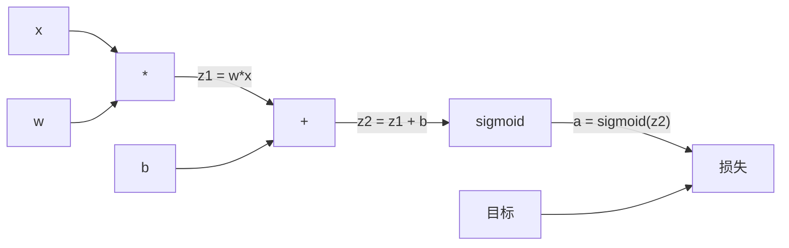
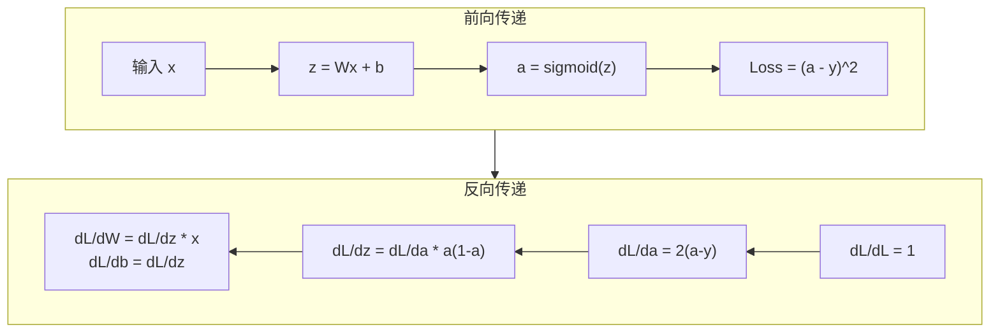

# 从零实现反向传播

> 反向传播是使学习成为可能的算法。没有它，神经网络只是昂贵的随机数生成器。

**Type:** 构建  
**Languages:** Python  
**Prerequisites:** Lesson 03.02（多层网络）  
**Time:** ~120 分钟

## 学习目标

- 实现一个基于 Value 的自动微分引擎，该引擎构建计算图并通过拓扑排序计算梯度
- 使用链式法则推导加法、乘法和 sigmoid 的反向传播
- 使用你从零实现的反向传播引擎训练一个多层网络以解决 XOR 和圆形分类问题
- 在深层 sigmoid 网络中识别梯度消失问题并解释梯度为何呈指数级缩小

## 问题背景

你的网络有一个单隐藏层，输入维度为 768，输出为 3072。这意味着有 2,359,296 个权重。网络做了一个错误预测。哪些权重导致了这个错误？逐一测试每个权重意味着要进行 230 万次前向传播。反向传播可以在一次反向传递中计算出所有 230 万个梯度。这不是一个简单的优化技巧。这是可训练与不可能之间的差别。

朴素方法是：取一个权重，稍微扰动它，重新做前向传播，测量损失是增加还是减少。这样可以得到该权重的梯度。然后对网络中的每个权重都这样做。乘以上千次训练步骤和数百万个数据点。你需要地质年代才能训练出有用的模型。

反向传播解决了这个问题。一次前向传递，一次反向传递，得到所有梯度。诀窍是系统地将微积分中的链式法则应用到计算图上。这就是使深度学习成为现实的算法。没有它，我们仍停留在玩具问题上。

## 概念

### 链式法则，在网络中的应用

你在 Phase 01，Lesson 05 中看到过链式法则。快速回顾：如果 y = f(g(x))，那么 dy/dx = f'(g(x)) * g'(x)。你沿着链相乘各个导数。

在神经网络中，“链”就是从输入到损失的操作序列。每层应用权重，加上偏置，再经过激活函数。损失函数将最终输出与目标比较。反向传播从后往前追踪这条链，计算每个操作对误差的贡献。

### 计算图

每次前向传播都会构建一张图。每个节点是一个操作（乘、加、sigmoid）。每条边在前向传递中携带值，在反向传递中携带梯度。



前向传递：值从左向右流动。x 和 w 产生 z1 = w*x。加上 b 得到 z2。sigmoid 给出激活 a。用损失函数将 a 与目标 y 比较。

反向传递：梯度从右向左流动。从 dL/da（损失关于激活的变化率）开始。乘以 da/dz2（sigmoid 的导数）。得到 dL/dz2。分解为 dL/db（等于 dL/dz2，因为 z2 = z1 + b）和 dL/dz1。然后 dL/dw = dL/dz1 * x，dL/dx = dL/dz1 * w。

图中每个节点在反向传递时只有一个工作：拿到从上游传来的梯度，乘以其局部导数，并传递下去。

### 前向与反向



前向传递存储每一个中间值：z、a、每层的输入。反向传递需要这些存储的值来计算梯度。这就是反向传播核心的内存-计算折衷。你用内存（存储激活）换取速度（一次传递而不是成千上万次）。

### 梯度在网络中的传播

对于一个三层网络，梯度会串联通过每一层：


在每一层，梯度都会乘以 sigmoid 的导数。sigmoid 的导数是 a * (1 - a)，其最大值为 0.25（当 a = 0.5 时）。三层后，梯度至多被乘以 0.25^3 = 0.0156。十层后：0.25^10 = 0.000001。

### 梯度消失

这就是梯度消失问题。Sigmoid 将输出压缩到 0 到 1 之间。其导数始终小于 0.25。堆叠足够多的 sigmoid 层，梯度会收缩到几乎为零。早期层几乎无法学习，因为它们收到的梯度接近零。

```
sigmoid(z):     输出范围 [0, 1]
sigmoid'(z):    最大值 0.25（在 z = 0 时）

5 层之后：    梯度 * 0.25^5 = 原来的 0.001 倍
10 层之后：   梯度 * 0.25^10 = 原来的 0.000001 倍
```

这就是为什么深层 sigmoid 网络几乎无法训练。解决办法 —— ReLU 及其变种 —— 是 Lesson 04 的主题。目前只需理解反向传播本身工作良好，问题在于它要处理的对象。

### 对于 2 层网络推导梯度

对于一个输入 x、隐藏层使用 sigmoid、输出层使用 sigmoid、损失为 MSE 的网络，给出具体数学推导。

前向传递：
```
z1 = W1 * x + b1
a1 = sigmoid(z1)
z2 = W2 * a1 + b2
a2 = sigmoid(z2)
L = (a2 - y)^2
```

反向传递（逐步应用链式法则）：
```
dL/da2 = 2(a2 - y)
da2/dz2 = a2 * (1 - a2)
dL/dz2 = dL/da2 * da2/dz2 = 2(a2 - y) * a2 * (1 - a2)

dL/dW2 = dL/dz2 * a1
dL/db2 = dL/dz2

dL/da1 = dL/dz2 * W2
da1/dz1 = a1 * (1 - a1)
dL/dz1 = dL/da1 * da1/dz1

dL/dW1 = dL/dz1 * x
dL/db1 = dL/dz1
```

每个梯度都是从损失向后跟踪的局部导数的乘积。这就是反向传播的全部内容。

```figure
backprop-vanishing
```

## 构建实现

### 步骤 1：Value 节点

我们计算中的每个数字都变成一个 Value。它存储数据、梯度，以及它是如何被创建的（以便它知道如何向后计算梯度）。

```python
class Value:
    def __init__(self, data, children=(), op=''):
        self.data = data
        self.grad = 0.0
        self._backward = lambda: None
        self._children = set(children)
        self._op = op

    def __repr__(self):
        return f"Value(data={self.data:.4f}, grad={self.grad:.4f})"
```

当前没有梯度（0.0）。当前没有反向函数（无操作）。`_children` 跟踪创建该 Value 的子节点，以便我们后续进行拓扑排序。

### 步骤 2：带反向函数的操作

每个操作创建一个新的 Value，并定义梯度如何通过它们向后流动。

```python
def __add__(self, other):
    other = other if isinstance(other, Value) else Value(other)
    out = Value(self.data + other.data, (self, other), '+')

    def _backward():
        self.grad += out.grad
        other.grad += out.grad

    out._backward = _backward
    return out

def __mul__(self, other):
    other = other if isinstance(other, Value) else Value(other)
    out = Value(self.data * other.data, (self, other), '*')

    def _backward():
        self.grad += other.data * out.grad
        other.grad += self.data * out.grad

    out._backward = _backward
    return out
```

对于加法：d(a+b)/da = 1，d(a+b)/db = 1。所以两个输入都直接获得输出的梯度。

对于乘法：d(a*b)/da = b，d(a*b)/db = a。每个输入获得另一个输入的值乘以输出梯度。

注意使用 `+=` 非常关键。一个 Value 可能在多个操作中被使用。它的梯度是来自所有路径的梯度之和。

### 步骤 3：Sigmoid 和 损失

```python
import math

def sigmoid(self):
    x = self.data
    x = max(-500, min(500, x))
    s = 1.0 / (1.0 + math.exp(-x))
    out = Value(s, (self,), 'sigmoid')

    def _backward():
        self.grad += (s * (1 - s)) * out.grad

    out._backward = _backward
    return out
```

Sigmoid 的导数：sigmoid(x) * (1 - sigmoid(x))。我们在前向传递中计算了 sigmoid(x) = s 并重用它。无需额外工作。

```python
def mse_loss(predicted, target):
    diff = predicted + Value(-target)
    return diff * diff
```

单输出的 MSE： (predicted - target)^2。我们把减法表示为与取负值的加法。

### 步骤 4：反向传递

拓扑排序确保我们以正确的顺序处理节点 —— 一个节点的梯度在我们通过它之前已经被完全累加。

```python
def backward(self):
    topo = []
    visited = set()

    def build_topo(v):
        if v not in visited:
            visited.add(v)
            for child in v._children:
                build_topo(child)
            topo.append(v)

    build_topo(self)
    self.grad = 1.0
    for v in reversed(topo):
        v._backward()
```

从损失开始（梯度 = 1.0，因为 dL/dL = 1）。在排序后的图上向后遍历。每个节点的 `_backward` 将梯度传给它的子节点。

### 步骤 5：层与网络

```python
import random

class Neuron:
    def __init__(self, n_inputs):
        scale = (2.0 / n_inputs) ** 0.5
        self.weights = [Value(random.uniform(-scale, scale)) for _ in range(n_inputs)]
        self.bias = Value(0.0)

    def __call__(self, x):
        act = sum((wi * xi for wi, xi in zip(self.weights, x)), self.bias)
        return act.sigmoid()

    def parameters(self):
        return self.weights + [self.bias]


class Layer:
    def __init__(self, n_inputs, n_outputs):
        self.neurons = [Neuron(n_inputs) for _ in range(n_outputs)]

    def __call__(self, x):
        out = [n(x) for n in self.neurons]
        return out[0] if len(out) == 1 else out

    def parameters(self):
        params = []
        for n in self.neurons:
            params.extend(n.parameters())
        return params


class Network:
    def __init__(self, sizes):
        self.layers = []
        for i in range(len(sizes) - 1):
            self.layers.append(Layer(sizes[i], sizes[i + 1]))

    def __call__(self, x):
        for layer in self.layers:
            x = layer(x)
            if not isinstance(x, list):
                x = [x]
        return x[0] if len(x) == 1 else x

    def parameters(self):
        params = []
        for layer in self.layers:
            params.extend(layer.parameters())
        return params

    def zero_grad(self):
        for p in self.parameters():
            p.grad = 0.0
```

Neuron 接收输入，计算加权和加偏置，然后应用 sigmoid。权重初始化按 sqrt(2/n_inputs) 缩放以在更深的网络中防止 sigmoid 饱和。Layer 是 Neuron 的列表。Network 是 Layer 的列表。`parameters()` 方法收集所有可学习的 Value，以便我们更新它们。

### 步骤 6：在 XOR 上训练

```python
random.seed(42)
net = Network([2, 4, 1])

xor_data = [
    ([0.0, 0.0], 0.0),
    ([0.0, 1.0], 1.0),
    ([1.0, 0.0], 1.0),
    ([1.0, 1.0], 0.0),
]

learning_rate = 1.0

for epoch in range(1000):
    total_loss = Value(0.0)
    for inputs, target in xor_data:
        x = [Value(i) for i in inputs]
        pred = net(x)
        loss = mse_loss(pred, target)
        total_loss = total_loss + loss

    net.zero_grad()
    total_loss.backward()

    for p in net.parameters():
        p.data -= learning_rate * p.grad

    if epoch % 100 == 0:
        print(f"Epoch {epoch:4d} | Loss: {total_loss.data:.6f}")

print("\nXOR Results:")
for inputs, target in xor_data:
    x = [Value(i) for i in inputs]
    pred = net(x)
    print(f"  {inputs} -> {pred.data:.4f} (expected {target})")
```

观察损失下降。从随机预测到正确的 XOR 输出，完全由反向传播计算梯度并朝正确方向调整权重驱动。

### 步骤 7：圆形分类

在 Lesson 02 中你手动调整过圆形分类的权重。现在让网络自己学习。

```python
random.seed(7)

def generate_circle_data(n=100):
    data = []
    for _ in range(n):
        x1 = random.uniform(-1.5, 1.5)
        x2 = random.uniform(-1.5, 1.5)
        label = 1.0 if x1 * x1 + x2 * x2 < 1.0 else 0.0
        data.append(([x1, x2], label))
    return data

circle_data = generate_circle_data(80)

circle_net = Network([2, 8, 1])
learning_rate = 0.5

for epoch in range(2000):
    random.shuffle(circle_data)
    total_loss_val = 0.0
    for inputs, target in circle_data:
        x = [Value(i) for i in inputs]
        pred = circle_net(x)
        loss = mse_loss(pred, target)
        circle_net.zero_grad()
        loss.backward()
        for p in circle_net.parameters():
            p.data -= learning_rate * p.grad
        total_loss_val += loss.data

    if epoch % 200 == 0:
        correct = 0
        for inputs, target in circle_data:
            x = [Value(i) for i in inputs]
            pred = circle_net(x)
            predicted_class = 1.0 if pred.data > 0.5 else 0.0
            if predicted_class == target:
                correct += 1
        accuracy = correct / len(circle_data) * 100
        print(f"Epoch {epoch:4d} | Loss: {total_loss_val:.4f} | Accuracy: {accuracy:.1f}%")
```

这里使用在线 SGD —— 每个样本后就更新权重，而不是累积整个批次的梯度。这更快打破对称性，避免在整个损失地形上让 sigmoid 饱和。每个 epoch 随机打乱数据可以防止网络记住数据顺序。

无需手动调参。网络会自己发现圆形决策边界。这就是反向传播的威力：你定义架构、损失函数和数据，算法会自己找出权重。

## 使用示例

PyTorch 用几行代码就能完成上面所有工作。核心思想完全相同 —— autograd 在前向传递期间构建计算图，并向后追踪以计算梯度。

```python
import torch
import torch.nn as nn

model = nn.Sequential(
    nn.Linear(2, 4),
    nn.Sigmoid(),
    nn.Linear(4, 1),
    nn.Sigmoid(),
)
optimizer = torch.optim.SGD(model.parameters(), lr=1.0)
criterion = nn.MSELoss()

X = torch.tensor([[0,0],[0,1],[1,0],[1,1]], dtype=torch.float32)
y = torch.tensor([[0],[1],[1],[0]], dtype=torch.float32)

for epoch in range(1000):
    pred = model(X)
    loss = criterion(pred, y)
    optimizer.zero_grad()
    loss.backward()
    optimizer.step()

print("PyTorch XOR Results:")
with torch.no_grad():
    for i in range(4):
        pred = model(X[i])
        print(f"  {X[i].tolist()} -> {pred.item():.4f} (expected {y[i].item()})")
```

`loss.backward()` 就是你的 `total_loss.backward()`。`optimizer.step()` 就是你手动的 `p.data -= lr * p.grad`。`optimizer.zero_grad()` 就是你的 `net.zero_grad()`。相同的算法，工业级实现。PyTorch 处理 GPU 加速、混合精度、梯度检查点和数百种层类型。但反向传递仍然是将链式法则应用到相同计算图上的那一步。

训练时运行前向传递、然后反向传递、再更新权重。推理时只运行前向传递。没有梯度，没有更新。这个区别很重要，因为推理才是在生产中发生的事情。当你调用像 Claude 或 GPT 之类的 API 时，你是在运行推理 —— 你的提示词通过网络前向传播，输出令牌从另一端出来。权重不会改变。理解反向传播很重要，因为它塑造了网络中每一个权重。

## 交付成果

本课产出：
- `outputs/prompt-gradient-debugger.md` —— 一个可重复使用的提示，用于诊断任何神经网络中的梯度问题（梯度消失、爆炸、NaN）

## 练习

1. 为 Value 类添加 `__sub__` 方法（a - b = a + (-1 * b））。然后实现 `__neg__` 方法。通过比较像 (a - b)^2 这样的简单表达式与手动计算的梯度来验证梯度是否正确。

2. 为 Value 添加 `relu` 方法（输出 max(0, x)，导数在 x > 0 时为 1，否则为 0）。在隐藏层中将 sigmoid 替换为 relu，再次在 XOR 上训练。比较收敛速度。你应该看到更快的训练 —— 这预示着 Lesson 04。

3. 在 Value 上实现 `__pow__` 方法以支持整数幂。用它将 `mse_loss` 替换为真正的 `(predicted - target) ** 2` 表达式。验证梯度是否与原实现匹配。

4. 在训练循环中添加梯度裁剪：调用 `backward()` 之后，把所有梯度裁剪到 [-1, 1]。训练一个更深的网络（4 层及以上，使用 sigmoid），比较有无裁剪时的损失曲线。这是你针对梯度爆炸的第一个防御手段。

5. 构建一个可视化：在 XOR 训练后，打印网络中每个参数的梯度。识别哪一层的梯度最小。这将展示你在概念部分读到的梯度消失问题。

## 关键词

| 术语 | 人们怎么说 | 实际意义 |
|------|----------------|----------------------|
| Backpropagation | “网络学会了” | 一种算法，通过将链式法则向后应用于计算图来计算每个权重的 dL/dw |
| Computational graph | “网络结构” | 一个有向无环图，节点是操作，边在前向阶段携带值、在反向阶段携带梯度 |
| Chain rule | “把导数相乘” | 如果 y = f(g(x))，那么 dy/dx = f'(g(x)) * g'(x) —— 这是反向传播的数学基础 |
| Gradient | “最陡上升方向” | 损失关于某个参数的偏导数 —— 指示如何改变该参数以减小损失 |
| Vanishing gradient | “深层网络学不到东西” | 当通过像 sigmoid 这样的饱和激活函数传播时，梯度呈指数级缩小 |
| Forward pass | “运行网络” | 通过按序应用每层操作并存储中间值来计算输出 |
| Backward pass | “计算梯度” | 以相反顺序遍历计算图，用链式法则在每个节点累加梯度 |
| Learning rate | “学习有多快” | 一个标量，控制更新权重时的步长：w_new = w_old - lr * gradient |
| Topological sort | “正确的顺序” | 图节点的一种顺序，使得每个节点出现在它依赖的所有节点之后 —— 确保在传播之前梯度被完全累加 |
| Autograd | “自动微分” | 在前向计算期间构建计算图并自动计算梯度的系统 —— 就像 PyTorch 的引擎所做的那样 |

## 延伸阅读

- Rumelhart, Hinton & Williams, "Learning representations by back-propagating errors" (1986) —— 这篇论文使反向传播得到广泛应用，并解锁了多层网络的训练
- 3Blue1Brown, "Neural Networks" 系列 (https://www.youtube.com/playlist?list=PLZHQObOWTQDNU6R1_67000Dx_ZCJB-3pi) —— 关于反向传播和梯度在网络中流动的最佳可视化讲解