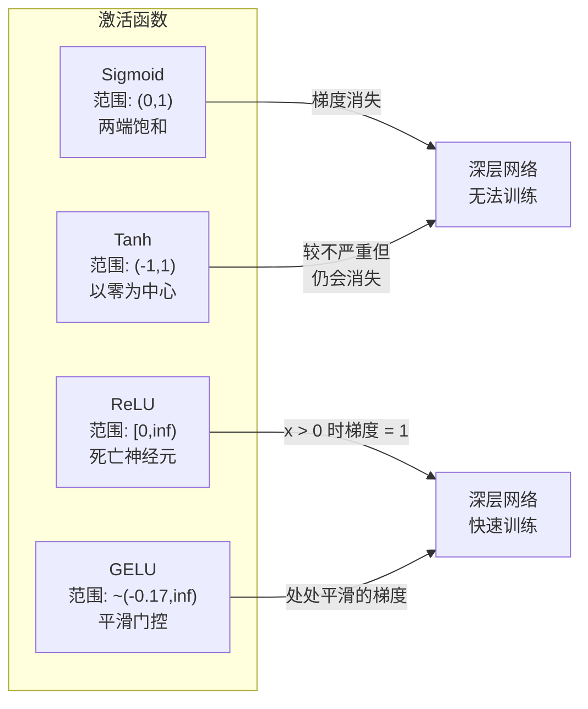
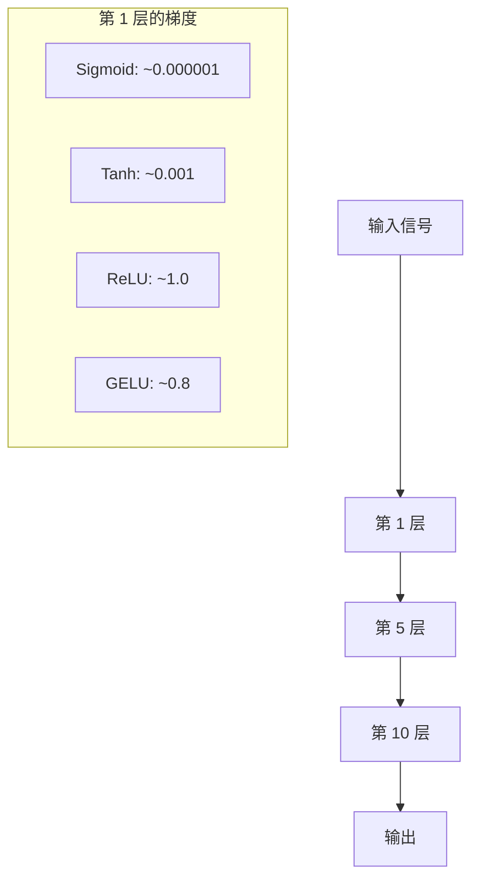
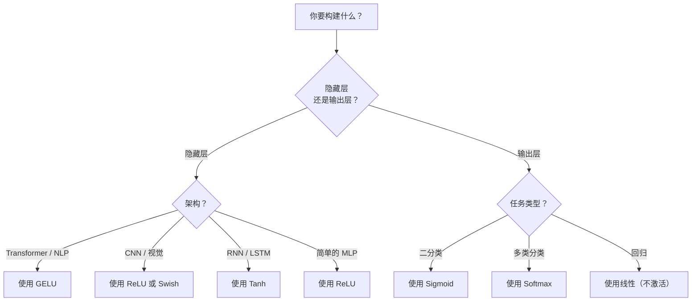

# 激活函数

> 没有非线性，你的 100 层网络不过是一个花哨的矩阵乘法。激活函数是让神经网络在曲线上思考的门。

**Type:** 构建  
**Languages:** Python  
**Prerequisites:** Lesson 03.03（反向传播）  
**Time:** ~75 分钟

## 学习目标

- 从头实现 sigmoid、tanh、ReLU、Leaky ReLU、GELU、Swish 和 softmax 及其导数  
- 通过在 10+ 层中测量激活值大小，诊断梯度消失问题  
- 在 ReLU 网络中检测“死亡神经元”，并解释为什么 GELU 避免这种失败模式  
- 为给定架构（transformer、CNN、RNN、输出层）选择正确的激活函数

## 问题背景

将两个线性变换堆叠：y = W2(W1x + b1) + b2。展开它：y = W2W1x + W2b1 + b2。它只是 y = Ax + c —— 一个线性变换。无论堆叠多少线性层，结果都会简化成一个矩阵乘法。你的 100 层网络与单层具有相同的表示能力。

这并非理论上的好奇：这意味着深度线性网络实际上无法学习 XOR、无法分类螺旋数据集、无法识别人脸。没有激活函数，深度只是一个幻觉。

激活函数打破线性性。它们通过非线性函数扭曲每一层的输出，使网络能够弯曲决策边界、逼近任意函数并真正地学习。但是如果选择了错误的激活函数，梯度可能会消失为零（深层网络中的 sigmoid）、爆炸为无穷大（未受约束的激活在没有谨慎初始化时）或神经元永久死亡（带有大负偏置的 ReLU）。激活函数的选择直接决定了网络是否能够学习。

## 概念

### 为什么需要非线性

矩阵乘法是可组合的。先乘以矩阵 A 再乘以矩阵 B 等同于乘以 AB。这意味着堆叠十个线性层在数学上等价于一个具有一个大矩阵的线性层。所有那些参数、那些深度——白白浪费。你需要某些东西来打破链条，这就是激活函数的作用。

证明如下。线性层计算 f(x) = Wx + b。堆叠两个：

```
Layer 1: h = W1 * x + b1
Layer 2: y = W2 * h + b2
```

代入：

```
y = W2 * (W1 * x + b1) + b2
y = (W2 * W1) * x + (W2 * b1 + b2)
y = A * x + c
```

变成一层。在线之间插入非线性激活 g()：

```
h = g(W1 * x + b1)
y = W2 * h + b2
```

现在代入就不再可约简。W2 * g(W1 * x + b1) + b2 无法被化简为单个线性变换。网络可以表示非线性函数。每增加一层带激活，就增加了表示能力。

### Sigmoid

神经网络最早使用的激活函数。

```
sigmoid(x) = 1 / (1 + e^(-x))
```

输出范围： (0, 1)。光滑、可微，将任意实数映射为类似概率的值。

导数：

```
sigmoid'(x) = sigmoid(x) * (1 - sigmoid(x))
```

该导数的最大值为 0.25，在 x = 0 处取得。在反向传播中，梯度会在层间相乘。十层 sigmoid 意味着梯度最多被 0.25 连乘十次：

```
0.25^10 = 0.000000953674
```

不到百万分之一的原始信号。这就是梯度消失问题。早期层的梯度变得非常小，权重几乎不更新。网络看起来在学习——后层的损失下降——但前几层被冻结。深层 sigmoid 网络根本无法训练。

另外的问题：sigmoid 输出总为正（0 到 1），这意味着权重的梯度符号总是相同。这会导致梯度下降过程中的来回震荡（zig-zag）。

### Tanh

sigmoid 的中心化版本。

```
tanh(x) = (e^x - e^(-x)) / (e^x + e^(-x))
```

输出范围：(-1, 1)。以零为中心，消除了来回震荡问题。

导数：

```
tanh'(x) = 1 - tanh(x)^2
```

最大导数在 x = 0 时为 1.0 —— 比 sigmoid 好 4 倍。但梯度消失问题仍然存在。对于很大的正或负输入，导数趋近于零。十层仍会压缩梯度，只是没那么剧烈。

### ReLU：突破性激活

整流线性单元（Rectified Linear Unit）。由 Nair 和 Hinton 在 2010 年推广（这个函数本身可追溯到 Fukushima 1969 年的工作），它改变了一切。

```
relu(x) = max(0, x)
```

输出范围：[0, ∞)。导数非常简单：

```
relu'(x) = 1  if x > 0
            0  if x <= 0
```

对于正输入没有梯度消失。梯度恰好为 1，直接传递过去。这就是深层网络变得可训练的原因 —— ReLU 保持了层间的梯度幅度。

但有一个失败模式：死亡神经元问题。如果某个神经元的加权输入总是为负（因为偏置过大或不幸的权重初始化），其输出始终为零，梯度始终为零，永远不会更新，永久死亡。实践中，ReLU 网络中可能有 10-40% 的神经元在训练过程中死亡。

### Leaky ReLU

解决死亡神经元的最简单方法。

```
leaky_relu(x) = x        if x > 0
                alpha * x if x <= 0
```

其中 alpha 是一个小常数，典型为 0.01。负侧有一个小斜率而不是零，因此死亡神经元仍能接收到梯度信号并有机会恢复。

### GELU：现代默认

高斯误差线性单元（Gaussian Error Linear Unit）。由 Hendrycks 和 Gimpel 在 2016 年提出。在 BERT、GPT 以及大多数现代 transformer 中作为默认激活函数。

```
gelu(x) = x * Phi(x)
```

其中 Phi(x) 是标准正态分布的累积分布函数。实际中常用的近似：

```
gelu(x) ~= 0.5 * x * (1 + tanh(sqrt(2/pi) * (x + 0.044715 * x^3)))
```

GELU 在所有点上都是平滑的，允许小的负值（不像将负值硬裁剪为零的 ReLU），并具有概率解释：它根据正态分布下输入为正的概率对输入进行加权。这种平滑门控在 transformer 架构中优于 ReLU，因为它提供了更好的梯度流并完全避免了死亡神经元问题。

### Swish / SiLU

一种自门控激活，由 Ramachandran 等人在 2017 年通过自动搜索发现。

```
swish(x) = x * sigmoid(x)
```

Swish 即 x * sigmoid(x)。Google 通过在激活空间上进行自动化搜索发现了它——即用神经网络来设计神经网络的部分结构。

像 GELU 一样，Swish 平滑、非单调，并允许小的负值。区别很微妙：Swish 用 sigmoid 做门控，而 GELU 用高斯 CDF。实践中性能几乎相同。Swish 在 EfficientNet 和一些视觉模型中使用；GELU 在语言模型中占主导。

### Softmax：输出层激活

不用于隐藏层。softmax 将一组原始分数（logits）转换为概率分布。

```
softmax(x_i) = e^(x_i) / sum(e^(x_j) for all j)
```

每个输出在 0 到 1 之间，所有输出之和为 1。这使其成为多类分类的标准最终激活函数。最大 logit 会得到最高概率，但与 argmax 不同，softmax 可微且保留了关于相对置信度的信息。

### 形状比较



### 梯度流比较



### 何时使用哪种激活



```figure
softmax-temperature
```

## 实战：动手实现

### 第 1 步：实现所有激活函数及其导数

每个函数接收一个 float 并返回一个 float。每个导数函数接受相同输入并返回梯度。

```python
import math

def sigmoid(x):
    x = max(-500, min(500, x))
    return 1.0 / (1.0 + math.exp(-x))

def sigmoid_derivative(x):
    s = sigmoid(x)
    return s * (1 - s)

def tanh_act(x):
    return math.tanh(x)

def tanh_derivative(x):
    t = math.tanh(x)
    return 1 - t * t

def relu(x):
    return max(0.0, x)

def relu_derivative(x):
    return 1.0 if x > 0 else 0.0

def leaky_relu(x, alpha=0.01):
    return x if x > 0 else alpha * x

def leaky_relu_derivative(x, alpha=0.01):
    return 1.0 if x > 0 else alpha

def gelu(x):
    return 0.5 * x * (1 + math.tanh(math.sqrt(2 / math.pi) * (x + 0.044715 * x ** 3)))

def gelu_derivative(x):
    phi = 0.5 * (1 + math.erf(x / math.sqrt(2)))
    pdf = math.exp(-0.5 * x * x) / math.sqrt(2 * math.pi)
    return phi + x * pdf

def swish(x):
    return x * sigmoid(x)

def swish_derivative(x):
    s = sigmoid(x)
    return s + x * s * (1 - s)

def softmax(xs):
    max_x = max(xs)
    exps = [math.exp(x - max_x) for x in xs]
    total = sum(exps)
    return [e / total for e in exps]
```

### 第 2 步：可视化梯度在哪些地方死亡

在从 -5 到 5 的 100 个均匀点上计算导数。打印文本直方图，显示每种激活函数的梯度在哪些位置接近零。

```python
def gradient_scan(name, derivative_fn, start=-5, end=5, n=100):
    step = (end - start) / n
    near_zero = 0
    healthy = 0
    for i in range(n):
        x = start + i * step
        g = derivative_fn(x)
        if abs(g) < 0.01:
            near_zero += 1
        else:
            healthy += 1
    pct_dead = near_zero / n * 100
    print(f"{name:15s}: {healthy:3d} healthy, {near_zero:3d} near-zero ({pct_dead:.0f}% dead zone)")

gradient_scan("Sigmoid", sigmoid_derivative)
gradient_scan("Tanh", tanh_derivative)
gradient_scan("ReLU", relu_derivative)
gradient_scan("Leaky ReLU", leaky_relu_derivative)
gradient_scan("GELU", gelu_derivative)
gradient_scan("Swish", swish_derivative)
```

### 第 3 步：梯度消失实验

用 sigmoid 和 ReLU 将信号前向通过 N 层。测量激活幅度如何变化。

```python
import random

def vanishing_gradient_experiment(activation_fn, name, n_layers=10, n_inputs=5):
    random.seed(42)
    values = [random.gauss(0, 1) for _ in range(n_inputs)]

    print(f"\n{name} through {n_layers} layers:")
    for layer in range(n_layers):
        weights = [random.gauss(0, 1) for _ in range(n_inputs)]
        z = sum(w * v for w, v in zip(weights, values))
        activated = activation_fn(z)
        magnitude = abs(activated)
        bar = "#" * int(magnitude * 20)
        print(f"  Layer {layer+1:2d}: magnitude = {magnitude:.6f} {bar}")
        values = [activated] * n_inputs

vanishing_gradient_experiment(sigmoid, "Sigmoid")
vanishing_gradient_experiment(relu, "ReLU")
vanishing_gradient_experiment(gelu, "GELU")
```

### 第 4 步：死亡神经元探测器

创建一个 ReLU 网络，传入随机输入，统计有多少神经元从不激活（从不“点火”）。

```python
def dead_neuron_detector(n_inputs=5, hidden_size=20, n_samples=1000):
    random.seed(0)
    weights = [[random.gauss(0, 1) for _ in range(n_inputs)] for _ in range(hidden_size)]
    biases = [random.gauss(0, 1) for _ in range(hidden_size)]

    fire_counts = [0] * hidden_size

    for _ in range(n_samples):
        inputs = [random.gauss(0, 1) for _ in range(n_inputs)]
        for neuron_idx in range(hidden_size):
            z = sum(w * x for w, x in zip(weights[neuron_idx], inputs)) + biases[neuron_idx]
            if relu(z) > 0:
                fire_counts[neuron_idx] += 1

    dead = sum(1 for c in fire_counts if c == 0)
    rarely_fire = sum(1 for c in fire_counts if 0 < c < n_samples * 0.05)
    healthy = hidden_size - dead - rarely_fire

    print(f"\nDead Neuron Report ({hidden_size} neurons, {n_samples} samples):")
    print(f"  Dead (never fired):     {dead}")
    print(f"  Barely alive (<5%):     {rarely_fire}")
    print(f"  Healthy:                {healthy}")
    print(f"  Dead neuron rate:       {dead/hidden_size*100:.1f}%")

    for i, c in enumerate(fire_counts):
        status = "DEAD" if c == 0 else "WEAK" if c < n_samples * 0.05 else "OK"
        bar = "#" * (c * 40 // n_samples)
        print(f"  Neuron {i:2d}: {c:4d}/{n_samples} fires [{status:4s}] {bar}")

dead_neuron_detector()
```

### 第 5 步：训练对比 —— Sigmoid vs ReLU vs GELU

在圆形数据集上训练相同的两层网络（圆内点 = 类别 1，圆外 = 类别 0），使用三种不同激活函数。比较收敛速度。

```python
def make_circle_data(n=200, seed=42):
    random.seed(seed)
    data = []
    for _ in range(n):
        x = random.uniform(-2, 2)
        y = random.uniform(-2, 2)
        label = 1.0 if x * x + y * y < 1.5 else 0.0
        data.append(([x, y], label))
    return data


class ActivationNetwork:
    def __init__(self, activation_fn, activation_deriv, hidden_size=8, lr=0.1):
        random.seed(0)
        self.act = activation_fn
        self.act_d = activation_deriv
        self.lr = lr
        self.hidden_size = hidden_size

        self.w1 = [[random.gauss(0, 0.5) for _ in range(2)] for _ in range(hidden_size)]
        self.b1 = [0.0] * hidden_size
        self.w2 = [random.gauss(0, 0.5) for _ in range(hidden_size)]
        self.b2 = 0.0

    def forward(self, x):
        self.x = x
        self.z1 = []
        self.h = []
        for i in range(self.hidden_size):
            z = self.w1[i][0] * x[0] + self.w1[i][1] * x[1] + self.b1[i]
            self.z1.append(z)
            self.h.append(self.act(z))

        self.z2 = sum(self.w2[i] * self.h[i] for i in range(self.hidden_size)) + self.b2
        self.out = sigmoid(self.z2)
        return self.out

    def backward(self, target):
        error = self.out - target
        d_out = error * self.out * (1 - self.out)

        for i in range(self.hidden_size):
            d_h = d_out * self.w2[i] * self.act_d(self.z1[i])
            self.w2[i] -= self.lr * d_out * self.h[i]
            for j in range(2):
                self.w1[i][j] -= self.lr * d_h * self.x[j]
            self.b1[i] -= self.lr * d_h
        self.b2 -= self.lr * d_out

    def train(self, data, epochs=200):
        losses = []
        for epoch in range(epochs):
            total_loss = 0
            correct = 0
            for x, y in data:
                pred = self.forward(x)
                self.backward(y)
                total_loss += (pred - y) ** 2
                if (pred >= 0.5) == (y >= 0.5):
                    correct += 1
            avg_loss = total_loss / len(data)
            accuracy = correct / len(data) * 100
            losses.append(avg_loss)
            if epoch % 50 == 0 or epoch == epochs - 1:
                print(f"    Epoch {epoch:3d}: loss={avg_loss:.4f}, accuracy={accuracy:.1f}%")
        return losses


data = make_circle_data()

configs = [
    ("Sigmoid", sigmoid, sigmoid_derivative),
    ("ReLU", relu, relu_derivative),
    ("GELU", gelu, gelu_derivative),
]

results = {}
for name, act_fn, act_d_fn in configs:
    print(f"\n=== Training with {name} ===")
    net = ActivationNetwork(act_fn, act_d_fn, hidden_size=8, lr=0.1)
    losses = net.train(data, epochs=200)
    results[name] = losses

print("\n=== Final Loss Comparison ===")
for name, losses in results.items():
    print(f"  {name:10s}: start={losses[0]:.4f} -> end={losses[-1]:.4f} (improvement: {(1 - losses[-1]/losses[0])*100:.1f}%)")
```

## 在实践框架中的使用

PyTorch 提供了这些激活的函数式和模块形式：

```python
import torch
import torch.nn as nn
import torch.nn.functional as F

x = torch.randn(4, 10)

relu_out = F.relu(x)
gelu_out = F.gelu(x)
sigmoid_out = torch.sigmoid(x)
swish_out = F.silu(x)

logits = torch.randn(4, 5)
probs = F.softmax(logits, dim=1)

model = nn.Sequential(
    nn.Linear(10, 64),
    nn.GELU(),
    nn.Linear(64, 32),
    nn.GELU(),
    nn.Linear(32, 5),
)
```

transformer 的隐藏层：GELU。CNN 的隐藏层：ReLU。分类的输出层：softmax。回归的输出层：无（线性）。概率输出：sigmoid。先从这些默认值开始，只有在有证据时才更改它们。

RNN 和 LSTM 在隐藏状态中使用 tanh，在门（gates）中使用 sigmoid，但如果你今天从头构建，很可能不会使用 RNN。如果你的 ReLU 网络中神经元正在死亡，切换到 GELU。不要随意使用 Leaky ReLU，除非你有明确原因 —— GELU 既解决了死亡神经元问题，又提供了更好的梯度流。

## 交付物

本课将产生：  
- `outputs/prompt-activation-selector.md` -- 一个可复用的提示模板，帮助你为任何架构选择合适的激活函数

## 练习

1. 实现 Parametric ReLU (PReLU)，其负斜率 alpha 为可学习参数。在圆形数据集上训练，并与固定的 Leaky ReLU 进行比较。  
2. 将梯度消失实验改为 50 层而不是 10 层。绘制每层的幅度曲线，比较 sigmoid、tanh、ReLU 和 GELU。每种激活在第几层信号基本上到达零？  
3. 实现 ELU（指数线性单元）：elu(x) = x if x > 0, alpha * (e^x - 1) if x <= 0。在相同网络上比较其相对于 ReLU 的死亡神经元率。  
4. 构建一个“梯度健康监控器”，在训练期间运行：每个 epoch 计算每层的平均梯度幅度。当任何层的梯度低于 0.001 或超过 100 时打印警告。  
5. 将训练对比改为使用 Lesson 01 的 XOR 数据集而不是圆形。哪种激活在 XOR 上收敛最快？为什么这与圆形数据的结果不同？

## 术语表

| 术语 | 常说的话 | 实际含义 |
|------|---------|---------|
| Activation function | "The nonlinear part" | 应用于每个神经元输出以打破线性的函数，使网络能够学习非线性映射 |
| Vanishing gradient | "Gradients disappear in deep networks" | 当激活导数小于 1 时，梯度在层间呈指数缩小，使得前期层不可训练 |
| Exploding gradient | "Gradients blow up" | 当有效乘子大于 1 时，梯度在层间呈指数增长，导致训练不稳定 |
| Dead neuron | "A neuron that stopped learning" | ReLU 神经元的输入永久为负，输出为零且梯度为零 |
| Sigmoid | "Squishes values to 0-1" | logistic 函数 1/(1+e^-x)，历史重要，但在深层网络中会导致梯度消失 |
| ReLU | "Clips negatives to zero" | max(0, x) —— 通过保持梯度幅度使深度学习变得可行的激活函数 |
| GELU | "The transformer activation" | 高斯误差线性单元，一个平滑的激活函数，根据输入为正的概率对其加权 |
| Swish/SiLU | "Self-gated ReLU" | x * sigmoid(x)，通过自动搜索发现，在 EfficientNet 中使用 |
| Softmax | "Turns scores into probabilities" | 将 logits 正规化为概率分布，值都在 (0,1)，且和为 1 |
| Leaky ReLU | "ReLU that doesn't die" | max(alpha*x, x)，alpha 很小（如 0.01），通过允许负侧小梯度防止神经元死亡 |
| Saturation | "The flat part of sigmoid" | 激活函数导数趋近于零的区域，阻断梯度流 |
| Logit | "The raw score before softmax" | 最后一层在应用 softmax 或 sigmoid 之前的未归一化输出 |

## 延伸阅读

- Nair & Hinton, "Rectified Linear Units Improve Restricted Boltzmann Machines" (2010) -- 介绍 ReLU 并使得深层网络可训练的论文  
- Hendrycks & Gimpel, "Gaussian Error Linear Units (GELUs)" (2016) -- 提出了成为 transformer 默认的激活函数  
- Ramachandran et al., "Searching for Activation Functions" (2017) -- 通过自动搜索发现 Swish，表明激活函数设计可以自动化  
- Glorot & Bengio, "Understanding the difficulty of training deep feedforward neural networks" (2010) -- 诊断了梯度消失/爆炸并提出 Xavier 初始化的方法  
- Goodfellow, Bengio, Courville, "Deep Learning" Chapter 6.3 (https://www.deeplearningbook.org/) -- 关于隐藏单元和激活函数的严格论述