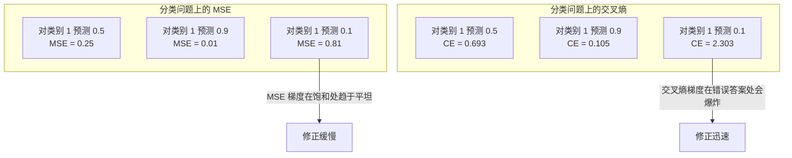
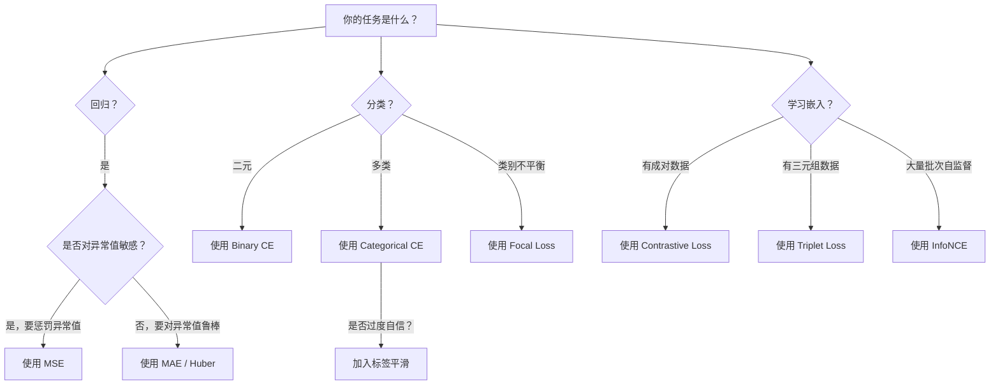
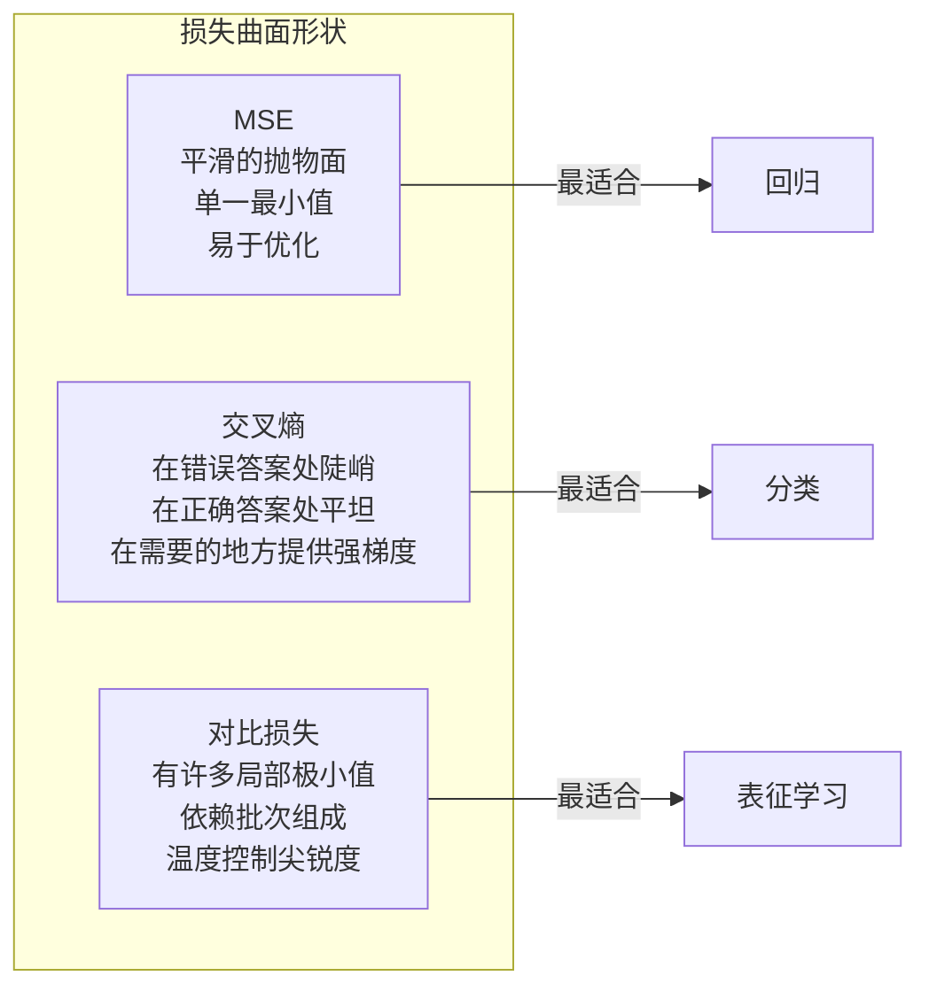

# Loss Functions

> 你的网络给出了一个预测。真实标签却不是那样。错误有多大？那个数就是损失。选错损失函数，你的模型就会完全朝着错误的方向优化。

**Type:** 构建  
**Languages:** Python  
**Prerequisites:** Lesson 03.04（激活函数）  
**Time:** ~75 分钟

## 学习目标

- 从头实现 MSE、二元交叉熵、类别交叉熵和对比损失（InfoNCE）及其梯度  
- 通过演示“对所有样本预测 0.5”这一失败模式，解释为何 MSE 会在分类任务上失效  
- 将标签平滑应用到交叉熵，并描述它如何防止过度自信的预测  
- 为回归、二元分类、多类分类和嵌入学习任务选择正确的损失函数

## 问题

在一个分类问题上最小化 MSE 的模型会为所有样本自信地预测 0.5。它正在最小化损失，但毫无用处。

损失函数是模型实际优化的唯一东西。不是准确率，不是 F1，也不是项目汇报的任何指标。优化器对损失函数求梯度并调整权重以使该数变小。如果损失函数没有捕捉到你关心的东西，模型会找到数学上最便宜的满足方式，而那个方式几乎从来都不是你想要的。

下面是一个具体例子。你有一个二分类任务，两个类别各占 50%。你用 MSE 作为损失。模型对每个输入都预测 0.5。平均 MSE 为 0.25，这是在没有实际学习任何东西的情况下的最小值。模型没有任何判别能力，但技术上已经最小化了你的损失函数。换成交叉熵，模型被迫把预测推向 0 或 1，因为 -log(0.5) = 0.693 是一个糟糕的损失，而 -log(0.99) = 0.01 会奖励高置信的正确预测。损失函数的选择决定了模型是学习还是在“投机取巧”地满足度量。

情况会更糟。在自监督学习中，你甚至没有标签。对比损失完全定义了学习信号：什么算相似，什么算不同，以及模型应该有多努力地把它们分离。对比损失设置错误会导致嵌入塌缩为单点——每个输入映射到相同的向量。技术上损失为零，但完全没有价值。

## 概念

### 均方误差（MSE）

回归的默认选择。计算预测与目标之间的平方差，再对所有样本取平均。

```
MSE = (1/n) * sum((y_pred - y_true)^2)
```

为什么要平方：它以二次方式惩罚大的错误。误差为 2 的代价是 4 倍于误差为 1。误差为 10 的代价是 100 倍。这使得 MSE 对异常值敏感——单个极端错误的预测会主导损失。

举个实际例子：如果你的模型预测房价，大多数房子误差为 $10,000，但有一栋豪宅误差为 $200,000，MSE 会积极尝试修正那栋豪宅，可能会损害其余 99 户的性能。

MSE 对预测的梯度为：

```
dMSE/dy_pred = (2/n) * (y_pred - y_true)
```

关于误差线性增长。更大的错误得到更大的梯度。对于回归这是优点（大的错误需要大的修正），但对于分类这是缺点（你希望以指数方式惩罚自信的错误，而不是线性）。

### 交叉熵损失

分类问题的损失函数。源于信息论——衡量预测概率分布与真实分布之间的差异。

二元交叉熵（Binary Cross-Entropy, BCE）：

```
BCE = -(y * log(p) + (1 - y) * log(1 - p))
```

其中 y 是真实标签（0 或 1），p 是预测概率。

为什么 -log(p) 有效：当真实标签为 1 且预测 p = 0.99 时，损失为 -log(0.99) = 0.01；当预测 p = 0.01 时，损失为 -log(0.01) = 4.6。这个约 460 倍的差距说明了交叉熵的作用：它残酷地惩罚自信的错误预测，同时几乎不惩罚自信且正确的预测。

梯度也说明了同样的事实：

```
dBCE/dp = -(y/p) + (1-y)/(1-p)
```

当 y = 1 且 p 接近 0 时，梯度为 -1/p，趋近于负无穷。模型获得巨大的信号去修正错误。当 p 接近 1 时，梯度很小。已经正确了，没什么可修正的。

类别交叉熵（Categorical Cross-Entropy）：

用于独热编码目标的多类分类。

```
CCE = -sum(y_i * log(p_i))
```

只有真实类对损失有贡献（因为其他 y_i 都为零）。如果有 10 个类别且正确类的概率为 0.1（随机猜测），损失为 -log(0.1) = 2.3；如果正确类的概率为 0.9，则损失为 -log(0.9) = 0.105。模型学习将概率质量集中到正确答案上。

### 为什么 MSE 在分类上失效



当预测接近 0 或 1（由于 sigmoid 饱和）时，MSE 的梯度会变平。交叉熵梯度会补偿这一点——-log 会抵消 sigmoid 的平坦区，在最需要的时候提供强梯度。

### 标签平滑

标准的独热标签表示“这是 100% 的类别 3，其他全为 0”。这是一个很强的断言。标签平滑将其软化：

```
smooth_label = (1 - alpha) * one_hot + alpha / num_classes
```

当 alpha = 0.1 且有 10 个类别时：目标从 [0, 0, 1, 0, ...] 变为 [0.01, 0.01, 0.91, 0.01, ...]。模型的目标从 1.0 降到了 0.91。

为什么有效：试图通过 softmax 输出恰好 1.0 的模型需要把对应的 logit 推到无穷大。这会导致过度自信、泛化能力下降，并使模型对分布漂移变得脆弱。标签平滑将目标上限限制在 0.9（alpha=0.1），把 logits 保持在合理范围内。GPT 和大多数现代模型都使用标签平滑或等价方法。

### 对比损失

没有标签。没有类别。只有输入对：这些相似还是不同？

SimCLR 风格的对比损失（NT-Xent / InfoNCE）：

对一张图像生成两个增强视图（裁剪、旋转、色彩扰动）。它们构成“正样本对”——它们应该有相似的嵌入。批次中其他所有图像构成“负样本对”——它们应有不同的嵌入。

```
L = -log(exp(sim(z_i, z_j) / tau) / sum(exp(sim(z_i, z_k) / tau)))
```

其中 sim() 是余弦相似度，z_i 和 z_j 是正样本对，求和是对所有负样本进行，tau（温度）控制分布的尖锐程度。温度越低 = 难负样本越强 = 更积极的分离。

实际数值：批量大小为 256 意味着每对正样本有 255 个负样本。温度 tau = 0.07（SimCLR 默认）。该损失看起来像相似度上的 softmax——它希望正样本对的相似度在所有 256 个选项中最高。

三元组损失（Triplet Loss）：

使用三输入：anchor、positive（同类）、negative（不同类）。

```
L = max(0, d(anchor, positive) - d(anchor, negative) + margin)
```

margin（通常 0.2–1.0）强制正负距离之间有最小差距。如果负样本已经远得足够，损失为零——没有梯度，也没有更新。这提高了训练效率，但需要精心选择三元组（挖掘接近 anchor 的困难负样本）。

### Focal Loss

用于类别不平衡的数据集。标准交叉熵对所有正确分类的样本一视同仁。Focal loss 会下调容易样本的权重：

```
FL = -alpha * (1 - p_t)^gamma * log(p_t)
```

其中 p_t 是对真实类别的预测概率，gamma 控制关注度。gamma = 0 时为标准交叉熵；gamma = 2（默认）时：

- 容易样本（p_t = 0.9）：权重 = (0.1)^2 = 0.01，被有效忽略  
- 困难样本（p_t = 0.1）：权重 = (0.9)^2 = 0.81，保留完整梯度信号

Focal loss 由 Lin 等人在目标检测中提出，当时 99% 的候选区域是背景（容易的负样本）。没有 focal loss，模型会被大量容易的背景样本淹没，无法学习检测物体。使用它后，模型把容量集中在重要的困难样本上。

### 损失函数决策树



### 损失地形（Loss Landscape）



```figure
cross-entropy-loss
```

## 实现

### 第 1 步：MSE 及其梯度

```python
def mse(predictions, targets):
    n = len(predictions)
    total = 0.0
    for p, t in zip(predictions, targets):
        total += (p - t) ** 2
    return total / n

def mse_gradient(predictions, targets):
    n = len(predictions)
    grads = []
    for p, t in zip(predictions, targets):
        grads.append(2.0 * (p - t) / n)
    return grads
```

### 第 2 步：二元交叉熵

log(0) 问题是真实存在的。如果模型对正样本精确预测 0，log(0) = 负无穷。裁剪可以防止这种情况。

```python
import math

def binary_cross_entropy(predictions, targets, eps=1e-15):
    n = len(predictions)
    total = 0.0
    for p, t in zip(predictions, targets):
        p_clipped = max(eps, min(1 - eps, p))
        total += -(t * math.log(p_clipped) + (1 - t) * math.log(1 - p_clipped))
    return total / n

def bce_gradient(predictions, targets, eps=1e-15):
    grads = []
    for p, t in zip(predictions, targets):
        p_clipped = max(eps, min(1 - eps, p))
        grads.append(-(t / p_clipped) + (1 - t) / (1 - p_clipped))
    return grads
```

### 第 3 步：带 softmax 的类别交叉熵

softmax 将原始 logits 转换为概率。然后我们对独热目标计算交叉熵。

```python
def softmax(logits):
    max_val = max(logits)
    exps = [math.exp(x - max_val) for x in logits]
    total = sum(exps)
    return [e / total for e in exps]

def categorical_cross_entropy(logits, target_index, eps=1e-15):
    probs = softmax(logits)
    p = max(eps, probs[target_index])
    return -math.log(p)

def cce_gradient(logits, target_index):
    probs = softmax(logits)
    grads = list(probs)
    grads[target_index] -= 1.0
    return grads
```

softmax + 交叉熵的梯度有优美的简化：对真实类为 predicted_probability - 1，对其他类为 predicted_probability。这并非巧合——这就是 softmax 与交叉熵配对的原因。

### 第 4 步：标签平滑

```python
def label_smoothed_cce(logits, target_index, num_classes, alpha=0.1, eps=1e-15):
    probs = softmax(logits)
    loss = 0.0
    for i in range(num_classes):
        if i == target_index:
            smooth_target = 1.0 - alpha + alpha / num_classes
        else:
            smooth_target = alpha / num_classes
        p = max(eps, probs[i])
        loss += -smooth_target * math.log(p)
    return loss
```

### 第 5 步：对比损失（简化的 InfoNCE）

```python
def cosine_similarity(a, b):
    dot = sum(x * y for x, y in zip(a, b))
    norm_a = math.sqrt(sum(x * x for x in a))
    norm_b = math.sqrt(sum(x * x for x in b))
    if norm_a < 1e-10 or norm_b < 1e-10:
        return 0.0
    return dot / (norm_a * norm_b)

def contrastive_loss(anchor, positive, negatives, temperature=0.07):
    sim_pos = cosine_similarity(anchor, positive) / temperature
    sim_negs = [cosine_similarity(anchor, neg) / temperature for neg in negatives]

    max_sim = max(sim_pos, max(sim_negs)) if sim_negs else sim_pos
    exp_pos = math.exp(sim_pos - max_sim)
    exp_negs = [math.exp(s - max_sim) for s in sim_negs]
    total_exp = exp_pos + sum(exp_negs)

    return -math.log(max(1e-15, exp_pos / total_exp))
```

### 第 6 步：分类任务中 MSE vs 交叉熵

用相同的网络（第 04 课的圆形数据集）分别用两种损失训练。观察交叉熵收敛更快。

```python
import random

def sigmoid(x):
    x = max(-500, min(500, x))
    return 1.0 / (1.0 + math.exp(-x))

def make_circle_data(n=200, seed=42):
    random.seed(seed)
    data = []
    for _ in range(n):
        x = random.uniform(-2, 2)
        y = random.uniform(-2, 2)
        label = 1.0 if x * x + y * y < 1.5 else 0.0
        data.append(([x, y], label))
    return data


class LossComparisonNetwork:
    def __init__(self, loss_type="bce", hidden_size=8, lr=0.1):
        random.seed(0)
        self.loss_type = loss_type
        self.lr = lr
        self.hidden_size = hidden_size

        self.w1 = [[random.gauss(0, 0.5) for _ in range(2)] for _ in range(hidden_size)]
        self.b1 = [0.0] * hidden_size
        self.w2 = [random.gauss(0, 0.5) for _ in range(hidden_size)]
        self.b2 = 0.0

    def forward(self, x):
        self.x = x
        self.z1 = []
        self.h = []
        for i in range(self.hidden_size):
            z = self.w1[i][0] * x[0] + self.w1[i][1] * x[1] + self.b1[i]
            self.z1.append(z)
            self.h.append(max(0.0, z))

        self.z2 = sum(self.w2[i] * self.h[i] for i in range(self.hidden_size)) + self.b2
        self.out = sigmoid(self.z2)
        return self.out

    def backward(self, target):
        if self.loss_type == "mse":
            d_loss = 2.0 * (self.out - target)
        else:
            eps = 1e-15
            p = max(eps, min(1 - eps, self.out))
            d_loss = -(target / p) + (1 - target) / (1 - p)

        d_sigmoid = self.out * (1 - self.out)
        d_out = d_loss * d_sigmoid

        for i in range(self.hidden_size):
            d_relu = 1.0 if self.z1[i] > 0 else 0.0
            d_h = d_out * self.w2[i] * d_relu
            self.w2[i] -= self.lr * d_out * self.h[i]
            for j in range(2):
                self.w1[i][j] -= self.lr * d_h * self.x[j]
            self.b1[i] -= self.lr * d_h
        self.b2 -= self.lr * d_out

    def compute_loss(self, pred, target):
        if self.loss_type == "mse":
            return (pred - target) ** 2
        else:
            eps = 1e-15
            p = max(eps, min(1 - eps, pred))
            return -(target * math.log(p) + (1 - target) * math.log(1 - p))

    def train(self, data, epochs=200):
        losses = []
        for epoch in range(epochs):
            total_loss = 0.0
            correct = 0
            for x, y in data:
                pred = self.forward(x)
                self.backward(y)
                total_loss += self.compute_loss(pred, y)
                if (pred >= 0.5) == (y >= 0.5):
                    correct += 1
            avg_loss = total_loss / len(data)
            accuracy = correct / len(data) * 100
            losses.append((avg_loss, accuracy))
            if epoch % 50 == 0 or epoch == epochs - 1:
                print(f"    Epoch {epoch:3d}: loss={avg_loss:.4f}, accuracy={accuracy:.1f}%")
        return losses
```

## 使用指南

PyTorch 提供了所有标准损失函数并内置了数值稳定性的实现：

```python
import torch
import torch.nn as nn
import torch.nn.functional as F

predictions = torch.tensor([0.9, 0.1, 0.7], requires_grad=True)
targets = torch.tensor([1.0, 0.0, 1.0])

mse_loss = F.mse_loss(predictions, targets)
bce_loss = F.binary_cross_entropy(predictions, targets)

logits = torch.randn(4, 10)
labels = torch.tensor([3, 7, 1, 9])
ce_loss = F.cross_entropy(logits, labels)
ce_smooth = F.cross_entropy(logits, labels, label_smoothing=0.1)
```

使用 `F.cross_entropy`（不要用 `F.nll_loss` 加上手动 softmax）。它将 log-softmax 和负对数似然结合成一个数值稳定的操作。先单独应用 softmax 再取 log 数值稳定性较差——在减去大型指数时会丢失精度。

对于对比学习，大多数团队会使用自定义实现或像 `lightly`、`pytorch-metric-learning` 这样的库。核心循环总是相同的：计算成对相似度，构造正负样本上的 softmax，然后反向传播。

## 部署产出（Ship It）

本课会生成：
- `outputs/prompt-loss-function-selector.md` -- 一个可复用的提示，用于选择合适的损失函数  
- `outputs/prompt-loss-debugger.md` -- 当你的损失曲线看起来异常时使用的诊断提示

## 练习

1. 实现 Huber 损失（平滑的 L1 损失），它在小误差时是 MSE，在大误差时是 MAE。训练一个回归网络去拟合 y = sin(x)，在 5% 的训练目标中加入随机噪声（异常值），比较 MSE 与 Huber 在测试集上的最终误差。

2. 在二分类训练循环中加入 focal loss。构建一个不平衡数据集（90% 类别 0，10% 类别 1）。比较标准 BCE 与 focal loss（gamma=2）在 200 个 epoch 后对少数类召回率的影响。

3. 实现带半难负样本挖掘的三元组损失。生成 5 个类别的 2D 嵌入数据。对于每个 anchor，找到最难但仍比正样本远的负样本（semi-hard）。比较与随机三元组选择的收敛速度。

4. 运行 MSE vs 交叉熵对比，但在训练过程中记录每层的梯度幅值。绘制每个 epoch 的平均梯度范数。验证交叉熵在模型最不确定的早期 epoch 里产生更大的梯度。

5. 实现 KL 散度损失，并验证最小化 KL(true || predicted) 在真实分布为独热时与交叉熵具有相同的梯度。然后尝试软目标（例如知识蒸馏），此时“真实”分布来自教师模型的 softmax 输出。

## 关键词

| 术语 | 常说的含义 | 实际含义 |
|------|----------------|----------------------|
| Loss function | "模型错了多少" | 一个可微分函数，将预测和目标映射为标量，优化器最小化它 |
| MSE | "平均平方误差" | 预测与目标差异的平方的平均；以二次方式惩罚大误差 |
| Cross-entropy | "分类损失" | 使用 -log(p) 衡量预测概率分布与真实分布之间的差异 |
| Binary cross-entropy | "BCE" | 两类的交叉熵：-(y*log(p) + (1-y)*log(1-p)) |
| Label smoothing | "软化目标" | 将硬 0/1 目标替换为软值（例如 0.1/0.9），以防止过度自信并改善泛化 |
| Contrastive loss | "拉近-推远" | 通过使相似对靠近、不相似对远离来学习表征的损失 |
| InfoNCE | "CLIP/SimCLR 的损失" | 对相似度得分做归一化温度缩放的交叉熵；将对比学习视作分类问题 |
| Focal loss | "处理不平衡数据的方法" | 通过 (1-p_t)^gamma 加权交叉熵，降低容易样本权重，关注困难样本 |
| Triplet loss | "锚-正-负" | 强制锚点比负样本距离正样本近至少一个 margin 的损失 |
| Temperature | "尖锐度调节" | 在 logits/相似度上做除法的标量，控制分布的尖锐程度；越小越尖锐 |

## 深入阅读

- Lin et al., "Focal Loss for Dense Object Detection" (2017) — 在目标检测中处理极端类别不平衡（RetinaNet）提出了 focal loss  
- Chen et al., "A Simple Framework for Contrastive Learning of Visual Representations" (SimCLR, 2020) — 定义了带 NT-Xent 损失的现代对比学习流程  
- Szegedy et al., "Rethinking the Inception Architecture" (2016) — 引入了标签平滑作为正则化技术，现在已成为大多数大型模型的标准做法  
- Hinton et al., "Distilling the Knowledge in a Neural Network" (2015) — 使用软目标和 KL 散度的知识蒸馏，是模型压缩的基础工作