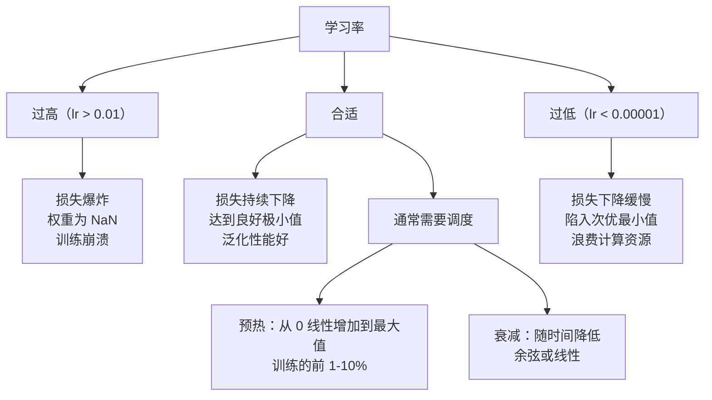
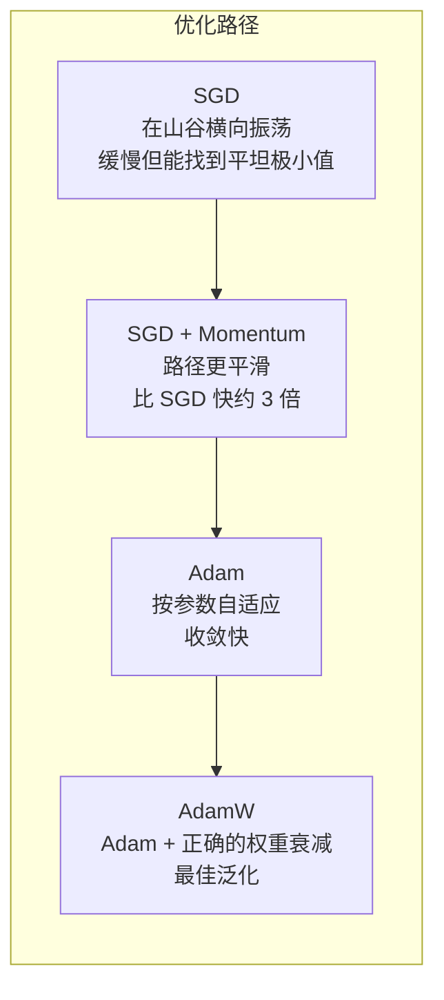
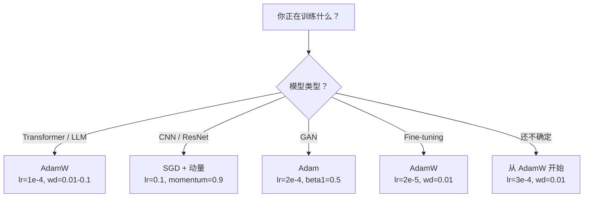

# 优化器

> 梯度下降告诉你朝哪个方向移动。它并不说明移动多远或多快。SGD 是指南针。Adam 则是带有交通数据的 GPS。

**Type:** 构建
**Languages:** Python
**Prerequisites:** Lesson 03.05（损失函数）
**Time:** ~75 分钟

## 学习目标

- 用 Python 从头实现 SGD、带动量的 SGD、Adam 和 AdamW 优化器
- 解释 Adam 的偏差校正如何补偿在训练早期对零初始化矩估计的影响
- 演示为什么在相同任务上，AdamW 比通过损失添加 L2 正则化的 Adam 有更好的泛化能力
- 为 transformers、CNN、GAN 和微调选择合适的优化器及默认超参数

## 问题陈述

你已经计算出梯度。你知道第 4,721 个权重应该减少 0.003 才能降低损失。但 0.003 是以什么单位？被什么缩放？在第 1 步和第 1,000 步应该移动相同的量吗？

普通的梯度下降对每个参数在每一步都应用相同的学习率：w = w - lr * gradient。这会产生三个在实践中让神经网络训练变得痛苦的问题。

首先，振荡。损失景观很少像一个光滑的碗，更像是一条又长又窄的山谷。梯度指向横穿山谷的方向（陡峭方向），而不是沿山谷的方向（浅方向）。梯度下降在窄的维度上来回反弹，而在有用的方向上只取得很小的进展。你见过这种情况：损失快速下降，然后停滞，这并不是模型收敛，而是在振荡。

其次，为所有参数使用同一学习率是错误的。有些权重需要较大的更新（它们还处于欠拟合的早期阶段）。有些权重需要非常小的更新（它们接近最优值）。适用于前者的学习率会毁掉后者，反之亦然。

第三，鞍点。在高维空间中，损失景观存在大量平坦区域，梯度接近零。普通 SGD 以梯度的速度爬行，而梯度几乎为零。模型看起来被卡住了。它实际上并没有卡住——它处在一个平坦区域，对面有有用的下降。但 SGD 没有推动穿透的机制。

Adam 解决了这三点。它为每个参数维护两个运行平均值——梯度的平均（动量，处理振荡）和梯度平方的平均（自适应步长，处理不同尺度）。结合在前几步的偏差校正，它为你提供了一个在 80% 问题上用默认超参数即可工作的通用优化器。本课从头构建它，让你确切理解在剩余 20% 情况下它何时以及为什么会失败。

## 概念

### 随机梯度下降（SGD）

最简单的优化器。在一个小批量上计算梯度，并朝相反方向更新。

```
w = w - lr * gradient
```

“随机”意味着你使用数据的随机子集（小批量）来估计梯度，而不是整个数据集。这种噪声实际上是有用的 —— 它有助于逃离尖锐的局部极小值。但噪声也会引起振荡。

学习率是唯一的可调节参数。过高：损失发散。过低：训练耗时过长。最优值取决于架构、数据、批大小和训练当前阶段。对于现代网络的普通 SGD，典型值在 0.01 到 0.1 之间。但即使在一次训练运行中，理想学习率也会改变。

### 动量

“球体下山”的类比被过度使用，但它是准确的。你不仅仅按梯度更新，而是维护一个累积过去梯度的速度（velocity）。

```
m_t = beta * m_{t-1} + gradient
w = w - lr * m_t
```

Beta（通常为 0.9）控制保留多少历史。beta = 0.9 时，动量大致相当于最近 10 个梯度的平均（1 / (1 - 0.9) = 10）。

为什么这能修复振荡：指向相同方向的梯度会累积。方向翻转的梯度相互抵消。在窄山谷中，横向分量每步都会改变符号并被抑制。沿山谷的分量保持一致并被放大。结果是在有用方向上平滑加速。

实际数据：在条件差的损失景观上，仅使用 SGD 可能需要 10,000 步。带动量的 SGD（beta=0.9）通常在同一问题上需要 3,000–5,000 步。提速不是微不足道的。

### RMSProp

首个真正有效的每参数自适应学习率方法。由 Hinton 在 Coursera 课程中提出（未正式发表）。

```
s_t = beta * s_{t-1} + (1 - beta) * gradient^2
w = w - lr * gradient / (sqrt(s_t) + epsilon)
```

s_t 跟踪梯度平方的运行平均。具有持续大梯度的参数会被一个较大的数除以（有效学习率较小）。具有小梯度的参数被一个较小的数除以（有效学习率较大）。

这解决了“为所有参数使用同一学习率”的问题。一个已经得到大更新的权重可能接近目标——放慢它。一个一直得到很小更新的权重可能还未被充分训练——加速它。

Epsilon（通常为 1e-8）用于防止在参数未被更新时除以零。

### Adam：动量 + RMSProp

Adam 结合了两者的思想。它为每个参数维护两个指数移动平均值：

```
m_t = beta1 * m_{t-1} + (1 - beta1) * gradient        (一阶矩：均值)
v_t = beta2 * v_{t-1} + (1 - beta2) * gradient^2       (二阶矩：方差)
```

偏差校正（Bias correction）是大多数解释跳过但关键的细节。在第 1 步，m_1 = (1 - beta1) * gradient。对于 beta1 = 0.9，这就是 0.1 * gradient —— 小了 10 倍。移动平均尚未“热身”。偏差校正用于补偿：

```
m_hat = m_t / (1 - beta1^t)
v_hat = v_t / (1 - beta2^t)
```

在第 1 步且 beta1 = 0.9 时：m_hat = m_1 / (1 - 0.9) = m_1 / 0.1 = 实际梯度。在第 100 步时：(1 - 0.9^100) 约等于 1.0，所以校正消失。偏差校正对前 ~10 步很重要，~50 步后无关紧要。

更新如下：

```
w = w - lr * m_hat / (sqrt(v_hat) + epsilon)
```

Adam 默认：lr = 0.001，beta1 = 0.9，beta2 = 0.999，epsilon = 1e-8。这些默认值适用于 80% 的问题。当它们不适用时，优先调整 lr，然后是 beta2。几乎不需要更改 beta1 或 epsilon。

### AdamW：正确的权重衰减

L2 正则化向损失中添加 lambda * w^2。在普通 SGD 中，这等价于权重衰减（在每步中从权重中减去 lambda * w）。在 Adam 中，这种等价关系被破坏了。

Loshchilov & Hutter 的洞察：当你向损失添加 L2，然后 Adam 处理梯度时，自适应学习率也会缩放正则化项。具有大梯度方差的参数得到的正则化较少。具有小方差的参数得到的正则化较多。这并不是你想要的——你希望无论梯度统计如何都对参数施加统一的正则化。

AdamW 通过在 Adam 更新之后直接对权重应用权重衰减来修复这一点：

```
w = w - lr * m_hat / (sqrt(v_hat) + epsilon) - lr * lambda * w
```

权重衰减项（lr * lambda * w）不会被 Adam 的自适应因子缩放。每个参数都获得相同比例的收缩。

这看似是一个细节，但并非如此。AdamW 在几乎所有任务上都比 Adam + L2 更容易收敛到更好的解。它是 PyTorch 中训练 transformers、扩散模型和大多数现代架构的默认优化器。BERT、GPT、LLaMA、Stable Diffusion —— 都使用了 AdamW。

### 学习率：最重要的超参数



如果你只调一个超参数，请调学习率。学习率改变 10 倍比你做出的任何架构决定更重要。常见默认：

- SGD：lr = 0.01 到 0.1
- Adam/AdamW：lr = 1e-4 到 3e-4
- 微调预训练模型：lr = 1e-5 到 5e-5
- 学习率预热：在训练前 1-10% 的步数内线性从 0 增加到目标值

### 优化器比较



### 每种优化器适用场景



```figure
optimizer-trajectory
```

## 实现它

### 步骤 1：普通 SGD

```python
class SGD:
    def __init__(self, lr=0.01):
        self.lr = lr

    def step(self, params, grads):
        for i in range(len(params)):
            params[i] -= self.lr * grads[i]
```

### 步骤 2：带动量的 SGD

```python
class SGDMomentum:
    def __init__(self, lr=0.01, beta=0.9):
        self.lr = lr
        self.beta = beta
        self.velocities = None

    def step(self, params, grads):
        if self.velocities is None:
            self.velocities = [0.0] * len(params)
        for i in range(len(params)):
            self.velocities[i] = self.beta * self.velocities[i] + grads[i]
            params[i] -= self.lr * self.velocities[i]
```

### 步骤 3：Adam

```python
import math

class Adam:
    def __init__(self, lr=0.001, beta1=0.9, beta2=0.999, epsilon=1e-8):
        self.lr = lr
        self.beta1 = beta1
        self.beta2 = beta2
        self.epsilon = epsilon
        self.m = None
        self.v = None
        self.t = 0

    def step(self, params, grads):
        if self.m is None:
            self.m = [0.0] * len(params)
            self.v = [0.0] * len(params)

        self.t += 1

        for i in range(len(params)):
            self.m[i] = self.beta1 * self.m[i] + (1 - self.beta1) * grads[i]
            self.v[i] = self.beta2 * self.v[i] + (1 - self.beta2) * grads[i] ** 2

            m_hat = self.m[i] / (1 - self.beta1 ** self.t)
            v_hat = self.v[i] / (1 - self.beta2 ** self.t)

            params[i] -= self.lr * m_hat / (math.sqrt(v_hat) + self.epsilon)
```

### 步骤 4：AdamW

```python
class AdamW:
    def __init__(self, lr=0.001, beta1=0.9, beta2=0.999, epsilon=1e-8, weight_decay=0.01):
        self.lr = lr
        self.beta1 = beta1
        self.beta2 = beta2
        self.epsilon = epsilon
        self.weight_decay = weight_decay
        self.m = None
        self.v = None
        self.t = 0

    def step(self, params, grads):
        if self.m is None:
            self.m = [0.0] * len(params)
            self.v = [0.0] * len(params)

        self.t += 1

        for i in range(len(params)):
            self.m[i] = self.beta1 * self.m[i] + (1 - self.beta1) * grads[i]
            self.v[i] = self.beta2 * self.v[i] + (1 - self.beta2) * grads[i] ** 2

            m_hat = self.m[i] / (1 - self.beta1 ** self.t)
            v_hat = self.v[i] / (1 - self.beta2 ** self.t)

            params[i] -= self.lr * m_hat / (math.sqrt(v_hat) + self.epsilon)
            params[i] -= self.lr * self.weight_decay * params[i]
```

### 步骤 5：训练对比

在 lesson 05 的圆形数据集上，用这四个优化器训练相同的两层网络并比较收敛情况。

```python
import random

def sigmoid(x):
    x = max(-500, min(500, x))
    return 1.0 / (1.0 + math.exp(-x))

def make_circle_data(n=200, seed=42):
    random.seed(seed)
    data = []
    for _ in range(n):
        x = random.uniform(-2, 2)
        y = random.uniform(-2, 2)
        label = 1.0 if x * x + y * y < 1.5 else 0.0
        data.append(([x, y], label))
    return data


class OptimizerTestNetwork:
    def __init__(self, optimizer, hidden_size=8):
        random.seed(0)
        self.hidden_size = hidden_size
        self.optimizer = optimizer

        self.w1 = [[random.gauss(0, 0.5) for _ in range(2)] for _ in range(hidden_size)]
        self.b1 = [0.0] * hidden_size
        self.w2 = [random.gauss(0, 0.5) for _ in range(hidden_size)]
        self.b2 = 0.0

    def get_params(self):
        params = []
        for row in self.w1:
            params.extend(row)
        params.extend(self.b1)
        params.extend(self.w2)
        params.append(self.b2)
        return params

    def set_params(self, params):
        idx = 0
        for i in range(self.hidden_size):
            for j in range(2):
                self.w1[i][j] = params[idx]
                idx += 1
        for i in range(self.hidden_size):
            self.b1[i] = params[idx]
            idx += 1
        for i in range(self.hidden_size):
            self.w2[i] = params[idx]
            idx += 1
        self.b2 = params[idx]

    def forward(self, x):
        self.x = x
        self.z1 = []
        self.h = []
        for i in range(self.hidden_size):
            z = self.w1[i][0] * x[0] + self.w1[i][1] * x[1] + self.b1[i]
            self.z1.append(z)
            self.h.append(max(0.0, z))

        self.z2 = sum(self.w2[i] * self.h[i] for i in range(self.hidden_size)) + self.b2
        self.out = sigmoid(self.z2)
        return self.out

    def compute_grads(self, target):
        eps = 1e-15
        p = max(eps, min(1 - eps, self.out))
        d_loss = -(target / p) + (1 - target) / (1 - p)
        d_sigmoid = self.out * (1 - self.out)
        d_out = d_loss * d_sigmoid

        grads = [0.0] * (self.hidden_size * 2 + self.hidden_size + self.hidden_size + 1)
        idx = 0
        for i in range(self.hidden_size):
            d_relu = 1.0 if self.z1[i] > 0 else 0.0
            d_h = d_out * self.w2[i] * d_relu
            grads[idx] = d_h * self.x[0]
            grads[idx + 1] = d_h * self.x[1]
            idx += 2

        for i in range(self.hidden_size):
            d_relu = 1.0 if self.z1[i] > 0 else 0.0
            grads[idx] = d_out * self.w2[i] * d_relu
            idx += 1

        for i in range(self.hidden_size):
            grads[idx] = d_out * self.h[i]
            idx += 1

        grads[idx] = d_out
        return grads

    def train(self, data, epochs=300):
        losses = []
        for epoch in range(epochs):
            total_loss = 0.0
            correct = 0
            for x, y in data:
                pred = self.forward(x)
                grads = self.compute_grads(y)
                params = self.get_params()
                self.optimizer.step(params, grads)
                self.set_params(params)

                eps = 1e-15
                p = max(eps, min(1 - eps, pred))
                total_loss += -(y * math.log(p) + (1 - y) * math.log(1 - p))
                if (pred >= 0.5) == (y >= 0.5):
                    correct += 1
            avg_loss = total_loss / len(data)
            accuracy = correct / len(data) * 100
            losses.append((avg_loss, accuracy))
            if epoch % 75 == 0 or epoch == epochs - 1:
                print(f"    Epoch {epoch:3d}: loss={avg_loss:.4f}, accuracy={accuracy:.1f}%")
        return losses
```

## 使用方法

PyTorch 的优化器处理参数组、梯度裁剪和学习率调度：

```python
import torch
import torch.optim as optim

model = torch.nn.Sequential(
    torch.nn.Linear(784, 256),
    torch.nn.ReLU(),
    torch.nn.Linear(256, 10),
)

optimizer = optim.AdamW(model.parameters(), lr=3e-4, weight_decay=0.01)

scheduler = optim.lr_scheduler.CosineAnnealingLR(optimizer, T_max=100)

for epoch in range(100):
    optimizer.zero_grad()
    output = model(torch.randn(32, 784))
    loss = torch.nn.functional.cross_entropy(output, torch.randint(0, 10, (32,)))
    loss.backward()
    torch.nn.utils.clip_grad_norm_(model.parameters(), max_norm=1.0)
    optimizer.step()
    scheduler.step()
```

模式总是：zero_grad、forward、loss、backward、（裁剪）、step、（调度）。记住这个顺序。顺序搞错（例如在 optimizer.step() 之前调用 scheduler.step()）是常见且难以发现的 bug 来源。

对于 CNN，许多从业者仍然更喜欢 SGD + 动量（lr=0.1，momentum=0.9，weight_decay=1e-4）并配合 step 或余弦调度。SGD 往往找到更平坦的极小值，通常泛化更好。对于 transformers 和大规模语言模型，AdamW 加上预热 + 余弦衰减是通用默认选项。没有充分理由不要去对抗这一共识。

## 交付物

本课产生：
- `outputs/prompt-optimizer-selector.md` -- 一个用于为任意架构选择合适优化器和学习率的决策提示

## 练习

1. 实现 Nesterov 动量：在“前瞻”位置（w - lr * beta * v）而不是当前位置计算梯度。将其与标准动量在圆形数据集上的收敛情况进行比较。

2. 实现学习率预热调度：在训练的前 10% 步数内线性从 0 增加到 max_lr，然后余弦衰减到 0。比较带预热的 Adam 与不带预热的 Adam，在达到圆形数据集 90% 准确率所需的 epoch 数。

3. 跟踪 Adam 训练期间每个参数的有效学习率。有效速率为 lr * m_hat / (sqrt(v_hat) + eps)。绘制在第 10、50 和 200 步后的有效速率分布。所有参数的更新速度是否相同？

4. 实现梯度裁剪（按全局范数裁剪）。将最大梯度范数设为 1.0。使用较大学习率（Adam lr=0.01），比较是否裁剪在 10 个随机种子下出现发散（损失变为 NaN）的运行次数。

5. 比较 Adam 与 AdamW 在具有大权重的网络上的表现。将所有权重初始化为 [-5, 5]（远大于常规初始化）。使用 weight_decay=0.1 训练 200 个 epoch。绘制两种优化器在训练期间权重的 L2 范数。AdamW 应显示更快的权重收缩。

## 术语表

| Term | 常见说法 | 实际含义 |
|------|----------------|----------------------|
| Learning rate | "步长" | 梯度更新的标量乘子；训练中最关键的超参数 |
| SGD | "基本梯度下降" | 随机梯度下降：在小批量上计算梯度并用 lr * gradient 更新权重 |
| Momentum | "滚动球类比" | 过去梯度的指数移动平均；抑制振荡并加速一致方向 |
| RMSProp | "自适应学习率" | 用最近梯度的均方根来除以每个参数的梯度；均衡各参数的学习率 |
| Adam | "默认优化器" | 结合动量（一阶矩）和 RMSProp（二阶矩），并对初始步进行偏差校正 |
| AdamW | "正确实现的 Adam" | 将权重衰减与 Adam 解耦；直接对权重施加衰减而不是通过梯度实现 |
| Bias correction | "运行平均的预热" | 用 (1 - beta^t) 去除因 Adam 动量变量零初始化带来的偏差 |
| Weight decay | "收缩权重" | 在每步中按权重值减去一部分；对大权重施加惩罚的正则化方式 |
| Learning rate schedule | "随时间改变 lr" | 在训练期间调整学习率的函数；预热 + 余弦衰减是现代默认 |
| Gradient clipping | "限制梯度范数" | 当梯度范数超过阈值时对梯度向量进行缩放；防止梯度爆炸更新 |

## 延伸阅读

- Kingma & Ba, "Adam: A Method for Stochastic Optimization" (2014) -- Adam 原始论文，包含收敛分析和偏差校正推导
- Loshchilov & Hutter, "Decoupled Weight Decay Regularization" (2017) -- 证明了在 Adam 中 L2 正则化与权重衰减并不等价并提出 AdamW
- Smith, "Cyclical Learning Rates for Training Neural Networks" (2017) -- 引入了 LR 范围测试和周期性调度，减少固定学习率调优的需要
- Ruder, "An Overview of Gradient Descent Optimization Algorithms" (2016) -- 关于各种优化器变体的最佳综述，包含清晰的比较和直觉解释