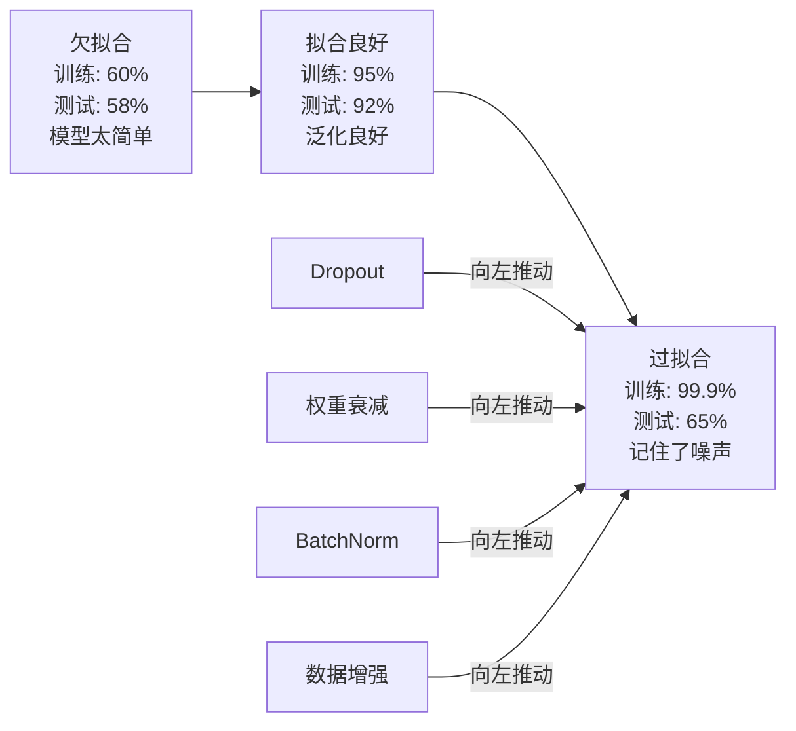
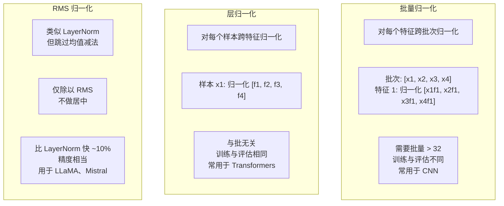
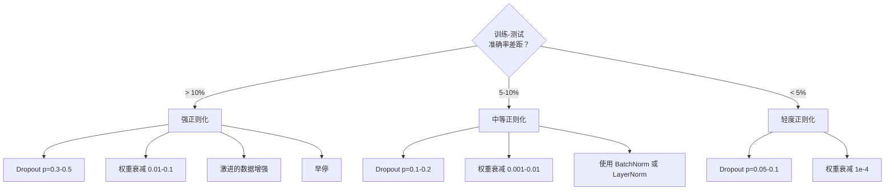

# 正则化

> 你的模型在训练集上得到了 99%，在测试集上只有 60%。它记住了训练样本而不是学习到泛化能力。正则化就是你对复杂性征收的“税”，以强制模型泛化。

**Type:** Build  
**Languages:** Python  
**Prerequisites:** Lesson 03.06（优化器）  
**Time:** ~75 分钟

## 学习目标

- 从头实现带倒置缩放的 Dropout、L2 权重衰减、Batch Normalization、Layer Normalization 和 RMSNorm  
- 通过正则化实验测量训练-测试准确率差距并诊断过拟合  
- 解释为什么 transformer 使用 LayerNorm 而不是 BatchNorm，以及为什么现代大模型更偏好 RMSNorm  
- 根据过拟合严重程度应用合适的正则化组合

## 问题背景

具有足够参数的神经网络可以记住任意数据集。这不是假设——Zhang 等人（2017）通过在 ImageNet 上使用随机标签训练标准网络证明了这一点。网络在完全随机的标签分配上达到了接近零的训练损失。它们记住了一百万个随机的输入-输出对，数据中没有可学习的模式。训练损失完美，而测试准确率为零。

这就是过拟合问题，且随着模型规模增大问题会更严重。GPT-3 有 1750 亿参数，训练集大约有 5000 亿标记（tokens）。如此大量的参数使得模型有能力逐字记住训练数据的显著片段。如果没有正则化，它只会复述训练样例而不是学习可泛化的模式。

训练性能与测试性能之间的差距就是过拟合差距。本课中的每种技术都从不同角度去减少这一差距。Dropout 强制网络不能依赖任何单个神经元；权重衰减阻止单个权重变得过大；BatchNorm 平滑损失曲面，使优化器更容易找到更平坦、更可泛化的极小值；LayerNorm 在 BatchNorm 失效的场景（小批量、可变长度序列）也能起作用；RMSNorm 通过去掉均值计算把成本再降大约 10%。每种技术都很简单，合在一起则能决定模型是记忆还是泛化。

## 概念

### 过拟合谱系

每个模型都位于一个从欠拟合（模型过于简单无法捕捉模式）到过拟合（模型过于复杂以至于捕捉噪声）的谱系上。理想点位于两者之间，正则化把模型从过拟合的方向拉回到这个理想区间。



### Dropout

最简单且解释最优雅的正则化技巧。训练时，以概率 p 随机将每个神经元的输出设为零。

```
output = activation(z) * mask    where mask[i] ~ Bernoulli(1 - p)
```

当 p = 0.5 时，每次前向传播有一半的神经元被置为 0。网络必须学习到冗余表示，因为它无法预知哪些神经元会可用。这防止了协同适应（co-adaptation）——神经元依赖于特定其他神经元存在的情况。

集成解释：具有 N 个神经元且使用 dropout 的网络会产生 2^N 个可能的子网络（每种神经元开/关的组合）。使用 dropout 训练大致上是在同时训练所有 2^N 个子网络，每个子网络见到不同的小批量。在测试时使用所有神经元（不使用 dropout）并将输出按 (1 - p) 缩放以匹配训练期间的期望值。这等同于对 2^N 个子网络的预测做平均——从单个模型得到一个巨大的集成。

在实践中，缩放是在训练期间应用而不是测试期间（倒置 dropout）：

```
训练时:  output = activation(z) * mask / (1 - p)
测试时:  output = activation(z)   (无需改变)
```

这样更简洁，因为测试代码无需感知 dropout。

常用默认率：transformer 通常 p = 0.1，MLP 为 p = 0.5，CNN 为 p = 0.2–0.3。更大的 dropout 值意味着更强的正则化，但也更容易导致欠拟合。

### 权重衰减（L2 正则化）

将所有权重的平方和加到损失上：

```
total_loss = task_loss + (lambda / 2) * sum(w_i^2)
```

正则化项的梯度是 lambda * w。这意味着每一步中，每个权重都会按与其大小成比例的分数向零收缩。大的权重受到更大的惩罚。模型被推动去寻找没有单个权重占主导的解。

为何有助于泛化：过拟合模型往往有较大的权重，这会放大训练数据中的噪声。权重衰减保持权重较小，限制模型的有效容量，迫使它依赖稳健、可泛化的特征而不是记忆化的特殊性。

超参数 lambda 控制强度。典型值：

- transformer 上使用 AdamW 时常用 0.01
- CNN 上用 SGD 时常用 1e-4
- 在严重过拟合的模型上可用 0.1

如第 06 课所述，权重衰减与 L2 正则化在 SGD 下等价，但在 Adam 中不等价。用 Adam 训练时应始终使用 AdamW（解耦的权重衰减）。

### Batch Normalization

在传递到下一层之前，按小批量对每层的输出做归一化。

对于某一层的一批激活：

```
mu = (1/B) * sum(x_i)           (批均值)
sigma^2 = (1/B) * sum((x_i - mu)^2)   (批方差)
x_hat = (x_i - mu) / sqrt(sigma^2 + eps)   (归一化)
y = gamma * x_hat + beta        (缩放与偏移)
```

gamma 和 beta 是可学习参数，允许网络在归一化后恢复到原来的尺度/偏移（如果这是最优的）。没有它们的话，你会强制每层输出为零均值单位方差，而网络可能并不想要这样。

训练与推理的分离：训练时 mu 和 sigma 来自当前小批量；推理时使用训练期间累积的运行平均（指数移动平均，momentum = 0.1 即 90% 旧 + 10% 新）。

为什么 BatchNorm 有效仍有争议。原论文宣称它减少了“内部协变量偏移”（internal covariate shift），但 Santurkar 等人（2018）表明这一解释是错误的。真正的原因：BatchNorm 使损失曲面更平滑。梯度更具预测性，Lipschitz 常数更小，优化器可以安全地采取更大的步长。这就是为什么 BatchNorm 允许使用更高的学习率并更快收敛的原因。

BatchNorm 有一个根本限制：它依赖批统计量。当批大小为 1 时，均值和方差没有意义。批量很小时（< 32）统计量噪声太大会损害性能。这对物体检测（内存限制批量大小）和语言建模（序列长度可变）等任务尤为重要。

### Layer Normalization

在特征维度上做归一化，而不是在批维度上。对单个样本：

```
mu = (1/D) * sum(x_j)           (特征均值)
sigma^2 = (1/D) * sum((x_j - mu)^2)   (特征方差)
x_hat = (x_j - mu) / sqrt(sigma^2 + eps)
y = gamma * x_hat + beta
```

D 为特征维度。每个样本独立归一化——不依赖批大小。这就是 transformer 使用 LayerNorm 而不是 BatchNorm 的原因：序列长度可变，批大小通常很小（或在生成时为 1），并且训练与推理的计算方式相同。

在 transformer 中，LayerNorm 通常在每个自注意力块和每个前馈块之后应用（Post-LN），或者放在它们之前（Pre-LN，训练更稳定）。

### RMSNorm

即去掉均值减法的 LayerNorm。由 Zhang & Sennrich（2019）提出。

```
rms = sqrt((1/D) * sum(x_j^2))
y = gamma * x / rms
```

仅此而已。没有均值计算，也没有 beta 参数。观察到：LayerNorm 中的重新居中（均值减法）对模型性能贡献很小，但会增加计算开销。去掉它可以以约 10% 更低的开销获得相同的精度。

LLaMA、LLaMA 2、LLaMA 3、Mistral 以及大多数现代 LLM 在实践中使用 RMSNorm 而不是 LayerNorm。在数十亿参数和万亿级标记的规模上，这 10% 的开销节省非常可观。

### 归一化比较



### 数据增强作为正则化

不是修改模型而是修改数据。对训练输入做变换，同时保持标签不变：

- 图像：随机裁剪、翻转、旋转、色彩扰动、cutout  
- 文本：同义词替换、回译、随机删除  
- 音频：时长拉伸、音高变换、加噪声

其效果等同于正则化：增加训练集的有效大小，使模型更难记住具体样例。看到每张图像一次且原样的模型可以把它记住；看到每张图像的 50 个增强版本的模型被迫学习不变结构。

### 提前停止（Early Stopping）

最简单的正则器：当验证损失开始上升时停止训练。那时模型尚未过拟合。实践中你会在每个 epoch 跟踪验证损失，保存最佳模型，并继续训练一个“耐心”窗口（通常 5–20 个 epoch）。如果在耐心窗口内验证损失没有改善，则停止并加载保存的最佳模型。

### 何时应用何种方法



```figure
l2-regularization
```

## 实现

### 第 1 步：Dropout（训练/评估 模式）

```python
import random
import math


class Dropout:
    def __init__(self, p=0.5):
        self.p = p
        self.training = True
        self.mask = None

    def forward(self, x):
        if not self.training:
            return list(x)
        self.mask = []
        output = []
        for val in x:
            if random.random() < self.p:
                self.mask.append(0)
                output.append(0.0)
            else:
                self.mask.append(1)
                output.append(val / (1 - self.p))
        return output

    def backward(self, grad_output):
        grads = []
        for g, m in zip(grad_output, self.mask):
            if m == 0:
                grads.append(0.0)
            else:
                grads.append(g / (1 - self.p))
        return grads
```

### 第 2 步：L2 权重衰减

```python
def l2_regularization(weights, lambda_reg):
    penalty = 0.0
    for w in weights:
        penalty += w * w
    return lambda_reg * 0.5 * penalty

def l2_gradient(weights, lambda_reg):
    return [lambda_reg * w for w in weights]
```

### 第 3 步：Batch Normalization

```python
class BatchNorm:
    def __init__(self, num_features, momentum=0.1, eps=1e-5):
        self.gamma = [1.0] * num_features
        self.beta = [0.0] * num_features
        self.eps = eps
        self.momentum = momentum
        self.running_mean = [0.0] * num_features
        self.running_var = [1.0] * num_features
        self.training = True
        self.num_features = num_features

    def forward(self, batch):
        batch_size = len(batch)
        if self.training:
            mean = [0.0] * self.num_features
            for sample in batch:
                for j in range(self.num_features):
                    mean[j] += sample[j]
            mean = [m / batch_size for m in mean]

            var = [0.0] * self.num_features
            for sample in batch:
                for j in range(self.num_features):
                    var[j] += (sample[j] - mean[j]) ** 2
            var = [v / batch_size for v in var]

            for j in range(self.num_features):
                self.running_mean[j] = (1 - self.momentum) * self.running_mean[j] + self.momentum * mean[j]
                self.running_var[j] = (1 - self.momentum) * self.running_var[j] + self.momentum * var[j]
        else:
            mean = list(self.running_mean)
            var = list(self.running_var)

        self.x_hat = []
        output = []
        for sample in batch:
            normalized = []
            out_sample = []
            for j in range(self.num_features):
                x_h = (sample[j] - mean[j]) / math.sqrt(var[j] + self.eps)
                normalized.append(x_h)
                out_sample.append(self.gamma[j] * x_h + self.beta[j])
            self.x_hat.append(normalized)
            output.append(out_sample)
        return output
```

### 第 4 步：Layer Normalization

```python
class LayerNorm:
    def __init__(self, num_features, eps=1e-5):
        self.gamma = [1.0] * num_features
        self.beta = [0.0] * num_features
        self.eps = eps
        self.num_features = num_features

    def forward(self, x):
        mean = sum(x) / len(x)
        var = sum((xi - mean) ** 2 for xi in x) / len(x)

        self.x_hat = []
        output = []
        for j in range(self.num_features):
            x_h = (x[j] - mean) / math.sqrt(var + self.eps)
            self.x_hat.append(x_h)
            output.append(self.gamma[j] * x_h + self.beta[j])
        return output
```

### 第 5 步：RMSNorm

```python
class RMSNorm:
    def __init__(self, num_features, eps=1e-6):
        self.gamma = [1.0] * num_features
        self.eps = eps
        self.num_features = num_features

    def forward(self, x):
        rms = math.sqrt(sum(xi * xi for xi in x) / len(x) + self.eps)
        output = []
        for j in range(self.num_features):
            output.append(self.gamma[j] * x[j] / rms)
        return output
```

### 第 6 步：有/无正则化的训练对比

```python
def sigmoid(x):
    x = max(-500, min(500, x))
    return 1.0 / (1.0 + math.exp(-x))


def make_circle_data(n=200, seed=42):
    random.seed(seed)
    data = []
    for _ in range(n):
        x = random.uniform(-2, 2)
        y = random.uniform(-2, 2)
        label = 1.0 if x * x + y * y < 1.5 else 0.0
        data.append(([x, y], label))
    return data


class RegularizedNetwork:
    def __init__(self, hidden_size=16, lr=0.05, dropout_p=0.0, weight_decay=0.0):
        random.seed(0)
        self.hidden_size = hidden_size
        self.lr = lr
        self.dropout_p = dropout_p
        self.weight_decay = weight_decay
        self.dropout = Dropout(p=dropout_p) if dropout_p > 0 else None

        self.w1 = [[random.gauss(0, 0.5) for _ in range(2)] for _ in range(hidden_size)]
        self.b1 = [0.0] * hidden_size
        self.w2 = [random.gauss(0, 0.5) for _ in range(hidden_size)]
        self.b2 = 0.0

    def forward(self, x, training=True):
        self.x = x
        self.z1 = []
        self.h = []
        for i in range(self.hidden_size):
            z = self.w1[i][0] * x[0] + self.w1[i][1] * x[1] + self.b1[i]
            self.z1.append(z)
            self.h.append(max(0.0, z))

        if self.dropout and training:
            self.dropout.training = True
            self.h = self.dropout.forward(self.h)
        elif self.dropout:
            self.dropout.training = False
            self.h = self.dropout.forward(self.h)

        self.z2 = sum(self.w2[i] * self.h[i] for i in range(self.hidden_size)) + self.b2
        self.out = sigmoid(self.z2)
        return self.out

    def backward(self, target):
        eps = 1e-15
        p = max(eps, min(1 - eps, self.out))
        d_loss = -(target / p) + (1 - target) / (1 - p)
        d_sigmoid = self.out * (1 - self.out)
        d_out = d_loss * d_sigmoid

        for i in range(self.hidden_size):
            d_relu = 1.0 if self.z1[i] > 0 else 0.0
            d_h = d_out * self.w2[i] * d_relu
            self.w2[i] -= self.lr * (d_out * self.h[i] + self.weight_decay * self.w2[i])
            for j in range(2):
                self.w1[i][j] -= self.lr * (d_h * self.x[j] + self.weight_decay * self.w1[i][j])
            self.b1[i] -= self.lr * d_h
        self.b2 -= self.lr * d_out

    def evaluate(self, data):
        correct = 0
        total_loss = 0.0
        for x, y in data:
            pred = self.forward(x, training=False)
            eps = 1e-15
            p = max(eps, min(1 - eps, pred))
            total_loss += -(y * math.log(p) + (1 - y) * math.log(1 - p))
            if (pred >= 0.5) == (y >= 0.5):
                correct += 1
        return total_loss / len(data), correct / len(data) * 100

    def train_model(self, train_data, test_data, epochs=300):
        history = []
        for epoch in range(epochs):
            total_loss = 0.0
            correct = 0
            for x, y in train_data:
                pred = self.forward(x, training=True)
                self.backward(y)
                eps = 1e-15
                p = max(eps, min(1 - eps, pred))
                total_loss += -(y * math.log(p) + (1 - y) * math.log(1 - p))
                if (pred >= 0.5) == (y >= 0.5):
                    correct += 1
            train_loss = total_loss / len(train_data)
            train_acc = correct / len(train_data) * 100
            test_loss, test_acc = self.evaluate(test_data)
            history.append((train_loss, train_acc, test_loss, test_acc))
            if epoch % 75 == 0 or epoch == epochs - 1:
                gap = train_acc - test_acc
                print(f"    Epoch {epoch:3d}: train_acc={train_acc:.1f}%, test_acc={test_acc:.1f}%, gap={gap:.1f}%")
        return history
```

## 使用方法

PyTorch 提供了所有归一化和正则化模块：

```python
import torch
import torch.nn as nn

model = nn.Sequential(
    nn.Linear(784, 256),
    nn.BatchNorm1d(256),
    nn.ReLU(),
    nn.Dropout(0.3),
    nn.Linear(256, 128),
    nn.BatchNorm1d(128),
    nn.ReLU(),
    nn.Dropout(0.3),
    nn.Linear(128, 10),
)

model.train()
out_train = model(torch.randn(32, 784))

model.eval()
out_test = model(torch.randn(1, 784))
```

调用 `model.train()` / `model.eval()` 的切换至关重要。它打开/关闭 Dropout，并告诉 BatchNorm 在训练时使用批统计量、推理时使用运行统计量。忘记在推理前调用 `model.eval()` 是深度学习中最常见的错误之一。因为仍在使用 Dropout 且 BatchNorm 使用小批量统计量，你的测试准确率会随机波动。

对于 transformer，模式略有不同：

```python
class TransformerBlock(nn.Module):
    def __init__(self, d_model=512, nhead=8, dropout=0.1):
        super().__init__()
        self.attention = nn.MultiheadAttention(d_model, nhead, dropout=dropout)
        self.norm1 = nn.LayerNorm(d_model)
        self.ff = nn.Sequential(
            nn.Linear(d_model, d_model * 4),
            nn.GELU(),
            nn.Linear(d_model * 4, d_model),
            nn.Dropout(dropout),
        )
        self.norm2 = nn.LayerNorm(d_model)
        self.dropout = nn.Dropout(dropout)

    def forward(self, x):
        attended, _ = self.attention(x, x, x)
        x = self.norm1(x + self.dropout(attended))
        x = self.norm2(x + self.ff(x))
        return x
```

LayerNorm，而不是 BatchNorm。Dropout p=0.1，而不是 p=0.5。这些是 transformer 的默认设置。

## 交付物

本课产出：
- `outputs/prompt-regularization-advisor.md` -- 一个诊断过拟合并推荐合适正则化策略的提示模板

## 练习

1. 为二维数据实现空间 Dropout：不是丢弃单个神经元，而是丢弃整个特征通道。通过将连续的一组特征视为通道并丢弃整组来模拟。在 circle 数据集（hidden_size=32）上比较空间 Dropout 与标准 Dropout 的训练-测试差距。

2. 将第 05 课的标签平滑（label smoothing）与本课的 Dropout 结合实现。用四种配置训练：都不使用、仅 Dropout、仅标签平滑、两者都用。测量每种配置的最终训练-测试准确率差距。哪种组合的差距最小？

3. 在你的 circle 数据集网络中，在隐藏层与激活之间加入 BatchNorm 层。在学习率 0.01、0.05 和 0.1 下分别训练，有无 BatchNorm。BatchNorm 应该能在高学习率下保持训练稳定，而 Vanilla 网络在该学习率下可能发散。

4. 实现早停：每个 epoch 跟踪测试损失，保存最优权重，如果测试损失在 20 个 epoch 内没有改善则停止。对正则化网络运行 1000 个 epoch。报告哪个 epoch 达到最佳测试准确率，以及你节省了多少 epoch 的计算。

5. 在一个 4 层网络上比较 LayerNorm 与 RMSNorm（不要只用 2 层）。用相同的权重初始化两者。训练 200 个 epoch，比较最终精度、训练速度（每 epoch 时间）和第一层的梯度幅度。验证 RMSNorm 在精度相同的情况下更快。

## 术语表

| 术语 | 常说法 | 实际含义 |
|------|--------|--------|
| 过拟合 | “模型记住了数据” | 当模型在训练集上的性能显著优于测试集时，表明它学到了噪声而非信号 |
| 正则化 | “防止过拟合” | 任何约束模型复杂度以提高泛化性的技术：Dropout、权重衰减、归一化、数据增强等 |
| Dropout | “随机神经元删除” | 在训练时以概率 p 将随机神经元置零，迫使学习冗余表示；等价于训练一个子网络的集成 |
| 权重衰减 | “L2 惩罚” | 在每一步通过减去 lambda * w 来收缩所有权重；通过权重幅度惩罚复杂度 |
| Batch Normalization | “按批归一化” | 使用训练时的批统计量与推理时的运行平均在批维度上对层输出归一化 |
| Layer Normalization | “按样本归一化” | 在每个样本的特征维上做归一化；与批无关，常用于 batch 大小可变的 transformer |
| RMSNorm | “去均值的 LayerNorm” | 均方根归一化；去掉 LayerNorm 的均值减法以获得约 10% 的加速且精度相当 |
| 早停 | “在过拟合前停止” | 当验证/测试损失停止改进时停止训练；最简单的正则器，通常与其他方法结合使用 |
| 数据增强 | “用少量数据生成更多” | 对训练输入做变换（翻转、裁剪、加噪等）以增加有效数据量并强制学习不变性 |
| 泛化差距 | “训练-测试差异” | 训练与测试性能之差；正则化旨在最小化该差距 |

## 延伸阅读

- Srivastava et al., "Dropout: A Simple Way to Prevent Neural Networks from Overfitting" (2014) — Dropout 原始论文，包含集成解释与大量实验  
- Ioffe & Szegedy, "Batch Normalization: Accelerating Deep Network Training by Reducing Internal Covariate Shift" (2015) — 引入 BatchNorm 的论文与训练流程，是深度学习领域被引用最多的论文之一  
- Zhang & Sennrich, "Root Mean Square Layer Normalization" (2019) — 证明 RMSNorm 在降低计算量的同时与 LayerNorm 达到相当精度；被 LLaMA 与 Mistral 等采用  
- Zhang et al., "Understanding Deep Learning Requires Rethinking Generalization" (2017) — 里程碑式论文，展示神经网络能记忆随机标签，挑战了传统泛化观念