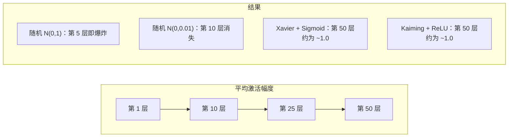
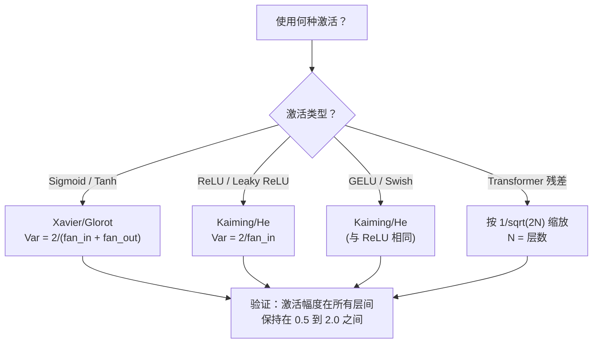

# 权重初始化与训练稳定性

> 初始化错了训练永远不会开始。初始化对了，50 层训练得像 3 层一样顺利。

**Type:** 构建  
**Languages:** Python  
**Prerequisites:** Lesson 03.04（激活函数），Lesson 03.07（正则化）  
**Time:** ~90 分钟

## 学习目标

- 实现 zero、random、Xavier/Glorot 和 Kaiming/He 初始化策略，并衡量它们在 50 层网络中对激活幅度的影响  
- 推导为什么 Xavier 初始化使用 Var(w) = 2/(fan_in + fan_out)，而 Kaiming 使用 Var(w) = 2/fan_in  
- 演示零初始化的对称性问题并解释为何仅随机尺度不足以解决问题  
- 将正确的初始化策略与激活函数匹配：Xavier 用于 sigmoid/tanh，Kaiming 用于 ReLU/GELU

## 问题描述

将所有权重初始化为零。没有任何东西能学到。每个神经元计算相同的函数，接收相同的梯度，并以相同的方式更新。经过 10,000 个 epoch，你的 512 神经元隐藏层仍然是 512 个相同神经元的复制品。你付了 512 个参数的钱却只得到 1 个有效神经元。

把它们初始化得太大。激活在网络中爆炸。到了第 10 层，值达到 1e15。到了第 20 层，溢出为无穷大。梯度在反向传播中沿相反方向同样爆炸。

从标准正态分布随机初始化。对 3 层有效。在 50 层时，信号会根据随机尺度稍微偏小或偏大而塌缩为零或炸成无穷。能“行得通”和“损坏”之间的边界极其脆弱。

权重初始化是深度学习中最被低估的决策。架构能出论文，优化器能出博客，初始化常被当作脚注。但如果做错了，其他一切都无济于事——你的网络在训练开始前就已经死亡。

## 概念

### 对称性问题

一层中的每个神经元结构相同：输入乘以权重，加入偏置，应用激活函数。如果所有权重从相同值开始（零是极端情况），每个神经元计算相同的输出。在反向传播时，每个神经元接收相同的梯度。在更新步骤中，每个神经元以相同的量改变。

你被卡住了。网络有数百个参数，但它们都同步移动。这称为对称性（symmetry），而随机初始化是打破对称性的暴力方法。每个神经元在权重空间中从不同点开始，因此每个神经元学习不同的特征。

但“随机”本身并不够。随机尺度决定了网络能否训练。

### 方差在层间的传播

考虑一个具有 fan_in 个输入的单层：

```
z = w1*x1 + w2*x2 + ... + w_n*x_n
```

如果每个权重 wi 来自方差为 Var(w) 的分布，每个输入 xi 的方差为 Var(x)，则输出方差为：

```
Var(z) = fan_in * Var(w) * Var(x)
```

如果 Var(w) = 1 且 fan_in = 512，输出方差是输入方差的 512 倍。经过 10 层后：512^10 = 1.2e27。信号已经爆炸。

如果 Var(w) = 0.001，输出方差每层按 0.001 * 512 = 0.512 缩小。经过 10 层后：0.512^10 = 0.00013。信号已经消失。

目标：选择 Var(w) 使得 Var(z) = Var(x)。信号幅度在层间保持恒定。

### Xavier/Glorot 初始化

Glorot 和 Bengio（2010）为 sigmoid 和 tanh 激活推导了保持方差不变的解。为了在前向和反向传播中都保持方差恒定：

```
Var(w) = 2 / (fan_in + fan_out)
```

在实际中，权重通常取自：

```
w ~ Uniform(-limit, limit)  where limit = sqrt(6 / (fan_in + fan_out))
```

或：

```
w ~ Normal(0, sqrt(2 / (fan_in + fan_out)))
```

之所以有效，是因为 sigmoid 和 tanh 在零附近大致线性，而恰当初始化后的激活值正落在这一线性区间。方差可以在几十层中保持稳定。

### Kaiming/He 初始化

ReLU 会使一半的输出为零（所有负值变为零）。有效的 fan_in 被减半，因为平均上有一半输入被置零。Xavier 初始化没有考虑到这点——它低估了所需的方差。

He 等人（2015）调整了公式：

```
Var(w) = 2 / fan_in
```

权重取自：

```
w ~ Normal(0, sqrt(2 / fan_in))
```

因子 2 补偿了 ReLU 将一半激活置零的影响。没有它，信号每层会约缩小 0.5 倍。50 层后：0.5^50 = 8.8e-16。Kaiming 初始化可以防止这种情况。

### Transformer 初始化

GPT-2 引入了不同的模式。残差连接将每个子层的输出与其输入相加：

```
x = x + sublayer(x)
```

每次相加都会增加方差。对于 N 个残差层，方差与 N 成正比增长。GPT-2 将残差层的权重按 1/sqrt(2N) 缩放，其中 N 是层数。这保持了累计信号幅度的稳定。

Llama 3（405B 参数，126 层）采用类似方案。没有这种缩放，残差流会在 126 层的注意力和前馈块中无限增长。

```mermaid
flowchart TD
    subgraph "零初始化"
        Z1["第 1 层<br/>所有权重 = 0"] --> Z2["第 2 层<br/>所有神经元相同"]
        Z2 --> Z3["第 3 层<br/>仍然相同"]
        Z3 --> ZR["结果：1 个有效神经元<br/>无视网络宽度"]
    end

    subgraph "Xavier 初始化"
        X1["第 1 层<br/>Var = 2/(fan_in+fan_out)"] --> X2["第 2 层<br/>信号稳定"]
        X2 --> X3["第 50 层<br/>信号稳定"]
        X3 --> XR["结果：在<br/>sigmoid/tanh 下可训练"]
    end

    subgraph "Kaiming 初始化"
        K1["第 1 层<br/>Var = 2/fan_in"] --> K2["第 2 层<br/>信号稳定"]
        K2 --> K3["第 50 层<br/>信号稳定"]
        K3 --> KR["结果：在<br/>ReLU/GELU 下可训练"]
    end
```



### 50 层中的激活幅度



### 选择正确的初始化



```figure
weight-init-variance
```

## 构建实现

### 步骤 1：初始化策略

四种构造权重矩阵的方法。每个函数返回一个列表的列表（二维矩阵），具有 fan_in 列和 fan_out 行。

```python
import math
import random


def zero_init(fan_in, fan_out):
    return [[0.0 for _ in range(fan_in)] for _ in range(fan_out)]


def random_init(fan_in, fan_out, scale=1.0):
    return [[random.gauss(0, scale) for _ in range(fan_in)] for _ in range(fan_out)]


def xavier_init(fan_in, fan_out):
    std = math.sqrt(2.0 / (fan_in + fan_out))
    return [[random.gauss(0, std) for _ in range(fan_in)] for _ in range(fan_out)]


def kaiming_init(fan_in, fan_out):
    std = math.sqrt(2.0 / fan_in)
    return [[random.gauss(0, std) for _ in range(fan_in)] for _ in range(fan_out)]
```

### 步骤 2：激活函数

我们需要 sigmoid、tanh 和 ReLU 来测试每种初始化策略与其目标激活函数的配合效果。

```python
def sigmoid(x):
    x = max(-500, min(500, x))
    return 1.0 / (1.0 + math.exp(-x))


def tanh_act(x):
    return math.tanh(x)


def relu(x):
    return max(0.0, x)
```

### 步骤 3：通过 50 层的前向传播

将随机数据传过一个深度网络，并测量每层的平均激活幅度。

```python
def forward_deep(init_fn, activation_fn, n_layers=50, width=64, n_samples=100):
    random.seed(42)
    layer_magnitudes = []

    inputs = [[random.gauss(0, 1) for _ in range(width)] for _ in range(n_samples)]

    for layer_idx in range(n_layers):
        weights = init_fn(width, width)
        biases = [0.0] * width

        new_inputs = []
        for sample in inputs:
            output = []
            for neuron_idx in range(width):
                z = sum(weights[neuron_idx][j] * sample[j] for j in range(width)) + biases[neuron_idx]
                output.append(activation_fn(z))
            new_inputs.append(output)
        inputs = new_inputs

        magnitudes = []
        for sample in inputs:
            magnitudes.append(sum(abs(v) for v in sample) / width)
        mean_mag = sum(magnitudes) / len(magnitudes)
        layer_magnitudes.append(mean_mag)

    return layer_magnitudes
```

### 步骤 4：实验

运行所有组合：零初始化、随机 N(0,1)、随机 N(0,0.01)、Xavier + sigmoid、Xavier + tanh、Kaiming + ReLU。在关键层打印幅度。

```python
def run_experiment():
    configs = [
        ("Zero init + Sigmoid", lambda fi, fo: zero_init(fi, fo), sigmoid),
        ("Random N(0,1) + ReLU", lambda fi, fo: random_init(fi, fo, 1.0), relu),
        ("Random N(0,0.01) + ReLU", lambda fi, fo: random_init(fi, fo, 0.01), relu),
        ("Xavier + Sigmoid", xavier_init, sigmoid),
        ("Xavier + Tanh", xavier_init, tanh_act),
        ("Kaiming + ReLU", kaiming_init, relu),
    ]

    print(f"{'Strategy':<30} {'L1':>10} {'L5':>10} {'L10':>10} {'L25':>10} {'L50':>10}")
    print("-" * 80)

    for name, init_fn, act_fn in configs:
        mags = forward_deep(init_fn, act_fn)
        row = f"{name:<30}"
        for idx in [0, 4, 9, 24, 49]:
            val = mags[idx]
            if val > 1e6:
                row += f" {'EXPLODED':>10}"
            elif val < 1e-6:
                row += f" {'VANISHED':>10}"
            else:
                row += f" {val:>10.4f}"
        print(row)
```

### 步骤 5：对称性演示

证明零初始化会产生相同的神经元。

```python
def symmetry_demo():
    random.seed(42)
    weights = zero_init(2, 4)
    biases = [0.0] * 4

    inputs = [0.5, -0.3]
    outputs = []
    for neuron_idx in range(4):
        z = sum(weights[neuron_idx][j] * inputs[j] for j in range(2)) + biases[neuron_idx]
        outputs.append(sigmoid(z))

    print("\nSymmetry Demo (4 neurons, zero init):")
    for i, out in enumerate(outputs):
        print(f"  Neuron {i}: output = {out:.6f}")
    all_same = all(abs(outputs[i] - outputs[0]) < 1e-10 for i in range(len(outputs)))
    print(f"  All identical: {all_same}")
    print(f"  Effective parameters: 1 (not {len(weights) * len(weights[0])})")
```

### 步骤 6：逐层幅度报告

打印 50 层中激活幅度的可视化条形图。

```python
def magnitude_report(name, magnitudes):
    print(f"\n{name}:")
    for i, mag in enumerate(magnitudes):
        if i % 5 == 0 or i == len(magnitudes) - 1:
            if mag > 1e6:
                bar = "X" * 50 + " EXPLODED"
            elif mag < 1e-6:
                bar = "." + " VANISHED"
            else:
                bar_len = min(50, max(1, int(mag * 10)))
                bar = "#" * bar_len
            print(f"  Layer {i+1:3d}: {bar} ({mag:.6f})")
```

## 实用方法

PyTorch 提供了这些作为内置函数：

```python
import torch
import torch.nn as nn

layer = nn.Linear(512, 256)

nn.init.xavier_uniform_(layer.weight)
nn.init.xavier_normal_(layer.weight)

nn.init.kaiming_uniform_(layer.weight, nonlinearity='relu')
nn.init.kaiming_normal_(layer.weight, nonlinearity='relu')

nn.init.zeros_(layer.bias)
```

当你调用 `nn.Linear(512, 256)` 时，PyTorch 默认使用 Kaiming uniform 初始化。这就是大多数简单网络“开箱即用”的原因——PyTorch 已经做出了合适的选择。但当你构建自定义架构或深度超过 20 层时，你需要理解发生了什么，并可能覆盖默认行为。

对于 transformers，HuggingFace 的模型通常在它们的 `_init_weights` 方法中处理初始化。GPT-2 的实现会将残差投影缩放为 1/sqrt(N)。如果你从头构建 transformer，就需要自己添加这一项。

## 交付成果

本课产出：
- `outputs/prompt-init-strategy.md` -- 一个诊断权重初始化问题并推荐正确策略的 prompt

## 练习

1. 添加 LeCun 初始化（Var = 1/fan_in，针对 SELU 设计）。使用 LeCun init + tanh 运行 50 层实验，并与 Xavier + tanh 做比较。

2. 实现 GPT-2 的残差缩放：在加入残差流之前，将每层的输出乘以 1/sqrt(2*N)。对比有无缩放时 50 层残差幅度增长的速度。

3. 创建一个“初始化健康检查”函数，接受网络的层维度和激活类型，然后推荐正确的初始化并在当前初始化会导致问题时发出警告。

4. 对比 fan_in = 16 与 fan_in = 1024 的实验。Xavier 和 Kaiming 会根据 fan_in 自适应，但随机初始化不会。展示随着层宽增大，“可行”和“破坏”之间的差距如何扩大。

5. 实现正交初始化（生成随机矩阵，计算其 SVD，使用正交矩阵 U）。将其与 Kaiming 在 ReLU 网络的 50 层表现进行比较。

## 关键词

| Term | What people say | What it actually means |
|------|----------------|----------------------|
| Weight initialization | "Set starting weights randomly" | 初始化权重的策略，决定网络能否被训练 |
| Symmetry breaking | "Make neurons different" | 使用随机初始化保证神经元学习不同特征，而不是计算相同函数 |
| Fan-in | "Number of inputs to a neuron" | 神经元的输入连接数，决定输入方差在加权和中如何累积 |
| Fan-out | "Number of outputs from a neuron" | 神经元的输出连接数，与在反向传播中保持梯度方差有关 |
| Xavier/Glorot init | "The sigmoid initialization" | Var(w) = 2/(fan_in + fan_out)，为在 sigmoid 和 tanh 激活下保持方差设计 |
| Kaiming/He init | "The ReLU initialization" | Var(w) = 2/fan_in，考虑到 ReLU 将一半激活置零 |
| Variance propagation | "How signals grow or shrink through layers" | 方差传播的数学分析，描述激活方差基于权重尺度在层间如何变化 |
| Residual scaling | "GPT-2's init trick" | 将残差连接缩放为 1/sqrt(2N) 以防止 N 个 transformer 层中方差增长 |
| Dead network | "Nothing trains" | 由于初始化不当导致所有梯度为零或所有激活饱和，网络无法训练 |
| Exploding activations | "Values go to infinity" | 当权重方差过高时，激活幅度在层间呈指数增长 |

## 延伸阅读

- Glorot & Bengio, "Understanding the difficulty of training deep feedforward neural networks" (2010) -- 原始 Xavier 初始化论文，包含方差分析  
- He et al., "Delving Deep into Rectifiers" (2015) -- 为 ReLU 网络引入 Kaiming 初始化的论文  
- Radford et al., "Language Models are Unsupervised Multitask Learners" (2019) -- GPT-2 论文，包含残差缩放初始化的讨论  
- Mishkin & Matas, "All You Need is a Good Init" (2016) -- 层顺序单位方差初始化（LSUV），一种对解析公式的经验替代方法