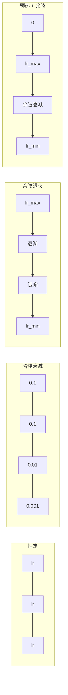
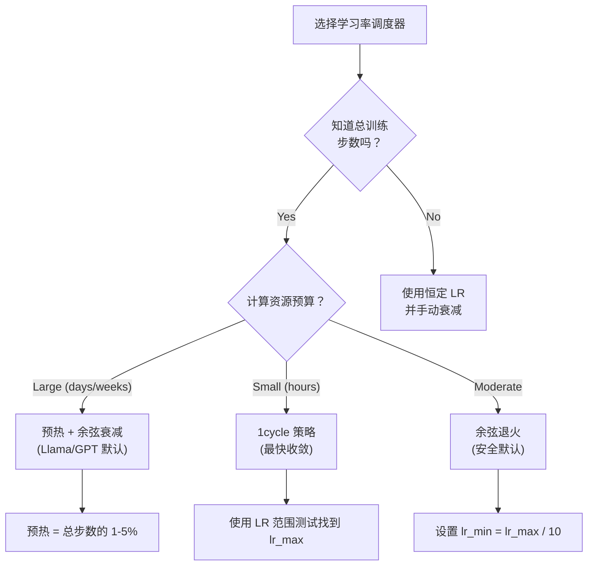
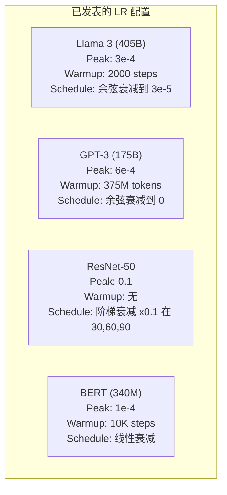

# Learning Rate Schedules and Warmup

> The learning rate is the single most important hyperparameter. Not the architecture. Not the dataset size. Not the activation function. The learning rate. If you tune nothing else, tune this.

**Type:** 构建  
**Languages:** Python  
**Prerequisites:** Lesson 03.06 (优化器), Lesson 03.08 (权重初始化)  
**Time:** ~90 分钟

## Learning Objectives

- 从头实现 constant、step decay、cosine annealing、warmup + cosine 和 1cycle 学习率调度器
- 演示学习率选择的三种失败模式：发散（过大）、停滞（过小）和振荡（无衰减）
- 解释为什么对基于 Adam 的优化器需要预热（warmup），以及它如何稳定训练初期
- 在相同任务上比较五种调度器的收敛速度，并为给定训练预算选择合适的调度器

## The Problem

将学习率设为 0.1。训练发散 —— 在 3 步内损失变为无穷。将其设为 0.0001。训练极其缓慢 —— 100 个 epoch 后模型几乎还是随机初始化。将其设为 0.01。训练在前 50 个 epoch 正常，然后损失在一个它永远到达不了的最小值附近振荡，因为步长太大。

最佳学习率不是一个常数。它会随着训练而变化。训练初期，你希望步长大以便快速覆盖参数空间；训练后期，你需要很小的步长来收敛到精确的最小值。90% 与 95% 准确率之间的差异，往往只是调度策略的不同。

过去三年发布的每个大型模型都使用了学习率调度。Llama 3 使用 peak lr=3e-4，2000 步预热，并余弦衰减到 3e-5。GPT-3 使用 lr=6e-4，预热跨越 3.75 亿 token。这些不是随意选择，而是耗费数百万美元的超参搜索结果。

你需要理解调度器，因为默认值往往不适合你的问题。微调预训练模型时，合适的调度与从头训练不同。增加 batch size 时，预热长度需要调整。训练在第 10000 步崩溃时，你需要判断是不是调度问题或其他原因。

## The Concept

### Constant Learning Rate

最简单的方法。选一个数，在每一步都用它。

```
lr(t) = lr_0
```

很少是最优的。要么在训练结束时太大（在极小值附近振荡），要么在开始时太小（把算力浪费在很小的步长上）。适合小模型和调试。对于超过一小时的训练，这是糟糕的选择。

### Step Decay

ResNet 时代的老方法。在固定的 epoch 处将学习率按某个因子（通常 10 倍）减少。

```
lr(t) = lr_0 * gamma^(floor(epoch / step_size))
```

例如 gamma = 0.1，step_size = 30 表示：每 30 个 epoch 学习率降低 10 倍。ResNet-50 使用了这种方式 —— lr=0.1，在第 30、60、90 个 epoch 降 10 倍。

问题是：最优的衰减点依赖于数据集和架构。换到不同的问题，你需要重新调参来确定何时降低。过渡是突兀的 —— 学习率突变时损失可能会跳升。

### Cosine Annealing

从最大学习率平滑地衰减到最小值，遵循余弦曲线：

```
lr(t) = lr_min + 0.5 * (lr_max - lr_min) * (1 + cos(pi * t / T))
```

其中 t 是当前步数，T 是总步数。

在 t=0 时，余弦项为 1，因此 lr = lr_max。在 t=T 时，余弦项为 -1，因此 lr = lr_min。衰减在开始时温和，中间加速，而在末端又变得温和。

这是大多数现代训练的默认。除了 lr_max 和 lr_min 外没有其他超参要调。余弦形状符合经验观察：大部分学习发生在训练中段 —— 在那段临界时期你需要合适的步长。

### Warmup: Why You Start Small

Adam 和其他自适应优化器维护梯度的一阶和二阶矩估计。在第 0 步，这些估计初始化为零。最初几次梯度更新基于垃圾统计量。如果此时学习率很大，模型会走出很大的、方向错误的步子。

预热（warmup）解决了这个问题。先用极小的学习率（通常为 lr_max / warmup_steps 或甚至 0）开始，并在前 N 步线性增长到 lr_max。当你达到全学习率时，Adam 的统计量已稳定。

```
lr(t) = lr_max * (t / warmup_steps)     for t < warmup_steps
```

典型的预热：占总训练步数的 1–5%。Llama 3 训练约 1.8 万亿 tokens，预热了 2000 步。GPT-3 在 3.75 亿 tokens 上完成了预热。

### Linear Warmup + Cosine Decay

现代默认做法。先线性上升，然后用余弦衰减：

```
if t < warmup_steps:
    lr(t) = lr_max * (t / warmup_steps)
else:
    progress = (t - warmup_steps) / (total_steps - warmup_steps)
    lr(t) = lr_min + 0.5 * (lr_max - lr_min) * (1 + cos(pi * progress))
```

这是 Llama、GPT、PaLM 和大多数现代 Transformer 使用的策略。预热避免了训练早期的不稳定，余弦衰减让模型收敛到一个好的最小值。

### 1cycle Policy

Leslie Smith 的发现（2018）：在训练前半段将学习率从低值提升到高值，然后在后半段再降回来。反直觉 —— 为什么在中期要增加学习率？

理论上：高学习率通过在优化轨迹中加入噪声起到正则化作用。模型在上升阶段能更多地探索损失地形，找到更好的盆地。下降阶段再在最优盆地内细化。

```
Phase 1 (0 to T/2):    lr ramps from lr_max/25 to lr_max
Phase 2 (T/2 to T):    lr ramps from lr_max to lr_max/10000
```

在固定算力预算下，1cycle 通常比余弦退火训练更快。折衷是：你必须提前知道总步数。

### Schedule Shapes



### Decision Flowchart



### Real Numbers from Published Models



```figure
lr-schedule
```

## Build It

### Step 1: Schedule Functions

Each function takes the current step and returns the learning rate at that step.

```python
import math


def constant_schedule(step, lr=0.01, **kwargs):
    return lr


def step_decay_schedule(step, lr=0.1, step_size=100, gamma=0.1, **kwargs):
    return lr * (gamma ** (step // step_size))


def cosine_schedule(step, lr=0.01, total_steps=1000, lr_min=1e-5, **kwargs):
    if step >= total_steps:
        return lr_min
    return lr_min + 0.5 * (lr - lr_min) * (1 + math.cos(math.pi * step / total_steps))


def warmup_cosine_schedule(step, lr=0.01, total_steps=1000, warmup_steps=100, lr_min=1e-5, **kwargs):
    if total_steps <= warmup_steps:
        return lr * (step / max(warmup_steps, 1))
    if step < warmup_steps:
        return lr * step / warmup_steps
    progress = (step - warmup_steps) / (total_steps - warmup_steps)
    return lr_min + 0.5 * (lr - lr_min) * (1 + math.cos(math.pi * progress))


def one_cycle_schedule(step, lr=0.01, total_steps=1000, **kwargs):
    mid = max(total_steps // 2, 1)
    if step < mid:
        return (lr / 25) + (lr - lr / 25) * step / mid
    else:
        progress = (step - mid) / max(total_steps - mid, 1)
        return lr * (1 - progress) + (lr / 10000) * progress
```

### Step 2: Visualize All Schedules

Print a text-based plot showing how each schedule evolves over training.

```python
def visualize_schedule(name, schedule_fn, total_steps=500, **kwargs):
    steps = list(range(0, total_steps, total_steps // 20))
    if total_steps - 1 not in steps:
        steps.append(total_steps - 1)

    lrs = [schedule_fn(s, total_steps=total_steps, **kwargs) for s in steps]
    max_lr = max(lrs) if max(lrs) > 0 else 1.0

    print(f"\n{name}:")
    for s, lr_val in zip(steps, lrs):
        bar_len = int(lr_val / max_lr * 40)
        bar = "#" * bar_len
        print(f"  Step {s:4d}: lr={lr_val:.6f} {bar}")
```

### Step 3: Training Network

A simple two-layer network on the circle dataset, same as previous lessons, but now we vary the schedule.

```python
import random


def sigmoid(x):
    x = max(-500, min(500, x))
    return 1.0 / (1.0 + math.exp(-x))


def relu(x):
    return max(0.0, x)


def relu_deriv(x):
    return 1.0 if x > 0 else 0.0


def make_circle_data(n=200, seed=42):
    random.seed(seed)
    data = []
    for _ in range(n):
        x = random.uniform(-2, 2)
        y = random.uniform(-2, 2)
        label = 1.0 if x * x + y * y < 1.5 else 0.0
        data.append(([x, y], label))
    return data


def train_with_schedule(schedule_fn, schedule_name, data, epochs=300, base_lr=0.05, **kwargs):
    random.seed(0)
    hidden_size = 8
    total_steps = epochs * len(data)

    std = math.sqrt(2.0 / 2)
    w1 = [[random.gauss(0, std) for _ in range(2)] for _ in range(hidden_size)]
    b1 = [0.0] * hidden_size
    w2 = [random.gauss(0, std) for _ in range(hidden_size)]
    b2 = 0.0

    step = 0
    epoch_losses = []

    for epoch in range(epochs):
        total_loss = 0
        correct = 0

        for x, target in data:
            lr = schedule_fn(step, lr=base_lr, total_steps=total_steps, **kwargs)

            z1 = []
            h = []
            for i in range(hidden_size):
                z = w1[i][0] * x[0] + w1[i][1] * x[1] + b1[i]
                z1.append(z)
                h.append(relu(z))

            z2 = sum(w2[i] * h[i] for i in range(hidden_size)) + b2
            out = sigmoid(z2)

            error = out - target
            d_out = error * out * (1 - out)

            for i in range(hidden_size):
                d_h = d_out * w2[i] * relu_deriv(z1[i])
                w2[i] -= lr * d_out * h[i]
                for j in range(2):
                    w1[i][j] -= lr * d_h * x[j]
                b1[i] -= lr * d_h
            b2 -= lr * d_out

            total_loss += (out - target) ** 2
            if (out >= 0.5) == (target >= 0.5):
                correct += 1
            step += 1

        avg_loss = total_loss / len(data)
        accuracy = correct / len(data) * 100
        epoch_losses.append(avg_loss)

    return epoch_losses
```

### Step 4: Compare All Schedules

Train the same network with each schedule and compare final loss and convergence behavior.

```python
def compare_schedules(data):
    configs = [
        ("Constant", constant_schedule, {}),
        ("Step Decay", step_decay_schedule, {"step_size": 15000, "gamma": 0.1}),
        ("Cosine", cosine_schedule, {"lr_min": 1e-5}),
        ("Warmup+Cosine", warmup_cosine_schedule, {"warmup_steps": 3000, "lr_min": 1e-5}),
        ("1cycle", one_cycle_schedule, {}),
    ]

    print(f"\n{'Schedule':<20} {'Start Loss':>12} {'Mid Loss':>12} {'End Loss':>12} {'Best Loss':>12}")
    print("-" * 70)

    for name, schedule_fn, extra_kwargs in configs:
        losses = train_with_schedule(schedule_fn, name, data, epochs=300, base_lr=0.05, **extra_kwargs)
        mid_idx = len(losses) // 2
        best = min(losses)
        print(f"{name:<20} {losses[0]:>12.6f} {losses[mid_idx]:>12.6f} {losses[-1]:>12.6f} {best:>12.6f}")
```

### Step 5: LR Too High vs Too Low

Demonstrate the three failure modes: too high (divergence), too low (crawling), and just right.

```python
def lr_sensitivity(data):
    learning_rates = [1.0, 0.1, 0.01, 0.001, 0.0001]

    print("\nLR Sensitivity (constant schedule, 100 epochs):")
    print(f"  {'LR':>10} {'Start Loss':>12} {'End Loss':>12} {'Status':>15}")
    print("  " + "-" * 52)

    for lr in learning_rates:
        losses = train_with_schedule(constant_schedule, f"lr={lr}", data, epochs=100, base_lr=lr)
        start = losses[0]
        end = losses[-1]

        if end > start or math.isnan(end) or end > 1.0:
            status = "DIVERGED"
        elif end > start * 0.9:
            status = "BARELY MOVED"
        elif end < 0.15:
            status = "CONVERGED"
        else:
            status = "LEARNING"

        end_str = f"{end:.6f}" if not math.isnan(end) else "NaN"
        print(f"  {lr:>10.4f} {start:>12.6f} {end_str:>12} {status:>15}")
```

## Use It

PyTorch 在 `torch.optim.lr_scheduler` 中提供了调度器：

```python
import torch
import torch.optim as optim
from torch.optim.lr_scheduler import CosineAnnealingLR, OneCycleLR, StepLR

model = nn.Sequential(nn.Linear(10, 64), nn.ReLU(), nn.Linear(64, 1))
optimizer = optim.Adam(model.parameters(), lr=3e-4)

scheduler = CosineAnnealingLR(optimizer, T_max=1000, eta_min=1e-5)

for step in range(1000):
    loss = train_step(model, optimizer)
    scheduler.step()
```

对于预热 + 余弦，可以使用 lambda scheduler 或 HuggingFace 的 `get_cosine_schedule_with_warmup`：

```python
from transformers import get_cosine_schedule_with_warmup

scheduler = get_cosine_schedule_with_warmup(
    optimizer,
    num_warmup_steps=2000,
    num_training_steps=100000,
)
```

HuggingFace 的函数是大多数 Llama 和 GPT 微调脚本使用的。当不确定时，使用预热 + 余弦，预热占总步数的 3–5%。它几乎适用于所有情况。

## Ship It

This lesson produces:
- `outputs/prompt-lr-schedule-advisor.md` -- 一个建议适合你训练设置的学习率调度和超参数的提示词

## Exercises

1. 实现指数衰减：lr(t) = lr_0 * gamma^t，gamma = 0.999。与余弦退火在 circle 数据集上比较。

2. 实现学习率范围测试（Leslie Smith）：在几百步内以指数方式将 LR 从 1e-7 增加到较大值。绘制 loss vs LR。最佳最大 LR 通常是 loss 开始上升之前的那个点。

3. 使用预热 + 余弦，但改变预热长度：0%、1%、5%、10%、20% 的总步数。找到训练最稳定的最佳预热比例。

4. 实现带有热重启的余弦退火（SGDR）：每隔 T 步将学习率重置为 lr_max 并再次衰减。在更长的训练上与标准余弦进行比较。

5. 构建一个“调度外科医生（schedule surgeon）”，它监控训练损失并在损失稳定时自动从预热切换到余弦，并在损失长时间停滞时降低 lr。

## Key Terms

| Term | What people say | What it actually means |
|------|----------------|----------------------|
| Learning rate | "How fast the model learns" | 乘以梯度以确定参数更新大小的标量 |
| Schedule | "Change the LR over time" | 将训练步映射到学习率的函数，用以优化收敛 |
| Warmup | "Start with a small LR" | 在前 N 步中将 LR 从接近零线性升至目标值，以稳定优化器统计量 |
| Cosine annealing | "Smooth LR decay" | 按余弦曲线从 lr_max 平滑地衰减到 lr_min |
| Step decay | "Drop LR at milestones" | 在固定 epoch 间隔处将 LR 乘以某个因子（通常 0.1） |
| 1cycle policy | "Up then down" | Leslie Smith 的方法：在一个周期内先升后降 LR，以加速收敛 |
| LR range test | "Find the best learning rate" | 在短时间内增加 LR 来找到 loss 开始发散的临界值 |
| Cosine with warm restarts | "Reset and repeat" | 定期将 LR 重置为 lr_max 并再次衰减（SGDR） |
| Eta min | "The floor for the LR" | 调度到的最小学习率 |
| Peak learning rate | "The maximum LR" | 训练期间达到的最高学习率，通常在预热后 |

## Further Reading

- Loshchilov & Hutter, "SGDR: Stochastic Gradient Descent with Warm Restarts" (2017) -- 引入了余弦退火和热重启  
- Smith, "Super-Convergence: Very Fast Training of Neural Networks Using Large Learning Rates" (2018) -- 1cycle 策略论文  
- Touvron et al., "Llama 2: Open Foundation and Fine-Tuned Chat Models" (2023) -- 记录了在大规模训练中使用的预热 + 余弦调度  
- Goyal et al., "Accurate, Large Minibatch SGD: Training ImageNet in 1 Hour" (2017) -- 大 batch 训练的线性缩放规则和预热方法