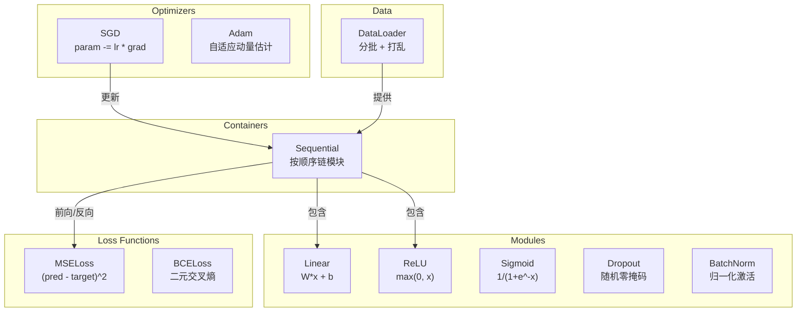
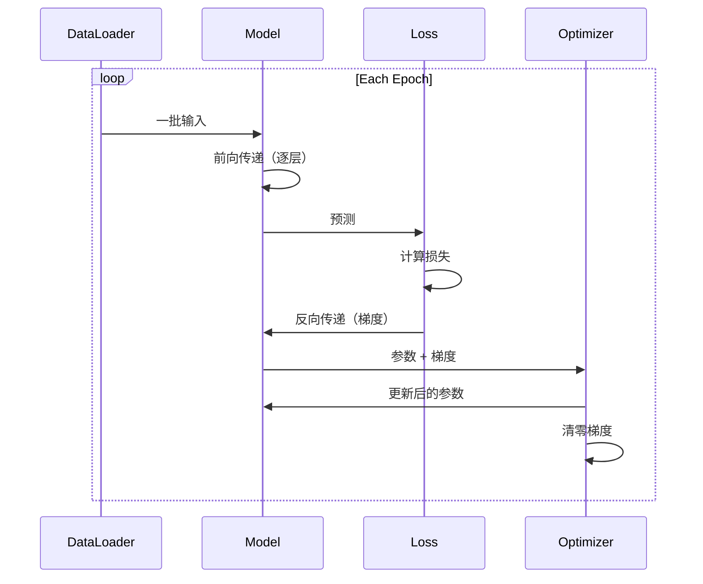
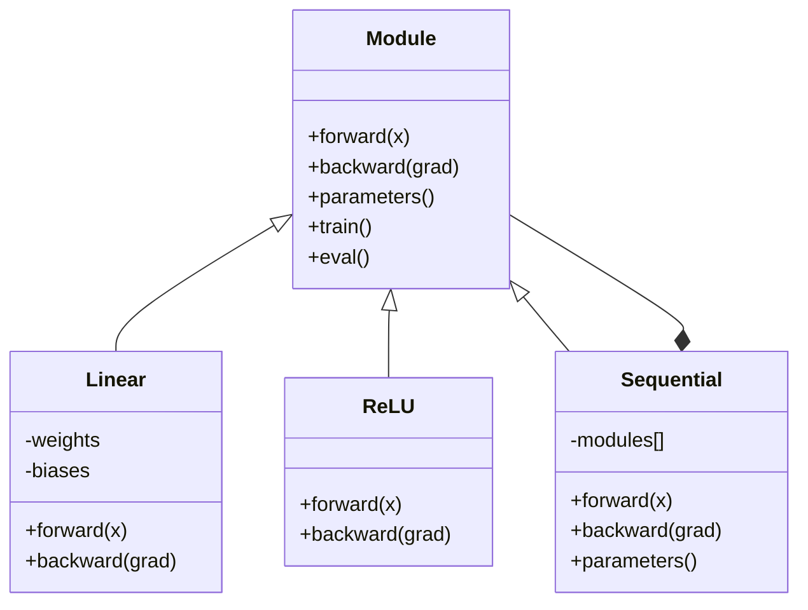

# Build Your Own Mini Framework

> You have built neurons, layers, networks, backprop, activations, loss functions, optimizers, regularization, initialization, and LR schedules. All as separate pieces. Now wire them together into a framework. Not PyTorch. Not TensorFlow. Yours.

**Type:** 构建  
**Languages:** Python  
**Prerequisites:** 第 03 阶段全部（课程 01-09）  
**Time:** ~120 分钟

## Learning Objectives

- 构建一个完整的深度学习框架（约 500 行），包含 Module、Linear、ReLU、Sigmoid、Dropout、BatchNorm、Sequential、损失函数、优化器以及 DataLoader
- 解释 Module 抽象（forward、backward、parameters）以及为什么需要切换 train/eval 模式
- 将所有组件连接成一个可工作的训练循环，用于训练一个 4 层网络进行圆形分类
- 将你框架中的每个组件映射到其 PyTorch 等价物（nn.Module、nn.Sequential、optim.Adam、DataLoader）

## The Problem

你有十节课的构建模块散落在不同的文件里。这里有一个 `Value` 类，那儿有一个训练循环，另一个文件里有权重初始化，还有学习率调度。要训练一个网络，你需要从五个不同的课中复制粘贴并手工把它们连接起来。

这正是框架要解决的问题。PyTorch 给出 `nn.Module`、`nn.Sequential`、`optim.Adam`、`DataLoader`，以及把它们连接起来的训练循环模式。TensorFlow 给出 `keras.Layer`、`keras.Sequential`、`keras.optimizers.Adam`。这都不是魔法。它们是组织模式，使得定义、训练和评估网络时不需要每次都重写底层管线。

你将用约 500 行 Python 实现同样的东西。不能用 numpy。不能用外部依赖。实现一个可以定义任意前馈网络、用 SGD 或 Adam 训练、对数据分批、应用 dropout 和 batch normalization、支持任意激活并调度学习率的框架。

完成后，你将完全理解在 PyTorch 中写 `model = nn.Sequential(...)` 时到底发生了什么。你会明白为什么存在 `model.train()` 和 `model.eval()`。你会明白为什么 `optimizer.zero_grad()` 是一个独立调用。因为你自己构建了这一切。

## The Concept

### The Module Abstraction

在 PyTorch 中每个层都继承自 `nn.Module`。一个 Module 有三项职责：

1. forward() — 给定输入计算输出  
2. parameters() — 返回所有可训练权重  
3. backward() — 计算梯度（在 PyTorch 中由 autograd 处理，在我们的实现中需要显式实现）

Linear 层是一个 Module。ReLU 激活是一个 Module。Dropout 层是一个 Module。Batch normalization 是一个 Module。它们都有相同的接口。

### Sequential Container

`nn.Sequential` 将 Module 串联起来。前向传递：数据先通过模块 1，然后模块 2，然后模块 3。反向传递：按相反顺序传播。容器本身也是一个 Module —— 它有 forward()、parameters() 和 backward()。这是组合模式：一系列 Module 本身是一个 Module。

### Training vs Evaluation Mode

Dropout 在训练阶段随机将神经元置零，而在评估阶段全部通过。Batch normalization 在训练阶段使用批统计量，在评估阶段使用滑动平均统计量。`train()` 和 `eval()` 方法切换这种行为。每个 Module 都有一个 `training` 标志。

### Optimizer

优化器使用参数的梯度更新参数。SGD：`param -= lr * grad`。Adam：维护动量与方差估计，然后更新。优化器并不知道网络架构 —— 它只看到一个扁平的参数列表及其梯度。

### DataLoader

分批有两个原因。首先，对于大的问题你无法一次把整个数据集放入内存。其次，小批量随机梯度下降提供噪声，帮助跳出局部最优。DataLoader 把数据拆成批次，并可在每个 epoch 之间打乱。

### Framework Architecture



### Training Loop



### Module Hierarchy



```figure
gradient-clipping
```

## Build It

### Step 1: Module Base Class

每个层实现的抽象接口。

```python
class Module:
    def __init__(self):
        self.training = True

    def forward(self, x):
        raise NotImplementedError

    def backward(self, grad):
        raise NotImplementedError

    def parameters(self):
        return []

    def train(self):
        self.training = True

    def eval(self):
        self.training = False
```

### Step 2: Linear Layer

基础构件。存储权重和偏置，前向计算 Wx + b，反向计算权重/输入的梯度。

```python
import math
import random


class Linear(Module):
    def __init__(self, fan_in, fan_out):
        super().__init__()
        std = math.sqrt(2.0 / fan_in)
        self.weights = [[random.gauss(0, std) for _ in range(fan_in)] for _ in range(fan_out)]
        self.biases = [0.0] * fan_out
        self.weight_grads = [[0.0] * fan_in for _ in range(fan_out)]
        self.bias_grads = [0.0] * fan_out
        self.fan_in = fan_in
        self.fan_out = fan_out
        self.input = None

    def forward(self, x):
        self.input = x
        output = []
        for i in range(self.fan_out):
            val = self.biases[i]
            for j in range(self.fan_in):
                val += self.weights[i][j] * x[j]
            output.append(val)
        return output

    def backward(self, grad):
        input_grad = [0.0] * self.fan_in
        for i in range(self.fan_out):
            self.bias_grads[i] += grad[i]
            for j in range(self.fan_in):
                self.weight_grads[i][j] += grad[i] * self.input[j]
                input_grad[j] += grad[i] * self.weights[i][j]
        return input_grad

    def parameters(self):
        params = []
        for i in range(self.fan_out):
            for j in range(self.fan_in):
                params.append((self.weights, i, j, self.weight_grads))
            params.append((self.biases, i, None, self.bias_grads))
        return params
```

### Step 3: Activation Modules

ReLU、Sigmoid、Tanh 作为 Module。每个模块缓存反向传播所需的中间值。

```python
class ReLU(Module):
    def __init__(self):
        super().__init__()
        self.mask = None

    def forward(self, x):
        self.mask = [1.0 if v > 0 else 0.0 for v in x]
        return [max(0.0, v) for v in x]

    def backward(self, grad):
        return [g * m for g, m in zip(grad, self.mask)]


class Sigmoid(Module):
    def __init__(self):
        super().__init__()
        self.output = None

    def forward(self, x):
        self.output = []
        for v in x:
            v = max(-500, min(500, v))
            self.output.append(1.0 / (1.0 + math.exp(-v)))
        return self.output

    def backward(self, grad):
        return [g * o * (1 - o) for g, o in zip(grad, self.output)]


class Tanh(Module):
    def __init__(self):
        super().__init__()
        self.output = None

    def forward(self, x):
        self.output = [math.tanh(v) for v in x]
        return self.output

    def backward(self, grad):
        return [g * (1 - o * o) for g, o in zip(grad, self.output)]
```

### Step 4: Dropout Module

在训练阶段随机将元素置零。对保留下来的元素按 1/(1-p) 缩放，使期望保持不变。评估阶段不做任何操作。

```python
class Dropout(Module):
    def __init__(self, p=0.5):
        super().__init__()
        self.p = p
        self.mask = None

    def forward(self, x):
        if not self.training:
            return x
        self.mask = [0.0 if random.random() < self.p else 1.0 / (1 - self.p) for _ in x]
        return [v * m for v, m in zip(x, self.mask)]

    def backward(self, grad):
        if self.mask is None:
            return grad
        return [g * m for g, m in zip(grad, self.mask)]
```

### Step 5: BatchNorm Module

对每个特征在批维度上归一化为零均值和单位方差。为评估模式维护运行平均统计量。

```python
class BatchNorm(Module):
    def __init__(self, size, momentum=0.1, eps=1e-5):
        super().__init__()
        self.size = size
        self.gamma = [1.0] * size
        self.beta = [0.0] * size
        self.gamma_grads = [0.0] * size
        self.beta_grads = [0.0] * size
        self.running_mean = [0.0] * size
        self.running_var = [1.0] * size
        self.momentum = momentum
        self.eps = eps
        self.x_norm = None
        self.std_inv = None
        self.batch_input = None

    def forward_batch(self, batch):
        batch_size = len(batch)
        output_batch = []

        if self.training:
            mean = [0.0] * self.size
            for sample in batch:
                for j in range(self.size):
                    mean[j] += sample[j]
            mean = [m / batch_size for m in mean]

            var = [0.0] * self.size
            for sample in batch:
                for j in range(self.size):
                    var[j] += (sample[j] - mean[j]) ** 2
            var = [v / batch_size for v in var]

            self.std_inv = [1.0 / math.sqrt(v + self.eps) for v in var]

            self.x_norm = []
            self.batch_input = batch
            for sample in batch:
                normed = [(sample[j] - mean[j]) * self.std_inv[j] for j in range(self.size)]
                self.x_norm.append(normed)
                output = [self.gamma[j] * normed[j] + self.beta[j] for j in range(self.size)]
                output_batch.append(output)

            for j in range(self.size):
                self.running_mean[j] = (1 - self.momentum) * self.running_mean[j] + self.momentum * mean[j]
                self.running_var[j] = (1 - self.momentum) * self.running_var[j] + self.momentum * var[j]
        else:
            std_inv = [1.0 / math.sqrt(v + self.eps) for v in self.running_var]
            for sample in batch:
                normed = [(sample[j] - self.running_mean[j]) * std_inv[j] for j in range(self.size)]
                output = [self.gamma[j] * normed[j] + self.beta[j] for j in range(self.size)]
                output_batch.append(output)

        return output_batch

    def forward(self, x):
        result = self.forward_batch([x])
        return result[0]

    def backward(self, grad):
        if self.x_norm is None:
            return grad
        for j in range(self.size):
            self.gamma_grads[j] += self.x_norm[0][j] * grad[j]
            self.beta_grads[j] += grad[j]
        return [grad[j] * self.gamma[j] * self.std_inv[j] for j in range(self.size)]

    def parameters(self):
        params = []
        for j in range(self.size):
            params.append((self.gamma, j, None, self.gamma_grads))
            params.append((self.beta, j, None, self.beta_grads))
        return params
```

### Step 6: Sequential Container

串联模块。前向从左到右，反向从右到左。

```python
class Sequential(Module):
    def __init__(self, *modules):
        super().__init__()
        self.modules = list(modules)

    def forward(self, x):
        for module in self.modules:
            x = module.forward(x)
        return x

    def backward(self, grad):
        for module in reversed(self.modules):
            grad = module.backward(grad)
        return grad

    def parameters(self):
        params = []
        for module in self.modules:
            params.extend(module.parameters())
        return params

    def train(self):
        self.training = True
        for module in self.modules:
            module.train()

    def eval(self):
        self.training = False
        for module in self.modules:
            module.eval()
```

### Step 7: Loss Functions

MSE 和二元交叉熵。每个损失返回损失值，并提供一个 backward() 来返回梯度。

```python
class MSELoss:
    def __call__(self, predicted, target):
        self.predicted = predicted
        self.target = target
        n = len(predicted)
        self.loss = sum((p - t) ** 2 for p, t in zip(predicted, target)) / n
        return self.loss

    def backward(self):
        n = len(self.predicted)
        return [2 * (p - t) / n for p, t in zip(self.predicted, self.target)]


class BCELoss:
    def __call__(self, predicted, target):
        self.predicted = predicted
        self.target = target
        eps = 1e-7
        n = len(predicted)
        self.loss = 0
        for p, t in zip(predicted, target):
            p = max(eps, min(1 - eps, p))
            self.loss += -(t * math.log(p) + (1 - t) * math.log(1 - p))
        self.loss /= n
        return self.loss

    def backward(self):
        eps = 1e-7
        n = len(self.predicted)
        grads = []
        for p, t in zip(self.predicted, self.target):
            p = max(eps, min(1 - eps, p))
            grads.append((-t / p + (1 - t) / (1 - p)) / n)
        return grads
```

### Step 8: SGD and Adam Optimizers

两者都接受参数列表并使用梯度更新权重。

```python
class SGD:
    def __init__(self, parameters, lr=0.01):
        self.params = parameters
        self.lr = lr

    def step(self):
        for container, i, j, grad_container in self.params:
            if j is not None:
                container[i][j] -= self.lr * grad_container[i][j]
            else:
                container[i] -= self.lr * grad_container[i]

    def zero_grad(self):
        for container, i, j, grad_container in self.params:
            if j is not None:
                grad_container[i][j] = 0.0
            else:
                grad_container[i] = 0.0


class Adam:
    def __init__(self, parameters, lr=0.001, beta1=0.9, beta2=0.999, eps=1e-8):
        self.params = parameters
        self.lr = lr
        self.beta1 = beta1
        self.beta2 = beta2
        self.eps = eps
        self.t = 0
        self.m = [0.0] * len(parameters)
        self.v = [0.0] * len(parameters)

    def step(self):
        self.t += 1
        for idx, (container, i, j, grad_container) in enumerate(self.params):
            if j is not None:
                g = grad_container[i][j]
            else:
                g = grad_container[i]

            self.m[idx] = self.beta1 * self.m[idx] + (1 - self.beta1) * g
            self.v[idx] = self.beta2 * self.v[idx] + (1 - self.beta2) * g * g

            m_hat = self.m[idx] / (1 - self.beta1 ** self.t)
            v_hat = self.v[idx] / (1 - self.beta2 ** self.t)

            update = self.lr * m_hat / (math.sqrt(v_hat) + self.eps)

            if j is not None:
                container[i][j] -= update
            else:
                container[i] -= update

    def zero_grad(self):
        for container, i, j, grad_container in self.params:
            if j is not None:
                grad_container[i][j] = 0.0
            else:
                grad_container[i] = 0.0
```

### Step 9: DataLoader

将数据拆分成批次，可选在每个 epoch 打乱。

```python
class DataLoader:
    def __init__(self, data, batch_size=32, shuffle=True):
        self.data = data
        self.batch_size = batch_size
        self.shuffle = shuffle

    def __iter__(self):
        indices = list(range(len(self.data)))
        if self.shuffle:
            random.shuffle(indices)
        for start in range(0, len(indices), self.batch_size):
            batch_indices = indices[start:start + self.batch_size]
            batch = [self.data[i] for i in batch_indices]
            inputs = [item[0] for item in batch]
            targets = [item[1] for item in batch]
            yield inputs, targets

    def __len__(self):
        return (len(self.data) + self.batch_size - 1) // self.batch_size
```

### Step 10: Train a 4-Layer Network on Circle Classification

将所有部分连线在一起。定义模型，选择损失，选择优化器，运行训练循环。

```python
def make_circle_data(n=500, seed=42):
    random.seed(seed)
    data = []
    for _ in range(n):
        x = random.uniform(-2, 2)
        y = random.uniform(-2, 2)
        label = 1.0 if x * x + y * y < 1.5 else 0.0
        data.append(([x, y], [label]))
    return data


def train():
    random.seed(42)

    model = Sequential(
        Linear(2, 16),
        ReLU(),
        Linear(16, 16),
        ReLU(),
        Linear(16, 8),
        ReLU(),
        Linear(8, 1),
        Sigmoid(),
    )

    criterion = BCELoss()
    optimizer = Adam(model.parameters(), lr=0.01)

    data = make_circle_data(500)
    split = int(len(data) * 0.8)
    train_data = data[:split]
    test_data = data[split:]

    loader = DataLoader(train_data, batch_size=16, shuffle=True)

    model.train()

    for epoch in range(100):
        total_loss = 0
        total_correct = 0
        total_samples = 0

        for batch_inputs, batch_targets in loader:
            batch_loss = 0
            for x, t in zip(batch_inputs, batch_targets):
                pred = model.forward(x)
                loss = criterion(pred, t)
                batch_loss += loss

                optimizer.zero_grad()
                grad = criterion.backward()
                model.backward(grad)
                optimizer.step()

                predicted_class = 1.0 if pred[0] >= 0.5 else 0.0
                if predicted_class == t[0]:
                    total_correct += 1
                total_samples += 1

            total_loss += batch_loss

        avg_loss = total_loss / total_samples
        accuracy = total_correct / total_samples * 100

        if epoch % 10 == 0 or epoch == 99:
            print(f"Epoch {epoch:3d} | Loss: {avg_loss:.6f} | Train Accuracy: {accuracy:.1f}%")

    model.eval()
    correct = 0
    for x, t in test_data:
        pred = model.forward(x)
        predicted_class = 1.0 if pred[0] >= 0.5 else 0.0
        if predicted_class == t[0]:
            correct += 1
    test_accuracy = correct / len(test_data) * 100
    print(f"\nTest Accuracy: {test_accuracy:.1f}% ({correct}/{len(test_data)})")

    return model, test_accuracy
```

## Use It

下面是你刚构建的功能在 PyTorch 中的等价写法：

```python
import torch
import torch.nn as nn
from torch.utils.data import DataLoader, TensorDataset

model = nn.Sequential(
    nn.Linear(2, 16),
    nn.ReLU(),
    nn.Linear(16, 16),
    nn.ReLU(),
    nn.Linear(16, 8),
    nn.ReLU(),
    nn.Linear(8, 1),
    nn.Sigmoid(),
)

criterion = nn.BCELoss()
optimizer = torch.optim.Adam(model.parameters(), lr=0.01)

for epoch in range(100):
    model.train()
    for inputs, targets in dataloader:
        optimizer.zero_grad()
        predictions = model(inputs)
        loss = criterion(predictions, targets)
        loss.backward()
        optimizer.step()

    model.eval()
    with torch.no_grad():
        test_predictions = model(test_inputs)
```

结构是相同的。`Sequential`、`Linear`、`ReLU`、`Sigmoid`、`BCELoss`、`Adam`、`zero_grad`、`backward`、`step`、`train`、`eval`。每个概念一一对应。不同之处在于 PyTorch 自动处理 autograd（不需要在每个模块中实现 backward()）、可以在 GPU 上运行，并经过多年优化。但底层骨架是相同的。

现在当你看到 PyTorch 代码时，你会确切知道每一行在做什么。这种理解就是本课的核心目的。

## Ship It

This lesson produces:
- `outputs/prompt-framework-architect.md` -- a prompt for designing neural network architectures using framework abstractions

## Exercises

1. 添加一个用于多类分类的 `SoftmaxCrossEntropyLoss` 类。对预测先做 Softmax，计算交叉熵损失，并实现合并的反向传递。在一个 3 类螺旋数据集上测试它。

2. 在优化器中实现学习率调度：添加一个 `set_lr()` 方法并接入第 09 课的余弦调度（cosine schedule）。使用 warmup + cosine 训练圆形分类器，并与常数学习率比较。

3. 为 Sequential 添加 `save()` 和 `load()` 方法，将所有权重序列化到 JSON 文件并能加载回。验证加载后的模型与原模型给出相同的预测。

4. 在 Adam 优化器中实现权重衰减（L2 正则化）。添加 `weight_decay` 参数，使每步更新时权重向零收缩。比较 decay=0 与 decay=0.01 的训练效果。

5. 将逐样本训练循环替换为正确的 mini-batch 梯度累积：在一个批次内累积所有样本的梯度，然后除以批量大小并进行一次优化器步长。测量这是否改变了收敛速度。

## Key Terms

| Term | What people say | What it actually means |
|------|----------------|----------------------|
| Module | "A layer" | 框架中的基础抽象 —— 任何实现了 forward()、backward() 和 parameters() 的组件 |
| Sequential | "Stack layers in order" | 一个将模块串联起来的容器，在前向时按顺序应用，在反向时按相反顺序传播 |
| Forward pass | "Run the network" | 通过按顺序运行每个模块来计算输出 |
| Backward pass | "Compute gradients" | 将损失的梯度按相反顺序传回每个模块以计算参数梯度 |
| Parameters | "The trainable weights" | 网络中所有可被优化器更新的值 —— 权重和偏置 |
| Optimizer | "The thing that updates weights" | 使用梯度来更新参数的算法，实施 SGD、Adam 或其他更新规则 |
| DataLoader | "The thing that feeds data" | 将数据集分割为批次的迭代器，可选在 epoch 之间打乱数据 |
| Training mode | "model.train()" | 启用像 dropout 的随机行为以及 batch normalization 使用批统计量的标志 |
| Evaluation mode | "model.eval()" | 禁用 dropout 并让 batch normalization 使用运行统计量的标志 |
| Zero grad | "Clear the gradients" | 在计算下一个批次梯度之前重置所有参数的梯度为零 |

## Further Reading

- Paszke et al., "PyTorch: An Imperative Style, High-Performance Deep Learning Library" (2019) — 描述 PyTorch 设计决策的论文  
- Chollet, "Deep Learning with Python, Second Edition" (2021) — 第 3 章讨论了 Keras 的内部实现与相同的模块/层抽象  
- Johnson, "Tiny-DNN" (https://github.com/tiny-dnn/tiny-dnn) — 一个头文件式的 C++ 深度学习框架，用于理解框架内部实现