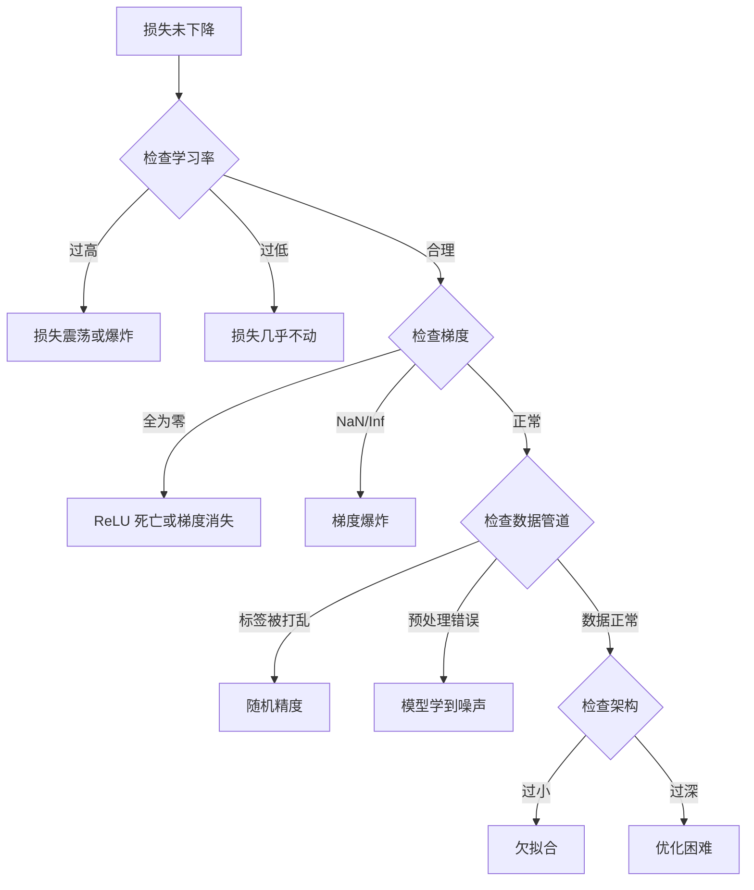
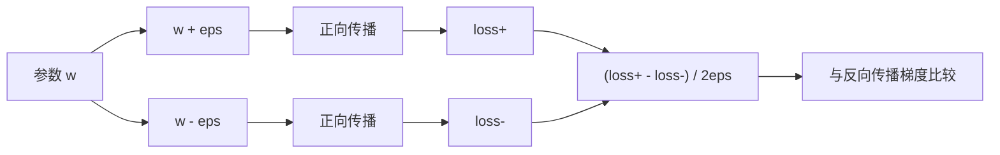
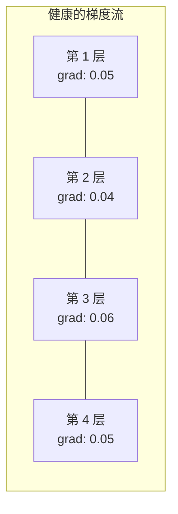
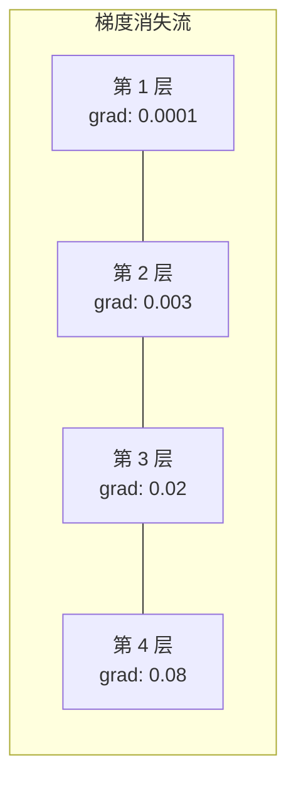
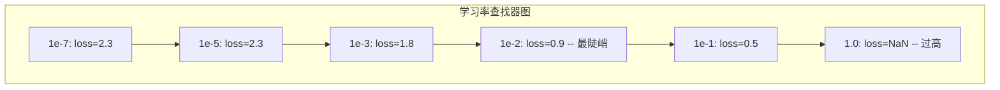

# Debugging Neural Networks

> Your network compiled. It ran. It produced a number. The number is wrong and nothing crashed. Welcome to the hardest kind of debugging -- the kind where there is no error message.

**Type:** 构建  
**Languages:** Python, PyTorch  
**Prerequisites:** 第03阶段 第01-10课（尤其是反向传播、损失函数、优化器）  
**Time:** ~90 分钟

## 学习目标

- 使用系统化的调试策略诊断常见神经网络故障（NaN 损失、平坦损失曲线、过拟合、振荡）
- 应用“过拟合单个小批次”技术以验证模型架构和训练循环是否正确
- 检查梯度幅度、激活分布和权重范数以识别梯度消失/爆炸问题
- 构建覆盖数据管道、模型架构、损失函数、优化器和学习率问题的调试检查表

## 问题背景

传统软件在出错时会崩溃。空指针抛出异常。类型不匹配在编译时失败。越界错误产生明显错误输出。

神经网络没有这种“幸免”。 

损坏的神经网络会运行完毕，打印一个损失值，并输出预测。损失可能在下降。预测看起来可能合理。但模型在默默地出错——学习捷径、记忆噪声，或收敛到无用的局部极小值。谷歌研究人员估计 60-70% 的 ML 调试时间花在那些不会报错但降低模型质量的“沉默”错误上。

一个工作模型与一个损坏模型之间的差别经常只是多出来或少掉的一行代码：遗漏的 `zero_grad()`、转置的维度、学习率差了 10 倍。经典的 “Recipe for Training Neural Networks” (2019) 开门见山写道：“最常见的神经网错误是那些不会崩溃的 bug。”

本课将教你如何找到这些 bug。

## 概念

### 调试心态

忘掉那种随便 print 然后祈祷的调试方式。神经网络调试需要系统化方法，因为反馈循环很慢（每次训练需要几分钟到几小时），症状又模糊（损失不佳可能有 20 种不同原因）。

黄金法则：**从简单开始，每次只增加一块复杂性，并独立验证每一部分。**



### 症状 1：损失不下降

这是最常见的抱怨。训练循环运行，epoch 在递增，但损失保持平坦或剧烈振荡。

错误的学习率。过高：损失振荡或跳到 NaN。过低：损失下降得太慢，看起来像平坦。对于 Adam，从 1e-3 开始。对于 SGD，从 1e-1 或 1e-2 开始。总是尝试 3 个相差 10 倍的学习率（例如 1e-2、1e-3、1e-4），再决定别的原因。

死亡的 ReLU。如果一个 ReLU 节点输入很大程度为负，它输出 0 并且梯度为 0。它再也不会激活。如果足够多的神经元死亡，网络无法学习。检查：在每个 ReLU 层后打印激活值恰好等于 0 的比例。如果 >50%，换成 LeakyReLU 或降低学习率。

梯度消失。在使用 sigmoid 或 tanh 激活的深层网络中，梯度在反向传播时呈指数级缩小。到达最前面几层时，梯度接近 0，最前面几层停止学习。解决：使用 ReLU/GELU，添加残差连接，或使用批量归一化。

梯度爆炸。相反的问题——梯度呈指数级增长。RNN 和非常深的网络中常见。损失跳到 NaN。解决：梯度裁剪（`torch.nn.utils.clip_grad_norm_`）、降低学习率或添加归一化。

### 症状 2：损失在下降但模型表现差

损失下降，训练精度达到 99%。但测试精度是 55%。或模型在真实数据上产生荒谬输出。

过拟合。模型记住训练数据而不是学到模式。训练和验证损失差距随时间拉大。解决：更多数据、dropout、权重衰减、早停、数据增强。

数据泄露。测试数据泄露到训练中。精度异常高。常见原因：在划分前先打乱、使用来自全数据集的统计量进行预处理、不同划分间的重复样本。解决：先划分，再预处理，检查重复样本。

标签错误。大多数真实数据集中有 5-10% 的标签是错的（Northcutt et al., 2021）。模型学到噪声。解决：使用 confident learning 找到并修复错标样本，或使用损失截断忽略高损失样本。

### 症状 3：损失为 NaN 或 Inf

损失变成 `nan` 或 `inf`。训练终止。

学习率过高。梯度更新越界导致权重爆炸。解决：学习率降低 10 倍。

log(0) 或对负数取对数。交叉熵计算 `log(p)`。如果模型输出恰为 0 或负概率，对数会爆炸。解决：将预测值 clamp 到 `[eps, 1-eps]`，其中 `eps=1e-7`。

除以零。批量归一化除以标准差。如果一个 batch 的值全相同，std=0。解决：在分母加上 epsilon（PyTorch 默认已处理，但自定义实现可能没有）。

数值溢出。送入 `exp()` 的大激活会产生 Inf。Softmax 尤其容易。解决：在指数之前减去最大值（log-sum-exp 技巧）。

### 技术 1：梯度检查

将你的解析梯度（反向传播获得）与数值梯度（有限差分）进行比较。如果不一致，说明你的反向传播实现有 bug。

参数 `w` 的数值梯度：

```
grad_numerical = (loss(w + eps) - loss(w - eps)) / (2 * eps)
```

一致性度量（相对差）：

```
rel_diff = |grad_analytical - grad_numerical| / max(|grad_analytical|, |grad_numerical|, 1e-8)
```

如果 `rel_diff < 1e-5`：正确。如果 `rel_diff > 1e-3`：几乎可以确定有 bug。



### 技术 2：激活统计

在训练过程中监控每层激活的均值和标准差。健康的网络保持激活均值接近 0、标准差接近 1（在归一化后），或至少是有界的。

| 健康指标 | 均值 | 标准差 | 诊断 |
|----------|------|--------|------|
| 健康 | ~0 | ~1 | 网络正常学习 |
| 饱和 | >>0 或 <<0 | ~0 | 激活卡在极端值 |
| 死亡 | 0 | 0 | 神经元已死（全为 0） |
| 爆炸 | >>10 | >>10 | 激活无界增长 |

### 技术 3：梯度流可视化

绘制每层平均梯度幅度。在健康网络中，各层梯度幅度应大致相似。如果前面的层的梯度比后面的层小 1000 倍，则存在梯度消失。





### 技术 4：过拟合单个小批次测试

深度学习中最重要的调试技术。

取一个小批次（8-32 样本）。对其训练 100+ 次迭代。损失应接近 0，训练准确率应达到 100%。如果没有，说明模型或训练循环存在根本性错误——不要继续完整训练。

该测试能抓住：
- 损失函数错误
- 反向传播错误
- 架构太小以至于无法表示数据
- 优化器未连接到模型参数
- 数据与标签未对齐

该测试运行约 30 秒，能节省数小时完整训练的调试时间。

### 技术 5：学习率查找器

Leslie Smith (2017) 提出在一个 epoch 内将学习率从非常小（1e-7）扫到非常大（10），同时记录损失。绘制损失对学习率曲线。最佳学习率大致是损失开始快速下降点的 10 倍更小的位置。



在此示例中最佳 LR：大约 1e-3（在最陡点之前一个数量级）。

### 常见的 PyTorch 错误

这些是 PyTorch 社区中耗费最多时间的错误：

| Bug | 症状 | 修复 |
|-----|------|------|
| 忘记 `optimizer.zero_grad()` | 梯度在 batch 之间累积，损失振荡 | 在 `loss.backward()` 前添加 `optimizer.zero_grad()` |
| 在测试时忘记 `model.eval()` | Dropout 和 BatchNorm 行为不同，测试精度在不同运行间变化 | 添加 `model.eval()` 和 `torch.no_grad()` |
| 张量形状错误 | 隐式广播产生错误结果，但没有报错 | 调试时在每个操作后打印形状 |
| CPU/GPU 不匹配 | `RuntimeError: expected CUDA tensor` | 对模型和数据都使用 `.to(device)` |
| 未分离张量 | 计算图不断增长，OOM | 使用 `.detach()` 或 `with torch.no_grad()` |
| 原地操作破坏 autograd | `RuntimeError: modified by in-place operation` | 用 `x = x + 1` 替换 `x += 1` |
| 数据未归一化 | 损失停在随机精度水平 | 将输入归一化到 mean=0, std=1 |
| 标签类型错误 | 交叉熵期望 `Long`，得到 `Float` | 强制类型转换：`labels.long()` |

### 主调试表

| 症状 | 可能原因 | 首先尝试 |
|------|---------|----------|
| 损失卡在 -log(1/num_classes) | 模型预测均匀分布 | 检查数据管道，验证标签是否与输入匹配 |
| 若干步后损失 NaN | 学习率过高 | 将 LR 降低 10 倍 |
| 损失立即为 NaN | log(0) 或除以零 | 在 log/除法操作中增加 epsilon |
| 损失剧烈振荡 | LR 过高或 batch size 太小 | 降低 LR，增加 batch size |
| 损失下降然后停滞 | 微调阶段 LR 太高 | 添加 LR 调度（余弦或阶梯衰减） |
| 训练准确高、测试低 | 过拟合 | 添加 dropout、权重衰减、更多数据 |
| 训练 acc = 测试 acc = 随机 | 模型没有学到任何东西 | 运行过拟合单个小批次测试 |
| 训练 acc = 测试 acc 都偏低 | 欠拟合 | 更大的模型，更多层，更多特征 |
| 梯度全为零 | ReLU 死亡或计算图被分离 | 换用 LeakyReLU，检查 `.requires_grad` |
| 训练时内存不足 | batch 太大或图未释放 | 减小 batch，评估时使用 `torch.no_grad()` |

```figure
learning-curves
```

## 构建它

一个监控激活、梯度和损失曲线的诊断工具包。你将刻意破坏一个网络并使用工具包来诊断每个问题。

### 第一步：NetworkDebugger 类

挂钩到 PyTorch 模型上以记录每层的激活和梯度统计信息。

```python
import torch
import torch.nn as nn
import math


class NetworkDebugger:
    def __init__(self, model):
        self.model = model
        self.activation_stats = {}
        self.gradient_stats = {}
        self.loss_history = []
        self.lr_losses = []
        self.hooks = []
        self._register_hooks()

    def _register_hooks(self):
        for name, module in self.model.named_modules():
            if isinstance(module, (nn.Linear, nn.Conv2d, nn.ReLU, nn.LeakyReLU)):
                hook = module.register_forward_hook(self._make_activation_hook(name))
                self.hooks.append(hook)
                hook = module.register_full_backward_hook(self._make_gradient_hook(name))
                self.hooks.append(hook)

    def _make_activation_hook(self, name):
        def hook(module, input, output):
            with torch.no_grad():
                out = output.detach().float()
                self.activation_stats[name] = {
                    "mean": out.mean().item(),
                    "std": out.std().item(),
                    "fraction_zero": (out == 0).float().mean().item(),
                    "min": out.min().item(),
                    "max": out.max().item(),
                }
        return hook

    def _make_gradient_hook(self, name):
        def hook(module, grad_input, grad_output):
            if grad_output[0] is not None:
                with torch.no_grad():
                    grad = grad_output[0].detach().float()
                    self.gradient_stats[name] = {
                        "mean": grad.mean().item(),
                        "std": grad.std().item(),
                        "abs_mean": grad.abs().mean().item(),
                        "max": grad.abs().max().item(),
                    }
        return hook

    def record_loss(self, loss_value):
        self.loss_history.append(loss_value)

    def check_loss_health(self):
        if len(self.loss_history) < 2:
            return "NOT_ENOUGH_DATA"
        recent = self.loss_history[-10:]
        if any(math.isnan(v) or math.isinf(v) for v in recent):
            return "NAN_OR_INF"
        if len(self.loss_history) >= 20:
            first_half = sum(self.loss_history[:10]) / 10
            second_half = sum(self.loss_history[-10:]) / 10
            if second_half >= first_half * 0.99:
                return "NOT_DECREASING"
        if len(recent) >= 5:
            diffs = [recent[i+1] - recent[i] for i in range(len(recent)-1)]
            if max(diffs) - min(diffs) > 2 * abs(sum(diffs) / len(diffs)):
                return "OSCILLATING"
        return "HEALTHY"

    def check_activations(self):
        issues = []
        for name, stats in self.activation_stats.items():
            if stats["fraction_zero"] > 0.5:
                issues.append(f"DEAD_NEURONS: {name} has {stats['fraction_zero']:.0%} zero activations")
            if abs(stats["mean"]) > 10:
                issues.append(f"EXPLODING_ACTIVATIONS: {name} mean={stats['mean']:.2f}")
            if stats["std"] < 1e-6:
                issues.append(f"COLLAPSED_ACTIVATIONS: {name} std={stats['std']:.2e}")
        return issues if issues else ["HEALTHY"]

    def check_gradients(self):
        issues = []
        grad_magnitudes = []
        for name, stats in self.gradient_stats.items():
            grad_magnitudes.append((name, stats["abs_mean"]))
            if stats["abs_mean"] < 1e-7:
                issues.append(f"VANISHING_GRADIENT: {name} abs_mean={stats['abs_mean']:.2e}")
            if stats["abs_mean"] > 100:
                issues.append(f"EXPLODING_GRADIENT: {name} abs_mean={stats['abs_mean']:.2e}")
        if len(grad_magnitudes) >= 2:
            first_mag = grad_magnitudes[0][1]
            last_mag = grad_magnitudes[-1][1]
            if last_mag > 0 and first_mag / last_mag > 100:
                issues.append(f"GRADIENT_RATIO: first/last = {first_mag/last_mag:.0f}x (vanishing)")
        return issues if issues else ["HEALTHY"]

    def print_report(self):
        print("\n=== NETWORK DEBUGGER REPORT ===")
        print(f"\nLoss health: {self.check_loss_health()}")
        if self.loss_history:
            print(f"  Last 5 losses: {[f'{v:.4f}' for v in self.loss_history[-5:]]}")
        print("\nActivation diagnostics:")
        for item in self.check_activations():
            print(f"  {item}")
        print("\nGradient diagnostics:")
        for item in self.check_gradients():
            print(f"  {item}")
        print("\nPer-layer activation stats:")
        for name, stats in self.activation_stats.items():
            print(f"  {name}: mean={stats['mean']:.4f} std={stats['std']:.4f} zero={stats['fraction_zero']:.1%}")
        print("\nPer-layer gradient stats:")
        for name, stats in self.gradient_stats.items():
            print(f"  {name}: abs_mean={stats['abs_mean']:.2e} max={stats['max']:.2e}")

    def remove_hooks(self):
        for hook in self.hooks:
            hook.remove()
        self.hooks.clear()
```

### 第二步：过拟合单个小批次测试

```python
def overfit_one_batch(model, x_batch, y_batch, criterion, lr=0.01, steps=200):
    optimizer = torch.optim.Adam(model.parameters(), lr=lr)
    model.train()
    print("\n=== OVERFIT ONE BATCH TEST ===")
    print(f"Batch size: {x_batch.shape[0]}, Steps: {steps}")

    for step in range(steps):
        optimizer.zero_grad()
        output = model(x_batch)
        loss = criterion(output, y_batch)
        loss.backward()
        optimizer.step()

        if step % 50 == 0 or step == steps - 1:
            with torch.no_grad():
                preds = (output > 0).float() if output.shape[-1] == 1 else output.argmax(dim=1)
                targets = y_batch if y_batch.dim() == 1 else y_batch.squeeze()
                acc = (preds.squeeze() == targets).float().mean().item()
            print(f"  Step {step:3d} | Loss: {loss.item():.6f} | Accuracy: {acc:.1%}")

    final_loss = loss.item()
    if final_loss > 0.1:
        print(f"\n  FAIL: Loss did not converge ({final_loss:.4f}). Model or training loop is broken.")
        return False
    print(f"\n  PASS: Loss converged to {final_loss:.6f}")
    return True
```

### 第三步：学习率查找器

```python
def find_learning_rate(model, x_data, y_data, criterion, start_lr=1e-7, end_lr=10, steps=100):
    import copy
    original_state = copy.deepcopy(model.state_dict())
    optimizer = torch.optim.SGD(model.parameters(), lr=start_lr)
    lr_mult = (end_lr / start_lr) ** (1 / steps)

    model.train()
    results = []
    best_loss = float("inf")
    current_lr = start_lr

    print("\n=== LEARNING RATE FINDER ===")

    for step in range(steps):
        optimizer.zero_grad()
        output = model(x_data)
        loss = criterion(output, y_data)

        if math.isnan(loss.item()) or loss.item() > best_loss * 10:
            break

        best_loss = min(best_loss, loss.item())
        results.append((current_lr, loss.item()))

        loss.backward()
        optimizer.step()

        current_lr *= lr_mult
        for param_group in optimizer.param_groups:
            param_group["lr"] = current_lr

    model.load_state_dict(original_state)

    if len(results) < 10:
        print("  Could not complete LR sweep -- loss diverged too quickly")
        return results

    min_loss_idx = min(range(len(results)), key=lambda i: results[i][1])
    suggested_lr = results[max(0, min_loss_idx - 10)][0]

    print(f"  Swept {len(results)} steps from {start_lr:.0e} to {results[-1][0]:.0e}")
    print(f"  Minimum loss {results[min_loss_idx][1]:.4f} at lr={results[min_loss_idx][0]:.2e}")
    print(f"  Suggested learning rate: {suggested_lr:.2e}")

    return results
```

### 第四步：梯度检查器

```python
def _flat_to_multi_index(flat_idx, shape):
    multi_idx = []
    remaining = flat_idx
    for dim in reversed(shape):
        multi_idx.insert(0, remaining % dim)
        remaining //= dim
    return tuple(multi_idx)


def gradient_check(model, x, y, criterion, eps=1e-4):
    model.train()
    x_double = x.double()
    y_double = y.double()
    model_double = model.double()

    print("\n=== GRADIENT CHECK ===")
    overall_max_diff = 0
    checked = 0

    for name, param in model_double.named_parameters():
        if not param.requires_grad:
            continue

        layer_max_diff = 0

        model_double.zero_grad()
        output = model_double(x_double)
        loss = criterion(output, y_double)
        loss.backward()
        analytical_grad = param.grad.clone()

        num_checks = min(5, param.numel())
        for i in range(num_checks):
            idx = _flat_to_multi_index(i, param.shape)
            original = param.data[idx].item()

            param.data[idx] = original + eps
            with torch.no_grad():
                loss_plus = criterion(model_double(x_double), y_double).item()

            param.data[idx] = original - eps
            with torch.no_grad():
                loss_minus = criterion(model_double(x_double), y_double).item()

            param.data[idx] = original

            numerical = (loss_plus - loss_minus) / (2 * eps)
            analytical = analytical_grad[idx].item()

            denom = max(abs(numerical), abs(analytical), 1e-8)
            rel_diff = abs(numerical - analytical) / denom

            layer_max_diff = max(layer_max_diff, rel_diff)
            checked += 1

        overall_max_diff = max(overall_max_diff, layer_max_diff)
        status = "OK" if layer_max_diff < 1e-5 else "MISMATCH"
        print(f"  {name}: max_rel_diff={layer_max_diff:.2e} [{status}]")

    model.float()

    print(f"\n  Checked {checked} parameters")
    if overall_max_diff < 1e-5:
        print("  PASS: Gradients match (rel_diff < 1e-5)")
    elif overall_max_diff < 1e-3:
        print("  WARN: Small differences (1e-5 < rel_diff < 1e-3)")
    else:
        print("  FAIL: Gradient mismatch detected (rel_diff > 1e-3)")
    return overall_max_diff
```

### 第五步：刻意破坏的网络

现在将工具包应用到被破坏的网络并诊断每一个问题。

```python
def demo_broken_networks():
    torch.manual_seed(42)
    x = torch.randn(64, 10)
    y = (x[:, 0] > 0).long()

    print("\n" + "=" * 60)
    print("BUG 1: Learning rate too high (lr=10)")
    print("=" * 60)
    model1 = nn.Sequential(nn.Linear(10, 32), nn.ReLU(), nn.Linear(32, 2))
    debugger1 = NetworkDebugger(model1)
    optimizer1 = torch.optim.SGD(model1.parameters(), lr=10.0)
    criterion = nn.CrossEntropyLoss()
    for step in range(20):
        optimizer1.zero_grad()
        out = model1(x)
        loss = criterion(out, y)
        debugger1.record_loss(loss.item())
        loss.backward()
        optimizer1.step()
    debugger1.print_report()
    debugger1.remove_hooks()

    print("\n" + "=" * 60)
    print("BUG 2: Dead ReLUs from bad initialization")
    print("=" * 60)
    model2 = nn.Sequential(nn.Linear(10, 32), nn.ReLU(), nn.Linear(32, 32), nn.ReLU(), nn.Linear(32, 2))
    with torch.no_grad():
        for m in model2.modules():
            if isinstance(m, nn.Linear):
                m.weight.fill_(-1.0)
                m.bias.fill_(-5.0)
    debugger2 = NetworkDebugger(model2)
    optimizer2 = torch.optim.Adam(model2.parameters(), lr=1e-3)
    for step in range(50):
        optimizer2.zero_grad()
        out = model2(x)
        loss = criterion(out, y)
        debugger2.record_loss(loss.item())
        loss.backward()
        optimizer2.step()
    debugger2.print_report()
    debugger2.remove_hooks()

    print("\n" + "=" * 60)
    print("BUG 3: Missing zero_grad (gradients accumulate)")
    print("=" * 60)
    model3 = nn.Sequential(nn.Linear(10, 32), nn.ReLU(), nn.Linear(32, 2))
    debugger3 = NetworkDebugger(model3)
    optimizer3 = torch.optim.SGD(model3.parameters(), lr=0.01)
    for step in range(50):
        out = model3(x)
        loss = criterion(out, y)
        debugger3.record_loss(loss.item())
        loss.backward()
        optimizer3.step()
    debugger3.print_report()
    debugger3.remove_hooks()

    print("\n" + "=" * 60)
    print("HEALTHY NETWORK: Correct setup for comparison")
    print("=" * 60)
    model_good = nn.Sequential(nn.Linear(10, 32), nn.ReLU(), nn.Linear(32, 2))
    debugger_good = NetworkDebugger(model_good)
    optimizer_good = torch.optim.Adam(model_good.parameters(), lr=1e-3)
    for step in range(50):
        optimizer_good.zero_grad()
        out = model_good(x)
        loss = criterion(out, y)
        debugger_good.record_loss(loss.item())
        loss.backward()
        optimizer_good.step()
    debugger_good.print_report()
    debugger_good.remove_hooks()

    print("\n" + "=" * 60)
    print("OVERFIT-ONE-BATCH TEST (healthy model)")
    print("=" * 60)
    model_test = nn.Sequential(nn.Linear(10, 32), nn.ReLU(), nn.Linear(32, 2))
    overfit_one_batch(model_test, x[:8], y[:8], criterion)

    print("\n" + "=" * 60)
    print("LEARNING RATE FINDER")
    print("=" * 60)
    model_lr = nn.Sequential(nn.Linear(10, 32), nn.ReLU(), nn.Linear(32, 2))
    find_learning_rate(model_lr, x, y, criterion)

    print("\n" + "=" * 60)
    print("GRADIENT CHECK")
    print("=" * 60)
    model_grad = nn.Sequential(nn.Linear(10, 8), nn.ReLU(), nn.Linear(8, 2))
    gradient_check(model_grad, x[:4], y[:4], criterion)
```

## 使用方法

### PyTorch 内置工具

```python
import torch
import torch.nn as nn

model = nn.Sequential(
    nn.Linear(768, 256),
    nn.ReLU(),
    nn.Linear(256, 10),
)

with torch.autograd.detect_anomaly():
    output = model(input_tensor)
    loss = criterion(output, target)
    loss.backward()

for name, param in model.named_parameters():
    if param.grad is not None:
        print(f"{name}: grad_mean={param.grad.abs().mean():.2e}")
```

### Weights & Biases 集成

```python
import wandb

wandb.init(project="debug-training")

for epoch in range(100):
    loss = train_one_epoch()
    wandb.log({
        "loss": loss,
        "lr": optimizer.param_groups[0]["lr"],
        "grad_norm": torch.nn.utils.clip_grad_norm_(model.parameters(), float("inf")),
    })

    for name, param in model.named_parameters():
        if param.grad is not None:
            wandb.log({f"grad/{name}": wandb.Histogram(param.grad.cpu().numpy())})
```

### TensorBoard

```python
from torch.utils.tensorboard import SummaryWriter

writer = SummaryWriter("runs/debug_experiment")

for epoch in range(100):
    loss = train_one_epoch()
    writer.add_scalar("Loss/train", loss, epoch)

    for name, param in model.named_parameters():
        writer.add_histogram(f"weights/{name}", param, epoch)
        if param.grad is not None:
            writer.add_histogram(f"gradients/{name}", param.grad, epoch)
```

### 调试检查清单（在完整训练前）

1. 运行过拟合单个小批次测试。如果失败，停止。
2. 打印模型摘要 —— 验证参数数量是否合理。
3. 用随机数据运行一次前向传递 —— 检查输出形状。
4. 训练 5 个 epoch —— 验证损失是否下降。
5. 检查激活统计 —— 没有死亡层、没有爆炸。
6. 检查梯度流 —— 没有消失、没有爆炸。
7. 验证数据管道 —— 打印 5 个随机样本及其标签。

## 部署

本课产出：
- `outputs/prompt-nn-debugger.md` -- 一个用于诊断神经网络训练失败的提示
- `outputs/skill-debug-checklist.md` -- 一个用于调试训练问题的决策树检查表

调试部署的关键模式：
- 在生产训练脚本中添加监控钩子
- 每 N 步将激活和梯度统计记录到 W&B 或 TensorBoard
- 为 NaN 损失、死亡神经元（>80% 为零）或梯度爆炸实现自动告警
- 在更改架构或数据管道时始终运行过拟合单个小批次测试

## 练习

1. **添加梯度爆炸检测器。** 修改 `NetworkDebugger` 以检测梯度超过阈值的情况并自动建议一个梯度裁剪值。在没有归一化的 20 层网络上测试它。
2. **构建一个死神经元复活器。** 编写一个函数识别始终输出 0 的 ReLU 神经元，并用 Kaiming 初始化重新初始化它们的输入权重。展示这能恢复一个 >70% 神经元死亡的网络。
3. **实现带绘图的学习率查找器。** 扩展 `find_learning_rate` 将结果保存为 CSV，并写一个脚本读取 CSV 并使用 matplotlib 显示 LR vs loss 曲线。为 CIFAR-10 上的 ResNet-18 找到最佳 LR。
4. **创建数据管道验证器。** 编写一个函数检查：训练/测试划分间的重复样本、标签分布不平衡（>10:1）、输入归一化（均值接近 0，标准差接近 1）、以及数据中是否存在 NaN/Inf。对一个故意损坏的数据集运行它。
5. **调试一个真实失败。** 使用第 10 课的小型框架，加入一个细微 bug（例如在反向传播中转置权重矩阵），并使用梯度检查精确定位哪个参数的梯度不正确。记录调试过程。

## 关键术语

| 术语 | 常说法 | 实际含义 |
|------|--------|---------|
| Silent bug | "It runs but gives bad results" | 一个不会报错但降低模型质量的 bug —— ML 中的主要失败模式 |
| Dead ReLU | "The neurons died" | 一个 ReLU 神经元的输入始终为负，因此输出为 0 并永久接收 0 梯度 |
| Vanishing gradients | "Early layers stop learning" | 梯度在层间呈指数级缩小，使得前面层的权重实际上被冻结 |
| Exploding gradients | "Loss went to NaN" | 梯度在层间呈指数级增长，导致权重更新过大而溢出 |
| Gradient checking | "Verify backprop is correct" | 将反向传播得到的解析梯度与有限差分得到的数值梯度进行比较 |
| Overfit-one-batch | "The most important debug test" | 在一个小批次上训练以验证模型是否能够学习 —— 如果不能，说明有根本性错误 |
| LR finder | "Sweep to find the right learning rate" | 在一个 epoch 内指数增长学习率并选择在损失发散前的学习率 |
| Data leakage | "Test data leaked into training" | 测试集信息污染训练集，导致虚假的高精度 |
| Activation statistics | "Monitor layer health" | 跟踪每层输出的均值、标准差和零比例以检测死亡、饱和或爆炸神经元 |
| Gradient clipping | "Cap the gradient magnitude" | 当梯度范数超过阈值时缩放梯度，防止梯度爆炸导致的更新失控 |

## 延伸阅读

- Smith, "Cyclical Learning Rates for Training Neural Networks" (2017) -- 提出学习率范围测试（LR finder）的论文
- Northcutt et al., "Pervasive Label Errors in Test Sets Destabilize Machine Learning Benchmarks" (2021) -- 表明 ImageNet、CIFAR-10 等基准测试集中有 3-6% 的标签是错的
- Zhang et al., "Understanding Deep Learning Requires Rethinking Generalization" (2017) -- 展示神经网络可以记忆随机标签，这就是过拟合单个小批次测试有效的原因
- PyTorch 文档中关于 `torch.autograd.detect_anomaly` 和 `torch.autograd.set_detect_anomaly` 的内置 NaN/Inf 检测说明