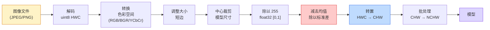
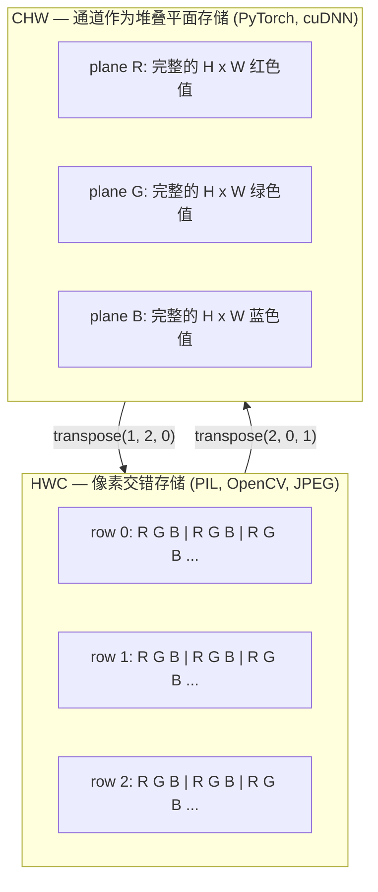

# 图像基础 — 像素、通道与色彩空间

> 图像本质上是光采样张量。你所使用的每一个视觉模型都始于这一事实。

**Type:** Build
**Languages:** Python
**Prerequisites:** 第一阶段第 12 课（张量运算），第三阶段第 11 课（PyTorch 简介）
**Time:** ~45 分钟

## 学习目标

- 解释连续场景如何离散化为像素，以及为什么采样/量化决策决定了所有下游模型的性能上限
- 使用 NumPy 数组读取、切片和检查图像，并熟练切换 HWC 和 CHW 布局
- 在 RGB、灰度、HSV 和 YCbCr 之间进行转换，并说明每种色彩空间存在的理由
- 应用像素级预处理（归一化、标准化、调整大小、通道优先），使其完全符合 torchvision 的预期

## 问题所在

你阅读的每一篇论文、下载的每一个预训练权重、调用的每一个视觉 API，都假设输入具有特定的编码方式。如果模型需要 `float32` 而你传入了 `uint8` 图像，它依然会运行，但会悄无声息地产生垃圾结果。将 BGR 格式输入到在 RGB 上训练的网络中，准确率会下降十个百分点。将通道在后的输入交给期望通道在前的模型，第一个卷积层就会把高度当作特征通道来处理。这些操作都不会报错，但会彻底毁掉你的指标，让你花上一周时间去寻找隐藏在文件加载方式中的 Bug。

一旦你知道卷积是在什么上面滑动，它就不复杂了。难点在于，“图像”对于相机、JPEG 解码器、PIL、OpenCV、torchvision 和 CUDA 内核来说含义各不相同。每个技术栈都有自己的轴序、字节范围和通道约定。无法理清这些关系的视觉工程师，最终只会交付出故障的流水线。

本课将夯实基础，以便后续课程在此之上构建。学完本课，你将了解什么是像素，为什么每个像素有三个数字而不是一个，什么是“使用 ImageNet 统计数据进行标准化”，以及如何在后续课程中涉及的两种或三种布局之间进行转换。

## 概念

### 预处理流水线概览

每个生产级视觉系统都遵循相同的可逆变换序列。只要错了一步，模型看到的输入就与训练时不同。



红色和蓝色方框是 80% 静默故障的来源：缺失标准化和布局错误。

### 像素是采样，而非方块

相机传感器计算落在微小探测器网格上的光子。每个探测器在几分之一秒内积分光线，并发出与光子数量成正比的电压。传感器随后将该电压离散化为整数。一个探测器对应一个像素。

```
连续场景                 传感器网格                     数字图像
(无限细节)                (H x W 探测器)               (H x W 整数)

    ~~~~~                        +--+--+--+--+--+                 210 198 180 155 120
   ~   ~   ~                     |  |  |  |  |  |                 205 195 178 152 118
  ~ 光线 ~      ---->           +--+--+--+--+--+     ---->       200 190 175 150 115
   ~~~~~                         |  |  |  |  |  |                 195 185 170 148 112
                                 +--+--+--+--+--+                 188 180 165 145 108
```

此步骤中的两个选择决定了下游所有任务的上限：

- **空间采样**：决定了场景每度有多少个探测器。太少会导致边缘锯齿（混叠）；太多则会导致存储和计算量爆炸。
- **强度量化**：决定了电压分桶的精细程度。8 位提供 256 个级别，是显示器的标准。10、12、16 位提供更平滑的渐变，对医学成像、HDR 和原始传感器流水线至关重要。

像素不是有面积的彩色方块，它是一个单一的测量值。当你调整大小或旋转时，你实际上是在对该测量网格进行重采样。

### 为什么有三个通道

单个探测器计算整个可见光谱的光子——这就是灰度。为了获得颜色，传感器在网格上覆盖了红、绿、蓝滤光片的马赛克。去马赛克后，每个空间位置都有三个整数：附近红滤光片、绿滤光片和蓝滤光片探测器的响应。这三个整数就是像素的 RGB 三元组。

```
内存中的一个像素：

    (R, G, B) = (210, 140, 30)   <- 红橙色

H x W RGB 图像：

    形状 (H, W, 3)     存储为   H 行，每行 W 个像素，每个像素 3 个值
                                    每个值在 [0, 255] 之间 (uint8)
```

“三”并不是魔法。深度相机增加了 Z 通道。卫星增加了红外和紫外波段。医学扫描通常有一个通道（X 射线、CT）或多个通道（高光谱）。通道数是最后一个轴；卷积层学习跨通道混合信息。

### 两种布局约定：HWC 和 CHW

同一个张量，两种排序方式。每个库都会选择一种。

```
HWC (高, 宽, 通道)                      CHW (通道, 高, 宽)

   W ->                                    H ->
  +-----+-----+-----+                     +-----+-----+
H |R G B|R G B|R G B|                   C |R R R R R R|
| +-----+-----+-----+                   | +-----+-----+
v |R G B|R G B|R G B|                   v |G G G G G G|
  +-----+-----+-----+                     +-----+-----+
                                          |B B B B B B|
                                          +-----+-----+

   PIL, OpenCV, matplotlib,              PyTorch, 大多数深度学习
   磁盘上几乎所有图像文件                 框架, cuDNN 内核
```

CHW 的存在是因为卷积核在 H 和 W 上滑动。将通道轴放在最前面意味着每个卷积核都能看到每个通道连续的 2D 平面，这便于向量化。磁盘格式保留 HWC 是因为这符合传感器输出扫描线的方式。

你将输入成千上万次的一行转换代码：

```python
img_chw = img_hwc.transpose(2, 0, 1)      # NumPy
img_chw = img_hwc.permute(2, 0, 1)        # PyTorch 张量
```

内存布局可视化：



### 字节范围与数据类型 (dtype)

三种约定占主导地位：

| 约定 | dtype | 范围 | 常见场景 |
|------------|-------|-------|------------------|
| 原始 (Raw) | `uint8` | [0, 255] | 磁盘文件, PIL, OpenCV 输出 |
| 归一化 (Normalized) | `float32` | [0.0, 1.0] | 执行 `img.astype('float32') / 255` 后 |
| 标准化 (Standardized) | `float32` | 大约 [-2, +2] | 减去均值并除以标准差后 |

卷积网络是在标准化输入上训练的。ImageNet 统计数据 `mean=[0.485, 0.456, 0.406]` 和 `std=[0.229, 0.224, 0.225]` 是在 [0, 1] 归一化像素上计算出的整个 ImageNet 训练集三个通道的算术平均值和标准差。将原始 `uint8` 输入到期望标准化浮点数的模型中，是应用视觉领域最常见的静默故障。

### 色彩空间及其存在理由

RGB 是捕获格式，但对模型而言并不总是最有用的表示。

```
 RGB               HSV                       YCbCr / YUV

 R 红              H 色相 (角度 0-360)       Y 亮度 (brightness)
 G 绿              S 饱和度 (0-1)            Cb 色度 蓝-黄
 B 蓝              V 明度 (0-1)              Cr 色度 红-绿

 线性对应          将颜色与亮度分离。        将亮度与颜色分离。JPEG 和大多数视频
 传感器输出        适用于颜色阈值、UI        编解码器对色度通道压缩更狠，因为
                   滑块、简单滤镜            人眼对色度细节不如对 Y 敏感。
```

对于大多数现代 CNN，你输入的是 RGB。在以下情况你会遇到其他空间：

- **HSV** — 经典 CV 代码、基于颜色的分割、白平衡。
- **YCbCr** — 读取 JPEG 内部数据、视频流水线、仅在 Y 通道上操作的超分辨率模型。
- **灰度** — OCR、文档模型，以及任何颜色是干扰变量而非信号的情况。

从 RGB 转灰度是加权和，而不是平均值，因为人眼对绿色比对红色或蓝色更敏感：

```
Y = 0.299 R + 0.587 G + 0.114 B       (ITU-R BT.601, 经典权重)
```

### 长宽比、调整大小与插值

每个模型都有固定的输入尺寸（大多数 ImageNet 分类器为 224x224，现代检测器为 384x384 或 512x512）。你的图像很少匹配这些尺寸。三种重要的调整大小选择：

- **调整短边，然后中心裁剪** — 标准 ImageNet 配方。保留长宽比，丢弃边缘像素。
- **调整大小并填充** — 保留长宽比和所有像素，添加黑边。检测和 OCR 的标准做法。
- **直接调整到目标尺寸** — 拉伸图像。成本低，几何失真，适用于许多分类任务。

插值方法决定了当新网格与旧网格不对齐时如何计算中间像素：

```
最近邻 (Nearest)      最快，有块状感，仅适用于掩码/标签
双线性 (Bilinear)     快，平滑，大多数图像调整大小的默认值
双三次 (Bicubic)      较慢，放大时更清晰
Lanczos               最慢，质量最好，用于最终显示
```

经验法则：训练用双线性，展示用双三次或 Lanczos，包含整数类 ID 的数据用最近邻。

## 构建

### 第 1 步：加载图像并检查形状

使用 Pillow 加载 JPEG 或 PNG，转换为 NumPy，并打印结果。为了获得离线运行的确定性示例，我们合成一个图像。

```python
import numpy as np
from PIL import Image

def synthetic_rgb(h=128, w=192, seed=0):
    rng = np.random.default_rng(seed)
    yy, xx = np.meshgrid(np.linspace(0, 1, h), np.linspace(0, 1, w), indexing="ij")
    r = (np.sin(xx * 6) * 0.5 + 0.5) * 255
    g = yy * 255
    b = (1 - yy) * xx * 255
    rgb = np.stack([r, g, b], axis=-1) + rng.normal(0, 6, (h, w, 3))
    return np.clip(rgb, 0, 255).astype(np.uint8)

arr = synthetic_rgb()
# 或者从磁盘加载：
# arr = np.asarray(Image.open("your_image.jpg").convert("RGB"))

print(f"type:   {type(arr).__name__}")
print(f"dtype:  {arr.dtype}")
print(f"shape:  {arr.shape}     # (H, W, C)")
print(f"min:    {arr.min()}")
print(f"max:    {arr.max()}")
print(f"pixel at (0, 0): {arr[0, 0]}")
```

预期输出：`shape: (H, W, 3)`, `dtype: uint8`, 范围 `[0, 255]`。无论字节来自相机、JPEG 解码器还是合成生成器，这都是磁盘上的规范表示。

### 第 2 步：拆分通道并重新排序布局

分别提取 R、G、B，然后将 HWC 转换为 PyTorch 所需的 CHW。

```python
R = arr[:, :, 0]
G = arr[:, :, 1]
B = arr[:, :, 2]
print(f"R shape: {R.shape}, mean: {R.mean():.1f}")
print(f"G shape: {G.shape}, mean: {G.mean():.1f}")
print(f"B shape: {B.shape}, mean: {B.mean():.1f}")

arr_chw = arr.transpose(2, 0, 1)
print(f"\nHWC shape: {arr.shape}")
print(f"CHW shape: {arr_chw.shape}")
```

三个灰度平面，每个通道一个。CHW 只是重新排序了轴；当内存布局允许时，不需要进行数据拷贝。

### 第 3 步：灰度和 HSV 转换

加权求和灰度，然后手动实现 RGB 到 HSV 的转换。

```python
def rgb_to_grayscale(rgb):
    weights = np.array([0.299, 0.587, 0.114], dtype=np.float32)
    return (rgb.astype(np.float32) @ weights).astype(np.uint8)

def rgb_to_hsv(rgb):
    rgb_f = rgb.astype(np.float32) / 255.0
    r, g, b = rgb_f[..., 0], rgb_f[..., 1], rgb_f[..., 2]
    cmax = np.max(rgb_f, axis=-1)
    cmin = np.min(rgb_f, axis=-1)
    delta = cmax - cmin

    h = np.zeros_like(cmax)
    mask = delta > 0
    rmax = mask & (cmax == r)
    gmax = mask & (cmax == g)
    bmax = mask & (cmax == b)
    h[rmax] = ((g[rmax] - b[rmax]) / delta[rmax]) % 6
    h[gmax] = ((b[gmax] - r[gmax]) / delta[gmax]) + 2
    h[bmax] = ((r[bmax] - g[bmax]) / delta[bmax]) + 4
    h = h * 60.0

    s = np.where(cmax > 0, delta / cmax, 0)
    v = cmax
    return np.stack([h, s, v], axis=-1)

gray = rgb_to_grayscale(arr)
hsv = rgb_to_hsv(arr)
print(f"gray shape: {gray.shape}, range: [{gray.min()}, {gray.max()}]")
print(f"hsv   shape: {hsv.shape}")
print(f"hue range: [{hsv[..., 0].min():.1f}, {hsv[..., 0].max():.1f}] degrees")
print(f"sat range: [{hsv[..., 1].min():.2f}, {hsv[..., 1].max():.2f}]")
print(f"val range: [{hsv[..., 2].min():.2f}, {hsv[..., 2].max():.2f}]")
```

色相以度为单位，饱和度和明度在 [0, 1] 之间。这符合 OpenCV `hsv_full` 的约定。

### 第 4 步：归一化、标准化及反向操作

从原始字节转换为预训练 ImageNet 模型所需的张量，然后再转回来。

```python
mean = np.array([0.485, 0.456, 0.406], dtype=np.float32)
std = np.array([0.229, 0.224, 0.225], dtype=np.float32)

def preprocess_imagenet(rgb_uint8):
    x = rgb_uint8.astype(np.float32) / 255.0
    x = (x - mean) / std
    x = x.transpose(2, 0, 1)
    return x

def deprocess_imagenet(chw_float32):
    x = chw_float32.transpose(1, 2, 0)
    x = x * std + mean
    x = np.clip(x * 255.0, 0, 255).astype(np.uint8)
    return x

x = preprocess_imagenet(arr)
print(f"preprocessed shape: {x.shape}     # (C, H, W)")
print(f"preprocessed dtype: {x.dtype}")
print(f"preprocessed mean per channel:  {x.mean(axis=(1, 2)).round(3)}")
print(f"preprocessed std  per channel:  {x.std(axis=(1, 2)).round(3)}")

roundtrip = deprocess_imagenet(x)
max_diff = np.abs(roundtrip.astype(int) - arr.astype(int)).max()
print(f"roundtrip max pixel diff: {max_diff}    # 应该为 0 或 1")
```

每个通道的均值应接近 0，标准差应接近 1。预处理/反预处理对正是 torchvision `transforms.Normalize` 在底层所做的事情。

### 第 5 步：使用三种插值方法调整大小

比较最近邻、双线性和双三次插值，放大图像以观察差异。

```python
target = (arr.shape[0] * 3, arr.shape[1] * 3)

nearest = np.asarray(Image.fromarray(arr).resize(target[::-1], Image.NEAREST))
bilinear = np.asarray(Image.fromarray(arr).resize(target[::-1], Image.BILINEAR))
bicubic = np.asarray(Image.fromarray(arr).resize(target[::-1], Image.BICUBIC))

def local_roughness(x):
    gy = np.diff(x.astype(float), axis=0)
    gx = np.diff(x.astype(float), axis=1)
    return float(np.abs(gy).mean() + np.abs(gx).mean())

for name, out in [("nearest", nearest), ("bilinear", bilinear), ("bicubic", bicubic)]:
    print(f"{name:>8}  shape={out.shape}  roughness={local_roughness(out):6.2f}")
```

最近邻在粗糙度上得分最高，因为它保留了硬边缘。双线性最平滑。双三次介于两者之间，在不产生阶梯伪影的情况下保留了感知锐度。

## 使用

`torchvision.transforms` 将上述所有内容捆绑到一个可组合的流水线中。以下代码完全复现了 `preprocess_imagenet` 的功能，并增加了调整大小和裁剪。

```python
import torch
from torchvision import transforms
from PIL import Image

img = Image.fromarray(synthetic_rgb(256, 256))

pipeline = transforms.Compose([
    transforms.Resize(256),
    transforms.CenterCrop(224),
    transforms.ToTensor(),
    transforms.Normalize(mean=[0.485, 0.456, 0.406], std=[0.229, 0.224, 0.225]),
])

x = pipeline(img)
print(f"tensor type:  {type(x).__name__}")
print(f"tensor dtype: {x.dtype}")
print(f"tensor shape: {tuple(x.shape)}      # (C, H, W)")
print(f"per-channel mean: {x.mean(dim=(1, 2)).tolist()}")
print(f"per-channel std:  {x.std(dim=(1, 2)).tolist()}")

batch = x.unsqueeze(0)
print(f"\nbatched shape: {tuple(batch.shape)}   # (N, C, H, W) — 准备输入模型")
```

四个步骤，顺序严格：`Resize(256)` 将短边缩放至 256；`CenterCrop(224)` 从中间截取 224x224 的补丁；`ToTensor()` 除以 255 并将 HWC 交换为 CHW；`Normalize` 减去 ImageNet 均值并除以标准差。颠倒顺序会悄无声息地改变输入模型的数据。

## 发布

本课产出：

- `outputs/prompt-vision-preprocessing-audit.md` — 一个提示词，可将任何模型卡或数据集卡转换为团队必须遵守的预处理不变量检查清单。
- `outputs/skill-image-tensor-inspector.md` — 一个技能，给定任何图像形状的张量或数组，报告其 dtype、布局、范围，以及它看起来是原始的、归一化的还是标准化的。

## 练习

1. **(简单)** 使用 OpenCV (`cv2.imread`) 和 Pillow 分别加载一张 JPEG。打印两者的形状以及 `(0, 0)` 处的像素。解释通道顺序的差异，然后写一行转换代码，使 OpenCV 数组与 Pillow 数组完全一致。
2. **(中等)** 编写 `standardize(img, mean, std)` 及其逆函数，使得在任何 uint8 图像上都能通过 `roundtrip_max_diff <= 1` 测试。你的函数必须能同时处理 HWC 格式的单张图像和 NCHW 格式的批处理图像。
3. **(困难)** 取一个 3 通道的 ImageNet 标准化张量，通过一个 1x1 卷积层，学习将 RGB 加权混合为单个灰度通道。将权重初始化为 `[0.299, 0.587, 0.114]`，冻结它们，并验证输出在浮点误差范围内与你手动实现的 `rgb_to_grayscale` 一致。还有哪些经典色彩空间变换可以写成 1x1 卷积？

## 关键术语

| 术语 | 人们常说 | 实际含义 |
|------|----------------|----------------------|
| 像素 (Pixel) | “彩色方块” | 一个网格位置上的光强度采样 — 彩色为三个数字，灰度为一个 |
| 通道 (Channel) | “颜色” | 堆叠在图像张量中的平行空间网格之一；HWC 中为最后一个轴，CHW 中为第一个轴 |
| HWC / CHW | “形状” | 图像张量的轴序；磁盘和 PIL 使用 HWC，PyTorch 和 cuDNN 使用 CHW |
| 归一化 (Normalize) | “缩放图像” | 除以 255 使像素处于 [0, 1] — 必要但不充分 |
| 标准化 (Standardize) | “零中心化” | 每个通道减去均值并除以标准差，使输入分布与模型训练时一致 |
| 灰度转换 | “通道平均” | 匹配人类亮度感知的加权和，系数为 0.299/0.587/0.114 |
| 插值 (Interpolation) | “调整大小时如何选取像素” | 当新网格与旧网格不对齐时决定输出值的规则 — 标签用最近邻，训练用双线性，展示用双三次 |
| 长宽比 (Aspect ratio) | “宽除以高” | 区分“调整大小并填充”与“调整大小并拉伸”的比例 |

## 延伸阅读

- [Charles Poynton — 色彩空间导览](https://poynton.ca/PDFs/Guided_tour.pdf) — 关于为什么存在这么多色彩空间以及何时使用每种色彩空间的最清晰技术论述
- [PyTorch Vision Transforms 文档](https://pytorch.org/vision/stable/transforms.html) — 你在生产中实际组合的完整变换流水线
- [JPEG 工作原理 (Colt McAnlis)](https://www.youtube.com/watch?v=F1kYBnY6mwg) — 关于色度子采样、DCT 以及为什么 JPEG 编码 YCbCr 而非 RGB 的精彩视觉导览
- [ImageNet 预处理约定 (torchvision 模型)](https://pytorch.org/vision/stable/models.html) — `mean=[0.485, 0.456, 0.406]` 的权威来源，以及为什么模型库中的每个模型都期望这种格式