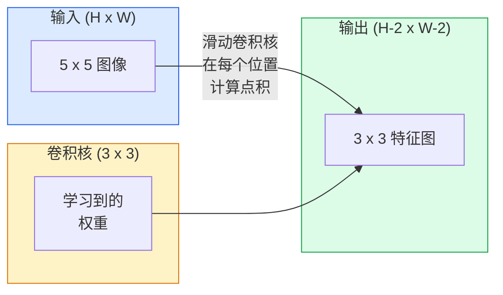
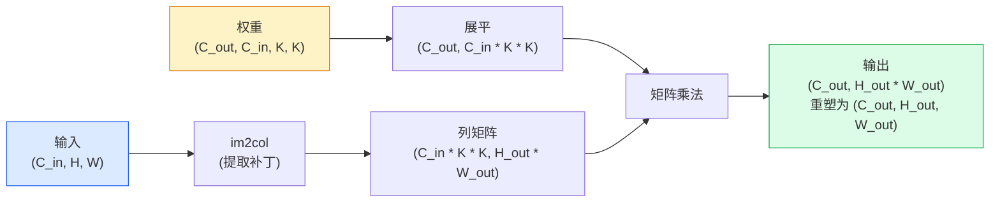

# 从零实现卷积 (Convolutions from Scratch)

> 卷积就像是一个在图像上滑动的微型全连接层，在每个位置共享相同的权重。

**Type:** Build
**Languages:** Python
**Prerequisites:** 阶段 3（深度学习核心），阶段 4 课程 01（图像基础）
**Time:** ~75 分钟

## 学习目标

- 仅使用 NumPy 从零实现 2D 卷积，包括嵌套循环版本和向量化的 `im2col` 版本
- 计算任意输入尺寸、卷积核大小、填充和步长组合下的输出空间尺寸，并推导 `(H - K + 2P) / S + 1` 公式
- 手动设计卷积核（边缘检测、模糊、锐化、Sobel 算子）并解释为什么每个核会产生特定的激活模式
- 将卷积堆叠为特征提取器，并建立堆叠深度与感受野大小之间的联系

## 问题背景

对于一张 224x224 的 RGB 图像，一个全连接层每个神经元需要 224 * 224 * 3 = 150,528 个输入权重。一个拥有 1,000 个单元的单隐藏层就已经有 1.5 亿个参数了——这还是在你还没学到任何有用特征之前。更糟糕的是，该层无法感知“左上角的狗”和“右下角的狗”是同一个模式。它将每个像素位置视为独立的，这对于图像处理来说是完全错误的：将猫平移三个像素不应该强迫网络重新学习这个概念。

图像模型需要的两个属性是**平移等变性**（输入移动时输出也随之移动）和**参数共享**（同一个特征检测器在任何地方运行）。全连接层两者都不具备，而卷积则免费提供了这两者。

卷积并非为深度学习而发明。它与 JPEG 压缩、Photoshop 中的高斯模糊、工业视觉中的边缘检测以及所有音频滤波器背后的操作是相同的。CNN 在 2012 年到 2020 年间统治 ImageNet 的原因在于，卷积是处理“邻近值相关且相同模式可能出现在任何地方”的数据的正确先验。

## 核心概念

### 单个卷积核的滑动

2D 卷积获取一个称为卷积核（或滤波器）的小权重矩阵，将其在输入上滑动，并在每个位置计算逐元素乘积之和。该和成为一个输出像素。



在 5x5 输入上的 3x3 具体示例（无填充，步长 1）：

```
输入 X (5 x 5):                卷积核 W (3 x 3):

  1  2  0  1  2                   1  0 -1
  0  1  3  1  0                   2  0 -2
  2  1  0  2  1                   1  0 -1
  1  0  2  1  3
  2  1  1  0  1

卷积核在每个有效的 3 x 3 窗口上滑动。输出 Y 为 3 x 3:

 Y[0,0] = sum( W * X[0:3, 0:3] )
 Y[0,1] = sum( W * X[0:3, 1:4] )
 Y[0,2] = sum( W * X[0:3, 2:5] )
 Y[1,0] = sum( W * X[1:4, 0:3] )
 ... 以此类推
```

那一个公式——**权重共享、局部性、滑动窗口**——就是全部思想。其他一切都是簿记工作。

### 输出尺寸公式

给定输入空间尺寸 `H`，卷积核大小 `K`，填充 `P`，步长 `S`：

```
H_out = floor( (H - K + 2P) / S ) + 1
```

记住它。在每个架构中你都要计算几十次。

| 场景 | H | K | P | S | H_out |
|----------|---|---|---|---|-------|
| 有效卷积，无填充 | 32 | 3 | 0 | 1 | 30 |
| 同等卷积 (保持尺寸) | 32 | 3 | 1 | 1 | 32 |
| 下采样 2 倍 | 32 | 3 | 1 | 2 | 16 |
| 池化 2x2 | 32 | 2 | 0 | 2 | 16 |
| 大感受野 | 32 | 7 | 3 | 2 | 16 |

“Same padding”意味着当 `S=1` 时选择 `P` 使得 `H_out == H`。对于奇数 `K`，即 `P = (K - 1) / 2`。这就是为什么 3x3 卷积核占据主导地位的原因——它们是拥有中心点的最小奇数卷积核。

### 填充 (Padding)

如果没有填充，每次卷积都会缩小特征图。堆叠 20 层后，你的 224x224 图像会变成 184x184，这不仅浪费了边界处的计算，还使需要匹配形状的残差连接变得复杂。

```
5 x 5 输入上的零填充 (P = 1):

  0  0  0  0  0  0  0
  0  1  2  0  1  2  0
  0  0  1  3  1  0  0
  0  2  1  0  2  1  0       现在卷积核可以以 (0, 0) 像素为中心，
  0  1  0  2  1  3  0       并且仍然有三行三列的值可以相乘。
  0  2  1  1  0  1  0
  0  0  0  0  0  0  0
```

实践中常见的模式：`zero`（最常见）、`reflect`（镜像边缘，避免生成模型中的硬边界）、`replicate`（复制边缘）、`circular`（环绕，用于环面问题）。

### 步长 (Stride)

步长是滑动的步进大小。`stride=1` 是默认值。`stride=2` 会将空间维度减半，这是在 CNN 内部进行下采样而不使用单独池化层的经典方法——现代架构（ResNet, ConvNeXt, MobileNet）都在某些地方使用步长卷积来代替最大池化。

```
5 x 5 输入，3 x 3 卷积核，步长 1:

  起始点: (0,0) (0,1) (0,2)        -> 输出行 0
          (1,0) (1,1) (1,2)        -> 输出行 1
          (2,0) (2,1) (2,2)        -> 输出行 2

  输出: 3 x 3

相同输入，步长 2:

  起始点: (0,0) (0,2)              -> 输出行 0
          (2,0) (2,2)              -> 输出行 1

  输出: 2 x 2
```

### 多输入通道

真实图像有三个通道。RGB 输入上的 3x3 卷积实际上是一个 3x3x3 的体积：每个输入通道对应一个 3x3 切片。在每个空间位置，你对所有三个切片进行乘法和求和，并加上一个偏置。

```
输入:    (C_in,  H,  W)        3 x 5 x 5
卷积核:  (C_in,  K,  K)        3 x 3 x 3 (一个卷积核)
输出:    (1,     H', W')       2D 特征图

对于产生 C_out 个输出通道的层，你需要堆叠 C_out 个卷积核:

权重:    (C_out, C_in, K, K)   例如 64 x 3 x 3 x 3
输出:    (C_out, H', W')       64 x 3 x 3

参数数量: C_out * C_in * K * K + C_out   (+ C_out 为偏置)
```

最后一行是你规划模型时需要计算的。一个 64 通道的 3x3 卷积在 3 通道输入上拥有 `64 * 3 * 3 * 3 + 64 = 1,792` 个参数。非常轻量。

### im2col 技巧

嵌套循环易于阅读但速度缓慢。GPU 喜欢大规模矩阵乘法。技巧在于：将输入的每个感受野窗口展平为大矩阵的一列，将卷积核展平为一行，整个卷积就变成了一次矩阵乘法 (matmul)。



所有生产环境的卷积实现都是这种方法的变体，外加缓存平铺技巧（直接卷积、Winograd、大核 FFT 卷积）。理解了 im2col，你就理解了核心。

### 感受野 (Receptive Field)

单个 3x3 卷积查看 9 个输入像素。堆叠两个 3x3 卷积，第二层的神经元就能看到 5x5 的输入像素。三个 3x3 卷积则达到 7x7。通常：

```
L 层堆叠 K x K 卷积后的感受野 (步长 1) = 1 + L * (K - 1)

带步长时:   感受野随每层的步长乘法增长。
```

“一路 3x3”之所以有效（VGG, ResNet, ConvNeXt），是因为两个 3x3 卷积看到的输入区域与一个 5x5 卷积相同，但参数更少，且中间多了一个非线性激活。

## 构建实现

### 第 1 步：填充数组

从最小的基元开始：一个在 H x W 数组周围进行零填充的函数。

```python
import numpy as np

def pad2d(x, p):
    if p == 0:
        return x
    h, w = x.shape[-2:]
    # 尾部轴技巧 x.shape[:-2] 允许函数处理 (H, W), (C, H, W) 或 (N, C, H, W)
    out = np.zeros(x.shape[:-2] + (h + 2 * p, w + 2 * p), dtype=x.dtype)
    out[..., p:p + h, p:p + w] = x
    return out

x = np.arange(9).reshape(3, 3)
print(x)
print()
print(pad2d(x, 1))
```

### 第 2 步：嵌套循环的 2D 卷积

参考实现——速度慢，但逻辑清晰。这在原则上就是 `torch.nn.functional.conv2d` 所做的事情。

```python
def conv2d_naive(x, w, b=None, stride=1, padding=0):
    c_in, h, w_in = x.shape
    c_out, c_in_w, kh, kw = w.shape
    assert c_in == c_in_w

    x_pad = pad2d(x, padding)
    h_out = (h + 2 * padding - kh) // stride + 1
    w_out = (w_in + 2 * padding - kw) // stride + 1

    out = np.zeros((c_out, h_out, w_out), dtype=np.float32)
    for oc in range(c_out):
        for i in range(h_out):
            for j in range(w_out):
                hs = i * stride
                ws = j * stride
                patch = x_pad[:, hs:hs + kh, ws:ws + kw]
                out[oc, i, j] = np.sum(patch * w[oc])
        if b is not None:
            out[oc] += b[oc]
    return out
```

四个嵌套循环（输出通道、行、列，加上对 C_in, kh, kw 的隐式求和）。这是你用来验证所有快速实现的基准。

### 第 3 步：使用手动设计的卷积核进行验证

构建一个垂直 Sobel 卷积核，将其应用于合成的阶跃图像，观察垂直边缘被激活。

```python
def synthetic_step_image():
    img = np.zeros((1, 16, 16), dtype=np.float32)
    img[:, :, 8:] = 1.0
    return img

sobel_x = np.array([
    [[-1, 0, 1],
     [-2, 0, 2],
     [-1, 0, 1]]
], dtype=np.float32)[None]

x = synthetic_step_image()
y = conv2d_naive(x, sobel_x, padding=1)
print(y[0].round(1))
```

预期在第 7 列（从左到右亮度增加）出现大的正值，其他地方为零。这一打印结果是你验证数学逻辑是否正确的“理智检查”。

### 第 4 步：im2col

将输入中每个卷积核大小的窗口转换为矩阵的一列。对于 `C_in=3, K=3`，每一列包含 27 个数字。

```python
def im2col(x, kh, kw, stride=1, padding=0):
    c_in, h, w = x.shape
    x_pad = pad2d(x, padding)
    h_out = (h + 2 * padding - kh) // stride + 1
    w_out = (w + 2 * padding - kw) // stride + 1

    cols = np.zeros((c_in * kh * kw, h_out * w_out), dtype=x.dtype)
    col = 0
    for i in range(h_out):
        for j in range(w_out):
            hs = i * stride
            ws = j * stride
            patch = x_pad[:, hs:hs + kh, ws:ws + kw]
            cols[:, col] = patch.reshape(-1)
            col += 1
    return cols, h_out, w_out
```

这仍然是一个 Python 循环，但现在繁重的工作将由一次向量化的矩阵乘法完成。

### 第 5 步：通过 im2col + matmul 实现快速卷积

用一次矩阵乘法替换四重循环。

```python
def conv2d_im2col(x, w, b=None, stride=1, padding=0):
    c_out, c_in, kh, kw = w.shape
    cols, h_out, w_out = im2col(x, kh, kw, stride, padding)
    w_flat = w.reshape(c_out, -1)
    out = w_flat @ cols
    if b is not None:
        out += b[:, None]
    return out.reshape(c_out, h_out, w_out)
```

正确性检查：运行两种实现并进行比较。

```python
rng = np.random.default_rng(0)
x = rng.normal(0, 1, (3, 16, 16)).astype(np.float32)
w = rng.normal(0, 1, (8, 3, 3, 3)).astype(np.float32)
b = rng.normal(0, 1, (8,)).astype(np.float32)

y_naive = conv2d_naive(x, w, b, padding=1)
y_im2col = conv2d_im2col(x, w, b, padding=1)

print(f"最大绝对差: {np.max(np.abs(y_naive - y_im2col)):.2e}")
```

`最大绝对差` 应该在 `1e-5` 左右——这是浮点数累加顺序导致的差异，而非 Bug。

### 第 6 步：手动设计的卷积核库

五个滤波器展示了单个卷积层在训练前能表达的内容。

```python
KERNELS = {
    "identity": np.array([[0, 0, 0], [0, 1, 0], [0, 0, 0]], dtype=np.float32),
    "blur_3x3": np.ones((3, 3), dtype=np.float32) / 9.0,
    "sharpen": np.array([[0, -1, 0], [-1, 5, -1], [0, -1, 0]], dtype=np.float32),
    "sobel_x": np.array([[-1, 0, 1], [-2, 0, 2], [-1, 0, 1]], dtype=np.float32),
    "sobel_y": np.array([[-1, -2, -1], [0, 0, 0], [1, 2, 1]], dtype=np.float32),
}

def apply_kernel(img2d, kernel):
    x = img2d[None].astype(np.float32)
    w = kernel[None, None]
    return conv2d_im2col(x, w, padding=1)[0]
```

应用于任何灰度图像，模糊会柔化图像，锐化会使边缘清晰，Sobel-x 会激活垂直边缘，Sobel-y 会激活水平边缘。这些正是 AlexNet 和 VGG 中第一个训练好的卷积层最终学习到的模式——因为无论后续任务是什么，好的图像模型都需要边缘和斑点检测器。

## 使用方法

PyTorch 的 `nn.Conv2d` 通过自动求导、CUDA 内核和 cuDNN 优化封装了相同的操作。形状语义完全相同。

```python
import torch
import torch.nn as nn

conv = nn.Conv2d(in_channels=3, out_channels=64, kernel_size=3, stride=1, padding=1)
print(conv)
print(f"权重形状: {tuple(conv.weight.shape)}   # (C_out, C_in, K, K)")
print(f"偏置形状:   {tuple(conv.bias.shape)}")
print(f"参数数量:  {sum(p.numel() for p in conv.parameters())}")

x = torch.randn(8, 3, 224, 224)
y = conv(x)
print(f"\n输入形状: {tuple(x.shape)}")
print(f"输出形状: {tuple(y.shape)}")
```

将 `padding=1` 改为 `padding=0`，输出会降至 222x222。将 `stride=1` 改为 `stride=2`，输出会降至 112x112。与你上面记住的公式一致。

## 交付成果

本课程产生：

- `outputs/prompt-cnn-architect.md` — 一个提示词，给定输入尺寸、参数预算和目标感受野，设计出每一步都具有正确 K/S/P 的 `Conv2d` 层堆叠。
- `outputs/skill-conv-shape-calculator.md` — 一个技能，按层遍历网络规范，并返回每个块的输出形状、感受野和参数数量。

## 练习

1. **(简单)** 给定 128x128 灰度输入和堆叠 `[Conv3x3(s=1,p=1), Conv3x3(s=2,p=1), Conv3x3(s=1,p=1), Conv3x3(s=2,p=1)]`，手动计算每一层的输出空间尺寸和感受野。使用 PyTorch 的 `nn.Sequential` 虚拟卷积进行验证。
2. **(中等)** 扩展 `conv2d_naive` 和 `conv2d_im2col` 以接受 `groups` 参数。证明 `groups=C_in=C_out` 可以复现深度可分离卷积 (depthwise convolution)，且其参数数量为 `C * K * K` 而不是 `C * C * K * K`。
3. **(困难)** 手动实现 `conv2d_im2col` 的反向传播：给定输出的梯度，计算 `x` 和 `w` 的梯度。使用相同输入和权重与 `torch.autograd.grad` 进行验证。技巧：im2col 的梯度是 `col2im`，它必须累加重叠的窗口。

## 关键术语

| 术语 | 人们怎么说 | 实际含义 |
|------|----------------|----------------------|
| 卷积 (Convolution) | “滑动滤波器” | 在每个空间位置应用具有共享权重的可学习点积；数学上是互相关，但大家都叫它卷积 |
| 卷积核 / 滤波器 (Kernel / filter) | “特征检测器” | 一个形状为 (C_in, K, K) 的小权重张量，其与输入窗口的点积产生一个输出像素 |
| 步长 (Stride) | “跳多远” | 连续卷积核放置之间的步进大小；步长 2 会使每个空间维度减半 |
| 填充 (Padding) | “边缘补零” | 在输入周围添加额外值，以便卷积核可以以边界像素为中心；`same` 填充使输出尺寸等于输入尺寸 |
| 感受野 (Receptive field) | “神经元能看到多少” | 给定输出激活所依赖的原始输入补丁，随深度和步长增加 |
| im2col | “GEMM 技巧” | 将每个感受野窗口重新排列成列，使卷积变成一次大矩阵乘法——这是每个快速卷积核的核心 |
| 深度卷积 (Depthwise conv) | “每个通道一个核” | `groups == C_in` 的卷积，每个输出通道仅由其匹配的输入通道计算得出；是 MobileNet 和 ConvNeXt 的骨干 |
| 平移等变性 (Translation equivariance) | “移入，移出” | 输入移动 k 像素，输出也移动 k 像素的属性；通过权重共享免费获得 |

## 进一步阅读

- [深度学习卷积算术指南 (Dumoulin & Visin, 2016)](https://arxiv.org/abs/1603.07285) — 权威的填充/步长/空洞卷积图解，每门课程都在默默引用
- [CS231n: 用于视觉识别的卷积神经网络](https://cs231n.github.io/convolutional-networks/) — 经典的讲义，包含原始的 im2col 解释
- [带注释的 ConvNet (fast.ai)](https://nbviewer.org/github/fastai/fastbook/blob/master/13_convolutions.ipynb) — 从手动卷积到训练数字分类器的笔记本教程
- [CNN 的感受野算术 (Dang Ha The Hien)](https://distill.pub/2019/computing-receptive-fields/) — 论文质量的交互式感受野计算解释器